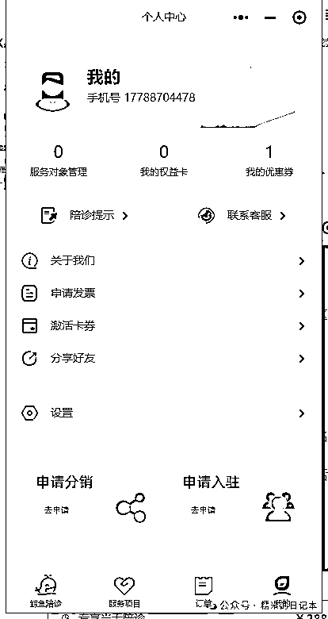
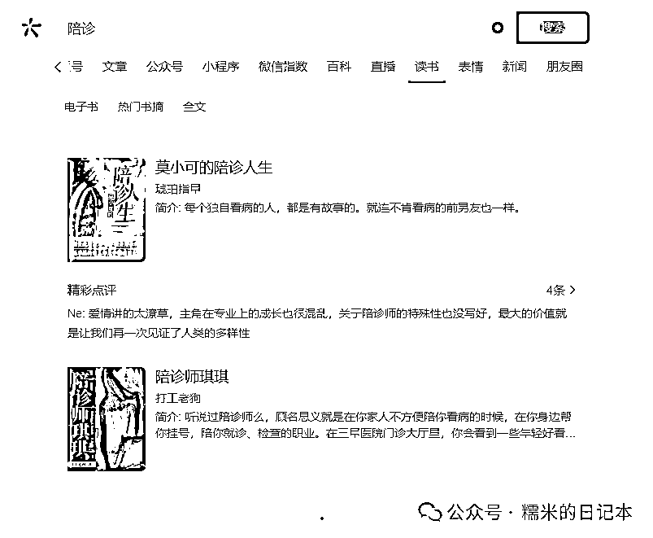

# 全自媒体平台，陪诊账号调研（3）

> 原文：[`www.yuque.com/for_lazy/zhoubao/ag4mx0nik5zullzg`](https://www.yuque.com/for_lazy/zhoubao/ag4mx0nik5zullzg)

## (8 赞)全自媒体平台，陪诊账号调研（3）

作者： 糯米

日期：2024-07-25

**糯米认为，作为陪诊行业的操盘手，一定要掌握最新的行业动向，其中就包含了陪诊自媒体获客，即**

陪诊行业，近期大家都是在怎么通过各种自媒体平台获客，获客做得怎么样，都在怎么玩耍？

前两天我们聊过了微信生态下，**公众号、视频号**，这两个领域的陪诊内容获客，根据微信指数的指示，这两个平台外，类似于搜一搜、直播、网页，几乎没有什么陪诊内容热度

因此，今天糯米在这里把微信生态的陪诊调研全部收个尾

首先我们来看看，**问一问**，这个微信生态的知乎

这个东西是火了一阵子的，大概是去年 10 月份左右吧，当时以为嗅到了机会，大家都很狂热

那就目前而言，糯米调研的结论是

问一问里关于陪诊的内容太少了，少得可怜，不仅内容少，账号也少。以“陪诊”为账号词条的账号总共只有十几个，大部分都是低活跃甚至无活跃的，只有三两个账号坚持发了几百条回答，收到了几百个赞，相当于平均每个回答一个赞，估计坚持那么久，人心都凉凉了。其中有两个账号是医药健康垂直回复，有一个账号是医药+泛问题回复。总之目前问一问这个平台的陪诊“行情”不好，不过能看出来，陪诊甚至医疗内容在问一问这边几乎没啥管控，7.23 还有账号在回答中写一些医疗用词。

针对这个平台，糯米的想法是这样的

**量小的平台，竞争内容少的，可以先铺一点量，就放着，等有人跑出结果了，或者平台出现增量的时候，及时进场，这就需要操盘手不断对各个平台进行监控了**

（ps.讲两句骚话，平台目前的体量小，属于是时势问题，凡人左右不了，就不要瞎使劲儿）

OK，接下来我们看下一个板块，**小程序**

糯米还是一样哈，先给平台调研后的浓缩结论

首先，小程序调研是不太能直接获取对方的获客情况信息的，但比较能有意义的点在于，我们能看对方的 sku，小程序设计，一些对客户对陪诊师的规章制度，以及平台的细节玩法，大家的 sku 都是差不太多的，比较值得一提的，除了常规的陪诊，有的小程序加入了陪护，助浴等照护服务，目前糯米注意到的还有，部分小程序似乎像达成共识了一样，都开放了分销权限，这非常值得思考，也许这个是一个不错的裂变传播途径，特别是目前陪诊行业很难通过自媒体打开宣传通道的情况下。

然后我们逐步分析几个小程序

首当其冲的是浙里办，但其实浙里办提供的陪诊叫“云陪诊”，意思就是 AI 就诊助手，能在一定程度，满足部分人群，满足部分需求，跟我们模式不搭尬。

这是一个深圳的公司，成立了确实 2 年了（对方直播时去交流了两句），认缴 100w

**其实根据他们的规则，是很好抄作业搭建自己的产品规则体系的**

像这些页面就可以看人家 sku 的设计，以及营销动作

以前我一直感觉，陪诊这个东西很难做什么营销推广，怎么会有人想营销陪诊呢？谁愿意提前为了还没发生的陪诊需求付费，甚至提前领取优惠券呢？但现在看来是我浅薄了

**视频推广其实也算一种营销，平台优惠政策也是一种促进客户沉淀到平台的营销动作，埋头做事肯定是不够的，还得运筹帷幄整个市场**

类似于这个地方的陪诊师护工合作协议，也是一个很好的，可以抄作业的东西

上面这些设计都是可以抄作业的地方，这里顺带了解到了，原来小程序的客服还能直接接入到微信对话窗口

继续，下一个小程序，还算比较知名，南京的鲸鱼陪诊，2023 年初注册的，100w 认缴资本

同样是 sku 的设计参考

这边的页面设计，功能架构也是比较完善的，也有我上面提到的，分销权限的对外开放，多看看牛的平台怎么玩，如何决策的，可以品到一些蛛丝马迹

再往下一个小程序我就要重点吐槽了

这个小程序有什么问题呢？说实话，是真的做得有点水

首先是老套的促单套路，现在很多做得好的平台都是简单干净为佳的，什么一堆广告啊什么的那种软件 app，定位都是下沉的

还有这个，这个是所谓的入驻协议，陪诊师入驻协议根本都不是协议

这个是下单协议，竟然是弹出来一个客服微信，真的是不要太水

那综上呢，我们在小程序这一块很难直接分析出对方的获客情况，但我们能通过小程序去借鉴同行的交付，规则，sku，嗅到一些市场营销，运营维护的蛛丝马迹

那对于微信生态的其他领域，能值得讲一下的，就只有**直播**了，微信指数是在 2023 年的 10 月新增了直播领域的热度词条收录

但就目前看来，直接垂类的陪诊直播是搜不到的，只能通过关注到具体的公众号、视频号了，才能看到陪诊相关的直播

而目前这个类目的直播，就算是知名度比较大的，像是“陪诊界”，一场直播也没有多少流量的，但我惊奇的发现，不管怎么说，这个内容话题起码在视频号直播没有什么管控

那最后，像是微信剩下的，新闻啊，百科呀，读书呀，表情呀，都没有什么好讲的了

至此，微信生态的所有领域的陪诊内容/账号/玩法，的调研，都结束了，明天我们继续下一个平台继续调研

* * *

评论区：

暂无评论

* * *