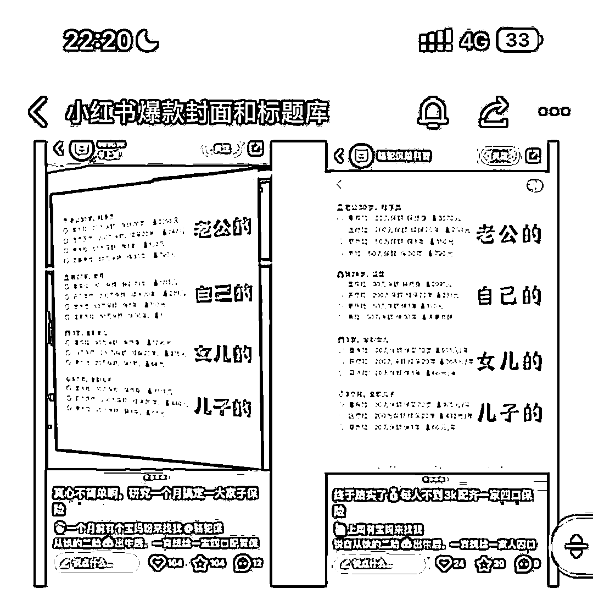
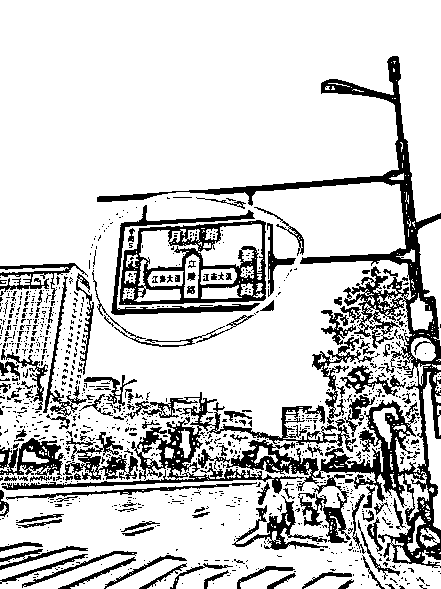

# 1 万+圈友看过的「小红书获客」后续，我悟到了「小红书爆款」封面的奥义！附：50+案例

> 原文：[`www.yuque.com/for_lazy/zhoubao/nacw918uzmo5cdb2`](https://www.yuque.com/for_lazy/zhoubao/nacw918uzmo5cdb2)

## (54 赞)1 万+圈友看过的「小红书获客」后续，我悟到了「小红书爆款」封面的奥义！附：50+案例

作者： 叶凡🌱funny

日期：2024-07-17

生财圈友好，《小红书低粉高获客玩法，每月精准「引流高客」800+，加 V 率 30%-40%，1.5 万字 SOP》**被 1 万+圈友看过**之后，可能我运气来了还是咋的，意外的悟到了**小红书爆款封面的精髓！**

👉*上篇帖子：**https://lwsczvh505.feishu.cn/docx/I8afdNOmtojPGuxzu2TcqhH4n2g*

最新出炉，特来给大家分享~😄~

* * *

**事情是这样的：**

上周把手机掉在公司茶水间，结果！意外打通了做小红书爆款封面的任督二脉！

我做了 1 年半的小红书账号，跑通了私域导流的完整链路，出爆款的时候，日咨询做到 500+。

小红书的爆款笔记封面我刷了超多，还整理了**40 多种常见的爆款封面**，在日常创作中套用。

比如这个纸片样式，就是个爆款封面的样式，只需要把纸片里的字抠图处理，换成自己的行业的标题进去，**一样能出爆款**。

再比如，把左边这个爆款笔记封面里的字扣掉，换成自己行业的。

因为已经积累的一年多的爆款封面库，「直接套用」到自己的笔记上，完全不影响我出爆款导流笔记。

但是，我一直没想明白，**第一个做出这种样式封面的人，到底是什么脑洞想到的？为啥这样的封面样式会火？**

直到那天，看到被我遗留的手机，我拿起工作手机拍了这样一张照片

看起来平平无奇，但是我的脑子像瞬间插了电，联想到了一个爆款封面样式，就是这类拍手机备忘录的爆款封面

于是，我回家路上顺带手，拿起工作手机，给明天计划发布的小红书笔记，拍了个同款封面。

拍完之后，我一抬头，看到了路上的指示牌，呀！把文字扣掉，不就是我之前看到过的另一个爆款封面样式吗？

**接下来，惊喜出现了！！！**

我联想到上周刚注册的一个小红书新号，平台给我推送的那批爆款笔记封面。（下文会展示）

两个信息在脑子里一结合一分析，彻底解锁了小红书封面的精髓！

兴奋的把车停在路边，给我群里的小伙伴分享好消息，一路上收集了一堆封面素材。

OK，轻松的看完了我的整个意识流，接下来分享，小红书的爆款封面精髓，到底是啥？

接下来我会用「大量爆款封面案例」，给大家讲透。

这篇文章，会**颠覆你对小红书用户对封面喜好的认知**！

因为考虑到看这篇帖子的圈友，都是想做或者在做小红书，所以接下来我讲系统一点。

01 小红书封面有多重要？

02 爆款封面的精髓是什么？

03 如何制作爆款封面？

04 做小红书的 2 个思考

**01 小红书封面有多重要？**

小红书区别于抖音/视频号平台一个很大的点，在于它是「双列模式」，而不是抖音的瀑布流模式。

双列模式，就是说你打开 app 之后，笔记都是双排呈现的。

用户是先看你笔记的封面和标题，对你的笔记内容感兴趣的前提下，才会点开你的笔记看内容，才可能会产生点赞、评论、关注、私信咨询等系列动作，最终帮你完成变现。

这就意味着，即使你内容做的再好，封面很差，那么笔记数据必定好不到哪里去；

同样的，内容不好，但是封面很好，阅读量也仍然能够起来。

已经在做小红书的朋友，如果阅读量不高，封面就要重点重视起来了。

只要你的封面设计好，封面点击率提升 10%，你最终的变现能力就你能多提升 10%。

如果你当下封面做的还不是很成熟，那通过优化封面，来成倍的提高你的变现能力，还是很有希望的。

**02 爆款封面的精髓是什么？**

你以为的小红书封面是精致的、设计感的、美丽的，但对于大部分的赛道来说，用户真正喜欢的封面却是这样的。

这是我新注册的一个小红书账号，平台给我推荐的笔记，**全都是爆款**，那这些爆款封面就非常的值得研究了。

花 1 分钟认真刷完这些封面，你就能够能强烈的 get 到小红书封面的特点——**真实素人感**

可能还带些奇奇怪怪、可可爱爱的感觉。

👉比如说像这样的聊天截图，你会发现出现了好几次

👉还有这种消息弹框

👉还有这种手写备忘录，我之前自己测试的阅读量 5 万+，这类出爆款的笔记特别多

👉还有这类工资条儿截图

👉备忘录截图

👉A4 纸上马克笔手写类

👉还有电脑实拍图

大家感觉到了吗？

**小红书爆款笔记的一大精髓就是：**

**真实素人感!**

**真实素人感!**

**真实素人感!**

全都是我们普通人生活中的真实画面

这也是为什么小红书 app 的启动页是：“小红书，你的生活指南”

**03 如何制作爆款封面？**

只要把握住「真实素人感」这个精髓，就可以源源不断做出符合小红书特色的爆款封面。

比如说我那天一路上就收集了非常多的素材，全都是真实的生活场景，都可以拿来做小红书的封面。

比如说这张图片，我就可以把“安全快速通行”这六个字 P 掉，然后换成我们行业的一个爆款标题上去，那么它就是一个比较有小红书特色的封面。

再比如说这个路标指示牌，我也可以把这个地方的文字给它 P 掉，然后给它放大一点，放一个标题进去。

这个指示牌呢，我以前也有刷到过类似的灯牌样式，在灯牌上加了一段文字标题。

再比如说，我在小区楼下那个墙上看到了这样子一个空白的板子，那么我就可以在这个空白的板子上面写一个爆款标题。

比如，小区门口这个房东直租图，我也可以把它直接 P 掉，换成把爆款标题。

再比如，我路过的这个公共自行车厅，它的这个广告牌，我仍然可以把广告牌上面的字给它 P 掉，换个行业里的爆款标题上去。

以上这样一通操作，第一它保证了我的这个封面里面有爆款的标题，它是能够吸引人的，第二，它的封面样式，又符合小红书的这种真实素人感。

看到这里，有没有击穿你的创作灵感哈哈~

**轻松实现：小红书爆款封面信手拈来！**

**04 做小红书的思考**

最后，分享我的 2 个思考

💡**思考 1：封面不必精致**

都知道小红书用户质量高，2 亿的月活用户，月均可支配消费 4000+元，50%一二线城市，70%都是 90 后。

所以绝大部分人，觉得这样的一群用户，应该都喜欢看很精致、有设计感的封面，但事实真的这样吗？

你看完上面这些爆款封面，是不是已经颠覆了你对小红书用户喜好的认知。

这个误区我一年前也疑惑过，测试过，最终也验证了，还是素人感的封面综合效果更好。

我们做过高端医疗险的笔记，客单价是几千到几万的产品，受众也属于高客单价人群。

左边两个就是我们花一上午精心设计的封面图，右边是只用了 30 秒写的贼粗糙的便利贴封面，但后者风格的笔记带来的咨询就是更多，制作也更快。

而且，你再看小红书手机端的发布笔记的入口，是有一个文字封面功能（下图左 1），可以一键生成文字封面（下图右边 4 个）

小红书既然专门给这种文字做了封面生成功能，可见，这种封面就是适合平台用户的，不然小红书的产品经理也没必要单独开发这个功能吧。

**💡****思考 2：保持思考，多多尝试**

以上我对封面的思考，对大部分的赛道来说，应该都是比较通用的，毕竟我确实在多行业都看到了类似封面。

但在某些赛道，我感觉不一定适合。比如美妆赛道、服装带货，这些赛道它可能还是要精致一点，所见即所得，呈现美好，前后对比，激发用户购买欲。

而且，很多东西在 A 那里可以，在 B 这里就不行，在 C 那里不行的，在 D 这里又行了。

所以，保持思考，多尝试，不用把某人的话当成圣旨，唯一能得到答案的方法，就是去做。

**这也是为啥我要在开头分享我的意识流，其实是想共享这个思考的过程。**

**END**

欢迎交流~

* * *

评论区：

康先生 : 厉害
大老朱 : 实用干货
好好学习 : 干货
绢绢满愿学堂 : 学习了
叶凡🌱funny : 一起生财有术(￥ε￥)
叶凡🌱funny : 一起生财有术鸭🦆 叶凡🌱funny : 嘿嘿，一起生财有术•͈ᴗ⁃͈
叶凡🌱funny : 2024 年拿到理想结果↖(^ω)↗

* * *