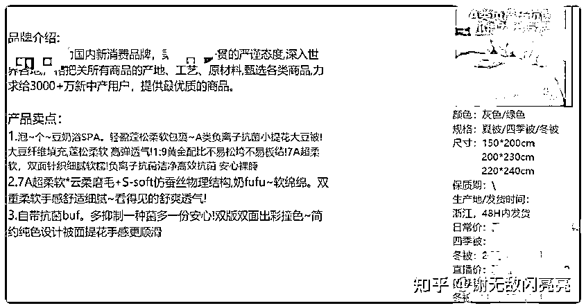

# 4 小时爆卖 160 万！小红书直播我彻底玩明白了

> 原文：[`www.yuque.com/for_lazy/zhoubao/xet8ryrebwdyqb0a`](https://www.yuque.com/for_lazy/zhoubao/xet8ryrebwdyqb0a)

## (19 赞)4 小时爆卖 160 万！小红书直播我彻底玩明白了

作者： 谢无敌🐱闪亮猫传媒

日期：2024-07-19

Hi~生财的朋友们大家好~ 我是你们的老朋友-谢无敌，闪亮猫传媒创始人。

最近很多人在问：**店铺没有粉丝，可以做直播吗？**

当然可以！！

前几天我被小红书官方邀请分享——低粉商家如何做好店播，稳定出单，也解答了很多人关于直播的疑惑。

其实，我的家居账号粉丝并不多，但在 618 期间直播却再一次突破记录。

单场直播 GMV 达到了 160W！位列实时买手榜 Top3！

这足以证明，不是明星、达人，一样能靠小红书直播赚钱。

今天我来和大家深入聊聊，做好一场直播的秘诀——提升直播间人数和转化率。

下面我会针对这两点，结合直播间流量的底层逻辑，教大家**如何创作预约笔记、直播笔记，以及如何选品、抽奖、话术。**

让你从 0-1 快速掌握直播带货思路，实现直播生意破 0。

## **01 如何提升直播间流量**

首先我们要知道，直播间的流量从哪儿来？如何获得直播间流量？

明确了这两点，才能吸引更多人进入我们的直播间

### **1、小红书直播流量入口**

目前小红书直播间的流量，主要来自 4 个地方：

①直播间内跳转（上下滑）

②直播间分享

③笔记：预约笔记、直播当天新发笔记

④店铺/购物频道/订单等

最后一项占比不多，前三项流量占比是最高的，尤其第二项、第三项都是我们能够人为提升的，一定要重点做攻略。

### **2、如何获得更多流量曝光**

**①直播间时长**

很多人做直播的第一个问题就是：一场直播播多久比较好？

根据官方的政策，以及我自己做直播这么久的经验来说，**个人建议一周固定 2-3 场，每场 3 小时以上最佳。**

可以按这个节奏先测试直播效果，如果第一个月转化不错的话，再慢慢增加直播频率。

**②用户停留时长/互动率**

直播间能否留住用户，是平台衡量你直播质量的一个标准，所以**用户停留时长、互动率很重要。**

每个行业的标准不同，但只要记住，用户停留得越久直播间流量就越多。

如果直播间人比较少，你可以利用助理号或“水军”在直播间引导评论，充当气氛组，提升用户互动率。

**③直播笔记预热**

除了直播互动外，直播预约人数也决定了直播间的流量曝光。

可以在开播前的一周或者 3-4 天内**发布预约笔记，**让更多人知道你要直播的消息，吸引精准用户预约直播。

在直播当天发布笔记，提升被平台推送到首页的概率，增加进房率。

**④封面点击率**

**直播间进房率=进直播间人数/直播预约人数。**

而直播间的封面就和笔记创作一样，直接影响直播间进房率。

可以准备 3-5 张不同类型的封面图，通过关注直播后台封面数据，当低于 1 或 2%时，及时优化调整。

**⑤直播榜单：店铺榜/主理人榜/品牌榜**

如果前面几项都做得好，直播间就有可能登上直播榜单，为直播间引来更多流量，大大提升进房率。

## **02 如何做好直播预热**

既然了解了小红书直播的流量入口，以及如何获取更多的流量曝光，那么下一步当然是为直播做准备了。

首先，我们可以通过优质的关联种草笔记，来提升直播间的预约量，常见的有 3 种：

**①合集拼图真人秀：**真人+场景+不同产品图的合集形式

**②单场景真人摆拍：**单图+真人+多个产品

**③无真人类：**无真人出镜的的产品合集（单图多品/单图单品拼图）

参考这些优质案例，其实好的预约笔记就是：真人、产品合集、视频化。

通过真实的人或场景突出多样的产品，吸引用户预约直播。尤其视频笔记数据更好，更适合做预约笔记。

而在正式创作笔记之前，我们先要确定选题。

### **1、确定笔记选题**

一个优质的选题，不仅能提升笔记的曝光量，还能提升直播间的预约量，分享 4 个选题方法：

**①关键词搜索**

搜索关键词是最快、最高效掌握直播预约流量的方法。

在首页搜索栏输入**“你所在的赛道或产品+直播预告”，**比如你是珠宝赛道，就可以搜索“珠宝直播专场”。

找到最新的优质笔记，进行重点对标。

**② 长尾词搜索**

在搜索框输入“你所在的赛道或产品+直播预告”，

比如，“珠宝直播预告”，在下拉词中，找到与你产品相关的词作为选题。

也可以点进对应关键词，找到优质笔记，来创作自己的预约笔记。ps：别忘了一定要是**近三个月的最新笔记~**

**③ 同行直播间**

通过搜索“品类词”，比如：“珠宝”，点击“直播间”，就可以看到很多正在直播的同行账号。

点进他们的账号主页，找到预约笔记借鉴模仿。

**④ 直播广场**

除此外，我们还可以通过“直播广场”，找到具有爆款潜质的笔记账号主页进行直播选题的收集。

**⑤笔记选题公式**

我们也可以直接套用选题公式：

**季节/节日主题：**用**当下热门话题**吸引目标用户点击阅读。

例：夏日百搭、缤纷清透

**系列主题：**从产品的**不同风格、不同场景**切入，圈中精准用户需求，吸引眼球。

例：古着穿搭、vintage

**新品预告：**以**新款**为亮点，吸引目标用户关注，提升笔记点击率、预约量。

例：新品+体验官

**凸显数字：**用**显眼的数字**体现产品的多样性，吸引用户点击，提升笔记曝光。

例：1000 件渐变裙

### **2、直播笔记标题**

除了预约笔记选题外，影响直播间预约人数的还有笔记。

笔记标题可以**侧重笔记重点和吸睛点，**同时突出直播的主题、卖点、风格特色。

分享 3 个小技巧，快速优化直播笔记标题，掌握爆款笔记流量~

**①用具体画面/符号/数字进行结果描述**

原标题：南洋风家居搭配技巧

修改后：南洋风家居搭配分享，闭眼入轻松 get

**②怎么做+可以得到什么好处/解决什么痛点**

原标题：家居好物分享

修改后：这些家居夏凉好物，清爽过夏天

**③风格+产品/氛围+直播福利内容**

原标题：床品上新

修改后：天丝凉感被上新，首发福利送套

### **3、直播间封面图**

除了标题，就是封面了，一般来说，直播封面点击率达到 3%是比较高的数据。

想要提升封面点击率，可以参考这 3 种优质直播封面：**人物+商品、人物+场景、凸显个人风格的。**

其实还是不变的带货三要素——人+货+场。

甚至不需要多好的审美，只要找准对标、学习模仿，突出优势就可以了。

### **4、社群、个人简介**

开播前、开播时通过**小红书的粉丝群、私域群聊**分享直播间，或是在**个人简介、瞬间动态**里展示直播时间。

让新老用户随时了解我们的直播动态，增加直播间曝光、预约流量。

## **03 如何提升直播间转化率**

小红书直播不需要激情叫卖，关键还是抓住核心问题、用对方法。

### **1、选品策略：**

经过我们团队和陪跑学员们的测试，发现一般直播间选品数量在**30-40 个链接**是最好的。

产品太多，不仅会增加主播的讲解压力，用户也不知道怎么选择，对转化反而会有负面影响。

**①秒杀品/福利品（必有）：占比 10%，数量 3-4 个**

放在直播间最上面的位置，做引流产品，吸引用户浏览下单

**②畅销爆款（必有）：40%，12-16 个**

用爆款产品为店铺做背书，吸引用户浏览下单

**③利润款：30%，9-12 个**

能卖得动且能赚得到钱，拉大利润空间

**④特色款：20%，6-8 个**

体现品牌独特调性，为店铺做宣传

### **2、直播节奏**

**开场 10 分钟：**与粉丝简单互动，等待直播间人数增加，通过福利品，吸引用户留在直播间。

遇到直播间人数、销量破记录的“小高峰”时，用抽奖福利把用户持续地留在直播间，在之后的直播中，也能提升用户的下单概率，提升店铺持续性的转化。

**中途若干小时：**这个时间主要是畅销品、利润品、特色品的讲解。

通过与粉丝的互动，提升用户的参与感，或**者安排小助理、客服、朋友来充当“气氛组”，**增加新进直播间用户的停留时长。

**收尾半小时：**最后半小时也是一个转化小高峰，可以着重讲解热门的畅销产品，做一波促单转化。也可以预告下一场直播时间，拉动下一场的预约人数。

### **3、直播间抽奖**

定时发放福利能更有效地留住用户，稳定直播间流量，提升产品转化，比如**红包、赠品、折扣券**等。

**抽奖时间：**可以设置每 15 分钟抽一波小奖，每整点抽一波大奖。

**抽奖形式：**吸引用户关注、加入粉丝团、下单等方式进行抽奖。ps：加入粉丝团、下单抽奖是促单效果最好的两个方式。

**抽奖或者福利提醒：**利用小红书粉丝群、直播间右上角公告、直播间置顶评论等方式，进行多次提醒，引导用户参加

### **4、粉丝群**

其实只要做好小红书粉丝群的基础运营，就能大大提升直播间转化率。

**开播前：**通过小红书群聊功能推送预约笔记，用**粉丝福利、新品上市**等方式，吸引用户预约直播间

**开播时：**增加直播间推送量，引导粉丝进入直播间，提高进房率。同时也可以把直播间用户引导进粉丝群，方便后续转化。

**开播后：**可以在群里为用户**提供售后服务、推荐产品（群内购）**提升店铺的关联产品销量，同时预告下一场直播。

### **5、直播话术**

小红书直播对普通人来说非常友好，话术并没什么特别的套路。

我整理了 4 个互动方法，便于大家快速掌握，不管是新手博主，还是品牌商家，都能轻松完成一场带货直播~

另外，需要特别注意的是“违禁词”。

像**“最低”、“第一”等这类极限词的违规风险就很高，**如果没有真实的数据支撑，很容易被平台检测，判定违规，导致直播间被关停。

可以让助理在旁边及时提醒，避免违规。或者使用其他简单易懂的词语代替，来降低违规风险。

## **04 品牌如何找买手合作**

除了自播外，还可以通过**买手合作**的方式，提升品牌在平台的覆盖率，完成矩阵布局，提升整体销量。

合作流程也非常简单，通过“蒲公英中心的买手中心”就能完成博主筛选、联系、合作等一系列动作。

那，应该如何与买手谈合作呢？

**①坑位费和佣金：**

首先，确认买手是否有坑位费，佣金的比例是多少；

**②货盘、手卡：**

其次，准备好产品货盘，方便买手了解产品信息；

**③确定时间：**

了解买手档期，并确定直播时间，便于后续跟进；

**④合作方式：**

与达人进行沟通，确认是否需要寄样品，方便直播间的产品展示，促进商品的下单转化；

但，特殊品类例外，比如**虚拟类产品，或是大件的家居用品，**就需要沟通直播产地或直接在直播间挂链接的问题了；

**⑤直播露出时长**

在沟通好一系列问题后，最重要的就是明确产品在直播间具体的展示时长，产品转化的数据。

既要保证产品得到充足展示，又要沟通确认产品的实际转化数据，避免因销量问题与博主产生矛盾。

不管怎样，只要你**摸清平台的底层逻辑，用正确的方法和技巧，**通过不断地优化调整，通过小红书直播，也能快速爆单，实现弯道超车。

* * *

评论区：

大柚子 : 你是我的神[色]
书豪 : 你是我的神[色]
小六六 : 你是我的神[色]

* * *