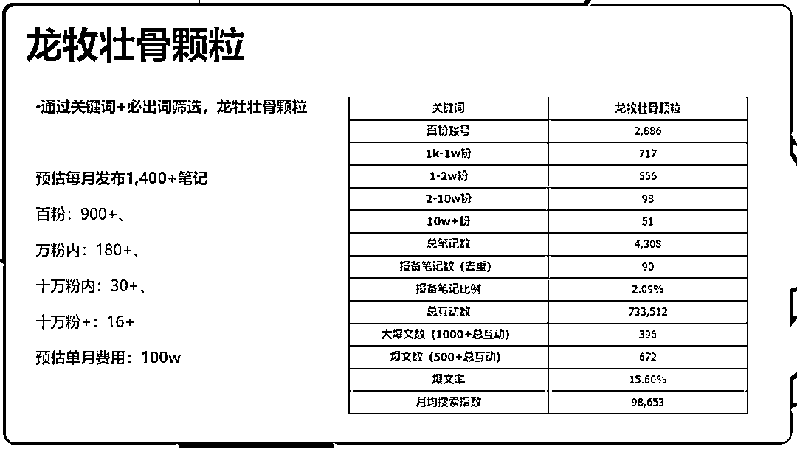
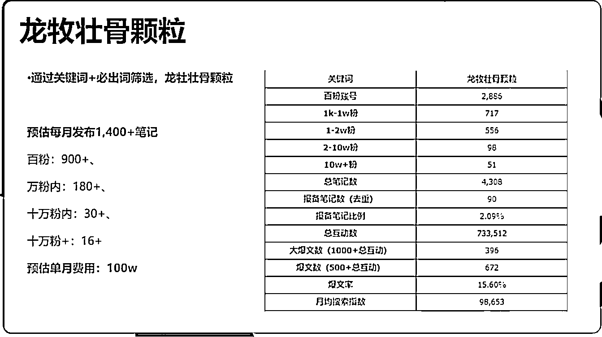
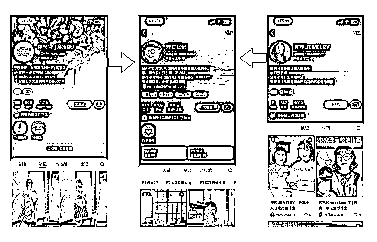
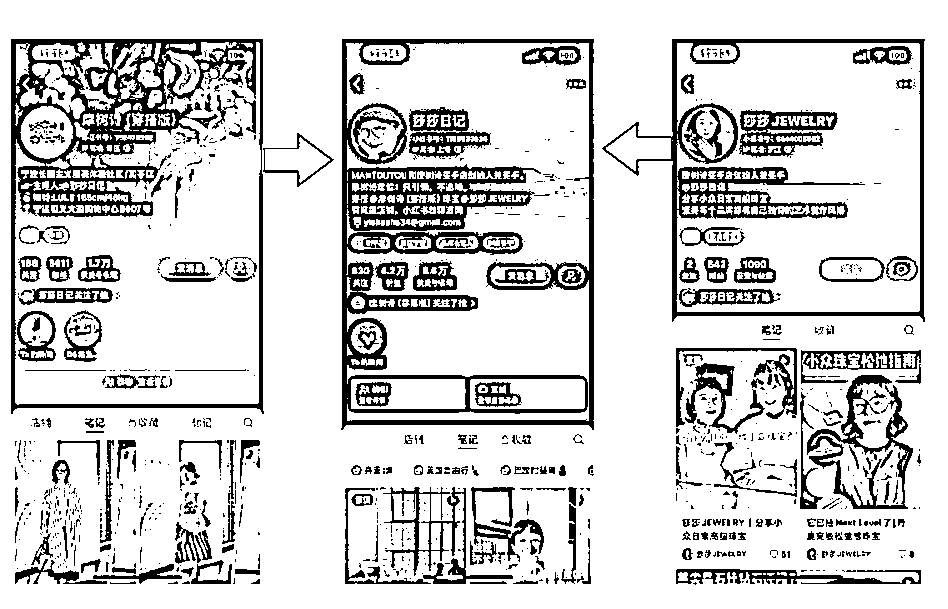

# 小红书拿到大结果的 4 种打法

> 原文：[`www.yuque.com/for_lazy/zhoubao/smehxlnprwknggv8`](https://www.yuque.com/for_lazy/zhoubao/smehxlnprwknggv8)

## (17 赞)小红书拿到大结果的 4 种打法

作者： 金坐

日期：2024-07-15

全文大概 3000 字，看完共需 4 分钟

小红书从去年开始发力商业化，在种草、直播、电商等多个商业板块迎来了许多功能上的更新

小红书人群 70%以上是女生，50%以上在一二线城市，而且大部分都是 90 后 00 后，对生活品质有追求，因此小红书平台的用户普遍有很强的消费潜力

平台商业化对眼馋小红书人群，想要在小红书掘金的玩家来说，多了很多进场的机会

但是又因为平台用户基数相对小，入局门槛低，平台算法去中心化严重，平台对内容审美有追求等特点，在小红书很难用简单粗暴的怼量或者直投打法拿到很大的结果。

想要在小红书拿到大结果，所用运营策略，和淘宝等传统电商平台，以及抖音类纯信息流电商平台都有所不同

今天分享几个，可以在小红书拿到百万以上结果的打法。

**目录**

*   1.

流量溢出电商打法

*   2.

高客单私域引流打发

*   3.

主理人矩阵站内循环打法

*   4.

全域流量协作打法

* * *

## 1

# 流量溢出电商打法

本打法适用于：品牌玩家；运营能力较强的白牌玩家；传统电商玩家；

小红书在商业化开始之前，平台定位一直都是一个消费种草平台。

一个非常经典的营销链路就是：消费者在小红书上看到了自己感兴趣的商品，然后去淘宝搜索关键词，下单。

直到现在，这也是大部分小红书用户的使用习惯。

这种打法的精髓就在于商家可以用小红书种草，在电商平台成交。

这么做的好处是，在小红书做铺量投放，流量成本会远远低于淘宝京东等平台的站内流量。

而电商平台上，如果商家已经有一家经营比较好的店铺，历史的高销量、关注数、评论，都可以有效提高访客转化率。

并且传统的电商的生态更加成熟，商家不需要再花很多经历去接触新平台的后台系统以及规则，减少运营成本。

对于跑功效类商品的玩家来说，这个打法还有一个很隐晦的好处，小红书的店铺资质审核是比较严格的，但是淘宝京东的店铺，操作空间更大。

一些在小红书没办法搞定资质的商品，可以挂在淘宝。一些在小红书不能写的营销词汇，也可以出现在淘宝。

  

  

用小红书官方给的案例举个例子，龙牡壮骨颗粒，在小红书铺设大量的百粉和千粉级别达人账号，配合部分万粉和十万粉级别的账号，每月预计发布 1400 条种草笔记，每个月投流预算 30 万-40 万之间，算上偷溜费用，每个月 100 多万的费用

最终带来在京东上 3000 多万的销售额

搜索指数从 1 月份的 1w 多，到 4 月份上升到 9.8w。

跨平台引流，除了可以铺开声量，让消费者跨平台搜索关键词。还可以直接使用小红书的工具，让消费者一键跳转到电商平台。

比如今年年初重新上线了小红星（跳淘宝）、即将推出小红盟（跳京东），还有 618 期间上线的聚光种草直达功能（CID），本质都是为了引流电商做服务的。

如果使用这些工具，那么跨平台引流电商的打法，账就更好算了，所有的数据都摆在明面上，不需要去统计品牌的回搜率，再结合连个平台的数据去做对比分析。

如果想要了解小红星或者种草直达功能的相关信息，可以评论留言，私下交流，文内不做赘述。

## 2

# 高客单私域引流打发

本打法适用于：高客单产品；定制产品；服务型产品；强复购型产品；强运营能力的品牌商家；有升单产品的玩家；

利用小红书人群优质的特点，在小红书才买流量，吸引高价值的目标客户到私域，为其提供定制化的内容和服务。

通过朋友圈、微信群、小程序等，管理私域流量，建立与用户的深度联系。

这个打法的关键点有三个：

**首先是私域的运营，必须打造一个人设。**

不能用粗暴的计算投产的打法去做，就是买流量进来，私域洗一波然后就不管了。

这种打法太过粗暴，并且没有复购，本质上是用私域的工具走公域信息流的打法，在十年前可行，在现在已经不可行了。

一定要有一个人设，并且围绕这个人设在私域去输出内容。

目的是为了增加信任度，一方面可以提高新客转化率。另一方面，可以以此为基础要求运营团队做好客情维护，确保复购率。

流量内卷时代，复购意味着利润。

 在小红书上发布高质量的专业内容，吸引目标用户群体，并将他们引流到私域平台进行深度运营。

**第二个关键点在于产品的选择，一定得是高客单高毛利高复购，三高当中至少满足两个。**

比如定制旅游行业：跨境旅游，研学游。还有留学业务，身份业务，香港保险业务，招商业务、减肥业务、医美项目等，都属于高客单高毛利。

服务好了还很容易有二次裂变。

再比如高质量女装，潮鞋，属于高毛利高复购，也可以做。

现在电商平台上面女装退货率高到令人发指，即使是小红书平台也不例外，商家的毛利非常低。本质就是因为平台给的支持，导致退货的门槛太低了，一键无理由退货，还承担运费钱。甚至直接仅退款。

但是在私域做服装，是可以把退货率控制在 5%以下的。我有个朋友，他们的话术体系就培训很好，甚至做到了 0 退货。

还有溯源产品、三农产品，产品线比较多的品牌，依托于小程序和代理机制，实现高毛利高复购，也可以从小红书引流在微信运营。

具体的例子我这里就不放了，大家可以按照我上面举的行业例子直接搜，都能搜到很多案例。

**第三个关键点在于引流操作。**

一些简单点的项目，比如卖资料，卖课，也是做的公转私引流，但是项目体量一半都不到，引流就选择简单粗暴的免费引流，对抗平台。

但是如果要做大项目，一定要用平台的工具，走聚光私信通或者表单引流，给平台交保护费，确保引流链路的丝滑。

顺应平台，虽然要交一些硬性费用，比如专业号年审费用，聚光投流等等，但是好处在于费用可计算，并且没有额外成本了。

而走免费引流的路线，本质是在偷流量，是在对抗平台。项目小，规模不大的时候可以尝试，一旦上规模了，还在对抗平台，会增加很多隐形成本，比如账号、设备、人员，并且这部分成本是不可计算的。

关于免费引流和付费引流具体有哪些方法，生财有很多方法贴，我就不赘述了。

## 3

# 主理人矩阵站内循环打法

本打法适用于：强内容能力团队；品牌方；白牌玩家；强背书型产品；

小红书专业号有一个不同于其他平台的体系，叫主理人体系。

每个专业号可以绑定 3 个企业号和 3 个主理人账号。这 6 个账号共享主账号的商业营销权限，比如可以挂主账号对应店铺的购物车，享受主账号的聚光推广能力。

狭义上，主理人指的就是平台的功能，认证了个人专业号之后可以帮定位企业专业号的主理人账号。

但是从广义上来讲，**所有的背后有品牌的个人 IP，都可以称之为主理人。**

小红书是一个很真实的平台，品牌方下场，如果说话太官气，太营销，肯定是拿不到大流量的。

这时候主理人就是一个很好的媒介，说人话，晒生活，拉进与用户和粉丝的举例。还可以利用小红书的社区特性，通过互动、话题参与等方式，增加用户参与度，提升品牌影响力。

主理人打法的好处有三个：

*   1.

天然容易拉进距离，有信任感

*   2.

灵活多变，单个品牌可以配置多个不同设定的主理人，吸引不同需求的粉丝

*   3.

操作方便，矩阵号互相引流

这套打法的关键，就是构建以主理人为核心的内容矩阵，单账号或多账号协同，围绕品牌进行内容创作和推广。

主理人通过不断发布高质量内容，形成品牌效应，带动站内流量循环。

同一个品牌下，不同的主理人账号可以有不同的人设和内容方向。

比如莎莎日记这个 IP，通过几个不同的矩阵账号，输出不同的内容带不同的产品：

  

  

多账号矩阵式分享，笔记和直播联动，帮她在小红书拿到了结果，每个月的成交额稳定突破百万。

再说一下白牌玩家，想要在小红书推广自己的产品。但是品牌知名度不高，在平台内缺乏背书。这时候就可以用主理人体系，多个账号用不同的人设和内容风格，一起拿流量，最终全部导向同一家店铺。

主账号和对应的品牌店铺作为最终的承载，而主理人账号作为拿流量的“耗材”

比如很多药食同源类产品，或者微功效型产品，内容里如果直接讲功效，很难过审，发多了还容易导致在行号被限流甚至封号。如果用主理人账号去撞审，就可以大大提高店铺的稳定性。

## 4

# 全域流量协作打法

本打法适用于：品牌方

前面三种打法，分别对于，小红书到电商平台，小红书到微信，小红书到小红书。

第四种打法，是流量大融合，非常考验团队的运营能力和规模。

电商、私域多平台同时运营，并且在小红书多渠道拿流量：

*   1.

KOL 种草

*   2.

主理人矩阵

*   3.

聚光信息流引流

*   4.

小红书店铺成交

*   5.

搜索优化

所有流量渠道同时铺开，扩大影响力和覆盖面。将小红书与其他社交媒体平台相结合，形成真正的全域营销。

用户在小红书多次刷到品牌内容或者与 KOL 联动的内容后，被植入品牌心智，之后在任何一个平台搜索，都能找到品牌运营的账号。从而在任何一个平台都可能被转化。

非品牌玩家不要尝试，团队成本和管理成本非常高。但是相应能拿到的结果量级也很高。

这个打法更多是战略层面，细节就不展开讲了，几篇文章也讲不完。如果感兴趣的人多的话，下次单独展开。

* * *

以上，就是想在小红书拿大结果的几种打法。

如果你有更好的思路，也欢迎评论区交流。

## < END >

* * *

评论区：

暂无评论

* * *