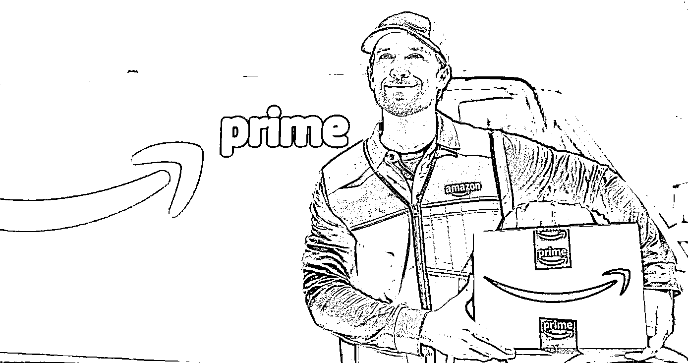
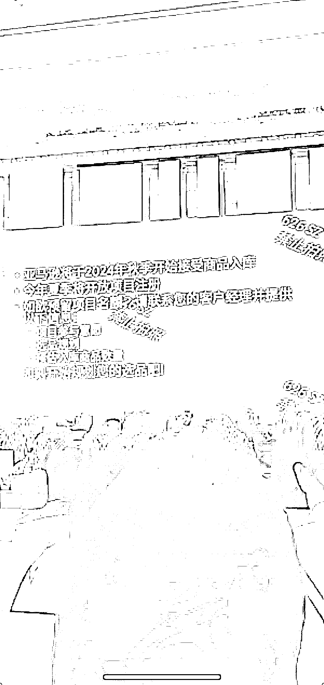
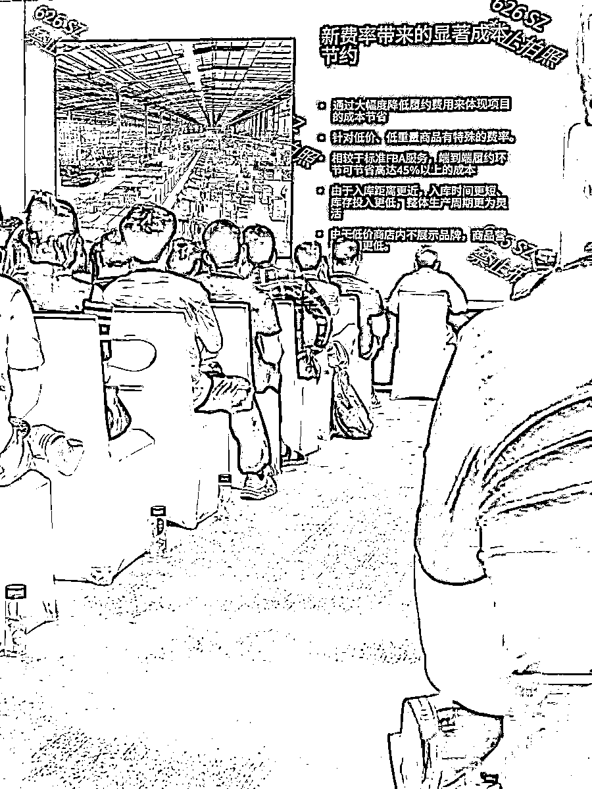
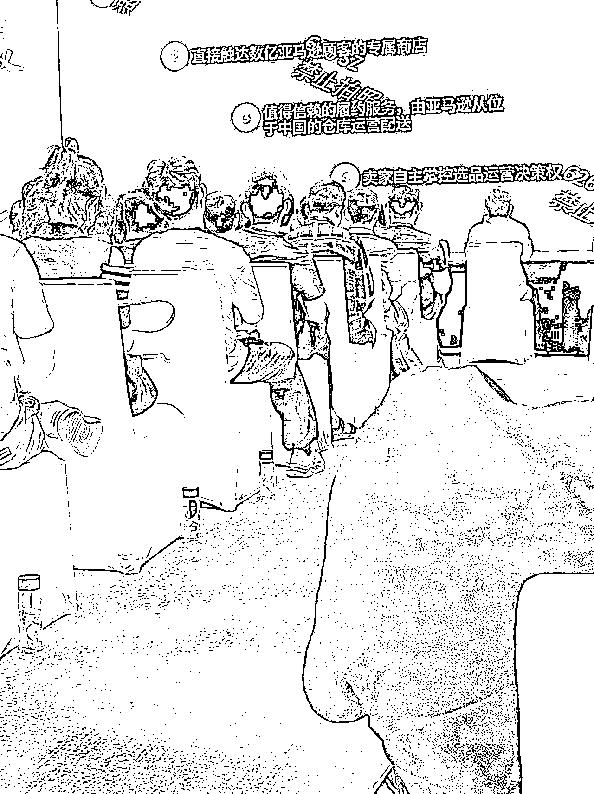

# 亚马逊也要低价卷了？赚钱的机会你看到么？

> 原文：[`www.yuque.com/for_lazy/zhoubao/qzman61lzptnfmh6`](https://www.yuque.com/for_lazy/zhoubao/qzman61lzptnfmh6)

## (10 赞)亚马逊也要低价卷了？赚钱的机会你看到么？

作者： 国民弟弟的跨境十年

日期：2024-07-15

亚马逊也要低价卷了？赚钱的机会你看到么？

被 Temu 卷的受不了，亚马逊自己扛不住了。

**亚马逊版 Temu：低价商店,已经落地了。**

  

类目：白牌低价，时尚家居用品。

产品进入亚马逊中国仓库后，仓库直接发小包给客户。

配送 9-11 天，且会在首页放流量入口。

大家看内部招商会议，目前是邀请制。

现在注册商家，然后秋季直接发货了。配送 9-11 天，且会在首页放流量入口。

  

  

### 讲讲对于谁是风口？

毋容置疑，对于已经在 Temu 上拿到结果的朋友。就是上车的好机会，所有平台，刚进去都会有大量的流量导入。流量便宜，就自然能够单车进去，小车出来。

没被邀约了，就找找周边的亚马逊经理，看有没有机会上第二批。

  

  

### 你说 Temu 和亚马逊低价会死么？

目前有消息说要对这个 800 刀的产品进行征税。

国民弟弟躺在美国，看美国内部讨论这个，美国因为征税成本 太高所以设置 800 刀的限制， 现在要下调 800.意味着海关要增加人，招募员工 。而且他们当初为什么开这个口子？因为亚马逊游说出来的口子，说征税成本大于交的税，确实也是事实！

如果要征税，以美国磨洋工的态度➕高度的就业环境，找不到员工，法律通过也是无人执行。

Temu 卷各行各业还是一两年难改变的事实。

包括亚马逊为什么动手低价策略，也是扛不住世界的内卷。

### 为什么我们会一直内卷？

主要是我们依然在产业低端链条中。

产业链上最赚钱的环节是什么？

**1\. 研发与创新**

• **高附加值产品**：研发创新环节能够创造出具有独特功能或高科技含量的产品，能够以高溢价出售。例如，制药行业的新药研发、科技公司的新技术开发等。

• **专利和知识产权**：拥有专利和知识产权可以带来长期的垄断利润，如苹果公司的产品设计专利。

**2\. 品牌与市场营销**

• **品牌溢价**：建立强大品牌能够在市场上获得较高的品牌溢价，像耐克、可口可乐等品牌，产品的价格远高于成本。

• **市场垄断**：通过市场营销和品牌建设建立市场垄断地位，能够控制市场价格，获取更高利润。

**3\. 销售与渠道**

• **分销网络**：掌握庞大而高效的分销网络可以迅速占领市场，如亚马逊、阿里巴巴等电商平台。

• **零售终端**：一些行业的零售终端环节利润较高，尤其是奢侈品、电子产品等领域，如苹果的直营店。

**4\. 金融与投资**

• **金融服务**：提供金融服务，如投资银行、对冲基金、私募股权基金等，通常能够获得高额利润。

• **风险投资**：通过投资初创企业，获得其快速增长带来的高回报，如早期投资者在公司上市后的回报。

无一例外，95%以上的卖家朋友都没有站在任何一端上！而且我们中国企业没有几个能站在上面。

认知到因为没有站上去产业顶端，不得不内卷，也就不用抱怨来抱怨去了，强者就是接纳现实。

从长期主义的角度，跨境卖家，真的活的不错的有几个品牌可以参考。

1.韶音耳机，骨传导耳机。

产品质量好，品牌影响力通过环法自行车和自媒体传播的非常好。

2.insta 360,运动相机品牌，通过自媒体传播达到非常号品牌认知。

### 未来需要跨境卖家怎么赚到价值链顶部的钱？

1）熟悉美国市场，知道本地需求。

2）熟悉美国社交媒体玩法，能够通过社交媒体低成本的提高企业品牌知名度还同步卖出货。

3）多平台和独立站同时发力，保持能够有现金流获得培育私域的能力。

关注社交媒体平台，Tiktok shop ,YouTube shop，ins 都是很好的主流通过社交媒体获取流量的地方。

方向估计大家都知道，唯独是老板愿不愿意革自己命，愿不愿意二次创业。

毕竟一开始大家草莽做跨境难度没那么大，真的要落地更高阶的玩法，其实是要掉一层皮的。

还有低端玩法吃红利，还是一样的，准备好，吃新平台前期流量红利。吃一波，差不多就走。走的时候店都可以卖掉。

**讲讲自己的案例。**

最近我一款独立站的产品，在平台上其实卖的不咋地。通过链接油管和 ins 网红，他们帮忙带货，加自己又学会点其他，流量就非常稳定的，一款产品，每天有入账 1-3k 刀。

很多东西，不去学习钻研，不自己努力，挺着肚子当老板，指望你的 1w 块招募的小朋友比你厉害？

躬身入行，锻炼自己市场嗅觉才是王道。

以上！ 

国民弟弟相关创业的故事文章推荐：

https://articles.zsxq.com/id_8n2o7gax71fr.html

* * *

评论区：

暂无评论

* * *