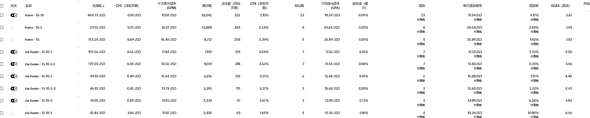
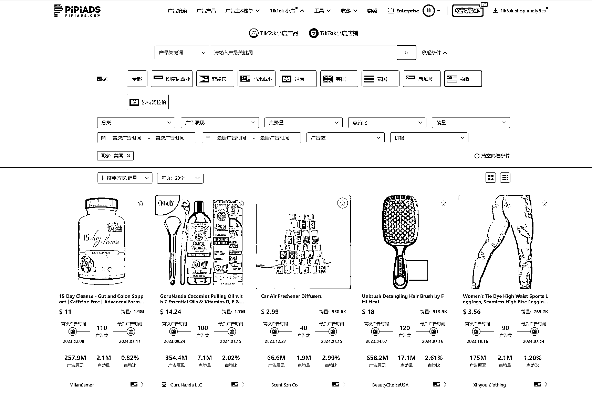
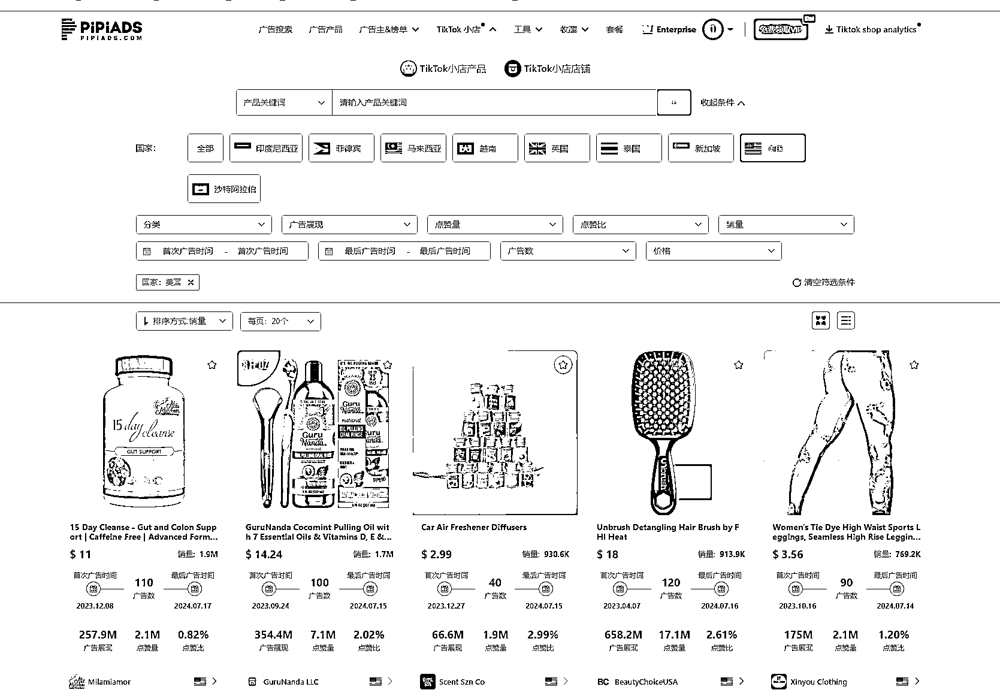
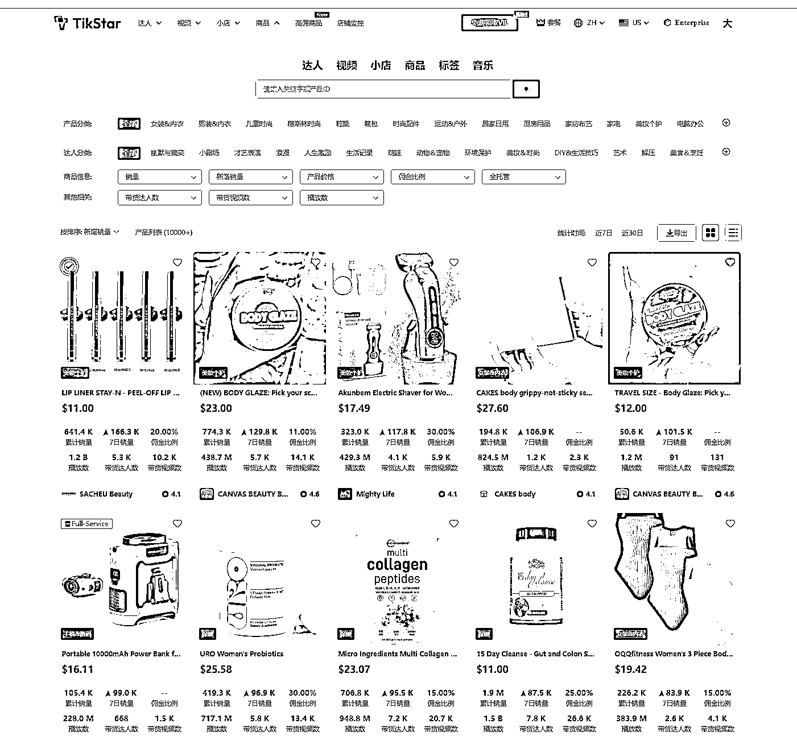

# 做 TikTok Shop 前：我命油我不油天！做 TikTok Shop 后：呜呜~老天爷放过我（随笔经验篇）

> 原文：[`www.yuque.com/for_lazy/zhoubao/hpx5oi0g0ax8zrn9`](https://www.yuque.com/for_lazy/zhoubao/hpx5oi0g0ax8zrn9)

## (10 赞)做 TikTok Shop 前：我命油我不油天！做 TikTok Shop 后：呜呜~老天爷放过我（随笔经验篇）

作者： 梁小伟

日期：2024-07-17

嗨咯，我是梁小伟，最近遇到了一个问题，已老实~

背景：

这位商家是个跨境多渠道都运营的大麦。各个平台销量都很不错，站外做的挺不错的，涉及 fb，tk，youtube 等等渠道，但最近在 tk 上也踩了一个坑。

原因是入驻 tiktok 小店，没有第一时间进行品牌备案，很多善于挖掘信息和执行力强的卖家切入走店铺跟品，到最后跟卖直接把品牌名和账号名都改成了那个商标，直接借尸还魂，开始出单，裂开，哈哈哈。

到后面发生了很多有趣的东西，我会一样一样的给大家写出来。

阶段：

第一阶段：投流起量-正常的轨迹

我们累计花费了一万美金，准备了一个炮灰号，混剪了投流素材进行冷启动出了几百单，搭建好销量基础数据后开始有自然流订单，自然流订单每天几十单。

拆解打法

达人现在建联难度高，周期长，商品卡测品随着门槛降低，入场玩家变多后效果逐渐降低。

直接投放起量（开户可以找我噢，非常专业的代理商）

因为各个平台销量已经得到了验证，不需要测品，直接找到一款最好做素材和符合平台调性的产品去打爆

打爆一个品，带动其他品的自然流销量。

执行工作

混剪达人素材和自然流素材，准备一个炮灰号。

精心优化后开始投流

高客单

roas 前 3000 美金消耗 1.几

迭代了三批素材后优化到 3.几后没货了，预计该爆品的 roas 可以打到 5。

roas 到 2 就可以打正

动销做起来了之后，进入第二个阶段

第二阶段：增加自然流账号比例做品宣+曝光

以一个品做爆品抢量，带动店铺动销吃商品卡自然流后

我们随之立即准备了 15 个号，通过批量剪辑和批量复制，打了 15 个账号

：有橱窗的挂橱窗带货

：没橱窗的挂亚马逊店铺引导搜索页面+TikTokshop 搜索页面进一步做品宣+自然流搜索

到了这个阶段，重点来了

我推测是异常值被 pipiads 挖掘到了，我去 pipiads 搜索，果然被抓到了。

然后有很多商家进行跟品。

这些跟品商家也随之开始出单，纯蹭流量。价格是你的 6 折或者，5 折。吃商品卡流量

既不投放，也不做账号，也不找达人。就这样陆陆续续销售了几万美金。

被抢量了，纯赚的打法。

最夸张的是什么呢，他把店铺名和账号都改成了那个商标名称，直接别人以为他是正版。

对于这种行为，能赚钱是他们的本事，我不支持也不反对，保持中立。

回到怎么解决问题

第三个阶段：开始注册新店铺+紧急进行品牌备案

品牌备案遇到的问题：

敲重点：品牌备案要做好多次+提前去认证

因为我们发现，备案过程，反复提交好几次都通过不了，而每次通过审核要 3 个工作日左右。

也就是说，如果备案未通过，例如审核不过的情况，或者遇到一些商标日期不一致的问题

会浪费几个周或者一个月的时间。

解决方法：同步开工单联系客服+备案前确认每一步都做好。以免浪费时间。

品牌备案成功后，就可以开始一个一个的举报对应侵权行为。

目前的玩法同步：

1.测品或者过新店期，建议投流起店

2.跟品目前处于平台早期，依旧有机会，但需要花费更多的精力做调研，可以去 tikstar 或 pipiads 寻找异常值，注意可以查询是否有相关商标专利

3.自然流耗费时间和成功率低，目前橱窗号封的比较严重，不建议大家买橱窗号挂，自己开 5000 粉也不一定能开（需要播放爆，账号稳定）

pipiads

tikstar

* * *

评论区：

暂无评论

* * *