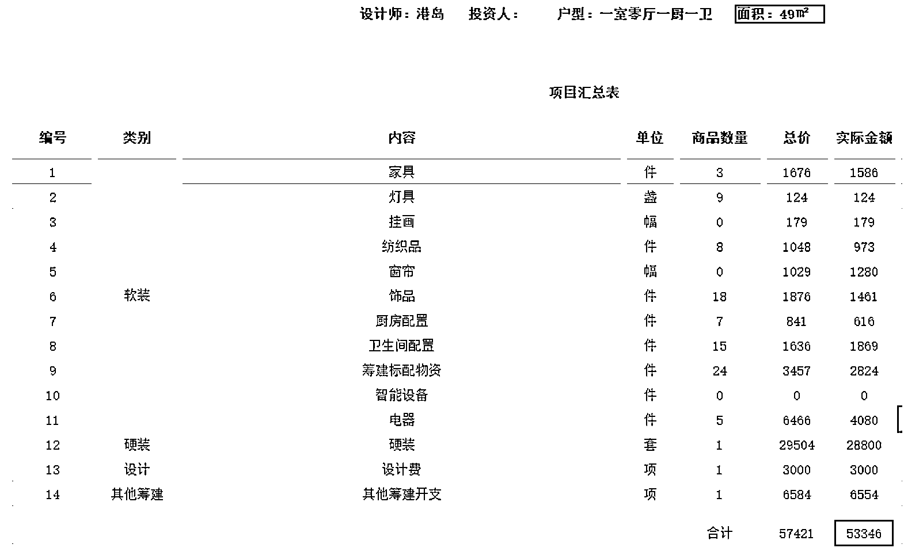
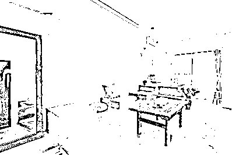

# 一年躺赚 50 万的城市民宿怎么干的

> 原文：[`www.yuque.com/for_lazy/zhoubao/xhvu2d0f7cax58wg`](https://www.yuque.com/for_lazy/zhoubao/xhvu2d0f7cax58wg)

## (27 赞)一年躺赚 50 万的城市民宿怎么干的

作者： 娟姐

日期：2024-07-18

大家好，我是娟姐，今天我来分享我之前一个创业项目的经历，其实也算副业，因为当时我还在职。那就是城市民宿。

总体来说整个过程是很有收获的，如果不是疫情那个民宿可以每年为我带来 50 万左右的躺赢利润。我从以下几个方面来分享整个生意的过程

1. 投入多少、赚了多少

2. 0 投入模式怎么做

3. 做这个生意的整个流程

4. 能赚钱的核心

5. 这个还能不能做

第一先说钱，这里投资的钱主要是房租和装修改造。我们当时找的房子几乎都是成都春熙路的公寓，50 平左右，租金一个月在 2000 出头，押一付三，租 5 年，至少一个月免租期，然后是装修改造费用，一套房子的装修改造加上软装升级平均在 5 万多。这里是某一个房间的装修明细。

这里的 5.3 万是包含筹建费用的，筹建费用就是监工的费用，是可以避免的，因为我们刚开始是合伙制，所以其实这个费用是我们自己的人工费用。可以抛开，也就是 4.7 万一套。

咋一看好像很贵，但其实这里面有些特殊性，就是我们刚开做的时候是一间间做的，所以单个房间成本很高，后面采用批量化做的时候，单个房间的成本就降低了很多。这里主要是集中装修的采购成本低，人工成本也低，再抛开筹建开支，集中做，一套房的装修成本可以控制在 4 万。20 套房就是 80 万。

还有就是保洁和布草，清洗布草一套 10 元左右，保洁（兼职）打扫一间房 40 元左右。当然是有入住才会发生的。

最后一个是平台费用，一般是 10%，也是发生才有的。

然后就是一些零碎的电费水费物业费偶尔的维修费。很少，不细列了。

然后是收入，一间房的单价平时在 300-350 左右，节假日 480-700。这里的节假日不仅仅是法定节假日，暑假也是一个大旺季。

入住率：我们房间的入住率平均全年在 80%以上，这个在酒店行业都算比较好的。毛算下一年的收入，按照 20 间房算：350*365*0.8*20=204 万左右。

然后算利润：收入 204-装修成本 100（按照平均 5 万一间算）-房租（2000*12*20）48 万-保洁布草清洗费用（50*365*0.8*20）29.2 万-平台费用（350*0.1*365*0.8*20）20 万=6.8 万。

也就是第一年就可以回本。实际操作中也是，我们比较好看的房间甚至可以 8 个月左右就回本了。

然后第二年开始就是躺赢开始了，因为第二年不需要装修，所以第二年开始就是 100 万的利润。

第二年开始就可以招人了，招一个管家，一个全职保洁，N 个兼职保洁随时可联系到。管家的工资是 3000 底薪加提成，一年 8 万左右的成本，全职保洁就是加上社保成本。总增加的人工成本 10 万完全可以。因为在成都人工成本低。

所以在疫情前，我们运营起来后一年的利润 100 万左右，当时是三方合伙，按照股比，我从第二年起就可以躺赚 50 万一年。做个副业是真的香。

第二、0 投入怎么玩

其实这里面有一个问题就是前期投入比较大，我们在最开始投入了几间房后资金就玩不起了，主要的原因是合伙人的退出，本来几十万的投入变成了上百万，所以想了另外一个办法，那就是与房东谈。我们跟房东是这么谈的，房子和装修都房东出，当然需要强大的谈判能力，刚好，因为我主业是做投资的，正好具有。前后也拉了几个房东入伙，我们不用出一分钱，前期还会收他筹建费用（就是那个 6000 多）后期收运营费用。而房东只需要出一笔钱，后面每年就坐等收钱。

当然这还不够，因为合伙人的退出让我们想到了另一个方案，合伙人退出的时候我们没钱退给他们，所以就是分房间，他们就成了上述房东的角色，然后这个方式就在愿意投资的人中复制。

最后就成了我们后面没有投入一分钱，但是也有 30%的运营提成，也就是到了第二年我们招人后，我们就可以每年躺赚 10-20 多万的提成。

第三、怎么做

整个流程很简单，第一选地址，选好后就找中介，中介费用一般是一个月租金，所以有成本。最好的是找到一家快倒闭的快捷酒店或者物业，谈一层楼的租，集中管理还免了中介费。第二是设计，一般的设计师都是 3000 左右一间房的设计图，这个很好找。第三就是施工，找零工队来施工便宜。第四就是监工，这个很重要，要守着达到设计效果，而且用料不要有味道。最后就是房子弄好了后就上线，木鸟、途家、小猪、爱彼迎、美团都可以定民宿。

第四、赚钱的核心

就两个，选址和设计。选址就选旅游打卡地，耳熟能详的那种，比如在成都那就是春熙路，太古里，锦里，宽窄巷子，九眼桥，最多加个熊猫基地。我们选的全是春熙路。第二就是设计，这就是核心竞争力了，我们之所以保持那么高的入住率，设计就是我们很大的一个亮点，原理就是，找到一个爆款就使劲复制，给大家看几张我们的设计风格。

设计风格的核心就是——女人。因为来定房间的基本上都是情侣或者闺蜜，很少有两个男人一起住还睡一间房的。所以审美符合女性。我们就是发现白色+拱门就是流量密码。最后就是画龙点睛的地方，房间的名字。房间的名字基本上都是我取的，建议是有一定文案功底的人来取，我取的比如：波西米亚的裙摆、私奔摩洛哥。

最后当然是审美，因为设计师也有好和不好，所以最好是自己有一定的审美。我们的这个设计在民宿同行圈都得到很多认可，所以最后知道我不做了后很多同行来买我的设计图，当初一间房我花了 3000 的设计费，最后 99 块钱一间房所有的设计和购物清单一起打包卖给同行，还卖了点小钱。

第五、这个还能不能做

首先说答案：能

然后再说我的结局，因为疫情一开始我们不知道有三年这么久所以硬撑，但是经历几次成都封城后真的扛不起了，在疫情最后一年关闭了。疫情后遇到经济调整，现在比较坚挺的行业，旅游真的算一个，而且成都又是一个很牛逼的旅游城市。毕竟是可以一次投入后后面躺着收钱不耗费精力。

* * *

评论区：

唐门三叔 : 感谢娟姐的分享，努力赚钱，去春熙路开民宿[色][色][色]
px : 这个装修成本太高了娟姐说实在的，而且入住率要选热门城市才行，全年的入住率应该也是大旅游城市有这么高把，其他地方没办法复制，水电费，物业管理费，布草费平台手续费都是一笔不少的支出
娟姐 : 看做什么档次吧，平均房费 350 加上要 80%的入住率，装修成本 4.5 万很正常，因为软装全套加上硬装改装都是一起的。如果不改装直接用原房东的也可以，降维就行。城市要选旅游城市，支撑不起这样的房价和流量的就不要装这么好。成都确实是绝佳城市之一，本身有留客能力外加一个川西中转。

* * *