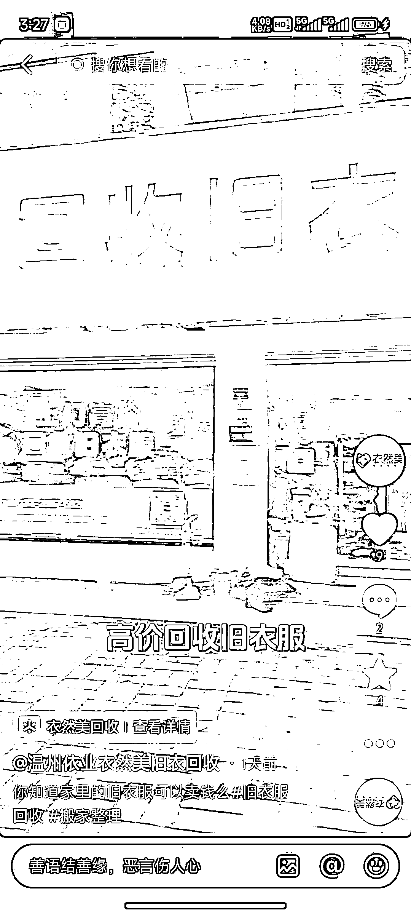
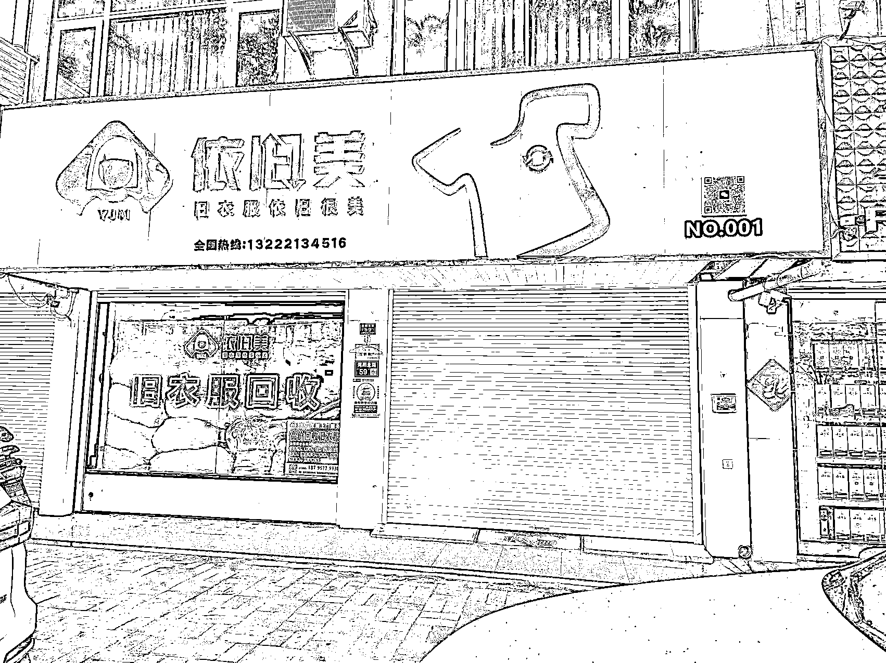
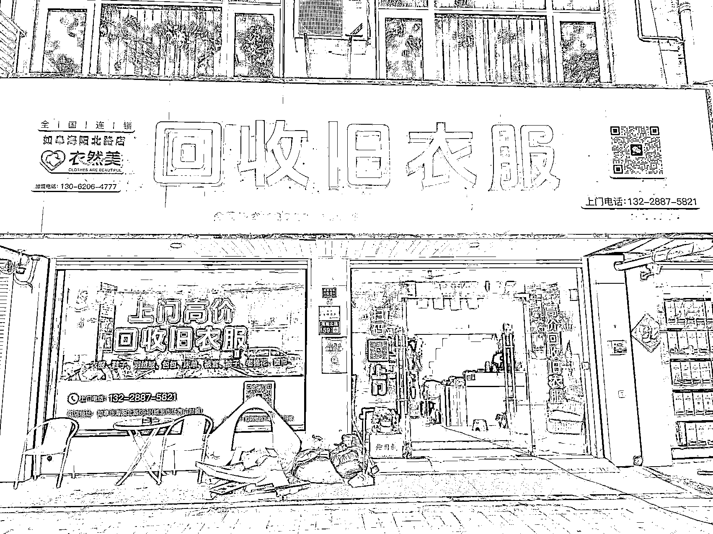
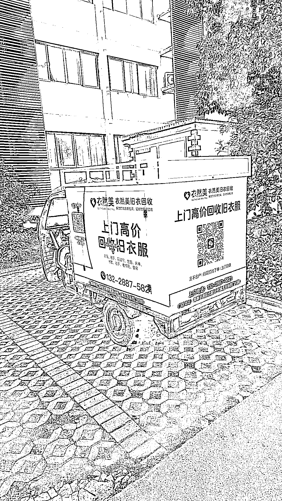
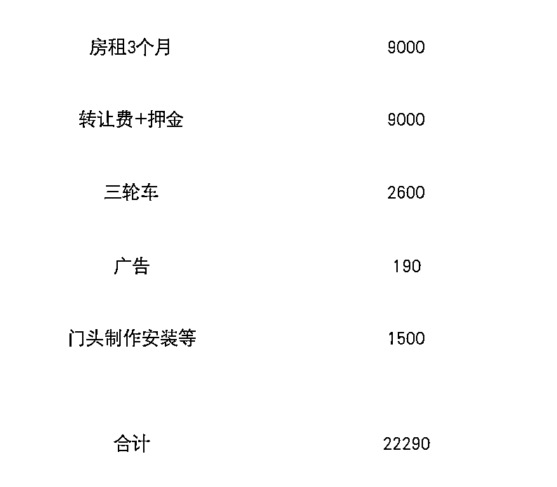
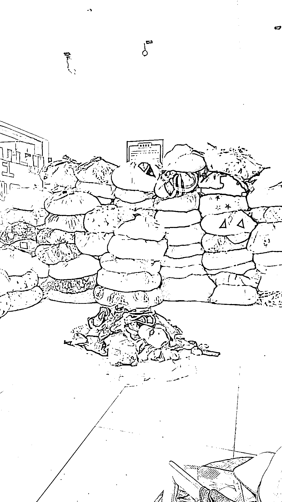
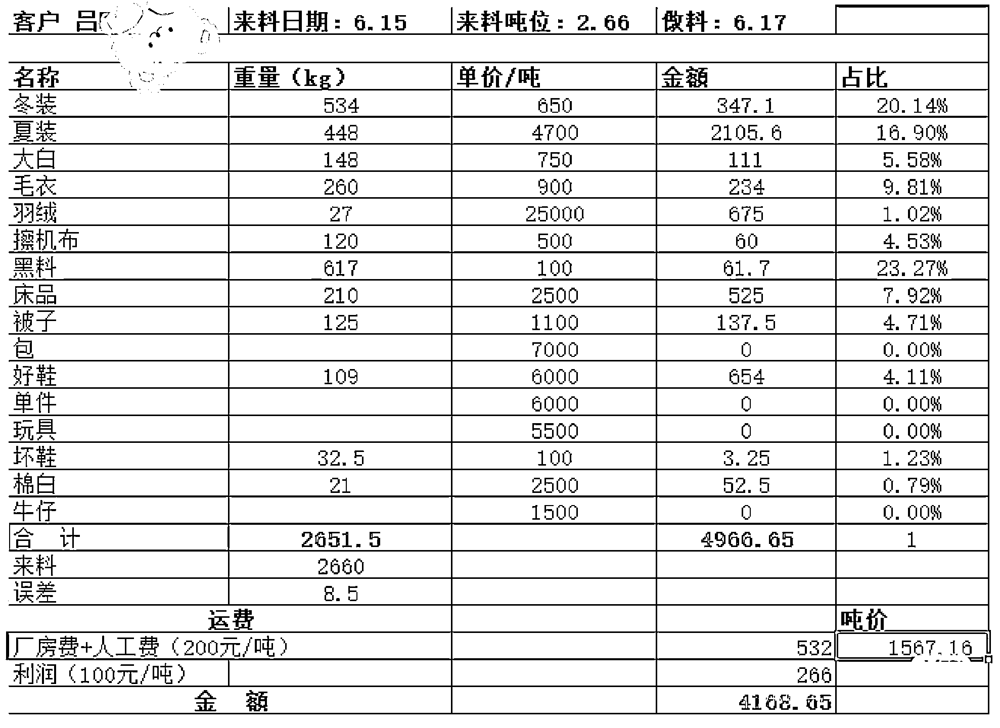
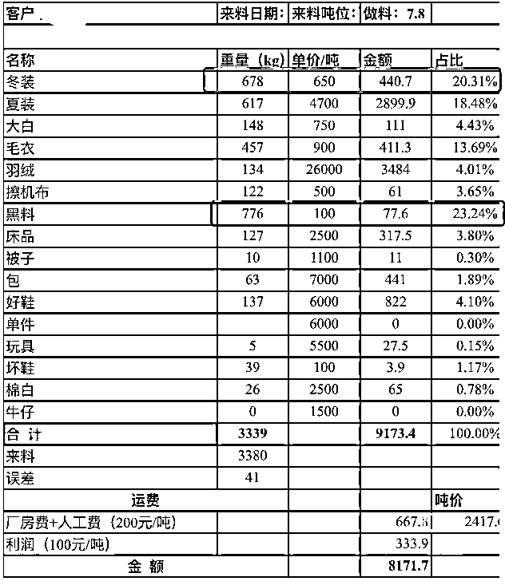
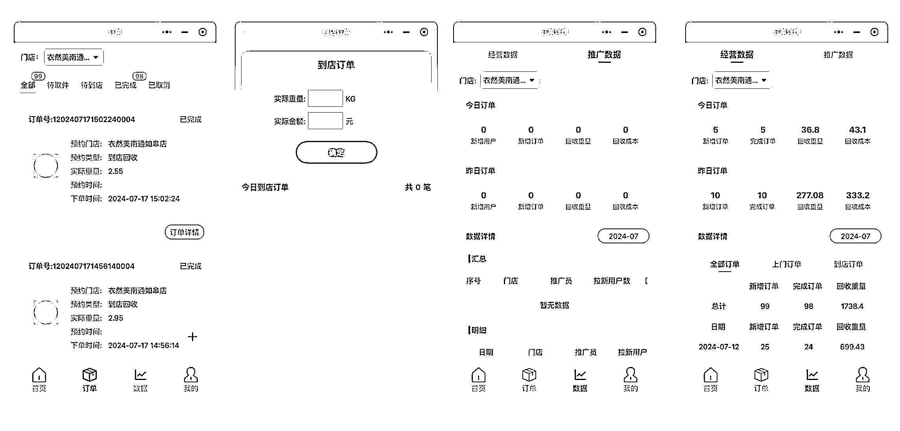

# 投了 2 万开了一家旧衣服回收的门店，第一个月赚了 3000

> 原文：[`www.yuque.com/for_lazy/zhoubao/bv4tm1qhxacmfq8u`](https://www.yuque.com/for_lazy/zhoubao/bv4tm1qhxacmfq8u)

## (13 赞)投了 2 万开了一家旧衣服回收的门店，第一个月赚了 3000

作者： 东方树叶

日期：2024-07-19

# 一、怎么误打误撞进了这行

旧衣回收这个行业一直都有人在做，褒贬不一，有很多人加盟了各种品牌被坑被割韭菜。

了解这个行业来源于一个朋友，他们在抖音小程序拿到一个加白的小程序名额，可以在抖音直播间和短视频直接挂载小程序，用户在直播间可以直接点击直接去下单，这样用户下单的业务流程就非常顺畅。

在抖音上有挺多的旧衣回收的小程序，但是只有两三个是加白了的，加白的小程序和其他的本质区别有两个：苹果用户是否可见+有没有挂载权限。

（有挂载权限，用户刷到短视频直接点击去下单）

所以现在抖音直播间里除了传统的小风车或者电话留资的转化路径外，还有的就是引导进抖音群，然后在群里发回收的小程序。

有了这个抖音小程序的加持，我们认为可以大幅度的提高转化效率，然后就决定进入这个行业，所以就加入一起来做这个旧衣回收的品牌。

老牌的旧衣回收的平台如飞蚂蚁、白鲸鱼等，主要是支付宝给流量，所以我们只能在抖音上来寻找新的流量切入口，也希望可以在抖音上做成他们的那种体量和规模。

至于为什么要开一家这样的店呢，非常简单，因为不懂，所以得开店，自己收，自己做，自己深入的来了解。

# 二、这个门店的历程和花费

我们看好在抖音上可以把旧衣回收的平台做好，所以就入了这个行，第一想法就是得自己开个店，然后把所有的坑都踩一遍，这样能知道所有的业务细节。

## 1、有个门店不做了

接手现在的门店非常巧合，我们觉得得自己做个店，所以一直在杭州找地方，突然有一天工厂那边的人给我说，在工厂附近的一个门店，大姐不做了。不是因为不赚钱，是大姐家里做工程，每个月要有一半的时间在工地帮忙，同时自己的孩子刚结婚，还得每天早早回家照顾儿子儿媳妇，所以时间精力跟不上，干脆就想把店转出去，自己去做纯上门的回收，这样时间非常自由。

后面的过程就是和大姐讨论接收的事宜，然后就把店接下来了。

## 2、有个店就可以直接赚钱了么？

### （1）接手之后的发现：用户需求比想象中的强

在谈完确定接以后的时间就是花很多时间和精力来找人看这个店，找了一个发小帮我一起做这个业务。6 月 1 日，我们正式接手这个店。

接手的第一天我门就有几个非常有意思的发现：

1.  附近的人并不知道有这么个店：我们去旁边 100 米的地方去办网络，工作人员怎么都找不到地方（以前的门头不清晰，一会可以对比一下）
2.  店重新开门以后，附近路过的人都在问：「你们终于开门啦，明天在不在呀，得赶紧给身边的人说开门啦。」真的很难想象，之前的店一直开开停停是怎么还能有不错的收入的（一个月 1 万左右）
3.  路过的人好奇这个店是干嘛的，我们给说一下才知道是收旧衣服的（门头的重要性）。而且大家家里都有一堆旧衣服（我们信心大增啊）

### （2）门店整改

意识到了问题，我们就赶紧做门店的整改，主要是做了以下几个事情：

#### A、赶紧换门头

1.  这个是旧门头

1.  这个是新门头

两个门头的前后对比还是非常明显的，这个我之前看过一个理论，如果你品牌不够强，那就直接写上业务。之前的门头不能直接说清楚在做的业务，用户有很多的疑惑。

现在来来回回的人流，基本上可以一下子就记住，在这个地方有一个门店在做旧衣服回收了。

#### B、弄一个小喇叭放门口

1.  事实证明，这个办法虽然没有那么高大上，但是非常有效。门店到大路边还有一点点距离，所以我们搞个小喇叭放路边，路过的人都可以听到，然后再看我们店，然后再进店了解
2.  在门头没有更换前效果更加明显

#### C、传单、海报、名片

1.  传单主要在学校门口来发，收到的反馈基本都是没用过、家里有很多衣服

#### D、收货小车

1.  移动的广告位和收货大将军，哈哈

### （3）开一家这样的店，我们花了多少钱

1.  这些是前期的固定的投入，后面基本上有 1 万左右的运营费用就可以，作为收货款的周转资金
2.  门店不用装修，最需要重点关注的无非就是一个门头了

# 三、开店一个月我们赚了多少钱？

## 1、收货

### （1）收货价格

1.  在如皋这个地方，我们统一的是用户到店是 6 毛钱一斤，也就是 1200/吨。上门回收的价格 4 毛钱一斤，也就是 800/吨
2.  在统一按照斤收的这个方式，目前我们给的价格基本上是行业天花板了，再多就基本上不赚钱了。

### （2）目前收货的几点发现

1.  到店的基本上都是女性，年龄在 30-50 岁之间的最多
2.  门店收货有一个好方式，大爷大妈会把别人扔的好的衣服捡过来卖，既给自己赚钱了，又成了我们一个非常好的收货合作伙伴
3.  居民对收货价格不是很敏感，有很大的心态上来说就是我们帮忙给处理掉家里的这些存货，钱多钱少在乎但是没那么在乎，甚至有很多人不在乎
4.  上门回收的订单非常好，单量大，衣服质量好。

## 2、出货

### （1）出货流程

1.  门店不断收货，因为我们离工厂还算近，所以有 3 吨左右我就会出一次货运到工厂
2.  准备出货，我们自己找好车，或者工厂帮忙找车，装车拉走就可以啦

### （2）工厂分拣&给出价格单

旧衣回收这一块水比较深，分拣厂分拣完的统货价格基本上也就是在 2000-2500 元/吨左右，如果网上看到好几千一吨的，基本就是混淆概念，拿其中的某一个类目的价格忽悠你。夏装确实可以 5000，6000，但是冬装基本只有 6，700/吨。货发到工厂以后，工厂会对到的货进行分拣，然后给出每一种衣服的重量和价格

#### A、6 月 15 日第一批货：

#### B、7 月初第二批货：

大家可以看到两次送货，第一次最后算的价格在 1500 左右/吨，第二次在 2400 吨。造成这样的原因主要有两个：

1.  第一：第一批货，开始不会做老觉得衣服都很好，都替用户收了。但是最后吃亏的还是我们自己，所以什么样的要什么样的不要，某种程度上来说是非常有技术含量的
2.  第二：第二批货送去的时候，货值高的羽绒服因为第一次出货量很少，所以一次一起了，所以整体的价值就高起来了

## 3、6 月份我们赚钱了么？

所有我们 6 月份赚钱了么？两次收货总共 12000 左右，收货花了大概 13000，但是店里还有一批货没发，然后棉被和羽绒服这些都有一些单独的销售，除去房租水电，应该还有 3000 左右的收入。

3000 块，就是我们搞了一个月的全部收入了。

# 四、这个行业继续该怎么做

## 1、作为一家互联网公司，我们怎么赋能这个行业

### （1）干了一个月，我们决定做一套系统

旧衣回收行业目前来说存在很久了，甚至很多人在梦声发大财，但是其实互联网程度比较低。用户覆盖率低、用户不清楚、从业人员也不懂什么系统、提高效率这么一说。在摸索了一个月以后，我们决定发挥自己的优势，把在其他行业非常常见的系统做进来帮我们更好的来运营和管理门店，提高效率。

### （2）门店管理和订单管理

### （3）门店分销系统

1.  人人都可以成为门店的分销员，分享业务小程序邀请其他人下单，就可以快速的收益奖励

## 2、这个行业还能做么？

### （1）这个行业目前做的人怎么样

1.  能做，而且是一个非常好的机会。这个是我们的答案。我们了解了一些门店，一个月做 1 万的很轻松，2-3 万的很多，多的能做到一个月 10 万左右。

### （2）适合什么样的人来做

1.  首先还是要能拉的下脸来。说好听叫环保回收，难听点就是收破烂的，所以我们都称自己叫破烂王（业务的发展路径来看，先旧衣服，然后再叠加旧书等废纸，然后其他破烂）
2.  其次，这个业务还是有些脏和累的，所以不能太讲究，没法咖啡厅小河边下午茶了
3.  我们看最好的搭档是小两口，女生亲和力好负责看店，男生可以负责搬运和上门回收

### （3）欢迎对业务感兴趣的大家来一起交流

1.  如果有对旧衣回收业务感兴趣的小伙伴大家可以一起沟通交流
2.  如果你是前端收货的从业者：用上我们的系统赋能，业务效率翻倍。
3.  如果你是对这个业务感性：我们可以一起探讨，一起加入这个行业
4.  如果你是分拣厂、出口厂：我们长期有货，欢迎合作
5.  如果你是主播、短视频运营、公会、机构：我们可以在短视频和直播间直接挂载，欢迎推广合作

先写到这里，下次给大家同步一下我们直播推广和分享推广的一些实践历程。

以上，如想了解更多关于我们旧衣服回收业务的大家可以评论留言

* * *

评论区：

刘信庭 : 大佬，江苏无锡想了解，方便聊下吗
风声 : 收来的旧衣服卖给谁呢？
东方树叶 : 直接卖给工厂，工厂大部分出口，小部分二次回收做颗粒、燃料等
老彭 : 点个赞，围观后续

* * *