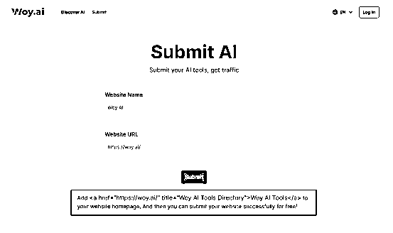
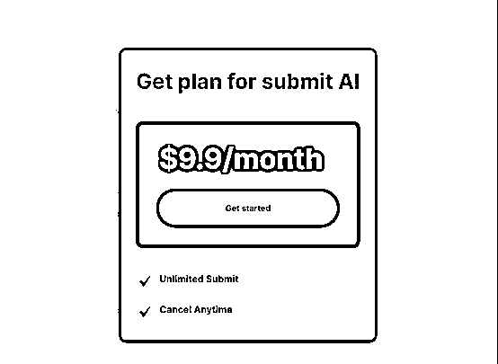
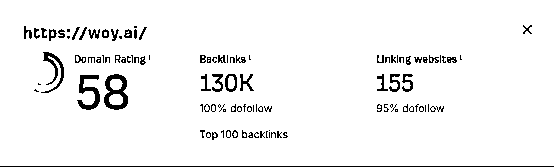
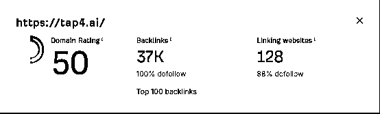
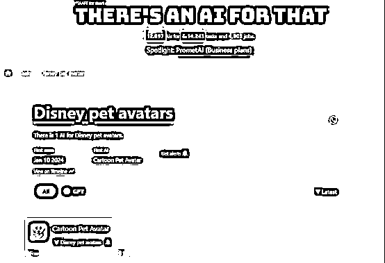
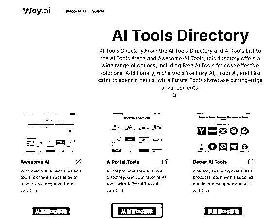

# 关于《SEO 友好的 AI 原生 CMS 思考和实践》的学习笔记

> 原文：[`www.yuque.com/for_lazy/zhoubao/bbhrrss4v0instb2`](https://www.yuque.com/for_lazy/zhoubao/bbhrrss4v0instb2)

## (6 赞)关于《SEO 友好的 AI 原生 CMS 思考和实践》的学习笔记

作者： 自由学徒

日期：2024-07-17

7 月 3 日，“出海鼓励师”哥飞直播分享了《SEO 友好的 AI 原生 CMS 思考和实践》这一主题，直播时长两个半小时，干货满满。我看完直播后有种醍醐灌顶的感觉，趁着这种感觉还没退去，写下自己的收获和理解，以加深印象。

##   **1.自动化低成本获取外链**

在提交页面中，如果输入的 AI 工具 URL 对应的主页上有 woy.ai 的外链，那么系统会提交成功。

  

如果 AI 工具的主页上没有 woy.ai 的外链，那么会弹出订阅提示：9.9 美元一个月，不限提交次数。

这是一个很巧妙的设计。woy.ai 给了提交者两个选择。一是支持免费提交，但是需要提交者提供一个外链作为交换；另一个是付费提交，9.9 美元一个月不限次数提交，相比于其他收费提交的导航站要便宜许多。甚至你可以利用这个不限提交次数的规则，包装成一个 AI 工具收录的服务，再卖给其他人来赚差价。

这两个选择对于提交者和导航站都是**双赢**的方案。特别是免费提交的策略，导航站以一种**边际成本为零**的方式自动获取外链以及 AI 产品信息。我个人理解这应该属于增长黑客的一种小技巧，增长的不是用户数而是外链数。

哥飞透露，通过这个方法，帮助 woy.ai 在两个月 DR 达到 58，155 个引荐域名。

另一个导航站 tap4.ai 也用这个方法，在两个月 DR 达到了 50，128 个引荐域名。

当然并不是单靠这个方法就能快速提升 DR，获得大量外链的。也有不少导航站使用了类似的方法，但是引荐域名和 DR 都不是很理想。个人猜测应该是和导航站的内容质量以及初期的外链建设情况有关。

## **2.SEO 友好的 AI 内容生成**

通过爬虫自动化获取待收录的产品信息。然后通过爬虫和人工补充，让 AI 清洗并整理出适合 AI 理解的该产品参考信息。

对于一个产品的主页（Page），可以根据产品实际情况展示不同的章节（Section），不同的章节围绕着产品的各个维度（简介、功能、团队、定价、评测等）进行展示对应的内容（Content）。

其中 SEO 相关的信息（title、description 等），通过 AI 借助参考信息输出，在减少 AI 产生幻觉的同时避免了重复内容的生成。

对于一个产品的不同章节，同样生成对应的页面（**一个关键词对应一个页面原则**），以匹配用户对该产品对于某个信息的搜索需求（如 XX 产品的定价、XX 产品的功能）。每个章节的内容同样通过 AI 借助参考信息输出，以避免低质量重复内容。

多语言部分，不同语言使用对应语言的 prompt，而不是统一使用英文或者中文的 prompt，从而避免 AI 生成质量降低。对于不同语言的 prompt，可以基于英文版的 prompt 进行翻译生成。

另外在 AI 生成内容的时候，可以输出成 Markdown 格式，并预生成对应的 html 内容进行存储，以解决在实际访问时需要重复渲染的资源消耗。

这里顺便提一下输出格式的问题，虽然 AI 输出的内容格式也可以是 Json，但是由于 AI 的不稳定，会出现标点缺失导致 Json 解析失败的情况。硬地骇客在 podwise 的创作故事中也提到过这点，我自己在项目中也遇到这样的情况，只不过我需要输出的文本并不长，因此重试的成本并不高。但是对于输出内容较长的场景，还是以 Markdown 形式进行输出比较稳妥。

## **3.SEO 友好的 AI 打标签**

想要 SEO 友好，就不能直接让 AI 打标签，因为 AI 输出的不稳定，很大几率生成没什么搜索量的标签。

我当初在建自己的导航站的时候也遇到过这样的问题，如何打标签比较合适？当初我的选择就是找几个比较大的导航站，看他们是如何进行分类或者标签。其中在 theresanaiforthat.com 就看到比较有趣的标签方式。

图中的 task 可以理解为一种标签，task 数量比 AI 工具数还要多，也就是说有很多 task 只有一个 AI 工具，那么这种 task 对应的关键字理论上对应的搜索量也不高。当然也不排除 TAAFT 想通过这种方式去制造新词去抢占排名，毕竟它属于流量很大的导航站，DR 值有 74，不容易被谷歌判断为低价值内容。

直播中哥飞提到的 AI 打标签方法是提前搜集一些高流量的标签相关关键词，形成一个列表。让 AI 在根据参考资料判断该工具属于列表中的哪个标签。那么这样的 AI 打标签的准确率要高很多，同时能在对应关键词中有机会获得更高的排名。

标签也使用多语言的形式进行存储，不同语言的标签不是简单的翻译，而是根据对应语言的搜索量进行获取，同时生成相应的标签说明，辅助 AI 对该标签的理解，以提高打标签的准确性。

另外标签可以**多维度**进行布局，如产品的功能、产品的形态、产品的定价等。那么根据多维度的标签可以重新整合出有价值的信息，例如：对于**remove.bg**这个工具，**免费**的**去除背景**的**APP**有哪些**平替**？针对这种问题形式的长尾关键词进行布局，可以走农村包围城市的形式获取排名。

## **4.提效的小功能**

在哥飞演示的过程中，我发现在标签列表页中，演示账号有一些额外的功能，如移除当前 tag、将指定工具设为某个 tag 等。这样的小功能，与从头开发管理后台比，成本要低很多；与直接在数据库上修改数据的形式相比，效率又高上不少。

对于开发者而言，在处理繁琐的重复性劳动时，可以考虑是否能以较低的成本实现一个小功能供自己使用，从而提高效率，同时不要在非核心功能（如样式美观）过度投入，浪费不必要的时间。

## **5.写在最后**

整场直播下来，哥飞分享了他围绕 SEO 友好（对用户有帮助的）为核心，重新设计一个 CMS 框架，让 AI 去做它擅长的部分（如重复性劳动），同时通过针对性投喂参考资料以提高 AI 生成内容的质量。最终将信息有效清洗、聚合，展现出比其他网站更多有价值的信息，那么你的网站更有可能帮助用户，从而获得更高的排名，进一步帮助更多的用户，良性飞轮就这样转起来了。

由于篇幅和我个人能力的原因，还有很多细节未能写出，非常感谢哥飞的无私分享，让我学到了很多干货。完整直播内容感兴趣的朋友可以在微信视频号搜索“哥飞出海”，在直播回放中查看。

* * *

评论区：

暂无评论

* * *