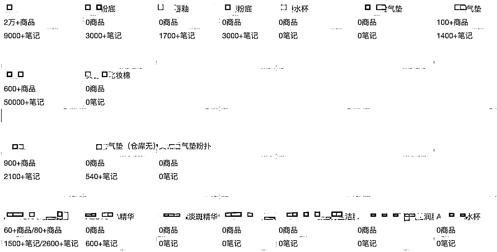
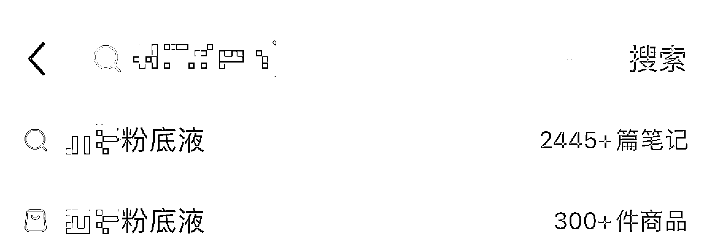
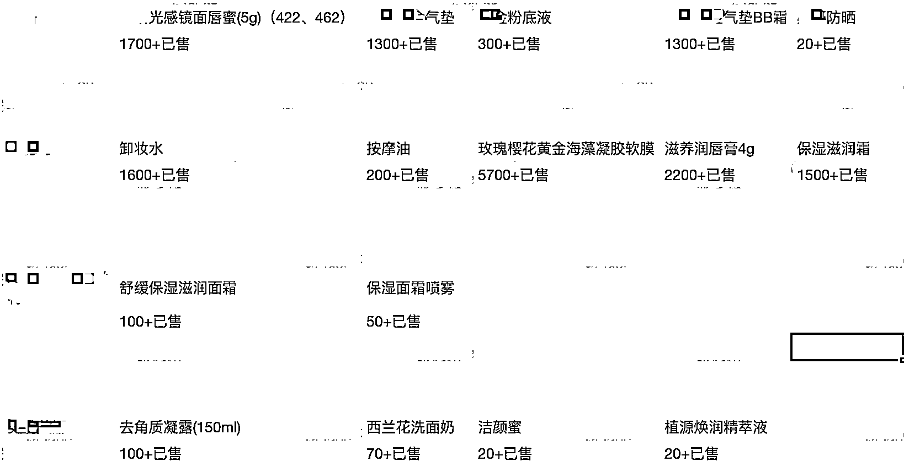
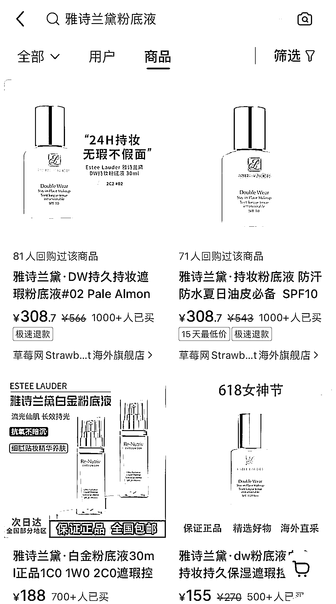
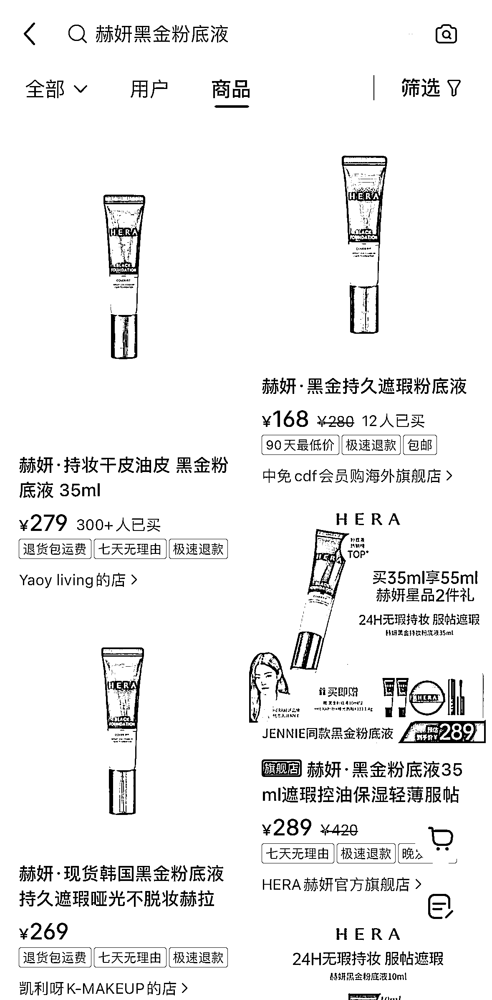

# 小红书选品细节 同赛道多品类的情况下如何选品

> 原文：[`www.yuque.com/for_lazy/zhoubao/gehvkflo4ei2ulh4`](https://www.yuque.com/for_lazy/zhoubao/gehvkflo4ei2ulh4)

## (11 赞)小红书选品细节 同赛道多品类的情况下如何选品

作者： 加麻

日期：2024-07-09

假如你正在做的赛道，或者已经选好供应链了，但是品类太多怎么办？

以美妆举例，大家都知道常见的美妆品类包括底妆、眼妆、唇妆、腮红、修容、高光、眉笔、眼影、口红、粉底液、睫毛膏、眼线笔、腮红、散粉、遮瑕膏等等等等...

不同的品类又有不同的品牌各自为营，不同的品牌底下又有它独家擅长的品类，那么如何在一个供应链里面去挑选适合小红书上品的品类就成为了一个很关键的问题，毕竟选品定生死。

思路如下：

step1：在小红书搜索框按照产品名搜索，看笔记情况，记录相关笔记和商品数量数据，根据笔记和商品数量数据进行第一波筛选，把热度低的剔除

⚠️表格上面记录的 0 商品和 0 笔记，代表的不是完全=0，而是搜索框出来不显示数据，那么我们就定义为 0=热度低，同样的，如果搜索显示笔记多但是 0 商品，那么代表你完全有机会靠内容和素材去占领先机

step2：当你剔除完一些在小红书热度较低的产品之后，那么剩下的至少在小红书有点热度的品牌应该怎么选择呢？这时候可以在搜索框输入商品名称，选择商品-按销量排序，看看品牌下哪个类目最有销量（前五的产品）及有低粉爆款，在这里，低粉爆款＞普通高销量，优先选择销量高的品类，以此做筛选

ps：下面这两个你会选做哪个？

step3：根据以上两个步骤，我们已经筛选出了有热度值且在小红书卖的比较好的产品，那么这时候我们只需要查看商品库存，优先选择库存足够的产品进行上架即可（建议库存至少 100 以上）

第一遍看不透的宝子可以反复阅读，如有疑问随时私信我哈

* * *

评论区：

暂无评论

* * *