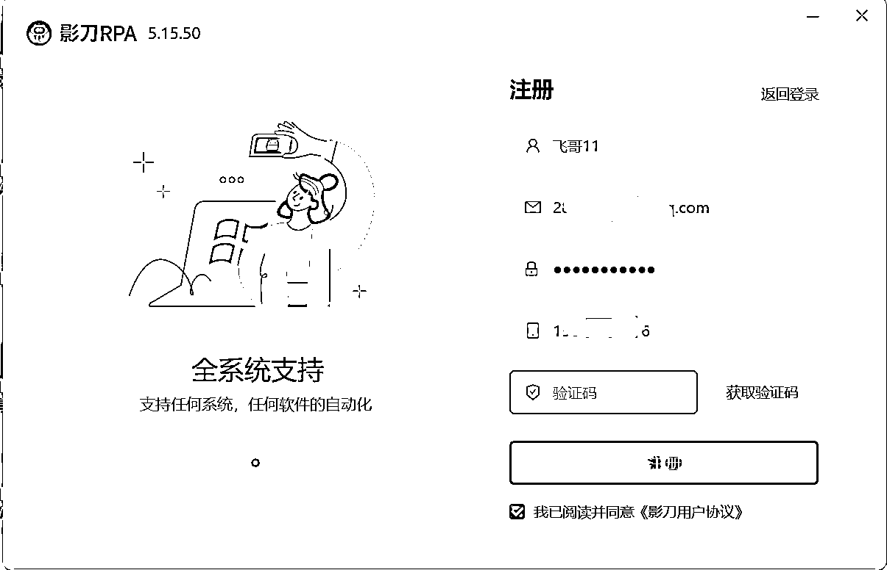
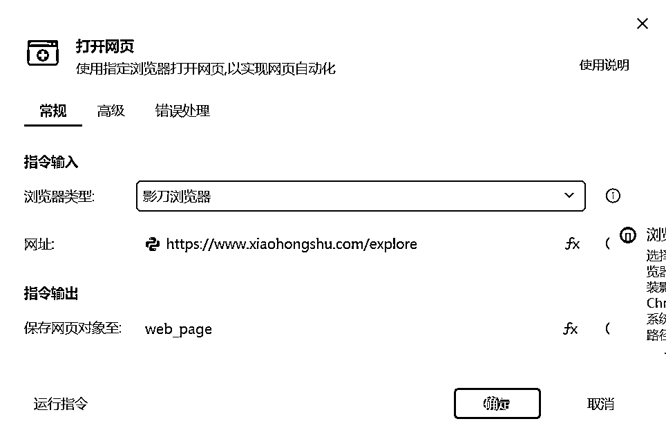

# RPA 抓取小红书爆款笔记 项目准备手册

> 原文：[`www.yuque.com/for_lazy/zhoubao/ta9p2q1xrqv4uv29`](https://www.yuque.com/for_lazy/zhoubao/ta9p2q1xrqv4uv29)

## (44 赞)RPA 抓取小红书爆款笔记 项目准备手册

作者： 码农飞哥|RPA 定制

日期：2024-07-09

各位生财圈友大家好，我是码农飞哥，讯飞程序员，CSDN 博客专家，玩副业 2 年，累计变现六位数，目前专注于 AI+RPA 项目，已经开发了数十款机器人。本文是合肥线下 RPA 航海手册。

## **一、环境准备**

### 1、**第一步：准备一台 Windows 电脑**

准备好一台笔记本电脑，电脑的最低配置是：

操作系统

Windows

内存

4G 及以上

硬盘

500G

显卡

独立显卡

处理器

Intel i5

这里推荐使用 Windows 操作系统的电脑，如果你实在没有的话，使用 Mac 电脑也是可以的，只是 Mac 电脑兼容性比较差。

### 2、**第二步：安装影刀**

访问影刀官网：[`www.yingdao.com/`](https://www.yingdao.com) ，点击免费下载。

网站会自动根据您当前的操作系统，选择与之适配的影刀软件版本。目前，影刀 RPA 已经支持 Window 操作系统，Mac 操作系统以及信创操作系统。下载好之后点击安装，安装过程不需要做任何修改。

### 3、**第三步：注册登录**

安装好之后，点击 **注册**，输入邮箱，手机号等信息即可完成注册，注册过程很简单。

**注册好之后，就可以使用注册的手机号或者邮箱登录了。**

### 4、**第四步：安装插件**

影刀操作第三方浏览器如 Chrome 浏览器，Edge 浏览器，Firefox 浏览器等，都需要安装插件。不然就会出现如下图的提示：

安装浏览器插件的方式：登录之后===》点击头像===》选择工具===》选择自动化插件 打开自动化插件页面

在自动化插件页面上给 对应的浏览器安装对应的插件，目前影刀已经支持了 Chrome 浏览器，Edge 浏览器，Firefox 浏览器，360 浏览器。安装好这些插件之后影刀的环境配置就基本上搞完了。

**到这里，前期的准备基本就完成了。**

## **二、RPA 是什么？**

RPA 全称是 **机器人流程自动化（Robotic Process Automation）**，主要的功能是通过自动化技术模拟人类的行为操作，如点击鼠标，打开网页，填写输入框，抓取数据等等。

**机器人擅长执行重复的标准化动作，有那么一句话说的是：只要一个动作重复三次以上就可以考虑让其自动化了。**

通过制作 RPA 机器人可以将我们从繁重的重复工作中解放出来，从而大大提高我们的工作效率。

## 三、影刀开发界面介绍

### 1、**影刀主界面**

影刀主界面分为四个部分：

第一部分：创建应用：点击「新建」可以创建 PC 自动化应用，手机自动化应用以及自定义指令。

第二部分：官方市场或其他 RPA 开发者处获得的 RPA 应用。

第三部分：官方导航栏，这里的应用就是机器人，触发器就是定时器。

第四部分：自己创建的应用列表，影刀中的应用简单的来说就是你自己创建的机器人。

需要说明的：

自定义应用：应用在 RPA 中就是一个拥有自动化流程的机器人。简单的说就是你开发的机器人。

自定义指令：是为了提高流程复用率，我们可以将高频的流程封装成自定义指令，后续其他的应用可以直接使用。比如说：从文件夹中提取文件的后缀名，这个流程我们可以封装成一个自定义指令。如下是我这边创建的一些自定义指令。

### 2、应用构建页面

在应用构建页面分为六部分。

1.  第一部分是指令区，所有的操作指令都可以在这里选，指令就是行为操作，比如点击元素指令对应的就是点击动作，输入指令对应的就是输入动作。
2.  第二部分是顶部菜单栏，提供了保存，运行，调试，影刀浏览器，数据抓取，智能录制等功能
3.  第三部分是流程编排区，用于编排机器人应用所需要的指令，可以理解成机器人流程的工作区。
4.  第四部分是底部菜单栏，存储元素库，图像库，流程参数等，元素库。
5.  第五部分是流程及全局变量，存储项目的文件，所有的流程代码都会存储到后缀名是 .flow 文件中
6.  第六部分是运行日志，这里可以看到运行中的所有信息。

## 四、小红书素材抓取机器人实现

### 1、实现流程

### 2、代码实现

#### 1、打开小红书网页

打开小红书网页可以使用【打开网页】指令

网址填入小红书的网站地址： [`www.xiaohongshu.com/explore`](https://www.xiaohongshu.com/explore)

浏览器类型选择 影刀浏览器

#### 2、批量抓取数据

影刀提供了【批量数据抓取】指令，直接在页面捕获元素即可获得网页中的数据。并且会将抓取到的数据存储到默认名为【web_data_table】 的变量中。这个变量的名称可以随意修改。**这里需要注意的是应该取消 保存至数据表格的勾选。**

抓取数据操作，【批量数据抓取】指令支持页面中多列数据分开抓取。

我们可以先抓取 笔记的标题，如下操作即可。

最终抓取到的数据表格如下所示：

#### 3、遍历抓取到的数据

在第二步抓取到数据之后，接下来就遍历 web_data_table 列表中的数据了，这里可以使用【ForEach 列表循环】 指令来遍历数据。如下点击 fx===>选择 web_data_table 变量

#### 4、获取点赞数

每一项数据遍历的结果如下图所示：

['“长脖怪”克里佐抽象夸张的形体+巨大的手臂视觉效果太震撼了健美 奥赛 健身氮泵', '经典健美圈', '10+', '[`www.xiaohongshu.com/explore/6673a733000000001c021ce3?xsec_token=AB2f3uuATaX3f1goUsLowiddrT1rYPKMwgHm1U7bw9joM=&xsec_source=pc_feed`](https://www.xiaohongshu.com/explore/6673a733000000001c021ce3?xsec_source=pc_feed&xsec_token=AB2f3uuATaX3f1goUsLowiddrT1rYPKMwgHm1U7bw9joM=)'] ，这是一个列表，点赞数在列表的第三项。

所以这里可以通过 loop_item[2] 的 Python 表达式来获取点赞数。

#### 5、判断点赞数

这里点赞数在 1000~9999 之间显示的是 xx 千+，点赞数大于 10000 的话则显示的是 xx 万+。

所以，这里使用 【IF 多条件】指令，当点赞数包括千或者万的时候就表示爆款笔记。如果满足这个条件的话，则将该笔记写入到数据表格中。

#### 6、写入数据表格

【写入数据表格】指令是影刀内置的一个数据表格，可以将数据暂存于此，相对于直接操作 Excel，操作数据表格更加方便。

按照行写入的方式，从 A 列开始写，不断追加数据。因为前面 loop_item 已经是一个列表了，所以可以直接写入。

#### 7、数据表格导出

【数据表格导出】指令可以直接将影刀数据表格中的数据导出为 Excel 文档。

### 3、完整代码截图

### 4、最终抓取到的数据

* * *

评论区：

初樱 : 这也是质的飞跃呀
码农飞哥|RPA 定制 : 是的呢
ikun : 这个是什么版本，我按照流程做出来，if 条件不生效，我的剪影是官方最新版本
爱思考的小蜗牛 : IF 判断没起到作用
码农飞哥|RPA 定制 : 加我
码农飞哥|RPA 定制 : 加我
码农飞哥|RPA 定制 : 批量数据抓取那里检查下，文章已经更新
码农飞哥|RPA 定制 : 批量数据抓取那里检查下，文章已经更新

* * *