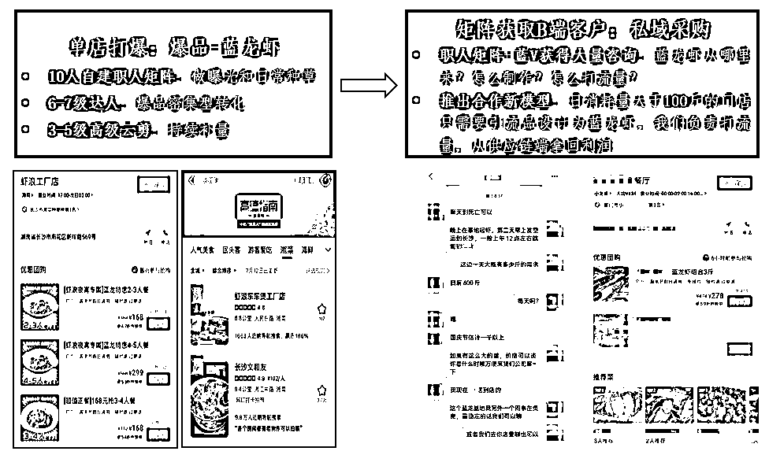
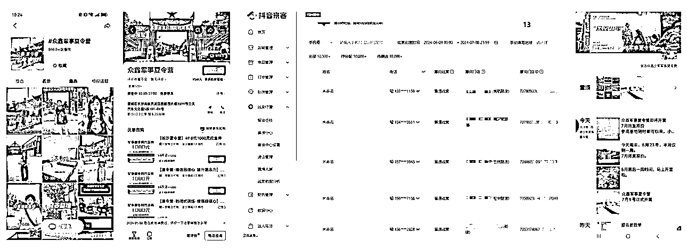

# 抖音同城高客单的高效打法（一线实战经验）

> 原文：[`www.yuque.com/for_lazy/zhoubao/gdoagrgpi9nsxwvw`](https://www.yuque.com/for_lazy/zhoubao/gdoagrgpi9nsxwvw)

## (18 赞)抖音同城高客单的高效打法（一线实战经验）

作者： 楚川

日期：2024-07-08

2024 年是抖音同城高客单行业的爆发之年，各项业务闭环均可实现。

怎么描述？那就是抖音同城【线索进线-私域或者线下转化】路径跑通，方法和经验适合不擅长做内容的团队。

**Part 1 一个前端打流量的团队为何持续关注私域**

这个故事从 2022 年说起，一个很神奇的年份。

这一年我们做餐饮爆品供应链的阶段，我们用了 10 多个抖音账号推广门店生意，但供应商和采购客户却悄悄增长起来：他们就在抖音私信、评论，以及拨打客服电话，我们让他加微信。

我们团队是没有任何私域运营基因的，就这种情况我们攒了上千个这样的私域，并且每天还能接到大量电话（高峰期 50 个，日常 10 个电话），关键是到最后：一个抖音号、一个微信号都没有被封，或者违规。

这时候我们的理解到了一个点：**通过职人矩阵咨询和官方电话进线的人群，能加微信的人群，就是极度精准，合作意向超强**。那同样的链路是可以用于同城高客单的各种打法，这就是我们企业职人矩阵的运营思路雏形。

**Part 2 抖音同城高客单的玩法拆解**

这套打法，我们从 2023 年和 2024 年一直在优化，后面再加入抖音搜索流量（SEO）的部分，终于摸清楚 3 种链路。这三种链路基本上能够让大家比较安全、可持续的方式获取流量。以下就做一些介绍，均为我们团队直接参与的项目，适用行业可以更多，大家做对标就行，注明的案例可抖音自行找寻比较、学习，未说出具体项目名称则为合作方保密项目。

**1、城市-职人流量获客方式**

流程拆解：职人矩阵→基于城市 POI 打同城流量+SEO 关键词精准流量→用户直接咨询账号或直接到店

适用行业：展会（赛灵力第一届数字人大会宣发，超出预期的 1000 人现场参加会议）、房产（增城华哥看房系列，每月 300+私域进线）、招工（轻喜到家、天鹅到家招工视频）、工厂 toB 产品（包装厂、头部化妆品代工厂）

注意点：这类方法主要是吃城市流量，范围大，客户不是非常多，所以不能居于自身公司或者工厂做推送，而是基于城市 poi 做大面积筛选，再用话术引导加微信，做长线转化。此类短视频大部分需要 10 个以上的矩阵矩阵，并做到单个痛点或单个购买理由做成批量化视频，推出流量转化漏斗。

**2、门店-职人-下单线索获客**

流程拆解：职人矩阵→基于城市 POI 打同城流量+SEO 关键词精准流量+引流产品→主动建联，私域成交→流量到店需要用标准品做密集型成交，未转化部分做长期运营

适用行业：家装（建材、门窗、家居，可参考方圆家居）、珠宝、夏令营（众鑫军事夏令营）、防水维修、租房（寓伙伴）、求职辅导（点燃求职）

注意点：引流品一定是绝对的流量品，没有卖爆则不是好的线索获客产品；流量足够大，客单价不是 2 万以上，那就必须是到店用标准化做密集型成交，提高流量效率；线索需分类，A 类为下单、客户电话，B 类为账号咨询留资和退单客户，C 类为评论区捞回的客户。

**3、门店-弱 IP-职人-下单线索获客**

流程拆解：职人矩阵-弱 IP 运营（短视频-直播）→基于城市 POI 打同城流量+SEO 关键词精准流量+引流产品→私域长期运营，定制化服务转化

适用行业：高端上门家教、高端月嫂、西装定制、防水维修、装修、法律咨询、医美（此项大部分都涉及到区域流量竞争，因此做保密）

注意点：引流品一定是刚需品，短视频和文案只戳痛点；私域做到长线运营，产品客单价在 2 万以上

**Part 3 总结**

2023 年起年穿云团队疯狂尝试这套打法，发现到现在为止没有出现过抖音账号被封禁的状态，以及微信号被封，并且能做到供给端客服直接进线爆仓。

我们后面再次优化出一个阶段性的矩阵打法：在我们知道爆点的情况下，把视频质量降低，从 80 分做到 50-60 分，根据供给方的需求做调试，来控制视频的质量和数量，目前让我们比较舒服的可持续拿结果。如果需要放量则用 kol-职人-本地推的方式，快速起量，这也得到了 5 个以上的案例验证可行性。

**所以我们就在思考这或许这就是抖音同城高客单的玩法：短视频矩阵做私信引导、抖音 SEO 提高客服进线咨询，然后被动添加微信，最后在私域逐渐转化，多次成交。**

不确定能有多久空窗期，但我们做了 2 年，依旧是安全。楚川会认为这可以做很久，同样的方法在各平台依旧适用，矩阵就应该是主旋律。

* * *

评论区：

宗源 : 怎么链接？大佬

* * *