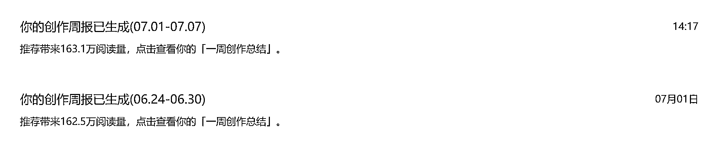
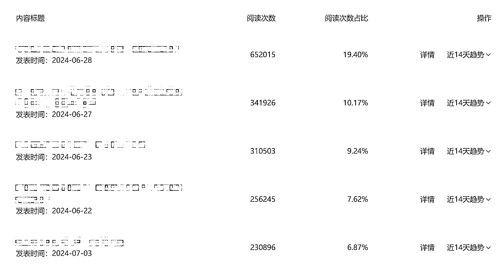
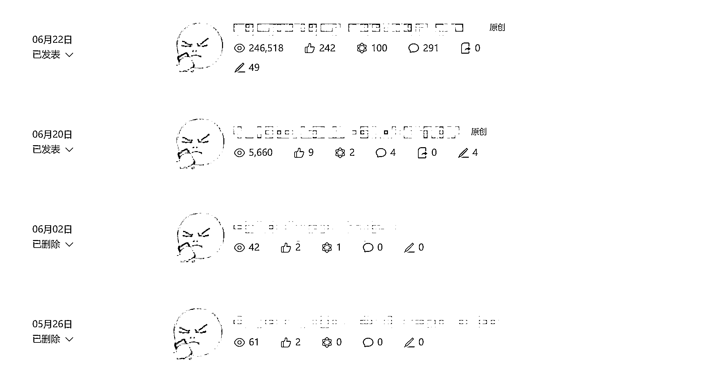
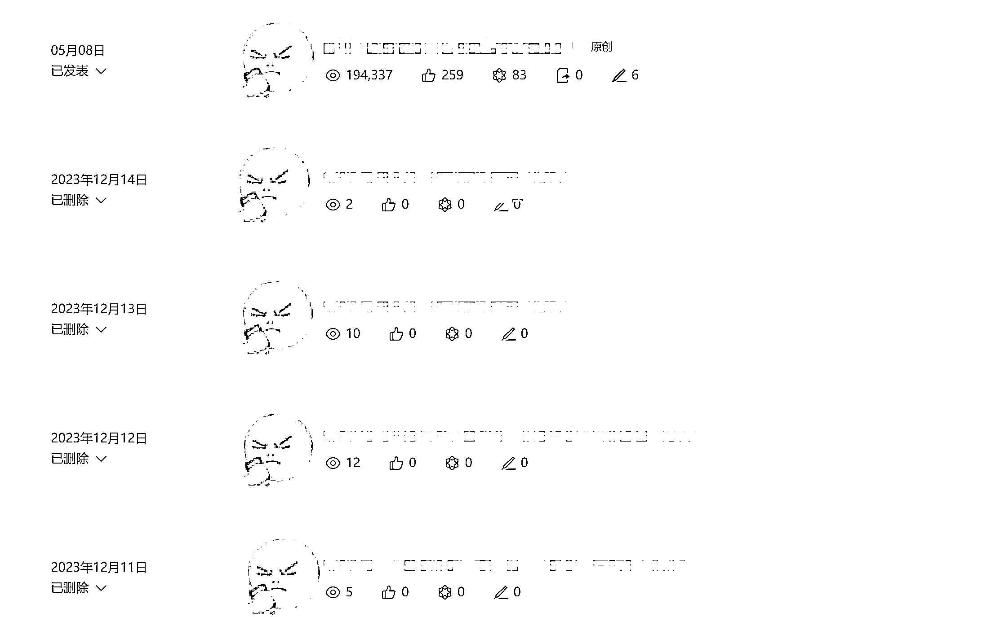

# 细分赛道加关键词，公众号爆文航海 2 周收获 320 万阅读量，变现 1.3 万

> 原文：[`www.yuque.com/for_lazy/zhoubao/sf3ivmo7xg8figmw`](https://www.yuque.com/for_lazy/zhoubao/sf3ivmo7xg8figmw)

## (121 赞)细分赛道加关键词，公众号爆文航海 2 周收获 320 万阅读量，变现 1.3 万

作者： 一 ge 不小心

日期：2024-07-11

大家好，我是一 ge 不小心，我又来给大家分享微信公众号爆文项目了，这次是刚参加完这次的公众号爆文航海，启用的另外一个号，带我躺赢了整个航海，本来想一结束就来复盘，但刚好后面有点忙，没来得及立马给大家分享。

**先说一句，最近公众号流量主是有机会的，普通人都可以拿到的那种！**

进入我的分享，首先，还是先跟大家汇报一下这次参加爆文项目航海期间的战绩，这次航海总的是做了 320 万的阅读，变现大概是 1.3 万左右，最高单日变现实 2000+，最高单篇阅读量 65 万，其他 10 万、20 万左右的有好多篇，而且是连续 10 万+。

刚好是两周，一周 162.5 万，一周 163.1 万，还是很平均的：

多篇 10 万+的文章，都是扎堆出现：

这次的航海还是比较滑稽，这个账号，其实是我之前写了没信心暂时搁置一个账号，航海刚开始我都是写另一个账号，但因为那个账号掉出了流量池，所以就启用了这个，没想到突然就爆了。之前的文章还是两位数，这一起用就直接起飞，还是蛮神奇的，爆了之后就日更，慢慢有加量，日更五六篇，几乎都能爆，无非就是大爆和小爆的区别，这就是公众号爆文项目的魅力了。

汇报了成绩，下面开始我的复盘，关于公众号爆文，现在确实有很多普通人可以做的事，并且也是很容易就拿到结果的。

**选择大于努力，战略的懒惰会败北，先强调一下。**

因为在我看来，公众号爆文项目是否能拿到结果，跟选题关系特别大。

为什么这么说呢？因为，选题决定了竞争，选题决定了对应客户的需求量，两个，对一个项目成功与否都生死攸关。

现在公众号爆文大家发现都能赚到钱了，那做的人估计就会多，多了必然同质化竞争，那想做的好，必然要做差异化，差异化的直接体现就是选题。

如果现在做公众号爆文还是停留在宏观选题，比如，你写职场，就职场拿着随便写，教材西瓜皮看到什么写什么其实很难拿到满意的结果。

熟悉我的朋友可能知道，我一直在做着电商，我也用电商来举例子，比如你要卖一个产品，比如卫生纸，这个只是你做的第一步，你必须再做好几步，才能真正找到你能做和你要做的品。比如用在哪里的卫生纸，用什么材质的等等，像现在的湿厕纸，卫生纸—厕所用的—湿的，定位非常精准，然后他就卖爆了是吧。

同样的，做公众号爆文，你写职场，如果只到职场定位这一步，就我上面说的，拿不到太好的结果。你要去了解职场这个赛道下面有什么，比如有薪资、升职、体制内、民企、外企、行业等等方向，你可以任意组合，你每做一次加法，都是为自己省去了很多竞争。

举个栗子，比如如果你选定了薪资，那这时候，你的赛道就变成了职场+薪资，显然你的垂直度就高于职场泛内容，可能很多赛道到这一步就可以了，但其实还可以继续，比如你对互联网行业熟悉，那就是职场+薪资+互联网，是吧，那你的垂直度又上升了一个维度，竞争上自然又更少了。

就这样操作，找准自己想做的选题，你去做测试，拿到的结果自然会比泛职场完全竞争下更好。

那是否代表这样就够了呢？就可以好好做个账号赚钱了？可能未必，虽然赛道选好了，但是执行，却还是有困难，就像上面说的，假设你确定写职场+薪资+互联网，那你怎么动手呢？是不是还是一片茫然？

**这时候再跟大家分享我赛道+关键词的方法，用这个方法去找对标文章，你将同样收获 10 万+！。**

给自己做了赛道细分之后，你这时候要去想，这个赛道的人最关注什么，关注什么，就是人群的需求，就会有对应什么关键词，而关键词，就是你选好的职场+薪资+互联网这个赛道的微观定位，或者叫你的切入方向。

因此要最少去想一个关键词，然后去搜，比如互联网职场薪资，是不是关注多少钱，那他会对应什么关键词呢？是不是“总包”“大厂”“年薪”等等这些，我随便举例，讲方法，未必准确，把你想到的，都列一下，这些都用微信的搜一搜，按最热排名，看看哪个火，哪个 10 万+最多，说明人气就在哪里。

这时候，你就去写最热的地方，或者以最热的起号，你可以把这些文章都对标了写。甚至还可以把每篇文章标题复制了单独再搜一下，如果有其他人写了相似的内容也 10 万+了，那其实你再去写，成功率也会更高，从高到低，挨个的去对标了写，一般都能有效果，刚开始没进池一天发个一两篇就够了。

航海期间我就是在反复筛选之后，找了一个细分的赛道，然后在这个细分赛道里面，筛选出一个关键词，最终航海中我只用围绕这一个关键词来写，按照我的工作流拆分每天的工作，每天都是围绕这个关键词反复写，在这个关键词下面我的穿透力很快就有了，拿流量自然也就来了。

通过我这个方法，就相当于不断筛选和降低竞争，为自己找了一个你所能做的最容易火也最容易拿到结果的方向去做，自然容易看到效果。类比做电商，如果不知道卖什么的时候，能把全网卖的最好的 1000 款产品放到你的店里面，自然会有销售，你肯定也能赚到钱。

**说完怎么找要写的内容，这时候就进入怎么写了。**

前期我是用 Kimi 和 ChatGPT 4o 去帮我写，怎么用呢？我刚开始是把文章复制在文本文档，然后让 Kimi 或 ChatGPT 4o 帮我分析这篇文章或这几篇文章的写作内容风格等等，然后让 Kimi 或 ChatGPT 去学习，并帮我用这种风格原创一篇，这样我就可以人工再稍微润色一下就可以发了。

后面在航海过程听说 Claude-3-opus 不错，我又买了这个的使用，测试下来确实不错，文章的机器味比 ChatGPT 4o 还少，后面渐渐转到使用 Claude-3-opus 去做爆文的生产，方式方法和之前用 ChatGPT 的一样，只是稍有修改提示词，步骤几乎没变，这样对我效率又有了一个提升。

选题选的好，文章只要没啥大问题，都有可能爆。

最后，就是在做项目心态上，大家可以别太有压力。微信公众号爆文本来就是拿免费流量，免费流量天生不稳定，别太在意，很多号火着火着突然就不行了也正常，很多号长期一两个阅读突然就火了也正常，其实很多时候你不一定能完全掌控，所以心态一定要好，预期要低，不然会很难受，虽然钱赚了，但人会很焦虑。

比如这个我之前一度以为死了的号，放着再写就爆了，后面跟一些圈友沟通下来这种放着不写的号更容易起一点，所以也不必焦虑，账号不行了就给他放着或者注销重开，像我这种放着也行，后面再写还是可能会爆。

赚钱嘛，还是要以服务生活为准，不然到头一场空。

* * *

评论区：

lily : [鼓掌][鼓掌][鼓掌]大佬就是大佬
陈义轩 : 学习了
WILL : 退而结网 ing
大锤 : Claude-3-opus 这个工具是在哪里买的啊
道法自然 : 感谢大佬又提供了一种细分的思路
Qwen : claude3opus 哪里买？多少钱一个月？
无中生有 : 淘宝搜 poe
无中生有 : 淘宝搜 poe

* * *