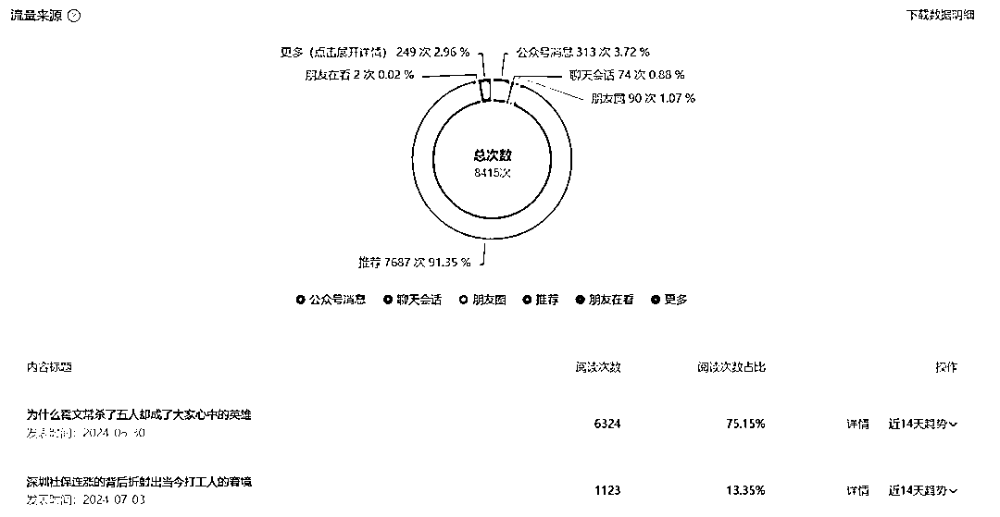
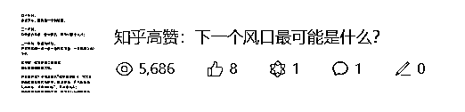
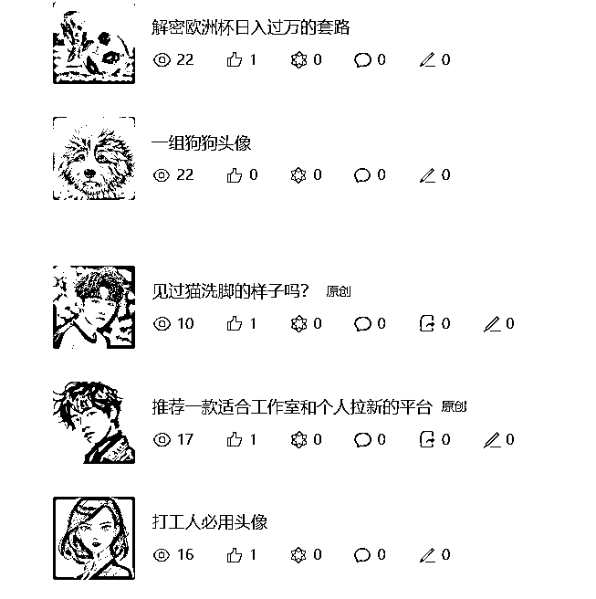
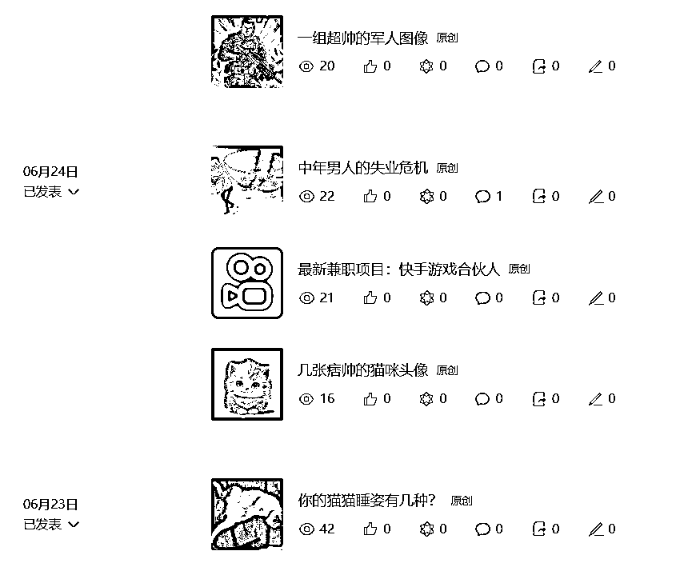
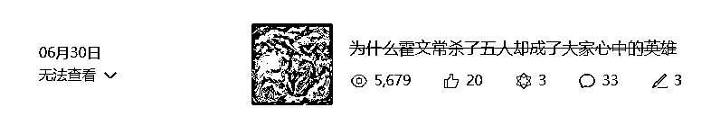
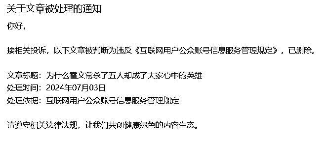
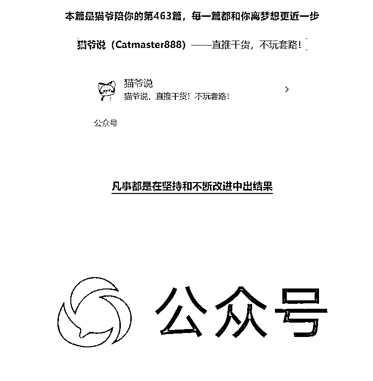

# 不靠 AI 如何打造公众号爆文？

> 原文：[`www.yuque.com/for_lazy/zhoubao/yxcr0hni4d4qvfkn`](https://www.yuque.com/for_lazy/zhoubao/yxcr0hni4d4qvfkn)

## (13 赞)不靠 AI 如何打造公众号爆文？

作者： 猫爷谈赚

日期：2024-07-11

鄙人不才，重新做自媒体后目前出了一点小成绩。所以才敢把自己现有的心得体会拿出来给大家做一个分享。内容有点长，但绝对是干货。还请耐心看完~

话不多说先上数据

因为本文章写于深夜凌晨两点，因此昨日爆文还没更新到总数据里面。因此补了一张昨日爆文的数据。虽然几千的阅读量跟很多大佬比起来根本就不算什么。但这是我从六月底重新恢复公众号更新之后。在这个月月初开始已经有三篇阅读量破千。而且从数据分析我们可以看到。91.35%的阅读都是来自于平台的推荐。由此可以看出我所写的内容是得到平台的认可才会被平台投放到流量池里面

接下来我会从自己为什么不靠 AI 来写，以及目前初步找到的方向、写作过程中的一些经验和踩过的坑逐一和大家做分享

**一、为什么放弃高效率的 AI，而选择一字字的创作**

一开始我是用 AI 写过一篇[中年男人的失业危机](http://mp.weixin.qq.com/s?__biz=MzIxODE0MTM4Mg==&mid=2247487782&idx=1&sn=33cfcba040331d3ace687326d7ff6c51&chksm=97ee568fa099df99471284730b397f6c9383a9b6bc0123ff6aa7098a9768d8248fc0bbede5bd&scene=21#wechat_redirect)，那次我承认我确实是犯懒了，因为给自己定的目标是坚持日更，加上那时候浏览生财里面的关于公众号的帖子，发现很多大佬都是用 AI 来进行辅助创作。于是自己便试着用 AI 来写了这篇文章。发表后反响平平。但一个读者的留言给了我当头一棒，让我不得不反思，自己写公众号的目的到底是什么？

是为了赚钱？还是为了自己喜欢写作的爱好？扪心自问我不是圣人，搞自媒体的目的自然是为了搞钱。但是如果连读者都很轻易的看出文章是 AI 写的，那么这样的文章又有什么样的质量来吸引读者？我不可否认现在 AI 技术的强大，输入相关的指令也可以写出有情感的文章。但是我始终认为机器永远是机器，再先进也代替不了我们人的情感。如果随意用 AI 来写应付了事，那么糊弄的不是读者而是自己

连自己这关都过不了，我又怎么能过得了读者那关？又怎么对得起自己从小就养成的爱阅读和写作的爱好？如此低劣的文案又如何能够吸引读者获取收益？反思过后我对这条留言加了精华。目的也是警醒自己在今后的创作过程中不要再去糊弄自己。也在此感谢读者“安晴学社”，感谢你的提醒让我走上正确的创作道路

重新复盘调整后，我决定摆正心态。戒骄戒躁，先不去想着要靠这个来赚多少钱。而是想着每一篇文章都投入自己的想法和情感。将自己代入到每一个事件当中去。以当事人的角度去描述，以旁观者的态度去分析。通过不断的写作来磨练自己的心性，锻炼自己的写作水平。权当是自己在做一次深入的学习

**二、我目前收获的经验和踩过的坑**

接下来说说每个阶段的经验和踩过的坑

**1、如何定位自己的公众号要推送哪方面的素材？如何明确自己写作的方向？**

**踩过的坑：**其实我一开始公众号的名字是叫做“猫爷谈赚”。当时的想法是每天推送一些副业的项目，或者一些赚钱的思维。但是一直反响平平。很用心地选项目写文案。但就是阅读量始终在两位数徘徊。做了两年时间写了四百多篇粉丝才 1000 左右。后来由于主业繁忙就停更了一年多

上个月月底手上的事没那么多了，想着再努力一把。于是又重新开始捣鼓。一开始写了几篇赚钱的思维还是老样子。也试着发一些杂七杂八的东西

很明显没有什么用，这也算是自己踩的第一个坑吧。那就是**定位不明确，写作方向也不明确。心态焦躁，病急乱投医**

**收获的经验**

在我焦躁的这段时间，刚好加入了生财。通过鱼丸推给我的“生财思维课”里学到一个“对标思维”。于是我开始有针对性的在订阅号-看一看里专门找那些阅读量过 10W+的文章，之所以寻找对标这类文章，就是因为他们能被公众号官方推到看一看里，肯定是先得到官方的认可才会被推到流量池来帮助作者获取更大的流量，但有官方的推送还不够，如果文章本身不够精彩也不会有太多的阅读量

所以我通过对标这类文章，从标题、排版、图片等各个角度去揣摩学习别人好的地方。站在读者的角度去想这篇文章是哪里吸引了我？题材？标题？封面？还是文案内容等，找到能够吸引自己的那个点，就是我要重点去学习的点

对标思维按我的理解就是向那些做的好的看齐，学习他们身上的优点。同时套用五菱的一句广告词“人们需要什么，我们就造什么。”对于我们自媒体的创作者来说就是“读者喜欢什么，我们就创作什么”。

通过对标除了带给我学习的方向之外，我还通过对标思维去寻找那些受众面较广的题材。例如人文历史、时事热点、法律、美食美景、时尚穿搭、萌宠等。在寻找这些题材的过程中，我结合自己的优势，决定从时事热点开始入手。针对当下发生的热点事件去创作。果然创作的第一篇此类题材的文章就小爆了一下

至于为什么被下架，这点我放到后面来讲

**2、如何写出一篇看着舒服的文章？**

之所以我要用看着舒服这个词，是因为我们都不是大文豪。没有深厚的功底是很难写出惊世绝作的。所以对于我们大多数作者的水平来说。只要写出来的文章能够让人看着舒服，能够吸引人从头看到尾就够了

**标题**

好的文案首先就是标题了，标题一定要有针对性，不能跟你文章的内容脱节。同时不要夸大，字数避免过长或者过短和缺乏关键信息。但同时也要能够突出文章想要表达的主题，让读者第一眼就能够被吸引。**同时千万不能有欺骗性和煽动读者负面情绪的倾向！**这点尤为重要！我前面提到的第一篇爆文被官方下架的原因就是因为标题带有煽动读者负面情绪倾向的嫌疑被下架了，申诉都没用。虽然这个标题符合文章主题，也够吸引人去看。但是违规了就是违规了，没有任何情面可讲。这也是目前我踩过最大的坑。这也给了我一个深刻的教训。**不要违抗平台的规则，否则就是毫无情面的封杀！**

**写作思路**

每个人习作的习惯都不一样，由于我现在主攻时事热点类的文章。所以我主要是分为以下几块来完成创作

一是先简要阐述事件的过程，这块我主要是先浏览各个主流官媒对该事件的报道。然后从中汲取内容进行整理，这样做既可以保证事件描述的真实性，同时又能保证文案开头的质量

二是对该事件进行扩展，也就是再讲述一个同类型的事件。事件的时间不一定要近期发生的，只要是之前有发生过进行，同时在讲述的过程中尽量以当事人的角度去讲述，加入自己的情感，这样能够进一步引发读者对此类事件的代入感

三是针对该事件分析自己的看法，在分析该事件的时候，一定要以第三者的角度去分析。不要待人情感和主观印象。尽量做到公平公正，同时千万不要带有任何情绪上的煽动和道德绑架。例如“不转不是中国人”。最后做收尾总结，总结可以是以后我们自己遇到这些事怎么防范，也可以留钩子给读者做思考。但是千万千万别用“你怎么看”这几个字来引，因为对我来说真的很 LOW

**创作技巧**

技巧方面首先就是巧用成语或谚语，这样给人感觉你是专业，同时也可以让文字更加生动。但是用的度要把握好，用的多了一方面读着累，同时给人感觉你是拽文。会留下较为不好的印象

同时要避免空话套话一堆，在这里我要重点强调一点：**不要去追求字数！**以前我总是很在意字数，总觉得字数多点才算是好的文章。这也导致了我在写的过程中为了追求字数生搬硬套。显得空话连篇。说了半天都没有到重点上。这样又有几个人有兴趣看下去？

因此现在我在写作的过程中，就按照自己的思路顺其自然地去写，文案追求简洁明了，突出主题即可。通过这样的方式不但能写出流畅的文章，同时我也发现这样反而能写出较多且有用的字数。就像现在我写的这篇。按照自己的思路一口气写下来，竟然写了三千多字。也算是破了我的纪录了

同时要巧用图片或视频，以前我不爱用这些。所以这篇文章即使很用心的写了，但是看着总感觉少了点什么。就好像一个装修非常好的房子。缺乏了好的家具做点缀。总显得有点空。所以适当的图片或视频能让整篇文章看着更加生动。并增强可阅读性

最后就是排版和字体了，我现在的排版开头是这样的

这个是我参考对标了公众号“洞见”和“多元思维 Hack”的排版设计而来，给大家做个参考

字体的话我是直接用系统默认的 17 号字体，对分割和重点部分进行加粗、下划线或者颜色调整做处理，这种做法不会给读者带来阅读疲劳。也能够增加视觉效果上的层次感，行间距什么的也都是直接隔行就好，基本上在电脑上写到最多六行就可以换一段落

**结语**

以上就是我到目前为止所经历的每个阶段获取的经验和踩过的坑与大家共享，也真诚的欢迎大家对我的不足提出宝贵建议，期待我能和有志于在自媒体这条道路上有所成就的朋友一起共同进步！

* * *

评论区：

亦小亮 : 干嘛不去参加公众号爆文航海，一些坑就不用踩了
猫爷谈赚 : 加入较晚，想参加的时候已经结束了[撇嘴]
亦小亮 : 没事，还有 8 月份的
猫爷谈赚 : 嗯嗯[加油]
Rio : 不知道这种方法一篇文章要花多少时间，从选题到发布
猫爷谈赚 : 这种是偏个人爱好，如果是纯粹走效率还是用 AI 最好
Rio : 最近在学手搓 想知道高手多少时间一篇
大自然的孩子 : 我也是自己逐字写✍🏻想法来了赶快记[让我看看]找到主题，就去对标别人的标题、内容怎么写

* * *