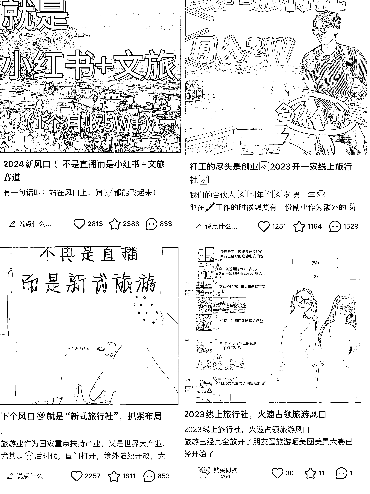

# 不是标题党，我真的实现了边旅游边赚钱

> 原文：[`www.yuque.com/for_lazy/zhoubao/wt3u83ii8koy8ym9`](https://www.yuque.com/for_lazy/zhoubao/wt3u83ii8koy8ym9)

## (50 赞)不是标题党，我真的实现了边旅游边赚钱

作者： 涓

日期：2024-07-12

旅游赛道，是做私域品类选择中的一个不错选项。

今天这个旅游项目可能和只做前端引流、或者是制作后端交付不太一样，靠的是自己转化自己赚钱。

可以理解为代理商，分享赚钱，自用省钱。主要买的是旅游资源和系统服务，比如所有旅行线路、供应商和地接社这些，然后靠公域引流和私域经营实现转化和复购。

我是从 17 年开始做这个分享式旅游，大概是做了 3 个月，第一个月就开始盈利了，纯利润是每个月 5-10 万，做了一年去了 15 个城市，基本是边玩边旅行，也算是做得比较好的一批人 了。

一开始也是只做私域，后面才开始慢慢在小红书等公域平台获客引流的，今天也借这个机会，也分享分享我从公域引流到售卖产品再到私域变现的完整链路和方法，主要分为以下 4 个板块：

一、如何在自媒体平台中 0 成本获取旅游客户

二、搭建好朋友圈 IP+社群+构建私聊体系，快速转化变现

三、疫情 3 年，不做运营动作，老客户定期复购

四、第一批客户如何来？个人私域高段位冷启动全流程

疫情后，旅游需求井喷式增，有很多人看好旅游业，但是又不知道该从何做起，毕竟现在办一个旅行社的执照，开个传统的门店旅行社的成本一般在 30-50 万，过去十年前可能还行，但现在线上冲击是不太推荐去做了。

而且出现 OTA 在线旅行社以来，携程途牛等等来，大家的报团习惯都有被改变，直接线上就可以搞定了

那么普通人想做旅游该从哪里入手呢？投入少、不用办理复杂的旅行社营业的执照、在上班也可以做的方式有吗？不会直播不会拍短视频，也没有资源也做旅游吗？

其实在 16 年的时候就出现了适合普通人有微信就能操作的， 轻资产投入的分享式旅行小项目，目前这种项目的代理人有很多好听的名字，比如旅行体验师、旅行主理人、旅行达人等等。

但凡看到这种名字就是同样的模式，总结来说，8 个字，**分享赚钱，自用省钱。**

[**旅游知识百问百答**](https://ngi6mys0xx.feishu.cn/docx/OwbTdRKAGo5MYExsX07cAPhtnZc?from=from_copylink) **（关于旅游的一些专业术语，可以先看看）**

我在大学时期还是个学生的时候，每个学期会去一个城市穷游，“世界那么大、谁不想去看看”呢，但作为学生来说，当时是有时间但是没钱，而步入工作以后，发现就是有钱没时间了

我那时候在想，有没有那种既可以赚钱又可以旅行的项目或者工作，除了导游，毕竟一件热爱的事情变成了正儿八经的工作，可能又不一样了。

在 17 年，最开始是受朋友圈里面的一个小姐姐的影响，看她天天在外面旅游，各种美图各种风景晒在朋友圈，很惬意，于是就咨询了她，就开始做这种分享式社交旅行项目。

这个相当于一个旅行社的代理商，当时有个好听的名字，叫做“旅行体验师”，最开始投入成本是 2888，其中 2888 还包含了 2000 的旅游基金，后面去哪里都可以用这个 2000 抵扣。

相当于 888 买了这个平台后面的所有的**旅行线路供应商**和**地接社，还有一个旅行社的营业资质，已经背后的客服、计调、法务等等团第，自己抱团还有优惠，家人朋友旅游可以赚钱，简单来说就是拥有了一家线上的共享的旅游公司。**

这个更多是一种模式上的创新，将传统的旅行社需要投入的业务人员成本转变成了可以盈利的方式，而且大家还能乐意，无非就将提成变成现在的佣金分出来一些给这些旅行体验师们，而且这些旅行体验师们还是最忠实又持续精准的客户 。

从 16 年到 24 年，这个平台模式有一定争议（大部分是传统旅行社的同行），但一直在持续，目前 24 年加盟的代理商已经有将近 25 万+，分公司破万+。

这种项目投入少，再加上旅游这个热门关键词，好传播好获客好做内容，疫情过去，抖音小红书，现在还有视频号，尤其是小红书，里面一片沃土，全是精准的年轻客户，而视频号全是精准的中年人客户。

我们个人经营这种轻资产项目，它主要盈利其实更多是来自于私域转化，完整链路的经营方式挺值得学习的，即使不会做公域，只要自己好友有几百个人，做好私域，其实都很好做变现，旅游自带魅力，是绝大部分人都向往的。

17 年开始，我大概是做了 3 个月，第一个月就开始盈利了，纯利润是每个月是 5-10 万，做了一年去了 15 个城市，基本是边玩边旅行，属于这个平台里面做的好的那批人。

因为我本身学生时期就在学校有个百人的微商团队了，所以做起来相对比较容易。

今天就来分享这种轻资产旅行模式如何完整变现的链路方法，就不细说他的模式和其公司平台了。

来分享前，我就拖沓了很长的时间，一是自己原因，二是这个分享的点没注意好很容易变成拉人头了发展下线了，三呢是我中间断了，20 年疫情开始到现在其实也只是当成副业，只有原来的一些旅游老客户想出去玩了就给他们找旅游产品。

# **一、引流篇：如何在自媒体平台中 0 成本获取旅游客户**

**（1）选择哪个公域渠道获客， 首先看我们自己的定位，想要主推什么产品，获取什么样的用户。**

有能力出去旅游的用户其实分两个极端点：**35-50 这个年龄段的中年人一般出去旅行的比例还比较少**，反倒是 18-30 学生或者无负担的年龄段，或者退休的叔叔阿姨们是报团的主力军，而在小红书上获客引流的基本都是年轻人。

当然也有那种高端定制游不缺乏有消费能力的中年人，但是如果是想吸引中老年的话，在视频号上面获客是个很不错的选择，叔叔阿姨们都有消费能力，而且导流私域更简单，但是两个平台的内容的侧重点是不一样的。

我们因为更加偏向在年轻人的社交旅行，所以目前在公域引流的渠道绝大部分比例是在小红书、

我 18 年就在使用小红书获客，当时发了 3 条小红书，吸引了一百多个对旅游感兴趣的朋友直接加微信，第一个月就有当时就有福建、黑龙江、浙江的聊了几次直接做了 3 万的主理人，收入妥妥的破 5 万，粉丝质量极高。

我当时选择这种项目有一个好处就是没有地域限制，随便收哪里的客户都可以帮他安排到位。

因为如果是自己开线下的旅行社，基本都叫地接，其实一般都有地域的限制，目的地都是只有这一个省份的。

（大家可以看看关于地接社的解读**，旅游知识百问百答**）

**（2）不管是哪个渠道引流，注意点，5 个 500 的粉丝账号比 1 个万粉账号更有价值，提前准备多个账号**

首先心态上，做这个旅游号，我们一般不追求涨粉和执着在 IP 上，更多的是追求引流爆款，准备多个小红书或者视频号账号在手里，引流到私域进行变现.

因为现在的万粉旅游账号经营起来的周期长，单靠商务推广收入也不稳定，只要能导流 5000 个精准爱旅游的粉丝到私域，基本年入百万就不难了

准备好了账号，注册养号这个生财有很多伙伴都分享了，就不细写，那接着就是账号的打造上，四件套的设计：头像、昵称、简介、群聊。

虽然账号主打引流，但是前提还是要有信任基础'。

**头像背景图**最好选真人头像和某个旅行场景的照片、（直接证实你自己也在体验旅游这个事情），**名字和简介**我们还是会打上跟旅游这个品类相关的一些关键词。

比如爱旅游、超爱玩、环球中、边旅行边赚钱、等等，尤其是吸引年轻人的小红书，除了单纯的出去玩，还要和赚钱挂上钩。

**（3）内容上，直接图文就好，简单一天可以产出 10 条不是问题**

在小红书这个渠道，标题+封面+内容标签+评论区引导，因为你是导流贴，基本都是以钩子标题为主.

**标题主打一个，抓人心理，这些都还是有些营销化的，但是屡试不爽，谁用谁爆：**

捷径心理：《适合普通人低门槛的赚钱副业》

慕强心理：《25 岁年薪百万，分享给女生的创业搞钱经验》

贪便宜心理：《学生党毕业去这玩，500 块，玩到嗨》

恐惧心理：《千万别带父母去泰国，因为这》

猎奇心理：《刚毕业，每月出去旅游，还能月入 10 万，我是怎么做到的》

求搭子心理：《有没有旅游搭子》《有没有姐妹一起下班一起开旅游工作室的》等等

去产出什么样的内容呢，直接关键词搜索旅游+赚钱，“风口机会”“边旅行边赚钱”“线上旅行社”“找旅游搭子”，反正就是将“旅游”+“赚钱”+“线上”+“特定客群（大学生）（宝妈）（裸辞打工人）（社恐星人）”结合起来，这样找你做咨询的人就很多。

搜索关键词后，你就会看到热门文章，选中一篇热门文章进去，一般博主在文字内容中都在下面打了#号的，你直接点击去看。

**看最新和最热，#关键词热度大（看上面的浏览量）的你全部整理起来，下次发内容的时候全部用上标签，还有如果你的账户是做垂直类的账号，比如只做新疆的定制游，那就多打垂直类标签。**

**（4）如何导流到私域？**

**小红书对站外导流管的还是一如既往的很严，这里放上几个我们常用的方法 ：**

**收藏法/ 图片法/ 拉群小助理法/ 店铺法/专辑法/主页打卡法**

1、收藏法：量大留企业微信，个人经营个人微信就行，准备 2 个号，小号发布一条带微信的图片

2、图片法（准备 10 张不同样式的图片，将微信号隐藏在图片里面，用户私信时发送）

3、拉群法（设置好相应标题的群，在内容爆款后可以再直接挂在下方，用户进群后，小号发信息到群里）

4、主页打卡法：提前做好微信号分别放在几张图片上，点击打卡

**（5）线下导流方式**

1、外出旅游跟团是一个特别好找精准客户的时候

我们自己出去旅游时，不要都和自己公司的人出去，多报旅行团，年轻人多的旅行团

20 年，我报了一个去韩国的团，里面 80%都是年轻人，选择地域旅行也很重要，**但是是个 12 人的小团，里面我成交了 6 个人，选择做我这个模式，**没有刻意成交，就是自然而然聊到我做什么，结果大家都很乐意。

出发地址选择江浙沪带出发，目的地选择海岛类、年轻人多的，毕竟这个事情，说到经营还是年轻人更擅长。

这样外出旅游一趟不仅不花钱，还能赚几万。

**2、洽谈实体门店，嫁接到实体门店或者通过实体门店去引流**

一般选择门店类型是美业店、咖啡店、服装店、酒吧、反正是年轻人聚集的店子，尤其美甲店的客户都是我们的精准客户，年轻爱漂亮的女孩子，在美甲师前摆个社群二维码（活码），取个好的群名。

如长沙旅游搭子群等等，做美甲无聊的时候，会自动的给你扫码加上，至于摆这个二维码，老板为什么愿意，先提出给费用，然后问她一个月的进店流量，或者按进群人头给费用。

老板会担心客户安全问题，这个也是你跟老板普及这个平台和项目的好的机会，说不定她自己就先成了合伙伙伴，嫁接到门店的说服点是告诉老板，开一个门店做 2 份生意

当然，这个线下说服，最好准备充足，带上相对应的物料是最好的

**二、培育转化：搭建好朋友圈 IP+社群+构建私聊体系，快速转化变现**

朋友圈是能否快速拉近信任感的地方，也是第一时间让用户认识你的地方

**（1）朋友圈搭建好 5 件套，头像+昵称+个人简介+背景图+置顶**

头像和昵称注意，最好和你的主要公域平台导流账号头像统一，做到二位一体，这样用户过来以后才不会有陌生感。

头像真人头像、昵称越简单好记越好，比如水果名、数字名、等等之类.

简介呢，还是跟旅游相关的，你是谁？你做过什么？你有什么价值能提供什么？

现在微信朋友圈还有置顶这个位置，必须利用好这个版位，**3 条是必置顶的内容**：

1.  你的品牌项目权威证明背书
2.  我官宣做这个项目的原因
3.  我做的结果和效果的一个展示

**（2）朋友圈的内容，要稳定输出，不断增加曝光，混个眼熟**

有些人是碍于面子也不太愿意发，有些是纯粹自己觉得没有内容发，觉得丢面子的就自己克服，赚钱这是劝没用。

我们主要是针对自己觉得没有内容发的朋友，有 4 个框架内容，每天记得各个框架输出一条就行。

**（3）朋友圈要当成品牌店一样经营，注意朋友圈美学排版**

朋友圈的文案，排版要该分行的分行，不要“一口气”连着发一长段文字，看着也费力，不要像微商一样放很多小表情，尽量分段文字输出，做到简洁干净，偶尔用几个小表情表达下情绪。

现在发朋友圈频率不能像原来一天 10 几条轰炸了，最好一天 3-5 条差不多，考虑朋友圈打开频率低了。

你可以一小时发一条，但是要把上一条删除，做到大家一直能看到你的内容，但是点进主页一看却就只有一条，每周有一次筛选内容，发过的广告，不重要的该隐藏的及时隐藏，营销性不要太重。

当大家爱上看你的朋友圈的时候，变现就不难了。

**（4）私聊体系——分阶段运营**

1、刚加好友初认识

**问候语不要过于官方，自然的当成你和好友在沟通**

我个人认为，私聊要有 SOP 标准化的流程，但话术不要太死板和生硬，不要让进来的人觉得你是一个公司客服，而是一个活生生的人，比如：您好，您是小红书过来咨询线上旅游项目的吗？

然后发一大串话，这个直接 PASS 掉，除非你是企业化操作、流量用之不尽，为了快速筛选精准客户：

**① 好友申请及时适时**，要不就马上通过，要不就选当天的中午和晚上大家有时间聊天的时候通过。保证互动及时性。

**② 养成做标签习惯，做 3 栏备注**：标签栏（备注渠道来源）——名字栏（备注加进来的日期，周期性沟通）——描述栏（通过聊天和朋友圈中的信息得知，如身份类、黏性度等等）

**③ 简单判断用户身份和信息后，做相应的开头语**

如果用户都是年轻人，加好友第一句可以发个表情包，表情包是拉近距离神器，自然的问下“怎么称呼，我做个备注”等等，接着你可以先透露你的一些信息比如城市、寻找一下你们之间的共同点。

聊天的过程中，简单的设计一些选择性问题引入主线，如：你是想找旅游搭子还是想尝试做下线上旅游这个副业？等等，再发送部分资料可以让其做了解。

**④ 第一次加好友，让她对你产生好感信任**，后面第 3 天和第 7 天的时候再闲聊时，发送一些官方的资料证明下项目的权威，后面拉她进入你的组建相关主题社群（全球旅行团）

#### **2、培育阶段 借助社群培育**

#### **① 先明确旅游群定位**

根据自己的身份、微信好友人群确定自己的定位

必须明确你的旅游社群的定位，只有这样，才能把同一属性的好友聚集在一起。

例如你是有孩子的，你身边可能因为孩子有交集的人群比较多；例如你是运动 girl/boy，你身边可能有相同兴趣爱好的比较多；例如你是 90、00 后，你身边年轻群体比较多。

例如你是 80 后，爸妈不太用操心你的孩子、能有一些随时出去玩的叔叔阿姨。例如你是学生，那你一定有许多同学。

接下来是根据定位取一个名字

1.  捡漏群→【月薪三千也能出国游】、【长辈们的实惠旅游团】
2.  社交旅行→【心动的旅行搭子集结】、同龄人的搭子群】
3.  有孩子→【嗨妈遛玩团】、【带娃看世界】

然后需要根据你的群定位，有一个符合定位的群规～

#### **② 建群顺序，前 40 位是可以直接拉近群的**

前 40 位可以拉那种不说很熟但预计是潜在客户的人群，如上面引流来的客户

——接下来，再邀请关系好喜欢旅游的朋友

——接下来，需要我们在朋友圈"招募"

（建群其实是个可以持续触达的方式）

**（5）销售转化私聊阶段：**

提前准备好相关的工具、如项目具体介绍海报、他人付款海报、他人结果证明截图、付款码

等到开始转化的时候，客户一般是问问题的时候，这个一般我们有一些高频的问题库解答话术，直接用 ，提高效率。

等到大概临门一脚时，建议是找理由语音沟通，语音沟通第一是可以更加快速的清楚她的真实意图，二是可以逼单。

至于准备那些工具是很有必要的，不能光靠文字来说服别人，眼见为实，有图片和有视频会更加容易让人有信服度，销售中我们要善于借助工具（提前准备的工具和截图）

# **三、复购篇：疫情 3 年，不做运营动作，老客户定期复购**

我 17 年开始做的这个项目，到现在六七年了，而且没有花太多精力做经营，但是还是有很多老顾客复购旅游团，每个月平均下来是可以赚个零花钱。

**（1）模式优势**

就是这个模式本身就设计好了，我们招募的代理其实就是死忠粉，因为代理是可以拿返佣的。

相同的团到携程订，在我们自己这边定可能可以便宜几百到上千，高端的大几千，我们自然出行一般就是选择自己平台的。还是自用省钱，这个名额可能一直用。

**（2）好且匹配的旅游产品是复购的基础**

**第一是好，**一个城市可能会有很多的路线，中高低价位都有，哪怕是同样线路中，可能负责的司机导游不同，也是有体验感之分的。

这个时候，我们作为推荐人首先要自己去看整个旅游线路的内容，里面有多少个购物店、住宿的星级、交通是凌晨飞还是什么时候、游玩景点有哪些等等，看看跟客户的预期匹不匹配。

再者，可以询问负责某条线路的计调，了解大量游客游玩后体验的情况，尽量在同一价位中线路优中选优。

**第二是匹配，**在推荐旅游产品的时候，询问清楚客户的相关情况

如：人数、出行日期、游玩时间是 5 天还是 7 天、预算、想去哪几个城市、对住宿的要求。

如果预算客户不方便说，或者还没有熟悉到那个程度，我们可以通过一些其他问题来大概预估。

比如对住宿有没有要求？希望自由行还是半自由行，还是可以接受跟团游，只有询问清楚客户需求，匹配合适的旅行团，提升满意度，PS：当客人报的低价团时，一般都会有购物店，提前告知到位**，做好预期引导。**

**（3）像私人定制的管家一样服务好全程，让客户裂变**

当客户报团后，不是撒手不管了，正是服务和转介绍的开始。

在出发前：提前准备几样东西，**她旅游地的攻略**、提前查好**当地的天气**、如果是出国的，**护照签证及现金兑换等等都要提前沟通到位**

旅行过程中：偶尔问候，住宿情况呀、吃食情况等等、有没有拍美照等等，增进下感情

旅行后，其实前面做了这么多铺垫，也是希望客户的推荐，在客户非常满意的前提下，提出一个小小的要求，分享一下朋友圈，推荐一下你的微信。

让其推荐前，提前备好文案和相关图片，文案框架如下：客户的真实感受+我是找我的朋友报的团，她经常出去旅行，百科全书，会玩会拍照，她还组织了一个旅行搭子群，里面经常会有很多踩线团推荐，喜欢愉快又有性价比的旅游的朋友加她吧

图片包含客户美照+你的微信+旅游搭子社群截图

**（4）做标签分组、发定向内容、拉入相关社群**

做好标签和社群，持续培育、持续触达、持续复购。

（中老年一年旅游频率基本在 2-5 次，年轻人可能会稍微少一些，还有团体性客户比如公司老板采购就单独，无需拉群。）

**1、在运营上**

① 不同社群做不同内容 主要根据用户人群来分类社群

② 扶持群内的意见领袖（E 人，热衷于社交、是对我们的旅游产品满意的）

③ 发布优质且性价比高的旅行团产品（如 1999 巴厘岛）

④ 制定相关话题或者，规律发布，比如疯狂星期三（放超级踩线团，6999 游欧洲 4 国）

⑤ 组织线上线下活动 （本地的户外露营等等）

⑥ 群内做奖励机制设置——（嫁接城市探店活动、免费吃美食、做 SPA 等等活动免费给群内粉丝福利）

# **四、第一批客户如何来？个人私域高段位冷启动全流程**

我是 17 年开始做的，这个时间段都没有用上抖音、小红书等等，没有公域流量，那我的第一批客户是怎么来的，得益于我的私域运营

**1、亲身体验才更有说服力**

在正式开始收客人收代理推广旅游路线前，我是自己先亲自外出体验过旅行，那是真的好玩，毕竟都是年轻人，中间掺杂的中老年也有，但是整个旅行就是很有趣。

然后就是拍美美的照片发朋友圈，毋庸置疑，朋友圈的好友们最关心的就是你的个人生活，尤其你还是发自己的旅游美照，比起生硬的广告，这个不招人嫌而且互动率极高。

**（去云南路上随手一张自拍——设置一个互动文案）**

这个时候，做两件事情，记得跟点赞评论的朋友 跟他们私聊上几句，简单来说就是问问什么时候有时间出去旅游呀，一起组旅游搭子出去玩，当然这个私聊也是根据人的关系来的，然后通过私聊给这些人打上标签。

这样，朋友圈的好友对你不会反感，反倒会认为你在给他们分享，一来二去，信任就建立了，一次旅游发圈基本能与十几个好友建立信任关系，有些不说话不点赞，但是相信我，其实都有在关注你

**2、拉满仪式感，做好官宣 文案**

经过前期一系列的铺垫，很多好友估计都在好奇你为什么可以一边旅行还一边赚钱时 ，就要有一个契机点，正式告诉大家，我在准备推广这个事业的时候 ，告诉大家我选择了这个旅游事业

准备好官宣文案，文案主要展示了下这个项目的资质、项目、及情况、我个人的体验情况等等，这条文案其实是在告诉大家我这有旅游业务了，可以来找我了。

**3、开始做群发，将你培养的客户做激活**

因为朋友圈不一定每个人都能看到，**接着就要群发**，这件事是越多人知道越好，群发不轻易用，一用就要起到效果。

群发不要长篇大论，控制 20 字以内，越简单越好，群发的目的是让大家移步朋友圈，因为朋友圈的信息展示会比群发信息展示好的多

群发文案的最高境界就是让别人看不出来你是群发的

“在吗？好久没联系啦，有个好消息想跟你分享，在我的第一条朋友圈，谢谢支持”，类似这样的，越简短越好

记得朋友圈下方留言，点赞赠送 XX，增加点赞率。为什么要这么做的原因，是天天群发给好友会烦，但是如果是大家给你某条朋友圈点了赞，你以后在这条朋友圈下面有重要事情的宣布的时候，留个言就相当给大家发了重要的通知了。

群发不宜天天用，大概率会被别人屏蔽，但朋友圈的小点点大家还是会点开看的。

官宣后，这个时候就会有相对应的人会来咨询了。之前的培育就会有人问你怎么做这个事业了，关于转化在上面的培育转化篇有，大家往上看看。

**（旅游这个事情也很适合做私域的浪潮式发售，我做了 3 天的活动，个人收入 40 万+，30 多个代理，10 个分公司，仅仅是我个人。**

**最后说一下传统旅行社和这个旅游模式的区别**

我们这个旅游模式着重点在私域端口，跟传统旅行社的区别在于，不但需要承担房租、水电、人工、以及旅游的注册成本。产品单一，地域有限制。

**（小知识，个人开设经营国内游线路，需要去旅游局缴纳 30 万的押金，其次，出境游的线路，需要缴纳 120 万，这 2 点应该已经把很多想创业的卡在门外了）**

* * *

评论区：

冬日暖阳 : 这个是怎么做的呢
海蓝呀 : +1
Lancy : 好详细 干货满满
雨烟 : 感觉主要靠收代理赚钱吗？
田媛 Karen : 享梦游，我的天，还真的有人拿到生财这边来啊，反正至今我交了 3800 多的体验还没用，建议不要用分享赚钱自用省钱这套词了，之前被割过的人听了真的一整个不适。很传统对比？拜托，你们就是传统玩法好嘛？代理，拉人头，后续没有运营，到现在没有任何人询问过我，合同签的也极其随便，内部几层分润不好说，凡参与设计过类似产品的都知道怎么回事，整套逻辑还是原来的旧逻辑，新的部分是新媒体公域获客的方式，你要说这种流量玩法，之前航海有，玩法比这实在多了，感兴趣可以去看往期航海小红书旅游，转私域后是比较考验运营功力的。
田媛 Karen : 你讲对了，建议先互联网随便搜索一下这家的情况
海里 : 这不就是拉人头收代理赚钱？这年头还发这个出来
龚校长 : 这个就是一个推广项目的，不足一看浪费大家时间

* * *