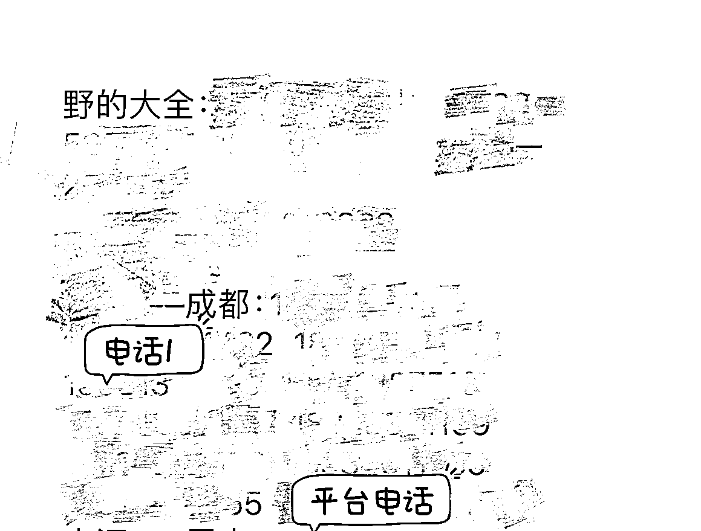

# 回县城降维打击，年利润 200 万

> 原文：[`www.yuque.com/for_lazy/zhoubao/cwf6ft5zfyurs3w4`](https://www.yuque.com/for_lazy/zhoubao/cwf6ft5zfyurs3w4)

## (47 赞)回县城降维打击，年利润 200 万

作者： 娟姐

日期：2024-07-09

大家好，我是娟姐，一个在投资圈混了 8 年后出来自己搞钱的生财新成员。

做投资这么多年来我自己搞了很多事情，也帮朋友们搞了很多事情，作为一个投资专业的人，我比较善于辨别和发现商机。今天拆解一个回县城降维打击的项目，年利润超过 200w，而最开始的投资成本少的可怜，不到 3 万块。最主要的是，这个项目可以无脑复制。

一、前言

现在很多人创业都是搞流量，做自媒体已经成了绝大多数个人创业的首选，我去年刚离职也扎入了这个洪流，有幸的是做了一个 1 个月 0 到 1 万粉的小红书号，并变现 6 位数，不幸的是，号被封了（以后有空分享）。

封号后我开始重新反思和分析，也换一个角度去发现商机，然后我把目光放回了老家，其中发现回县城降维打击的生意机会还是挺多，比如这个县城的黑车项目。

这个项目，跟自媒体流量无关，甚至用的是上一波已经过气的红利来赚钱的，那就是平台，共享。

二、项目背景

大家有没有打黑车的习惯，我想在大城市里是绝对没有的，我在城市里有打黑车经历还是在读书的时候，从地铁出来打车到学校，黑车比打的便宜，还可以拼车。后来地铁越来越方便，就再也没有了。

但是，回到老家，就很多了，而且是远距离的。比如成都，他周边有那么多个县市，但并不是每一个城市都有高铁站，而如果坐公共汽车，那么就要先去县城的汽车站坐，坐了后到了成都的汽车站后还要转公交地铁才能到目的地，经常要花费 2-3 个小时。最主要的是，你还要非常熟悉公共交通的路线和乘坐方式。这个难吗，对我们这帮子人当然不难，但是对于那些农村的老人呢，几乎是难于登天。

至少，在我的老家，绝大多数老人都不会。

但是开车从我县城老家到成都也就才 1 小时 30 分钟的路程。而且打黑车性价比很高，他会到家里来接你然后送到目的地，价格只比你去坐公共汽车贵 10 块钱，比如我们县，汽车票 60，黑车 70。如果是成都比较远或者县城里乡镇上接人的，就再加 10 块，80.

所以，我们老家很多拼黑车的。

而且最近两年越来越多，为什么呢，因为经济下行，投资专业的都知道，经济下行后有几样东西反而是赚钱的机会，廉价娱乐、刚需、租赁等。而打黑车就是符合刚需衣食住行中的行。

具体通行的目的呢，五花八门，有进城给小两口带娃的，有接娃回村的，有帮带货的，帮带狗的。我每次坐的时候都是满座，几乎都是年纪偏大的。

二、赚钱逻辑

好了，说了这个背景后，那是鼓励大家去开黑车吗，当然不是，我前几年在坐车的时候发现，整个县城大概有很多辆车跑成都这条线，但是你要叫车的时候却很麻烦，你得存得足够多的司机师傅的电话，才能保证你在要走的时间有车接你，大家的习惯都是提前预约。对于临时想走的人很麻烦。

如果，有一个平台呢，能帮忙调度客户和车辆，是不是就方便很多

那要搭建平台需要做什么呢

1.集合好所有司机

2.跟司机谈好分成

3.让客户知道平台

三、具体操作

1.这个操作唯一的门槛就是要找一个在县城里有点人脉的人，毕竟把小县城的人集合起来是需要一点能量的。如果自己没有，就去找个人背书，找个老师傅去站台集合好所有司机，这一点找到人就很很容易了，集合吃饭和各个击破都很容易，小县城讲究人情味，即使你跟他不熟，只要能在酒桌上照顾他的情绪价值就可以。

2.谈好分成，价格统一到 70-80，只要是平台推过去的客户每个人抽成 10 块。不是平台的客户，司机自己拉的就不用。

3.让客户知道，这个在大城市很难，但是在小城市很容易，首先是司机自己客户，入这个群里的投名状就是司机自己给客户发消息，发消息的方式也不是仅仅发平台的电话，而是 10 个司机（对，最后规划了全职的就 10 个加入）加平台的电话一起发，如下：都是敏感信息，大家看个大概格式就好了，马赛克打的我手酸。

然后就是在客户圈里发酵，这个在县城操作起来真的就是贼简单，让他们把编辑好的上述短信发朋友圈或者发群，发一个群可以领取一袋洗衣粉或者一把面。

洗衣粉就是 1688 淘的礼品类小包洗衣粉，一袋 1 毛多。但是阿姨们发的可起劲。

整个过程包括请客吃饭，也就才花了 3 万多，平台就成立了。

四、赚多少钱

我们县城到成都一个半小时，一辆车一天可以跑 3 个来回，6 趟。10 辆车，一辆车可以装 4 个人，每人平台抽成 10 块。一年跑满是 87 万，但是实际上不会每天每辆车都装满，也不会每个人都是平台拉的。一年大概在 50 万左右。但是，神奇的是，这个数据每年在增长，司机自己拉的客越来越少，而平台的客越来越多，这个后面说原因。

一年运营成本是多少呢，唯一的成本就是请一个人接电话，这个人接到客户电话后安排接车的司机，10 辆车，对一个人来说不借用任何工具都可以安排好。在县城，这样一个工作，你给月薪 2000 都有人干，最好的方式是请一个腿脚不方便的残疾人，居家办公，残疾人很开心，工作轻松，有钱入，还可以在家里不耽误家务活。

当然，监控很重要，要保证每个给司机拉的客户都有记录，这个很简单，参考电话销那套就行了。不赘述。

这个模式一跑起来，接下来的就是：复制

周边的县市太多了，前后他们复制了 9 个县市，但是并不是每个县市都有 10 辆车，也并不是每个县市都有那么多的人流量，所以拉通下来，一年的净利润 200w+。

五、赚钱的核心

如果我们这帮子人通过平台获客，第一想到的是什么，导入私域，所以我们也很好奇，这些司机天真吗，为什么不把所有客户都加到自己微信里。

这就是县城平台能赚钱的逻辑：降维打击

所有的司机几乎都是小县城的人，甚至很多农村人。他们对于私域没有概念，而且，相比以前自己时不时才有一个客户到现在每天有平台输送稳定的客户，现在的日子不要太爽。

（这里其实我又有很多感慨要说，小县城的人多数都是身体勤劳但是不喜欢操心的人，所以我一直不相信勤劳致富，我父亲就是一个典型的例子，以后空了唠叨吧）

而且从客户层面说，我打平台的电话立马可以给我匹配我需要的司机，单独某个司机我还要去凑他的时间，而且我付的钱并不会少。

我其实因为要发定位，所以前后加了好几个司机的微信，加了后除了发定位就再也没有联系过。

六、运营的核心

你一年赚几十万，但是你的工人一年才几万，司机辛辛苦苦跑车也没你赚的多，这些账都是很透明的，怎么去平衡利益？

答案就是：不要平衡

你在公司上班，老板报表上利润几千万，你拿着几千万把的工资，你什么感觉，会闹着让老板给你分红吗？

这就是运营的核心

**营造高门槛！**

其实这个事情没啥门槛，就是个中介生意，但是在沟通过程对司机和工人，会说前后要打点多少关系，我们才能干这个事情，毕竟我们算非法营运，zf 睁一只眼闭一只眼还不是那个哥打点的。

但其实打点了没呢

当然没有

这个事情，说大了是非法营运，但是你在小县城，10 来辆车，谁有空管你。而且除了钓鱼执法，怎么判定你的非法营运呢。都是拉乡里乡亲进趟城。

所以，一个县城不能太大规模车辆也是核心要素。

我跟朋友聊完，把项目一拆解发现其实很简单，但是为什么之前那么多年没人做呢，所以也给了我启发，不一定要盯着大城市，降维打击回县城看看也未尝不可。

* * *

评论区：

小智啊 : 如果被人盯上，有人想搞你，举报交管局，直接 GG
娟姐 : 距今已经搞了五年了，我每次回去的时候他们还在。
希平 : 感谢娟姐，没想到投资学的空间套利理论，你用的那么好
阿大哥来了 : 这个确实赚钱，很多人赚到钱了，但是现在卷了
小毛驴 : 广州到深圳等地，有挺多私人公司搞的包车大巴，好像是旅行社渠道。上下客位置多地点灵活，票价很便宜，生意很好
枫林 : 我们县城已经有人搞了 10 多年了，干这个得在有关部门有人脉才行，同行是冤家，曾经有新人入场一个月被抓 3 辆车罚了好几万
娟姐 : 拉一个当地的厂二代合伙，把运营给他跑通，然后转股给他，你手里的股份价格就是三年左右的利润分红，提前套现走人，投资只做投资的事，不运营，不恋战，大家共赢，这就是我们投资人的逻辑。
帅彬 : 四川下面的吧，那边黑车，顺风车生意很不错

* * *