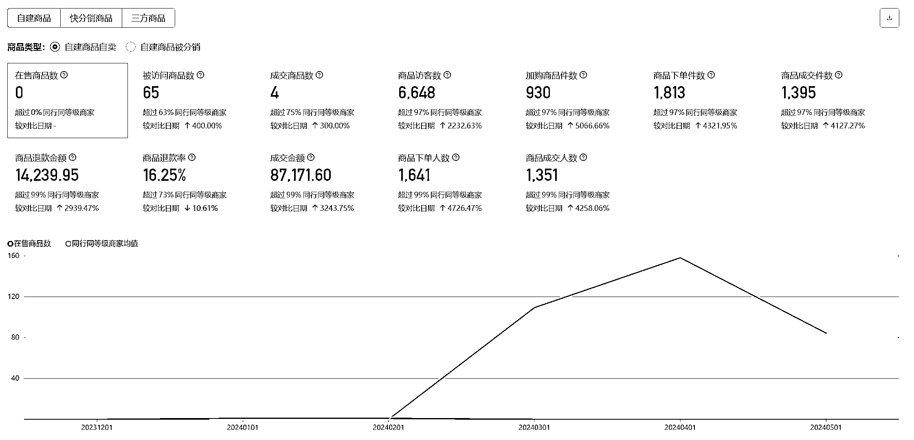

# 快手数字人直播，付费投流单人单月 2W 到手利润变现项目复盘

> 原文：[`www.yuque.com/for_lazy/zhoubao/cz8hg622h7c5lm53`](https://www.yuque.com/for_lazy/zhoubao/cz8hg622h7c5lm53)

## (24 赞)快手数字人直播，付费投流单人单月 2W 到手利润变现项目复盘

作者： 牧戈

日期：2024-07-12

圈友们，大家好。

我是牧戈，2024 年对我是特别艰难的一年，2023 年我从一名项目经理岗位上离职，开始了自己的创业之路。

出来创业后，发现收入是真不稳定，创业比自己想象的难很多很多。

幸好有生财有术星球的陪伴，认识了很多自由职业者，才给第一次创业的我一丝慰藉。

我是在 23 年 12 月，看了生财小红书直播的航海，通过小红书无人直播拿到 2 万多利润。

由此开始了自己的电商创业之路的。

做小红书无人直播的时候，开始因为当时大家会围绕几个热门类目竞争，所以就和大家岔开了，从食品，滋补赛道切入，很快就拿到了 2W 多的利润，但因为尝试的比较多，号也死的比较快，就暂停了。

2024 年春节后，我自己出来创业，才发现，创业的现金流极度不稳定。

而现金流不稳定，我的睡眠也开始不稳定，容易失眠。

因为有小红书无人直播的项目经验，我开始尝试快手数字人直播。

我做快手数字人直播，正式启动项目是在 3 月底开始，总共 1 个多月。贴上我 7 天赚到快 2W 的成绩。

**做快手数字人直播，也有三个多月了，有一些心得，和大家分享分享**

## **一、选品投流：**

无论是选品还是投流，我的经验是考古加，快手，抖音养号刷等多种方式融合来用，加上执行力，基本上搂个几天就能找到能打的产品

无非 3 个类型：

1.应季品-跟天气强相关，跟着上升趋势走，你不起飞谁起飞

2.新奇特-新品,奇思妙想,特有个性，俗称没见过

3.蓝海品-找不到对手，恭喜你，干就完事了

只是对于我来说，没有电商经验，也不清楚有什么产品，前期选择了土办法，花了几天时间把每个类目日单 100 以上的都刷了一遍，形成一个体感，在出现新品的时候，就能第一时间发现。

## **二 素材内容：**

前期选到产品测试的时候，可以使用粗糙的替换动作完成基建视频的剪辑

但当发现这个品可以坚持打的时候，一定要做好分镜的管理，将你的素材分割成多个部分。如：

前 3-5S+卖点 1+空镜头+人物镜头+卖点 2+卖点 3+引导直播间

分到不同文件夹管理，无论是你后续批量多个视频还是分配剪辑的工作，养成标准化，能提高不少的效率。

## **三、人员配置：**

相信很多新同学爆单后都是陷于处理无尽的售后中，占用了大多的时间损耗，我曾经也是。

所以在爆发后，前几天可以自己做客服，但积累产品问题后，请立马就去找客服外包，无论是淘宝还是其他渠道都可以，相信能直接解放你的束缚。

## **四、错误的放弃主义：**

言归正传，希望从放弃几个品给大家

一些参考经验，鉴于其中的某些产品有朋友还在赚钱就暂用字母来代替

A 产品属于防晒类的单品，应季趋势品。第一天就打正，并且投流投入不多，且能吃到自然流的情况下，日单量 30-40，第 4 天考虑到未大爆发，选择放弃。

B 产品属于灯具类的产品，同样第一天打正，每天在 30-50 单之间，误操作不断拉取移动端计划，相互竞争，计算利润后，发现微赚，第 5 天选择放弃。

C 产品属于灯具类的爆品，同样第一天打正，每天单量在 50-80 之间，销售额在第三天达到 1.7W 左右，第 5 天开始突然下滑，坚持到第 10 天，整体利润下滑开始认为到了衰退期，放弃早早撤场，后续发现这个品有潜力达到万单。

## **五、事后反思：**

1.  5.1: 应季产品如果没大的爆发，可能是你入场的时间太早，但测出来品有市场后，剩下的就是坚持了，天气一到就是你爆发的时候

4.  5.2:前期测品的时候，主要靠移动端来给你回馈，微亏或微赚是正常的，主要是为了烧热素材，让不断帮助 PC 端找到人群，同时在每天拉取**基建【新视频】计划**的时候，一定要注意**关闭智能托管**，会影响你的判断。

7.  5.3:思维转变，一个品不是想当然的 7 天-10 天有波动就放弃，事实上你还处于起号期，一个好的品是能长期打的，1-2 个月甚至更久

10.  5.5:当计划消耗，或单量下滑的时候，不要过于惊慌，稳住心态，波动是常态，大概率是内容端开始衰退，这个时候需要及时剪辑视频，并测新的脚本，拉活你的计划。这一点我是向电商大佬@书豪学习的经验，选品+内容+投放都需要精细化运营。

13.  5.6:磁力金牛东西不多，但在做事情对工具还是需要多看一下，多熟悉，在后续你实操过程中会起到一定的稳定心态的作用，只有你不知道它是干什么的才会迷茫，苦恼，磁力金牛未来也是为更加方便我们使用，既然他都这么贴心了，那么我们投给他一点注意力还是有必要的。

16.  5.7：一个品如果测出来并且有盈利，应该愿意花时间来稳定它，同时再开拓新的品类。把握住每一个能给你带来利润的产品，坚持就能给你带来大的回报

**还有最关键且重要的点：**

**遇到问题卡点，多和圈友沟通，不论是线上还是线下。**

非常感谢@书豪，在我电商路上的指导和帮助。

遇到我认知外的事情的时候，书豪能给到很多经验和心理上的帮助，站在巨人的肩膀上才能走的更快更远。如果我早点问，早解决，这几个品坚持下来，一定能拿到更大的利润

最后，分享一个电商经验之谈：快速选品，快速测品，别犹豫，即使你现在内容投流不行，但只要你早同行几天，早爆发，你就是赢家

所谓，测品数量决定爆单概率，因为你测的多，总有你测的早的爆品！

而，早就是优势！

* * *

评论区：

吕吕 : 可交流吗
王超 : 同样在做无人投流，交流一下[握手]
胖小孩 : 也想学习
村村🍑 : 想学习

* * *