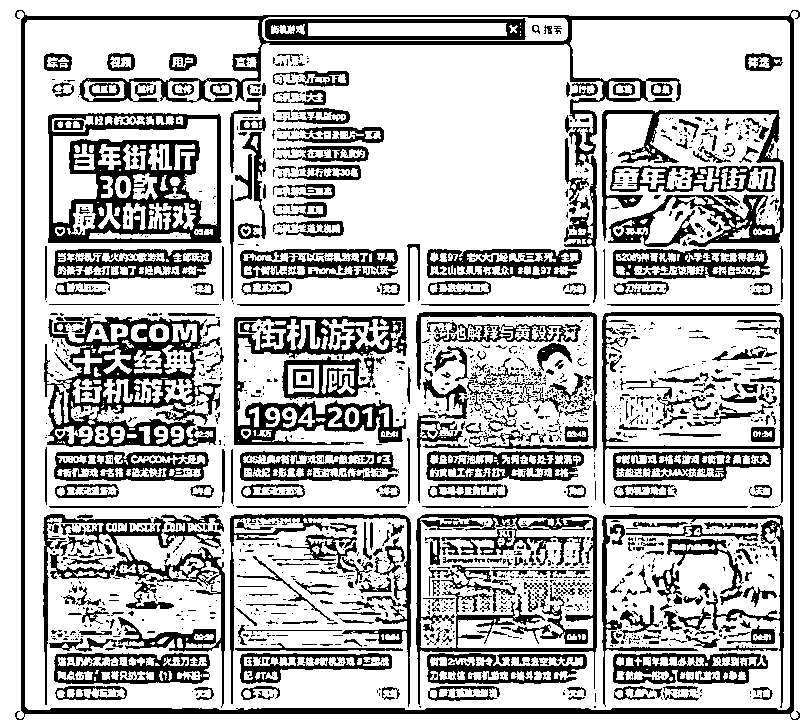
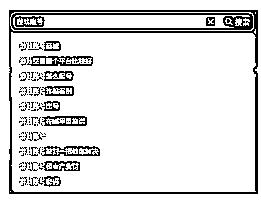
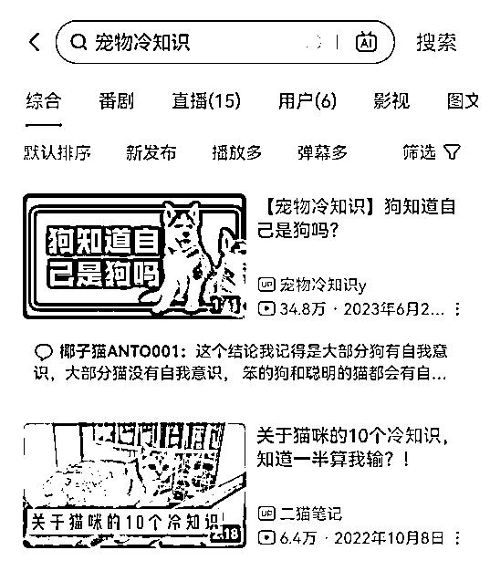
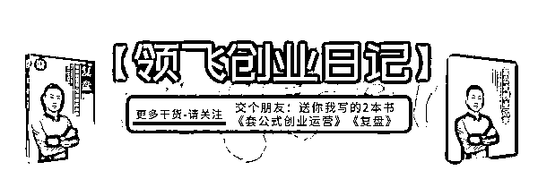

# 大龄职场破局副业，6 个入局赛道解析，长期的搞钱策略（2 万字）

> 原文：[`www.yuque.com/for_lazy/zhoubao/fsyvt5qtf52ndf8r`](https://www.yuque.com/for_lazy/zhoubao/fsyvt5qtf52ndf8r)

## (47 赞)大龄职场破局副业，6 个入局赛道解析，长期的搞钱策略（2 万字）

作者： 领飞懂运营

日期：2024-07-12

**大家好，我是领飞！！！**

来到互联网创业，不就图个快意恩仇，逍遥自在，无拘无束嘛！职场没有带来的抱负，要用互联网实现。

抱负是远大的，是长久的，越做越让自己有价值，越做越让自己有钱，而不是游街的小贩，朝不保夕靠辛苦赚钱。

**那这件事唯一能实现的方法，就是选择赛道，去赚一类人的钱。**

电商卖货现在很难做了，新人也做不出什么名堂，前面一座座大山，无法去跨越那些有资本的高手。

**更好的出路，就是信任经济，**好比董宇辉，信任他的人不在乎他卖什么产品。

我们成为不了董宇辉 10 亿的身价，但我们能成为他 10%就够了，这 10%就用你的 IP 来实现。

**IP 是唯一：社会公平的红利**

所以挑选一个赛道，精进自己的能力，去服务一类人，绝对能够赚到，这是一个必然的事件；

可以多看生财，很多优秀的领域 IP，完全是可以对标复制的。

**我不知道，你能做什么 IP？**

我只能把我认为能操作的事情，告诉大家，下面的 6 个赛道文章，不能说写的方方面面；

**至少给出了一个普通人，**如何介入的方向和分析，只要你感兴趣你就去做；因为很多人都拿到了结果。

我还会更新，用我认为普通人能操作的视角，写出更多赚一类人的选择。

#   **【旅游号】**

# **一份攻略卖 50 卖他 1000 份**

# **一、旅游号价值**

关于旅游业未来会怎样？这不用多说，老百姓日子过的好，旅游业永远都在风口，永远都在红利期。

旅游业能拉动一个城市的 GDP，经济大盘跟民生息息相关，所以互联网任何平台对旅游业永远都在扶持。（平台扶持，代表着推荐流量就高）

对于创业者而言，你进入这个赛道，什么时候都不晚，切记：

没有不赚钱的领域，只有不赚钱的人；没有垄断的 IP，只有更多细分需求的 IP；

用户开始喜欢美的、精致的、有格调的消费，在用户面前塑造有个性、差异化、标签感明确的旅行成为新旅游创业的一个努力方向。

##   **1、当你想旅游，会存在三种选择**

第一种：找旅游公司推荐

第二种：直达就想去的目标

第三种：自由出行规划

不管怎样，都会用到一项需求：旅游攻略；其次，是旅游过程中的消费和服务的体验。

所以，我们只需要做到：专业、细分、聚焦；

之后，结合互联网的手段获得粉丝，进行各种变现方式。

## **2、旅游或缺**

你爱不爱旅游，如果你不爱，这个领域就不值得你去做；只要你热爱，即便你不是走哪去哪的旅游达人，也能在家把钱赚了，上面说到“攻略”，无时无刻的或缺。

比如：小红书的旅游攻略，就是你抄我，我抄你的笔记

比如：抖音的旅游攻略，就是把小红书的笔记剪辑为视频

比如：公众号的软文攻略，就是把抖音和小红书的粉丝私域运营

## **3、互联网本质的作用是什么？**

答：搜索，给予答案；以前不懂问百度，现在不懂问抖音，问小红书，问公众号

当下互联网的本质是什么？

答：推荐，兴趣推荐；把你的内容推荐给意向的人，即便当前不需求，以后会需求，这就是个人 IP 价值，有事能在你这找到答案。

## **4、旅游粉值不值去做？**

旅游是生活的一部分，不可缺失的一部分，可以长期持有，其粉丝价值很高，可以卖攻略，可以接大单广告，可以卖票，可以接旅行公司业务合作，可以卖旅游装备。。。。

任何的领域都存在爆款的潜质，跟生活、娱乐、高兴、享受、消遣，这些相关的话题，本身就存在高点击的概率；

道理很简单，搞笑视频和美女视频的点击量，一定比学知识的视频高；但知识粉商业价值，一定比娱乐粉价值高，娱乐粉 1 毛钱，知识粉 10 元钱。

**旅游内容具备：**“经常性”热点爆款，某个时间，某个事件，某个节气，某个活动，都会有都大量的旅游热点产生，内容可以去蹭热点，提升内容的曝光吸粉力度。

旅游赛道：具备娱乐属性，又具备知识属性，又具备多热点，所以旅游粉相对其他领域，即值钱又好获取，是少有的兼顾赛道。

## **5、到底怎么做旅游粉？**

做细分好了！

只赚旅游某类群体的需求，这样更好做，起点也更低，起步也更容易，前期也更专注。

细分可以显得你专业，你只做这类需求，目标客户更精准。

细分可以矩阵化，多个细分组合，每个细分都是专业。

多个细分之后，又可以融合在一起，多覆盖的变现。

细分的种类太多了，就不过多阐述了，通过星球社区的案例，具体分类具体对待。

#   **二、旅游粉赋予赚钱**

## **1、个人创业**

由于我们是以“个人创业”为方向点，所以在赋予赚钱项目就会有特定性，不会超出能力范围，能赚到超级个体赚到的钱；

也决定了在“超级个体”能力内，我们能选择的项目和变现的方式。

旅游赛道个人创业变现，更多以账号价值为主，就是说你粉丝多，你的商业价值高；以及你还能产生定制的服务。

## **2、新人如何加入？**

先从你熟悉的地方开始，以城市和省份为单位，以华北、华中、华南、西北、东北、为单位，这样就能用最熟悉的方式逐步打开运营。

不管你是用口播的方式，还是用 PPT 剪辑视频的方式，还是图文的方式，生动的带入感非常重要，而不是死板信息差。

我在抖音看到一个新疆的女博主，她就是在家随便拍视频，告诉没来过新疆的旅游者，该如何选择出行，该如何选择路线玩几天，因为新疆太大了，很多人体会不到。

淘宝有人卖旅游定制服务，比如你去青岛，他能把你所有的诉求安排的妥妥当当，并不是旅游公司那种，而是真正的以本地人方式的出行；好比，你是青岛人，你朋友来了，你肯定带他们玩的不一样。

## **3、对标差异**

一个城市范围太小了，熟悉的范围也太小了，如何跨省份？

这就需要利用互联网大杀器，跟人合作，人不要把所有的活都揽在自己手上，多学会分流，学会利用资源，往往会起到事半功倍的效果。自己不会的东西，可以多去各大平台探索。

  

上面这张图，你看到了什么？

**第一：关键词**

内容围绕长被搜索的关键词去做，你的选题就会有方向，内容也就不缺长期可分享的素材，布局的越多，被搜索的概率就高；再差的内容体验，只要内容足够全面，足够多，也是有价值。

**第二：差异化**

那么多人的分享，你有没有差异化，做一个视频很简单，内容要有差异化，哪怕不出境，但你的声音要有，再配合画面就可以了。

**第三：人文气息**

情感能打动人心，以人为本，就是你账号出彩的地方，你有情感，内容有情感，景点有情感，就会给予粉丝情感。

**第四：对标**

内容好做，那就数量堆起来；内容耗费，那就质量保证；所有的账号就这 2 条标准，看你选哪一种！当你刻意的对标账号，就需要大量的数据支撑，所以你要把搜索到的账号，进行整理，才能融合自己的方式去做，一定要挨个看，这样别人的“网感”才会被你吸收。

## **4、点和面赚钱法**

### **（1）如果你想用信息赚钱？**

那就用“面”的赚钱方式，也就是覆盖面，上面说到旅游被动搜索力度很强，既然搜索，那就要多多的被搜索到，以信息价值为主，被搜索到很重要。

比如，你的账号，把整个东北地区的攻略都有了，涵盖了所有用户可能搜索的关键词，先有数量，再有质量，这是一种方法，先把数量信息推起来，再反过头重新做一遍质量。

数量是纯信息介绍，质量是带有人文关怀气息。

### **（2）如果你想用人文赚钱？**

那就用“点”的赚钱方式，也就是精敲细打，在你熟悉的地方，精致化运营人设 IP，其他地方不要想，当个本地通即可，可以定制化卖一份攻略，可以亲自带团收劳务费，可以引荐旅游公司那边。

点到了瓶颈，那就扩面好了。

点到了瓶颈，那就扩面好了。

  

## **5、人设 IP 赚钱**

带有人设 IP 的账号，商业价值会更高，如果你不是旅游达人，把旅游当职业的人，还是以“点”为主吧，在自己熟悉的地方无需远行；

图片不值钱，脸值钱，也就是说真人所带来的信任感更强，价值也最高。

上面两张图片，都是小博主账号：

**一个出镜头：**以人文价值为主，账号内容创作相对慢，因为题材本身收到束缚，以及后期剪辑消耗成本高。

**一个剪辑画面：**以账号价值为主，信息流剪辑账号内容创作效率高，题材不受限制，后期剪辑也可批量。

你想做哪个，就看你情况了，最终都能赚到钱，相互结合就更好了。

### **6、其他赚钱**

### **那些旅游博主为什么能赚钱？**

其实也没什么秘密，自媒体 Vlog 视频，发布头条中视频计划，有播放就会有收益，只需要会剪辑就好了，最后还能带来广告商的报价。

### 国外旅游赚钱？

赚钱方式都差不多，唯一区别就是，变现利润会高一些，毕竟出国了嘛，客户群体相对有钱。

这里不多讲了，星球案例库看吧！

# **三、旅游粉你能赚到**

旅游是一种生活的热爱，把生活的技能搬到网上，利用旅游地域信息差，能帮助更多人，此赛道赚钱的根本；粉丝能利用你，你就有了商业价值，不需要刻意的变现，反而变现了。

对于“个人”创业者而言，把热爱的事情先从副业开，也许就变为主业，秉持越分享越赚钱原则，即可。

**第一步：你在哪就从哪开始**

你是旅游大省，你是西北大区域，这都没关系，先从你的城市开始，慢慢辐射你的省份，再到周边。

**第二步：收集整理**

一网打尽所有同行内容，做出各种攻略，游玩攻略、小吃攻略、住宿攻略、自驾攻略、亲子攻略、避坑攻略等，并保持信息的新鲜度，随时更替。

**第三步：内容表现**

口播、图文、视频配文、视频配音，这四种形式，由简到难把账号堆起来，定位账号提升权重；

初期找到内容分享的网感，吸收旅游知识，一边学一边做一边分享，逐渐精进内容质量。

**第四步：重复的内容可再重复**

不要怕，别人发过的内容你发没人看，观众不介意再看一遍，换你去说，就是你说的；布局好关键词，多多布局关键词，布局你熟悉地方的关键词，你比别人更专业。

**第五步：人文关怀**

不管服务，还是分享内容，一定要带有人气、热情、关怀、建议、避坑，这就不是简简单单的信息价值了，而是个人 IP 的价值。

**第六步：变现设计**

内容发出去，有人求攻略，你卖他一份；有人找你咨询，你卖他一份定制服务；有人找你带游，你来者不拒。

剩下就是接广告了，本地商业找你合作了，代卖门票，团购等。

**第七步：批量矩阵**

多账号去发，多内容去发，多平台去发，这三招是网络圈钱的钥匙，还剩下一把就是超强 IP 人设，旅游行业不缺题材，不缺话题，不缺素材，不缺热度，所以死磕精神在这个赛道很容易拿到结果。

**第八步：私域重点**

不是一锤子买卖，想要赚的多，别人给介绍；想要转换高，朋友圈要牛逼；想要能发财，他找你买几回。

旅游赛道就是这样，少有知识付费多复购的行业，少有长期关注不流失的行业，少有本地服务不投资的行业，少有陌生人能成为朋友的行业。。。。。。

**四、总结**

旅游是个大赛道，也是热门的赛道，不说围绕的行业多赚钱，领飞只想说以“个人”为单位多赚钱，绝对可以“个公司”“个企业”，一个人创造的价值，堪比一家 100 人的旅游公司。

# **【游戏号】**

# **从来不打游戏让我赚了 80 万**

# **一、游戏号价值**

## **1、赚钱案例**

先说下我自己的故事，从来不打游戏让我赚了 80 万？

2019-2020 年我代理一款沙盒手游 APP 后台，里面有上款游戏（像那种明星代言的小游戏），只要你推广 APP，玩家在里面充值，我就能拿到 60%-80%的收益，以及我也可以卖代理，不管卖多少，利润全部归自己。

我一边卖赚钱机会“手游创业”，一边维护代理，让他们推广更多的玩家。

**代理分为了不同 2 个级别：**

一级，有自己的 APP，你也可以卖代理，收入归自己， 4980 元。

二级，没有自己的 APP，当小代理分销，游戏充值反 50%-70% ，1980 元。

我去创业网站打广告，我去创业博主公众号投放广告，这样就收费了一批代理，他们又推广了很多玩家，运营到 2020 年底赚了 80 万。

本来我想继续深耕游戏领域，最后考虑到自己不爱玩游戏，项目也到了瓶颈，也就没再追跟下去。

我有一个学员代理，他坚持到现在 2024 年，赚了 300 多个万，也让我很吃惊。

**在说一个案例：王者荣耀陪玩**

2021 年，外地的大学同学找到我，让我给策划一个项目，他是一个富二代，干啥赔啥，这都毕业 10 多年了，现在还每天瞎晃悠，就想找我投资干点什么。

由于我离他比较远，以及我对他的了解，他酷爱打游戏，2021 年游戏陪玩非常的火，所以就大胆策划了“王者荣耀陪玩工作室”这个项目，反正他是富二代赔得起；

再看 2 年时间，现在他每月赚 20 万，300 平米的工作室，100 多个兼职，20 个全职；整个流程可以看之前文章，这里就不多说了：

[【游戏工作室】策划，一个月赚 20 万复盘](https://articles.zsxq.com/id_qlw52ib16b01.html)

## **2、游戏事业**

让所有人看来，这是一个不务正业的事情，谁年龄大了还在打游戏；天天打游戏肯定不对，但你把自己当成商人角色就对了；

就像上面案例一样，只赚爱打“游戏人”的钱，这就是事业了，好比：开网吧老板就不是事业了吗？

游戏是一种精神的消费品，无论年龄，无论男女，只不过玩的游戏不一样；80 后，70 后在变老，小时候父母不让玩，成年了没时间玩，老了还不让玩吗？

20 年前的街机游戏，小霸王游戏，现在还有人拿来玩，拿来赚钱，这又怎么说？

有这样的需求，自然就有商业存在的逻辑。

## **3、娱乐网红**

看看那些游戏主播，我觉得比才艺主播，赚大钱概率更高；100 个才艺主播对比 100 游戏主播，同样是娱乐性质，靠颜值，靠才华，游戏主播赚钱的手段更多，以及背后的金主爸爸更强。

当然我不是让大家当主播，只是对比娱乐网红赛道，还有就是才艺需要 10 年培养，游戏只需 1 年培养。

**游戏属于娱乐赛道，**游戏公司属于暴利产业，两者之间结合产生的赚钱威力，大于任何娱乐赛道网红。

你想当网红，没点才艺可不行，没点颜值可不行，没点从小艺术细胞可不行；但是你想当游戏网红，就不需要这些了，一副好口才就行。

就像这样的游戏账号，通过打游戏涨粉，赚直播打赏的钱，赚下载游戏的钱，赚卖游戏资源的钱，赚推广官方游戏的钱，赚视频流量补贴的钱，赚卖游戏设备的钱。

这还只是冷门游戏，如果热门的大型游戏，就不是简简单单赚这些了。

**一个“蛋仔派对”，就能玩到 67 万的粉丝，什么概念？**接广告都让你手软，那其他的热门游戏会如何？

热门游戏自带流量，你只要把视频发出去，就有人看，第一个钱也就赚了，比如抖音的中视频计划，有播放量就有收益。

要么你专注讲攻略，会有人买资料；

要么你娱乐大众高兴；会有人打赏陪玩；

最后所有拥有的粉丝，就是商业价值所在，金主爸爸就来了。

## **4、剪辑赚钱**

有很多人喜欢剪辑视频赚钱，比如：影视解说号，书单号，音乐号，娱乐八卦号，故事号等。

这些账号的粉丝价值并不高，也就是说同样 10 万粉丝的影视解说号，就不如 10 万粉丝的游戏号；

游戏粉丝更值钱，商业价值更高，广告价值更高，赚钱能力更强，变现手段更多。。。。。

最为重要的是，游戏题材剪辑内容选择：更丰富，更轻松，更灵活，更低消耗；打把游戏也许就好几条视频的题材。

# **二、游戏粉赋予赚钱**

游戏（号）粉这个领域，绝对是副业很好的赛道，玩着就把钱赚了，不用过多内耗知识，消耗学习的成本，这个很重要；

这个两种降低消耗，就比其他娱乐赛道凸显优势，你对比一下其他剪辑项目就知道了。

先把视频剪辑的钱赚了，这是平台白给的，也最容易；之后就是粉丝价值的钱，变现的手段就很多了，不赚钱都难。

如果你想赚更多，一定要引导私域公众号，这样公众号又能给你带来一份收入，比如，你在抖音做操作拿到了结果，又引导粉丝关注公众号，那完全就是又复制出一条腿的赚钱机器；

不要小瞧这个威力，也许公众号，比你抖音赚的还多，要知道游戏是谁的天下。

## **1、主流大厂游戏**

不需要技术太好，你可以天天玩，技术不好也好了，要娱乐就搞笑点，要技术就刻意讲攻略。

  

## **2、多款小游戏**

小游戏的观众多以信息差获取，看你玩的有意思，他也想玩，你以介绍小游戏为主，观众看了求链接，链接就是钱。

## **3、直播游戏**

主流大厂游戏，小游戏，都可以进行直播，重点是玩这些游戏的过程中，能留住人；

怎么能留住人？

多看看游戏直播，他们用什么游戏，他们用什么话术，他们用什么画面，他们通什么特色。。。。

多观察几天，也就找到诀窍了，比如：买个变声器，什么样的声音都能出来。

直播后的视频，还可以剪辑发布账号，做到一鱼多吃。

## **4、知识付费**

多款主流游戏，找到高手的视频进行剪辑，一定要猛，一定爽，可以矩阵化操作，一个账号一款主流游戏；

卖攻略，卖租号；货源从哪来？淘宝、抖音商城、拼多多、咸鱼、公众号，购买后去水印，你再卖即可。

这也叫做：虚拟资源变现项目

**游戏攻略资料出售风险性很小，因为不像学术那些专业，特别注重版权。**

## **5、游戏测评**

很多游戏是稀缺资源，需要付费购买，需要激活码，这就存在了好奇心需求，这样的游戏粉丝也很多，如果你真的业余时间爱玩游戏，投资点小钱还是有必要的，可以等同“手机测评”“科技博主”，这样的类型博主进行内容的分享。

你的意见可以为观众，提供指引的效果，这款游戏值不值得付费入手，好比，新手机出来，有人测评给你参考一样。

  

## **6、游戏操盘手**

关于这方面，领飞在这里就不多介绍了，综合商业运营思维要求比较强，就像开篇文章我讲的那两个案例，因为涉及到资金投入，专职的去做，没有几年的入行，很难说最后能拿到结果。

但没关系，随着从小项目干起，慢慢深入这个行业，很多变现也就能做了，谁都有一个赚大钱的野心。

赚流量的钱先赚到，再赚模式的钱，任何新人都无法跨越，野心太大会把腿撇了，见过太多的人，上来就想干多大，最后一场空。

领飞给大家分析赚钱路径，对应你的能力，听话就好，大概率都能拿到结果。

  

# **三、游戏粉你也能赚到**

游戏（号）粉，是非常舒服的一种搞钱方式，你心态越平和越赚钱，可以随心所欲，一边玩游戏，一边分享玩游戏的过程，钱就赚了；可以针对的玩游戏，用刻意总结给别人提供价值，钱也就赚了。

**大家切记：不要做工作室游戏搬砖，倒卖漏洞的软件，一是把自己一辈子干废了，二是有可能进局子踩缝纫机。**

有些人卖“游戏搬砖”工作室的项目，很赚钱，领飞希望你不要做，这种钱害人，你赚了也留不住，误导他人歧途的事情，害人害己。

“阳谋赚钱”是所有创业人的大道，你赚什么钱，别人能看清楚，他们还愿意为你买单，记住这句话，这就是巅峰赚钱。

想要赚到“游戏粉”的钱，通过上面介绍，小白介入就 3 种：

**1、卖人设**

爱看你打游戏，你搞笑，你牛逼，就有打赏，粉丝越多广告收入越多；游戏天天打，你也就越大越好，这个不需要考学历，没人逼你，玩着玩着就高手了。

**2、卖资源**

虚拟变现一直很赚钱，卖攻略，卖账号，卖体验等，粉丝越精准越好；你可以剪辑视频，不需要玩游戏，越是热门游戏需求量越大。

**3、卖推广**

找到靠谱的渠道，或者利用好大厂官方渠道，每天试玩小游戏，别人好奇就赚钱了，这个再简单不过。

其实这三种都能结合，找一款主流去玩，比如：最近腾讯新出的 DNF 手游，热度很高，你就可以一边玩，一边卖人设，卖资源，卖推广。

任何一种赚钱方式，就是一套系统的执行标准，玩游戏赚钱特别容易实现标准化，比如：你下班

玩几把小游戏，打开手机录屏，一边玩，一边解说体验，之后剪辑发布出去，链接一挂，钱就赚了。

玩几把王者荣耀，专练几个英雄打发思路，就按这个思路玩，最后剪辑视频，发布抖音中视频计划，视频号计划，有人看就赚钱了。

粉丝多了，直接开直播打游戏，下播再把游戏剪辑视频，一发布。

这样下班之后，玩 3 个小时，有空就多玩会，即娱乐又赚钱，这种副业方式，特别舒服。

如果你再带上你老婆和男朋友，一起玩，视频的效果就更有意思了。

视频赚钱嘛！“演”很重要，娱乐主播的精髓就在这。

**四、总结：**

**游戏（号）粉赛道，**娱乐里面的低门槛，副业里面的舒服赚；没有什么学习的成本，只要你去做，就能赚到钱，至于能赚多少，可大可小，切记网红不是谁都能当的，我们顺其自然就好，反而意想不到的收获。

**本身剪辑视频，**就是一种副业赚钱的方法，剪辑游戏，不需要太多的认知学习成本，太多的精力创作文案成本，这种有点就已经很优势了，突出一个字“玩”，总比迷思苦想简介一条文案视频强。

# **【宠物号】**

# **1000 人为你养这只宠物月入 5 万**

# **一、宠物号（粉）价值**

猫、狗、鱼、鸟，四大品类等，爱宠人士属于特定人群，且以年轻女性居多，舍得为宠物付费，像狗粮猫粮、宠物玩具、清洁用品、宠物小窝甚至宠物衣服等等，都是这类人群的消费需求，而且每款产品都会产生复购，是可以长期持续变现的一个赛道。

一方面容易博取流量，内容赚钱，批量矩阵操作；一方面驯养专业知识，带货赚钱，宠物号 IP 长期操作。

其内容，反复观看率很高，内容跳出率很低，多频次观看率高，互动性强，这些优点是其他赛道不能比的；

所以“宠物号（粉）”对于普通人操作来说，非常的利好，只要发内容就有人看，内容稍微带有一些内涵价值，也非常容易涨粉。

相比真人出镜，宠物出镜的内容更具观赏性，容易快速涨粉，而且操作难度也要比真人出镜拍摄的段子低很多。

宠物赛道的百万级大 V 数量，相比其他赛道人更多，说明一点“好做”，赚钱成功比例高，最为重要以副业精力投入角度来讲：轻松简单易上手，还容易拿到结果。

千万别用你浅薄的商业眼光，抉择它赛道拥挤，要知道谁也不是头部，谁也不能垄断，你的内容出彩，就有人关注，每一只宠物都是个性鲜明的独立体。

**所以，你什么时候进入赛道，都不晚，网民实在太多了，刷抖音的人太多了，刷小红书的人太多了，刷视频号的人太多了。**

像上图这些可爱的小宠物，别说爱宠人士，就算是不养狗的人，也很难抵抗得住不去驻足多看一会；所以宠物号极其获得爱宠人士的喜爱和关注，涨粉也就是水到渠成的事；

**生意的本质就是人，**流量有了，90%的问题也就解决了除了宠物本身，能卖的还有快销类的宠物粮食、玩具、清洁用品、日常用品.......

如果你私域有小几千这些爱宠人士，只要你服务好，可以说你这辈子都不用愁了，如果你也是一位爱宠人士，那做一个宠物号是再好不过的了。

宠物也是有分类的，猫、狗、鸟、鱼、仓鼠。。。等

建议选择热门的猫和狗，这也是我们最熟悉的，也是人们最喜欢当成宠物的当然，如果冷门的宠物，也更好做出差异化，但是后期转化率相对会差些许。

# **二、宠物号（粉）赋予赚钱**

## **1、私域赚钱**

我们小区有个大姐，养狗非常好，非常的听话，不是专业的那种驯养师，就是能把狗训练的很好，每天到公园里，到小区里遛狗，养狗的人都围着她，咨询一些问题，比如：狗掉毛处理，不吃狗粮，拉肚子，等。

大姐能就是平时多看了一些养狗视频，就把这些知识告诉了大家，还加了微信，有几十个人吧，之后她无意间发了朋友圈，推荐了一款狗粮，这些人就问链接。

她就找店家要了一个团购价，分给了她的好友；这件事她发现是个商机，之后每天拉着狗，在全市的公园小区附近溜，半年下来积攒了 1000 多人的微信；

建了个狗圈社群 99 元一人，任何养狗知识都可以找他咨询，用拼团团还当起了团长带货。

## **2、广告赚钱**

先播放量赚钱，不容小觑，你只要发出去就能赚钱，也是很多领域作者的主要收入来源，此后生产粉丝价值，后续就有了其他的变现。

这种宠物知识号一般是靠播放量挣流量的收入，一万播放量在 15 元左右，现在云养猫的人很多，而且宠物都萌萌的，特别能吸引播放和关注。

如上面面这个账号，一共有 4.6 万粉，95 万赞；这个数据并不算很好，但由于平台是小红书，所以单条广告报价 6000+。

**做宠物类账号可以基本分为三个变现方向：**

1、通过商品橱窗进行短视频带货或者直播带货；

2、接商家的产品推广，赚取广告费；

3、引流到私域卖训练宠物的方法课程。

不建议新手一上来就采用第三种方法，因为刚开始没有粉丝信任度，可以先在平台上尝试带货，等达到一定的体量后通过在包裹里放小卡片的形式，再引流到私域进行变现，前期最起码要在平台上卖出 500—1000 单以上做私域才够稳。

##   **3、赚钱手法**

**第一步：**要先确定好发布内容的形式，虽然图文内容简单易做，流量也不小，但要快速建立卖货信任度的话，还是视频内容更加有效。

**第二步：**我们要在平台上找一些数据拔尖的对标账号，选择自己有条件和能力模仿的内容，深度分析他们的账号，包括头像、昵称、简介、视频内容的文案和拍摄手法等要素，然后 1:1 模仿复制。

**第三步**：就是内容的拍摄和制作了，大体也可以分为三个方向：

（1）自己养一只宠物，直接模仿爆款内容去拍；

（2）找你当地的宠物店合作，让他们提供素材；

（3）搬运各大平台的爆款内容，保存下来进行二次剪辑，或者加一些宠物群，收集别人在群里分享的宠物视频剪辑创作。

**不管哪种方法，只要能让你低成本、高效率地生产内容就可以了。**

如果是图集号，可以网上搜集高清的图片，上传并搭配文案和音乐即可，如果是短视频形式的可以二次剪辑或者混剪成为自己的原创作品发布即可，自家有宠物的就再好不过了。

## **4、卖宠物赚钱**

我写过一篇文章：卖猫副业，宝妈用 2 只猫拍视频，年赚 20 万，可以看下我公众以前文章。

[`articles.zsxq.com/id_665xq9jsmxoa.html`](https://articles.zsxq.com/id_665xq9jsmxoa.html)

大家可以看看，利用猫的繁育裂变私域运营。

也可以跟本地宠物繁殖厂合作，用你的人设 IP，进行出售宠物，这个利润也非常客观。

并且打造一间直播室，可以卖宠物。

  

## **5、带货赚钱**

大家拍完视频发布之后，可以在视频下发挂橱窗，自动下单收益；如果遇到视频爆了，可付费投流，继续追加曝光，放大收益。（视频带货项目原理就是如此）

多发视频，曝光率就高，能产生爆款率也高。

所以带货赚钱，也容易操作，比如：你买了一个宠物玩具的样品，你就可以把自己宠物玩玩具拍成视频，多拍几个玩的场景发出去，也许就有一个爆款，之后带货也会爆。

  

# **三、宠物粉你也能赚到**

自媒体的平台很多，可以做到一鱼多吃，一个视频发布多个平台，由于上面说到，宠物素材非常容易获取，也就代表着内容产出率就很高，多内容就能赚钱。

不管做什么，对标账号，能参考成功案例，我们就能快速起步，“宠物号”相对其他比较好模仿，学习成本也低，文案要求也不那么高强度。

先把流量补贴的钱赚了，产生粉丝价值，再把广告的钱赚了，之后带货，卖课等，私域运营也就长期的搞钱了。

## **1、公域赚钱**

赚钱一定要瞄准方向，如果你主要公域平台赚钱，那么一定要多发内容，多个平台去发，发的越多爆款数量就越多；

先把公域的钱赚到，新人也容易拿到结果，这也是最直接的反馈，发就有钱赚，也就提供了后续的动力。

有了能赚到钱的感觉，再慢慢精进公域带货的能力。

到了一定的阶段，尝到了宠物赛道赚钱的甜头，再逐步提升粉丝价值，导入私域。

## **2、私域赚钱**

也许 1000 个精准私域客户，做好服务，就能长期找你复购下单，甚至还会帮你推荐更多的人加入到你的圈子。

做好服务，是私域的核心；前提是你怎么把粉丝引导私域就成为了重点，多看下同行的“引导钩子”，也许宠物训练资料不是卖的知识付费了，而是引导私域的手段。

**卖资料是一次性付费，带货才是多频次赚钱。**

私域就是在不断的提供免费价值，增加信任感，带货也就顺理成章。

私域运营的手法很多，游戏机制很重要，咱一篇文章也介绍不了这么多，只要进入这个赛道，多看同行，多加同行，这些运营手法，都是能轻易复制，完全实现自己独立运营。

带货项目，领飞其实并不擅长，我这里就不多讲了，没吃过猪肉，也见过猪跑，也就那么回事吧。

私域带货，并不像开淘宝店电商，需要拼的头破血流，这个真需要技术，没有几年电商经验可不行；但私域你的粉丝就是你的粉丝，你想咋刷就咋刷，服务宗旨做到，占便宜心里做到，知识传递做到，就能维护住粉丝长期存留，迟早找你买单。

买一次单还不够，这就需要运营手法了，卖任何产品大同小异，把游戏机制搞好就行，这就不像开淘宝电商那么复杂了。

## **3、收徒赚钱**

我把宠物赛道的利好，讲了，你去做了，拿到了结果，那么其他人是不是也能相对容易拿到结果，你教授起来也很容易，培训做的好就是交付，相对其他赚钱的培训，成材率真的很高，后期也代表着口碑好，培训钱也就赚的舒服。

完全不需要独立的商业 IP 账号，要知道找你买宠物产品的私域人群，绝大多数都是小姐姐、宝妈，这些人天然自带想赚钱的需求。

所以就用你成功的案例，在你的私域发一遍收入，很多人会找你学习，培训费赚了，日后带货你是货源，学员又从你这拿货，又能赚钱。

**好比：抖音团长，微商代理**

有 100 个学员带你的货，100 个学员又收徒带你的货，这就是赚大钱的逻辑和本质。

玩模式，玩培训，玩创业粉，领飞太擅长了，这都可以日后交流，当前就不多说了，你先看懂宠物赛道的价值，能不能成为你热爱的事情，一切就好做了。

# **四、总结**

宠物粉丝，宠物号，非常热门的火锅赛道，正因为容易，所以做的人多，这都没关系，网络存在意义就是：人人平等，你努力你就比别人强。

热爱宠物，你就真能赚到宠物的钱，你不热爱只为赚钱，大概率赚不到钱，这是宠物赛道核心的秘密。

**这个赛道不怕同行，**也没有什么太多的秘密，立好宠物的宠设，立好你的人设，就行了，喜欢你的人就是喜欢你。

#   **【教育儿号】**

# **让一个宝妈关注你 10 年，买单 10 年**  

# **一、教育儿（号）粉价值**

本来我想把教育和育儿分开，但是我觉得没必要，因为都是吸引家长粉和宝妈粉，这是一系列的需求，也就是说一个宝妈她孩子 3 岁时候关注你，可以一直关注你到上小学毕业，学会矩阵分类不同的账号，引导她关注不同。

## **1、【教育儿粉】需求什么？**

健康（饮食、身体、心理）、学习（提分、升学、读书）、特长培养、家长成长、亲自互动等

围绕以上：卖书、卖课、卖资料、卖咨询、卖小玩具等。

**教育儿（号）粉个人创业赛道：**一种是专业的老师，一种是为人父母的家长

如果你是老师，有相应的资格证，账号运营起来，就会更方便一些；

如果你是家长，尽量考一些入门级别的证书，比如：家庭教育师

**但不管怎么样，有没有资格证都可以，**毕竟【副业陪伴圈】以个人为方向，都能操作为主，这就要选择不同的方式来进行运营了。

**教育儿（号）粉的价值**，在于孩子就是天大的事情，长期关注率很高，只要你的内容有道理，就会立马下单；

但是也有弊端，高客单价不容易打造，需要超强的专业背书，反而有利有弊，小单多频次也很好。

赚一类人的钱，你必须要做私域运营，宝妈粉很值钱，引流一个到微信价值 20 元以上，大家可以想想每天引流 10 个就赚 200 元，引流 100 个就赚 2000 元。

**引流的绝招就是赠送，不停的赠送，赠送资料，赠送课程，赠送福利。**

线下不让干 K12 教育培训，那么这些相关的学习方法，就在网上疯狂的出售，这也就是为什么？小红书教辅资料虚拟变现，热门培训的原因。

教育卖资料，成长卖课程，心理卖服务，亲子卖产品，这四大类对应不同的运营方式，但只要是教育儿粉的在私域，你都可以卖出去。

## **2、案例**

五年前，我给一个学员策划教育方向的项目，现在他年入百万，由于领飞身份的特殊性（有很多的创业同行），他怕有人搞他，这里我没法给大家展示账号，但我可以说下他执行方案。

**先说下【教育儿粉】的不同阶段：**

怀孕期，1 岁，2-3 岁，3-6 岁，1-3 年级，3-6 年级

这期间的家长是高消费阶段，是盲目消费阶段，是关爱孩子最多的阶段，初中之后日常消费就不如小学之前。

所以大家可以通过数据，看看那些教育儿号，是不是都以这样的群体为主。

那么 1-3 岁，3-6 岁，6-12 岁，都会有不同的成长问题，不如：

孩子不好好吃饭，孩子总闹情绪，孩子总脾气大，孩子不写作业，孩子浪费食物，孩子不爱护老二，孩子出门撒泼打滚，孩子。。。。。。。。

就这样 1-3 岁，3-6 岁，6-12 岁，不同的阶段找 100 个问题出来，找 100 个问题解决方法，每个问题好多个办法。

整理出来一本电子书，整理出来一套音频课程，凡是买你知识付费的宝妈和家长，拉一个群可以一起探讨。

之后合作一个儿童心理辅导老师，长期的进行咨询变现。

  

#   **二、教育儿（号）粉赋予赚钱**

由于教育儿赛道话题太大了，案例赚钱的方式很多，也就是说一万个项目，也都在服务一类群体，你适合哪种变现方式很重要；

对于我们普通人而言，先从以下分类开始，慢慢的深入不同的变现力度，不管怎么样，市场流行什么产品，我们都可以去卖，但切记一点，私域，私域，永远掌握这一类人。

大家会发现，领飞在讲其他赛道的时候，没有像“教育儿”这样特别提示私域的重要性，就是因为产品分类太多，平台和需求变化太快，所以想要长期赚这一类人钱，必须从第一天起就注重私域引流。

## **1、卖资料赚钱**

  

卖资料太容易了，一定要注意版权问题，同行卖什么你就卖什么，他们都通过整理，已经筛选过版权问题，所以你切记这一点。

整理资料，分类质量，是卖虚拟资源的绝招，之后把这些资料分享、赠送，免费一部分，付费一部分；资料太多根本分享不完，卖就可以了。

## **2、卖课程赚钱**

有点技术含量，包装下人设，谁也不知道你之前是谁，20 万粉丝之前别慌，随便人设吹牛，再大了就不行了，但也足够你赚了。

直接在平台挂橱窗卖课，平台身份审核比较麻烦；

最好是引导私域卖课，这个自由度更宽。

一定要卖小课程，卖低价的课程，不要卖高价，容易出事；99 元的课程，多卖几套，一个人多买几套，不伤筋动骨，游刃有余的付款不心疼。

小课程就是解决一个问题，解决了就行，无限循环一个问题一套课程，一套课程 100 元以下。

我不让大家卖高价，是因为你的背书不强，你什么时候有了背书，有了证书，有了从业经验，可以逐步放开高价服务。

还有一种方法，就是合作，合作那些高价产品的老师（一单 2000 元以上），基本分润能实现 55 开；

会做流量，就是王道，小变现小方法，大变现大方法，黑猫、白猫，有流量才能抓住猫，让猫为你抓老鼠。

##   **3、卖产品赚钱**

这个就不说了，剪辑视频带货，教育产品好物推荐，领飞建议大家这些产品，不要在公域平台去卖，这些流量存留不住，拿到私域顺带手的卖，会更好。

比如：一篇文章，插入一个产品；朋友圈卖一个产品；组织一个群，团购一个产品。

视频带货看似赚钱，但是很卷，会过度消耗耐心，没有几年的电商经验还是三思而行，这只是建议。

干 100 天“知识赠送”吸引流量到私域，和干 100 天“视频带货”大量剪辑，相比私域拿到的结果会更轻松，会更容易。

## **4、卖直播带货**

多看这样的直播，一套话术反复的说，卖一款产品，最后结果就是每天引流 100 人，后端的商业价值就会更高。

口才好，时间充沛的人，可以尝试下，多刷那些直播间，他们的产品买过来，你也能直播卖。

## **5、卖老师产品**

俗话说给金主卖铲子，很多老师需要一些教辅的资料，这个钱还是比较好赚的，老师也需要学习从网上找一些资料，给自己的学生实践。

# **三、教育儿（号）粉你能赚到**

这个赛道太大了，玩法多如牛毛，这篇文章领飞也无法写出统筹的内容，总体来讲，专业的人玩口播人设 IP 卖课，非专业的人卖产品卖资源。

  

**我们不是什么都要做，而是找一个细分打开突破口，如何细分？**

年龄段细分：3 岁绘本读书

学科提分细分：四年级作文提炼

心理成长细分：女孩社交孤僻解决

特长技能细分：口才演讲锻炼

。。。。。。。

**很多普通人进入这个赛道赚钱，并不是热爱，**而是正处在自家孩子需要，考虑到一边能学，一边能用，一边能赚钱，盲目的也就加入了。

其实这样的选择没有问题，但是很多人都失败，因为太以自己孩子为中心了，什么都想学，什么都想学了卖，也就什么也没卖出去。

你家孩子如果写字不好，你就学写字方法，让孩子去练习，最后你家孩子字练好了，你就不再去做这件事了，又去学下一个问题解决方法；你这不是赚钱，你这是哪里坏了补哪里。

## **1、什么是细分专注？**

比如：从小孩子就需要大量阅读，阅读这件事就是长期专注的细分，3 岁前读什么书，幼儿园读什么书，家长读什么书，小学读什么书，如何让孩子爱读书，孩子有问题读哪些书。。。。。

这个细分，不需要你是专业人士，刻意总结学习，你就是专家了。

比如：孩子考试提分，用哪些辅导书有用，刷哪些题库，每天如何刷题

这个细分，很多学科从小学到初高中，也可以长期运营。

。。。。。。。。

老师不老师的无所谓，只要你比其他家长多懂那么一点，你就专家，这个领域就是这样，要知道孩子出现一点点的问题，家长就会觉得天大的事情，殊不知这些都是正常的过度阶段。

也正因此，任何问题的解决方法，都能拿来无穷的放大焦虑，让家长买单。

所以，你只需要比其他家长，多懂一点，多在一个问题解决方案下苦功，你就是专家人设，拿来即可变现，这也就是这个赛道赋予的赚钱福利。

## **2、运营账号问题**

**（1）引流类**

引流类内容是最核心的部分，因为我们运营的目的就是为了引流到微信，对不对？所以采用发一半留一半的方式，暗示手法告诉客户：这只是一部分，想要完整版，加我微信。注意是暗示，不是明示。

**（2）干货类**

干货类内容，其实对于我们引流没有太大帮助，因为用户只会点赞收藏，并不会来私信你，那为什么还要发呢？核心原因是每个人都有收藏的底层心理需求，看到好东西就想要，尽管拿回去也不看。

通过发布干货类内容，可以在短时间增加账号的“获赞和收藏”，提高账号的权威感和权重。

干货可以直播，别人看你干货觉得你专业，拿干货引导私域，或者直接卖“更干货”的产品。

## **3、108 运营法**

教育也好，育儿也好，找一个方向点，刻意学习一段时间，你就能拿出去卖，卖别人的产品，卖自己的产品，围绕一个问题提供解决方案就好。

亲子游戏 108 个

小学数学满分 108 招

历年中考满分作文 108 篇

小孩财商锻炼 108 个

中考状元 108 个笔记

幼儿必读绘本 108 个

家长陪伴学习法 108 个

老人带孩子切忌 108 个

。。。。。。。。。。

**【108 运营方法】不断的整理，**不断的分享，不断的赠送，不断的出售；通过刻意学习，刻意整理，刻意挖掘；这就是“教育儿（号）粉”赋予赚钱的能力。

指导链接：[【先拼数量，再保质量】一个素人做 IP 写小作文，108 营销方法论](https://articles.zsxq.com/id_2q75vclbo9rx.html)

# **四、总结**

老赛道新项目，AI 的出现产生出了很多的玩法，比如：AI 绘本故事，AI 英语动画，AI 国学故事，AI 亲子照片等；日后星球更新，尽量多以这些小项目为主。

小项目能快速拿到结果，虽然小项目有周期性，但是都围绕一类人操作小项目，不管怎么变留下私域沉淀，操作多少个小项目都变为了可持续性。

# **【职场号】**

# **抄抄抄 108 招，谁也能卖课月入 5 万**

# **一、职场（号）粉价值**

多少人出来创业，最后还是回归到了职场，心不甘，也就不踏实，不踏实也就没奉献，没奉献也就没有晋升，没晋升恍恍惚惚一辈子。

领飞经常跟之前国企的同事聚会，我们有一个 5 人小群，每月聚餐一次，他们现在都能牛了，都成为了年轻骨干，说实话，我挺羡慕他们，慢慢有了社会地位。

对于我这种个人互联网创业者，是孤独的，拥有自由的同时，也丧失了交际圈，一个小老板哪有什么社会地位；我结婚的时候能叫来 100 人为我捧场，现在也许只能叫来 20 人。

不是你人变了，而是你环境变了，不在一个圈子了，没有了那层同时的关系了。

**所以当你想创业的时候，是否要考虑得孤独。**

最好的职场一定是：公务员，事业编，国企，500 强，地方标杆企业。

在北方绝大多数人，都为找一份好工作；在南方也许没有这么重的观念，但不管怎么说，职场是绝大多数人的必经之路；传统的观念还是：考个好大学，不就为了找一份好工作嘛。

谈到职场，大家不要一味的只想创业，职场的人还是占据全国 70%以上的人，好职场占到 20%，不是所有人都要创业的。

## **1、职场关键词**

求职，应聘，攻略，生存，晋升，关系，向上，巴结，压力，焦虑，酒局，打压，狡诈，做局，送礼，瓶颈，裁员，机遇，危机。。。。。。

这些关键词，总体又分为几类：生存，晋升，关系，心态

这也就是很多职场博主分享细分的点，需求认知的群体最多的有 3 类：职场新人攻略，几年职场人晋升，中年危机人生存。

职场（号）粉，即是热门赛道，也是相对冷门选题，做这方面的内容分享的人，比其他领域要少的多，原因就是职场粉的变现产品的种类太少了，几乎没有什么实物产品，只有知识服务和虚拟变现，以及复购率较弱，消费频次不如其他粉。

但职场粉代表着忠心，只要你的内容有价值，他们会一直关注，一个私域职场粉也价值 10 元。

## **2、职场可长期**

运营职场粉丝，主抓一个心态调节和晋升攻略，100 个问 100 答，1000 个问题 1000 答，这是做内容的手法，你用到极致，把答案汇总起来，引流就来了。

职场（号）粉，就是拼命的输出干货，播放量，点赞量，收藏量，数据普遍跑的都很好，先把能直接赚到的钱赚了，通过播放量和带货书单。

职场相关的问题很多，有书，有问答，有古人智慧，有心理学，有电视剧，都能结合问题来进行内容创作，素材不缺干货也就不缺分享了。

虽然职场粉变现手段相对较少，但是量大引起质变，越是简单的事情，反而越容易挣钱，不像其他赛道里面很多变现的项目，这项目，那项目，会让人朝三暮四。

职场号有点像情感号，但是职场粉要比情感粉值钱，这两类都属于文案号，职场更垂直些，抄，死劲的抄，找个赛道没有什么歪歪绕；

**抄内容，就把账号做起来了。**

**抄变现，就和同行一样赚钱了。**

由于运营简单，做号简单，变现简单；职场人还不缺，职场话题一直热门，这就是领飞给这个赛带的定格，所有普通人都能操作。

这个赛道没有专家，只要智慧，你智慧了你就专家，打工皇帝，也不会来这讲职场。

  

# **二、职场（号）粉赋予赚钱**

职场（号）粉赚钱太简单了，卖播放量赚钱，卖书单赚钱，卖课程赚钱，卖软件赚钱，卖 PPT 赚钱，卖资料赚钱，卖心理辅导赚钱，卖广告赚钱。

这些都是你吸引粉丝之后，个人 IP 运营能赚到的钱。

职场新人攻略，几年职场人晋升，中年危机人生存，三类需求群体做为运营的切入点，好比：高考报志愿，大学考验，求学未来职场。

**比如：几年职场人晋升，讲做局、酒局、巴结、送礼，关系**

下面这个账号案例，就是一个普通人在家，年入 50 万不为过，把所有我上面说的赚钱方式，都变现了一遍，一直在做一直在精进。

这个博主一个人在家，真人口播做到了 200 多万的粉丝，起初就是讲职场干货，现在不怎么讲了，讲孩子如何教育，夫妻如何和谐，你觉得脱离“职场”了吗？

没有，这是内容的延展，她已经做到了职场的天花板，职场人下班的时间就是生活，就是孩子，就是夫妻，就是家庭。

职场内容看的人很多，基本发出去播放量就不会差，尤其是打小人，做局挖坑，向上巴结，职场情商，降薪裁员等这类内容。

  

在公域平台（抖音、小红书等）有了粉丝，引导私域公众号，可以直播卖课，可以文章卖课，可以视频卖课。

卖课加群，加群再卖课；把老课程做成电子书，电子书免费送，越送越多，别人送的也多，新流量来了，再卖新科。

**如此循渐，一直循环，钱就赚了。**

关于职场（号）粉的案例，领飞这里不多举例了，没意思，就这么简单，一套很简单的执行流程：

抄内容分享**→**总结问题赠送**→**带来流量卖课**→**跟人合作推广小程序**→**整理资料一边卖一边送**→**粉丝多了接广告**→**做过的内容整理电子书赠送**→**带来新流量继续卖课**→**新老流量一边卖一边送。

说实话我很喜欢这个赛道，对于咱们圈友，如果你是一个爱说教的人，内心思想活跃的人，太适合不过，不需要专业的知识，通过刻意整理+一些自己的见解，一边分享一边赚钱。

如果费用加点难度，大家可以学习下“职场的办公技能”，比如：AI 公文，AIPPT，AI 演讲稿，AI 统计，等这些职场应用。

说到这里，大家是不是就可以开展思路，又是一个细分赛道：AI 职场办公（AI+职场）

职场粉的广告价值很高，因为太多办公软件需求推广，比如现在主流的 AI 程序厂家，职场用户最好，购买率非常高。

赚到广告费，赚到推广费，赚到拉新费，赚到团队分销。。。。。这种赚钱方式很舒服，不需要刻意的吆喝，被动就能赚到，并且还长期的赚，只要有人充值就能赚。

# **三、职场（号）粉你能赚到**

职场内容也是文案号，越是文案号越容易复制，买 100 本职场的书，买 100 本古人智慧的书，关注 100 个职场博主，关注 100 个职场公众号，不管什么时间的内容，哪怕早 5 年早 10 年的内容，都能拿来用。

分享的内容解决，剩下就是变现，咱们变现？

**还是领飞那一招：108 招方法论**

巴结领导 108 招，送礼 108 招，做局 108 招，扩展人脉 108 招，女性职场玲珑 108 招，职场防坑 108 招，预防中年危机 108 招，工作协调家庭 108 招，职场时间管理 108 招，与领导交流情商 108 招，鬼谷子职场 108 招，素书职场 108 招，曾国藩职场 108 招。。。。。。

你去搜吧，去任何平台搜，就按照 108 招进行整理。

别人没干的事情，你干了，你就能拿来卖，这月整理一个 108 招，下个整理一个 108 招，一不小心整理 100 个 108 招。

**这个威力有多大？**

量变引起质变，每个招数都是关键词，职场遇到遇到的问题，一搜就有你的内容，一搜不要紧，你有一堆 108 招。

买了你的电子书（课程），他发给了别人看，别人又找到你，又买了你其他电子书（课程）。

职场的知识付费，不需要视频，电子书和实体书，音频课程就行，无需视频，因为不是讲实操干货。

这些知识文字和音频，都可以申请版权，之后做成专辑收费，上传到各个知识平台，被动的收入。

  

SEO 内容分发，让别人搜索时候能看到你的内容，这就是大家要学会的一项技能，核心技巧：

标题带有关键词，内容带有关键词，话题#关键词

把这 3 个组合起来，每次发内容都这样操作，你不专家，谁专家？

再加上 108 招的干货、绝招、技巧、方法、绝密、揭秘；不找你买单，找谁买单？

再加上一边赠送，一边裂变，一边分享，一边出售；你不赚钱，谁赚钱？

# **四、总结**

领飞目前给大家写了【AI 搞钱方向】【宠物粉】【旅游粉】【游戏粉】【教育儿粉】【职场粉】赚类人钱的分析报告，你会发现每个赛道，都有不同的特性，通过这些分析更有利于你的选择。

很多时候我们赚钱，只是没有方向，找不到该做什么，这项目也好，那项目也好，不是项目不赚钱，都也赚钱，只是你没有方向。

什么是方向，就是在赚一类人的前提下，去做这类人的各种项目。

#   **【工具号】**

# **小白可做的 IP，粉丝能让你赚一辈子**

#   **一、工具（号）粉价值**

做 IP 讲究领域的专业度，比别人多懂的多一点就是专家，要问人人可做的 IP，那就是工具号 IP；

它的专注度是信息差价值的专注，你知道的工具，别人不知道，别人知道了，其他人不知道，大家都能传播你的内容。

无论是职场人，还是创业者，还是运营者，都需要工具，提升效率这件事情，大家都需要。

工具（号）粉，是越免费分享粉丝越多，不能单纯的看它变现产品，也许没有产品就是最好的产品。

IT 公司太多了，从事 IT 工作的人太多了，所以每天有很多工具产出，每个工具都有它的作用，“作用”就是一个关键词，就是一个被搜索的内容。

工具号内容就是把“作用”分享即可。当你做出一个大号之后，你的成为了一个“工具库”，粉丝用什么，需要什么工具，直接在你的账号内容能找到。

以及，粉丝也会向周围人引荐你的账号，这是一个少有能自带裂变属性的领域。

只要你抓住：好用，全面，免费，更新，有效，实时，这就几个关键词维护账号价值，那粉丝一定是长期关注。

工具号也是资源号，需求资源的人也不在少数，看看在淘宝卖破解软件的人有多少，他们很赚钱。

资源也可以免费，你的粉丝在你这里，能获取到免费的资源，这也是一种价值，增加粉丝对你的粘性。

## **那么，工具（号）粉价值具体何在？**

1、账号粉丝粘性强，长期存留。

2、内容就是关键词，被搜索获客。

3、有可长期分享题材，IP 长久运营。

4、不需要特别专业素养，拿来即分享。

5、不用可以卖变现，就能把钱赚了。

6、广告价值最高，不缺商单。

7、大号孵化小号，可矩阵操作。

# **二、工具（号）粉赋予赚钱**

## 1、口播个人 IP 赚钱

口播内容最难的点就是素材，但是在工具号就不那么难了，对标几个账号，他们说什么工具，你就说什么工具，一般只讲工具的作用，不讲工具的地址。

主要目的是引流到私域微信和公众号，又能实现私域 IP 的价值。

尤其是当下关于“内容创作的工具”，比如：AI 绘画工具，AI 图文工具，AI 批量工具。。。。

看这些题材的内容的粉丝，都是互联网创业者居多，所以不光是工具粉，还是创业粉。

私域之后，还可以进行一些小项目的变现。

  

## **2、广告接单赚钱**

工具号 IP，最大的变现能力就是广告，因为软件厂家很多，他们也需要用广告推广，所以工具号的粉丝，就是他们主要目标对象。

有的厂家是直接一笔付费给你钱；有的厂家是按条付费，注册一个给你多少钱；有的厂家是跟你合作，高权益的拉人头。

工具号的广告，不是特别的明显，因为任何工具都需要盈利，只不过推荐一个好用的工具，所以粉丝不是很介意你的广告。

私域广告和公域广告，两者的价格也不一样，也能做到双重赚钱的效果，这就是为什么，很多工具好都要引流到私域的原因。

## **3、CPA、CPS 推广赚钱**

有些工具小程序和网站，你注册了二维码就可以推广，粉丝注册之后，有人充值就能赚钱，这也是工具号变现的重要一项。

稍微有点网站能力的号主，他们会自己开发一个小工具，从淘宝卖一套代码安装成网站，自己推广，自己赚钱。

工具赋予能赚钱的功能，自然使用的人就会多，都想拿这个工具赚钱，所以目前 CPA\CPS 的推广，很受欢迎。

这样的平台，以后会越来越多，平台也是项目，你可以专注的教粉丝怎么用平台赚钱，你就能赚到团队的钱，这也是很大工具号博主，目前正在干的事情。

  

## **4、卖资源赚钱**

很多工具有破解版，在淘宝大家都能看到再出售，尤其是一些大软件，重要以办公场景为主的工具。

这些淘宝店铺卖家，都是长期更新软件，可以开通他们的会员，资源也就有了，之后你卖也好，送也好；

建议大家不要去买这些软件，拿来送粉丝最好，因为别人付费的，你拿来免费，对于粉丝而言就增加了粘性。

粉丝也会对你好，你要赚广告的钱，他们也不会反感，比较免费的价值也很大了，能够容忍你。

  

## **5、赚网站的钱**

工具的作用就是关键词，你可以做个小网站，把你收集的工具，都可以放在网站里面，随着日积月累的运用，网站关键词越多，网站权重越高，被搜索到的流量就会越大。

这是一种长期搞钱的策略，一般两种赚钱方式，卖网站会员都可以下载工具，卖网站广告位置。

  

## **6、其他**

工具（号）粉，重点的价值还是广告，一种不被讨厌的赚钱方式，把免费做到极致，把有实时有效做到极致，把整理规类做到极致。

这种赚钱方式很舒服，可赚快钱，可赚长期钱，可赚流行风口钱，大家在选择这个赛道的时候，你可以多关注几个对标账号，加他们的微信，关注他们的公众号，你就会发现他们如此赚钱。

他们能做的你也能做。

# **三、工具（号）粉你也能赚**

工具（号）粉赛道，每个人都可以去做，学习的成本低，不像其他领域需要多么专业的知识；

永远存在信息差，纯粹的信息差赚钱为核心，把自己当作一个工具人，给别人带来方便，你就方便了。

大家都知道做 IP 这件事，是长久的赚钱方式，通过个人的价值释放，让别人有利用你的价值，你也就值钱了；

不管什么 IP，长期很重要，可长期分享很重要，有源源不断的素材分享很重要，看似工具（号）赛道不赚钱，这只是明面的收益，其实私域里会转化的高手很多，年入 100 万比比皆是。

## **操作流程：**

### **1、整理数据库**

把那些工具号的同行，从淘宝、拼多多、公众号、抖音、哔哩哔哩、小红书、知乎，头条号，这些平台找出连续更新 2 年的玩家。

用启动资金 5000 以内，就可以把能这些人的资源搞到手，以及付费链接他们，他们长期更新，你也不缺资源。

### **2、规类数据库**

互联网赚钱最怕整理归类，因为懒的人很多，规类出的产品，即能卖又能吸引人，所有长期做的事情就要规类，把你从同行哪里收集来的资源，长期分类各个板块。

哪里不足补哪里，哪里更新补哪里，哪里迭代补哪里，时刻保持数据库的新鲜性，有效性。

### **3、先分享流行**

工具是流行度的，比如 AI 的工具有热度，先分享这些有风口的事情，别人付费套路，你全免费，先把账号运用起来，之后再插入其他工具。

### **4、账号矩阵化**

根据自己的能力，选择你需要的内容输出方式，图文也好，口播也好，屏幕录制也好，不同的平台选择不同的方式，因为你不缺工具的题材，所有内容产出会非常快。

### **5、做好引流钩子**

多做钩子，多赠送，一直赠送，前期不要以变现为目的，以做号为重点，以引导私域为重点，当你有 1 万粉丝时候，钱自然就会找到你。

### **6、注重关键词作用**

每次分享内容都要带有“工具作用”的关键词，这样有利于你在任何平台分享，都有可能被搜索到来获客；

切记，每次分享的文案都要有保留，方便日后其他作用，比如，做个网站可以直接把之前的文案复制进去。

### **7、打造私域公众号**

把一切流量至公众号，公众号也要把免费做到极致，要知道公众号的可以被推荐的，高度认同你的粉丝会推荐给他的身边人；

因为你免费的价值很高，所以没有不爱占便宜的粉丝，以及你整理和归类又全又清晰，更容易让粉丝推荐。

你在粉丝眼里就是工具人，粉丝有需求第一时间找你。

### **8、变现多样性**

怎么赚钱不用多说了，当你关注足够多的同行，他们的变现你都能看出来，这个赛道的秘密很少，直接性的就能看到，但是你尽量不要学他们那样太铜臭，不然粉丝流失很快。

一个粉丝现在获取难度越来越难，既然在长期可做的赛道，那就抓住每个人粉丝的价值，工具人，工具人，这是它的属性赋予的背后逻辑。

所以：大家要做各个赛带，一定要抓住我上面说的，前期以做号为主，先拉取粉丝为主。

之后，有了粉丝，自己抉择变现吧。

# **四：总结**

工具（号）粉这个赛道，没啥可讲的，不是图文卖软件，就是开店卖软件，不是口播 IP 讲工具，就是私域推广拉新；

这些都是小道道，做为一个长期主义创业者，领飞更喜欢免费玩到极致。

大家多看我在星球分享的赚钱认知，和赚钱逻辑，任何的小项目都能做到赚一类人的钱，你也必须赚一类人，万一你赚到了，之后再干任何项目，也都喜欢这一类人项目的钱。

大概率发财的事情，就是这么博取来的。

* * *

以上 6 个可长期赚一类人钱的赛道，并不是 SOP 操作的流程，领飞只是给大家，提供你创业的方向选择性，通过这样的分析，你能做出更好的抉择。

在生财很多领域，已经给大家分类好了，对应我的分享，你可以按号对座的进行系统的带入了。

**之前写了一篇文章：**

# [如何用你的“热爱”，选择创业项目方向；他年入 100 万，我怎么能学会年入 50 万就行](https://articles.zsxq.com/id_vcqr0bwozsqa.html)

如果你用热爱，还选择不了，是因为你真没有热爱，或者说你不知道，你的热爱有什么价值；

这也就是我为什么分享“可长期搞钱赛道，赚一类人钱”内容的原因。

**最后：**

内容有 2 万多字，你能耐心的看完，我给你点赞。

我还会更新十几个赛道的分析，更新完了，再给大家分享吧。

我的文章，适合没有赚到第一桶金 100 万的朋友看，所以，下面我写的生财加精内容，有必要看一下；

虽然不是那些牛人成功的案例，但绝对实用！！！

**往期领飞生财加精文章：更多的认识我**

[1、如何通过【创业知识博主】原始积累 800 万](https://articles.zsxq.com/id_sckk8imjgqgi.html)

[2、【长期暴利项目】中介思维极致，年入百万项目方法](https://articles.zsxq.com/id_cd7wutqqqa61.html)

[3、【卖服务+卖产品】个人轻资产运营，价值“百万”商业模式](https://articles.zsxq.com/id_msepc8pc7r5m.html)

[4、五年用闲钱买房赚了 50 万，小城市房产投资经验，纯干货！！！](https://articles.zsxq.com/id_s0n9vvaawd1j.html)

[5、【先拼数量，再保质量】一个素人做 IP 写小作文，108 营销方法论](https://articles.zsxq.com/id_2q75vclbo9rx.html)

[6、如何用你的“热爱”，选择创业项目方向](https://articles.zsxq.com/id_vcqr0bwozsqa.html)

[7、](https://articles.zsxq.com/id_n2uw328j6swl.html)[【中介思维赚钱术】卖人，卖项目，链接高手一起卖](https://articles.zsxq.com/id_n2uw328j6swl.html)

* * *

评论区：

暂无评论

* * *