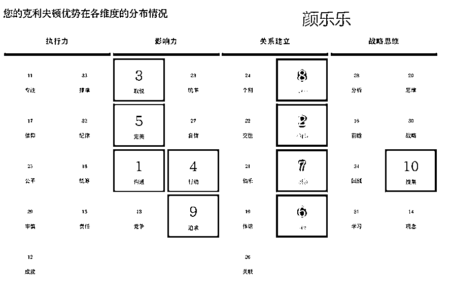
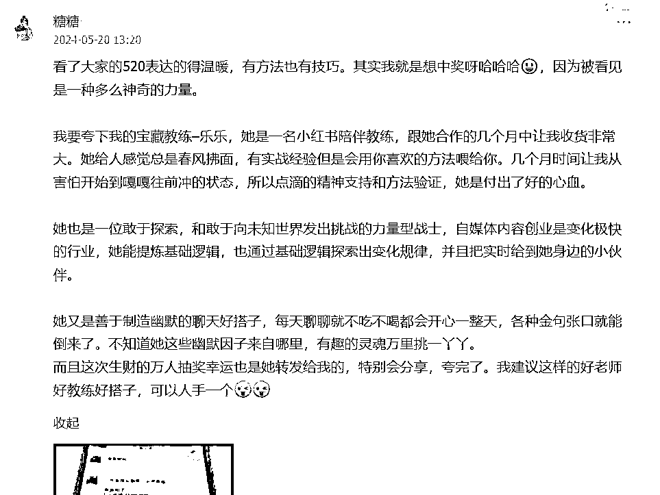

# 辞职这一年，月收入从 2000 到 4 万，我经历了什么？自由职业 1 周年复盘

> 原文：[`www.yuque.com/for_lazy/zhoubao/sfpf2cucuzp5ztvm`](https://www.yuque.com/for_lazy/zhoubao/sfpf2cucuzp5ztvm)

## (47 赞)辞职这一年，月收入从 2000 到 4 万，我经历了什么？自由职业 1 周年复盘

作者： 颜乐乐｜小红书

日期：2024-07-09

大家好呀，我是颜乐乐。

复盘不上班这一年，我写了两个版本，一个是实操版[《离职后转型做小红书个体服务商，半年变现 15 万，我是怎么跑通的？》](https://wx.zsxq.com/dweb2/index/topic_detail/2855421154488251)，我前面发了。这一版是聊聊我这一路的心路历程。

从职场打工人到自己养活自己，不依赖组织，把自己当一个产品出来卖。很荣幸，第一年，我在尝试了好几个方向后，终于跑通了闭环。原计划是搞不出来满一年就滚回去上班，幸好在我积蓄还能承受得住的时候跑通了。

-

刚离职那会，我大概是每个月靠失业金和一些零星收入 2000 左右，今年 5 月我的月收入突破了 4 万。减掉渠道 CPS 和各项学习支出，我终于靠不上班赚了 15 万。其实这个成绩在这里不算亮点的，但我自己还挺满足，赶紧来记录下，不然三年后，五年后，拿什么吹牛逼。哈哈哈~

**（你是不是在想，妈耶，不上班这么爽，我也要辞职了！冷静冷静！先吃块冰西瓜。）**

### **1、离职前，我有好多梦**

我是 22 年开始加入生财的，23 年 5 月离职。这一年，我可牛逼了，在这圈子里看到各种贴子就像自己打通了任督二脉，要是我早点来，不得早点发家致富上路了？当时看贴子哪叫一个热血沸腾，就是工作太忙了，我做运营还兼产品呢，还管公司的门店获客。但不重要，时间嘛，等我离开这个破职场，大把的，等我出来一定可以大显身手， 我只是缺少时间而已。

每天上下班路上都会 yy，这破地铁，老子以后跟不用再挤了，机会那么多，难道我会搞不到钱？我自己小红书都搞了快万粉了。

-

然而从职场出来后，现实很骨感，因为我离开职场也是公司资金链断裂宣布倒闭并无赔偿，我只能靠着深圳失业险救助金和存款度过，在刚出来职场的 6 个月里，我先后做了短剧推广，公众号流量主，三只羊直播切片，品牌号代运营，无一例外，我都赚到了一块钱。但都只有一块钱，并没有放大。就这样，我的梦，破了。

### **2、啥也干不成，难道，我要回去上班吗？**

经济压力在深圳，就像呼吸一样，时时刻刻都是存在的。如果一直拿不到结果，肯定是要上班的，在我摸索的这段时间，我也参加了一些生财的线下活动，看了别人都很牛后，开始思考自己，到底要做什么？为啥别人动不动年入百万，我好像干啥啥不成？

后来我反思复盘过，就是没有耐心，所有项目都有跑通，但没有放大的思维（那个时候为什么没有生财思维课，哭，新人快去看），也没有觉得这是值得深耕的事，只是觉得可以暂时赚点钱度过一下危机。

-

短剧项目变现了接近五位数，也算不错了，但当时没有放大的想法，而是仅凭自己的手去剪辑，同期有人做得非常好。项目没有问题，问题都出在人身上，如果你项目一直不赚钱，但别人又赚到了，真的就只能多反思，不要老怪项目。

-

我又开始在生财刷贴，在期间也开始去做一些盖洛普和性格测试，我想深度了解一下自己。然而，时间为到 2023 年 9 月，我在体检过程中我在体检过程中，查出来，身上长了一个巨大的异物，需要做增强 CT 才知道是什么，也不知道是良性是恶性，但体积过大，医生建议尽快办理住院做进一步检查。钱还没搞到啊，我的小命，不保了，心态彻底崩了。

-

在医院躺了 18 天，医院没 wifi，独处的时间多了很多，规律的作息让头脑也更加清醒。不上班，我的存款还能坚持多久？难道我要重回以前的生活吗？再给自己半年时间试试，不然就回去上班。

-

一方面是想看看自己是不是真的有能力独立生存，一方面家庭的原因，孩子没人带，老人不愿意来千里之外帮忙带孩子，我又找不到一个朝九晚四的工作可以接送孩子。在这个局面下，除了再试试，没有别的法子。（其实我很想上班哈哈哈哈）

### **3、财富是可以抄的，穷，就是抄的样本不对。**

回顾我的职业生涯十来年，一直都在做品牌营销，媒体相关的工。有没有可能，去教一些人开启自媒体呢？在线下的活动时，我发现每个人，好像都有自己的标签，我也在问自己，我的标签是什么？

过往我做了十年的互联网运营相关的工作，但在离开职场后，我似乎没有办法把自己卖出去了，除了卖时间卖体力（代运营的本质也是卖时间），代运营在账号有起色以后，客户就会收回去自己请人专职来做。如何能有长期的积累呢？

人这一生吧，你要卖很多东西，但本质上，都是在卖咱们自己这个人。是啊，能不能围绕我这个人，做点什么。在这一刻，做 IP，如雷击般进入了我的大脑。

-

有幸在这个时间，我在刷到了芷蓝在生财的贴子，里面有段话特别打动我。

“ 未来，教练这个 IP 人设会越来越有商业价值，比起各种副业搞钱的项目，具有更强的复利效应，尤其适合自由职业者、自媒体超级个体等角色。”

对吧，教练。这个是我想要的。

-

我做不到和他们一样年入千万，能百万也是可以的哈哈哈哈~

出院后，我思考了许久。那天是 2024 年 11 月，晒着初冬的阳光，我坐在奈雪的店门口，做了一个决定，再给自己半年时间去试试看，这次不换项目，就卖自己，不给自己退路了。

走一条新路，这条路我身边没人走，但互联网上有，那就找个人抄吧。

### **4、向外求助，付费礼貌请教**

抄也要有对象不是？我那会其实最头疼的，就是想知道教练是干什么的？花一笔钱，让别人来服务我，我不就知道了？我还真是个大聪明啊！当然后来我发现，我付费后，最大的影响并不是具体什么技能，而是状态。就像在深圳，你要是不聊搞钱线下局都组不起来。

对于普通人来说，认定一个方向，并坚持走在正确的路径上执行，这个很重要。一个人的时候总会怀疑自己，觉得方向不行，要不要再变变，实际上，是因为执行的力度还不够。

小白都在追求速成的方法，大佬都在练基本功，我在生财前辈们发的生财贴子看到非常多人，都是在持续的做流量，发朋友圈。

另外在某些关卡的选择上，有人帮你判断，这是很有必要的。因为我要走的这条路，真的身边的朋友没人干，只能在线上找。生财这个圈子的好处是，只要你想请教，发个红包，带着问题，基本都会获得回复的。

### **5、普通人的 ip 之路三步走**

都说 ip 到处都是金矿，但我们这样的普通人，想走这条路，要怎么入手呢？我观察了生财非常多厉害的人，大家有一个共同点，就是自己把一个事干成。这个事情，在生财的航海，就可以达成，包括在我那会搞短剧，其实是拿到结果了，但没有放大的思维。

**把事干成——总结经验和 sop——复制给更多人**

圈子里有非常多厉害的人，也非常多想要变厉害的人，变得厉害第一步，就是去做成一件事。比如小红书拿到万粉，比如自己引流卖东西变现，或者闲鱼跑通。

-

做成一件事，就去复盘，把经验分享给身边更多伙伴，攒影响力。影响的人越多，ip 的势能就会直大。如果你现在还处于比较迷茫的阶段，不觉得自己有什么强项，可以先去跑通一个小项目，拿到一个结果。不要刷贴了，选一个项目做，然后遇到问题再回来星球上搜索，用尽全力把一个项目推进下去。

-

项目没做成前，不混圈子，换资源是一个锦上添花的事。所有的付费，都应该是要帮我解决一个项目推进的问题。0-1 阶段，学引流，学朋友圈都可以，围绕核心方向付费。

### **6、流量穷人，不做标品，不挑客户**

基于我以前做产品运营的思路，我给自己定了高中低三个产品。在前期真的就没有想法，全靠抄。是的，我承认我的海报是抄的，看别人小红书教练海报咋做我就咋做，然后做了再优化迭代。基于差异化考虑，作为流量穷人，我决定不做课，只做陪伴和一对一定制辅导。因为课，淘宝一堆盗版，我一个人，也没太多精力，我就一对一的解决吧。

-

事实证明这样是可行的，先卖了再说。因为是定制，所以什么人来都有，各种需求的沟通中，我发现了自己的一些隐藏能力。比如帮人找到他比较值钱和差异化的地方，发现他的与众不同之处。因为以前在公司上班，基于营收，我们做内容就是会设计前后端的打通，所以我在辅导的时候也可以把这个内容加上去。这样操作下来，能来找我的，其实都是有业务的人， 实际业务做流量就更好拿到结果。

-

因为前期没得选，所以我各种行业的学员都招过。但现在，在不断的前进过程中，就会发现，有业务和本地见过面的用户，沟通起来更高效，同时服务上可以给到更多的支持，客户满意度更高，信任感也更强一些。

-

在服务的过程中找到自己更加顺手的行业，再针对这些行业去公域做内容引流，整体就会更加的丝滑啦，我也开始找到一种公域来的用户因为精准而 24 小时内转化 3980 的产品，回想以前，我可是卖个 199 都要谈很久，果然成长，就是靠做事。

### **7、大胆的宣传，真诚的交付**

定了方向，就好好卖，只要涉及到卖，就会有一个问题，要宣发，要发朋友圈。这个问题我相信很多人都会卡住，我在之前的贴子里也有写过，发朋友圈也是有方法的。屏蔽你在意的人，然后就放飞自我吧。持续宣传自己，持续谈单，无数量不可以谈转化。

-

于是我自己今年又针对业务版块，重新小红书起号，3 个月涨粉过万，引流了上千人，加上朋友圈近半年的持续宣传，已经开始有人帮我推荐客户了。

-

老同事，以前的合作伙伴，看我一直在做这个事，也相对靠谱了，就会帮我介绍。一个人成长的状态，一定要大大方方的分享出来，让大家看到你的变化。哪有什么技巧，真诚就是唯一的技巧了。

在交付方面更要真诚，作为行业新人，比卖更重要的，是积累案例，收款之后才是最重要的事。我采取的交付方式是我自己曾经在企业带伙伴的方式，沟通——做计划——辅导落地——解决执行过程中的问题——阶段复盘。

我当时没做标准课的原因，也是基于交付考虑的，因为知识到处都有，陪伴和落地，帮他解决一个个执行过程的小问题，推进项目。

因为重交付，一对一咨询也会梳理得很细，同时搭配社群服务一年。 几百块的一对咨询， 反馈和转介绍还错。包括私教前期我前期每个月只招 5 个学员，因为控制人数，所以交付体验感会更强一些。这也是目前很多客户愿意帮我转介绍，推荐我给身边人的原因。

-

**最后，我总结一下职场人转型的几个建议**

1、普通人也可以卖，90 分教 60 分，60 分教 30 分

2、新人最好的成长方式就是练手，做事，拿结果，干成一件事，总结 SOP

3、自己想不通的问题，不要闷着，找人请教，明确目的的花钱，加速自己解决问题的效率

4、想开始新赛道的时候，可以先回顾下自己过往可迁移的能力，不要浪费了过去的积累

5、不做标品，只做非标，尽量做高客单，转化大单和转化小单用的力气是一样的。

-

以上是我自由职业第一年的复盘，希望可以帮助所有想要体验新个体，数字游民，自由职业的伙伴一些参考和启发。在此，感谢曾经在这条路上探索过程中，给过我帮助的 芷蓝老师，靠谱老师，鱼丸，生财给过我鼓励和支持的伙伴。

-

## **所以经历仅供参考，不建议盲目辞职哈！**

-

未来可期，祝大家爱财爱己，风声水起！一起生财有术。

* * *

评论区：

初樱 : 恭喜你
颜乐乐｜小红书 : 谢谢宝子
王珣 : 厉害，向你学习
颜乐乐｜小红书 : 谢谢老板 一起生财

* * *