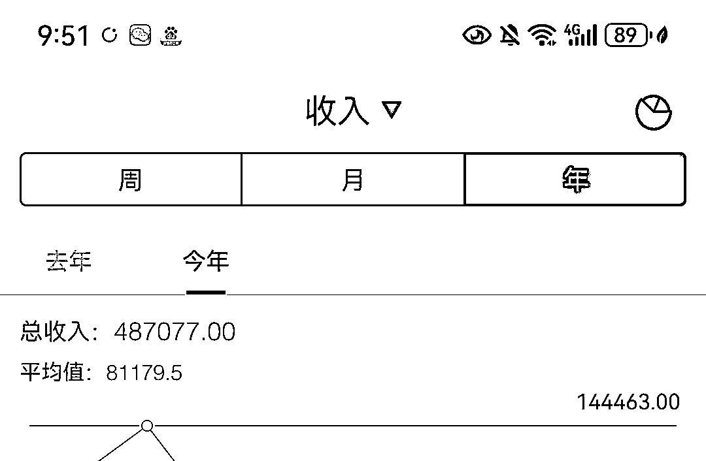
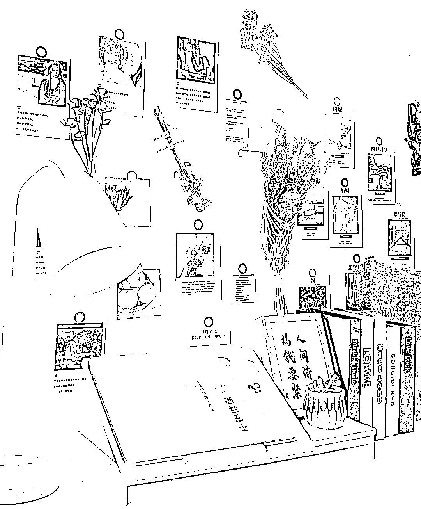
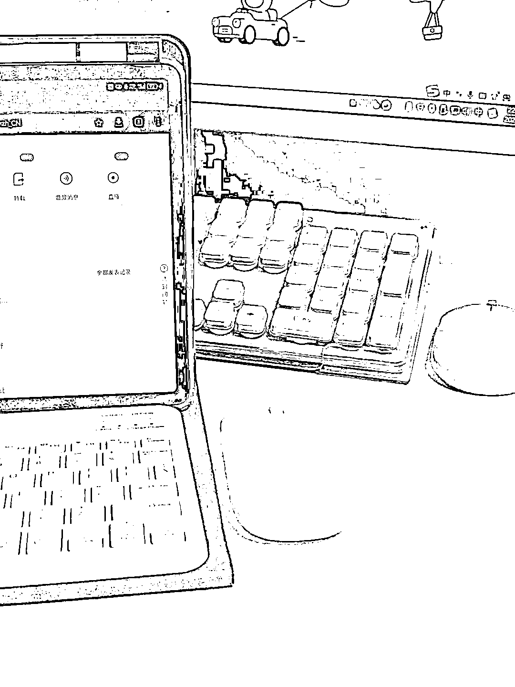
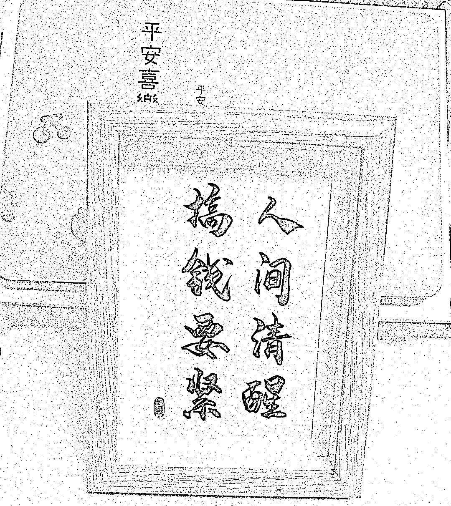
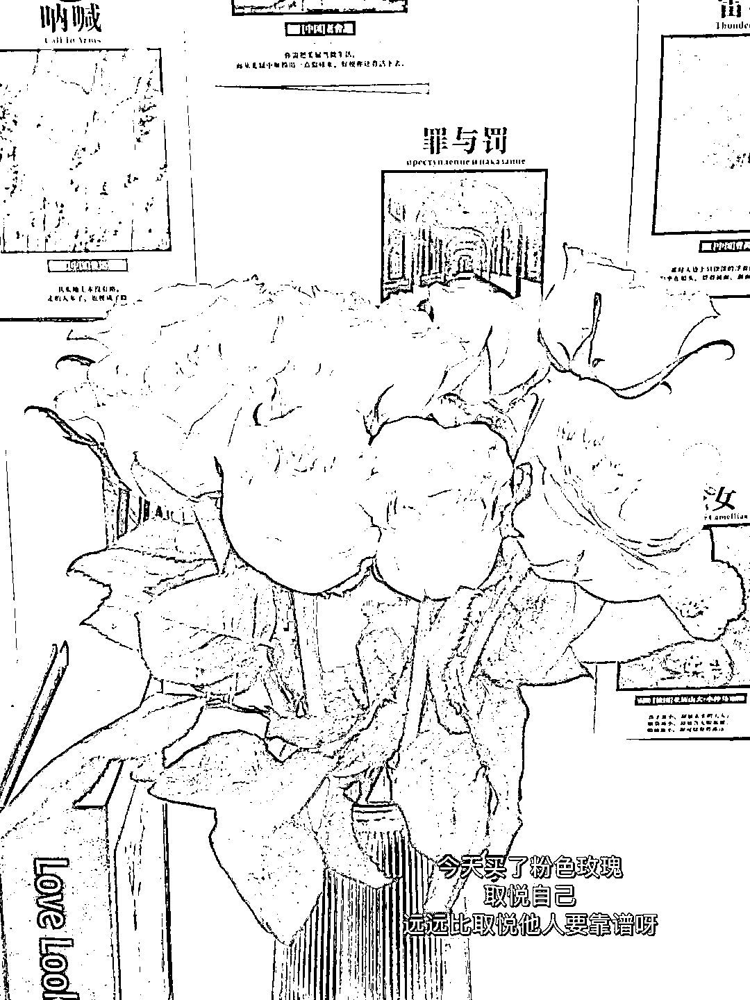

# 31 岁创业失败，全职自媒体后，1 个人 6 个月赚了 48w+

> 原文：[`www.yuque.com/for_lazy/zhoubao/bf3yhd9rfqvtmgrh`](https://www.yuque.com/for_lazy/zhoubao/bf3yhd9rfqvtmgrh)

## (37 赞)31 岁创业失败，全职自媒体后，1 个人 6 个月赚了 48w+

作者： 格子

日期：2024-07-02

6 月过完啦，回头一看，2024 年已经过半了！

**我看了下这半年的收入，居然高达 48w+了，把自己都惊到了，原来普通人做自媒体这么挣钱啊！**

虽然比起圈里的大佬，我还差得很远，但是对于创业失败，负债将近 50w 的我来说，这已经是我天大的突破了！

2022 年 7 月份我创业失败，找不到工作后，就开始全职做自媒体了，不知不觉也快 2 年了。

在这 2 年里，我一个人活成了一支团队。

其实我有很多短板，优点也不多，可我想的是，既然踏进了这个圈子，就只能努力把自己打造成一个六边形战士，什么都要会，不会的就努力去学。

所以，这一路走来，只能说痛并快乐着吧。

接下来给大家分享我全职自媒体的一些心法吧，我觉得这个非常重要。

**一、做长期主义者**

很多人的心是不稳的，而且急功近利，这个赛道做了半个月一个月没看到正反馈，就放弃了，总觉得换个赛道就能解决问题。

当你能力不够时，频繁换赛道解决不了根本问题，因为所有赛道的底层逻辑都是一样的，你缺的不是赛道，而是你的能力。

**其实坚持深挖一口井，远比遍地浅挖十口井效果好。**

这两年来，我前前后后付费很多钱去学过很多项目，结果到现在，我就聚焦于公众号流量主和小红书商单，那是因为我在折腾的时候发现自己频繁换赛道不过是费钱又费时而已。

**项目在于精而不在多。**

**二、做离钱最近的事情**

我们做一个项目之前，一定要规划好自己的变现路径，避免后期无法变现的痛苦。

我遇到很多小红书博主，几十万粉一分钱没变现，来问我怎么办。

还有很多人，总是说我就喜欢这个，我只能做这个。

关键是你做这个你变现不了，你图什么呢？你又不是真的为了爱好，要是单纯为了爱好，你压根不会有流量焦虑啊。

如果不清楚你的赛道能不能变现，直接去看同行，他们怎么变现，你就怎么变现。

**三、先完成再完美**

说实话，我是个完美主义者，一开始，我也总觉得自己没准备好，所以迟迟不肯踏出第一步。

可是事实上，我认为的完美真的不是完美，很多问题，只有等我去做了，我才知道，我才能有能力去解决。

有时候想太多，就很容易错失风口。

自媒体风口真的是转纵即逝的，如果你抓住了，也许这几年你就蜕变了，如果你没抓住，以后真不一定还会有。

所以，先完成再完美，遇到问题再解决问题。

**四、做自媒体要相信自己**

一开始我做自媒体，被亲朋好友打击，说我一无是处，还想着天上掉馅饼。

说实话，我也怀疑过自己不行。

但是当我月入 10 个 w 的时候，家人们都闭嘴了。

没有什么不可能的，你一定要相信自己，只要肯努力，你一定能在自媒体圈子里杀出一条路来。

**五、敢于表达自己，不要在意旁人的看法**

自媒体，就是那些表达欲强的人的红利，一定要敢于表达。

不是说一定要写自己多么多么优秀，挣了多少多少钱，哪怕是自己曾经的失败，偶尔的迷茫，一段时间的低谷，都可以写，写真实的你，全方面的你。

你的文字，总是能吸引到同频的人的，这样就足够了！

至于那些质疑的声音不用去在意，其实人生就是这样，你过得好或者不好，都会有人对你指指点点，没必要为了这些人影响我们搞钱的心态。

**六、多付费学习，努力破圈**

不要一谈知识付费就大喊割韭菜，很多信息差，你不花钱真的买不到，很多大佬，你不花也接触不到，很多圈子，你不花钱压根进不了。

如果你想在哪一方面有所成就，最直接的方法就是去向优秀的人付费学习，可以让你少踩很多坑。

我以前也是舍不得付费学习的人，一个 99 的课程我都要犹豫很久很久，总觉得自己网上就能找到，或者自己摸索就能摸索出来。

结果是，时间浪费了很多，自己也精疲力尽，却一无所获。

后来我舍得花钱进生财，舍得花钱去入大佬的合伙人，一下子我的收入也有了大的突破，直接从月入四五万到了月入 10 万。

**反正我的每一次付费学习，最终的目的就是节省时间，积累资源，完成破圈。**

入局自媒体 2 年，我看到了太多大佬年入百万，我虽然还没做到，但是我相信，总有一天我也能做到的，接下来我只是坚持做着就行。

自媒体红利期，只属于在场上准备好的那群人！希望你我都能攀上巅峰！

* * *

评论区：

泡泡邮递员 : 不是，咋挣的没说啊[撇嘴]
⁽⁽ଘ青禾ଓ⁾⁾ : 深挖一口井。 你把编主的所有文章都过一遍不就知道了
格子 : 我就做两个项目，公众号流量主和小红书商单
泡泡邮递员 : 怎么做啊求带
阿格 : 加入了谁的合伙人呀

* * *