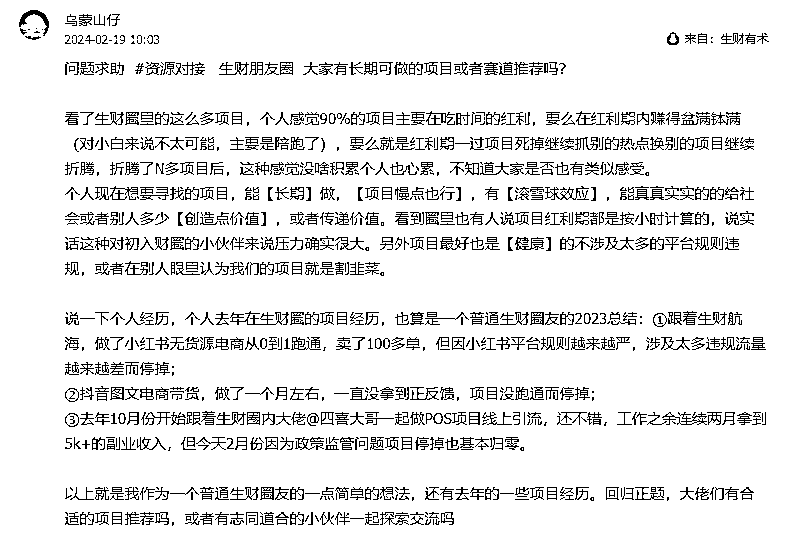

# 尝试了一堆副业后，为什么我最终选择去卖保险了

> 原文：[`www.yuque.com/for_lazy/zhoubao/lgk2iu3c3gr70p5n`](https://www.yuque.com/for_lazy/zhoubao/lgk2iu3c3gr70p5n)

## (22 赞)尝试了一堆副业后，为什么我最终选择去卖保险了

作者： 乌蒙山仔

日期：2024-07-03

## **一、先说说自己为什么要做副业**

不清楚你是否也有长期困扰着自己的职业困惑，我接下来说说我自己。

​

毕业 10 年，数据分析做了 7 年。

缘起 16、17 年乘着大数据火热的东风，开始了自己的数据职场生涯......

其实在上一家公司就认识到数据分析师这个岗位的局限性了，岗位局限性很大，上升空间小上升路径窄且不清晰，如果不考虑转岗或者转型的话，就一直是个数据分析师的角色了。

而且因为没有在大公司的历练，除了每天取数，思维和视野上没有很大的提升。在非一线大厂的公司，数据分析真的就是一个工具人，每天坑吃坑吃的给别人提数，处理各种数据需求，都是一些很琐碎的事情，很难被量化，而且真的很难去呈现自己的价值，因为数据分析师，在绝大部分公司本质上就是一个工具人+SQL boy+辅助岗的角色。

这个岗位，毕业 1、2 年的新人，有个人带着，很快就能胜任，没什么特别高门槛。而且随着 BI 技术的不断提升，数据分析慢慢退化为一个人大多数优秀的风控 er 或者运营 er 的必备专业技能，而不再应该是一个专业独立的岗位。

​

所以做数据分析，越做越显得尴尬。

​

而且个人也曾经参加了公司的 2 次晋升答辩，都没有通过。个人没有内在的核心竞争力（而且单靠数据分析也不现实），另外一个就是所在团队做的项目都不断是从 0 到 1 的试错，团队根本没有拿得出来的业绩（说明一下，同期一起参与晋升且通过的小伙伴，都是所在团队业绩做得不错，个人也很优秀，个人能力和团队业绩都特别重要。）

​  

另外一个外在原因就是，随着经济的持续下行，以前做到团队的前 10%就能晋升，现在至少得 5%，甚至 1%才能晋升（公司规模接近 1000 人）。

​

而且自己长期以来一直有一个想要成为自由人的想法，时间地点都自由的自由人，时间听自己安排，工作自己来安排的这样一种挣钱模式。

​

基于以上原因种种的原因，个人从去年就开始陆陆续续尝试各种副业，想着就是在家就能把钱挣了。

## **二、去年都做了哪些项目，尝试了哪些副业呢？**

### ①「项目一」小红书电商：去年做倒闭了 2 个店

去年年中，副业小红书电商很火，跟着生财圈的航海，在小红书上开始卖洞洞鞋。从 0 到 1 的小红书无货源电商的开店路径闭环，当时主要卖女款夏天穿的洞洞鞋，客户下单以后就去 1688 或者 pdd 给客户下单，当时测试到了一个爆款，文章爆了，卖了 100+双洞洞鞋。后面因为平台对无货源政策的持续严打监管，而且也是第一次做没什么经验流量持续下滑，最后就稀稀朗朗没什么单就关店了。后续还接着做小红书电商，卖母婴用品，也测试出一个爆文爆款，母婴用纸，也卖了几十单，但因为客单价低定价也低，几乎没什么利润。后续也是因为没有持续打造爆品，在一直坚持但没有得到很好反馈的背景下也关店了。

​  

当天爆单第一天，一晚上就买了二三十单。

  

当时做小红书的素材和爆单截图

### ②「项目二」公域引流卖 POS 机项目：副业收入，从月入 5000，到归 0，只用了 1 个月

去年国庆后，在生财圈偶然间看到一个做 POS 机的项目（机缘巧合是在此前知道自己同事有靠卖这个 POS 机一个月赚 20 多万，但这同事只是天天炫耀而不带别人做），于是又开启了另外一个副业，从小红书/今日头条/抖音等平台写小作文引流客户，3 个月引流私域 230+好友，私域订单成交转化 50%+，赚了 1W+多钱。11、12 月份连续两个月都做到 5000+的收入，盘算计划着 2024 年副业月收入就要开始破万了。但因为项目涉及到线上信用咔套、现，也是出台强政策在 1 月末就停了，随之而来的每月 5000+的副业收入也停了。

​

  

  

当时做 POS 的素材和收入截图

哎......又做倒闭了一个项目。

​

其实去年也还有尝试过很多别的项目，诸如抖音团购图文带货，抖音电商达人带货，自己均没有得到很好的反馈和结果。

题外话，抖音图文带货自己没有拿到结果，但带着一起做的弟弟妹妹都拿到了不错的结果，他两应该分别也小赚了 1 万多块钱。

## 三、又陷入到处寻找项目的阶段

​

接下里又开始寻找新的项目，有了前 2 次失败的项目经验后，对选择新的项目就还是很谨慎了。

前 2 次的项目，都失败于要么和平台政策对抗，要么和国家政策对抗，项目稳定性较差，接下来就希望自己能找一个长期的项目。然后就继续去生财圈找项目，搜索关键词<长期>等等。

2 月份在生财圈的求助帖截图

​

最后得到的答案是，做个人 IP，这是一个值得可以长期深耕的反向。

但做什么类型的 IP 呢，有推荐做心理咨询、家庭教育、保险销售等等方向的 IP。其实这些方向都是不错的，但前两个身边都没有特别好的引路人。

## **四、最终为什么选择做保险经纪人？其实也是一个天时、地利、人和的结果**

**从过完年 2 月份就开始了解，这期间，其实自己也犹豫再三，内耗和考虑了 3、4 个月。**

​

  

### **第 1、曾经接触过，但被我拒绝了**

​

其实自己大学刚毕业时就有接触过保险，校友就有引荐带去参加过保险行业的一些活动，当时在国企时，身边也有 2 个很好的朋友也是同事（1 个武大 1 个中国矿大）都转行去卖保险了。

但他们都是走的传统销售模式，卖的是一家公司的产品，同时也是走线下拓客的方式。

他们 2 位，应该都没坚持半年吧，就退出了。

​

如果还是这种传统售卖的方式，我是一内向的人，肯定不会去选择做。

毕竟，要合适的话，我早 5 年前就做了。

### **第 2、我认可保险这个东西**

​

认可保险。主要来源 3 个方面：

第 1 是，身边一些高知的人群，给了不同视角去介绍保险。罗振宇跨年演讲的这张图，应该很多人都有看到过。

  

第 2 是，毕业后，朋友圈见过水滴筹的次数不低于 20 次了吧。人生的风险随时都在。

第 3 是，街边经常见到的生病求助，如果他们做了保险配置，应该会好很多。

### **第 3、我认可经纪人+顾问式的销售模式**

这种经纪人的销售模式，其实我早就有听说过。因为不是卖一家的产品，所以不会出现王婆卖瓜自卖自夸的现象。不是站在保险公司角度去推销产品，而是站在客户角度，去给客户匹配合适他的产品。

因为保险客户的核心需求就是：买对，且性价比也高。经纪人通过一个高性价比的保险产品方案，帮助客户搞定个人，或者他家庭的风险对冲。

​

认可顾问式的销售方式，像老板说的一样，愿意脱掉脱掉孔乙己的长衫，去做一个销售，去做一个买卖人。

选择在线上卖，这本身也是一种创业方式。公司提供产品，我负责去找客户。

因为不管是线上开店，或者做门什么生意，本质上，都是在解决这 2 个问题，第 1 个问题是决定卖什么吗，第 2 个问题，决定卖给谁，有这些潜在需求的这些人都在哪里。顾问式的销售就是把合适的产品，卖给正好有需要的人。

### **第 4、觉得自己搞得定流量**

​

做了这么些项目后，觉得自己有一定搞流量的能力。可以试一试。

### **第 5、其他我也考虑了很多**

​

①保险工作时间自由，工作地点自由，只工作不上班，能很好的兼顾家庭，同时收入天花板也相对更高，做销售看业绩说话，理论上不存在 35 岁中年危机。

​

②不消耗身边朋友。认可从线上公域拓客的展业模式，认可顾问式的销售模式，不消耗家人或身边朋友。

​

③不消耗自己。保险要做得优秀，其实需要学习和积累自己多方面的专业知识、阅历见识（如果还是和传统的 50 岁的大妈的卖法一样，那就当我没说），通过自己的专业能力给客户提供产品咨询服务，合理帮忙客户对冲个人或家庭风险时，也能实现自己的价值，对自己本身也是很有帮助。反正现在感觉比自己天天在办公室写代码强。

​

④人和（遇贵人）。找一个值得你信任的人，加入一个好的引荐人或者团队，学习氛围好，不内耗不内卷，利于自己的成长，实现彼此的共赢。多说一句，因为保险团队拉人头天然的存在利益绑定关系，和市面上好多纯割韭菜的项目不太一样。

​

⑤都是卖保险，只是买法不一样。不推销客户，不教育客户，只筛选客户。只是正好你需要，然后你信任我而已。

### ​**第 6、我没什么损失也没什么成本**

最终选择兼职加入，反正又没什么损失，也什么太大成本呢，顶多就是时间成本（目前工作不太忙，时间也相对较多）。

## 五、最后，说说做保险的难处和挑战

1、不够自律，时间投入不够。

2、短期见效慢，容易放弃。

**于大家：**

希望在有得选时，保险可以作为你选择试试的方向之一，而不是唯一选择。

已经走投无路选择的保险，那样风险很大，做不成的几率也非常大。

​

**于自己：**

**不管怎样，目前也没有其他更好的选择，而且当下觉得这个选择也不错，就试试呗。**

**不管怎样，先行动起来再说，向前迈一步呗。**

* * *

评论区：

白白 : 巧了，我也入职做保险了，可以交流交流群哇[调皮][发呆][发呆]但不是保险经纪人这种，就卖自己公司的产品
乌蒙山仔 : 好滴，可以一起交流哇[握手][握手]
PLM : 加油，其实我也想过尝试的，但是一直都没做[捂脸]
乌蒙山仔 : 都可以试试的
王司 : 分析的很好
乌蒙山仔 : 🙏🙏🙏 云天猫猫 : 哈哈，你找的哪位生财大佬带你呀
乌蒙山仔 : 保险嘛？不是生财圈的

* * *