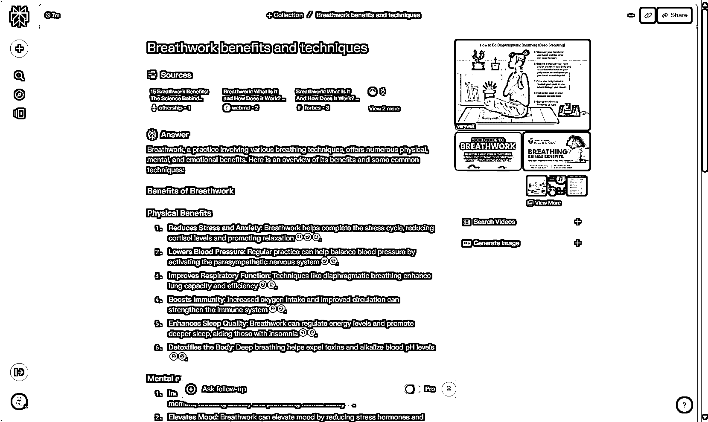
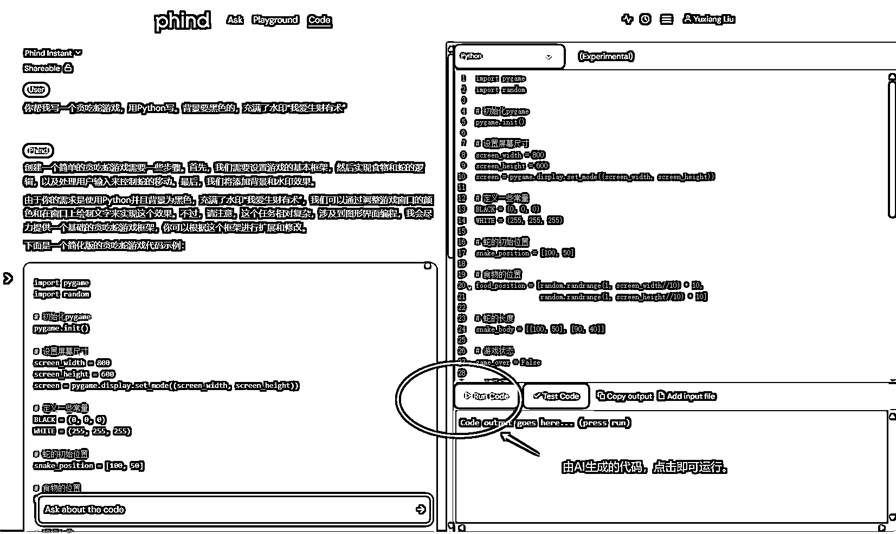
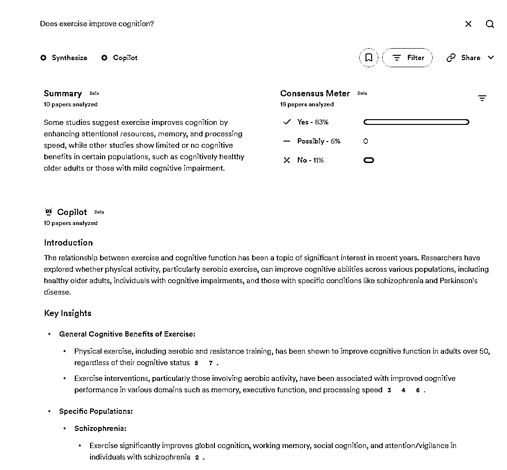
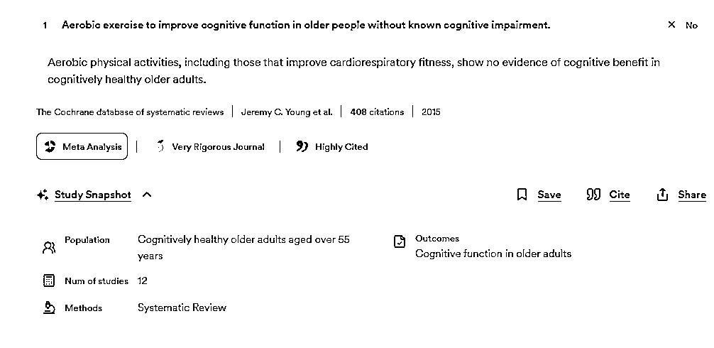
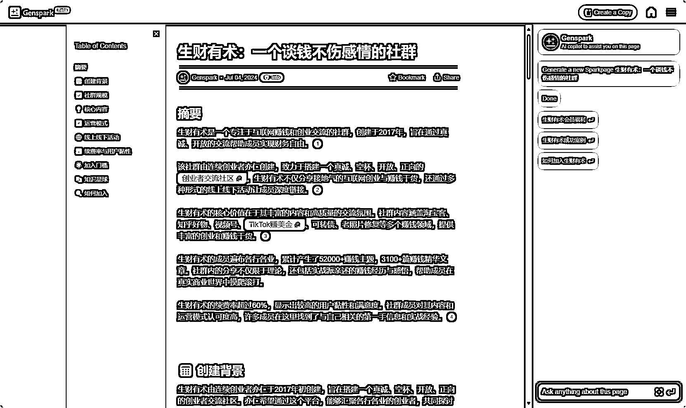

# 赚钱机会在哪里？

> 原文：[`www.yuque.com/for_lazy/zhoubao/px32wvp9uignm5yp`](https://www.yuque.com/for_lazy/zhoubao/px32wvp9uignm5yp)

## (精华帖)(246 赞)赚钱机会在哪里？

作者： 刘小排

日期：2024-07-05

哈喽，朋友们，我是刘小排。

*“我想做海外 AI 产品。小排老师，你觉得，如果我做****AI 搜索引擎类产品****，有没有机会？”*

最近太多人问我这个问题了。

赚钱机会在哪里？

下面谈谈我的思考，以及思考背后的底层逻辑。

# **一、异常值**

赚钱机会藏在异常值里。

你注意到一个异常值：这个世界好像缺了什么东西、这个世界上有什么东西坏掉了、这个世界上有什么东西它很奇怪似乎不应该是这样。

如果你找到了这个异常、且正好有能力修复这个异常值， 你就找到了赚钱机会。

如果你看周围的世界没有发现任何异常，你就找不到赚钱机会。

# **二、为什么大多数人看不到异常值**

大多数的普通人，处于一个平凡的世界。在他们眼里，衣食住行吃喝拉撒都已经有现成的解决方案、想创业做的任何赛道都已经变得非常拥挤。看不见任何异常值，看不见任何创业机会。

而少量的异类，他们处于一个完全不同的世界 —— 在他们眼里，到处都是机会。

为什么大多数人看不到异常值呢？

因为他们看的距离不够近。

保罗格雷厄姆说：知识像分形一样生长。从远处看，它的边缘是平滑的，但当你深入研究时，你会发现其中充满了空白。这些空白会显得如此明显，让人不禁疑惑为什么没有人尝试去解决或探索。在理想的情况下，探究这些空白会带来全新的知识领域。

Knowledge grows fractally. From a distance its edges look smooth, but when you learn enough to get close to one, you'll notice it's full of gaps. These gaps will seem obvious; it will seem inexplicable that no one has tried x or wondered about y. In the best case, exploring such gaps yields whole new fractal buds.

我们可以拿海岸线来举例， 海岸线是典型的分形结构。

如果你从地球仪上看它，会觉得它无比光滑。当你走得足够近，才能发现它到处都是空隙、到处都是奇形怪状、到处都是异常。

上面的道理很容易明白。

那么，为什么大多数人看的距离不够近呢？

因为他们没有足够深刻和具体的知识，没有能力走近。

例如，让我问问你：

在 2024 年，知识付费还没有机会做？ 普通人会告诉你，有很多的新闻、社区、自媒体都有过结论，知识付费这个赛道已经关闭了。

在 2024 年，教人炒股的社区，还没有机会做？ 有些自认为比别人聪明的普通人会告诉你，这个生意不成立，因为有悖论 —— 如果有人炒股那么厉害，他应该自己炒股闷声发大财、不应该会看得上这点学费；能看得上这点学费的教人炒股人，应该是骗子。

这就是典型的普通人思维，他们由于缺乏具体知识，没有能力走近，只能人云亦云。

而事实上，以上两个问题的答案都是肯定的。—— 咱们生财有术有一位叫邢不行的圈友：他做的生意正好是一个教人炒股的、知识付费的社区。客单价一万左右，每年几千万的利润。他的生意已经持续了很多年了，续费率不比生财有术低。 （ [`www.quantclass.cn`](https://www.quantclass.cn) ）

什么样的人才能做这个生意呢？

只需要拥有量化交易的知识、知道有很多人想要学习和交流量化交易却又没有地方可以学、知道自己能搞定。这就够了。

他有能力走得足够近。 因为足够近，他不需要关注诸如”知识付费有没有机会“”教人炒股有没有机会”“中国关系紧张，生意不好做了”“经济下行，生意不好做了”的从远处眺望的问题。

他发现了世界的异常值： 真是奇怪，这个世界上怎么没有一个中文的、专业的、教学和讨论量化交易的社群呢？然后，他帮我们的世界修复了这个异常。就是这么简单。

# **三、一个完整的例子**

*“我想做海外 AI 产品。小排老师，你觉得，如果我做****AI 搜索引擎类产品****，有没有机会？*”

关于海外 AI 产品创业项目，这是今年我被问得最多的问题，没有之一。

问出这个问题并不奇怪。AI 搜索，以 Perplexity.ai 、秘塔搜为代表，真是太火了。而且 Github 上还有一大堆 AI 搜索引擎的开源代码，对于一个正常程序员来讲，抄一个和 Perplexity.ai 功能体验差不多的产品相当容易。

我往往会回答：“没有”。

不是真的没有。 我只是觉得，当你问我这个问题的瞬间， 对于此刻的你来讲，没有机会。 你站得太远了。

让我们来看看，那些有能力站得更近的人，是怎么找 AI 搜索产品机会的。

我们都知道，AI 搜索引擎的产品形态是 perplexity.ai 发明的。普通人认为，它的产品体验很完美。

只有那些能站得近的怪胎，才能发现它的不完美之处。

## 0.Perplexity

考虑到咱们一些读者可能不熟悉 AI 产品圈子，我先为大家展示“祖师爷”的形态。

[`www.perplexity.ai/`](https://www.perplexity.ai)

## 1.Phind

有人发现： perplexity.ai 搜索其他东西可以，搜索代码不太行啊，对于程序员来说很鸡肋。

“竟然没有其他人注意到这一点吗？ 好的，那我来解决这个问题。” —— 后来，我们有了 Phind ([`www.phind.com/`](https://www.phind.com) )

Phind 专注于为程序员打造的 AI 搜索引擎。它背后的大模型不是 GPT，而是自己专门训练的大模型，生成代码的能力很强 ，

此外，它做了一些普通人在普通 AI 搜索里不会用到、程序员在代码 AI 搜索里才会用到的功能。例如：生成的代码可以直接在浏览器中运行，无需用户在自己的电脑上配置开发环境。

## 2.Consensus

又有人发现：AI 搜索引擎虽然好，但是大语言模型总出现幻觉（一本正经地胡说八道），对于搞科研的人士非常不友好。

“这个世界怎么没有一个专为科研人士设计的 AI 搜索引擎呢？真奇怪” —— 于是，我们的世界又有了 Consensus ([`consensus.app/`](https://consensus.app))

Consensus 的产品体验与通用的 AI 搜索引擎有非常大的不同，它处处为解决科研工作者的痛点而设计。

当用户提问后：它可以搜索世界上所有严肃的论文、告诉你有多少论文同意你的观点、多少论文不同意你的观点；它可以给出论文的引用数据、调研方法、论文权重；它还可以帮你构思你的论文……

以下我放了一些截图，大家可以感受一下。

## 3.Genspark

还有人发现：AI 搜索真的挺好的，可惜信息比较简短、不够全面、不够图文并茂、不够结构化。[Perplexity.ai](http://Perplexity.ai)的搜索结果，无法被自媒体工作者直接复制粘贴使用、无法被当成调研报告使用，用户获取信息的成本还是有些高。

“为什么没有一个搜索结果更像调研报告的 AI 搜索引擎呢？真是太奇怪了！” —— 于是，我们的世界有了 Genspark

大家可以点击这个链接来感受一下 Genspark 搜索结果的震撼 —— 我只输入了“生财有术是干什么的”，1 分钟后得到了这样一篇图文并茂、结构清晰、排版整齐、不逊于调研报告的文章。 （注意：左边的目录是可以点击的）

[`www.genspark.ai/spark?id=13185e35-5e69-4419-a2f2-ea85e2cb79ec`](https://www.genspark.ai/spark?id=13185e35-5e69-4419-a2f2-ea85e2cb79ec)

（注：您可能需要配置网络，才能正常打开）

## 4.还有机会吗？

回到我们最初的问题，

它的答案，和赛道、风口、技术都没有决定性的关系。

它只取决于你是否有能力站得足够近，近到能够发现异常值。

# **四、怎样才能站得更近**

我们已经知道，站得更近，才能发现异常值。

怎样才能站得更近呢？

## 1、拉高基线

日常把生财有术的精华帖和风向标刷完。

首先，它们当中暗藏了很多按头喂饭的异常值。

然后，打球需要球感，赚钱也需要钱感。当你看多了以后，你“钱感”的基线提高了，会对异常值更加敏锐。

## 2、具体

北京十一学校的李希贵校长经常讲一句话，人怎么才能解决问题？不是天天坐在那讨论理念，而是要深入到这个世界的具体场景和行动中。六个字 —— “一具体，就深刻。”

在寻找创业机会这个问题上，我们可以具体为 ——

什么人、在什么场景、在什么行动中、有什么样的问题？

这个问题可以被什么产品形态、什么价格、什么服务形态去解决？

不是 “我想做 AI 搜索引擎产品，还有机会吗？”

而是 “什么人、在什么场景下、在什么行动中、使用现有的 AI 搜索产品 perplexity、还有什么样的问题没有被解决？”

不是 “知识付费领域好做吗？”

而是“什么人、在什么场景下、在什么行动中、愿意为什么知识付费？ 我应该用什么服务形态、定什么价格去解决？”

## 3、专业领域

尽量做自己精通的专业领域。

如果你还没有专业领域，那就花时间去帮自己培养一个。通常，从好奇心或兴趣开始，是一个好的方法。

拿刚才提到的 Consensus 产品来说，无论我的 AI 知识、编程技能有多么强，我都做不好这个产品 —— 因为我不做科研，我完全不懂科研人员工作中的痛点是什么。

刚才不是提到要“具体”吗？ 我们没法在一个自己不懂的领域去“具体”。

越精通、越具体。

同样，你已经知道邢不行的知识付费生意很赚钱了，但无论你有多么懂知识付费、多么懂社群运营、多么懂私域流量， 你也做不了他这生意。你没有办法在量化交易这个专业领域去“具体”。

# **总结**

1.  赚钱机会藏在异常值里。
2.  为什么大多数人看不到异常值呢？因为他们看的距离不够近。
3.  从远处看，它的边缘是平滑的，但当你深入研究时，你会发现其中充满了空白。这些空白会显得如此明显，让人不禁疑惑为什么没有人尝试去解决或探索。
4.  越具体，越深刻。
5.  越精通，越具体。

* * *

评论区：

凡灵逸尘 : 终于等到你，哈哈哈
刘小排 : [呲牙]好久不见
不困 : 前排支持小排老师[强][强]
Xianer : 这几个案例惊到我了。
车夫子 : 牛，起床放水刷一下，这一下就让我睡不下去了
戴巍 : 小排每次文章都非常精彩[强]
河马君 : 一针见血！
知秋 : 很喜欢小排老师的文章

* * *