# 我做小红书的 99 条关键经验

> 原文：[`www.yuque.com/for_lazy/zhoubao/pgfvvaek24cryf6n`](https://www.yuque.com/for_lazy/zhoubao/pgfvvaek24cryf6n)

## (24 赞)我做小红书的 99 条关键经验

作者： 许义

日期：2024-07-01

之前在生财里分享一篇《小红书 3 天新号粉丝破千的运营方法论》，这篇收获了 356 个点赞和 60 条评论，更重要的是这些最为有效的反馈，支撑了我完成新书《小红书变现 7 堂课》的写作。

所以，新书出版后，给航海家人手送了一本。

  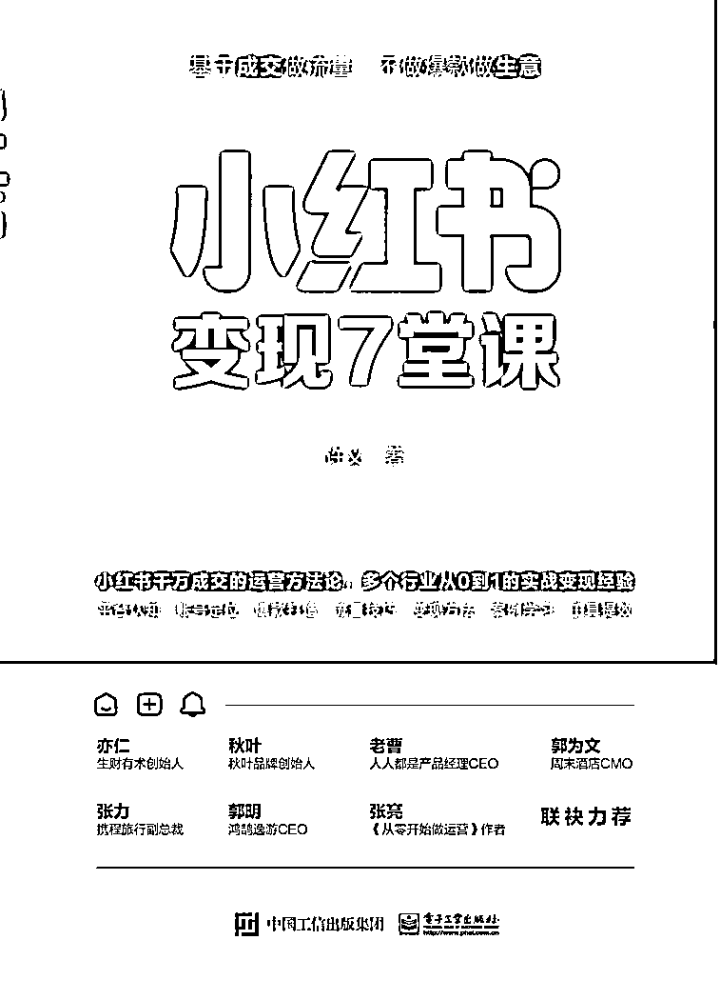

今天是想分享一下书中最为有效的 99 个经验，希望对生财同学做小红书能有帮助，也期待如果内容有价值，多做评论和反馈企，期待分享好消息。

### **一、关于小红书的运营认知**

### 01.**如何正确理解依靠小红书的变现行为？**

先理清平台、用户、自己 3 者的角色和关系，你能变现一定是因为你交换出了价值，我在课程里提到先知道并满足平台和用户的需求，平台需求：活跃和停留，用户需求：情绪价值、知识价值、实用价值

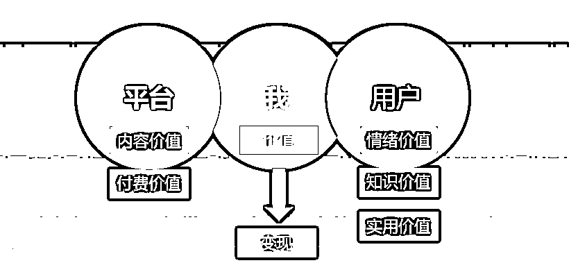

### 02.**书中提到的变现闭环是什么？**

小红书只解决你的流量问题，你能变现多少取决于你的转化和交付，交易=流量+转化+交付，所以已有成熟生意的人可以直接来做小红书，比如我们团队做的很多的客户都是旅游业的，没有现成的生意，就需要思考你在小红书到底卖什么。

### 03.**什么是流量效率、转化效率、交付效率？**

交易=流量+转化+交付。

流量效率高，不代表转化和交付效率高，我们看整体的交易效率是需要看 3 个环节的效率，所以任何一个我们参与的项目，首先会帮助评估生意模型和在小红书变现的可能性。

### 04.**流量重要还是粉丝数重要？**

看目的，基于私域变现为目的地账号是引流微信最重要，引流私域的玩法却不需要多高的粉丝数，甚至是多么亮眼的笔记数据，只要吸引到精准的用户即可。

流量虽好，我要生意。

### 05.**如何理解书的封面：基于成交做流量，不做爆款做生意？**

流量不一定能变现，小红书的很多流量只是短暂的热闹，要把流量拆细了看，哪些是有价值的可变现的流量，这样来反推账号的定位和内容。

### 06.**小红书的变现方式到底有哪几种，我该如何选择？**

私域变现：适合高客单价高毛利。

电商变现适合已有成熟生意。

广告变现：适合特定领域的个人。

### 07.**制作爆款的技巧**

**爆款都是重复的**火过的东西代表了需求，一定会再火，其他平台火过的内容放在小红书大概率会火，视频/文字火过的东西换成图文会再火。

### 08.如何理解书里**提到的流量-粉丝-客户？**

笔记的流量不一定关注了，关注了不一定下单了，从变现的角度出发，你最终需要的是能够付费的客户，流量和粉丝都是手段。

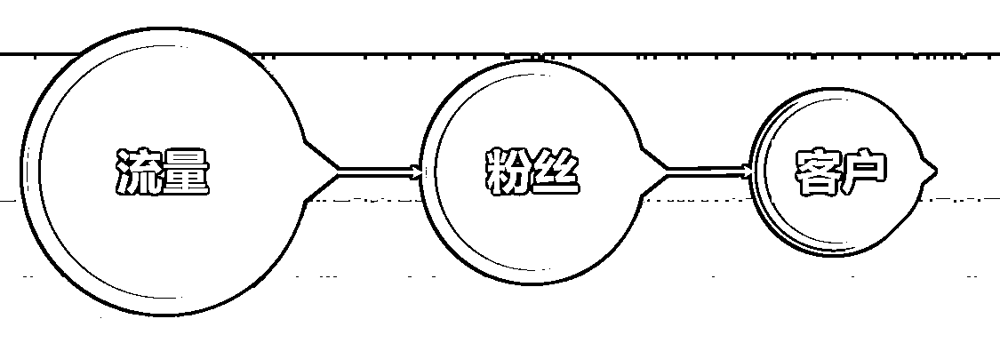

### 09.**定位的基础原则是什么？**

真实、垂直、直接、信任，在小红书，"做个人“，只有真实才带来运营的低成本和转化的低成本。

### 10.**如何完成定位？**

赛道选择：喜欢擅长离钱近，有变现闭环。

人设选择：真实有价值

总结：你面对**群体，帮助解决**问题，最终变现多少钱。

### 11.新账号的运营**是否需要养号？**

需要适当的养号，模拟一个真实用户的使用行为，一般每个账号养了 7 天，每天利用碎片化时间即可。

我的新书中有完整的养号流程。

### 12.**如何引流，是否有没风险的引流？**

只要是引流都是会有风险的，最好的做法是做好定位，不需要很多流量，减少引流数量，但是流量的质量和转化都是很高的。

其次，提供给平台和用户价值，比如生产好内容，吸引对的人群。

最后，免费流量+付费流量结合。

### 13.**如何查看笔记笔记是否限流？**

看阅读量是否正常，搜索结果是否收录、薯条是否额可以正常投放。

### 14.**小红书平台的流量结构是什么？**

小红书平台有两个最核心的流量来源：【推荐流量】＋【搜索流量】 ，其中搜索流量占比 60%。

### 15.**如何获得推荐流量？**

系统会根据你笔记的初始点赞、收藏、评论、转发分享、转粉数据来打分，评论、转发和转粉这三个的分数占比较高。

CES 评分二点赞数 x 1 分 ＋收藏数× 1 分＋评论数 x 4 分＋转发数 x4 分＋ 关注数× 8 分

PS：CES 为小红书的内部评分体系。

### 16.**如何获得搜索流量？**

要想获得搜索流量，首先你的笔记要包含有效关键词，且被系统成功收录；

要想搜索结果排名靠前，你的账号权重和笔记权重要持续提升**。**

### 17.**是先有流量再变现还是先有变现闭环再做流量？**

是先变现再做号，大部分人搞反了。

### 18.**小红书有哪些热门赛道？**

家居家装、母婴．美食、运动健身、知识学习、旅游出行、绘画摄影手工、萌宠.…这些都是新兴热门板块，流量并不少。

### 19.**普通人如何做好一个小红书号，并获得变现？**

离不开好“内容”，你可以分享真实的自己，越接地气越好，但它不是微博也不是朋友圈。即便分享真实生活，它对**内容也是会筛选的，同时被平台和用户认可的内容才有出圈机会。**

### 20.**做好一个变现账号的精力分配，应该是怎样？**

40% 的精力要放在定位上，其次才是选题、内容、引流，定位决定了变现规模，定位决定了变现周期。我在书中给出了详细的精力分配的占比。

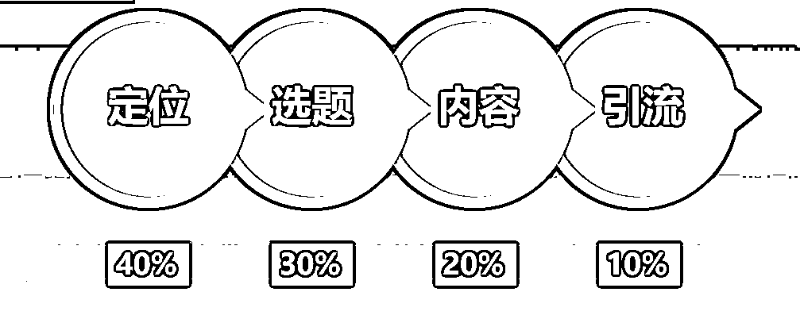

### 21.**人设账号的核心是什么？**

内容里需要注入自己的人设，粉丝喜欢的不仅仅是内容，而是你这个人，喜欢内容仅仅带来点赞收藏，喜欢你这个人才带来关注和下单。

### 22.**如何对标账号 ？**

看对标要留意粉丝级别，不要太少也不要太多，尽量选近期涨粉快的，或者起号迅速的，学些可以学习的，不要找离自己太远的。

除了对标已有的内容和粉丝级别，还要看到对方的内容流程及变现路径，即对方是怎么做内容的，对方是怎么变现的。

### 23.**如何做好账号的选题规划？**

我给出以下几种方法：

以热门笔记中挖掘选题

通过搜索关键词挖掘选题

在用户反馈中挖掘选题

在笔记灵感中挖掘选题

通过对标账号挖掘选题

结合自身经验，分享千货

重复做已有爆款的选题

### 24.**笔记封面的制作要点是什么？**

封面要点：提供打开理由（好看 吸引人 提示内容 提供预期 提供阅读回报）。

通常来说，封面需要具备以下 3 种特质： 1\. 差异性：要和相同的封面区别开来，更吸引目光 2\. 内容提示：提供打开理由 有点兼顾标题的作用 3\. 兼具美感：旅行本身需要兼具设计和美感，提高吸引力

### 25.**如何取好小红书标题：**

小红书账号标题是 20 个字，最好的方法是结合大关键词+小关键词，或者罗列出所在领域中，关键词排名前 10 的 爆款标题记录提取，然后组合成新的标题。

可以将「推荐、知识、分享、如何、搭配、新手、怎么做、必备、教程、技巧、步骤」等关键词灵活组合使用，放进标题中。

### 26.**笔记正文的写作公式是什么？**

笔记正文有很多种写法，基于变现目的的常见的一种有痛点引入＋情景描述＋人设＋方法介绍＋点赞诱导。

### **27.博主前期缺少合作商家，怎么办？**

做博主的话前期都是置换比较多，可能会有少量的广告费，建议前期的话如果遇到一些不错的置换合作，是可以尝试接的，这样也可以锻炼对接、合作的能力，积累经验和案例。

### **28.小红书开店铺会让笔记流量变少吗？**

不会，没有直接的关联，店铺是小红书的长期趋势，可以和笔记结合，迎合平台的长期发展。

### **29.你会觉得小红书账号难以变现的核心原因是什么？**

无明确定位、无内容流程，无交易闭环。

### **30.可以找人点赞刷赞吗？**

不建议，会混乱标签。

### **31.什么是 CAC/CPE？**

CAC：Customer Acquisition Cost，用户获取成本。

CPE：Cost Per Engagement，单次互动的成本 = 费用 / 总互动， 总互动的值越高，一定程度上说明账号的粉丝活跃度及黏性都 越好，单次互动的成本越低，说明效果越好。

### **31.你在书中搜索流量的环节反复提到：SEO，到底应该怎么理解？**

SEO：Search Engine Optimization，搜索引擎优化，通过分析 搜索引擎的排名规律，了解各种搜索引擎怎样进行搜索、怎样 抓取互联网页面、怎样确定特定关键词的搜索结果排名技术。

你可以简单理解为：小红书就是很多女生的百度。

### **32.什么是笔记商业指数？**

这是从变现角度来讲的，因为我是讲变现的。

书中对小红书的价值理念都是“基于成交做流量，不做爆款做生意”，所以每个运营动作都对应商业目的，所以给出了笔记商业指数的衡量，即：针对笔记的效果（互动贡献、主页到达贡献、 私信贡献、信任贡献）。

### **33.新手新账号现在真的还有机会吗？**

新手 0 粉丝在小红书完全有机会，已经有无数个小红书账号 0 粉丝 出爆款，免费拿到精准流量实现变现，基于变现目的的小红书笔记运营， 本质是一个流量承接游戏。

### **34.一天发几篇笔记合适？**

账号需要权重，需要告诉算法这个账号是活跃的，早期可以每天一 篇笔记增加权重，两天一篇也可以，总之不能断更，也不要一天太多， 避免营销嫌疑。

### **35.笔记数据不好要删除吗？**

不要删除，发出的笔记尽量不要来回改，会影响流量推送， 频繁修 改也在告诉系统这个账号的内容和更新不稳定，删除对系统是负反馈。 这也提醒我们质量比数量重要，宁要一篇爆款笔记，不要百篇平庸的笔 记。发之前想清楚目的和逻辑，笔记数据实在不好，可以隐藏起来自己看。

### **36.看到同行的笔记出现了爆款，怎么办？可以直接抄吗？**

分析优质爆款为什么爆，提炼爆款的要素和框架，抄袭只能获得 一篇笔记的成功，学习才能带来可复制的成功，不只看爆款，更要看到 爆款背后成功的原因是什么。 同行爆款笔记提供了很好的案例参考，对爆款笔记的分析，要看关 键词的选择、标题、封面、内容结构、脚本节奏、粉丝的互动方式、引 流方式等。

### **37.你提到笔记原创，我原创了很多，还是没有流量？**

新手先模仿再创新，模仿可以解决 70% 的问题，在理解逻辑的基础上 再做创新。

### **38.如何理解小红书运营变现这件事？**

开始之前清楚平台的运营逻辑，要想好运营目的，怎么写是战术，写什么是战略，目的出发、结果导向，中间填充的是方式和方法，否则容易越做越迷茫，浪费了时间。

### **39.账号一定要涨粉吗？**

要看情况，先问目的。

即你运营这个账号是为了什么?

如果你的账号是变现的话，连接就能交易，让流量与成交同时发生，从第一个粉丝开始挣钱。

如果你的账号是人设号的的话，需要一定的粉丝基数，增加影响力。

### **40.做个人博主的核心是什么？**

术的层面是技巧，道的层面的是做个真实的人。

### **41.书中提到的流量之道和流量之术，怎么更好地理解？**

术的层面是关注引流、微信、私域，定位、选题、标题、笔记，其实这些都是末端。

道的层面是基于目的的推演，给到用户的价值，面对用户的需求。

我更喜欢追求流量之道，因为内容都是变现形式。

### **42.你怎么理解小红书的运营（营销）甚至变现的行为？**

就理解为每篇笔记都是你的传单，你写笔记就在发传单， 你仍然要思考，你发给谁，他为什么看，看了多久，看完会不会找你。

### **43.为什么我笔记有爆款但是不涨粉？**

笔记有内容价值，但无账号价值，没有体现人设、定位、价值观、持续价值，但是用户看不出持续关注的理解，

### 44.你在书中提到的互动指数是指什么？

笔记带给用户的行为（点赞、收藏、关注、转发…）的衡量，CES 评分 = 点赞数 x 1 分 + 收藏数 x 1 分 + 评论数 x 4 分 + 转发数 x 4 分 + 关注数 x 8 分

### 45.小红书笔记的发布时间什么时候好？

没有完全统一的标准答案，因为不同笔记的目标人群不同，核心原则是在你的目标用户手机阅读时间之前，比如周末游笔记，周三周四晚上 9:00-11:00 是浏览决策时间，那你在此之前 1 小时就好。

### 46.表现不好的笔记，要不要删除？

不要删除，尽量发出的笔记不要来回改，影响推送， 这也告诉我们质量比数量重要，宁要一篇爆款不要百篇平庸，发之前想清楚目的和逻辑。

实在不行可以隐藏自己看。

### 47.如何吸引笔记点击？

首先你得被看到，被看到是流量的事，点击率流量看到以后的竞争，一篇笔记的 4 个要素：封面图、账号昵称、标题、点赞数，可以看前面账号篇和结构篇的具体运营步骤。

### 48.多久发布一次笔记？

账号需要权重，需要告诉算法是活跃的，早期可以每天一条笔记增加权重，两天一条都可以，不能周断更，也不要一天太多，营销嫌疑。

### 49.为什么要做爆款？数量不重要吗？

爆款是没有时效性的，只要你的排名很靠前，不管多久以前的笔记都能被用户搜索看到，用户就可以持续因为这个爆文而点开你的主页，而且他们还是精准的用户，那就可以持续不断的为你引流，而且只要你的内容水平持续稳定，转化成粉丝的概率都是不低的。

没有质量的数量，没用。

### 50.0 粉丝可以做小红书吗？

当然，我们是从注册开始讲运营，长尾、依靠算法 0 粉丝也能爆、可以免费拿到精准流量。

定位卡准了、流量接住了，就是看一个账号可以接住多少流量，30%，10%，本质是一个流量游戏

### 51.如何让笔记的数据更好？

选题+占词

其次是账号权重+笔记权重

一篇笔记的首次展现决定打开的要素有哪些：封面图（60%）+标题（20%）+昵称（5%）+点赞数（15%）

### 52.什么是排名结果？

笔记排名关乎生死，大部分流量来自搜索，笔记排名就是你出现在用户的搜索结果的位置，是否在首屏，逻辑等同于 SEO、ASO。

为什么排第一第二背后是数字结果，也就是权重，排在前面就是分值高，其中有账号权重和笔记权重。

### 53.如何理解爆款的价值？

当用户想买点啥、或者犹豫去哪儿，他会先用百度或其他引擎搜索某个关键词了解。搜索结果里，排名越靠前的笔记，越容易带来用户消费转化,因此，做好搜索优化，就相当于打了强效广告，利用好小红书就是免费的搜索广告。

通过小红书的搜索来收集精准的消费需求，对旅行行业来说，就是收集精准流量。

只要有 1 篇笔记搜索排名持续靠前，几乎就能带来超强的推广引流效果，而且是超低成本甚至接近免费的。

### 54.怎么更通俗地理解小红书？

通常遇到问题，大家会“百度一下”。

20-30 岁的爱美爱消费的女性用户旅行前也喜欢“小红书一下”。

百度出来的前几个结果，意味着影响决定消费决策，对应有 SEM、SEO。

用户在小红书上搜索到的结果也意味被咨询、私信、成交。

小红书其实就是旅游业的百度优化，每个笔记就是百度上官网，笔记优化就是 SEO。

### 55.决定做小红书第一步应该是什么呢？

任何事情的开始，都离不开研究，先研究同行账号的爆款笔记火的逻辑以及变现笔记的特点和价值规模，再看这个领域的关键词地图。

拆解“赚钱笔记”：分析爆款不是看“热闹的爆款”要看这个热闹的爆款能不能成交，也就是找哪些热闹的能成交的爆款，怎么识别？看评论区是不是怎么预定？哪里买？这些指向性非常高的笔记，要对这样的笔记拆解。这种笔记的特点是评论和赞已基本 1:1，而不是都是收藏和赞，不评论或评论内容不指向购买。

拆解爆款赚钱笔记和关键词收集是第一步。

### 56.针对个人博主的笔记制作来说，你有什么建议？

原则：内容要真诚分享，排版要易于阅读，阅读节奏要轻松愉快，不费力的阅读，好的内容因为阅读起来费力而不看是可惜的，多一些表情和金句，给人”轻松获得密级攻略、省事可用的爽感”，也觉得你这个人有价值，提升阅读体验的同时，让用户方便的 GET 到重点。

### 57.你在书中提到的笔记的独立性，怎么理解？

并不需要所有笔记都要带货，不是所有笔记都需要有好的曝光，笔记的目的很重要。

### 58.小红书的流量是玄学吗？

我可以非常负责任地说，小红书的流量不是玄学，每一个运营成功的账号背后都有着可被总结的底层逻辑和运营方法，你的小红书账号没有做起来，很重要的原因是缺少逻辑和体系。

### 59.你反复提到小红书上的供需连接，在书的封面也有这句话，为什么？

商业的本质是价值交换，交换的前提是供需连接，基于这点来看，小红书不再是目的而是连接手段。

### 60.你在复旦的流量思维课，还可以看吗？和小红书有什么关联。

是线下课，讲完就结束了，暂时线上没有了，以后线下课有机会再讲讲。

准备这次课件内容的时候， 我正好运营了很多小红书的项目，不断整理后发现有很多想要梳理的，于是有了这本书。

小红书、抖音、视频号都是流量的表现形式，基于流量本质的思考是非常有意思的地方，其实会做一个平台的人，真的厉害的话，是会做多个平台的。

终有一天，你面对所有的流量形式，都会感受通透。

### 61.书的名字是变现？你觉得为什么很多运营小红书的人，没有变现？

小红书变现需要解决的不是简单的流量问题，而是基于交易变现的商业路径构建问题。

流量只解决流量的部分，变现需要解决的是交易链条的部分，小红书无法变现，可能不是不懂小红书，而是不懂生意。

### 62.这本书的很多流量理解和运营方法确实独到，你自己也有小红书的生意，为什么愿意公开分享出来呢？

很多生意是没有核心秘密的，其实很多方法分享出来也只有一部分本该懂本该会的人才会掌握，所以其实没什么核心。

我已经写过一本书了，写书是我们这种普通人回报社会的一种方式，另外对自己也是一种阶段性的记录，写完了，就记录了，也就留下了。

算是给每年的时间一个交代吧。

### 63.市场上代运营和代投放的很多，如何选择、如何识别？

代运营的模式从运营方来说要有选择的去做，因为代运营本身不是个好模式，我们即刻下单团队只接有付费能力大客户。

如何识别主要是核算成本和查看对方的案例，好的运营团队一定是有拿的出手的案例的。

投放行为本身是花钱买时间、节省过程，从阶段上来说，现在很多品类的付费流量还是很便宜的。

一般好的投放团队会侧重你的产品和笔记本身来优化，特别想了解你的业务本身，有些代投放团队侧重消耗你的预算，其实也很好判断的，你就看对方是不是真的想帮你做好这件事。

### 64.运营者应该如何看待投放（花钱）行为？

平台的发展会经历几个不同阶段，早期一般是野蛮生长的，这时候可以拿到很多免费的流量，我们就经历了这个阶段，但是是否能够做大要看规范期的流程和效率。

目前小红书已经进入了规范期，就不能再用野蛮生长期的打法，所以顺应平台规则，帮助平台赚到钱，你的生意才能持久。

免费+付费是不得不走的路，符合平台利益，符合发展周期。

花钱背后的本质还是流量利用效率，花钱的目的是为了更好的赚钱。

### 65.如何引流才安全？

没有绝对安全的。

运营动作：小号置顶、小红书号做微信、群聊、签名、字母改写、评论谐音，背景图。

付费动作：聚光投流。

### 66.书中提到的很多案例，好像更偏向于私域变现？你对小红书的理解也是这样吗？

私域是一切流量的终点，这句话有些绝对，但是是很多行业最好的变现方式。

小红书的变现当然不只私域，当然最重要的还是要根据自己的资源禀赋来选择适合的变现方式。

### 67.如果我学会了小红书，但是缺少变现闭环，你推荐的变现方式/路径吗？

学会了小红书，你指的是学会了获得流量。

但是离变现缺少转化和交付的闭环。

在《小红书变现实操课》里，有为大家整理和提供来自旅游、电商、知识服务等多维度的变现案例和对接渠道。

### 68.你觉得很多人学习小红书或者在做的过程中最大误区是什么？

不知道为什么学，或者是对这个事情的思考和理解不清晰的。

甚至很多写书的作者也不清晰，因为你看市面上很多教小红书的书籍和客户，都是在说如何运营，都在说如何做爆款。

但是运营真的是目的吗？

运营还是手段，学习一个技能最重要的是解决问题，大家需要的是变现。

### 69.如何理解变现呢？

变现的理解不能太狭义。

变现不一定是直接的钱，你可以把变现理解为一种价值收获，就是你通过小红书获得了价值，比如说个人品牌，有人通过小红书了解到你，邀请你去分享、讲课这也是一种价值，有人给你置换了实物商品，这也是一种变现。

我带过一些素人，通过小红书开始有免费的旅行几机会了，这也是变现。

所以变现的形式有很多。

除了变现形式还有变现规模的理解，我觉得每个人都变现的预期是不一样的，有的人一个月赚 1000，就够了，有的人希望通过小红书每月至少赚 1 万，如果你是企业的话，你一年下来的交易金额应该得有千万，现在找我们服务的很多行业都是的，因为对企业来说，少了千万的交易额，你很难拿到比较规模的变现。

### 70.通过最近的小红书 will 商业大会，你会感觉到小红书的有什么新的变化吗?

1.要想种好草，必须围绕真实的人去理解，在目标消费者所生活的场景中寻找自己的生意机会。

2.小红书的社区运行核心在于人，沉淀的内容不是客观信息的归纳总结，也不是知识，而是基于个人真实的体验分享。

### 71.你在书中一直讲到流量的理解，并且提到了很多维度，可以具体说说吗？

流量只是交易中的一环，要把流量拆细了看，要看这个流量的类型、属性、是否带着需求，交易效率是否高....

笔记的目的是连接，但是连接以后触发的用户的什么行为也很重要。

### 72.你觉得 2024 年做小红书，需要注意些什么？

别用流量思维来做小红书，不少商家还停留用流量思维模式来做小红书，其中典型的现象就是，以笔记获得小眼睛（浏览量）和点赞、评论来做为运营效果的评估指标。

在过去 10 年的互联网流量红利期，我们习惯了通过获取更多流量来获得增长，之于那时的流量增速来说，抢流量比精耕细作更划算。而如今互联网流量见顶，大水漫灌式的流量获取思路，显然已无法满足对增长与利润兼得的诉求。

想要在有限的预算里，既获得有效的销售成交，又能兼顾长期的品牌价值。我们需要开始从流量思维向用户思维转变，从找流量到找人。

### 73.一个新品牌在小红书的营销路径应该是什么？

小红书种草，全域成交。我们做过一些服饰类的品牌，最终发现还是到店（京东、淘宝）、线下门店会好一些。

但是触发，还在小红书上。

### 74.小红书有给过你什么惊喜或意外吗？

今年我们帮助一家旅游公司做运营服务，成交了 6 万、8 万、10 万的订单，让我一下子感受的流量的优质，并且 2023 年一直这么做过来。

2022 年我更多的感受是小红书的流量数量很大，成本便宜，但是 2023 年，流量的质量也让我惊喜。

所以我们即刻下单也在寻找高毛利的合作项目。

### 75.目前小红书最适合一些品类是什么？

过去：小红书可能是最关注“小众”、“细分”的社媒平台，是小众的、稀缺的、极具调性的、中高客单价的品牌商家成长洼地，比如寻找丢失宠物服务、小众设计师品牌等！

现在：很多生意都值得在小红书重新做一遍。

### 76.那什么行业/产品/品类更适合经营小红书？

还是逻辑的变化，过去的小红书是小众的，今天的小红书是大众的。

品牌生意应该来适应小红书，不同的产品/品类需要思考如何找到属于自己的小红书经营逻辑，如何在小红书上正确地经营如何找到精细用户的精细需求、精细场景进行切入。

### 77.这本书的很多读者，可能正在准备开始做小红书，如果给他们一个建议，会是什么？

80%的问题都是认知问题，剩下的 20%才是执行问题，在小红书的运营甚至整个互联网运营上都不一定是干了再说。

你在看我的书和我的课程中也能感受到思考的价值。

### 78.现在小红书铺量的打法还有效吗？你们做过吗？

2023 年一些品牌找过来的时候，我们做过，有效果，但是过程挺难得，非常考验执行团队对小红书规则的了解和应变，最终这个项目结束的时候，合作效果非常不错对方很满意，但是我自己投入了大量的精力，这个时间节点是 2023 年初，现在更难了。

当前的结论和判断是：铺量是可以的，但是很多人理解的铺量是粗暴的复制，堆叠劣质内容，这是不符合小红书的利益和长期价值的。

### 79.小红书笔记关联商品会被限流吗？

我们的经验来看，基本不会，运营结果上感觉笔记关联商品后数据更差，是因为商品笔记和内容笔记的流量机制不一样，商品笔记会考虑商品的转化率。比如点击、下单等。

规则上来说，商品笔记可能会有阶段性的流量扶持。

所以商品笔记不要随便挂，你要想挂的目的是不是为了转化，不然会拉低整体效果。

所以，每一步运营动作之前，先问目的很重要。

### 80.如果做个人 IP 定位的话，需要如何打造？

小红书是放大器，放大的前提是值得放大，又回到了你是谁，你有什么价值的问题。

先要保证自己有东西，且能给别人带来价值。

IP 定位上有几个原则：专业、权威、可信赖。

专业：资质 证书 头衔

权威：影响力 口碑

可信赖：过往评价

### 81.我应该做推荐流量还是搜索流量？

这不是二选一的关系，都很重要，都要做，推荐与搜索相互独立又有着联系。

### 82.如果我不会内容，团队也缺少运营经验，但是想做小红书，怎么办？

付费。

无论是付费给小红书投流还是付费给第三方（咨询、培训、陪跑、代运营）都是在补短板。

你听完我的视频课程应该清楚，现在是小红书的什么阶段，每个阶段都有每个阶段适合的方法。

不做或少做投入，又想通过小红书获得较大变现，2024 年已经不现实了。

如果项目商业价值比较大， 也欢迎联系我们即刻下单的团队。

### 83.在做一个小红书账号的时候，什么时候原创？该不该原创？以及该不该模仿（抄袭）呢？

我的理解是所有的运营行为都是手段，从目的上来说是希望尽快有运营效果。

我更建议在一个账号的运营初期或一个人接触小红书的初期，应该大量的模仿和借鉴， 因为这会减少摸索的时间。

原创当然是好的， 但是在账号还没成型，自身的额运营经验和理解还不成熟的时候，原创的失败概率很大。

所以先用模仿拿到正反馈，后期账号运营进入正规和自身对小红书比较有理解的时候，再开始原创，成功率会大很多。

所以你在账号运营初期，要适当放弃对原创的坚持。

### 84.小红书有哪些细分类目？为什么你说小众需求在小红书上也不能忽视。

当一个平台渐渐大到国民级应用的时候，小众也开始变得大众起来。

官方给出的有 29 个一级类目和 107 个二级类目。

关于判断需求的方式，我在课程里有提到需供比的判断方式。

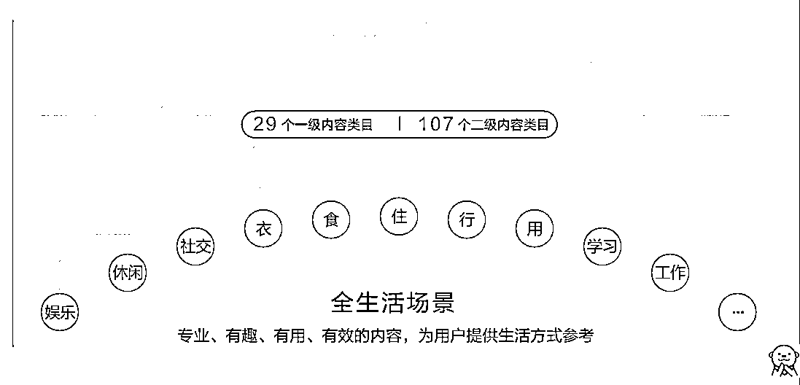

再补充一下，2024 小红书 will 商业大会发布的 20 种生活方式。

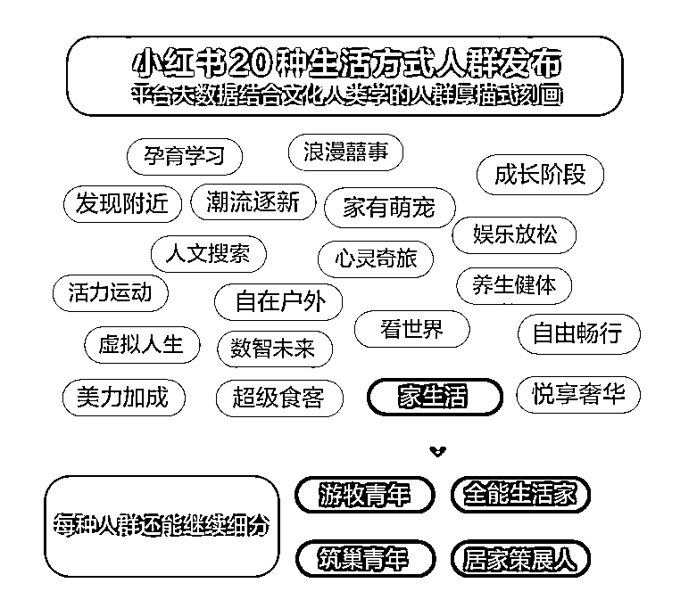

### 85.什么是小红书的 KFS？

指的是小红书平台不同维度的营销方式，K：KOL，F：FEEDS，L: SEARCH。

K 是通过内容引导话题传播，F 是通过投放触达放量，S 是搜索属性的转化卡位，

一个消费类平台很适合通过这 3 个维度的布局，抢占用户心智和消费习惯，我们做的服饰类品牌就用的这种打法，让用户从认识-认知-认可-认购。

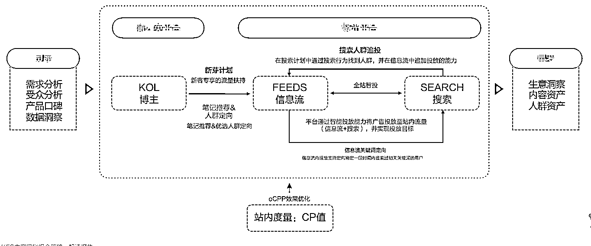

### 86.一个新消费品牌如何在小红书做推广？

以最终下单为目的的话，我给出一个团队我们给品牌方做过的案例的部分过程，总结来说，就是步步为营的引导交易。

暂时无法在飞书文档外展示此内容

### 87.你们在给品牌方做辅导或者运营的时候，过程和结果是如何展开的？

品牌曝光为目的的爆款笔记：以赞藏评为衡量指标 如单篇赞藏超过 500，爆款率：3%

直接交易为目的的爆款笔记：如问价关键词的咨询回复超过 50,爆款率预估：5%

私信咨询数=笔记数*私信率

交易量=私信咨询数*到店率*店铺转化率=笔记数*私信率*到店率*店铺转化率

加微数=笔记数*私信率*加微率

### 88.你在变现实操课里提到，笔记的制作应该 SOP 化，是什么意思?

小红书的运营不能脚踩西瓜皮，滑到哪里算哪里，不能边做边看， 要有预期地发生。

所以真实的运营过程也不应该是每天想选题的，而是一开始就规划了，对于业务操盘手来说，相当于你搭建了一条业务生产线，运营流程就是生产线上的环节。

### 89.低粉爆文为什么更值得重视和关注？

首先是低粉爆文的定义：粉丝数低于 5000，并且点赞量高于 500 的笔记，我们定义为低粉爆文。

低粉爆文值得关注的原因是因为很好地解释了小红书对普通人有机会，相对友好，不会像其他平台一样，早期入局者占据了流量地位。

怎么做呢？发布时间、发布形式、内容属性、内容生态。

笔记与笔记相互独立的属性也更使得，每一篇笔记都是机会。

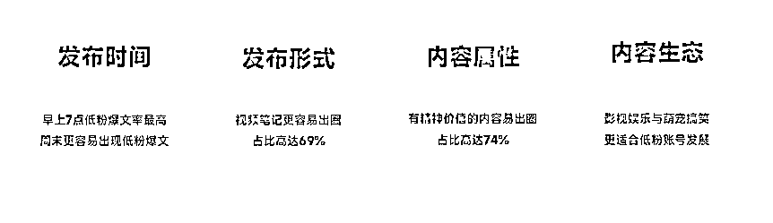

### 90.小红书付费广告的运行机制是什么？

和很多的互联网广告一样，都是 CPC 广告竞价逻辑，大致的流程如下：

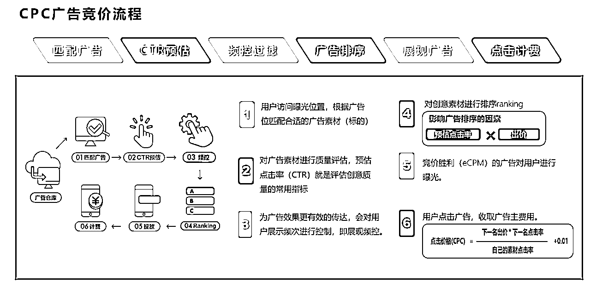

### 91.如何开通广告和搭建计划？

先是认证为企业号，再开通推广资质认证。[`ad.xiaohongshu.com/`](https://ad.xiaohongshu.com)

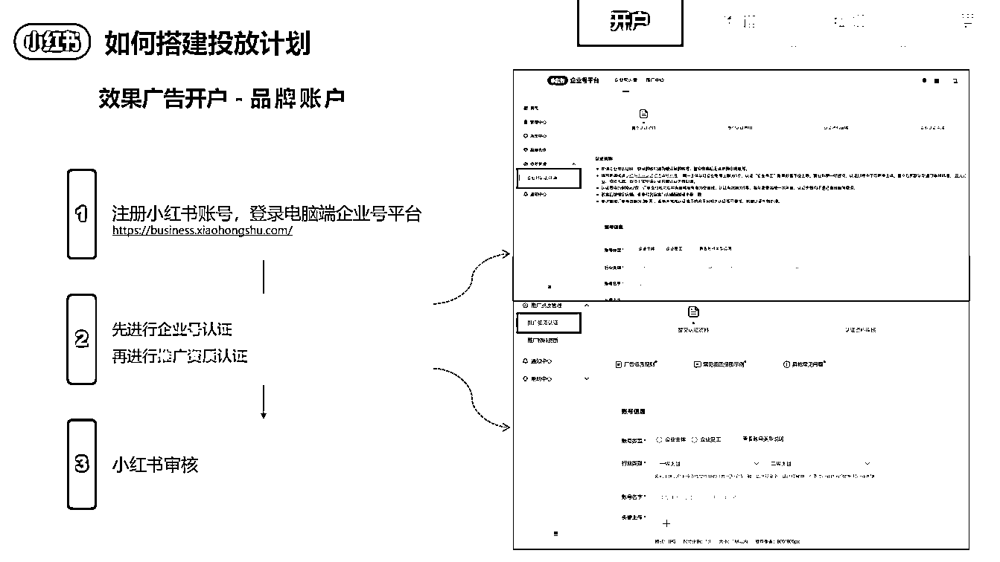

搭建广告计划：

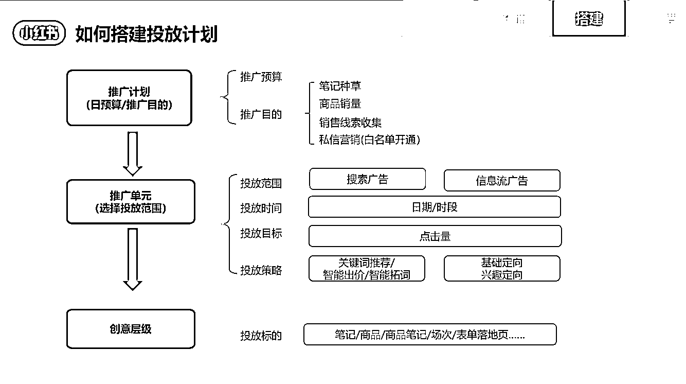

### 92.展开解释一下爆款的流量池规则以及爆款价值的解读

首先是**爆款是有预兆**的，当笔记在发布后小眼睛在一个小时左右能快速达到 500 并且伴随 8 个左右的问价，出现这个现象后，笔记大概率会成为大爆款（前提是图片必须高清，而且重复率和相似度率在流量池中要）。

其次是**小红书对爆款的管制**问题，当小眼睛超过 1 万的时候，可以明显感觉到小红书会再次审核笔记，而且比较严格，同时会根据你的账号资质判断这篇笔记是不是你应该发布的内容。如果没达到要求就会开始对笔记进行限流。比如有些笔记，是没有违规内容的，但有一定的营销性质，系统给出的违规原因是笔记内容超过了营销的资质范围，就开始限流。

我不是否定爆款，我之前说爆款不一定能带来直接体现的交易，但是对于账号的长期价值也是有的， 比如涨粉。所以你看短期还是长期，结合目的很重要。

**对爆款的深度认知：爆款笔记涨粉比成交的作用更大。**

**原因如下：**爆款笔记带来**粉丝量的增长是肉眼可见的效果**，而评论区的问价虽然很多，但泛流量居大成，筛下去很多，转微率降低至 17.06%，也并不会引来大量的成交。

### 93. **什么是私信通？**

「私信通」是专为小红书商业化客户提供的一站式线索经营平台，提供欢迎语、自动回复、留资组件、多客服分线、私信触达意向评论、客资自动识别抓取等产品能力，帮助企业降低人工成本，提高销售转化，全面提升在小红书的线索营销及经营效率！

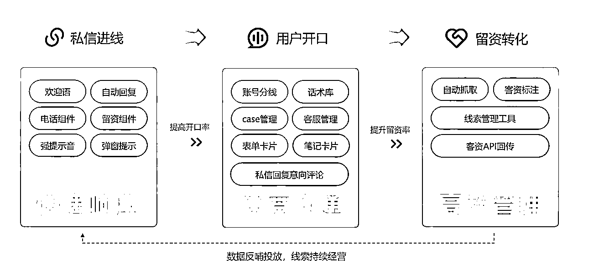

举例：

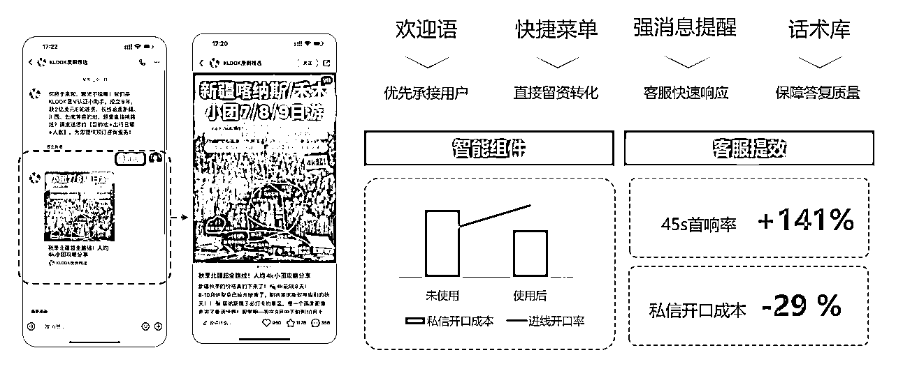

### 94.在私域高客单的类目运营中，对于客户跟进状态有哪些分类？

1.  跟进中——已跟用户展开沟通，待持续跟进获取客资
2.  留客资——用户已留客资（手机号/微信号等）
3.  高潜成交——用户已留客资，且明确表明购买意向
4.  成单——用户已留客资，并已完成预定/购买
5.  无意向——用户表明无意向成单/回拨后发现是无效客资

### 95.在小红书如果我走付费玩法，该怎么思考和操作。

如果你的收益 LTV 大于成本 CAC，那付费就是最省力的做法。

小红书客资获取玩法-适合客单价高的服务类商家，当然要找那些本身自然流量跑的就很好的笔记，具体操作流程：

1.笔记准备：一篇笔记投流具有不确定性，准备 3-5 篇笔记，这样更容易出效果

2.信息流-测试：信息流-做人群定向，相同人群定向跑 3 天，哪篇数据端反馈最真实，作为种子笔记

3.信息流-优化：优化调整，点击率，以互动为目标-信息流，看数据反馈

4.信息流-收获：立即咨询按钮，同步增加搜索词，跑客咨，报白私信投流

5.复盘：总结单个客资的获客成本 CAC 和 LTV

### **96.如何预测爆款和推动爆款？爆款潜质如何界定和识别？**

小红书笔记有一定的随机性，但还是符合运营逻辑的，在笔记发布之前有很多埋点比如关键词、封面、话题等，在笔记发布之后，也有很多需要干预的动作，建立敏感性很重要。

我们一般发现有运营潜质的笔记就应该进一步放大。

爆款潜质的定义，如果以笔记发布后 12 小时来看的话，符合以下特质的笔记大概率会爆：

点赞、阅读量、评论

笔记发后 12 小时内点赞量≥200；笔记发后 12 小时内阅读量≥5000；笔记发后 12 小时内评论量≥50；

即笔记发后 12 小时内赞阅比≥10%，爆款；

笔记发布后累计赞阅比≥5%，爆款；

阅读:点赞:评论=100：10：1，爆款；

达到以上数据后，基本上就可以投放薯条或者信息流验证内容了。

12 小时内的这些数据，说明这个笔记值得深度运营。

### **97.小红书的博主粉丝等级应该如何界定和划分？**

这只是个说法，目前较为普遍的理解为：

素人：粉丝量级在 1-1000 之间；

尾部达人：粉丝量级在 1000-1 万之间；

腰部达人：粉丝量级在 1 万至 10 万之间；

肩部达人：粉丝量级在 10 万至 50 万之间；

头部达人：粉丝量级在 50 万以上（注：非官方标准）

### **98.CPM、CPC、CPE 分别指什么？**

聚光 CPC：按点击计费（平均点击价格）

自然 CPC=笔记金额/笔记点击量

聚光 CPM：按千次展现计费（千次展现价格）

自然 CPM=【笔记金额/曝光量】*1000

CPE：单次互动成本，CPE=笔记金额/笔记互动量）

### **99.为什么同样的笔记内容在有的账号火有的账号不火，同时，我把以前的爆款笔记拿过来再发，发现没火？**

算法是固定规则，是机制，但结果不都是机制决定的。

影响结果的很重要的还是笔记的阅读者对笔记的反馈，即互动。

所以，互动是小红书的流量开关， 笔记没有互动，流量就没有流动。

爆文复发从概率上来说是有机会再火的，但是无法保证，你还要和用户的审美、小红书的查重抵抗。

### **100.泛流量是不是没用？**

只要是流量都有用， 要看你对应到什么目的。

我说的“基于成交做流量，不做爆款做生意”的背后都隐藏了一个前提：变现。

这样理解：“泛流量”虽然不精准，但自有它的价值所在。

其一是帮助账号抬升权重，不断用泛流量将账号的权重做起来，让账号在对应的领域内获得一个更加大的流量优势。

其二是助力品牌的扩大。

其三帮助训练网感，大流量能够更加快速的反馈网感的判断。

在这一时期做小红书的同事要关注自己对于所属领域内热点选题、流量风向、爆款封面的判断，尽快形成【判断-测试-放大】的流量思维。

许义：《小红书变现 7 堂课》《新旅游》作者 谱见文旅 CEO

* * *

评论区：

洋葱 : ...后戛然止

* * *