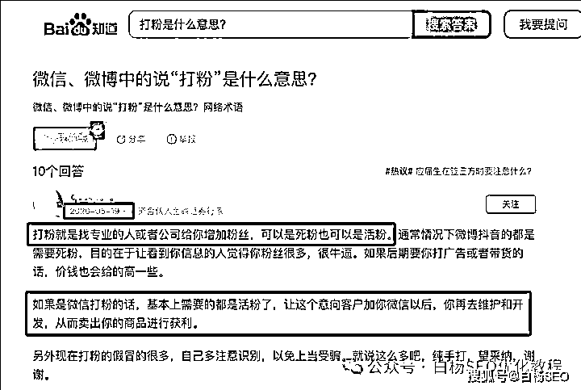
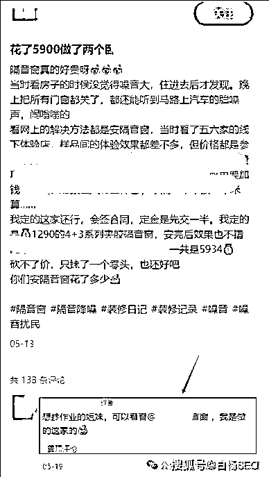
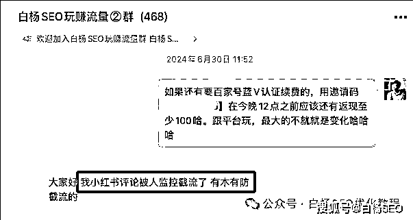
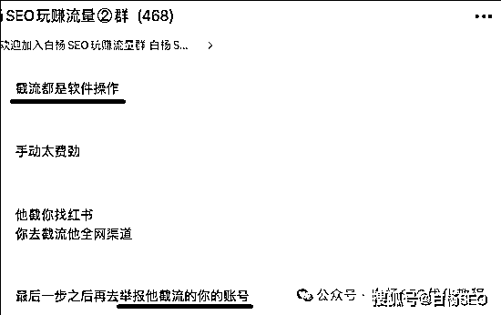
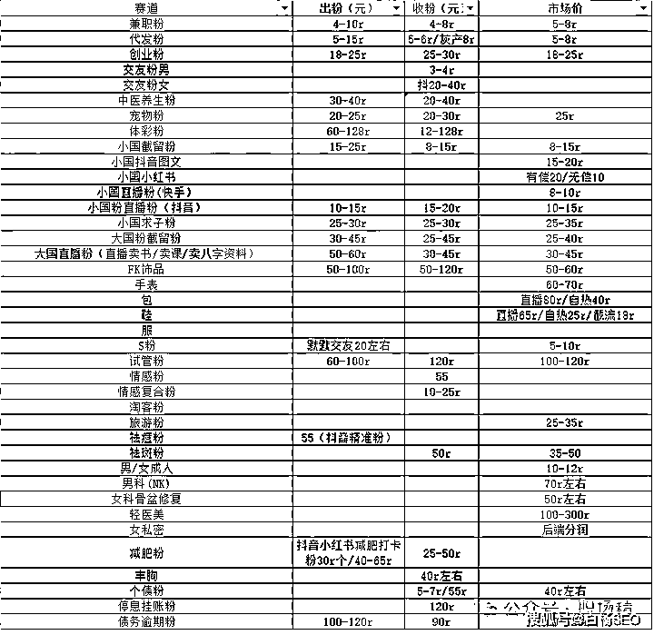
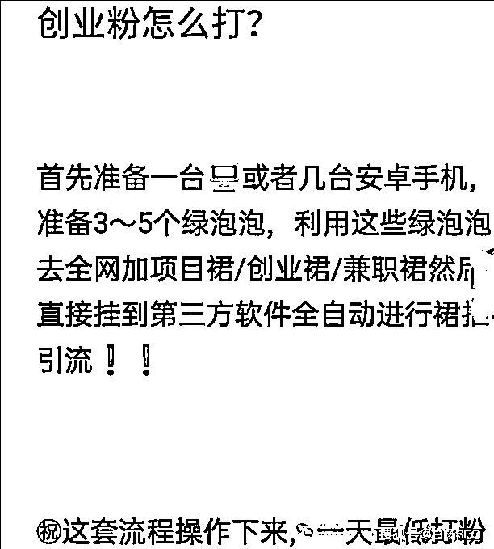
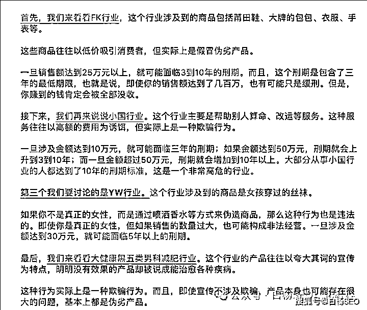
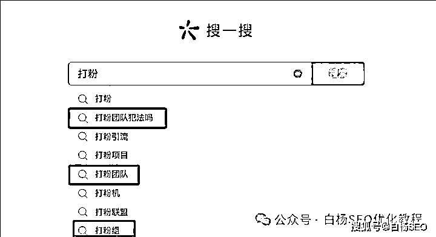
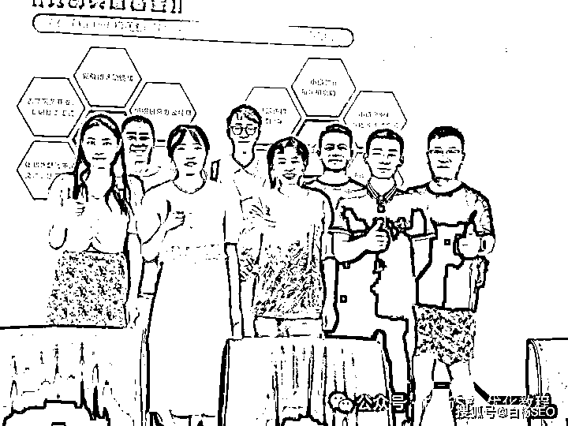
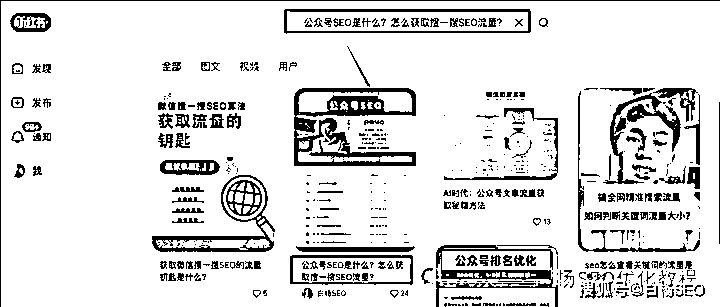

# 打粉是啥？打粉引流犯法吗？小红书代发效果好吗？怎么做更好？

> 原文：[`www.yuque.com/for_lazy/zhoubao/cb5pz6dsrrey7k57`](https://www.yuque.com/for_lazy/zhoubao/cb5pz6dsrrey7k57)

## (7 赞)打粉是啥？打粉引流犯法吗？小红书代发效果好吗？怎么做更好？

作者： 白杨 SEO

日期：2024-07-04

打粉是什么意思？

打粉这个词，有人说是 2024 年最火的一个词，也有人说是今年才出来的，如果你关注流量相关，常刷抖音，可能会刷到这个东东。

其实，打粉这个词并不是新造的词，早在四年前就有人在提问这个了，如图。

那时的打粉核心还停留在增加粉丝为主，主要平台还是在微博微信。而现在打粉呢，更多与私域流量联系在一起了，还有叫私域打粉。

简单理解，打粉跟引流是一个意思，但是跟正规引流又不一样。

引流是指任何产品或服务都需要推广，吸引精准的用户来购买自己的产品或服务。

打粉是指从各大新媒体平台（抖音，快手，小红书等），批量用发图文，短视频，甚至直播等形式曝光引流相应领域到微信私域里，按一个微信好友来算钱。这两年小红书非常火，所以很多团队打粉平台都在小红书上做。

引流这里是指引来流量，流量又分推荐流量与搜索流量，我们 SEO 里做的主要是精准的搜索流量。而打粉里大多做的是平台推荐流量，当然也有少部分人学会 SEO 批量方法搞。

打粉有哪些方法？

打粉主要有两种方法，引流与截流。

1、引流

主要用免费的手段为主，去各个平台发布图文或视频，通过自然流量上热门，或者学会 SEO 关键词布局批量账号批量作品搞流量，然后再包装主页实现导流。

他们这里还有一个词叫【A 种 B 收】，虽然白杨 SEO 也才听不久（落伍了），但和大号小号同理。简单理解，A 是可以发内容的号，B 是可以承接流量的号，就是找 A 去代发（这个要花钱，后面会讲到），然后去评论置顶@B 那个号，网上找了个图。

当然也有人放内在内容里@，甚至有些是建的小红书群之类等。

2、截流

首先说一下，白杨 SEO 非常反感这种做法。不管是打粉还是别的什么。

截流，简单理解就是去截取同行的流量。以前做 SEO 搜索，不管是百度还是微信上都有很多“李鬼”都干这种冒充截流的事，从道德角度来说，这和偷抢没有区别！

现在这个打粉截流又是怎么做的呢？就是通过去同行的作品或笔记评论里寻找有意向用户，想办法触达到意向用户，通过账号包装留下钩子，引导用户添加到微信，有一些人都是直接上软件来评论。

打粉一般怎么变现？

打粉主要变现也就两种方式，卖粉或者自己承接转化。

1、卖粉

如上图，外面流传出来的，业务越灰，这个粉价格越贵。但是你懂得，建议千万不要去做！另外私域打粉，引流及变现方式如下图，

基本现在很多打粉都是团队形式在做，你去看搜一搜下拉提问就知道了。

因为打粉卖粉这个周期短，见效快，所以很多团队都做这种。但这个除了没有持续收益，最大风险就是你不知道买粉的干什么，如果涉及违法犯罪，大概率你也跑不掉！

2、自己承接转化

如果是自己转化，那就需要稳定的后端产品之类，同时还要有很强的运营能力。变现周期虽然很长，但是有非常稳定的持续收益。

这种一般都不太敢做擦边违法的事，因为一旦事发，白干不说还要进去教育。另外在这里补充一个词【私域 IP】，很多人知道公域 IP（在公域打造个人 IP），其实很少有人知道私域 IP。

这个是白杨 SEO 六月杭州线下聚会老七分享的，这个跟自己承接转化有关，因为你要转化他就要产生信任，就要不断做好朋友圈运营和营销等。

放个上周六聚会图，这个是每个月白杨 SEO 圈线下聚会，哪个是我，你一眼能看到吧？哈哈哈。

打粉引流是违法犯罪吗？

对于很多新人，尤其外行，肯定会这么问，白杨 SEO 说一下自己理解，仅供参考和建议。

这个要分几种情况，

第一种，如果你是在自己公司从事的打粉组引流工作，你们自己公司有相应的产品服务，那么不是违法犯罪，要是也你们公司。

第二种，如果你是在一个打粉引流团队里从事这个工作，你们主要盈利模式是卖粉，但是业务基本都是正规的，这种相对没那么危险，不过白杨 SEO 还是建议你去第一种做，或者学正规的推广引流啥。

第三种，如果你是个人或团队负责，你的粉本身就是一些灰的领域，然后还卖粉，这种可以说就是走在违法犯罪边缘，只是这个有轻有重，这个还没被发现等，建议马上收手。

现在赚钱是不容易，但君子爱财，取之有道。你说我不想当君子，甚至我生活都不下去了之类。那又怎样，都不能成为干任何违法犯罪的理由。白杨 SEO 是有点理想化，但我还是希望至少能无愧良心，所以建议只供参考。

小红书代发是啥？

小红书代发是啥？就是字面意思。简单理解就是找人帮你发小红书笔记。当然这个帮你发是要花钱的，如果找的那种专门帮发的，也就 5-20 条，如果是找素人博主，KOC，甚至 KOL，那就从几百到几千不等。

为什么有一些公司需要小红书代发呢？因为每个公司都是账号有限，再加上想做营销，所以就会找兼职来代发哈。

小红书批量代发效果好吗？

上面提到白杨 SEO 圈六月杭州线下聚会，这次聚会主题是小红书上流量玩法交流（免费+付费）。

恰好就有一个白杨 SEO 付费群的朋友问了个问题，大概率是自己的业务在小红书一天发成百上千这种有效果吗？

我问了下，大概了解到他们这个是找专门代发的人再找人发的。这么一说我就知道大概率是专门做号发内容的，类似养了很多账号的“MCN 机构”。我说你这个帮你发小红书笔记的号不只是发你们的吧？肯定也会接别人的。如果是这样，你的笔记被小红书收录机率非常低，不知道有没有 10%！

不管你在小红书上做推荐流量还是搜索流量，小红书笔记被小红书收录是很基础很重要的一步，没有被收录，发再多有多少用？

啥，怎么算小红书收录？就是把你发的小红书全标题放在小红书里去搜索，如果在前十，尤其第一出现就代表收录了。举例如图，虽然是 PC 端，最后是在小红书 APP 上去搜。

我给了建议是如果要代发，可以去小红书官方蒲公英去找达人，也可以自己去搜索找一些素人，虽然辛苦一点，一天可能就发个十几篇，可能比你那个发几百几千条更有用。

我们自己在给这个内容时，标题内容等用户需求搜索关键词一定要布好，不同的素人最好都要改一下，不要发一模一样的。

关于小红书 SEO 标题关键词怎么写布局之类，可以看下这篇：白杨 SEO：小红书标题怎么写？如何引流到微信？违规注销不了怎么办？小红书运营 33 个热门问题解答【收藏】

今天就写到这，如果你觉得对你有帮助，可以继续关注我。

作者介绍：

白杨 SEO，专注 SEO 十年，全网 SEO 流量实战派，对互联网精准流量有深入研究。

* * *

评论区：

悦悦子 Cheer : 终于有人帮我解释，打粉是什么了。搜了一百遍，问了 10 个人，都没能弄清楚
白杨 SEO : 哈哈哈，有用就好
噢力给 : 我自己理解的意思就是引流，把目标用户加到微信里叫打粉，不知道是不是这个意思
白杨 SEO : 是

* * *