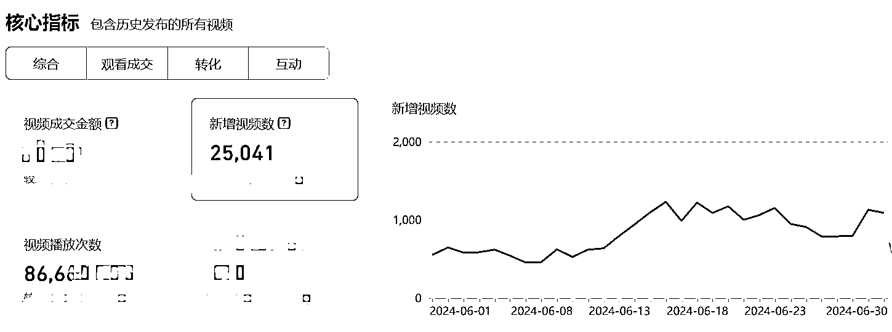

# 3 人团队年入 1000 万，实体品牌的抖音人效革命！

> 原文：[`www.yuque.com/for_lazy/zhoubao/ld7thp7g2eeyrds8`](https://www.yuque.com/for_lazy/zhoubao/ld7thp7g2eeyrds8)

## (14 赞)3 人团队年入 1000 万，实体品牌的抖音人效革命！

作者： 楚川

日期：2024-07-03

2024 年实体品牌都要把自己的生意搬到平台上来，吃到平台实体行业流量扶持红利，让潜在客户和新客户能够看到品牌生意，或者是对品牌有印象才能真正建立起用户心智。

文章 4000 字，大家可以耐心看完，会有不同的感受。

## **一、实体品牌面对抖音的困境**

楚川经过 5000 多个实体品牌的服务经历和众多同行的交流能够做出 4 点行业当下的困境，这是众多品牌拿不到结果或者是不敢轻易下场实战的原因：

### **1、用户习惯发生改变，运营团队有信息差**

2020 年-2022 年因为口罩的影响，三年让用户习惯发生了很大改变，那就是大部分人不再主动逛店。原来漫无目的的逛街、逛商场的动作变成在沙发和公司刷短视频，那门店的自然客流量就直线下降，等待上门的实体店甚至都没明白为什么 2023 年和 2024 年生意为啥比以前还难做了，核心是用户不再主动上门，并且这个行为不知道要多久才能调整过来。

### **2、信错人，走错路**

绝大部分实体品牌对于抖音的流量始终抱有质疑、排斥，因为前面 3 年时间，超过 100 万家品牌入驻在抖音平台，做门店引流推广。根据市场的二八定律，那会有相当一部分没有获得满意、可观的增长，那传递出的信息就是：抖音的流量不精准，都是薅羊毛的，不要弄了。以及行业初期，不专业的服务商一轮又一轮将品牌割的嗷嗷叫，导致大家不再相信抖音的流量有用。

### **3、可拿结果的方法论稀少**

现在随着入驻在抖音的实体行业越来越多，不同的行业短视频内容、直播方式都是千差万别，导致市面上能落地的服务商也变得稀少和珍贵。之前的服务商帮助实体品牌拿结果，都是借助平台的红利，用一套标准的方式做交付，能不能成一切看天意。所以现在已经进入到抖音本地生活 4.0 阶段，一切比拼精细化运营，考验团队 POI 搭建、组品、短视频爆款制作和批量化剪辑、抖音 SEO 流量运营、直播深度运营等，不再是以前处于绝对风口期，随便能飞起来。

### **4、行业竞争加剧，进入精细化运营**

平台或者行业一旦进入到精细化运营的雏形期，那就意味着品牌要开始筹备自营团队，尤其是本地生活毛利低，只能靠自建团队降本增效，才能在抖音实现持续增长。那在此阶段品牌方会处于一个极度难受的阶段，因为接触到不同的服务公司，能力层级和认知层级差异化极大，因为短视频本地生活大赛道不够成熟，生态不够完整导致人员鱼龙混杂，那传递给品牌的信息也是天差地别，会让实体品牌更加不知道从何开始，如何拿结果。

### **5、传统内容运营的转型困难**

实体品牌的新媒体营销成员都是传统内容工作者为主，研究品牌宣传、爆款短视频是日常工作，但这些内容不是实体品牌在抖音的基本盘。我们在跟很多品牌方合作，经过多次学习，营销部在知道通过短视频矩阵，铺天盖地做内容传递做高曝光和产出，但实际上在落地的过程会出现偏离。

这类传统内容运营会持续内耗，比如 100 个品牌抖音矩阵，批量化剪辑短视频的时候，品牌总是困在内容转型的怪圈。当数据起来，或者稍有结果就质疑方法论，会想着 100 个抖音账号单独运营，做精细化设计，导致第一个阶段的产出极低，这是抖音本地生活赛道中很难拿到结果的根源之一。

## **二、实体品牌流量运营团队的搭建**

### **1、团队如何转型：思维跃迁**

**第一，了解到本地生活的内容逻辑。**同城短视频有 2 个很明显的特点，分别为：快速传递信息、烟火气的场景还原。

快速传递信息：任何一个本地人，对本地周报几公里的信息都是有基本认知。即使是一个出差或者旅游的人抵达一个城市，可能会在手机、周边闲逛获得城市基本信息。因此同城短视频就不需要大费周章做铺垫，只需要快速将信息传递给消费者，关于门店的标签、产品特点、购买理由做穿达，类似发传单的逻辑：第一次无感，第五次有印象，第十次可能就下单了。

烟火气的场景还原：华南区域对于餐饮的要求共性可能就是“锅气”，但这种描述用文字很难精准还原，但短视频一个镜头一秒钟，用户就秒懂，就极有可能触达下单的想法。那这是目前任何图文都无法替代的功能，所以吃喝玩乐、衣食住行等 360 行均可在抖音做好场景还原，打人的消费、痛点和刚需场景，就能诱发咨询或者购买。

所以这就是本地生活的内容逻辑，大部分内容部门无法适应同城短视频的表达方式，因为内容洁癖、内容“长衫”无法脱去。下面可以举例来清晰做对比，拿一盘干锅鸡肉对比：

【电商和品牌化的解读，可能涉及到 60 秒的表达】数字化养殖的走地鸡，监测到每一只鸡的健康状态，保证吃的每一口，就像好吃到在草坪上翻滚，没有过多调味料的添加，赶紧下单，过来还送一箱啤酒。

【本地生活内容的表达，10-15 秒】在长沙 xx 地有一家能做出锅气的干锅鸡，只要 99 的两人餐，每日限量 10 份，赶紧冲，错过就活动结束了。

两种内容的表达方式完全不一样，但后者可能一条短视频 500 播放量就能带来好几单成交和到店客人。

**第二，一把手工程，全员参与。抖音是实体品牌全新的渠道，能给品牌带来无限新客户的平台，所以这必须是自上而下拥抱抖音的事实。**

不少品牌见到我们像是救命稻草，的确是能快速达成合作，签合同和打钱。但在落地的过程极其艰难，出现的问题有：门店入驻收集资料就是第一个卡点（可能门店有 1000 家，愿意配合交资料的门店就只有 50 家），建立品牌职人短视频矩阵员工不愿意配合（按照要求 500 个，最终绑定的账号只有 20 个），在发布视频的时候品牌部经常要求每一条视频给出对应的脚本，每一条视频都要仔细审核，让运营的同学哭笑不得。

连锁实体品牌大部分领导层都是屁股决定脑袋，很难为结果兜底。所以品牌真的做不下去，或者必须拥抱抖音拿新的增量，那就必须是一把手工程。如果企业老板亲自撸起袖子做以上的动作，动员全员参与，那下面的必将是自动跟随，基本上 3 个月以上有结果后，这件事就成日常工作，就像 10 年前，要求员工转发公众号推文和海报一样，没有任何差别，只是现在换成了发短视频而已。

**所以，实体品牌如果要拥抱短视频，获得大量新增，那就必须是一把手工程。**

### **2、建立批量化内容生产团队**

**第一，团队配置。品牌短视频运营团队初期在 1000 万业绩内，建议是以短视频为主，搭建 3 人团队，当业绩增加主要增加达人运营和设立直播部门。**

运营负责人：整体统筹，直连老板，具有话语权

内容运营：研究爆款、拆解爆款、制定爆款内容模板、数据分析和监测

剪辑运营：视频形式研究、复制爆款结构形式、批量化剪辑

**第二，最低标的：单月 1 万条视频，坚持 3 个月**

实体品牌真正要拥抱抖音的时候必须是把单月短视频量级提高到 1 万条。怎么理解这个操作，就举例我们自己运营的品牌单月发布视频量级在 1 万条以上，其中包含职人视频 80%，达人视频 20%。因为我们在测算出大量数据发现本地生活的内容量级在 1 万条可以判断出品牌的流量漏斗，业务线值不值得在平台做大，连续 3 个月则不断优化后，结果会越来越好，后期再放量。

**第三，成熟品牌的配置：一年打底 50 万条短视频**

当一线品牌要真正拿结果的时候，短视频的发布量不低于 50 万条/年，内容团队配置在 5-6 人左右，主要覆盖面为品牌自建矩阵视频、探店达人短视频、创意点输出。目前楚川团队在观察真正可持续拿到过结果的品牌都是有这个量级，团队执行力很强，不断尝试内容方向，不会在单条视频的脚本和结构做过多纠结，而是先落地、先拿结果。

### **3、直播团队配置**

**第一，实体品牌直播和短视频的配合逻辑**

先有短视频带货基础量，才有直播做销量规模放大，两者相辅相成，充分不必要关系

为什么一定是短视频跟直播结合在一起，要共振？是因为直播比短视频至少要高 10 个维度的难度，做好短视频就已经让我们可以有很大的增长了。短视频的核心的逻辑在于所有的达人都是以内容为驱动，用视频呈现的卖点去触达用户，让用户去买单。

所以短视频是跟用户做生意，直播是跟平台做生意，那么我们一定要先用短视频拿下市场，等品牌势能起来，团队能力起来，再用直播做密集型成交，提高营销效率，两端才能同频共振。最后两者的定位就是：短视频是触达用户最快的方式，直播是放大规模最合适的途径。

**第二，直播团队基本配置**

直播团队的搭建有两个原则：团队带着销售团队亲自干，拿到第一轮结果，再用达人放量，因为达人直播放量很难首次真正解读到品牌卖点、价值点，那成交结果不会好；直播团队搭建要转移成本，不必要加的人和物一定不加（主播可内部培养，初期做外部兼职主播带练），团队考核从新用户增长、ROI 和 GMV 等多维度看产出。

单月 0-100 万：1 名直播运营+1 名销售直接可以拿结果

单月 100-500 万直播间配置：1 名统筹+1 主播+1 兼职主播+2 运营+1 达人直播

单月 500-1000 万直播间配置：1 名统筹+2 主播+若干名兼职主播+2 名运营+2 名场控+1 达人直播

单月 1000-2000 万直播间配置：1 名统筹+2 主播+若干名兼职主播+3 名运营+2 名场控+2 达人直播

## **三、一个具有战斗力的本地生活团队应该如何配置**

**思路来源于：天鹅到家 9 个月，50 多万条短视频，12 亿曝光，3 亿+ GMV 的操盘经验，团队一路成长的体会**。

### **1、2000 万以内的团队架构**

1.  运营团队：此阶段只需要拿结果，团队人员控制在 7 人左右，分别为：短视频 5 人+直播 2 人
2.  流量预算：财务和老板对于抖音认知有限，投入不知轻重，容易让项目腰斩
3.  供给团队：2024 年对于服务质量的要求是极高，第一阶段的好评率没稳住，差评太多，会让第二阶段成本提高 2-3 倍。需要全员参与，在服务侧做到远低于同行的差评率

### **2、5000 万以内的团队架构**

1.  运营团队：团队人员控制在 15 人左右，分别为：短视频 7 人+直播 8 人
2.  流量结构：职人视频 40%、达人视频 60%，单月超过 2 万条
3.  供给团队：可以开始研究差评来源，进一步提高服务质量
4.  客服团队：成立抖音专项团队，降低直播间的压力
5.  战略小组：老板+运营负责人做竞对分析，收集情报，每月制定打法和策略，需要变化

### **3、1 亿以内的团队架构**

1.  运营团队：团队人员控制在 20 人左右，分别为：短视频 8 人+直播 12 人
2.  流量结构：职人视频 30%、达人视频 70%，单月超过 5 万条
3.  供给团队：研究新产品和各种 sku 的组合产品
4.  客服团队：成立抖音专项团队，降低直播间的压力；有专门面对投入团队，解决疑难杂症
5.  战略和策略团队：老板+运营负责人+陪跑服务商做竞对分析，每日跟进大盘，建立抖音 BI 体系，及时制定和挑战打法、策略，掌握核心打法，可以放量，也可以防守。

**抖音本地生活的内容营销团队一定是小而美，可以外包的部门都可以转移，如我们团队的摄影、部分剪辑、POI 上架等都是用技术 sop 输出，长期深度合作。这样保证了穿云能够做到人效人均每年给企业产值可以做到 1000 万以上，在策略、战略和运营细节上花心思去琢磨。实体品牌一定是要走同样的路，不如现在就建立起来这样的能力，让团队穿越整个红利周期。因为实体利润低，自运营是唯一出路，明知道答案如此，为啥不现在动起来。以上楚川说的方法，真正落地到企业内部，3 人做到品牌年入 1000 万是没太大的问题的，核心在于执行能够彻底。**

* * *

评论区：

蝈蝈、 : 感谢大佬分享，请问下批量矩阵账号当天最多发多少个视频
Cylc : 请问如何找到那么多批量自有账号发布合作？
楚川 : 5 条左右比较合理
楚川 : 内部员工
Cylc : 上千名员工？
蝈蝈、 : 感谢指导！
楚川 : 看实际体量和需求
Carlchen 陈罡 : 线下和楚川也面对面沟通过很多次，学习到很多。分享的内容很干货，值得看看。

* * *