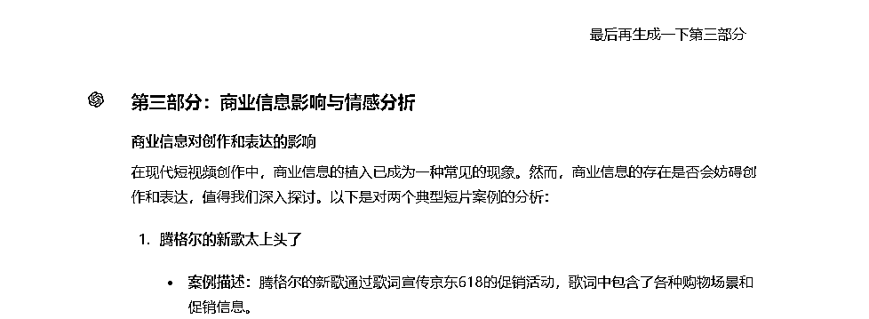
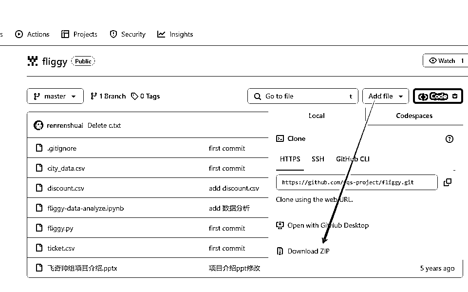

# AI 代写，手把手教你实操变现

> 原文：[`www.yuque.com/for_lazy/zhoubao/kc1248xpx05g43ds`](https://www.yuque.com/for_lazy/zhoubao/kc1248xpx05g43ds)

## (31 赞)AI 代写，手把手教你实操变现

作者： 浩然

日期：2024-07-05

大家好，我是浩然，自上次文章分享过后，有很多朋友加我，也问了我很多问题，今天这篇文章，有我总结的一些常见的问题以及回答，还有我给大家分享我做单的几个案例，手把手带新手朋友实操。

有很多朋友找我要一些结构化提示词，我想说的是，不同需求有不同的做单思维，框架提示词只有在非常固定的写作模式才会起到一些作用。比如我有一个需求，给 GPT 上传一个小红书文案，让他按照某种方式给我重新润色一下，这种写成框架提示词确实会大大提高我们的效率，但是如果你接的每一单都不同，这种是不行的。

## 成功的开始，敢于迈出第一步

也有很多朋友给我说不敢接单，怕完不成别人的需求。前期我给大家的建议是先从自己的专业入手，可以先接一些小单子来练手，比如计算机专业的，可以先接一些计算机专业的大作业，或者课设之类的练练手。其他行业也是如此。从自己的专业开始做起。

这么有两个好处，第一个是自己专业内容基本都懂，理解起需求也不会很困难。第二个是容易上手，自己本专业的内容，做起来就不会有很大的顾虑了。

此外，在接单的过程中，要不断总结和反思自己的工作方法和技巧也是很重要的。你可以记下一些成功的经验和遇到的问题，并寻找解决方法。这样在面对类似项目时，你就能更快更好地完成任务。

先专再泛，逐步扩展你的技能和领域，当你感到在某个专业已经相对熟练时，可以尝试接受跨专业的项目。通过这种方式，不仅可以积累更多的经验，还能不断挑战自我，提高自身的综合能力。

还有一点就是做单的过程中，如果实在缺少思路，可以问问有经验的朋友，或者直接询问我也是可以的。

## 两个案例，分享我的做单思维

为了帮新手朋友快速了解做单的过程，接下来我会分享两个真实案例，手把手带大家熟悉我的写作思维。有一定 AI 代写经验的朋友也可以看看，拓展拓展思路。

### 案例分享一：关于短视频创作的分析报告

第一个案例，上面的图片是要求，接单的第一步就是读懂客户的要求，知道客户想要做什么，然后根据难易度报价。大家看完这个案例，请先想如果给你你会报价多少，还有如果你来做，你是怎么打算做单的。

#### 第一步：分析需求

分析需求有两种方法，第一种方法，就是你自己读懂了，知道客户想要什么，第二种就是让 GPT 来帮你分析。我接下来会演示第二种方法，让 GPT 来分析需求。把客户的需求复制到 GPT，让 GPT 去分析一下。

这么做的好处有两个，第一个是接下来的对话中，GPT 就知道你想要做什么了，不会怎么偏离主题。第二个是根据 GPT 分析好的需求，让他来给你列报告的大纲。

#### 第二步：解析需求

解析需求的目的，是让大脑知道怎么做整个需求，大家再来分析这个需求，是根据 10 个短视频去做分析。我一开始的思路是:这非常简单呀，把 10 个视频的链接，传给 GPT，让 GPT/KIMI 分析一下视频即可，实际操作的时候，发现 ChatGPT/KIMI 这种聊天机器人，读不了视频。

B 站链接：[`www.bilibili.com/video/BV1d64y1d7As/?spm_id_from=333.337.search-card.all.click&vd_source=9535a4d220d60fe8b8d0e4f3df93d06e`](https://www.bilibili.com/video/BV1d64y1d7As?spm_id_from=333.337.search-card.all.click&vd_source=9535a4d220d60fe8b8d0e4f3df93d06e)

还用了 Bilibili 的 AI 视频总结，出现当前视频暂不支持 AI 视频总结，还把视频下载下来，上传到百度网盘，让百度网盘来帮我总结，发现网盘也搞不定。

试了这么多方法，发现现有 AI 工具好像都无法解析 AI（如果有知道的小伙伴可以沟通交流下）。此时我想到了第二种方法，就是我把录音搞下来，然后用飞书妙计，或者通义听悟，根据音频转成文字。发现这个视频有旁白，旁白不说话，所以音频有漏掉的内容，第二种方法也 Pass 了。

那就只能使用第三种方法了，原始方法，就是人工把每个视频的字幕都记录下来，然后全部上传给 AI，最后我用的是这种方法。（大家有好的方法也可以交流下）。

#### 第三步：开始 GPT 操作

1、上传我记录好的每个视频的文案，先让 GPT 阅读。由于我之前让 GPT 做了需求分析，所以 GPT 阅读完了之后，给我列出了表格还有一些其他我们要的东西，这一步的生成仅供参考。

2、让 GPT 确定大纲，这块大家要注意下，这篇报告的字数要求是 3000 字，GPT 一次生成了 7 个章节，这肯定太多了，3k 字大约 3 个章节就够了，所以我这边就让 GPT 重新生成了。

3、那剩下的操作就是让 GPT 一步一步来写了，先来引言，我是直接复制的引言部分包含什么，让 GPT 来写。

4、第二步就是 写第一部分，由于需求上说要整理一个表格，所以我们让 GPT 写的时候，也要控制下输出格式，让 GPT 整理成表格。

5、第三步，写第二部分

这块要注意，第二部分由于需要图表可视化做为支撑，不会代码的人可能就犯愁了，该如何做可视化，这块我教大家一招，不会代码的同学也能做好可视化图表。

先让 GPT 分析一下，然后让他列出可以做的图表。

然后让 GPT，根据生成的数据，使用 html+echarts 来绘制图

接下来，在电脑桌面上新建一个 txt 文件，把 html 的代码复制到这里。

之后修改后缀为 html

然后打开这个文件你就获得了一张可视化的图表，是不是很简单，学会这个操作，以后再也不用愁要做图表的单子了。

6、绘制好，之后就可以写第三部分了.

到这里一个 3000 字的报告就完成了，之后就是调整格式，给客户交付了。

给大家透露一下这单的价格，和做单时间，我的思路完全是上面的思路，如果这单我来做，大概 10~20 分钟左右搞定，收费是收了 240。

### 案例分享二：xx 数据分析与可视化研究

上面的图片是这个作业的要求，题目自拟，根据 xx 数据分析与可视化研究，如果大家接到这么一份任务会怎么做。可以自己思考一下。看到选题可能有很多小伙伴心想，我不会代码怎么办，这个任务我是自己不写任何一行代码，都是 GPT 来帮我实现，包括可视化也是。

所以当一些非程序员的同学也可以学一学我的思路。如果是是程序员同学，学会那就是如虎添翼，给自己多一种变现途径。

当然这个案例也是如果给大家，大家会报价多少，然后再来思考一下如果是自己来做，该如何完成。

#### 第一步：定选题

接下来我说下我的思路，第一步这个要求是根据 xx 数据分析与可视化研究，如果自己不知道做什么方向的研究，那么可以直接先百度。好，在百度上看到了，旅游数据，那么标题就定**旅游数据分析与可视化研究。**

#### 第二步：找数据

选好题，没有数据怎么办？咋们就先去找一些数据来进行研究分析，数据有两种获取的方法一种是爬虫，一种是从阿里的天池大数据平台下载。那么爬虫如果没爬过怎么办，直接在 github 网站上搜索（[`github.com/`](https://github.com)），拿现成的数据和代码来进行分析。

点击项目里，首先看有没有数据，有数据的话我们再下载下来，下载的话直接点**Download ZIP。**下载到桌面解压。

#### 第三步：开始 GPT 操作

1、先上传数据，让 GPT 去阅读这份数据

2、根据已经定好的选题，和作业要求，老师给好的目录，让 GPT 整理一下大概目录，并输出，我们现在就只要按照目录来一步一步让 GPT 生成回答即可。

3、开始第一步的生成，生成之后复制到 word 中。

4、生成第二步，并生成真实的代码案例，这块我是怎么知道爬取的网站是飞猪旅游网呢，是因为我下载代码的时候，github 上简介写的是爬取的飞猪旅游网，大家可以注意下这块。

那么懂代码的同学可以怎么做，直接把下载好的代码直接上传到 GPT，让 GPT 根据真实的代码生成。这块也是最真实的。

5、生成第三步，这块的代码都是 GPT 生成的。

6、生成第四步，由于我们的目录在一开始就确定好了，就直接下一步，每一步的最后也都会生成一份代码。

7、接下来就是第五步，第五步是可视化，这块我会教大家如何零代码基础的情况下做好可视化。这一块我们先不用着急复制到 word 文档中，而是把每一个可视化实现了。第五步这块有个坑，就是你想让 GPT 替你分析的时候，你得保证你的 csv 格式里的数据，没有空行。如果有字段缺失的情况下，GPT 是会读取失败的，这块大家注意一下。

那么如果让不会代码的同学也能学会生成图表呢，接下来请看操作。

这一块他会生成一个 html 代码，我们进行复制这个代码，并在桌面上新建一个可视化.txt，把代码复制到这个文本文件中。

然后修改后缀为.html

之后打开这个网页，就会得到一个可视化的界面，如果你相对这个界面有什么修改的，直接给 GPT 说就行了。之后的每一张图片都是这么生成。

8、生成第六步，让他写成段落

#### 第四步，整理格式

wps 或者 word 上方可以调整字体格式和字号

选中段落，点击调整行间距，里面点击其他

主要调整的有两块一块是首行缩进，一块是行间距，调成要求的 1.25 倍。

这是最终调整好的

好了，这个案例就到这里了，希望大家可以学到一些思路，也希望大家在做单的过程中，不要过度的追求结构化提示词，结构化提示词只能实现固定的要求（有很多小伙伴找我要提示词，这里我就想说提示词就是基础的提示词使用+写作思维），每一单的要求不一样，更多考验的是使用 AI 的功力+写作的思考。

最后透露下这一单收费是收了 300，由于质量好，客户还在学校自发帮我们宣传了一下。

## 不断复盘，关于成交的一切

自上次分享完之后，很多朋友也问我，关于如何提高自己的成交率。那么其实现在我的工作室中，最重要的指标也是看成单率，我有自己的流量团队，还有线上和一些朋友合作的流量团队，那么成交率就是大家最看重的一个指标。

对于工作室来说，成交率主要有两方面，第一个是 这个单子是否有人来完成，考验的是你的预备写手有多少。还有一个指标就是价格，大部分客户最关心的是价格问题，一本及以上的客户会关心质量问题。

之前在跑大作业环节的时候，和一些朋友合作的流量团队复盘过关于成交率的问题，有一些朋友会劝我降价，确实，低价可以拿到很多单子，但是卷低价，只会有人比你更低，最后恶行竞争，大家都赚不到钱。我的想法是不如去调整对策，让客户觉得这个钱花的很值。

从成交的本质来说，我来给大家深入分析我接下来关于成交的改变和思路。

上面是我整理的关于成交的本质，那就从这四个方面入手。

第一步有交易意愿，客户必须有交易的意愿，这是成交的前提。在代写方面我们没有办法让客户亲身体验到好处，那么就从亲眼见到好处。这块要做的调整就是朋友圈，很多客户加到你的时候，第一眼就是翻你的朋友圈。那么如何打造朋友圈，第一步先收集一波客户好评的截图，建立一波好评库，它有两个作用。

第一个是它可以做为你发朋友圈的素材。第二个是当有客户犹豫的时候，你可以把它当成案例发给客户。

那其实这一步也是我为什么说要做一名高质量写手的原因了，第一个是好评多，第二个是质量过硬同学推荐率会非常高。如果是同学推荐的客户，那么关于信任的问题就解决了，直接谈需求和价格即可。

第二步有交易能力。这一步的关键是客户的意愿多强。比如大二大三的学生他们写份大作业，他们的想法就是水一水，价钱不要太高即可，如果你给他们要太高的价钱就会吓到他们。但是给大四的学生的想法，就是尽快毕业。如果完不成就无法毕业，也对质量有着高要求。所以他们的意愿很强，接受的价格也很高。这块就能报高价了。

第三步有交易理由。判断用户是不是急需要用，急单可加价。还有就是不买后悔，这种就是适合已经在这个市场上被骗过的同学了，还是从朋友圈下手，经营好自己的朋友圈，让他们一看你的朋友圈就知道你这里可以解决他的问题。

那其实前三步解决完了，最后一步就是顺理成章的完成交易了。到这一步交易动作就完成了，最重要的还是要质量过硬，做好交付。

## 答疑环节

自从上次分享完文章，有很多新的朋友加我，也问了我很多问题，今天我把这些问题整理一下，希望对大家有些帮助。

1、现在很多人入场那么 AI+写作还有机会么？

那肯定是有的，AI+写作的场景很多，有简历，公文，大作业，论文，直播脚本，文案等等，能写的非常多，而且 AI+写作考验的是 AI 的底层能力和写作的底层能力，如果没有深入的了解，只浅尝辄止也是做不下去的。所以不要怕同行多，先把自己的基础能力打好，然后慢慢往团队方向布局，最后做大做强。

2、现在大四已经毕业了还有论文么？

这种问题的问的也很多，大四毕业了，但是大三学生也要开始选题了呀， 有的学生大三放暑假的时候，就要开始进行选题了，这个时候早早布局就能收一波定向用户。

当然还有函授论文、网络教育、 成人高考等这些人也要写论文，我再透露一点，很多学生一辩没过，二辩安排在 9 月份，这部分同学就要修改论文，或者重新整理答辩 PPT 和答辩稿，这些也是市场。

还有现在是期末作业的旺期，大家早早布局，现在一天赚 1k 也不是问题，我上面的案例一收费 240，案例二收费 300。这两案例我来做的话，只用 20 分钟左右就能搞定。并且最近跟着我的一个大一学生，短短几天也赚了四位数，都是一手单。唯一的缺点就是要价太少了，以后要把价格涨起来。

大家可以看看流量，已经做到接不过来的地步了。

3、小红书号被封了怎么解。

这个问题也是问的最多的一个，现在我用的就是拿一个 QQ 号登录，然后拿被封的手机号，来绑定这个 QQ 号，这是最快捷的一种办法。理论上你有 N 个 QQ 号就能做到无限解绑了，还有一种办法就是用微博号，很多同学都不知道微博也可以登录小红书号，拿自己的 QQ 号登录微博，然后再去登录小红书也是 OK 的。

最后我想要给大家说的是，代写一定要投入时间去学习的，并不是单纯的靠 ChatGPT 或者某一工具就是可以完成。横向就是深入学习 AI 和每一科的写作思维。竖向就是要不断学习如何做流量。当这两者你都学会了，就可以自己开工作室了。

最后祝入局的同学都能在这个行业赚到钱！！！

* * *

评论区：

浩然 : 飞书链接，排版会更好点: [`y5ph2w13sj.feishu.cn/docx/GvOzdMkElo6OeIxHJ8dc2dHHnih?from=from_copylink`](https://y5ph2w13sj.feishu.cn/docx/GvOzdMkElo6OeIxHJ8dc2dHHnih?from=from_copylink)

* * *