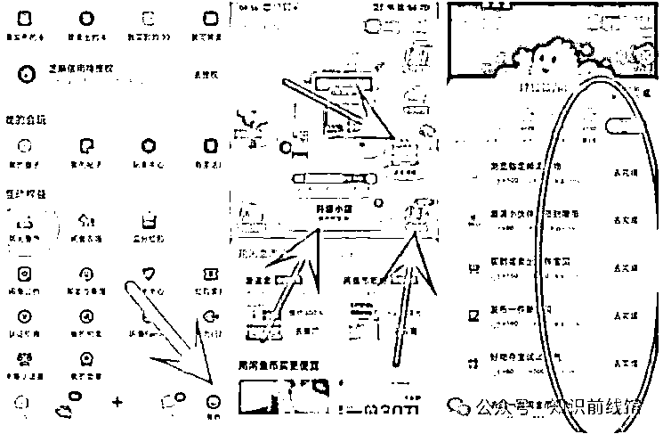
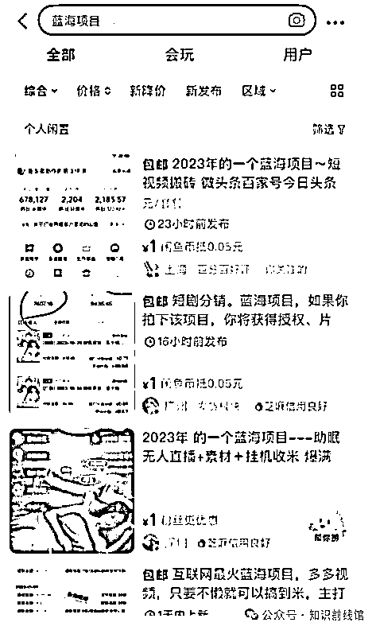
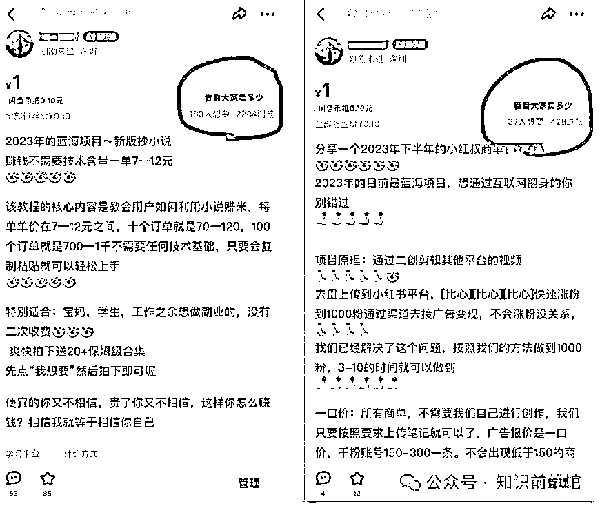
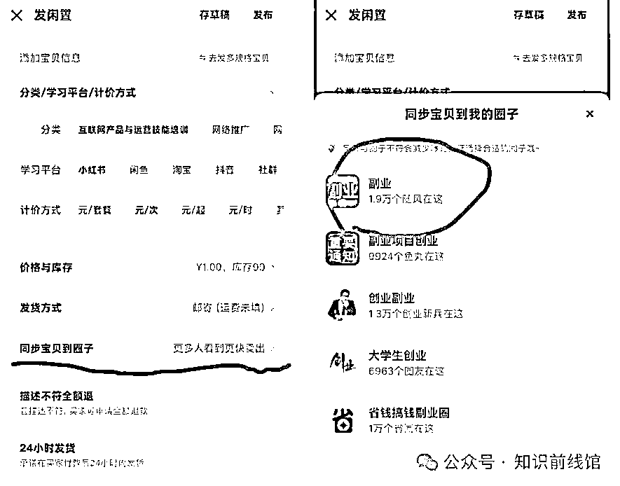
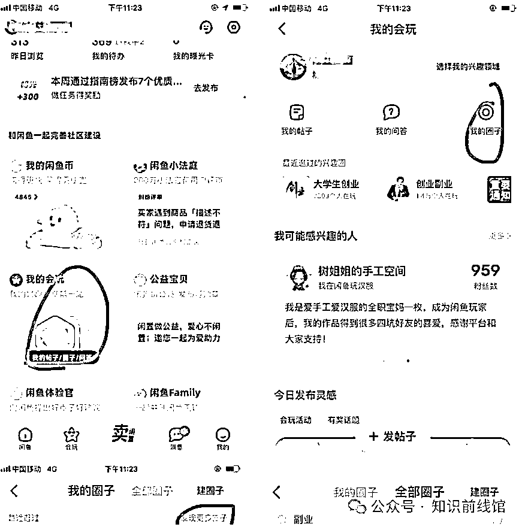
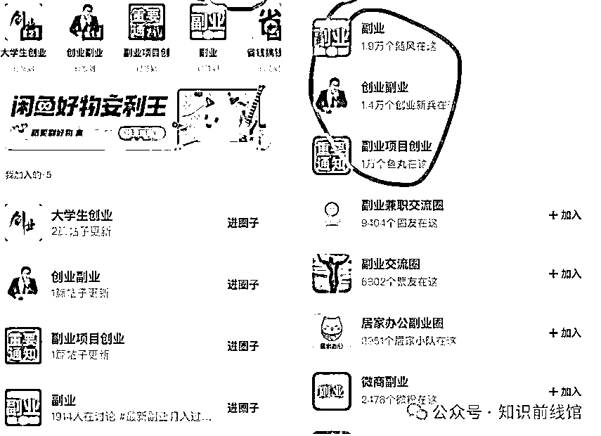
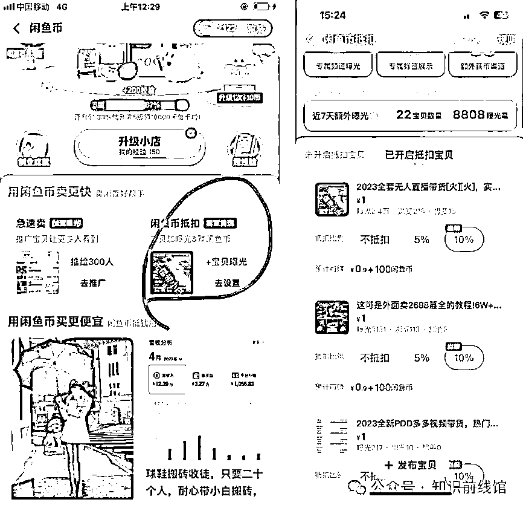
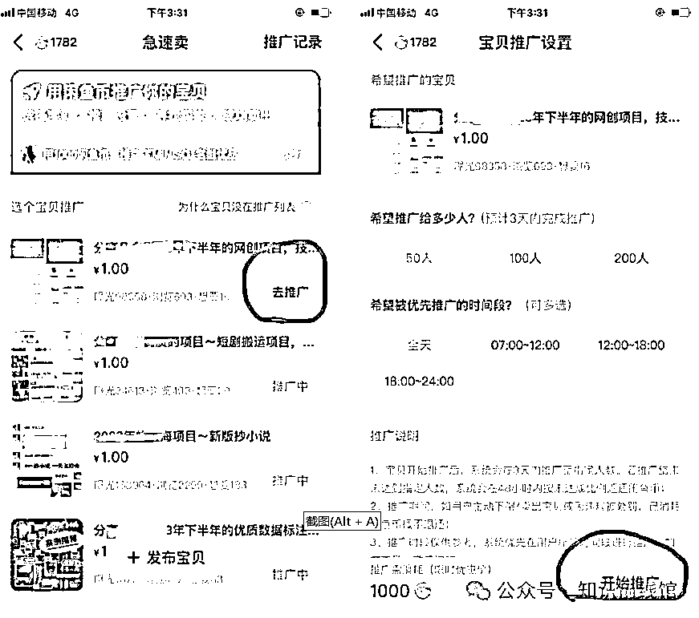
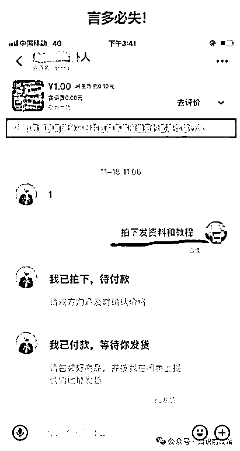
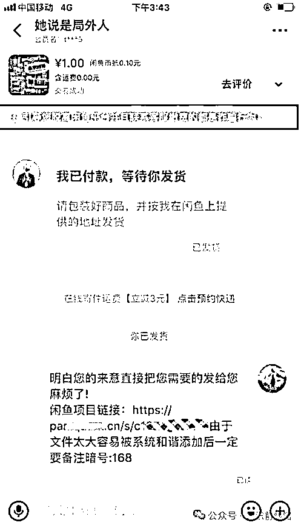

# 闲鱼挖掘，小白可上手！

> 原文：[`www.yuque.com/for_lazy/zhoubao/syq0eiqvtp9zi5w8`](https://www.yuque.com/for_lazy/zhoubao/syq0eiqvtp9zi5w8)

## (30 赞)闲鱼挖掘，小白可上手！

作者： 知识前线馆

日期：2024-07-02

# 一、养号流程

1、在主页搜索**“项目”**或**“赚钱****”**等关键字，然后每隔八个小时**收藏+8**、**浏览+30**、**关注+6【这个很重要】**，模拟正常买家滑动界面

2、养号好后，发布六个作品

3、做闲鱼任务，在“我”下面找到互动权益打开“领闲鱼币”具体如下图

4、每天领取闲鱼币并且把**“赚经验”**里面的项目全部做完之后升级小店

# 二、发布商品步骤

1、在闲鱼主页搜索副业或者赚钱等内容

2、找到想要人数多的商品

3、复制文案和截图

按照把上面文案内容复制下来，《前 15 个字改动下就可以去重》把图片截屏（不要下载）切记

4、设置商品价格

价格可以两块开始，慢慢降价 0.1，把那个闲鱼币折扣也可以打开（在主页签到里面）有鱼小铺（没开通的可以忽略）的话可以设置粉丝价

**ps：同步到圈子**

# 三、如何加入圈子

3.2、发布作品（一天发布 6-10 个作品）

3.3、闲鱼币折扣曝光

3.4、开“极速卖”增加曝光

# 四、客服聊天

1、有人询问商品时，只发一句话：拍下发资料和教程，这一句就好，不要说太多话

2、有人下单以后就把带有你暗号的链接（就是你接龙的暗号别搞错了）发给他

**这里标注一下：暗号链接就是我发给你们的直接发给他就好了，每个人都不同**

# 五、怎么快速优化提高曝光

1、发布商品价格统一设置成 2 元，发布过后一个小时后开始降价每次降 0.1 元一个商品

2、把价格降到 1 元就停止！

3、刷单：在闲鱼上面搜索 0.01 元的小黄鱼找到我想要给对方发信息：来不来？或者发个虎这个是一个暗号来的看得懂的如果对方回复你来或者直接把商品发给你，你直接购买先，不要付款等待别人把价格改成你们彼此同意的价格后在付款，同样如果别人找你也是一样，或者找群里的兄弟们互刷也是可以的（每天 2--4 单就可以了）

4、每天 12 点准时擦亮有双倍曝光

5、开通闲鱼币折扣

6、开通极速卖

**每天必做内容：**

1、 签到闲鱼币任务

2、每天发布至少 8 个宝贝

3、宝贝降价操作，每个宝贝每天都要来一遍

4、卖出宝贝，立马上架

5、开启闲鱼币折扣和闲鱼币推广

6、宝贝每天都要擦亮，早上八九点做都可以，最好是晚上 12 点整擦亮（双倍曝光）

7、刷单！注意一下频率，不要太高，每天两单即可

8、每天晚上 12 点准时擦亮宝贝可以双倍曝光

9、每天在所加入的圈子签到

# 六、闲鱼虚拟商品曝光量的底层逻辑

第一、账号的权重：

1.  账号注册的时间长短，是否违规
2.  账号的活跃程度是否每天都在做任务
3.  账号是否购买过商品，评价点赞情况如何
4.  账号里面有多少商品，销售如何、好评多少，这一点最为重要

第二、商品的权重：

1.  发布的商品与平台其他商品的重复度
2.  是否有敏感词、违禁词和违规词：
3.  注意事项：发布项目的时候需要注意，有可能会触及违规，你需要想尽一切办法避免这个违规，这个需要你自己根据你发布项目去进行测试，最好的办法就是参考同行，然后进行优化，如果担心的话可以用闲鱼违规词检测工具进行检测一下：[`uutool.cn/check-word/`](https://uutool.cn/check-word)
4.  商品的浏览曝光比和购买浏览比

# 七、总结

1.  账号操作的时间越长权重越高，你无论发布什么作品（只要不违规）平台给你推的曝光量就多
2.  发布的商品尽量少和平台其他商品低重复，获得的曝光量就高，这个取决于你对编辑文案和图片的能力
3.  浏览曝光比取决你的主图和你文案前面的 15 个字
4.  购买浏览比取决你文案的渲染能力

不会封号？

不会，我们是通过网盘链接发送的个人 V，网盘里面的钩子我们会先让客户添加到我们的个人微信，再给他们发的虚拟内容

会不会封号

网盘链接引流到私域，不会封号、不会封号、不会封号

如果你被封号，就是关键字违规和标题违规，细节没有把控好

以上就是全部项目的保姆级课程，其实整个项目比的就是细节和文案的优化，好多新人基本不会认真看完课程就去开始操作导致违规或者封号，我自己做了 9 个号基本没一个封号，每天稳定的曝光量都在五万到几十万！

跑通以后需要自动发货的这里：[`www.agiso.com/product/alds`](https://www.agiso.com/product/alds)

切记：不要三天打鱼，两天晒网的，按照我的操作文档一步步操作，执行力拉满是不可能赚不到钱的，大家加油！

在此祝所有小伙伴们 暑假期间赚的盆满钵满，有问题随时咨询！

* * *

评论区：

夜的第七章 : 没懂呀，请问这是卖啥[嘿哈]
知识前线馆 : 卖虚拟商品，比如说，网课、资料等等☝️ 飞鱼哥 : 资料哪里拿
知识前线馆 : 资料这个可以是你任何的虚拟商品哈，不一定要跟我的一样

* * *