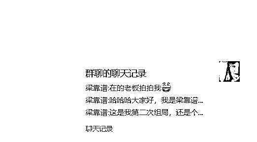
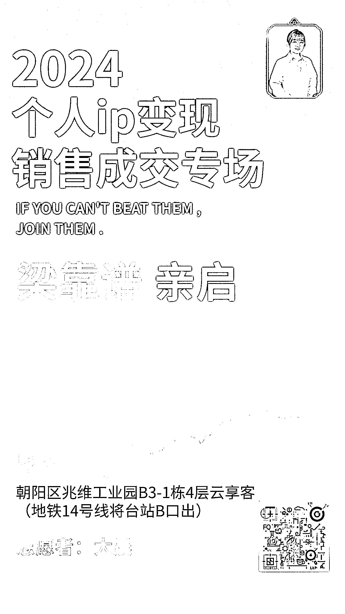
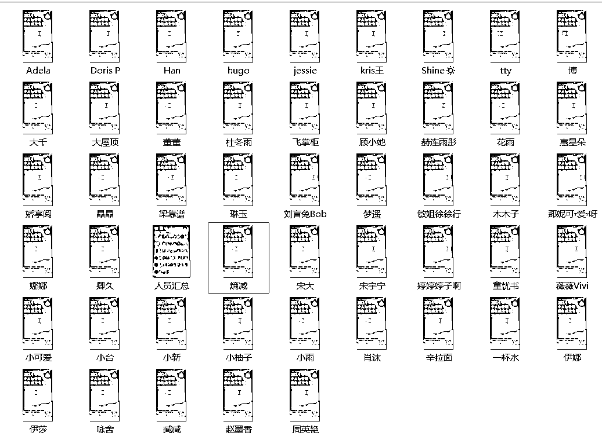
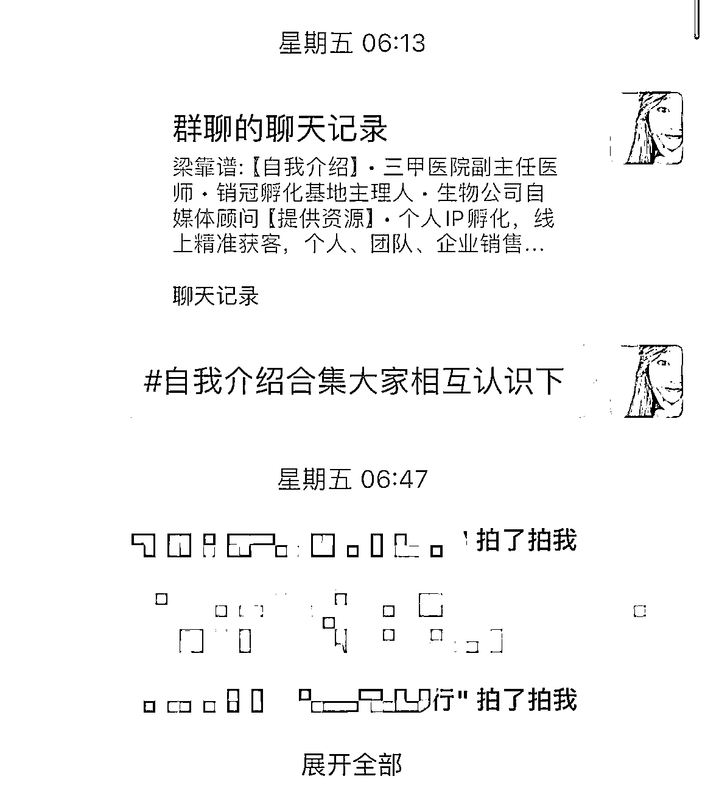
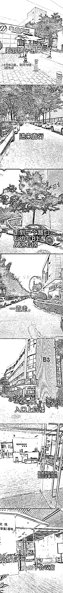
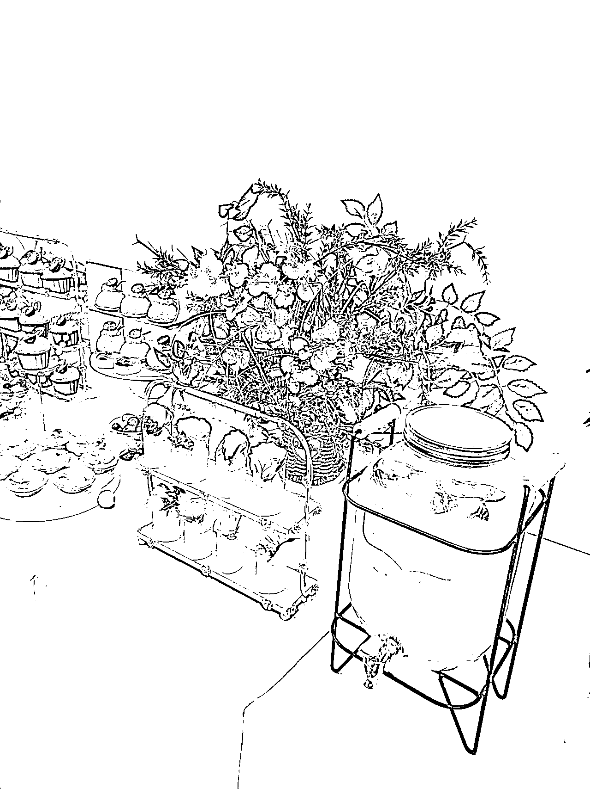
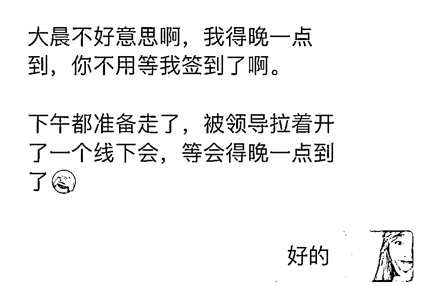
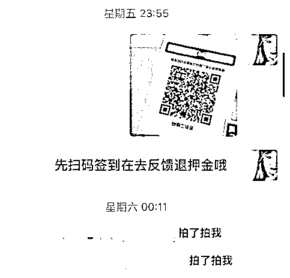
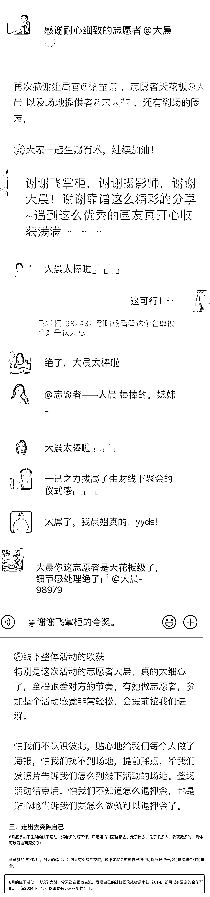

# 被梁靠谱称为“志愿者天花板”的大晨

> 原文：[`www.yuque.com/for_lazy/zhoubao/ndq3dvhe9kc55dfg`](https://www.yuque.com/for_lazy/zhoubao/ndq3dvhe9kc55dfg)

## (23 赞)被梁靠谱称为“志愿者天花板”的大晨

作者： 大晨

日期：2024-07-01

对于 6 月梁靠谱北京线下聚会的复盘，感谢[@梁靠谱](https://wx.zsxq.com/dweb2/index/footprint/582222485184144) 给本次做志愿者的机会，让我自身得到锻炼，链接更多优秀伙伴，并且找到同频伙伴，一起合作。感谢@一群 对线下海报的制作指导。感谢各位到场圈友的支持。

你好啊，我是销冠梁靠谱口中的“志愿者天花板——大晨”，有幸做梁靠谱组局志愿者，非常感谢梁靠谱和张子安给的此次机会，让我组织 50 人的聚会，自身得到锻炼也结识很多优秀圈友。呈

做生财志愿者有 6 个月的时间，今天与大家分享下组织梁靠谱线下志愿者的工作流程。

### 一、线上拉群辅助

#### 聚会中，需要志愿者协助的主要事项为以下 3 步

##### 1、加好友，添加组局官和参与者的微信好友

参与过志愿者的伙伴们应该都了解，志愿者会以群接龙的方式领取本周负责的聚会（小心机，接龙当日设置群消息【提醒所有信息】避免因为没看到而错过接龙）分配成功后根据【志愿者信息同步表】添加组局官和参与者。

添加组局官和参与者好友的时候申请信息尽可能写详细，方便伙伴们区分人员提高工作效率，说清楚你是谁？加我做什么？

**举例：“你好，我是生财志愿者大晨，通过下好友我来拉你进聚会群。”**大概率秒通过。

添加过程中改好备注：日期-组局官-姓名；日期-xx 组员-姓名

1.  **举例： 0621-组局官-靠谱；0621-靠谱组员-董董，**
2.  改好添加后方便拉群做区分。（根据自身习惯做备注，如组员较多为避免微信产生异常建议分多次多天加好友）
3.  组员联系不上

这次有一个小插曲，2 位组员一直没联系上，包括电话/微信/短信，这种情况可以让鱼丸帮忙联系，或者短信提示下**“你好，我是生财志愿者大晨，你成功报名 21 号的组局，手机号是微信可以添加下我拉你进群，48h 内未得到回复，这边会帮忙取消聚会哈。”**当然，最终两位组员还是成功参与了聚会。

##### 2、建立聚会群，将组员和官方人员拉进群，帮忙蹲名额

添加组员后把组局官和官方人员（鱼丸、领队、张子安、杨杨）拉进群，把组局官、领队、鱼丸设置为群管理，开启**群聊邀请确认。**

设置群名格式：“日期”生财“城市”聚会 **-**“组局官昵称”

**举例：0621 生财北京聚会-梁靠谱**

发布群公告

在建好聚会的小群后，志愿者可以根据【志愿者手册】发布群公告，并且设置为**【置顶】**。

拉群前私聊组员确认时间，时间 OK 拉群

**举例：你好，我是本次志愿者大晨，我来拉你进 21 号 16 点的梁靠谱聚会群哈，如果时间 OK 拍拍我~**

临时有事，无法参与聚会的 2 种情况

1）报名结束前，组员因事不能赴约，询问星球编号在【志愿者正式群】内@张子安帮忙取消退回押金，并移出群聊。

2）报名结束后，视情况而定，志愿者自行判断是否可以退回保证金，这次有些组员因为公司临时有事实在赶不上，很遗憾取消了聚会。

组员退出聚会，释放名额

这次聚会实在是太爆了，不到 1h 就满员，方便其他圈友想报名却没有名额的人留出位置，留出位置后可以发到朋友圈提醒下其他圈友可以报名，上次我发之后就有一个圈友来找我说，想去但没有位置了，志愿者可以主动帮忙盯下释放名额，及时发给想去的圈友。

##### 3、引导破冰

当时有 2 位组员一直未能联系上，为了不耽误整体进度及时跟梁靠谱同步情况，方便她进行下一个环节。（争取在聚会前四天拉群圈友，给组局官一定时间做背调）

梁靠谱在群内说明当天聚会的安排和流程，非常贴心！！

开营后大家都在积极交流聊天记录比较多，志愿者可以把重要信息打包汇总在群里，更方便伙伴们爬楼！

21 号聚会，18 号我给每位参与者做了一份海报（我从山东过去北京，所有物料都要提前准备）

用一张 A4 大小纸两面印欢迎海报，方便大家认人，也会有更好的体验感。

自此荣获“志愿者天花板”的称号，也获得了大家的喜爱~参与人数较多，我打包转为合集发在群内，这样大家爬楼也不会很辛苦！再此感谢@一群的海报指导。

围绕“可以为 TA 解决大家什么事情”，一定不会出错，站在对方的角度解决某件事情！

引导大家破冰做自我介绍，我也在积极参与中（毕竟这是次非常好链接人脉的时候），第二天一早可以打包合集在群内，方便大家。

志愿者其实就是为了大家服务，方便大家！

##### 4、促流程，跟进组局官进度，并提醒成员按时参加组局、签到等

聚会前要多次同步地址和聚会信息，可以把信息置顶，当时我担心有群友找不到地方，特意把手机号打出来，如果真有找不到地方的可以电话，避免错过长脑子的机会。

### 二、线下聚会流程

#### 线下聚会 XX 步走

##### 提前踩点

2.  靠谱这次聚会时间是 16 点，我早晨从山东赶过去，大概在 14 点已经到达现场，确认路线和会议室，给大家做指路图，方便大家查看路线。
3.  

（可能是放了指路图的原因，大家都很顺利到达现场，没有一位问路找不到地方的）

##### 布置现场

2.  大部分现场都需要布置，摆好茶歇和点心一般都会有专业人员操作，可以帮忙协助摆好凳子，拿好拍照需要用的物料。谢谢梁靠谱准备的精美茶歇@梁靠谱

##### 签到、确认所有圈友是否到场

2.  签到处摆在门口，大家到场就能看到聚会地点也方便签到，准备五样东西———参与者海报、参与者名单、签到二维码、签名物料，贴在衣服上方便圈友认识。还有笔记得多准备两根~

##### 时间到 活动开始

2.  志愿者要在门口站着方便圈友紧急情况发生，这次有位圈友接到一个家里的紧急电话，不得不走，这个时候要了解清楚圈友姓名，然后及时移除群聊，到时候别 A 到她。如果有圈友未到场的也能在门口及时签到，方便后续退押金。
3.  未到场的伙伴及时微信联系，看下是否在路上，如果临时有特殊情况也要了解清楚。
4.  

##### 志愿者守护住蛋糕

聚会开始大家都落座，志愿者站在后面守护住蛋糕，方便休息的时候拍照，

##### 休息拍照环节，

提前准备拍照物料，拍大合照的时候及时递给组局官，休息期间提醒组局官时间安排，避免时间过长，大家等不及。

##### 互动期间大家积极带动气氛避免尬场

一开始不得不说现场很多 i 人，自我介绍的时候冷场，志愿者可以调动气氛，积极参与，不过大家熟悉起来就好啦~

##### 散场把会议室卫生打扫

聚会结束要把场地打扫干净~圈友立场要提醒大家注意安全~记得写反馈退押金

##### 及时在群内发送反馈链接，提醒大家退押金。

最后记得填写志愿者信息同步表，再次志愿者活动也是完美落幕。

### 三、圈友评价

这次也收到了很多圈友的好评，志愿者天花板,细心,有耐心。链接很多伙伴，同时更大的收获是认识很多优秀伙伴，期待我们下次相聚。

* * *

评论区：

华商 : 学习了
宋晓元 : 剩下的内容在哪里看，谁能教教我呀
绢绢感恩美学 : 牛啊，果真是榜样
小龙 : 牛啊 下次北京聚会 我也想去

* * *