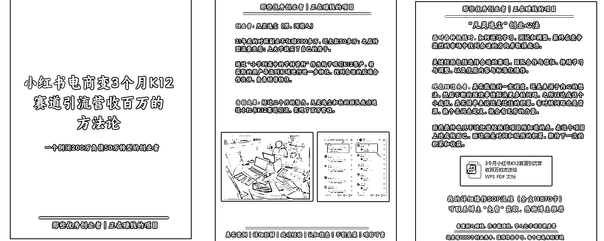
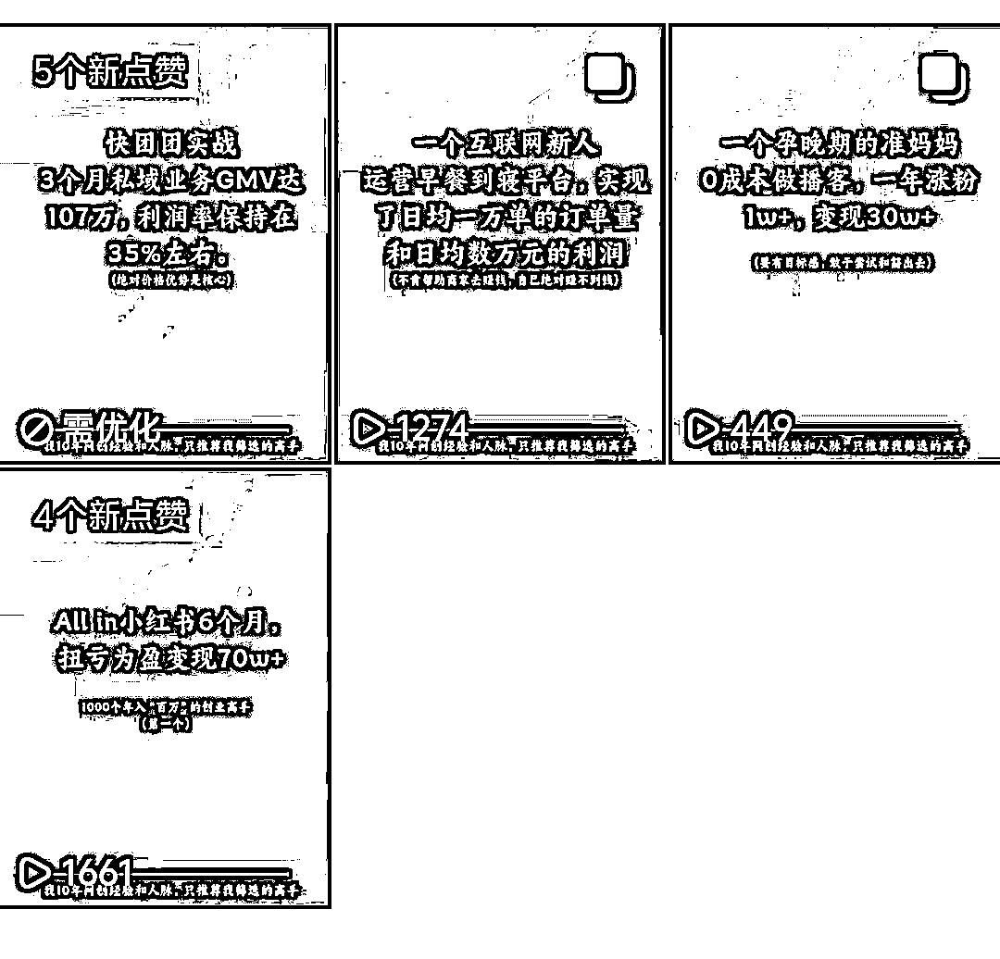
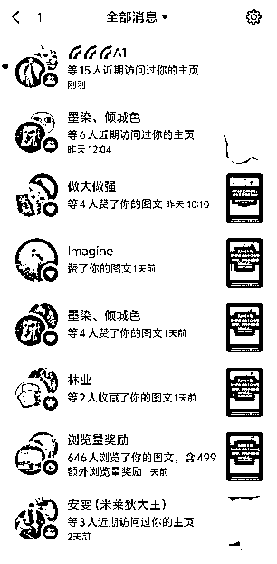
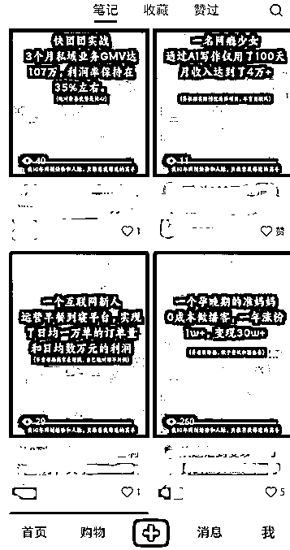
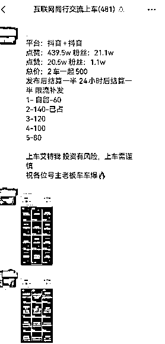

# 中介思维赚钱术，卖人，卖项目，链接高手一起卖

> 原文：[`www.yuque.com/for_lazy/zhoubao/dxgc5kt4tfzcrsxu`](https://www.yuque.com/for_lazy/zhoubao/dxgc5kt4tfzcrsxu)

## (100 赞)中介思维赚钱术，卖人，卖项目，链接高手一起卖

作者： 领飞懂运营

日期：2024-06-26

**大家好！我是领飞！！！**

看过我之前文章的老圈友都知道，我这个人比较喜欢整合赚钱，用中介思维赚钱；

这个月我测试跑了 2 个项目，一个成功，半个成功。

**先讲下：半个成功（卖人）**

加入航海家俱乐部有一段时间了，里面有很多大咖，因为我没有具体的业务模型，又是一个中间商，什么赚钱我卖什么的掮客，所以我只能默默的观察，也不发表任何言论。

说实话，我进航海家俱乐部（一颗龙珠换的门票），有点浪费资源了，也许我一个人创业多年习惯了，不爱和别人主动交流，也从来没有主动加好友的习惯。

很多事物我都喜欢琢磨，琢磨完觉得可行，就去试错，所以我利用航海家俱乐部，产生了一个想法：

**卖生财会员，卖生财大咖，链接生财大咖卖项目**

**我接下来要讲的流程：**大家完全可以去操作，虽然我没完全跑通，但绝对值得大家去做。

**创业的本质是：卖**

**互联网创业的本质是：吆喝**

**成交的本质是：自信**

如果你有一个成熟的产品，你就可以非常自信的去卖，去吆喝（自信是一切成交的根本）

对一个产品的自信，面对客户时候，就有底气；客户见你有底气，也就给他了下单的决心。

往往很多客户在最后下单时犹豫来犹豫去，就是因为销售员没有底气，差一句非常自信的话。

好比：你去三只羊直播购物，有人问“嘴哥”买到假酒怎么办？嘴哥说：去告小杨哥，去告三只羊。

**生财就是一个成熟的产品，一个有自信的产品，全网大众创业平台 TOP.1**

60000 多个付费成员，里面一小部分有结果的人，一大部分是寻求创业选择方向的人，还有一部分是利用资源的人。

6 万多人，多吗？

其实不多，看看像我这样的创业博主有多少，我的粉丝里面就有很多人还不知道生财。

所以：想创业的人，想赚钱的人，不知道生财的人还有一片片，一片片的蓝海，几千万的创业者市场，6 万人真心的不多。

**1、赚生财的钱**

任何的一个粉丝，你发他生财 72 小时体验，72 小时不满意全额退款，只要他能进生财来看，我不敢说 100%吧，至少 40%的人，看眼里就拔不出来了。

40%什么概念？10 个里面 4 个人成交，4✖553 元＝2212 元，这是按照 20%的抽成，如果你一年拉新 100 人以上，又增加了 8%。

提前说明：一定是进入到生财的 10 个人，而不是你引流的 10 个粉丝。

**2、生财有威力**

大家都知道，知识付费最怕割韭菜，先付款后看到，不退款；也正因此生财 72 小时推费，也就打消了客户的顾虑。

未来失业的人会越来越多，骗子也会也来越多，看着吧，连续五年，大学毕业即失业。

文凭不再重要，所以大学生毕业掌握一门技术更重要。

或者说，掌握一门人力技工技术更值钱。

看着吧，8090 后，失业的人会越来越多，人工 AI 智能时代来临。

淘汰大龄，人工智能取代，以及任何单位都要配合政策就业，拿补贴，辞退老员工，招募新员工（就业率就这么来的）。

十年，这十年，骗子会越来越多，为什么？

都想赚钱，那么认知不够的人，占大多数，一门心思渴望钱，渴望赚钱。

意味着都要被割一遍韭菜，或更多，找出口永远都是这样。

好比你来到陌生的环境，总要走错几次路。

所以啊，赚想赚钱人的钱，就是风口。

**3、生财就是项目**

什么这项目，那项目，不都是要引流，找个项目拿来卖吗？

你卖生财就好了，就好比：你代理个品牌去卖，体验好，售后好，知名度高，有保障。

生财就是这样，现在已经是品牌，并且还是刚起步的品牌，也没有代理费的门槛，虽然 7 年了，也只是刚开始。

你帮助品牌赚钱，没有品牌不喜欢你，你说亦人老大，会不会喜欢你，也许你得到的价值会更多，都是真金白银。

很多商业百万粉丝的大佬，卖私董会，卖合伙人，几万几万的收钱，不就是卖他的课程嘛，卖他的私董会嘛。

貌似生财不需要吧！只需要众人拾柴火焰高。

**4、卖生财闭环**

**第一步：成功案例**

把生财这些案例，你做成图文，做成故事，做成视频；那些在小红书，抖音卖小项目拆解的人，你们也都知道吧？

比如：1000 个搞钱野路子，1000 个信息差赚钱

我们就是把生财的案例，做成 1000 个创业高手拆解

如下图：

上面这 3 张图，有 3 个作用：

1、封面吸引

2、成功间接

3、结尾留钩子

其实还少了，具体拆解的内容，因为我为了测试，快速出图，所以就缩减了很多内容。

但是我用 AI，也写了很概要，这些概要能做视频去用，如下：大家飞书自己看吧

[`x87o4rv4xr.feishu.cn/docx/I4NId7OZ6oi7q9xxH9ScKKG4nUe?from=from_copylink`](https://x87o4rv4xr.feishu.cn/docx/I4NId7OZ6oi7q9xxH9ScKKG4nUe?from=from_copylink)

**第二步：版权问题**

所有做的分享内容，都不要拿去出售，也不要拿去赠送，只是做为分享的题材。

虽然有些大咖分享的内容是飞书链接，也不要拿去分享。

一定要尊重版权，虽然很多人卖生财的资料，很多生财博主也愿意你分享飞书链接帮他引流，但是你想赚钱，就一定要有原则。

如果你随意出售了，你随意赠送了，那格局就小了，大概率你也赚不了什么钱，只是一个网络小混混。

**第三步：来之成交**

当粉丝来了之后，他们会跟你要分享素材里的资料，这时候你一张海报发过去，告诉他生财的价值，以及 72 小时退费的担保。

进了生财，你可以搜到分享的内容；到了这一步，基本 40%的成交率就有了。

切记一定要自信的吆喝生财，豪言壮语的告诉他：进入生财不满意 100%无条件退费。

这样的作用是：一方面吸引他，一方面打消顾虑。

**第四步：私域后端**

你看似在卖生财，把生财当作产品卖了，其实还有很大的价值在后端，你发生财的内容是引流，引流了创业粉；

这些创业粉丝，你天天引流，天天卖生财，一手获取了私域创业粉，一手变现卖了好产品。

你一年卖了生财 1000 人，你就能赚了 80-100 多万，第二年还有续费吧，接着赚，看生财会上瘾，这就是好产品的价值。

你卖了 1000 人，亦人老大足够重视你，你随便去参加那些线下聚会吧，航海家俱乐部你也随便进，能链接很多的大咖。

你卖生财 1000 人，但你微信不止 1000 个好友，可能是几万个，之后你链接的大咖，跟他们合作，一起卖项目，你赚的何止是 80-100 万。

**第五步：底层逻辑**

互联网创业最难的是什么？

一定是可长期分享的素材，吸引眼球的素材，引流粉丝后能强力的交付。

做卖生财的项目，素材你有了，根本挖不完；交付超级简单，不用费口舌，72 小时不满意退费。

很多生财的圈友，那些小白的圈友，还没有项目，天天看那些大咖的文章有毛用，你太白了，看了也是自嗨，还真不如，就把我今天的项目去执行下。

**最后：**

本来我想把这篇文案，想先给老大看下，能不能做期航海陪跑，最后还是算了，因为我个人原因，还没有全力以赴去做，收获甚微，所有先拿来分享，看看大家反应。

**这件事情，互利三方：**

对你有利：拿生财赚钱，后期还能赚钱，打后期还能赚钱

对生财有利：为生财拉新，扩大生财影响力，促使生财更好发展

对大咖有利：间接的推广了生财大咖，大咖也感谢你为他们引流。

我做了 2 个号，因为精力有限小测试了下数据，还不错，唯一的缺点就是：违规词太多，还需要优化

**一个抖音号，一个小红书号，一个视频号**

我都没怎么养号，也没实名，我条件有限，没法批量测试号，所以非常粗暴的就把内容发了，所以大家现在看到的数据，并不是很客观，如果你养号一些列都做了，数据会更好。

小红书号：我发出去就会有人点赞，可能权重太低，最后就不推荐了。

抖音号：发出去数据都还行，起码基础流量都达到了。

视频号：4 条内容，有一条爆了 5000 多的播放量。

**总体来说，**需要优化的地方很多，但是小测试的结果还是好的，因为全网没有这样的内容，很少有这样的内容。

我可以预见，今天篇内容发出去，聪明的人一定会执行起来，尤其是一些小的创业博主。

这件事绝对比他们自己卖项目，要更有价值，更有格局。

**再讲下：一个成功（卖项目）**

这个月我写了 18 个【AI 小项目拆解 SOP】，投放互推广告群和小红书广告，卖 79 元一份，10 天时间卖了 900 单收入 5 万，除去广告费纯利润 3 万多。

AI 小项目太多了，分享的人也多，但我发现一个缺现，那些分享 AI 项目的博主，都只讲吸引，不讲流程，不讲技术，不讲制作过程。

他们分享的内容，更大的作用就是吸引粉丝，比如：

今天给大家讲个：AI 绘本小故事项目，这个项目流量非常的猛，这么做，那么做，就是没有讲用什么软件。

粉丝看了之后，只能找他来获取，获取了一份文档，啥也没有了，粉丝看了之后还是一脸懵逼。

**正因为这样的需求，**现在 AI 的小项目也很普及了，那么多博主在分享 AI 项目的赚钱风口，我觉得只要针对详细操作，就能把一份文档卖出去。

做个 IP 卖太费劲了，周期太长，我采用广告方式，去互推群打广告，去小红书小博主打广告，去网站打广告。

这里由于存在我广告的原因，所以我就不给大家展示了。但是互推营销，值得大家去做一下：

同行互推赚钱，领飞之前也给大家分享过文章：大家可以看下

# [《拥抱同行“借势”课》 互 推 • 扩 列，涨粉操盘手 SOP](https://articles.zsxq.com/id_skrvu1ouvgul.html)

这 18 个 AI 小项目 SOP，其实我也没怎么花钱，把一些 AI 的工具整理起来，就能通过那些博主内容，完整的复盘一套流程。

本来我想加入下“AI 破局”找下素材，最后因为亦人老大前段时间发帖，对他们不满意，我这人又很护短，就没给“破局”付费，一切全都是自己摸索，把这些 AI 小项目产生的内容，自己制作了一遍。

**其实很简单，**现在我一天能生产 2 个-5 个 AI 小项目，只要谁分享了 AI 小项目内容，我就去抓取，自己做出来 SOP。

说实话，我不喜欢做小项目，之前我文章我也写过，太浪费时间，还不赚钱，如果你批量不了，绝对赚不了大钱，看下这篇文章你就知道了：

# [一撇公域“年入 100 万”只需要 10 个号；一捺私域“睡后收入”只需要 10 万粉；方可称为一个成功的创业”人“](https://articles.zsxq.com/id_dnawsr8o4xkl.html)

小项目就是拿来卖的，你看那些 AI 博主，他们自己做吗？

基本都说卖课程，卖社群，卖项目。

我没精力重新起盘做个专门的“AI 博主 IP”，只能用中介思维，卖就好了。

**一手搞别人的 AI 小项目，一手买别人的流量卖项目**

我的赚钱方式，就是：掮客

自古以来都有，人总要掌握一种赚钱能力，根据自生的条件最终的一种选择；

比如：我在大西北小城市真的太难了，什么资源都没有，出行都不方便，很多想干的事情都干不了。

所以“掮客”不是我选择它，而是它选择了我。

**下面的 18 个 AI 小项目，我分享大家，大家直接移步到飞书链接。**

由于我之前的内容有广告，我重新排了下版，没有废话，只有方法，你按照方法去做，肯定能出内容的效果；

你拿到之后，可以去操作，也可以去卖，这是第一批 18 个，日后我想到好的“话题”分享文章，再给大家捎带第二批，第三批。

**顺带把我用的“AI 工具包”也送给大家，**小项目合集跟 AI 工具包，你们搭配起来用，我就是用这些 AI 工具做出的小项目。

## 1、AI 绘本项目适合宝妈副业

## 2、AI 小红书猫咪图片引流项目

## 3、AI 儿童英语学习动画制作

## 4、AI 漫画美女舞蹈视频

## 5、AI 制作西游记图片视频

## 6、AI 壁纸号动态壁纸创作

## 7、AI 制作制作 ppt

## 8、AI 公众号爆文

## 9、AI 艺术照

## 10、AI 原创歌曲

## 11、AI 伤感视频制作

## 12、AI 古诗词动画制作

## 13、AI 制作军队视频

## 14、AI 电商图制作

## 15、AI 小说推文

## 16、AI 爆款绘本故事制作

## 17、AI 成语故事

## 18、AI 民间故事

**飞书传送门：18 个 AI 小项目合集（第一批）**

[`x87o4rv4xr.feishu.cn/docx/NYQudhv11oDkUvxSE4RcSmcEnoc?from=from_copylink`](https://x87o4rv4xr.feishu.cn/docx/NYQudhv11oDkUvxSE4RcSmcEnoc?from=from_copylink)

**飞书传送门：AI 工具包**

[`x87o4rv4xr.feishu.cn/docx/TckadgkskogJ5gxRhNrcWlDCnZg?from=from_copylink`](https://x87o4rv4xr.feishu.cn/docx/TckadgkskogJ5gxRhNrcWlDCnZg?from=from_copylink)

**往期领飞生财加精文章：更多的认识我**

[1、如何通过【创业知识博主】原始积累 800 万](https://articles.zsxq.com/id_sckk8imjgqgi.html)

[2、【长期暴利项目】中介思维极致，年入百万项目方法](https://articles.zsxq.com/id_cd7wutqqqa61.html)

[3、【卖服务+卖产品】个人轻资产运营，价值“百万”商业模式](https://articles.zsxq.com/id_msepc8pc7r5m.html)

[4、五年用闲钱买房赚了 50 万，小城市房产投资经验，纯干货！！！](https://articles.zsxq.com/id_s0n9vvaawd1j.html)

[5、【先拼数量，再保质量】一个素人做 IP 写小作文，108 营销方法论](https://articles.zsxq.com/id_2q75vclbo9rx.html)

[6、如何用你的“热爱”，选择创业项目方向](https://articles.zsxq.com/id_vcqr0bwozsqa.html)

* * *

评论区：

老船长李阳 : 写的很实用，我现在也用在用这个方法，不过是个人 ip 模式导流私域在做，暂时一天才几单，感觉没有最大化利用，也在探索更好的模式 🐬Rita : [强][强][强]
旅星 : 强[微笑]，就需要这个呢！万分感谢[玫瑰][玫瑰][玫瑰]
希平 : 很实用，我那么喜欢看生财，刚好能干他
biangbiang* : 太厉害了，看完豁然开朗
柠檬茶🍋 : 挺不错的思路，适合想要快速看到结果的新人。
我现在也是一名新手小白，想在生财认识更多优秀的人。V+Q16633339999
领飞懂运营 : 我正在写《108 个中介思维赚钱术》，下回有机会给大家分享。
小鱼 : 已实操，昨天已经有人来找我领了，谢谢分享[强][强]

* * *