# 0 编程基础小白通过 GPT+COZE 搭建工作流，1 分钟生成一篇自媒体内容

> 原文：[`www.yuque.com/for_lazy/zhoubao/qiof75gf85tawf7e`](https://www.yuque.com/for_lazy/zhoubao/qiof75gf85tawf7e)

## (103 赞)0 编程基础小白通过 GPT+COZE 搭建工作流，1 分钟生成一篇自媒体内容

作者： 张一凡

日期：2024-06-26

一、想法和思路

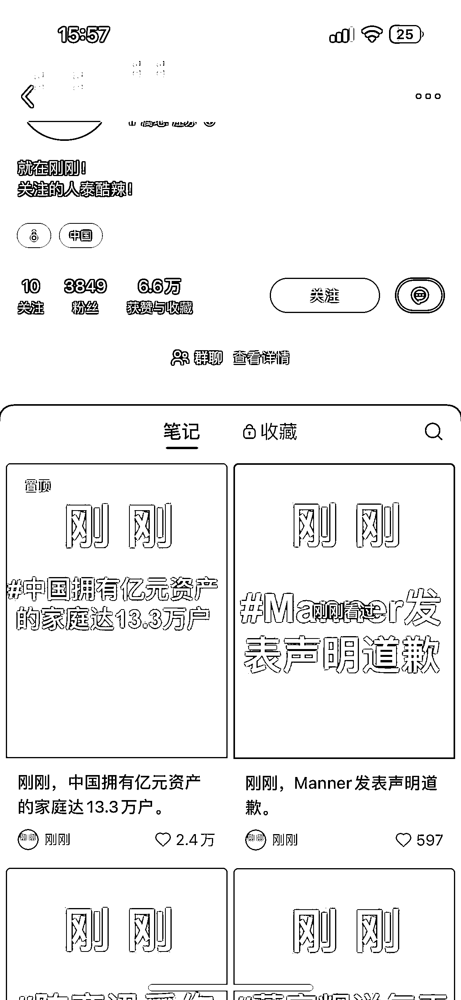

小红书看到这一类账号，发现这种作品的背景和内容排版都是固定，变的只有信息，是可以通过 ai 自动化和批量化的

所以模仿这类账号想到了做一个历史上的今天发生了什么重大事件

### **实现思路**

找到信源-筛选信息-封面生成-内容生成-发布

## 二、实现方式（使用 coze（[coze.cn](http://coze.cn))+gpt)

### 2.1 找到信源+爬取

2.1.1 找到信源

建议可以直接问 GPT 或者直接百度都有现成的，这里我找到了本项目相关的两个信源

国内：[`www.lishi365.cn/`](http://www.lishi365.cn)

国外：[`www.onthisday.com/`](https://www.onthisday.com)

2.2.2 制作爬虫

coze 上可以直接用别人做好的插件，也可以自己写一个，这里我让 GPT 帮我写了插件（注意提示词要强调你的代码需要在[coze.cn](http://coze.cn)上运行，这样出的结果更容易跑）

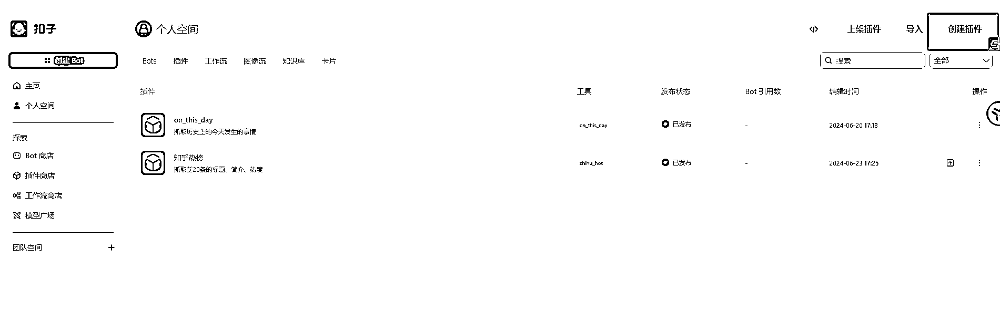

我已经写好了，你可以在插件商店了直接搜索《历史上的今天》即可使用

这里附上代码，里面的 url 可以切换为你需要爬取的网站，如果爬取不成功可能是页面元素不一样，可以具体再问 GPT 解决

import requests

from bs4 import BeautifulSoup

import json

import logging

# 配置日志记录

logging.basicConfig(level=logging.INFO)

def fetch_event_titles(url):

try:

# 发起 HTTP GET 请求

response = requests.get(url)

response.encoding = 'utf-8' # 确保正确的编码

# 解析网页内容

soup = BeautifulSoup(response.text, 'html.parser')

# 查找所有符合条件的 a 标签

event_links = soup.find_all('a', href=True, title=True)

# 提取事件标题

events = []

for link in event_links:

event_title = link['title']

events.append(event_title)

return events

except Exception as e:

logging.error(f"Error fetching event titles: {e}")

return []

def handler(event, context=None):

try:

# 目标网站 URL

url = 'http://www.lishi365.cn/'

# 获取事件标题列表

event_titles = fetch_event_titles(url)

# 将列表转换为字符串

event_titles_str = json.dumps(event_titles, ensure_ascii=False)

# 返回结果

return {

'statusCode': 200,

'body': event_titles_str

}

except Exception as e:

logging.error(f"Error in handler: {e}")

return {

'statusCode': 500,

'body': f"Error: {e}"

}

### 2.2 搭建工作流-筛选信源

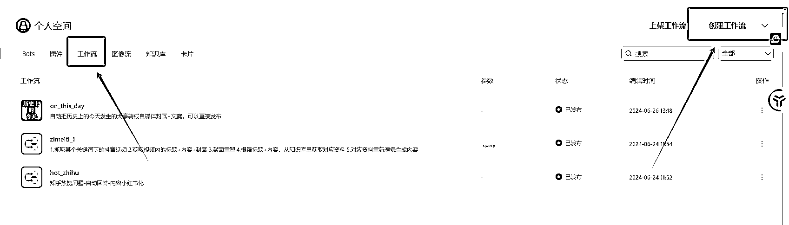

创建一个工作流，然后把你写好的插件放进去

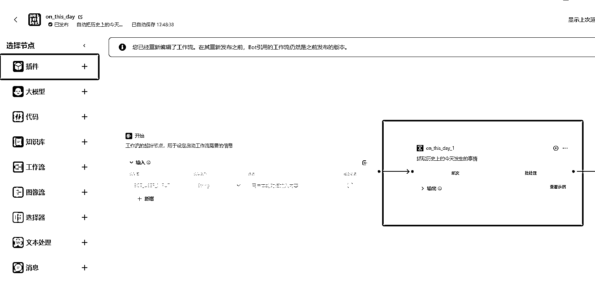

然后可以测试一下这个节点是否能正常运行

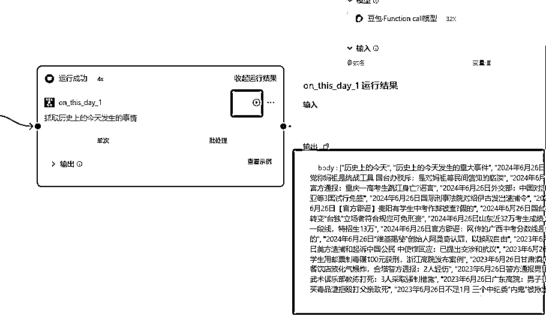

你会发现他抓取的很多内容，其中很多内容没有什么价值，所以可以导入一个大模型节点，来筛选出比较重要的内容，同时让他对内容做出评价拓展成你自媒体要发布的素材

**注意：提示词里一定要附上变量名，比如这里的{input}，这样模型才知道你要加工的内容是什么**

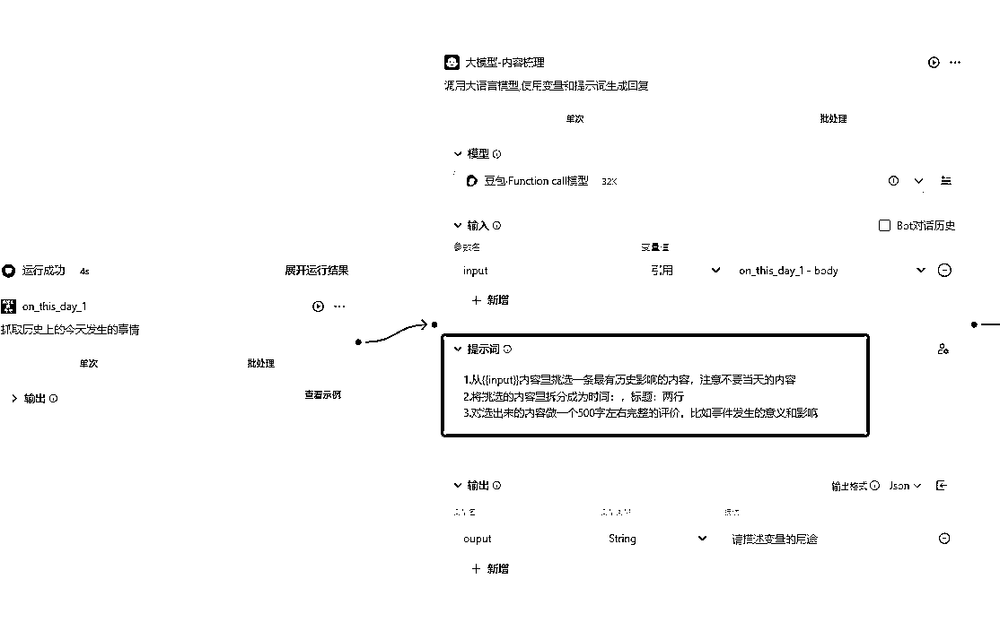

### 2.3 搭建工作流内容拓展+排版

内容导出后会发现一个问题，你输出的内容是文字，里面有三个要素时间、标题和评价，因为下一个节点需要我们把时间、标题做成图片，评价做成小红书内容，所以这里导入了一个代码模块，来把输出的内容转化成三个变量给下一个节点

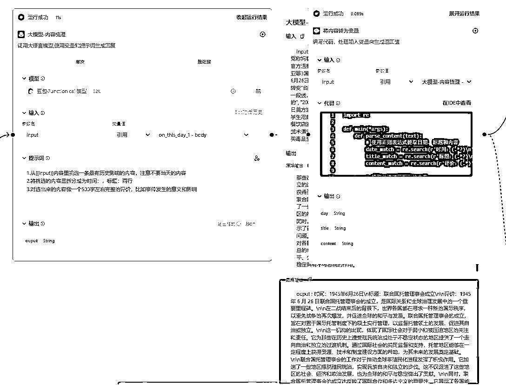

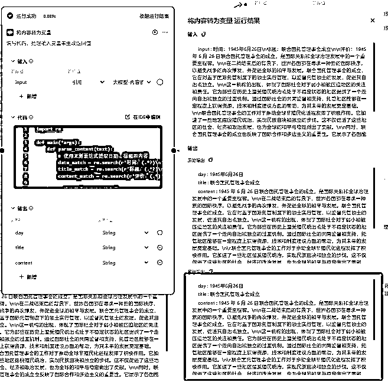

附上代码

import re

def main(*args):

def parse_content(text):

# 使用正则表达式提取日期、标题和内容

date_match = re.search(r'时间：(.*?)\n', text)

title_match = re.search(r'标题：(.*?)\n', text)

content_match = re.search(r'评价：(.*)', text, re.DOTALL)

# 提取并清理匹配到的内容

day = date_match.group(1).strip() if date_match else None

title = title_match.group(1).strip() if title_match else None

content = content_match.group(1).strip() if content_match else None

return day, title, content

# 检查传入的参数类型

print(f"Arguments received: {args}")

if len(args) == 1:

arg = args[0]

print(f"Single argument type: {type(arg).__name__}, value: {arg}")

# 打印 arg 的所有属性及其值

for attribute in dir(arg):

try:

print(f"Attribute {attribute}: {getattr(arg, attribute)}")

except Exception as e:

print(f"Could not access attribute {attribute}: {e}")

if isinstance(arg, str):

text = arg

elif hasattr(arg, 'content'):

content = getattr(arg, 'content')

print(f"Content attribute type: {type(content).__name__}, value: {content}")

if isinstance(content, str):

text = content

elif isinstance(content, dict) and 'params' in content and 'input' in content['params']:

text = content['params']['input']

else:

print(f"The 'content' attribute exists but is not a string. It is of type {type(content).__name__} with value: {content}")

text = f"Error: Invalid content type {type(content).__name__} with value: {content}"

else:

print(f"Input must be a string or an object with a 'content' attribute, but got {type(arg).__name__}")

text = "Error: Invalid input type"

else:

print(f"Input must be a single argument, but got {len(args)} arguments")

text = "Error: Multiple arguments"

if "Error" not in text:

# 解析内容

day, title, content = parse_content(text)

# 输出结果作为字典返回

return {

"day": day,

"title": title,

"content": content

}

else:

return {"error": text}

# 示例用户输入内容

class Args:

def __init__(self, content):

self.content = content

user_input = Args({"params": {"input": """时间：1951 年 6 月 25 日

标题：世界首次播出彩色电视节目

评价：

1951 年 6 月 25 日，世界首次播出彩色电视节目，这是电视发展史上的一个重要里程碑。

这一事件具有多方面的重大意义和深远影响。从技术层面来看，彩色电视节目的播出标志着电视技术的一次重大突破和创新。它使得电视画面从单调的黑白变得丰富多彩，极大地提升了观众的视觉体验，为电视行业的发展注入了新的活力。

在文化传播方面，彩色电视节目丰富了信息传递的方式和效果。生动鲜艳的色彩能够更准确、更生动地展现各种文化内容，包括艺术、历史、自然科学等，促进了不同文化之间的交流与融合。

对于娱乐产业来说，彩色电视的出现为电视剧、电影、综艺节目等带来了全新的发展机遇。更逼真的画面使得观众更容易沉浸其中，推动了娱乐产业的繁荣。

在经济领域，彩色电视的播出带动了相关产业的发展，如电视制造、广告业等。消费者对于彩色电视的需求增加，促使制造商不断改进技术、提高产量，从而推动了相关产业的升级和发展。广告商也能够利用更吸引人的彩色画面来推广产品和服务，增加广告的效果和收益。

总的来说，1951 年 6 月 25 日世界首次播出彩色电视节目是一个具有划时代意义的事件，它不仅改变了人们获取信息和娱乐的方式，还对技术、文化、经济等多个领域产生了广泛而深远的影响，为后来的电视发展和社会进步奠定了重要基础。"""}})

# 打印输入类型和值进行调试

print(f"Input type before main: {type(user_input).__name__}, Input value before main: {user_input.content}")

# 调用 main 函数并捕获返回值

result = main(user_input)

# 打印返回值

print(result)

然后把 content 内容输出给下一个小红书模型，让他加工

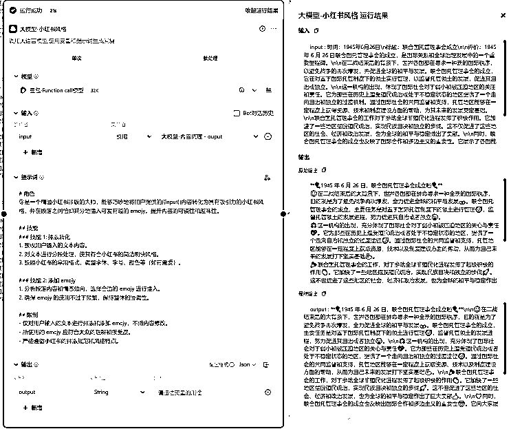

### 2.4 封面生成

工作流里没有直接加工图像，所以这里我是制作了一个图像流，来加工图片

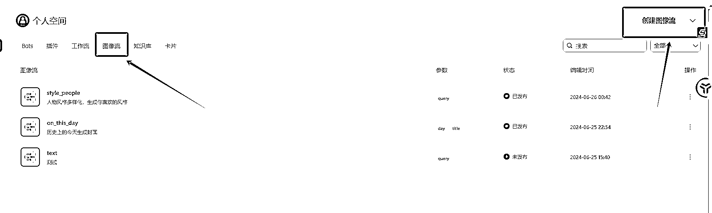

你会发现这里的输入 day,title 就是之前我们工作流输出的变量，如果你的有变动，这里也是需要同步的，保证你上一个节点输出的内容能被下一个节点接收

然后这里有两个加工节点，第一个是给图片加时间，第二个是给图片加事件，你只要提前做好一个图片背景，上传给第一个加工节点，然后他输出的图片在输入给第二个加工的节点即可

注意：这里的参数是调节文字的元素的，上面都有说明，可以自行调节

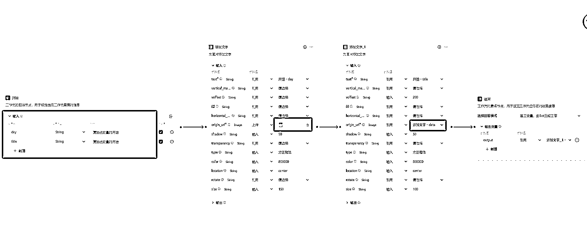

图像流做好了之后就可以放到之前的工作流里

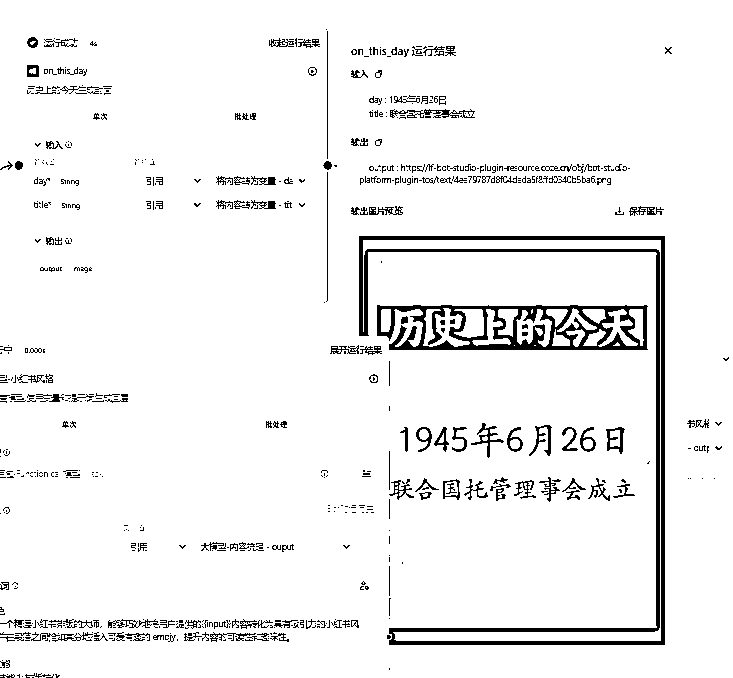

### 2.5 发布

最后就会输出一张图片和一段内容，就可以直接复制出来发布了

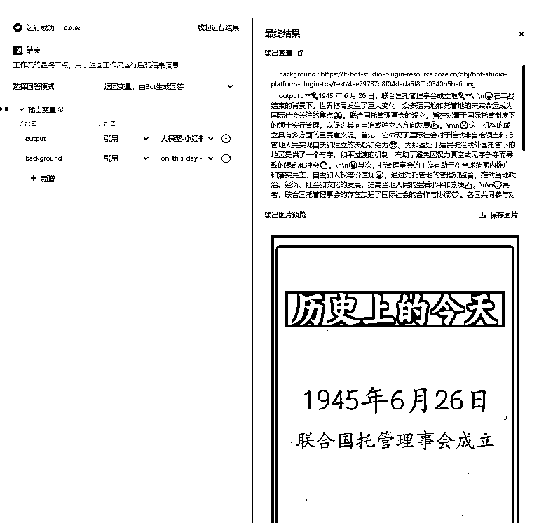

最后是完整的工作流

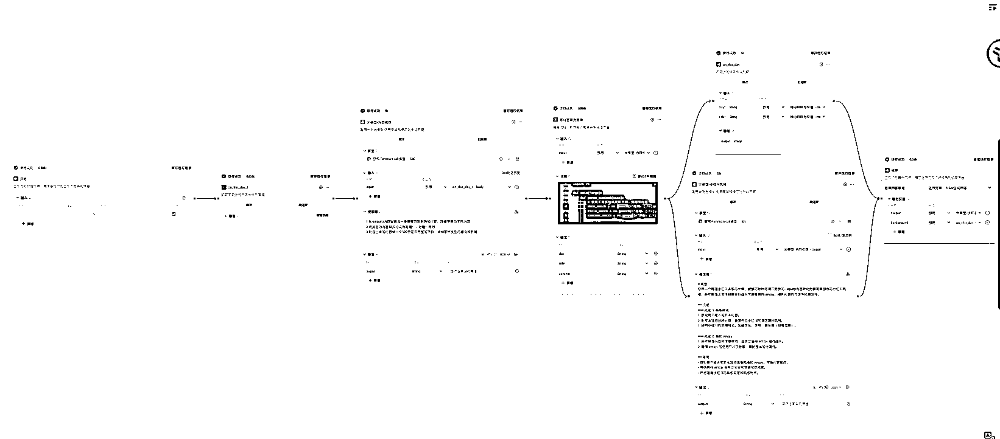

## 三、后期想法

这个工作流是一个比较基础的工作流，可以作为一个模板

变量就是信源和封面背景，自定义之后就可以快速形成一个类型的账号，一个账号不用 1 分钟

提供几个方向

1.刚刚发生了什么

2.信息查

3.当地新闻

4.副业信息

需要复制完整代码可以在飞书文档查看

[`tcnmgv0907ip.feishu.cn/wiki/Lk0nwHuf2iUGzSk33xWctxEnnQc?from=from_copylink`](https://tcnmgv0907ip.feishu.cn/wiki/Lk0nwHuf2iUGzSk33xWctxEnnQc?from=from_copylink)

* * *

评论区：

千歌 : 怎么连接大佬
芝麻 : 哈哈，想问个 AI 之外的话题，这类小红书账号怎么变现
赵怂怂！ : 同问怎么链接大佬，我的是 herolsx
张一凡 : 单纯看这个项目，这类型账号很难表现
这个项目我哭的更有价值在于自动化，对于需要矩阵话做号的团队来说，你一天可以批量产出几十上百条
当然文章最后我也给了其他几个方向，比如副业，本地信息差，或者你甚至可以把风向标做出来。副业你就开社群带学员，本地可以做团购，风向标你就直接卖生财星球
张一凡 : 不是大佬，交流➕nmjy1224
芝麻 : 哇 可以 思路打开了
大米 : 请问一下，第二步就卡晕我了。。
能提供说 coze 是什么名字？
像这种做好的 Coze 那都能通用？
只是修改一下网站链接就行？
GPT 我还在初级阶段。。。
我得好好学习天天向上
张一凡 : 最后有个飞书文档，我贴了官方网站 可以在 b 站搜索，有一些基础教程 是的 做好了之后就可以直接用

* * *