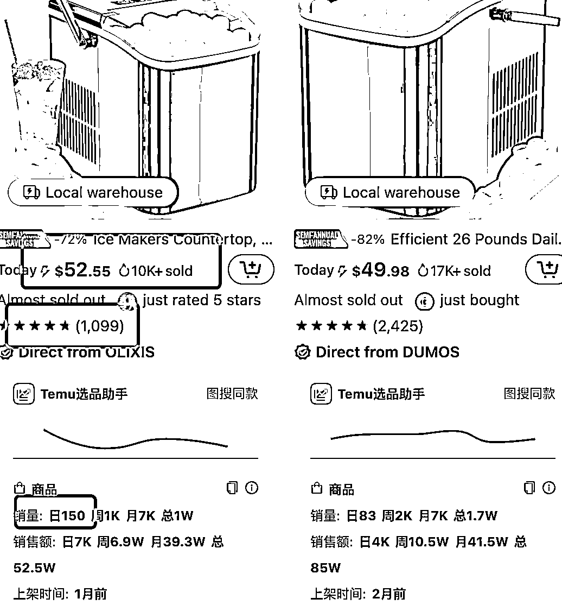

# 新手做 Temu，为何一直拿不到结果？

> 原文：[`www.yuque.com/for_lazy/zhoubao/ycrhovh3m7ykda63`](https://www.yuque.com/for_lazy/zhoubao/ycrhovh3m7ykda63)

## (精华帖)(77 赞)新手做 Temu，为何一直拿不到结果？

作者： 温婉

日期：2024-06-25

之前发了两篇帖子，和大家分享了做 Temu 店能够赚钱的核心，以及 Temu 备货、滞销被退回和库存维护的，后来组了几场关于 Temu 的线下聚会发现，还是有不少个体户老板在研究 temu 的都说赚不到钱，不懂 Temu 的赚钱逻辑。

大家都说 Temu 容易上手，但并不是上那几个品开卖就能等着赚钱，想做好还是有很多东西要注意的，比如我之前提到核价、备货、库存维护，以及接下来今天我要讲的一些关于选品、运营和售后等。

我自己做的店铺比较多，除了做服装之外，也有其他对应的品类店铺，单店月毛利能做到从几 w 到几十 w 不等，给一些老板操盘也能做到毛利过百万，真正做到赚钱，核心是有效的测更多的爆品，把热销品滚起来。

但很多人做不起来，就是因为前期产品卖不动有滞销，热销品价格卷没利润，上的品不够多或者没被选中，被质检退货，导致后期资金出现问题就不赚钱了。

所以，今天和大家分享做 Temu 怎么高效选品、如何运营店铺、找买手和处理各类罚款和客诉。

开始之前，大家先看看这张图：

为什么说是 TEMU 的模式其实很简单呢？那么我们首先要了解全托管的模式是什么？需要去做哪些工作呢？

首先，全托管你可以把自己理解成是给 temu 供货的供应商的角色，那么我们账号下来了之后，需要做的是上品，然后就会进入到买手核价的阶段。

核价出来了之后，这个品有利润的话我们就可以进入到采购的流程，去 1688 上面找到合适的货源，然后采购回来到我们自己的仓库，贴标打包好了之后预约快递就可以发货到仓库了。

后面买家出单之后发货到买家的手里的这个过程我们其实是不参与的。

后面产品卖的话需要我们去补货了，平台也会提示我们需要补货的数量，然后我们就可以按照平台的要求补货过去这样，那么整个闭环可以说就跑通了。

# **一、如何高效选品**

**（1）跟爆款**

跟爆款的意思是，我们去 temu 前台找到平台上面卖的好产品有一定销量的产品，然后跟着别人的款式也去做同样的产品。

首先，我们找到 temu 前台的 bsr 榜单，然后找到日销量大于 50 单的产品，然后毛利 30%左右，产品的评分不要低于 3 分，找到这类产品我们就可以去上架了。

我们可以看到上面的截图，这个是我在 bsr 榜单里面的产品，然后根据我们前期的要求，为什么这里没有让大家一上来就去跟日出千单的爆款。

因为你想到这个如果是爆款的话，一方面就说明这个其实是竞争大的品，也会有很多卖家进来卷，那么如果是没有资源的话，选择去做这样的品的话，没有什么优势的。

那么如果你是工厂的卖家或者是有资源的，前期想要做这一类产品也是可以的，我们还是要根据自己的实际情况去定。

然后选择这种日销量 50 单左右的产品，一个月也是有 1500 单，前期尽量不要选带电还有母婴品类的产品（认证比较多），尽量去选择一些普通一点产品，先跑通整个流程。

然后我们可以去 1688 查看产品的供货价格，这里建议选择毛利率 30%的品，然后这几点都满足的话就可以做了。

**（2）同品类平台选品法（亚马逊，速卖通，shein 等）**

首先我们以亚马逊为例，亚马逊平台已经很成熟了，然后上面的产品也足够多，在美国的认可度也很高。

首先，我们也是要打开亚马逊的 bsr 榜单，然后选择月销量 1K 左右的产品，然后毛利率 30%，评价 3 分以上的，不要做侵权的产品。

我们可以看到上面的截图，我们先去找到 bsr 的榜单，然后找到选择我们要做的类目，类目进去我们就能看到具体的产品 top 100 的榜单，然后我们在看产品的销量，按照我们上面提到的那些条件，筛选出来合适的产品然后上架。

如果大家不想做竞争那么大的就去选择亚马逊的三四级的小类目，这样的类目的产品会有一定大销量，价格上面可能也会有一定的优势。

**（3）差异化选品**

差异化选品是现在我们已经在做的某一类产品，然后如果是利润低的情况下，可以做一些组合的差异化。那么我们的差异化可以是多个尺寸，多数量的或者是组合套装的一些差异。

我们可以看到这类的保鲜盒，就可以做数量上还有颜色上面的差异化的。

比如他卖的是 10pcs，我们去做没有利润的话，那是不是可以考虑做 15pcs，20pcs 或者是 5pcs 的这样，还有就是颜色上面的差异，我们能不能做他这个里面没有的一些颜色呢，这样我们的核价就会比同类的卖家要高一点的。

那么组合差异化就是像上面的这个链接这样，如果是卖水管的话，他的核价利润就低，如果做组合差异化是不是可以考虑加一个袋子或者是一些小的，可以产生关联购买的一些配件呢。

当然这个配件不是我们一拍脑袋就去卖的，我们要去前台搜索，看看买家买这类产品的时候还会购买什么一起下单这样，这样的组合才有意思。

不要凭空去捏造，要基本数据去分析然后在做组合差异化这样。

**（4）平台缺失款**

平台缺失的产品一般这种利润都会好一点的，这个信息可以去看买手的招商信息，还有 knock 群里面的推荐，还有就是有些其实有产品开发的经验的，我们也可以去做这样的产品。

就像上面截图的这些品其实是买手发的正在招商的产品，那么这些品其实是平台缺失的一些款式，那么我们也是可以考虑去上这类产品的。

# **二、TEMU 运营需要注意的几个点**

**（1）产品标题文案详情页面**

我们可以看到详情页面上有图片，标题还有变体的详情信息，还有视频的，有的品主图的第一个其实就是视频。那么我们分别来说。

1、视频：卖的好的品最好有视频，这个视频可以是你自己实拍的或者是买样品回来自己参考平台的视频去拍摄，有些推广活动，带视频的品会优先考虑

2、图片：一般前台展示的 10 张图，然后至少有一张是产品的尺寸图，然后我们可以参考多平台的图片，比如说产品的卖点，有些特殊属性，区别其他的卖家的卖点这些都需要标注在图片上面的。

3、标题：标题我们需要埋一些产品的关键词进去，核心关键词就是这个产品的流量大的词，可以给这个链接带来流量的，然后我们需要把这些词埋到我们的标题里面去的，这里可以借助 google trends 或者是卖家精灵。

我们就是可以根据这个关键词的搜索量还有趋势，还有相关度，然后埋到我们的标题里面。埋词的目的是让算法更好的识别我们的产品，还有就是当买家搜索这款产品的时候，我们的产品可以精准的展示在买家那里。

**（2）买手建联**

买手在 temu 整个的运营中可以说是起到很重要的一环了，因为我们从产品的核价开始还有后面的产品的一些问题，这些都是需要我们去找买手沟通的.

那么如何高效的找到属于自己类目的买手，还有如何高效的去沟通就显得格外的重要了！

1、如何找自己产品的买手呢？

首先是在手机端的 knock 的界面，找到我们产品的 skc，然后去 knock 群的界面去搜索，我们就可以找到群，然后在群里面就能找到相对应的买手。

2、如何和买手高效沟通呢？

首先我们知道买手他的群也很多，每天处理的问题也很多，那么需要处理问题的时候。不要和我们平时聊天那样，买手其实是没有时间看的，那么如何正确的沟通呢？

**是直接发你有问题的 skc+目前的问题+需要处理的结果**，这样更高效，买手也会相应的去处理的。

还有第二种方式就是我们在 knock 群里面去填问卷，因为有的时候不能私聊的情况下，那么填问卷的方式也是高效处理问题的一种方式。

一般群里都会有这样的问卷，我们就可以根据自己的问题去群里填写相应的问卷，这样处理问题也会很高效。

**三、如何运营防止新品滞销？**

首先，平台对我们的新品有一个 7-14 的新品流量考核期，这个是什么意思呢？

也就是说我们上的产品如果是在这个新品期卖的好的话，那么后面大概率会成为店铺的热销款，那么如果一个品在这个阶段不出单的话，那么后面大概率也没有成为爆款的潜质。

所以也就是说产品上架了之后，我们需要做的一个动作就是观察他在这个前两周的出单情况，如果能出单那么说明还可以，如果不出单的话，我们可以考虑去清掉他不做了。

因为之前小泽教练也提到过说，有的品退回来之后，发到其他的账号去反而卖起来了，成了爆款。那么也就是说，我们还想做的品的情况下，可以重新建一个链接，然后再发货过去这样。

**四、如何处理罚款还有客诉问题**

那么现在平台已经改进了，不说所有的品都是 5 倍罚款的：

1、品质分为 90 分到 100 分的产品定义为品质款，如果品质款出现售后质量问题，处罚结果为：不结算该笔订单货款，卖家也不用承担赔付金；

2、品质分为 70 分到 90 分的产品定义为平常款，如果平常款出现售后质量问题，处罚结果为：不结算该笔订单货款，卖家按照申报价格的 1.5 倍承担赔付金；

3、品质分为 60 分到 70 分的产品定义为次品款，如果次品款出现售后质量问题，处罚结果为：不结算该笔订单货款，卖家按照申报价格的 2.5 倍承担赔付金；

4、品质分为 0 分到 60 分的产品定义为低质款，如果低质款出现售后质量问题，处罚结果为：不结算该笔订单货款，卖家按照申报价格的 5 倍承担赔付金；

5、如果是没有品质分数的新品，如果出现售后质量问题，处罚结果为：不结算该笔订单货款，卖家按照申报价格的 1 倍承担赔付金；

6、如果是服饰鞋类产品，由于偏大偏小导致的质量售后问题，处罚结果为：不结算该笔订单货款，卖家也不用承担赔付金。

产品的品质分在后台的质量管理里面其实是可以看到的，所以现在也不是都要 5 倍罚款，所以我们有的针对产品质量也是可以去提升的，减少这个售后率的。

这个是我们目前做到现在的一些经验分享，也欢迎大家来交流。

* * *

评论区：

莎莉沙梨 : 只要有品质售后就是仅退款，还按倍数罚款，售后的成本挺高的
阿祖 : 棒棒哒
李大大 : 你已经一骑绝尘了
希声 : 66666

* * *