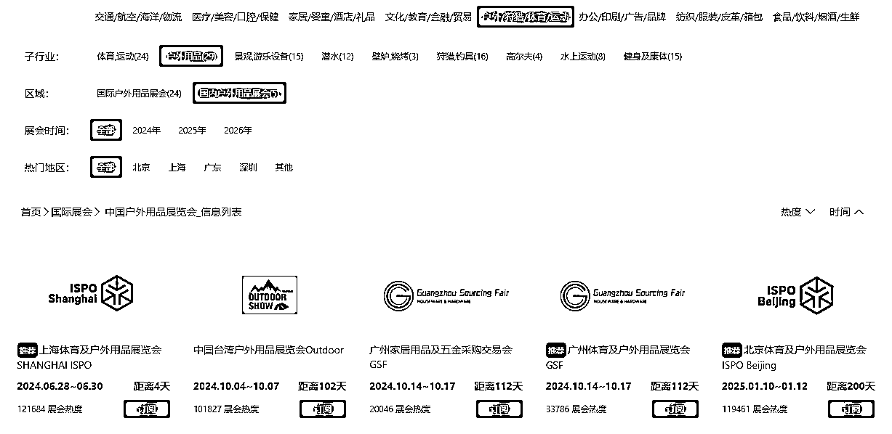
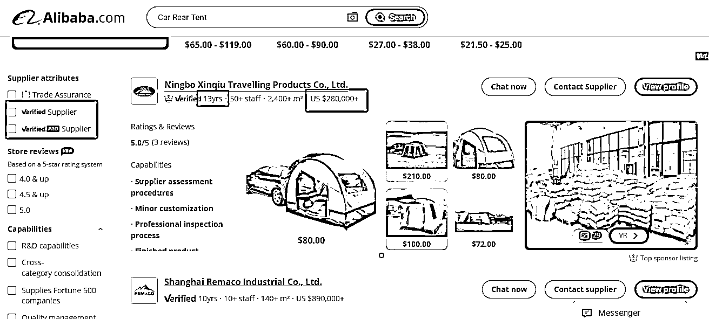

# 亚马逊卖家如何有效挖掘优质供应链（货源）--实战心得

> 原文：[`www.yuque.com/for_lazy/zhoubao/plvrytkfgsy85e7e`](https://www.yuque.com/for_lazy/zhoubao/plvrytkfgsy85e7e)

## (精华帖)(38 赞)亚马逊卖家如何有效挖掘优质供应链（货源）--实战心得

作者： 颜过

日期：2024-06-24

今年年初以来，没有看过 100 多家工厂，也有几十家了，基本都是合适的工厂。有户外的，有儿童玩具的，有医疗的，有宠物的，有个护的，也有家居的，这里面跨了 N 个类目，那如何才能找到合适的工厂，这是每个卖家重中之重的事。

如果你还停留在在 1688 拿货的阶段，劝你早点收手，最近茅台便宜，还不如买茅台。看到有人写如何在 1688 上找到合适的货源？这种推荐不是傻（没有多少实际的采购经验，或是踩的坑还不够），就是坏（一个侵权就搞死了，还创啥业呢）！

为什么前期不建议从 1688，甚至国内的义乌购买货，因为在一个到处是坑的地方，你以为你是“老司机”，实则一个个坑都在等你。故对于新手来说，建议直接从专业线下展会，alibaba，产业带直接找能合作的工厂，切入新品类，或者有大的采购，必须得本人多多跑工厂。

如何找到合适的工厂或产品的源头？

1，如何找展会：那如何找专业的展会呢？这个工具推荐给你，https://www.qufair.com/fl/217-273-0/ ，或者看[`10times.com/`](https://10times.com/%EF%BC%8C%E4%B8%80%E5%AE%9A%E5%BE%97%E5%8E%BB%E4%B8%93%E4%B8%9A%E5%B1%95%E4%BC%9A%EF%BC%8C%E9%82%A3%E7%A7%8D%E7%BB%BC%E5%90%88%E5%B1%95%EF%BC%8C%E5%9F%BA%E6%9C%AC%E5%8F%AF%E4%BB%A5PASS%EF%BC%88%E8%B0%81%E5%8E%BB%E8%B0%81%E7%9F%A5%E9%81%93%EF%BC%8C%E7%9B%B4%E6%8E%A5%E5%B0%B1%E6%98%AF%E4%B8%80%E4%BA%9B%E9%9B%B6%E5%94%AE%E7%9A%84%EF%BC%89%EF%BC%8C%E5%A6%82%E6%9E%9C%E8%83%BD%E5%8E%BB%E5%9B%BD%E5%A4%96%EF%BC%8C%E9%82%A3%E6%9C%80%E5%A5%BD%EF%BC%8C%E9%A6%99%E6%B8%AF%E5%B1%95%E4%B9%9F%E6%98%AF%E7%9B%B8%E8%BE%83%E5%9B%BD%E5%86%85%E4%B8%80%E4%BA%9B%E5%B1%95%E4%BC%9A%E4%B9%9F%E6%9B%B4%E4%B8%93%E4%B8%9A%E4%B8%80%E4%BA%9B%E3%80%82%E5%8F%A6%E5%A4%96%E4%B9%9F%E5%8F%AF%E4%BB%A5%E5%8E%BB%E4%BA%A7%E4%B8%9A%E5%B8%A6%E7%9A%84%E5%B1%95%E4%BC%9A%E3%80%82)，一定得去专业展会，那种综合展，基本可以 PASS（谁去谁知道，直接就是一些零售的），如果能去国外，那最好，香港展也是相较国内一些展会也更专业一些。另外也可以去产业带的展会。

2，如何过滤出 alibaba 上的优质工厂（看带红框的地方）：一看最近销售额（毕竟别人是用钱帮你过滤了坑），二看公司年限（但有些工厂会有几个账号，所以还得具体看他的公司简介），三看产品类目的专业度（有无主打的，还是随大流，啥都做，啥都做，基本是贸易公司，不是说贸易公司不好，而是先从工厂切得为好），四看联系地址（一般工厂至少是几栋几层，不是几零几，不过有些是工贸一体的，可以看看工厂介绍的名字，去国内天眼查查查具体的情况）

3，如何找产品带：如果搜索核心产品词，看到 alibaba 上的公司信息，例如前几页多是宁波的，那大概率可能这类产品就在宁波。不过也不一定。例如前两年就跑过卫浴类产品，佛山的卫浴马桶，很多是来自河南许昌长葛市，很多都是那边生产了，直接运到佛山的；家具也有很多是江西赣州生产的，也是整好，拉到佛山去的。之前产业带更集中一些，现在相对分散了，不过如果多接触几家工厂的老板，有可能另外一个地方的产业带，其实就是这个地方的人整的。例如鄙人的第一桶金，婚纱礼服，很多老板都是安徽六安人，然而最早出名的婚纱礼服产业带，现在依然还是在苏州虎丘。

那找好源头，去了工厂，我们到底要看哪些东西呢？

这里先说个小 TIPS，尽量开个好车，穿得得体一些，如果可以见到工厂老板，尽量找工厂老板聊（因为中小工厂老板就是最大的销售，也是最懂产品和销售的，大工厂就算了，别人也看不上你）。这里有个大概的标准，长期合适我们亚马逊卖家的工厂，珠三角（长三角还要大一些）就是主营业务营收在 3000-5000 万人民币（或 1000 万美金-1 亿人民币的），因为太小，不管是生产，还是管理，还是品质，基本后期或多或少都有问题。切记上头，中国工厂千千万万，选择大于努力（即宁可采购价贵一些，也不要后面动不动因为这因为那亏钱）。

1，看工厂门头，是否整洁，旧一些没有关系，但要整洁，这样从侧面看出工厂老板是在有心经营工厂。如果加上门卫热情，那代表至少工厂业绩还行，工厂老板啥得给钱。如果同行有其它同事，也可以丢两根华子，这里面的信息量会很多的。

2，样品间，只是用来走过场的（切记不要在这里耗费太多时间，至少可以往生产车间看完后，再回来），主场应该是生产车间（有无竞争对手的产品在做，尤其是国外的品牌，如果是大部分货都是做国内，那就直接先 PASS 或待定，量如何，工人是否多（另外也可以看熟练程度），工厂堆头是否有组织的堆放等---品质能不能抓好，其实就看这里了），仓库（成品及原材料--也是看竞争对手的好地方，如果可以，拍拍照，不过很多工厂，都是只看，不能拍，那就随手发个消息给自己，把品牌记下来），尤其是前面几次去工厂，第一次肯定最重要。

3，生产工艺，有些工厂其实就是做一下粗加工，再组装而已，这样基本加价比较厉害，品质也待定。如果有自己生产产品原材料的，就看机器模具多不，看在运作的，放在那里不算。这里可以问细一些，可以问业务员或老板（有些老板出身是搞技术的，也有些是搞销售的，但对自己专业品类，还是很了解的）。

这里怎么快速让自己成为专家级别的提问高手呢？

用 AI，或看亚马逊后台的评论分析，把你的类目的销量高的 ASIN，看看他们的差评有哪些，然后把这些点记下来几个，问问工厂是如何改进的？基本问多 2-3 家，就知道哪家专业，哪家水货了。甚至有些工厂，你都知道他们有无真正在做产品。

4，实验室，这个分不同的工厂，还有品类的不同，不过稍微大的工厂，产品再不复杂的，至少有个跌落测试的。设备的专业度，还有是否最近在做测试，还是只是放在那里做个摆设。这个地方某种程度上，也是代表工厂对自己产品品质的要求。

5，工厂的认证，可以喵一眼，尤其是证书日期，或有无在做的目标市场大品牌的。因为这个有肯定最好，但也不能全信，因为这些认证是实验室数据，不代表你未来出货的品质，而且很多还是可以塞红包过的。所以看看工厂是否在做欧美市场，有无做一线顶级品牌的货，还是做的商超货，这两个渠道，大部分产品品类代表两种截然不同的品质要求。

6，最后可以问问老板去年的欧美的业务量如何？有无做大品牌，也是帮我们在扫雷。另外样品间陈列整洁的，尤其是能按照欧美品牌的产品组合来陈列的，还有一整面墙是欧美老外客户的合照证明的，这样的工厂做欧美市场的货一般不会太差。另外还有最后一个小 TIPS，如果工厂的画册的风格做得很欧美，也不用担心至少款式不会太差，不过这样的工厂，至少鄙人看了这么多工厂，能有 5%的比例，就相当不错，大部分工厂还是贼普通的。如果有时间和机会，建议大家多去看香港展会，找台资或港资的贸易商，看看他们的画册里，产品组合推荐，你会发现一个新天地。

* * *

评论区：

Rocky : 这有什么实质内容吗？就加精，搞不懂。
十二 : 这还不是精华？提供了 10-100 放大的思路

* * *