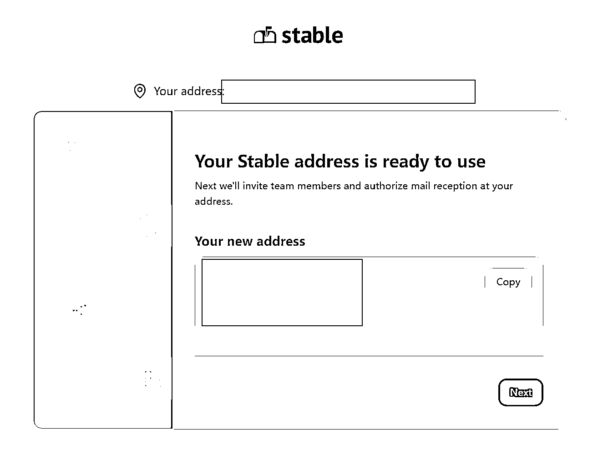
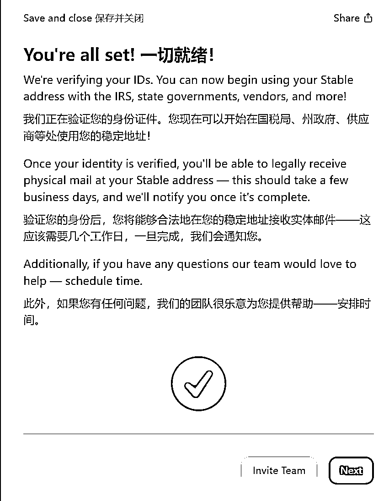

# 拥有一个美国商业地址有什么作用？

> 原文：[`www.yuque.com/for_lazy/zhoubao/luxzs5nfvdx40v8p`](https://www.yuque.com/for_lazy/zhoubao/luxzs5nfvdx40v8p)

## (13 赞)拥有一个美国商业地址有什么作用？

作者： 希声

日期：2024-06-27

# **拥有一个美国商业地址有什么作用？**

1.**提升品牌形象**：一个美国商业地址能让企业看起来更专业、更国际化。

2.**合法合规**：在美国开展业务（比如注册美国银行，信用卡等）时，许多法律文件和银行业务都需要一个本地地址。

3.**隐私保护**：通过地址租赁服务，可以避免将个人住址暴露，保护隐私安全。

4.**接收邮件和包裹**：一个美国商业地址可以用来接收来自客户、银行、服务商的邮件和包裹或者是信件。

这种提供地址来接收信件包裹的服务商很多，也有许多性价比更高的。

但是大多数服务商的地址在提交给银行认证的时候，银行是不认可的。

而今天介绍的这一家，价格比较贵，但地址是被银行认可的商业地址。

今天要介绍的美国商业地址服务商 stable 的注册教程。

# **注册所需材料**

一个美国公司。

个人护照。

邮箱。

信用卡对账单。

# **收费标准和优惠注册链接**

最低 49 美金一个月。

如果需要注册可以联系我，有优惠链接可以节省 20%。

# **注册教程**

打开网站[`dashboard.usestable.com/`](https://dashboard.usestable.com)。

打开网站。

填写名字，邮箱，下一步。

选择地址。

因为我的美司注册在 wyoming，所以我这里也选择了 wyoming。

好吧，提示没有，那只能换一个了。

两个套餐，一个 39 美元，一个 71 美元。按月付费。

因为我使用了别人给的折扣码，所以有 20%的优惠。

填写信用卡信息。

个人信息会直接自动填充。

最下面一栏的“你从哪里听说我们”，随便选一个。

地址出现了，直接复制下来。

这一步是邀请团队成员，没有的话直接下一步。

如实填写公司的信息。

填写个人信息。

一般就填自己的真实英文拼音，职位写 CEO。

下一步，需要验证个人信息和地址证明。

这里我选择护照来进行验证。

先把护照照片传上去。

ID number 就写护照号码。

签发州写省份拼音，国家写 China。

还要再上传一张手持证件照片。

下一步，还需要提供其他材料证明。

有下面这些可选：

这里我选使用“驾照”来证明。

我使用的是“国际驾照翻译件”的照片传了上去，而不是我自己的驾照。

这东西支付宝上面搜索就可以办理，一周左右办好寄给你，好像不用钱就可以办理。

蛮有用的东西，可以尽快去办以备不时之需。

但是要注意，这东西也有有效的到期时间的。

签名，点击绿色按钮就行。

完成。

接下来就等待审核就好了。

审核成功后就会收到一封如下的一封邮件，账号就可以正常使用。

后台也会有提示：

**如果分享对你有帮助希望点个赞哦~**

**————————**

**我在生财的精华文章**

[跨境创业？新手下场前必看的赚钱指南！](https://articles.zsxq.com/id_n97vrpiahx5w.html)

[一个工具管理 100 个 fb 社媒账号？指纹浏览器使用全攻略！](https://articles.zsxq.com/id_u2ub0iv60p1g.html)

**我在生财的其他文章链接：**

[快速分析一个产品在海外有多大市场？B 端和 C 端市场分析](https://articles.zsxq.com/id_nh64drgxukw8.html)

[1 天内如何启动电商/外贸/跨境网站？ChatGPT 来助力！](https://articles.zsxq.com/id_1azlnfovac6q.html)

[白嫖！3000 元的谷歌广告优惠你要吗？](https://articles.zsxq.com/id_sa1bz4dckqeq.html)

[Etsy 注册最新最全指南！一文回答如何注册、需要哪些材料、如何避免封店、如何申诉](https://articles.zsxq.com/id_590wii7jr4iu.html)

[批量做小红书图片/视频的方法-canva 批量创建](https://articles.zsxq.com/id_pnpv1g2m5fi6.html)

[一个 ChatGPT 高效使用技巧—编辑原有内容](https://articles.zsxq.com/id_5twbrd3idlbw.html)

[效率飙升！跨境电商领域的 ChatGPT 应用指南 v1.0](https://articles.zsxq.com/id_7wu5dtpkh4m4.html)

[《零编程知识怎么在 AI 帮助做一个贪吃蛇的游戏》](https://articles.zsxq.com/id_nqxxc79whz1t.html)

[快速获取谷歌 SEO 流量的一个策略](https://articles.zsxq.com/id_txli3kufpvig.html)

[ChatGPT 4.0 新功能，让你的数据和设计工作事半功倍！](https://articles.zsxq.com/id_it0blu6we0p4.html)

[打造转化率页面的 13 个技巧大公开](https://articles.zsxq.com/id_ohdbfoxwndkx.html)

[什么是跨境电商独立站？有哪些运营模式？](https://articles.zsxq.com/id_3lz2mf370csx.html)

[公众号想要 10 万+？试试这几招！](https://articles.zsxq.com/id_4mnsrw79as1d.html)

[《新手如何入场 Tiktok》—Sky 老思的直播记录](https://articles.zsxq.com/id_d7qg98gocnvh.html)

[4 个技巧获取无限个邮箱账号！](http://xn--4!-hy2ca373eyfm37d9uii0h032dppse2zzfk0zt/)

[新加坡有哪些商业机会？-附 2024 新加坡免签入境指南](https://articles.zsxq.com/id_7q5dj0lt0tjq.html)

[免费批量搞定 Canva 的 VIP 账号](https://articles.zsxq.com/id_hkn02uwf6b1e.html)

[保姆级教程！注册 Midjourney 并开通付费订阅功能](https://articles.zsxq.com/id_gnm2x96buu9t.html)

[跨境电商的 ChatGPT 应用指南全集 v3.0](https://articles.zsxq.com/id_eh50cr4chn8a.html)

[跨境新蓝海！中亚跨境机会分析](https://articles.zsxq.com/id_8s8j1u8fojb1.html)

[生财的 12 种搞钱思维，人人都能学会](https://articles.zsxq.com/id_9ozhgeqn0foi.html)

[亚马逊 OA 是什么？普通人还能入局吗？](https://articles.zsxq.com/id_e47s0fvjhsvc.html)

[立省 2000！ICP 备案图文教程](https://articles.zsxq.com/id_ne3gs4m8s051.html)

**我在生财的读书笔记链接：**

[《段永平投资问答录-商业逻辑篇》精华金句摘录](https://articles.zsxq.com/id_xrltpwocer4p.html)

[《段永平投资问答录-投资逻辑篇》精华金句摘录](https://articles.zsxq.com/id_2k5d3mdace44.html)

[《穷查理宝典》精华金句摘录](https://articles.zsxq.com/id_er7b3dm8lx7w.html)

[《华与华品牌五年计划》精华金句整理](https://articles.zsxq.com/id_objd6xv8dd9p.html)

* * *

评论区：

暂无评论

* * *