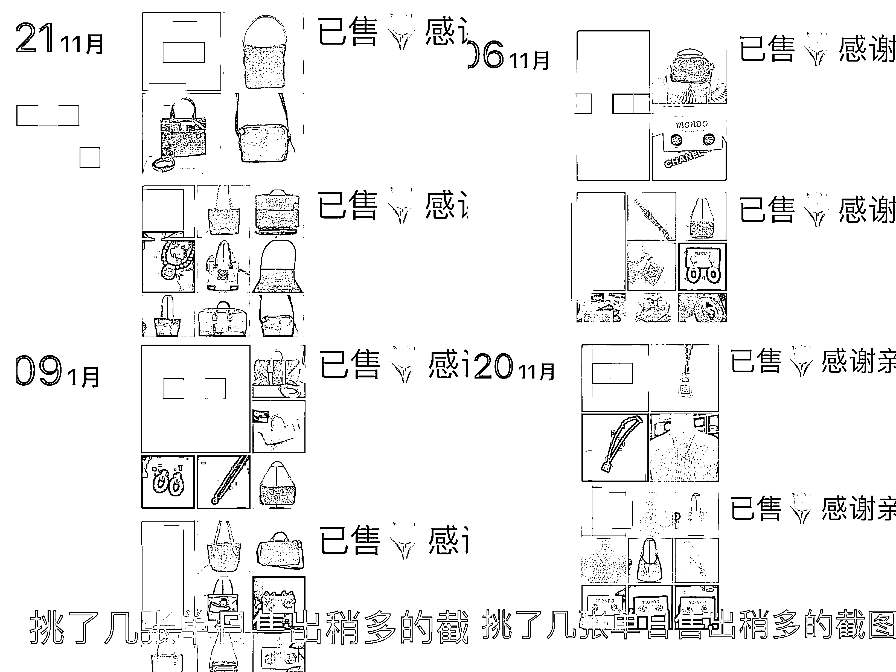
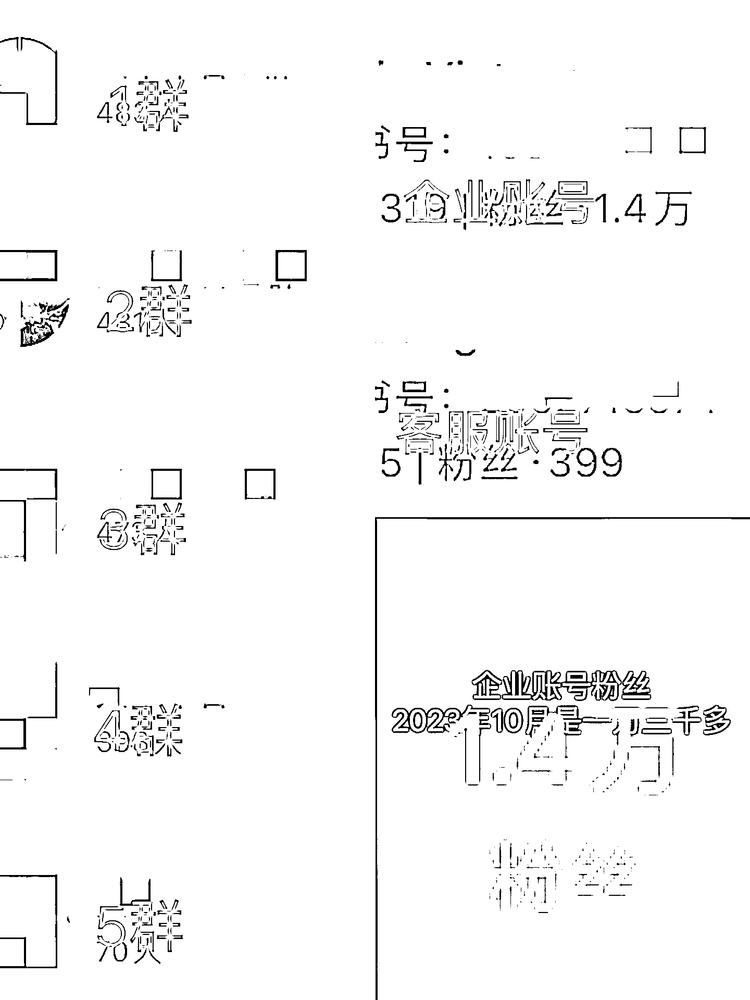
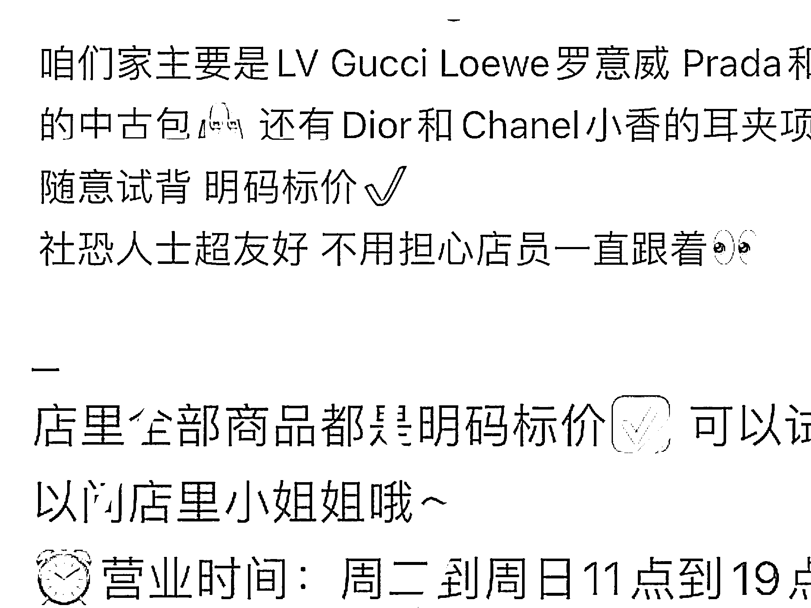
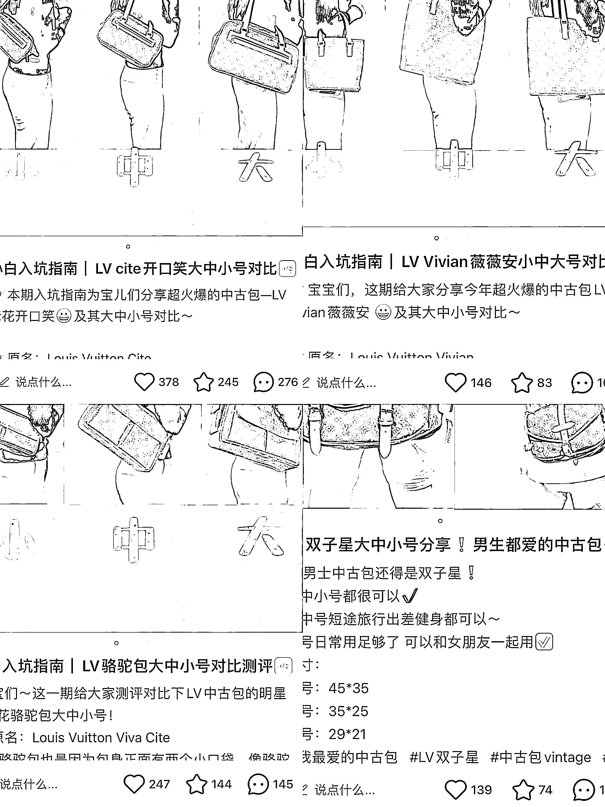
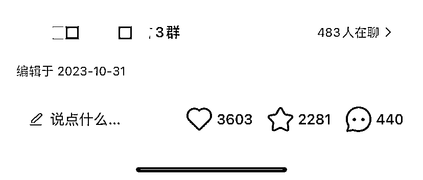

# 千粉怎么做到 GMV200w？把一类人群做透，爆品多发

> 原文：[`www.yuque.com/for_lazy/zhoubao/avtth6lck118gno1`](https://www.yuque.com/for_lazy/zhoubao/avtth6lck118gno1)

## (精华帖)(117 赞)千粉怎么做到 GMV200w？把一类人群做透，爆品多发

作者： 芝慧

日期：2024-06-27

发现一个品爆了，就得抓紧机会冲，以各种形式多发！！！

我之前是运营线下中古店的，刚开始做小红书运营时，在测品时发"男士中古包"和"罗意威"这两个异常值数据反馈挺不错的，就疯狂找类似"罗意威中古男包"细分选题，或者是换个形式持续的发笔记，像"通勤中古男包"、"6 只罗意威斜挎包”等。

靠这样持续的发爆品，不仅积攒了很多粉丝，引流很多人到微信，还把低粉账号做起来了，实现单日 GMV 最高 7w+的成绩。

后来想了想，其实我一个人能做出成绩靠的就是把人群做透，持续发爆品。今天也想趁着这个机会，和大家分享一下，中古店长的我做小红书账号成功的经历，希望对大家有所帮助。

哈喽！大家！我是芝慧，待过小厂，考过健身教练资格证，做过小红书珠宝、中古二奢、境外旅游，一个半月减过 17 斤重……喜欢折腾但是好像也没折腾出什么来，不过还在路上！

## **一、项目概况**

因为喜欢中古，在 2021 年 10 月到 2023 年 10 月机缘巧合成为了一家佛系中古店的店长，绝大部分时间，店面就我一个工作人员，还有一个佛系老板负责游山玩水，偶尔就在拍卖网站买买中古包补充一下店面货品。

我的工作主要是负责店面运营、日常销售等事宜，期间顺带接手运营了 1 个小红书账号来引流变现（接手的时候账号发了 9 篇帖子+1 篇抽奖关注活动帖子，大几百粉，转化较少）。

「以下数据均截止 2023 年 10 月」

**1、变现数据：**最高的时候单日 GMV7W+，2022 年 GMV200W+（包括小红书引流微信成交+小红书引流实体店成交）；

**2、小红书账号布局：**1 企业账号+1 小客服账号（回复敏感信息引流微信）；

**3、小红书企业账号数据：**1.3w 粉+5 个小红书群聊两千多个群友；

**4、微信账号数据：**第 1 个微信 9000 多好友+第 2 个微信 1000 多好友（精确数据没留存，在 2023 年离职的时候，微信好友是一万出头，截图是第一个微信最近的数据，流失了一些）。

## **二、流量从哪里来**

**「在确定流量从哪里来之前，需要了先解产品是什么，受众在哪里以及我们要展示什么优势」**

**（1）产品**

我们主营的是 3000—7000 元左右的中古包（二手大牌奢侈品包），基本是八九十年代和零几年官网已经停产的款式，这也意味着年代久、流通数量较少，很多款式只有几只。

二手奢侈品行业几个概念：

中古包：八九十年代或者零几年的二手奢侈品包，官网已经停产，目前专柜不在售，成色（新旧）相对现代款普遍旧一些，很多款式数量较少，可能一个款就几只，每只成色新旧不一样，所以哪怕款式大小一样，价格不一是正常的。

现代款：一几年或者目前官网还在售的款式，年代较近，流通数量比中古款多，成色可选空间大一些。

原始成色/非原始成色：二手奢侈品因为是二手的，所以会存在使用痕迹，有一些瑕疵，所以会有一些商家护理好了再售卖，这种护理过的就是非原始成色，没有经过任何护理的就是原始成色。

**（2）受众**

基本是二十多岁到 45 岁左右喜欢中古或者了解中古，有品味要求，消费能力较高的女性群体为主！部分喜欢中古、有穿搭要求的潮流男生。

**（3）平台**

确定好了产品基本情况和受众之后，受众在哪里，我们就去哪里！

毫无疑问还得是 red book 呀～因为我是顺带运营，平时还需要做销售、店长等工作，所以在运营上没法投入太多时间和精力，像视频类产出时间较长制作成本较高的就没有考虑，所以我们最后确定先以图文的形式做 1 个小红书账号。

**（4）优势**

二奢或者中古市场前几年存在一些现象：

1、商家朋友圈或者实体店或者小红书明码标价的商家很少；

2、店里购物营业员时刻跟随介绍情况稍多；

3、存在线上购买隐瞒瑕疵的情况；

4、部分商家存在商品护理过非原始成色不告知；

5、真假问题。

以上这些现象对于一些客户来说，无论是心理压力还是购物成本都会增加，需要问价才能考虑超不超预算，要不要购买。

所以我们无论在线上还是线下要展示的优势就是（红色字体为需要特别突出的区别优势）：

1、明码标价：包上挂价签+朋友圈写明价格+小红书问价评论区回复大概价格，私信回复准确价格；

2、原始成色：全部商品真是原始成色（护理这块有利有弊，不护理中古款确实成色大多没有很新，影响转化，但是在朋友圈以及线上都把这个标签打出去）；

3、自助式购物🛍️：线上推广着重提及这个标签🏷️ ，线下客户进店热情打招呼，并说明可以试背，商品都有价签，需要帮助随时询问；

4、360 度展示细节：如果是线上购买拍细节非常细致（大几十张图+视频），当然拍拍太细也影响转化，但是售后问题非常非常少，不闹心；

5、真假问题：提供中检挂签+支持复检+老板就是鉴定师+走闲鱼验货宝+实体店。最基础的保障还是要展示出来。

「线上展示优势充分利用每一个能展示能露出的地方，这都是提高信任提高转化的钩子🪝：比如微信简介、小红书简介、店面推广帖子里写明、探店博主帖子里写明、评论区、群聊、背景图……」

## **三、小红书运营的几个阶段**

**（1）第一阶段：博主探店+小红书账号推店推品同时进行**

**1、博主探店**

实体店为了更多得到曝光，吸引客户来店体验消费，找了十来个博主来探店！因为预算有限，筛选博主要求如下，主打一个性价比高，大家可以根据预算去调整：

① 300—2000 粉；

② 报价 100—500 元；

③ 大多帖单篇赞藏评总共在 200 以上，且发挥稳定，不能偶尔几篇小爆，其他赞藏评几个十几个几十个；

④ 真实评论不少于 30，越多越好（潜在消费性评论代表有转化意向，很重要）；

⑤ 潜在消费性评论：比如说"这家店在哪个位置呀、价格贵吗，都是正品吗，有哪个款吗……

⑥ 可以在一些节点之前强推一波，比如五一、十一等假期之前。

辅助操作：合作的探店博主发帖之后，在评论区艾特企业账号并置顶🔝（平台检测可能置顶不成功），企业账号在帖子下评论店面信息（包括主营业务、优势、实体店地点、营业时间等），评论尽量精准突出，不要冗长！

**2、小红书账号推店推品**

想要更多流量，就得先让账号活跃起来，提高账号权重：

① 每天刷中古相关帖子小红书 1-2 个小时，期间点赞、收藏、评论、关注、转发（类似养号）；

② 发一些有实用价值的干货分享帖子（比如 LV 双子星大中小号对比分享/LV 开口笑大中小号测评……），通过给予价值来吸引点赞收藏关注和评论，当时干货类型更容易被收藏；

③ 发店面的推广，封面图要有美感的同时尽可能多展示产品，比如封面图上一眼就能看到有十几款包，一般比一款包的点击概率要高，推店面还能带动一点线下流量；

④ 刷了大量同行帖子，收藏了很多可对标的账号和内容之后就可以慢慢对标来制作自己的帖子（对标选题/选品/封面/标题/文案/图片拍摄/话题标签/发布时间等），慢慢开始拍照发品，在这个过程中也培养了自己的网感，对于中古行业爆帖有更高敏感度。

**（2）第二阶段：测爆款+爆款重复发+挖掘更多爆款**

一篇爆款带来的价值远远比 100 篇不爆的帖要高得多，所以发小红书就是要研究制作出爆款，哪怕是小爆款。

在第一阶段慢慢发了一些帖，慢慢发现有几篇标签"男包""罗意威""Prada"的数据反馈比较好，于是我就开始针对这几个标签重组制作帖子发（以下举例都是一种思路，并不是精确操作）：

1、罗意威男包合集（6 款数据反馈较好的罗意威男包展示，封面用拼图形式全部展示出来）；

2、Prada 男包合集；

3、6 只通勤男包推荐（可以装下电脑、适合通勤的大容量男包💼）；

4、6 只罗意威中古包分享（男包女包不限，品牌集合）；

5、3000 可以入手的中古男包分享；

6、之前爆过的包款立马换一种拍摄形式重新发；

7、之前爆过的单品重新换一种形式发，比如把它放进集合里发；

8、如果推店数据反馈好那就接着隔三差五推店，不用局限，什么数据好发什么。

…………

思路太多，总结就是数据反馈较好的品或款换个形式或者延展一下再发，保证数据的同时还能测出更多爆款！

比如 Prada 一只男包小爆，我紧接着发 6 只男包合集，评论区有没有询问问较多的其他款，如果有恭喜你发现又一只潜力包，那是不是可以把这个款再拎出来单独发或者凑其他合集发！

"我们刚开始没有建小红书群聊，后面下面这个帖爆了，一下子拉了 3 个小红书群聊（每个群聊基本满员 500 人），爆款的力量无穷∞"

**（3）第三阶段：中古男包同行增多，互相参考挖掘更多爆款+充分挖掘小红书群聊价值**

我们账号靠着男包、Prada、罗意威做的还不错的时候，就开始有部分同行也开始做中古男包的小红书账号，竞争变大！

加上中古包很多款式只有几只，甚至有很多卖了一只就没有下一只的情况出现，一篇帖子的转化价值没有像标品一样能实现最大化！

所以目前这个阶段的重点基本就是参考同行挖掘更多爆款+充分挖掘小红书群聊价值：

**1、参考同行挖掘更多爆款：**

参考同行帖子数据，如果有爆款及时反馈给拍品找货的老板，让他找同款或者类似款或者有爆款元素的款式；

参考借鉴同行数据较好的爆款选题、爆帖图片拍照形式；

**2、挖掘小红书群聊价值：（当时我们有 5 个小红书群聊，两千多个群友）**

发帖之后转发群聊里，引导其评论（如有喜欢的可以在评论区直接问价），多少拉动一下帖子数据；

不定时用小号发一些合集的图到群里，比如五千内的 LV/罗意威男包/新品预告图等；

不定时用小号发微信号（谐音/录屏/表情包等）到群里，并且通过钩子（近期满减活动/微商相册明码标价可以分类看更多款式）引导他们添加；

偶尔发一个比较热门的款式到群聊，附上一句话"上次哪个亲找的这款终于有货啦，可以斯我哦！价格是 XXX，比上次那只还低几百"，制造抢手且价低感引导转化。

总而言之，就是用各种方式引导群里客户+微，实现更多转化。

**（4）第四阶段：小红书矩阵+小红店铺+小红书直播**

这几年涌入的同行越来越多，比价越来越严重，小红书管控越来越严，消费力逐渐降低，2023 年转化也明显降低。所以这个阶段主要就是放大小红书，多做账号做矩阵，顺应小红书趋势，开店铺做直播。

**1、小红书矩阵：**

✅企业账号：继续目前的账号，男女包都发，图文形式；

✅个人 IP 账号：真人出镜视频形式，包包分享为主，非科普干货或者鉴定知识类型，我们没优势，鉴定师有其他业务（由于佛系老板不愿出镜个人 IP 账号至今没做🥹）；

✅中古男包账号：图文形式，在企业账号男包爆帖的基础和经验上去做去选品拍照📷（发了十几篇，我离职之后就停滞了）；

✅小客服账号：继续用之前小客服账号，目的就是引流。

强烈建议大家先跑通一个平台一个账号实现 0-1 之后，深耕这个平台去做纵矩阵，小红书 1 个账号实现变现转化之后，迅速做小红书矩阵，多做账号！

**2、小红书店铺+小红书直播：**

顺应小红书趋势，开了小红书店铺，尝试了 2 次小红书直播。

⚠️后续因为要回老家所以停止合作！

**‼️****重要：引流微信**

无论在哪个阶段，做小红书商家账号就是为了变现，所以引流微信非常非常重要，但是小红书管控引流非常严，关于小红书如何尽可能安全引流的方法小红书航海手册里写得很清楚，大家可以看一下！

建议一个小客服账号专门在小红书群聊+私信+评论区回复敏感信息，违规了没关系，引流的账号就是用来做贡献的，一个引流账号废了就下一个引流账号接着来！

## **四、在小红书做起来的差异化**

**（1）选题延展，充分挖掘爆款选题价值**

对于我做小红书运营来说，第一次尝试发"中古男包"这个选题，发现数据反馈还可以，就立马挖掘这个选题的强相关话题，充分挖掘这个爆款选题的价值！而不是重新寻找不相关的其他选题。比如细分选题（从大到小）+扩大选题（从小到大）

**1、细分选题：**"中古男包"这个点由大到小测出"罗意威中古男包"、"Prada 中古男包"、"通勤中古男包"、"斜挎中古男包"等；

**2、扩大选题：**"罗意威中古男包"这个点扩大一点点又测出"罗意威中古包"、"6 只罗意威斜挎包"等。

……

**（2）爆品重复发，充分挖掘爆品价值**

如果一个品爆了，一定紧接着换种拍照风格、换个展示形式来发！

**1、重新拍照****📷**：爆了的款立马重新拍照接着发；

**2、换封面：**单品图文封面变为多品展示的封面图（爆品➕其他类似款一起拍照；爆品➕其他类似单品拼接作为封面）；

**3、换展示形式：**图文形式变为视频形式，视频封面还是药突出爆品哦（这个我们当时没做视频）。

……

**（3）及时回复**

我们引流微信人数一万多好友，主要就是及时回复（很多商家帖子爆了，评论区大半消息都不回复，感觉浪费了一个亿）！

产出爆帖，如果不及时回复评论、私信，不引流微信，那数据仅仅只是数字。

而且回复客户评论，一来一往让帖子流量跑动起来，账号更加活跃，源源不断引入新流量！在引流微信这块除了需要注意违规问题，最最重要的就是及时回复！！！

无论是评论区还是私信还是群里消息一定及时回复，引导+微……

**（4）突出区别优势**

我们前面梳理了我们这个店的优势就是明码标价+原始成色+自助购物+360 度展示细节+保证正品！

每个优势在每个露出地方多多少少都有展示，但是标签🏷️太多，客户记不住，所以我们筛选出 2 个最区别别人家的优势"明码标价"+"自助购物🛍️"

所以在探店合作发帖、企业账号发店面推广、基础资料、微信简介、群聊里会反复提及，探店合作的发帖里每一篇都有提及，这样能吸引一波喜欢这种标签或者 i 人客户！

## **五、货源从哪里来**

我们的品主要是中古包（八九十年代和零几年的款式，官网已经停产），所以货源主要是两个渠道：

**（1）日本拍卖网站 AUCNET**

日本最大的线上拍卖会，国内中古店大多都是这个网站拍品，假货发生几率很低，正品相保障度更高，严重隐藏瑕疵的情况相对少，但是价格相对其他小平台高一点。

关于如何在这个网站拍品，大家可以小红书搜索一下，这一块理论知识我知道但是我没有具体实践过，就不瞎说了～

**（2）客户回收****♻️**

低价从客户手里/闲鱼/小红书个平台买到，+利润售出。

## **六、小红书运营中遇到的问题卡点**

现在回头来写这段经历，好像整个过程一帆风顺、无比顺利。但是过程中还是遇到很多问题的：

1、我个人最头疼的问题就是爆帖变现价值局限：中古行业存在的一个现象就是一个款可能只有几只，甚至存在一个款只有一只！

这就导致小红书爆款帖子转化的价值局限了。赞藏评可能五六千，评论几百，但是短期只能变现一只！这种情况我们出现过很多次；

✅针对这种情况只能最大化先抓住流量，把客户引流私域，推荐其他类似款或者其他符合要求的款式，期待后续再转化！

2、在小红书运营方面，我们能做起来的一个差异化是前期精准突出了区别优势（明码标价➕自助购物🛍️）。

但是后期各个地方陆续出现了很多明码标价自助购物的中古店，比如上海知名度很高的只二中古仓，"一万买三件"各种吸睛活动层出不穷。在小红书宣传力度也非常高，对比下来我们就非常没有优势；

✅针对这种情况，其实我们能做的只有拓展账号，做小红书矩阵，充分挖掘流量引流微信，提高潜在变现的价值！在努力做好自然流量（推荐流量➕搜索流量）的同时探索一下付费流量！

（由于离职，所以拓展矩阵只是确定好方向，搭建好账号，聚光也没有实际推广）

3、没有人做小红书是篇篇爆帖的，哪怕篇篇小爆都基本不可能，爆款元素、选题、优势再多，流量不好才是常态，尤其现在竞争如此激烈的情况下；

✅做小红书就是要放平心态，不爆是常态，只要坚持发就有爆的概率，就有变现的机会！粉丝总是越来越多的，路是越走越宽的。

这种情况下我们就好好优化内容质量（包括标题、封面、图片等），提高爆的概率，然后就是坚持！

「问题肯定不会只有三个，但是千万不要因为问题的产生就停滞**！****大家都会遇到问题，你解决了你就胜出，别人没想办法去解决于是被流量 pass 掉！流量是给被平台所筛选出来能解决问题的人的！」**

## **七、小红书运营相关经验总结**

如果有小伙伴还没尝试小红书或者想做却不知道如何下手，可以看看下面👇这篇帖是去年写的，从确定定位—了解平台—养号—找对标—制作发帖—矩阵运营都有写✍️ 底层思路是相通的，先下场弄脏手再慢慢去完善！

当然这只是我的个人经历，借鉴意义有限，最重要的还是实践，多看生财各个大佬的帖，多看小红书航海手册！！！

[小红书引流变现｜1 个千粉小红书账号年入 200w➕](https://zxnpytr8vbe.feishu.cn/docx/YJTMdCOejoK5BQx5GNecTXOInDf)

* * *

评论区：

希平 : 很棒，这个品成为你的红利产品了
芝慧 : 刚开始做的时候基本靠男包做起来的 后面做的就越来越多了[捂脸]
希平 : [强][强][强]
芷蓝 : 哈哈，前几天才去买了罗意威的那个斜挎包，最近很火，单配一个肩带就 5000 元
芝慧 : 哈哈哈哇芷蓝大佬留言 超开心 向你学习吖🫶 王鑫学长 : 太厉害了，学到啦
芝慧 : 谢谢王鑫学长！
淋湿雨人的诗 : 谢谢你的分享，就是看到单个爆品以后蹭流量的案例，我才相信自媒体新个体能行

* * *