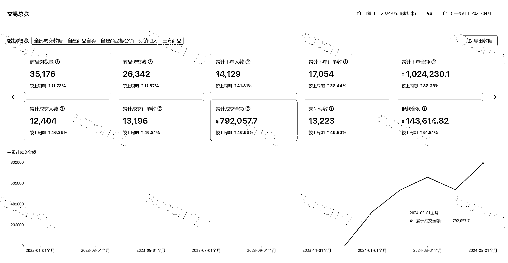
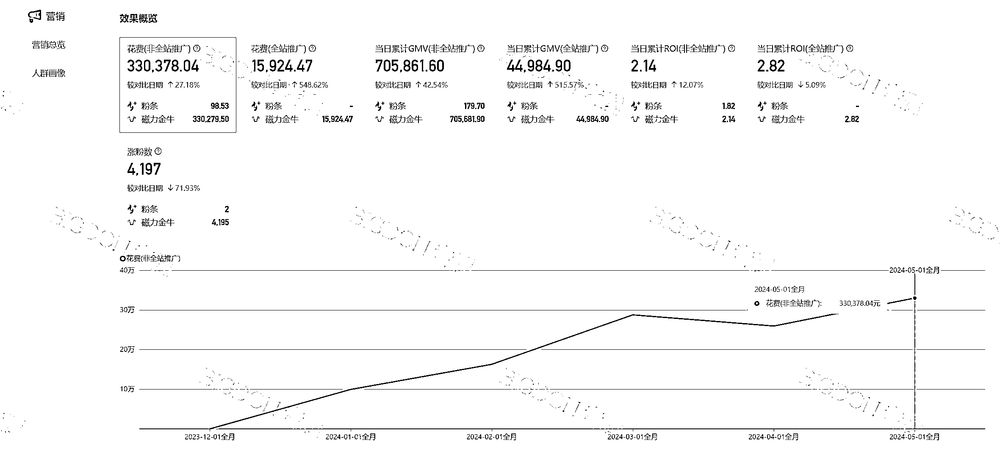
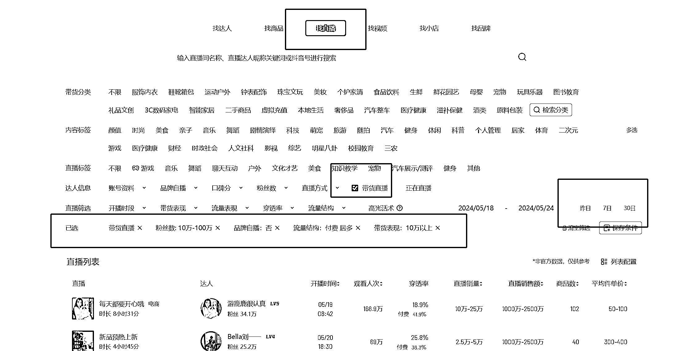
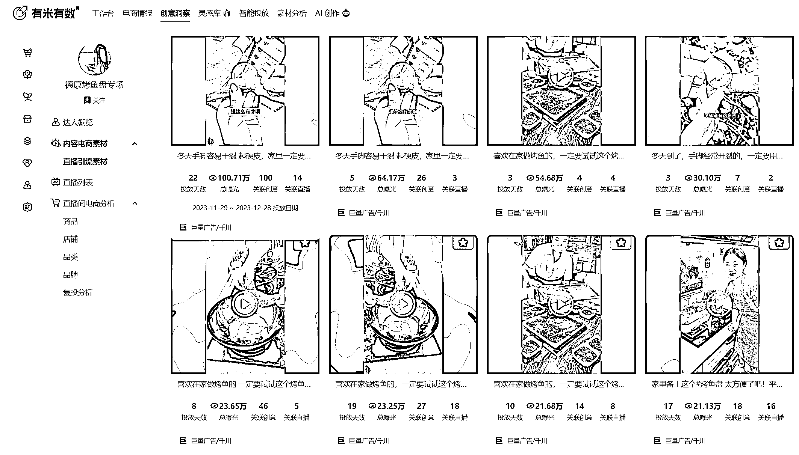
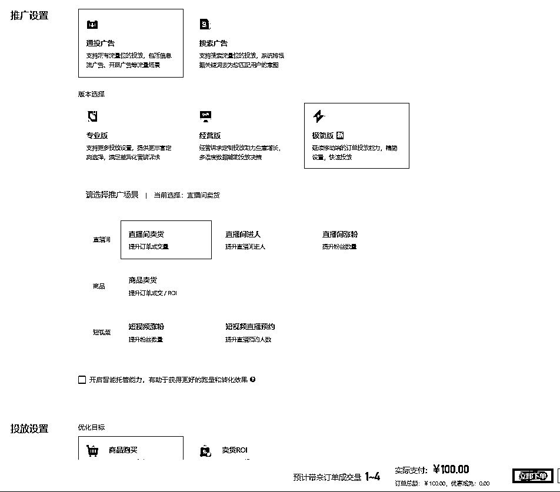
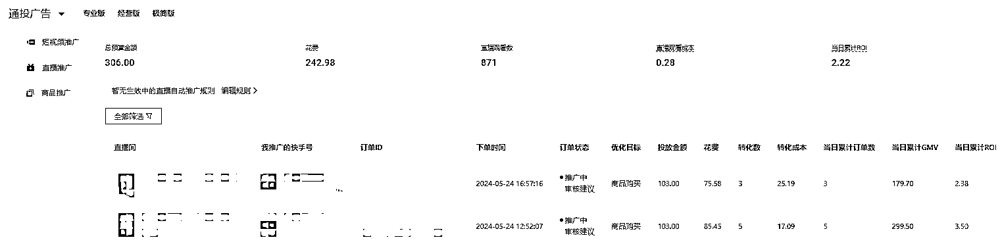
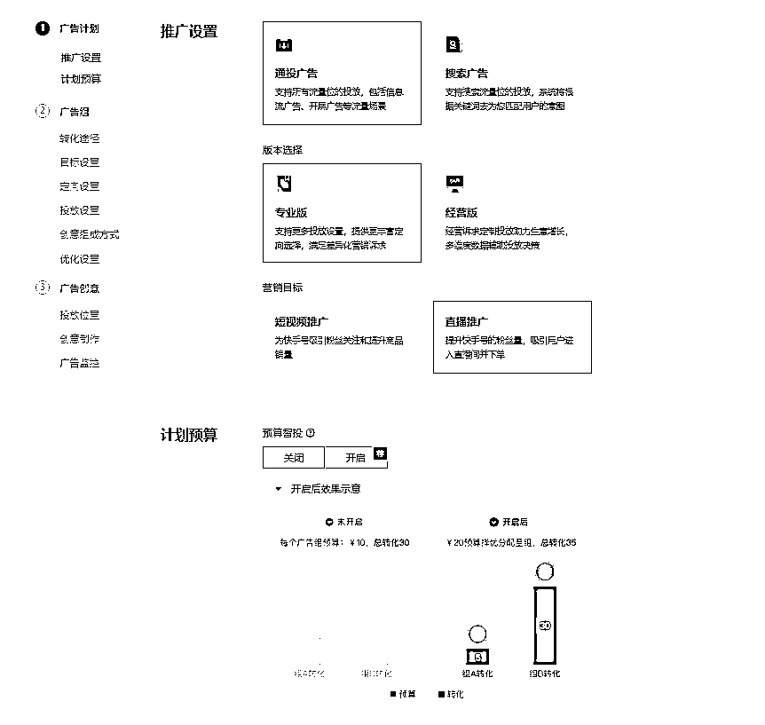
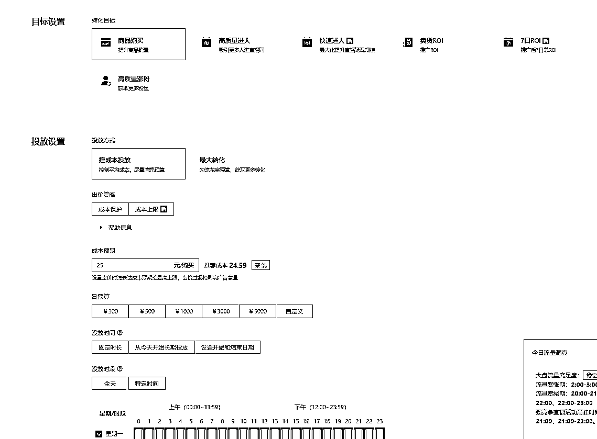
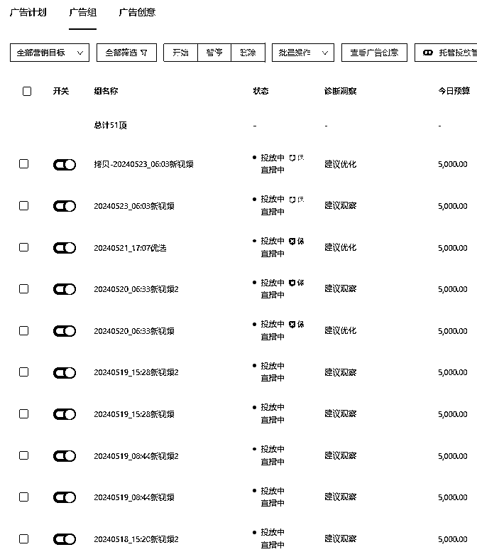

# 快手数字人直播，单品 4 个月净利润超 60W，GMV 超 250W

> 原文：[`www.yuque.com/for_lazy/zhoubao/zwwh0lskc9bfdolo`](https://www.yuque.com/for_lazy/zhoubao/zwwh0lskc9bfdolo)

## (21 赞)快手数字人直播，单品 4 个月净利润超 60W，GMV 超 250W

作者： BIGDON

日期：2024-06-28

各位财友们，大家好！我是潜水多年的 BIGDON

我是 2021 年加入的生财，期间经历了大大小小的各种航海，也让我从一个对于国内电商零基础的小白，逐渐成为了能够独当一面的超级个体，最后招兵买马，矩阵化复制我现在的盈利项目。

这个快手数字人直播项目，我是 2024 年 1 月 26 日开始测品，到今天，历时 5 个月，单品单店，净利润让我收获超 60W，GMV 超 250W。

废话不多说，先看数据，有图有真相：

GMV 图：

付费广告图：

# 一、项目背景

**快手数字人直播项目，简单概括，就是选择一个适合快手人群的对标抖音爆品，去批量发布该产品的视频，通过付费广告拉爆视频，引流到直播间进行转化而这个直播间不是真人直播，而是录制的对标抖音账号的直播间。**

这个项目模式做过抖音付费的会很熟悉，这个运营理念是非常相似的，但是运营难度差异，却是天差地别的。

或许大家会觉得快手还有人在用吗？

我周围人都没下载过快手，快手有人用？

快手体量都不到抖音的体量的 1/8，有什么可以打的？

**有这些想法的朋友，正因为你们的意识盲区，成就了****蓝海市场****！**

# 二、项目实操

**快手数字人直播项目，重要组成部分，分为****选品，视频剪辑，付费投放，数字人直播间制作****，接下来我们一一拆解。**

## 选品

### 选品理念

如何选品，这是大家最关心的问题，也是起号的第一步，这一步走好了，万事大吉。

基于我的选品理念，“新奇特”始终贯穿始终。无论是小红书还是快手，乃至别的平台，都是通用的。

我们快手数字人直播项目的核心是付费投放视频引流到直播间，然后进行转化。那也就是说视频是最重要的工具，而视频如何能吸引客户，产品的“新奇特”就起到了决定性的作用。

那“新奇特”到底是啥呢？

我的理解就是“新鲜，奇异，有特点”，一旦你的产品有这三个特征，你就选对了 6 成。

再依托于快手平台的客户群体画像，可以总结为，**具有“新奇特”特性的中老年产品**。

那剩下的 4 成呢？

1 成，看你的对标产品有没有足够的广告素材，没有足够的素材支撑，后期会很吃力。素材主要来源就是有米有数，抖音，快手，视频号等。

1 成，是看产品的退货率。这是一个选品重点，必须把控。因为我们是付费投放，一旦退货率高，就是打水漂，到最后你听到出单铃声反而在害怕。

还有一层是对标直播间

最后 1 成是看快手有没有竞争对手。

这个快手的竞争对手，是我做这个项目以来最深的经验收获。这个竞争对手的标准不是说跟你卖同产品的就是对手。而是跟你用相同打法，用相同的视频素材去短引直播间的对手，才是真正的对手。别看快手平台用户量很大，多几个对手没关系，但其实不然。

所以选品的时候，最后 1 成，看快手有没有竞争对手也很重要。如果是我选品，只会选没有对手的，但是用别的打法，却销量大的产品。

### 选品实操

对于没有网感的新手小白来说，选品需要依托于各种工具，让自己慢慢有了网感后，就可以无招胜有招，直接刷抖音找产品即可。

下面我以考古加为例：

**条件选择：找直播→7 日→带货直播→粉丝数 10w-100w→品牌自播：否→流量结构：付费最多→带货表现 10w 以上→点商品数，倒叙排行**

我们做快手数字人直播项目，选品的首要目标是需要选择合适的对标抖音账号。

这个账号需要同时满足我们的**选品需求，长期付费直播，最好是单品直播间，粉丝量不大，不是品牌方，带货表现优异，产品价格利润 50%以上，产品售价在 30-100 之间。**

如果你的对标抖音账号能够同时满足上面的要求，恭喜你，这个产品可以进入你的测品名单里。但是这只是第一步，你需要不停找对标产品，在几十，上百个测品名单里去优中选优，然后不停测品。

选品工具每个人花钱都能买到，你能够在软件上找到的品，别的人也是能找到的，所以这个对于新手考验的就是执行力了，你比别人早一秒找到，就多一秒的机会。

对于老手来说，其实用选品工具来选品已经是落于下乘了。大道至简，对于老手来说，最能找到爆品，且最不会撞品的选品方法，就是**养号，刷抖音。**

**那怎么刷抖音呢？刷出来都是小姐姐怎么办？**

你可以准备一个新号，然后不停的给这个账号投喂我们对标产品的关键词。不过这个不是一朝一夕的事，需要执行力。但是一旦养成，你就可以美滋滋的一直刷产品了。

## 视频剪辑

快手数字人直播，第二重要核心，视频。因为我们是通过广告投放来拉爆视频，以此来引流到直播间进行转化。所以，**好的品+爆款视频** 就几乎判定了你是否能赚钱。

### 爆款视频公式

**爆款视频= 爆款脚本+黄金前 5 秒+产品镜头+引导直播间的结尾**

#### 爆款脚本

寻找对标产品的爆款脚本有很多种方法，最直接有效的，就是通过有米有数，去找对标抖音账号的广告投放视频，然后在这些视频里找到总曝光最大的，关联创意多的，投放天数多的。

还有一种方法就是去找对标产品同品类的爆款视频，因为往往一个品类会爆的脚本都是非常相似的。

爆款脚本有很多，但不是所有脚本都会爆，只有在我们账号会爆的脚本才是好脚本。所以我们需要做的就是多测试新脚本，找到属于我们自己的爆款脚本。

等我们测到一个百万级的播放量的，或是几十万级播放量的脚本时，就可以使用这个脚本，批量生产无数个视频，把这个脚本的客户群体吃光，期间应该还会爆很多几十万级，十万级的视频，会让你的订单稳定持续一波。

#### 黄金前 5 秒

黄金前 5 秒这个相信做电商的都深有体会，爆款视频的黄金前 5 秒非常的重要，直接决定客户看到视频的第一感官，是直接划走，还是接着往下看。所以测试属于我们自己的爆款黄金前 5 秒也是一项重中之重的工作。

等到上传了一段时间的视频，同时有部分视频爆量出单后，也可以通过磁力金牛的后台去看广告数据，去分析哪几个爆款视频在出单，广告消耗快，同时分析这几个视频的共同点是在哪里，爆款前 5 秒是否是同一个。

#### 产品镜头

有了爆款脚本，黄金前 5 秒，客户基本已经被吸引过来，在浏览视频了，那要吸引客户看下去，同时产生购物的欲望，引导到直播间下单，这个就是这个产品镜头的作用。

产品镜头前期可以混剪素材库里的镜头，通过混剪的方式，把你的产品展示出来。后期如果镜头素材用的差不多了，也可以 1:1 摆拍。这个是最简单有效的。

#### 引导直播间结尾

结尾的引导直播间提示虽然是个可有可无的细节，因为完全看完视频再去购买的客户毕竟是少数，但是细节决定成败，这个可有可无的细节，却也能带来不小的收益，毕竟我们面对的是快手的中老年买家，贴心的指引，是有回报的。

### 视频批量剪辑

通过我上述的爆款视频公式，剪出单个视频，是错错有余的，不过，我们要的是批量发布视频，然后进行投放。如果视频基数不够，一切都是空谈。

那如何能够批量混剪呢？

可以参考生财有术小航海之剪辑特训，里面详细介绍了如何批量混剪视频，我也是获益匪浅。

## 付费投放

关于这个磁力金牛的投放，我之前搜了很多生财有术的文章，但是谈及此事的确实不多。后来也是因缘际会，我在生财里认识了@书豪，也去书豪公司拜访过，让我对快手数字人直播和付费投放有了新的认知。

在这里再次感谢！

言归正传，磁力金牛投放分为两个账户：极简账户 和 PC 账户。

两个账号各自分工明确，缺一不可。

### 广告账户投放阶段

新快手账户初次使用拿到手是没有精准流量模型的，分为**起号期、稳定期、衰退期**三个阶段，每个阶段作品发送频率，PC 账户和极简账户投放节奏各不相同。而且每个人的投放方式也在系统的学习后，有了自己各自的风格，在这里我就大概说下我的投放方式，仅做参考。

### 极简账户

极简账户的功能，主要是用来拉热新视频，所以当有新视频投放后，就可以用这个极简计划去拉热。

按照我自己的习惯，我会一次性拉 15 个视频，100 元，6 小时，去拉热新视频，然后随时观看广告数据，如果出现空跑 50 元以上，就会手动停止计划。如果 ROI 能够跑的正，就让他把计划跑完。

### PC 账户

PC 账户的主要功能就是在极简拉热视频后，能够挑选出里面的有爆款潜质的视频，去拉爆这个视频，同时进行长时间的转化，让我们能够长久稳定的出单。

PC 账户的投放策略就是一旦上传了新视频，就建一条计划，每条计划 15 个新视频，给出自己预估的出价，我们一般出价是在利润的 80%左右。

就是这样每天重复相同的动作，发布新视频，建立新计划，PC 账户因为有成本保护，不太容易跑飞，所以基本都是不停地建计划，一旦其中一个计划爆了，你的订单也就起飞了。

下面的这个就是我的日常：

### 如何甄别这个品是否能打

理论上来说，我一般会给一个品 3 天时间，600 元的预算。如果这个品，三天内亏损超过 600 元，我基本就会放弃这个品，转战测试新品。

实际操作中，我基本第一，第二天就能大概甄别出，这个品是否能打，是能长期打，还是短期的，是爆品，还是普品。因为你在测试一些品之后，通过广告的反馈，会有明显的感触，能够及时的调整自己的选品策略，广告策略。

## 数字人直播间制作

数字人直播间制作其实是一件非常简单地工作，唯一的重点是在寻找合适的对标直播间。

我们其实不需要十分完美的直播间，但是好的适合我们的直播间可以提升你的转化率，节省你的广告费。

### **那怎么样的直播间算是及格的呢？**

首先，主播状态要达标，全程没有插科打诨，偷懒。

其次，直播话术完整，逼单，产品介绍，产品演示都达标，尽量选择没有展示时间，抖音活动等标志的。

最后，对标直播间有足够多的直播场次或者直播时间，让你有充足的素材去做 24 小时，乃至 48 小时的录播。

### **那有了对标直播间，怎么操作呢？**

首先通过直播间录制软件去录制对标视频，现在市面

很多，能实时监控，实时录制抖音直播的软件，如果找不到，也可以来问我拿。

然后录制至少 6 个小时的直播后，无需任何剪辑，最多加点文本遮盖住直播间里，你不想让他展示的部分，然后就直接就可以放入 OBS 中，调节视频尺寸，音频设置为监听并输出，然后启用虚拟摄像头，就可以对接到快手直播伴侣上进行数字人直播了。

# 三、总结

快手数字人直播的项目是有一定门槛的，但也正是有了这个门槛，让它有了自己的护城河。同时，我们是通过付费投放在进行转化出单，所以相比于通过免费流出单的天花板要高跟多，同时可控性也高很多。

篇幅有限，我也只是介绍了这个项目的一些皮毛，也不知是否符合众位看官的口味。

看大家的反馈吧，如果大家反馈高涨，我再写一篇复盘进阶篇，同时把大家的问题融汇进去。

# 四、致谢

感谢**@生财有术**这个平台，通过大大小小的航海，让我一个小白，系统的学习了抖音，小红书，视频号，快手，淘宝等电商平台的一系列知识。同时让我结交了很多志同道合的财友，大家相互进步，相互探讨。

感谢**@书豪**大佬，让我能够系统性的接触到快手数字人直播的这个项目，在我迷茫不知所措时，给我方向，让我能在低谷时坚持下来，最后把我这个单品起死回生，再创新高。

* * *

评论区：

希平 : 书豪哥的确是个很好的人
Bill 陈 : 这里说的数字人，就是录制其他主播的直播间进行循环播放吗？等于就是无人直播，直播间承接视频爆发后的流量吗？
BIGDON : 也可以这么理解
BIGDON : 豪哥是我贵人
simple : 录制别人直播间的这种情况容易违规吗？
现在有专门的数字人直播，就是要买软件，一个品要有一段话术，麻烦的是换一个品就要重新去录话术。

* * *