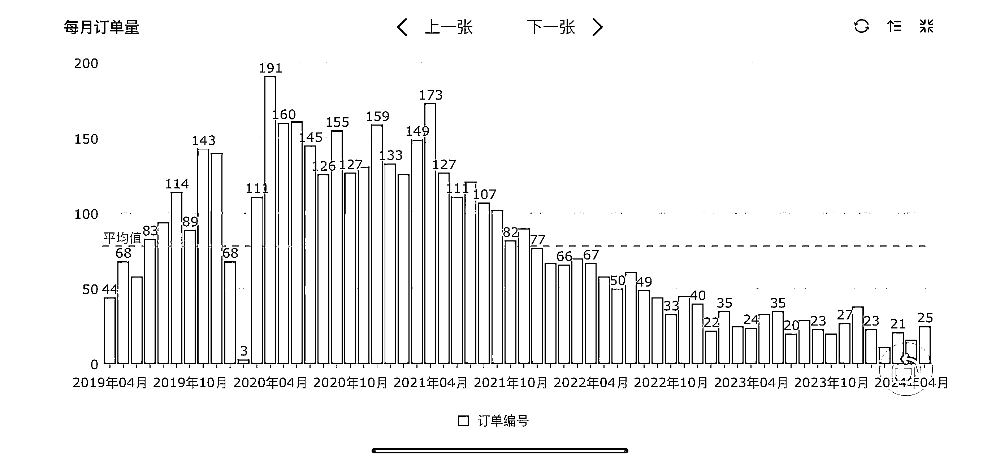
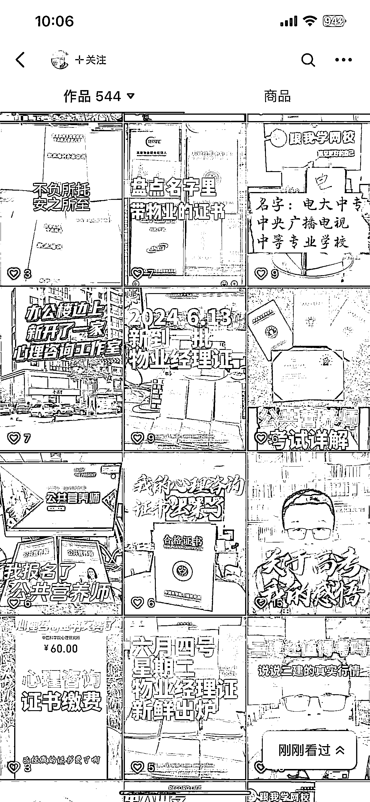
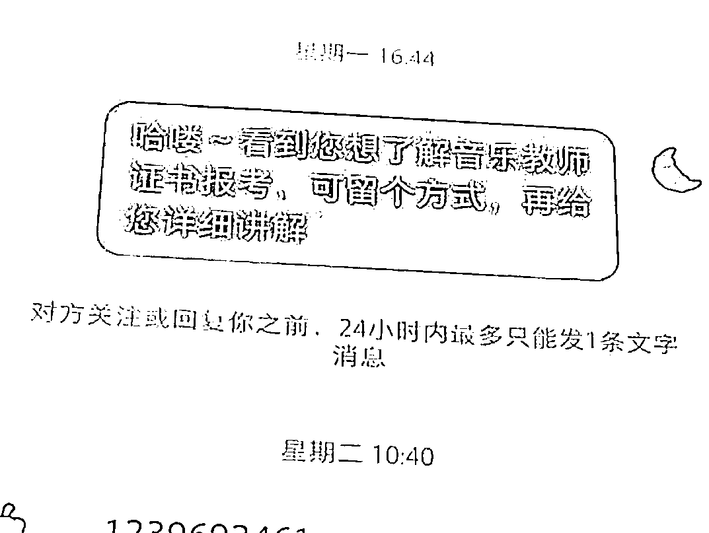
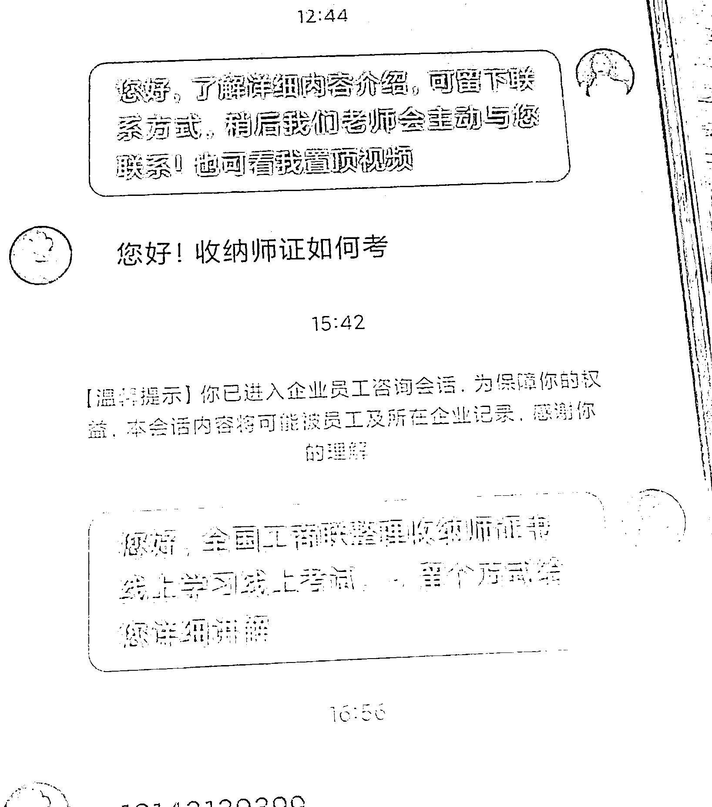
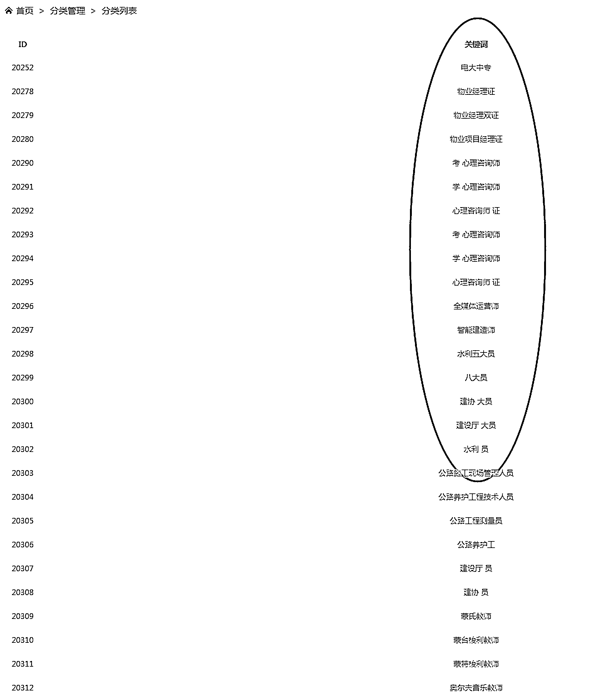
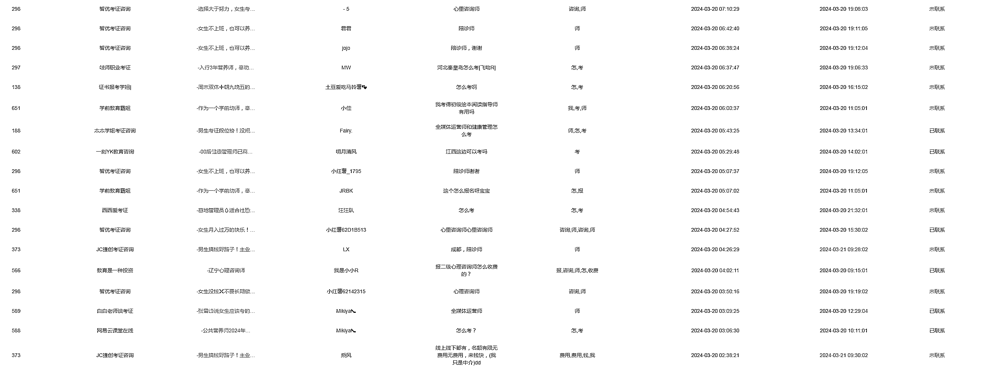
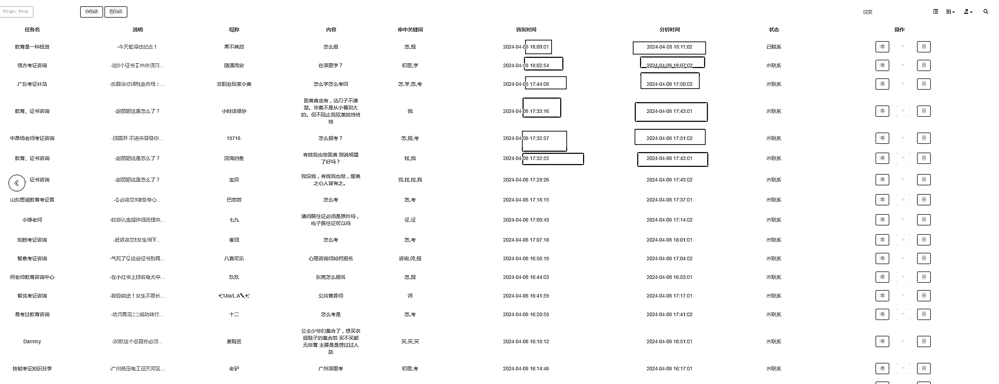
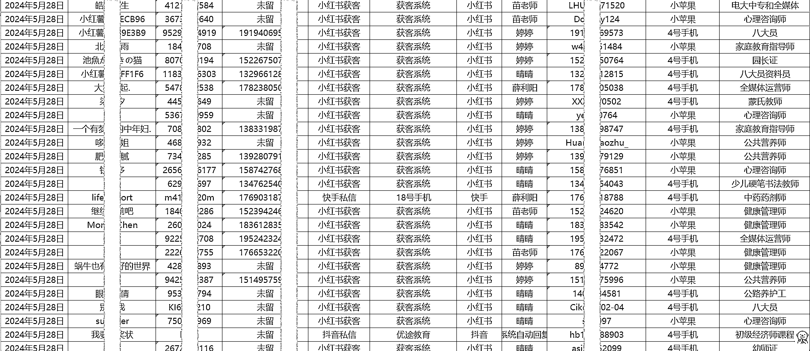
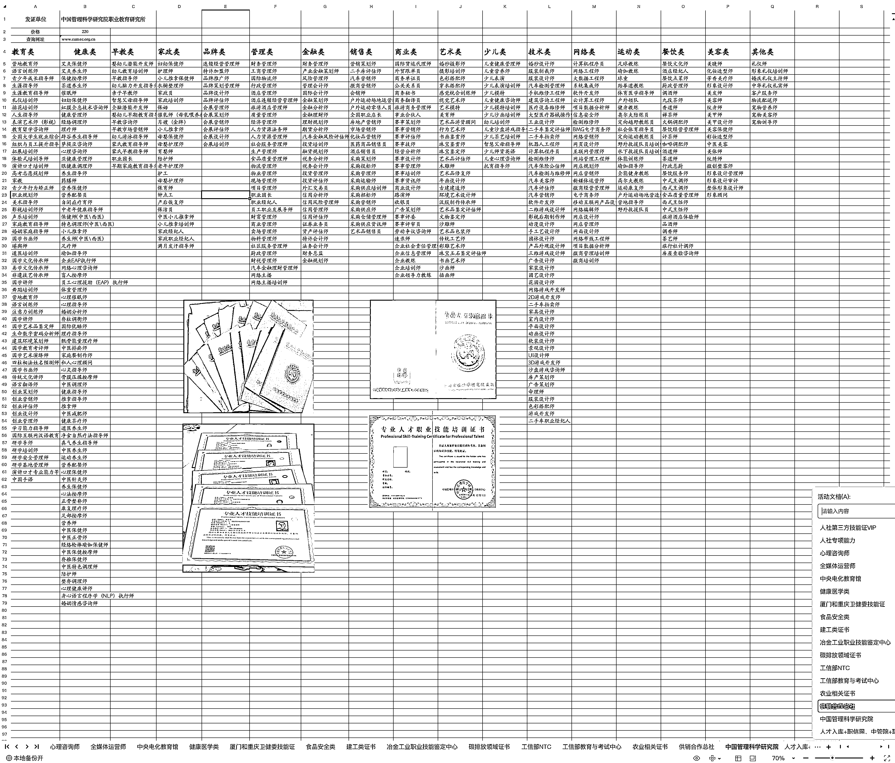
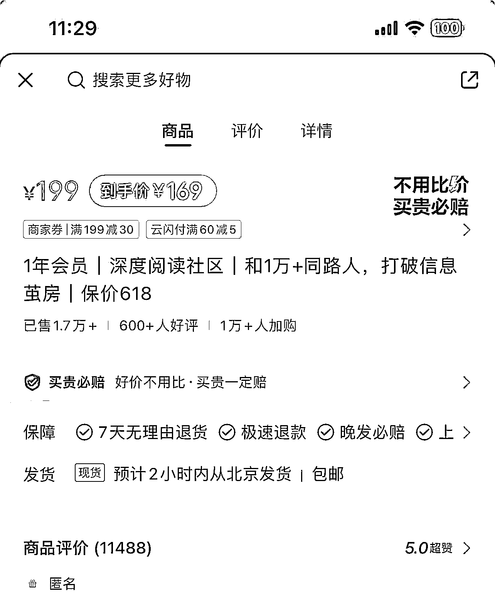

# 红薯+考证，私域项目失败，半年只出 2 单

> 原文：[`www.yuque.com/for_lazy/zhoubao/wygb0is1blgsm2tz`](https://www.yuque.com/for_lazy/zhoubao/wygb0is1blgsm2tz)

## (17 赞)红薯+考证，私域项目失败，半年只出 2 单

作者： 刘信庭

日期：2024-06-24

### 文章爽点推荐：

如果解决不了问题，那就跳过问题本身，去找能解决问题的人

起心动念看到一个赚钱的机会，这个机会往往是身边亲朋好友提供的，我们把这种关系称之为圈子

效率层面的问题，如果是团队作战，必须要解决，且只能通过系统研发去实现

就像俄罗斯方块，杀死你的，是你从一开始就有，之后一点一点积累起来的错误

竞价投放的本质是，平台会把周期内综合出价最高的广告排到最高曝光位

搞项目内心的强大来源于失败经历的丰富度，我常常用这样的话勉励自己

* * *

# 目录

# 一、关于选择选择项目，半年前我是怎么定位的

## 1.1、我之前是干啥的

18 年开始，我主要是做微信生态内营销软件，主要客户是 K12 和知识付费相关的 B 端机构。口罩刚开始，很多机构线下转线上，我迎来了一波增长，但随着后面的双减，到口罩后期影响，业务断崖式下滑。这里补充一下，客单价在 3000-24000 元之间。

**团队的核心优势是：技术开发+运营，这一点很关键，是我们后面考证业务没做起来的一个主要原因**

## 1.2、对项目筛选的考虑

做软件研发，研发周期长，少则三个月，多则大半年。市场变化快，等新项目研发出来，市场需求已经饱和了，软件销售收入赶不上市场投放的零头，在没有资本介入或者合适的时间窗口进入，能活下来的概率很低。这样的跟头我栽了不止一次，是血的教训。

**所以对新的项目定位是：**

①不选研发周期超过 1 个月的产品或者项目，直接屏蔽掉了 99%的软件研发业务

②我们的团队在销售环节是个短板，所以不做客单价 3000 以上的产品，要做轻型交付产品，标准化交付产品

## 1.3、考证业务的起心动念——因为朋友在做

大家回想一下，你是：

因为什么原因进入现在的行业？

因为什么原因从事现在的业务？

因为什么原因选择现在的项目？

70-80%的原因是：你看到了这样一个挣钱的机会，而这机会就发生在你身边，可能是你的同学，朋友，同事，亲戚，干的这件事挣到钱了，这种人与人之间的信任，让你觉得自己也抓住了挣大钱的机会，于是也决定下场干一把。我们把这种社会关系称之为圈子。

**因为我有一个自己在抖音开店做号的大冤种朋友，我看到了他实实在在的银行卡流水，我错误的以为，我能把他这套模型复制放到到 20 人以上的团队规模。**

# 二、考证业务是如何具体执行的

## 2.1、人工引流 MVP 模型

**最开始的模型找一堆红薯小号去友商评论区私信，要微信，私域聊转化。**

刚开始还行，效率还是很高的，但是接下来就暴露出的要命问题是：**【线索如何去重】**

怎么判断这条评论自己有没有回复过，

怎么判断这条笔记同事有没有跟进过，

怎么判断这条笔记下面的这条评论同事有没有跟进过，

怎么去搞搞源源不断的最新的评论

于是，我们搞来了大量的重复线索，重复的比例越堆越高，**这种效率层面的问题，如果是团队作战，是必须要解决的，也只能通过系统去实现。**

## 2.2、上系统，解决重复线索

## 2.3、解决批量红薯号

**去 10 回 1，发出去 10 条消息，大概能有正向反馈的，要到线索的比例是 1 条**，客户只要在评论区回复，至少有 5-10 个同行会去主动联系他。

**这也意味着以天为单位，每一条有效线索要对应一台手机+一个小红薯号+（手机号实名），这里不详细谈了，原因你懂得，总之我们花了几个月的时间，慢慢把这个问题解决了，每天大概能产出 200 条左右的线索。**

## 2.4、上游供货渠道

渠道其实有很多，但是我们筛选出来价格和服务比较优质的，着实也花了不少时间。

## 2.5、关于转化

### 2.5.1、自己销售团队能力是短板

我在开头提过，我们的优势还是在技术和运营，重点还是在搞流量，转化确实是需要深入了解业务，验证销售转化话术模型，而我们最大的问题，就是没有聚焦单一的考证业务，而是同时铺了多条线，产品定位不聚焦，什么类型的证书都想做，大把时间在测试流量模型。而这种转化能力和转化技巧，恰恰是需要经验积累和时间验证的。

### 2.5.2、业务本身很卷，转化要靠画大饼

我们的同行都在告诉用户：你花 1400 元考了全媒体运营师，就能拿到月薪 2 万的工作。考过了心理咨询师，你就能挂靠 xxx 单位，一年能给你 xxx💰。

**这样的谎话，我是不允许员工用的，误人子弟，过不了我们自己的企业价值观。**因为我们自己招运营，凡是简历里有写考过全媒体运营师的，我们一律不要。作为运营出身，我知道，但凡有点能力的，都不会去考那玩意。但凡考过的，大概率是水的一那啥。来了也是给团队拖后腿的。

### 2.5.3、产品客单价太低

目前相关证书单价基本都在 2000 以内，因为实际执行过程中同行相互压价，同时客户也会去多家对比价格，价格战也是打到白热化的地步了。成本一般在一半，所以毛利润也就几百块，跑不起量就没办法养活我们的团队。

### 2.5.4、半年出了两单

这里就不上截图了，转化率接近于 0。

打了败仗不可怕，可怕的是不敢承认。

话虽这样说，实际项目结束要面对的是：真金白银的几百台手机硬件成本，人力成本，系统研发成本，以及最重要的时间成本。还有那些想着跟你一起挣钱，能养家糊口的员工。说多了都是辛酸泪，懂的都懂。

**搞项目内心的强大，来源于失败经历的丰富度，我常常用这样的话勉励自己。**

# 三、项目复盘

**得：**解决了引流成本和效率的问题，换个行业，只要有大量的同行笔记，我们也能做到日产出 200 条新线索

**失：**选择了一个我们认为不太需要销售技巧，反而执行过程才发现确实极其需要销售技巧的项目，直接打在了能力短板上。就像俄罗斯方块，杀死你的，是你从一开始就有，之后一点一点积累起来的错误。

# 四、思路调整

## 4.1、可复用：

红薯获客的流量成本和流量效率我们目前有相对竞争优势，上面已经讲了，**这里不适合讲的太细，大家都懂**

## 4.2、换赛道

在杭州做知识付费的朋友给我分享了一件事：他们的流量，是春节期间有过一段爆发增长，因为从平台买量的优质广告主休息去了，实体电商发不出去货。红薯小二的原话是，这波流量你们一定要接住。

朋友这句话点醒了我：**电商平台要的是总 GMV，谁出钱多，就把优质流量给谁，平台的收入是成交额扣点；****竞价投放的本质是，平台会把周期内综合出价最高的广告排到最高曝光位。**

* * *

这跟我们没跑成功的【红薯+考证】有什么关系？往下看

* * *

有位圈友讲过：如果解决不了问题，那就跳过问题本身，去找能解决问题的人，做项目也是一样的道理，如果已经解决了优质流量的获客效率问题，那就去想办法匹配合适的项目。

考证业务本身客单价低，那就换个**高客单，能对转化率低有较高容错率的赛道**；销售团队转化能力跟不上， 那就跟各位圈友进行链接，**提供优质线索**，用我们的引流效率，赋能大家的高客单、高转化的后端交付产品。

## 4.3、再次出发

目前已经和部分圈友产生链接，在跑的项目有留学，法律，旅游，雅思托福，MBA。具体可看这篇帖子[`t.zsxq.com/S9P8b`](https://t.zsxq.com/S9P8b)

## 4.4、跑起来，奔跑中调整姿态

大家能看到的是这篇文章语言组织可能有个别混乱，标点符号也很随机，甚至有可能有错别字。我没有刻意逐字去改，因为我想传达的主要观点不受这些因素影响，不影响主要矛盾。这也是我自己搞项目的信条：**不要刻意追求完美，跑起来，在奔跑中调整姿态。**

* * *

评论区：

Landis : 加油，不断测试多种路径，找到有正反馈的路径，再尝试放大
刘信庭 : 感谢，目前已和多位圈友产生链接
Pakhoo : 高端国内旅游，你旅游时哪方面？
小鱼丸 : 你这个获客系统在抖音上适用吗 还是只能在小红书上获客？
刘信庭 : 目前只适用于小红薯，抖音我们测试过，发出去对方收不到提示的比例占 9 成以上
小鱼丸 : 这样是吧

* * *