# 明星周边、小卡爆火，这背后有什么机会可以入局？

> 原文：[`www.yuque.com/for_lazy/zhoubao/il7vpuckf6v2t8rh`](https://www.yuque.com/for_lazy/zhoubao/il7vpuckf6v2t8rh)

## (17 赞)明星周边、小卡爆火，这背后有什么机会可以入局？

作者： 刘榛

日期：2024-06-28

一张当红的明星卡片能卖到上万元，谁在买单？

这门生意靠的就是粉丝，明星流量越红，对应的周边就越稀有，也更贵，利润空间也会大许多。像我通过直播间抽卡（类似于盲盒）的形式售卖卡片，整体利润能在 35%左右，而线下摆摊能做到 50%的毛利。

但这个生意其实不难，以我的经验来说整体难度其实是非常非常低的，核心就是货源，只要找到货源就可以怼着产品拍卡点视频开播了，也可以直接拿到线下卖。

之前我们就尝试做了一下线下摆摊，一个月卖了 2 万 3 左右，相比线上，摆摊进货量少、还不需要售后、也没有物流成本和包装成本，唯一缺点就是城市容量有限，适合小成本投入，想拿点正反馈的入局！

当然，在找货源方面也没有特别的捷径，我们当时也是走了很多弯路一点点试出来，才找到稳定的货源，所以今天除了介绍这个项目怎么做之外，也会着重分享我们当时走过的弯路，希望对想入局的朋友有一点点帮助，避免重走我们走过的坑。

## **一、什么是小卡抽抽乐**

所谓“小卡”，原本是韩国娱乐公司在推出专辑时随专附赠的印有艺人照片的卡片，一般约为 3 寸照片大小、硬卡质地，本质上是一种音乐专辑周边，在粉丝文化影响下，小卡逐渐成为了一种饭圈藏品。

如同潮玩盲盒，广泛流通于二手交易平台，并形成了独特的“小卡经济”，这个项目本质上是依靠明星流量的粉丝经济。

所谓抽抽乐是通过直播间抽卡（类似于盲盒）的形式售卖卡片，增加了趣味性跟观赏性，整体毛利率在 35%左右。

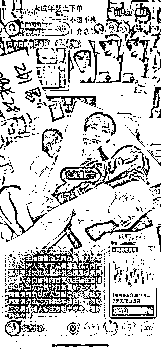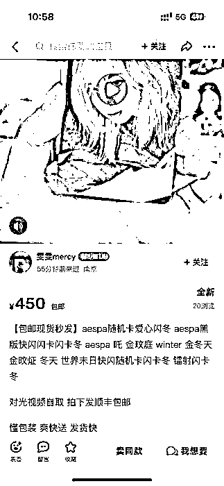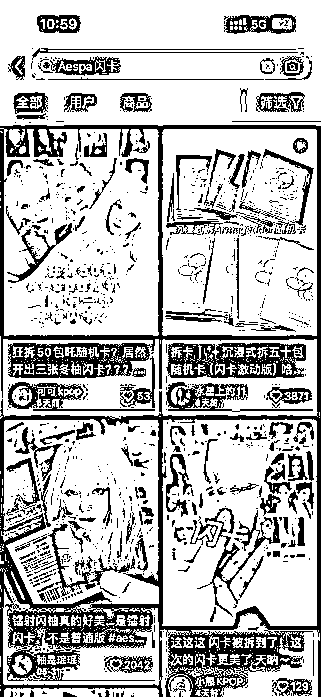

## **二、项目概括**

1、个人一直认为小众的兴趣爱好是非常好的赛道，并且一直坚信比起让 80%的人 30%的喜欢你，不如让 10%的人 200%的喜欢你，所以我们一直是人数很少的公司，但因为坚持深耕在小众兴趣的领域，所以活的还算比较滋润。

2、项目来源于去年跟刚毕业的小姑娘聊天，得知了这个圈子，出于对小众兴趣爱好的敏感度随手的了解了一下，发现抖音只有很少的直播间在播，通过考古加查询这几个直播间的月流水都在 150 万到 300 万。

（去年的流水查不到了，查的是今年播的不错的几个直播间）

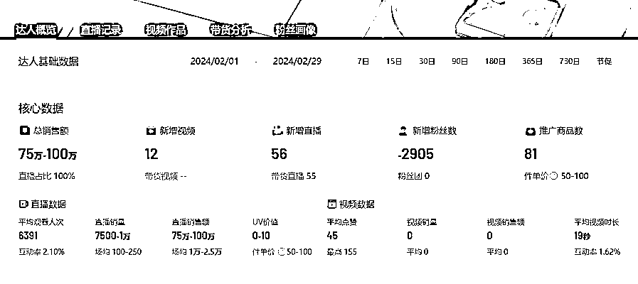

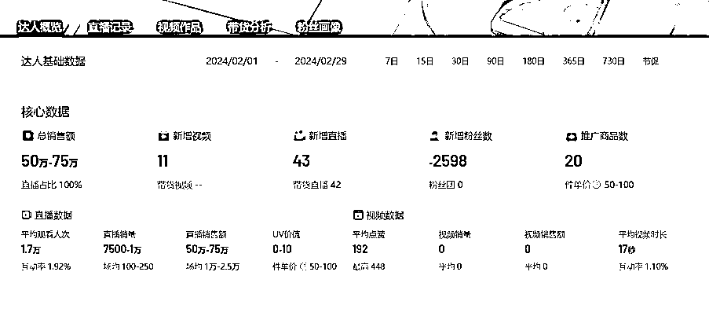

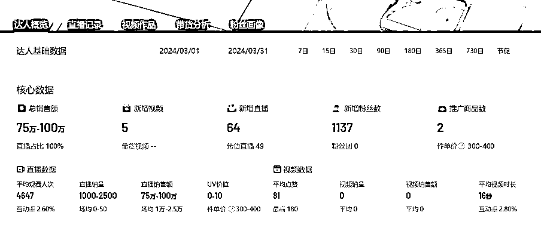

通过查询可以看到所有相关的直播间都是低粉卖了一个还不错的数据

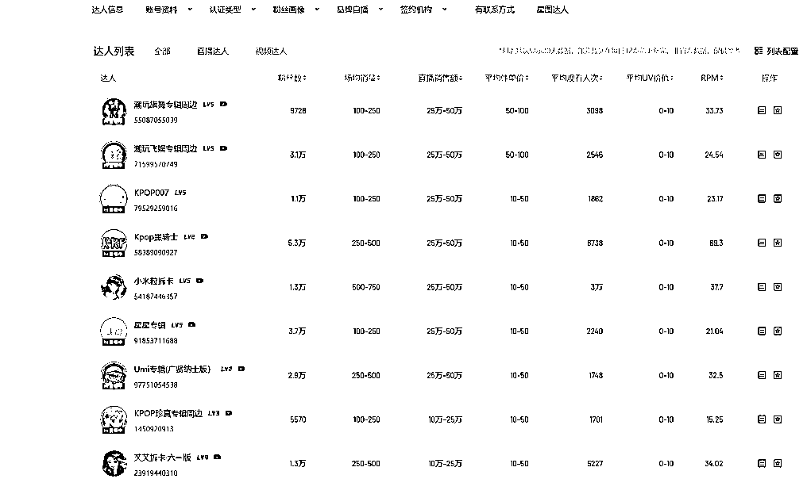

直播内容简单，流量本质是借的韩团组合的影响力，流量获取简单。不需要露脸，不需要主播各种话术，开播抽卡即可，所以没什么犹豫就开搞了（当时低估了这个圈子的复杂度，导致后面踩了非常多的坑）

## **三、踩了 N 多坑的开播之旅**

**（1）异常顺利的起号过程**

因为公司里有对这个圈子比较熟悉的人（但是没有特别熟悉，后面会踩坑），得知这个圈子非常讨厌搬运，对抄袭的行为异常敏感，所以我们就去 TK 上搬运海外 KPOP 相关的内容，删除了原声，重新配上中文语音跟字幕。

结果第一个视频就爆了。

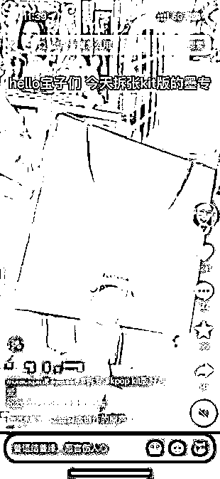

**（2）仅用了两天的 0-1 的过程**

一看视频流量开始猛涨以后，因为当时也不知道进货渠道，完全不知道这个类目的货应该在哪进，就直接去咸鱼收了一本视频同款专辑。

当天就通过抖音私信卖掉了，虽然只赚了 10 块钱，但是我从来没有见过这么快就能跑通 0-1 赚到第一块钱的项目。于是信心猛增开始加大投入，准备批量进货。

**（3）交了无数学费的进货过程**

**1、不知道进什么货**

在没有深入研究这个圈子之前，我从来没遇到过这么复杂的情况，先不说货从哪进，就连进什么货都不知道。我简单举个例子大家就能明白：

一个韩团，人少的有 4～6 个，人多的有 13 个人甚至更多，这 13 个人每人的热度不一样，还会有某一个成员自己的 SOLO 专辑，还要分成正规一、二专、电子专、PB 版、单封（每个成员一个封面的专辑，13 个人也就是 13 本为一套），还有粉丝自己称呼的一些别称，例如克拉盘、油彩克拉盘。

以上所有的称呼都对应着不同的专辑，不同的需求量，以及不同的价格。这让我们初进这个圈子的人直接懵了圈。

**2、抄同行进货**

在碰到上面的情况以后，我们放弃了思考，开始看其他直播间卖的什么货，在通过考古加看哪一个货卖的比较好，我相信我能想到这一点，聪明的圈友肯定也能想到，那么第二个坑就来了，抖音上的直播间在当时都是一个大商品链接带无数的 SKU。像这样：

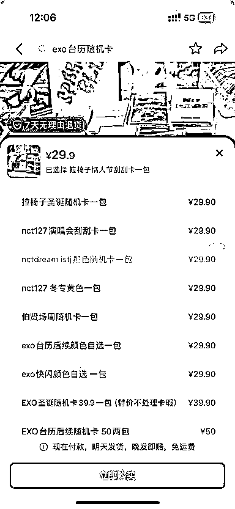

这导致我们通过数据根本不知道哪个卖的好。

于是我们就想了个笨办法，录屏，提文字，看主播哪个 SKU 的名字提到的最多，挑选了三个被提及最多的商品。

**3、磕磕绊绊的寻货源**

因为属于进口商品，很难像国内产品一样找厂商。

所以刚开始就找各种代购，找能对接韩国经销商的人，连续一周每天跟各种代购打电话到凌晨，这里会有一个问题。

因为刚开始做，不管其他直播间卖的再火，我们都是不敢多进的，只敢 20 本 30 本这样的进，这导致这些代购、经销商根本不想理你更别提价格上的优惠，所以最终进货的价格又贵又慢并且被坑。

**4、被代购坑**

上面也说过一个团里有很多成员，有个别成员火，大部分成员其实都是不温不火，而火的成员要比不火的成员价格至少高 50%。

第一次进货代购发过来的货全部都是最不火的那一批成员，导致我们开播时间一拖再拖。

**5、花钱试错货源**

最终发现进货这个事，没有捷径，就是不断的试不同的代购。

最终确认了一家比较长久合作的经销商，开始比较大量的进货，第一批大概 6 种不同的韩团专辑进了 10 万块左右的货。

**6、超长到货时间**

韩团的订货周期一般都在半个月到一个月左右，并且都是全款预售。非预售的货都是比较老的专辑，很难卖。所以要提前规划好这一个月能到多少货，否则会出现无货可卖的情况

**（4）开播**

整个过程中最简单的反而是开播这一步，没人下单就试抽，用户不用下单就给用户抽，抽到她喜欢的再下单带走（我们做的比较早，又因为发视频积累了一些粉丝，所以没经历过试抽这个环节）。

平时就是不断的给用户展示卡池里都有什么小卡。

**（5）爆单**

第一天直播播了 500 块，第二天 1000 块，第三天直接到了 7000 块，一分钱投流没有，纯自然流。

这个数据比预计的起号速度要快不少，当时也惊叹于这个类目的正反馈来的如此之快。

**（6）售后**

抖音不支持以盲盒类目售卖非盲盒商品（虽然是盲盒的玩法），所以只能挂到明星周边的类目里，这导致一个问题用户抽到自己不喜欢的卡就直接退款，或者收到以后发现不喜欢再退回来。

这个无解习惯就好，总的数据是正的就 OK。

**（7）断货**

第一批 10 万块的货，陆陆续续到了大概 3 万的货就开播了，当时没有预料到卖的这么快所以播了不到一周就出现了无货可卖的情况。

我们后来发现如果一个月的流水在 50 万，那备货至少要备 65 万的货，否则就会出现无货可卖的情况。

**（8）明星塌房，岌岌可危的现金流**

随着我们现金流越滚越多，进货的金额也水涨船高。

但是忽略了这个生意的本质是依靠明星本身的热度来获取的流量，那就要承担对应的舆论风险。

在我们高高兴兴不断加大订货量，流水也越来越高的时候。因为一段 MV 导致我们卖的最好的明星组合塌房，但是这个组合的货有着非常高的资金占用率，流水直接砍到了脚脖子。

这种事不光是影响总的流水，还影响机会成本，因为不可能每一个团队的现金都是无限的，所以进了这个团另外的团的进的就要少，但是大比例资金进的这个团，如果他卖不出去，其他团进的又少，就会出现没货可卖的情况。

无货可卖意味着无钱进账，无钱进账意味着没钱进货，这导致我们公司的账上一度只有 463 块钱。

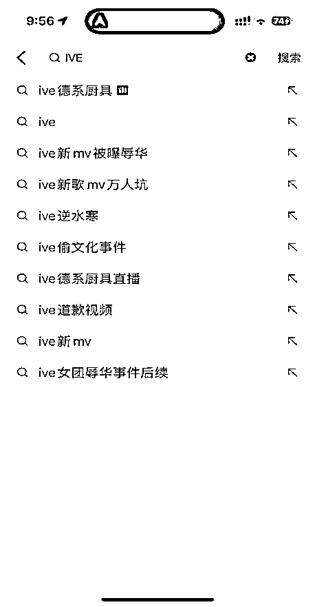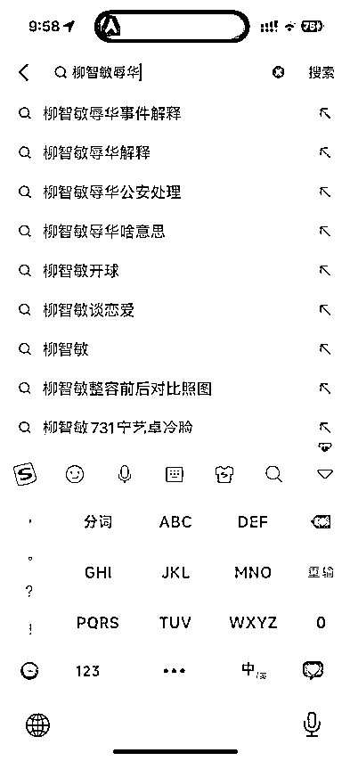

## **四、新人入局的路径**

**（1）线上直播（当前比较卷）**

1、多刷同行的直播间，看看他们是怎么播的，同行才是最好的老师

2、优先寻找货源，寻找进货渠道（小红书有很多韩国代购）

3\. 认识不同的女团、男团（韩国明星组合）这一点非常重要，或者直接招一个这个圈子里的人来直播

4\. 通过咸鱼对每一个组合、每一张卡的价值有一个认识，毕竟这种类盲盒类的直播间买家抽到值钱的卡，主播总要有些反应

5\. 去外网搬运拆专辑的视频，去水印发到国内平台（不要搬运国内的，这个圈子对原创保护的意识非常非常激进，并且非常喜欢在各个平台挂人）

6\. 搬运 10 个左右的视频等流量起来就可以开播了

7\. 开播后，多试抽，可以让自己人下单抽卡，一般这个类目的用户看到直播间有在抽卡都会进来看看。

**（2）线下摆摊（强烈建议刚毕业的学生做）**

这个类目在各个平台上都不缺流量，很容易往线下引流，并且各个城市都有自己的圈子，并形成了自己的 KPOP 地摊文化。

但是线下摆摊，挣不了太多的钱，因为一个城市的容量是有限的，不过真的太好做了！

我们四月份的时候做了线下摆摊的尝试一个月卖了 2 万 3 左右，线下的毛利能到 50%，并且进货量少！没有售后！没有物流成本！没有包装成本！

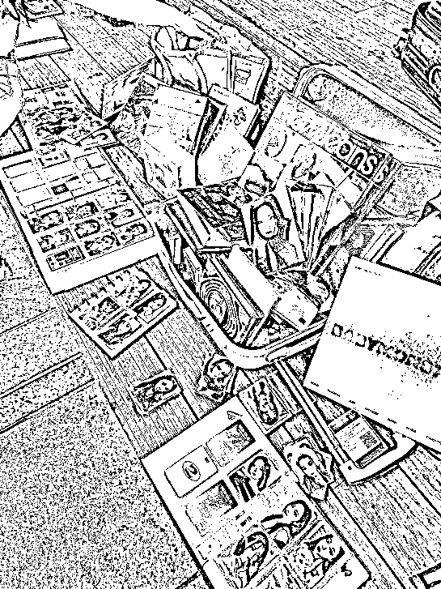

## **五、线下摆摊攻略**

**（1）前期策划篇**

**1、选址**

选址是摆摊前期准备中的重中之重，也是摆摊能否成功的关键因素。下面就从三个角度出发，为第一次摆摊的你提供一些思路。

**① 客流量**

选址首先要要考虑的肯定还是客流量，可以先列出来几个你们城市中客流量比较高的地方，一般要列出来三到五个。

列出来客流量之后，下一步尤为关键。

去小红书搜素你列出来的这几个地方，看一下是否有同行或者比较大的专辑店，如果有的话，尽量避开这个地方。

（比如你列的是“宽厚里”，那就从小红书搜素“宽厚里 kpop”），这样排除下来，一般还会有两到三个地方可供选择。

**② 随舞摆摊**

随机舞蹈现在在各大城市都很火，去随机舞蹈的人，不管是参与者本身还是观众，肯定都是了解 kpop 的人，这群人也是我们摆摊的目标用户。

摆摊之前可以在小红书搜索一下，看看所在的城市有没有随机舞蹈，有的话可以去跟主办方联系，在随舞摆摊开单的几率会大大提高。

**③ 市集摆摊**

基本上每个城市都会有固定的摆摊市集，摆摊之前可以先在小红书搜索一下自己所在的城市有没有这种摆摊市集。

在摆摊市集摆摊的话，摊位可以固定下来，不用每天打“游击战”，而且方便顾客再次复购。

但是这种固定的集市都会收取摊位管理费，同时也有规定的出摊时间，比较适合能坚持长期摆摊的宝宝，如果只是想短暂摆几天的这种摆摊方式就不作推荐。

**2、进货**

看完前面的选址攻略，你现在应该对于选址有了自己的想法，那么恭喜你已经完成了摆摊的第一步，接下来要攻克的就是进货的问题。如果你的线下摊位想长久经营下去，那么货品的丰富程度和价格就尤其重要。

下面就从进什么货和定什么价格两方面来帮你理清思路。

**① 进什么货？**

现在市面上大大小小的韩团和专辑多到数不清，所有团的专辑都进肯定是不现实的，这里就根据我个人的经验为大家提供一些建议，帮助大家利用最少的投入资金实现摆摊利润的最大化。

**② 进新不进旧**

线下摆摊的话卖得好的肯定还是新专，毕竟旧专大家已经有很多途径可以买到。建议大家线下摆摊的时候还是以新专为主，但一些经典的旧专也可以适当搭配一点。

（墨、次旧专在线下都很好卖），种类一定要丰富，这样愿意来逛的人也多。

**3、哪些团好卖？**

女团：墨、娃、吒、芙、鲸、爻、炽

男团：次、nct、迷、恩嗨盆

专辑一定要保证种类的丰富，不要贪多，毕竟压货的资金成本也很高，边卖边补就可以。

## **六、项目优缺点**

**（1）优点：**

1、对主播的要求不高，不需要露脸，其次这个核心还是依靠明星本身的流量来卖产品，所以非常容易起号

2、最核心的玩法是抽卡，所以现在起号阶段还是比较容易度过的，它可以让用户去试抽用户抽到喜欢的之后再下单带走 这样就算是新号也一定可以开单的

**（2）缺点：**

1、账期非常的长，因为在韩国那边都是预售，所以比如你 1 月 1 号花了 50,000 块钱订的货，可能要到二月份才给你发货，然后路程中大概要一个星期。

因为需要清关，这样加上平台的 17 天帐期，加上你的售卖时间，你 1 月 1 号定的货，这些货款想回到自己手上，大概需要两个半月的时间

2、明星塌房风险，这个没有办法避免，享受了明星流量带来的红利，就要承担对应的风险。

* * *

评论区：

暂无评论

* * *