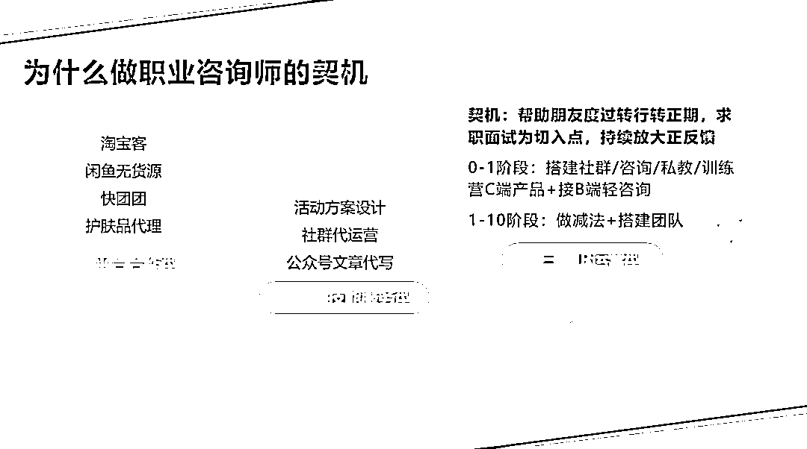
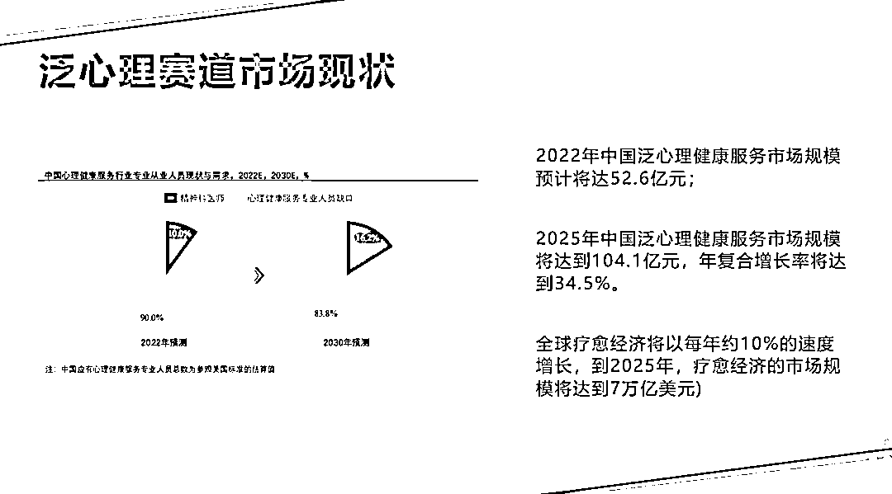
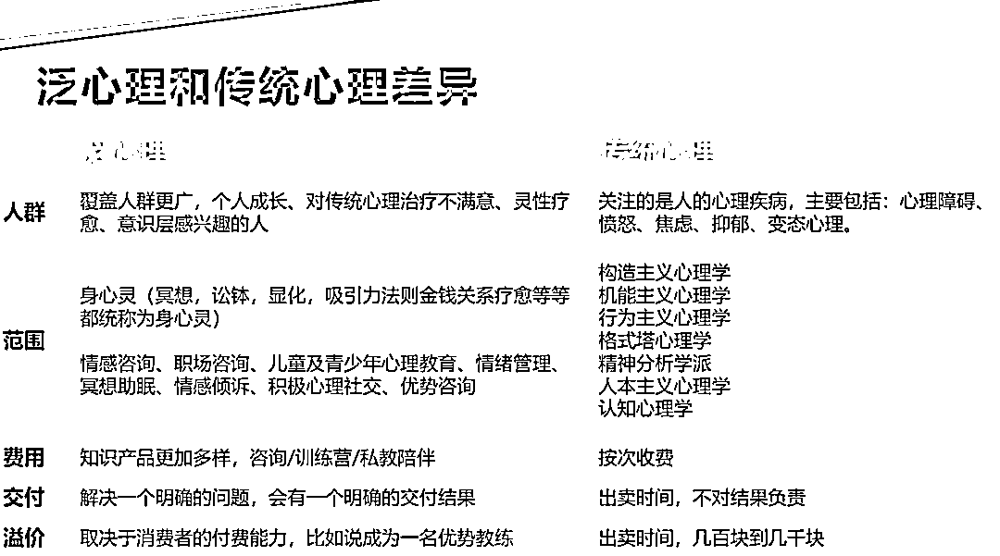
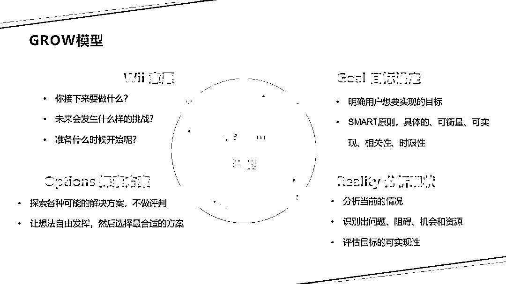
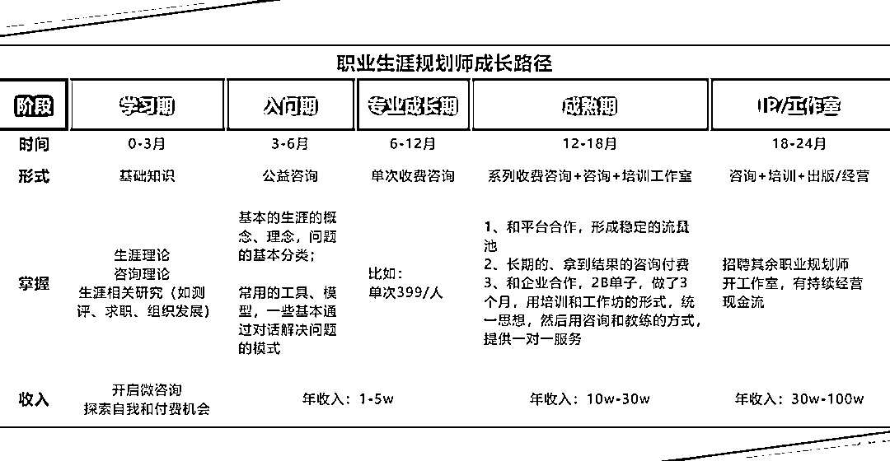

# 关于做职业咨询师，你必须知道的 4 件事

> 原文：[`www.yuque.com/for_lazy/zhoubao/bnkq7hfa1s06vo8l`](https://www.yuque.com/for_lazy/zhoubao/bnkq7hfa1s06vo8l)

## (10 赞)关于做职业咨询师，你必须知道的 4 件事

作者： 自证预言家 Saki

日期：2024-06-25

Hello，生财有术的朋友们，大家好呀，我是自证预言家 Saki，现独立职业咨询师、知识 IP 孵化教练。

去年 6 月，我离开职场，全职成为一名独立职业咨询师，当月营收突破 4w+，过上旅居的数字游民生活；

身边越来越多朋友好奇，曾经东一个榔头西一个棒槌的我，是因为什么样的契机是做了一名职业咨询师，在背后看到哪些市场机会需求？

这次分享，我会围绕着 4 个部分进行展开：

**1、泛心理学市场现状及常见商业模式分析**

**2、一场完整的咨询流程是怎么样的**

**3、如何用 Grow 模型做一场咨询（附案例解析）**

**4、如何成为一名职业咨询师（成长路径拆解）**

### **1.成为职业咨询师契机**

### **①996 职场环境与压力**

#### 不知道大家对工作有没有这样的职场倦怠

作为一个 996 的打工人，在工作上遇到操蛋的事情可真是不少，有时候还得给同组做不好事情的同事兜底，做救火队员，每天心里都有 1w 个草泥马在奔腾，心累又无力……

在 2021 年初的时候我就开始去寻找各种副业的可能性，为的有朝一日可以开除老板，自己单干。在这个过程中，我做了非常多的副业探索，淘宝客，闲鱼卖货，运营个案咨询，社群代运营，微商，兼职讲师……

因为我一直在不断的尝试，不够专注，但别人在笃定深耕的领域已经遥遥领先并且有结果。面对这种落差和挫败感让我难以接受，导致心态失衡。

那时候我本来想好好搞自己的主业就算了的，当时把自己的复盘文发到一个小圈子社群里，刚好被中小企业老板看到了，于是有了 2B 代运营的合作。

正因为我在 8 月接入了代运营这个副业，然后被熟悉的朋友知道了，他觉得我的成长速度在同龄人里算是比较快的（当时主业副业双曲线）。他当时销售转行汽车行业渠道运营，组里的人都不太懂营销，当时看我工作做的风生水起，想来咨询我如何做好一名运营；

命运的齿轮就此转动，谁懂啊，当时我都没带过人，突然有个人说，付费向我请教，我还怪慌的在我的帮助下，我们 1 周会打 1 次咨询电话，定价是在 99 元，那是我定价最低的时候，799/3 个月陪跑。他每次遇到问题都是 1v1 打电话和手把手改方案，生怕给人带不好。

3 个月陪伴过去，他也顺利转正了，我突然如释重负，想明白了点什么。

原来，成人达己，成己达人，是这种非常满足的感觉，在帮助他人拿到结果的同时，我也找到内在的正反馈。

### **②泛心理赛道现状**

#### **市场现状**

如果你时常留意各种趋势的报告，你会发现，心理健康，精神需求，情绪疗愈等泛心理相关的领域逐步进入大众的视野，并且，未来会有万亿级别的市场需求 (全球健康研究所的报告《全球健康经济：超越新冠病毒》预测，全球疗愈经济将以每年约 10%的速度增长，**到 2025 年，疗愈经济的市场规模将达到 7 万亿美元**)。

后疫情时代，大家的心理健康的意识不断增强，对于寻求轻量级心理咨询援助的需求直线上涨，同时对心理健康服务的消费意愿也在同步提高。中国心理健康服务需求普遍存在，但供给严重不足。

2022 年中国泛心理健康服务市场规模预计将达 52.6 亿元，2025 年中国泛心理健康服务市场规模将达到 104.1 亿元，年复合增长率将达到 34.5%。

**③关于泛心理学的科普**

**先给大家科普一下，什么是泛心理学，那它和传统心理学的差异点在哪？**

普适意义上的泛心理疗愈服务，主要提供如替代型心理服务：如身心灵（冥想，讼钵，显化，吸引力法则，金钱关系疗愈等等都统称为身心灵）、情感咨询、职场咨询、儿童及青少年心理教育、情绪管理、冥想助眠、情感倾诉、积极心理社交、优势咨询等轻量级心理健康服务也涵盖在内）。

它覆盖的人群更广，对传统心理治疗，灵性疗愈，意识层感兴趣的人，范围涵盖身心灵、情感咨询、职场咨询等，那这块的知识产品也是非常多样，有咨询/训练营/私教陪伴等…它更倾向解决一个明确的问题，会有一个明确的交付结果。

并且溢价取决于消费者付费能力，比如说你要成为一名盖洛普优势教练，成为一名 ICF 教练，那肯定是需要花费钱去进行教练技术学习和精进的，对应市场所出售。

而传统心理学，关注的是人的心理疾病，主要包括心理障碍，愤怒、焦虑、抑郁、变态心理等，它作为科学的一个分支，主要研究人类心理活动的规律性。

像构造主义心理学、机能主义心理学、行为主义心理学、格式塔心理学、精神分析学派、人本主义心理学、认知心理学等都是传统心理学覆盖的范围，那传统心理学为什么是对按次收费呢？

心理治疗是高度个性化的服务，需要针对每个客户的具体需求进行调整。由于每个人的心理状况、治疗目标和进展不同，按次收费能更公平地反映服务的提供和利用。

它其实是不对结果负责的，主要涉及治疗过程的本质、个体差异、以及治疗成功标准的多样性等因素，客户的生活中可能发生意外事件，影响治疗进程和结果。

一些心理问题的根源可能深埋于潜意识中，发现和解决这些问题可能需要不可预测的时间和努力。

在传统心理学这块的溢价，它的变现方式是不如泛心理学这块多样的，例如心理咨询它是比较私密，高度个性化的服务，需要针对每个客户的具体需求进行调整。它没法做到像泛心理学的知识产品那样，可以给大众提供一些普适性的训练营。

接下来，我们聊聊，大家最感兴趣的这块，在泛心理学赛道，我们可以怎么变现呢？它有想象中的那么好赚钱吗？让以终为始，从市场的角度出发，在泛心理领域，我们能怎样把知识和技能转化为收入。

### **④泛心理赛道常见变现方式**

**我就从 C 端和 B 端的角度出发：**

**C 端（消费端）**

1.  测试&评估工具：盖洛普天赋测试、MBTI、大五人格、霍兰德代码
2.  知识付费：

4.  线上：电子书、1v1 咨询、社群、私教、合伙人、私董会
5.  线下：工作坊、演讲

7.  实体产品：书籍、日记本、冥想垫、正念钟

**B 端（企业或机构端）**

1.  企业内训：为企业提供员工咨询测评、咨询服务、员工培训工作坊等服务
2.  企业顾问：提供专业内容或服务，通过分成或服务费用获利
3.  第三方合作：与学校、大学或教育机构合作，提供心理健康教育课程、讲座、研讨会等，通过合作费用或课程销售收入获
4.  数据分析：利用数据分析提供心理健康相关的市场研究、用户行为分析等咨询服务，帮助企业或机构优化产品或服务

### **2.咨询目的/原则/关系建立注意点**

**①咨询目的**

1v1 咨询的核心目的是给用户提供帮助和支持，提供定制化的解决方案；就好比，我们去商场买衣服，也都是需要挑选合适的尺码进行选购；

举个例子哈，你是一名正在找工作的求职运营人，在金三银四求职季中，不知道如何筹备，如何优化面试话术，导致每次面试都无疾而终；

我作为职业咨询师，从过程来讲， 需要给你赋能，鼓励你，能够让你从面试焦虑迷茫逐渐变得自信， 找回对面试的掌控感。

从结果来说，从简历包装-面试辅导-面试模拟-面试复盘-薪水谈判等，要给你提供一套定制化的求职解决方案。

#### **②咨询原则**

在我们正式开始之前，作为咨询师，为了更好的和来访者建立信任关系，也需要去遵守一定的原则，那具体是有哪些原则呢？

我总结了**5 大原则：道德保密、规则前置、用户认可、专注倾听、积极引导**。

**1、道德保密：**道德保密需要告诉来访者，特别是第一次来找你的咨询的用户，无论你是做什么方面的咨询辅导，都要告知他。这次咨询涉及到用户隐私和个人信息，咨询师是会严格保密的。同时，作为咨询师，我们也需要告知用户，在咨询过程中，我也是有自己的知识产权的，那么专业部分，涉及到内容和工具，也期望用户能够去进行保密（有的咨询师他也会去进行这样的一个阐述，表明自己的边界）

**2、规则前置：咨询的规则一定要前置告诉来访者，你的咨询的流程分别是什么？能够给用户什么样的交付物和陪伴服务，也是需要我们去表明边界的。**

我的一般咨询流程是这样的：

在用户付费后约咨询时间，让他们填写好咨询材料表发给我，在正式开始咨询的时候，我会和他们表明这场咨询的流程；

咨询时长为 1.5h，前 40min，我会以教练技术提问为主，后 40min 我会中立告诉我的建议和解决方案，剩下 10min 进入咨询复盘环节。

一般做完一场 1v1 咨询后，我给用户布置个小作业，并且会安排上 7 天陪伴时间。会定期回访用户有没有去行动，在这个过程中感受怎么样，有没有卡点？等 7 天结束，我们这次咨询服务结束，欢迎你有 xxx 需要下次再来我。

**3、认可用户：**在咨询过程中，我们一定要让用户不断自证她过往的高光时刻。把她的现状一些点、理想状态（未来），现状和未来差距在哪里？你需要去提供解决的。

**4、专注倾听：**如果用户表达欲非常强烈，我会说：我觉得你说的 xxx 点很对，我也这么认为，我好奇问一句，接上你的咨询话术，那你觉得现在是 xxx？或者是直接不评价，嗯嗯，对的，了解，明白。

**5、积极引导：**切记不用负面描述去引导用户，往正向方式引导，积极语句方式。

**③咨询关系**

除了遵守上述的 5 种原则，作为咨询师，也是需要全面信任你的用户本自具足，他是具备解决问题的能力。

### **3.咨询流程的三个阶段**

我们把一场完整的咨询流程分为咨询的前中后期。

**咨询前：**建立关系、挖掘需求、深入痛点、展示产品（咨询/服务）、解答疑惑、成交。

**咨询中：**

1.  目标澄清（必须要做）
2.  思路澄清（grow 模型）
3.  咨询落地（行动和解决方案）
4.  咨询反馈（录音、回听录音复盘、让用户给你反馈）

**GROW 模型**

1.  目标澄清
2.  现状描述
3.  询问过往尝试方案
4.  阻碍卡点
5.  其余人是否给 TA 资源/支持/如何做
6.  他是否改变这个问题

**咨询后：**咨询产品设计，是否有陪伴服务

1.  单次咨询：399/次，送他一个 7 天陪伴答疑+成长社群陪伴
2.  咨询复盘（咨询师）
3.  用户反馈（截图存下来，发朋友圈）

**我们在做咨询的时候，其实最常见的一个模型就是 Grow 模型，如何用 Grow 模型做一场咨询？**

### **4.Grow 模型在咨询中的应用**

GROW 模型是一种教练式的沟通方法，这个模型也经常被运用在咨询中。基本上来说，它就是围绕**目标、现状、方案、行动**这四个步骤来进行。

**第一步****，确认****目标（Goal）**：明确用户想要实现的目标，一般要符合 SMART 原则，即具体的（Specific）、可以衡量的（Measurable）、可以实现的（Attainable）、具有相关性（Relevant）和有时限的（Time-based）。

**第二步，分析现状（Reality）**：分析当前的情况，识别出问题、阻碍、机会和资源，评估目标的可实现性。

**第三步，方案选择（Options）**：探索各种可能的解决方案，不做评判，让想法自由发挥，然后选择最合适的方案。

**第四步：行动意愿（Will）**：你接下来要做什么？你觉得未来会发生什么样的挑战？准备什么时候开始呢？

**【案例】毕业 1 年的应届生小 A，成功转行去互联网公司做文案策划**

**背景：**小 A 是一名应届生，初入职场时，按照家里要求进入了国企。但工作了一段时间后发现，和自己预期不符合，比如国企的工作重复机械，没有创造力，死气沉沉。

当时他和我聊起不知道转行能做什么的时候，不知道找什么样的工作。

我通过 Grow 提问的方式，发现他的个性在写作，创造力这块比较突出，大学期间靠语音写作写了 30w+字的小说，自己也做过一些新媒体运营助手的工作。

那用 Grow 模型来提问的话，可以怎么说呢？

**第一步，确定目标（Goals）**

1.  今天要探索什么话题？
2.  它对你的意义是什么？
3.  如果要转行，你理想的工作状态是什么样的？**（公司、薪水、岗位、和什么样的上级/同事相处）越详细越好**

**第二步，分析现状（Reality）**

1.  你现在情况怎么样？
2.  尝试做了哪些呢？**（做了，结果怎么样？如果没有做，是哪里出现了阻碍呢？）**
3.  有哪些是你想做，但是没有做到的？
4.  如果换做是其他人，他们面对转行困境的时候会怎么做？

**第三步，方案选择（Options）**

1.  有什么样的资源可以帮到你转行？
2.  **有哪些人可以帮到你？你转行需要多少金钱过渡这段时间？**
3.  如果转行出现 xx 情况，你会怎么做？

**第四步，行动意愿（Will）**

1.  聊到现在，你觉得你放下了什么？感受到了什么？
2.  接下来，你想要做什么改变？
3.  未来可能会遇到哪些挑战呢？
4.  下一步你打算做什么？
5.  打算什么时候开始呢？

### **6、如何成为一名专业咨询师？**

#### 我整理出来的一份职业生涯规划师的成长路径，对应不同的阶段，新手到老手所需要掌握的学习理论和收入区间，仅供大家做一个参考；

毕竟每个人的执行力、天赋、资源也不同，个体在变现形式上会有不同的差异点。不怕慢，就怕站，所有的不凡源于坚持，只要我们持续在迭代和微调，有结果是早晚的事。

如果这篇内容对大家成为一名独立咨询师有帮助的话，也欢迎大家衔接我呀~

* * *

评论区：

暂无评论

* * *