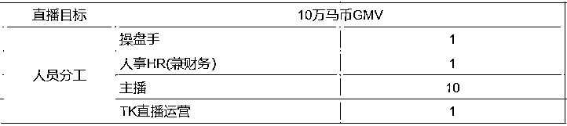

# 做TIKTOK直播，每个直播间月均10万马币。

> 来源：[https://l6zk1q2529.feishu.cn/docx/A3nsd6kNtoyZh5xziK0czkfingB](https://l6zk1q2529.feishu.cn/docx/A3nsd6kNtoyZh5xziK0czkfingB)

# 在马来西亚 做TIKTOK直播，每个直播间月均10万马币。

数据就献丑了，在马来西亚单场直播能做到6000马币以上。

我是如何做到每个直播间月均10万马币以上的呢？

以下是详细分享。

在马来西亚做TIKTOK直播，从去年1月份落地到现在，遇到各种各样的坑，

都是自己在马来西亚做TIKTOK直播遇到各种各样的问题，如果你处在我经历过的阶段，希望对你会有所帮助。

马来西亚一个直播公司的成立，需要四种人，分别是操盘手，主播，人事HR包含财务记账，和直播运营。

分别的职责是。

1，操盘手 负责直播间的选品， 开品，采购，跟单， 和 盈亏财务的计算，TIKTOK大盘的整体操控和业绩进度的完成。

2，HR人事负责不断地招聘主播和筛选主播，计算主播运营的提成和奖金。及时支付各种开支。

3，直播运营主要负责直播场景的搭建和主播直播的话术培训，直播复盘和优化细节，活动策划和流量控制，包含出单的客服，退换货的打包发货，处理退换货的问题。库存整理这些。数据整理反馈。还有店铺的达人广场邀约，分佣体系的达人样品寄样。

这个运营最好要会3种语言，分别是马来西亚语，英语，华语（普通话）

马来西亚的主播，有很多主播的英语其实很一般，需要用马来语去详细沟通直播需要的细节。

因为单独的中国人操盘手听不懂马来西亚语言，很多事项需要直播运营用华语跟操盘手沟通，如果单纯用英语去跟马来西亚主播沟通就会有损耗，马来西亚运营用英语再跟主播去沟通，又会有一层损耗，很多细节就无法落地。很多细节就无法实时执行。所以，最好是直播运营直接用马来语跟主播直接沟通，用华语跟操盘手沟通。

4，主播的职责主要是，直播前的短视频素材拍摄，每天按时直播完成业绩KPI。直播结束后运营TIKTOK短视频账号和达人的邀约。进行产品寄样，获得更多的达人一起带货。

# 一，办公地点场地选择。

我们已经踩了两个坑，一个是办公室地理位置的坑，第二个就是装修的坑。

地理位置没有选择对，场地问题就直接影响招人难的问题，去到马来西亚比较偏的位置，虽然办公室租金低，但是会出现招主播难的问题，招不到主播，业绩就会很差。

尽量选择距离吉隆坡市中心比较近的地方，最好靠近马来西亚大学的办公楼。好招人，好找人，

所以，开局选择位置就非常重要！！

如果在马来西亚做TIKTOK直播，最好一次性选择规划好办公场地的房间规划，因为马来西亚这边的办公楼都是按年租，有的是两年以上才起租，租下来自己不满意，自己需要改动的话，是需要花费一笔不小的资金的，并且需要垃圾处理费，最可爱的是，连纸皮这种东西都没有人要，懒得去收拾卖钱， 很少看到有闲置回收站的。

很多新手一上来就喜欢去租那些独栋的排屋，又便宜又经济实惠，就是一栋楼3层半的房子，一二层方便直播间的规划，3层拿来自己住和办公，顺便解决自己的吃住问题，想法很美好，但是，这是个坑来的，在马来西亚，租排屋做TIKTOK直播吵到邻居，很容易被邻居举报的。一旦被举报，公司就很难再运营下去。

办公室前期一定需要慎重深度思考好办公室的规划，比如，10个主播直播间，一个办公场所和一个休息室加两个厕所。最好空置一个房间专门放杂物等东西，类似仓库的地方。可以方便打包发货和样品的摆放，

如果前期没有规划好，后面的搬办公室的隐形成本就很高。一般主播不会跟着搬走。

马来西亚的风俗是：在办公室的一个角落会放置一个神位，类似潮汕的财神地主老爷，方便马来西亚人和一些穆斯林宗教的人朝拜。主播有专门朝拜的方向。

# 二，招聘主播和用人的一些细节。

先讲核心，主播招人方法。

我的找主播的公式是： 颜值＞经验＞有粉丝的网红＞勤奋。

首先，我们靠的是在马来西亚直播赚钱，人，货，场的匹配程度就非常地重要。而人就排在第一位。我在马来西亚直播这么久的经验来看：

颜值高的＞有经验的＞有粉丝基础敢于要工资的主播＞勤奋的主播。

a，颜值高的主播，这里指的是女性和帅气的男性，年龄控制在18-35岁之间。颜值高的主播自带流量，可塑性很强，可以解决很多内容场的问题，获得更多免费的流量。

b，有经验的主播，这里指的是在TIKTOK平台直播过的主播，有直播控场和转化经验的主播。

起码直播的时候不怯场，敢说，敢展示才艺，说话流利和有节奏，能详细描述产品的卖点。

c，有粉丝基础敢于要薪资的主播，这种每次HR跟招聘的主播谈薪资的时候，很多主播都希望要求薪资高一些的，这种直接按试用期直播给工资，达到直播的kpi再指定单独的一套薪资体系。

d,最后勤奋的主播，马来西亚这边节假日很多，基本三个种族的节假日都放假，（马来西亚节假日，印度节，华人节）基本每个月都有马来西亚公共假期，基本一个月1-2天，加上主播一个月4天假日，相当于马来西亚主播一个月有6天不上班，很多马来西亚主播都非常的懒散，很多主播动不动就是请假干嘛的，所以，一个主播是否勤奋也非常的重要。很多直播间业绩不够，肯定是不够勤奋。直播时长不够。

再讲招聘的HR，铁打的招聘HR, 流水的主播，主播是靠筛选出来的，并不是单纯靠培养出来的，培养的成本有点高，而且TIKTOK变化这么快，主播还不一定能长久留住，所以，靠筛选是核心，而人事HR的重要性就在这里，不断招聘主播，筛选主播，完成一个品类的人货场匹配到接近完美。

这里也讲做TIKTOK的风险转移，

做TIKTOK最重要的就三个东西，人（主播）货（产品）场（流量）

首先讲人，马来西亚的主播是会遇到被挖的情况，主播签用工合同需要做好一些风险控制，怕做大了主播就跑了。基本合同签两年，工资当月发，业绩提成下一个月15号发，并且跟主播谈好这些细节，杜绝被挖的情况发生。

关于产品，做一些可以塑造品牌的产品，它可以做到不会因为主播的离职，导致直播中断，流量下滑严重，产生业绩不好的后果。以品为主，以账号为主，以直播打法为主，做到主播就是超市的导购员状态，tiktok的账号是一个数字资产，店铺产品链接就是一个重要的赚钱资产的工具，账号和链接随着流量的曝光，数据的转化，好评的体现，自然而然会吃到很多红利，

这里的红利指的是：

因为店铺的链接已经有基础的销量，商品卡的排名，产品的好评，精选联盟的排名，自然可以吃到达人带货的红利，搜索流量的红利，和复购的红利。

再讲招聘的TIKTOK运营，这个运营主要的职责就是直播间的场景搭建，培训主播直播玩法，途中需要及时更新学习， 考察分析， 营销策划， 账号布局， 预估推演…最终为直播的客户提供了产品价值，情绪价值，流量内容场的搭建，活动策划，广告投放，账号店铺分配，KPI完成的辅助。

# 三，关于TIKTOK操盘手选品。

关于选品，大需求大成功，小需求小机会，如果没有需求，那肯定就没有机会了。

这实际上也可以叫矛盾，头发长了是不是要修剪?天气热了是不是要降温?小孩是不是需要玩耍?

所以才有了各种产品需求。根据人群需求选品总没错。

在中国采购产品的话，需要提前一个月到国内购买好当月的库存和新品，并且海运或者空运到达马来西亚的仓库。

选品有以下几个核心选品数据平台：

1，TIKTOK官方公众号：TIKTOK shop跨境电商，实时了解最新最热，最爆款的产品。

2，TIKTOK MCN的数据后台，选择类目可以看到最新的实时销量数据，把所有的订单剔除20%即可看到这个产品的数据和实时动态，

3，第三方数据分析平台看一个类目最新前100排名的产品，根据人群，年龄，使用场景，产品解决痛点，来选择适合自己主播的产品，并且利润不错的款，直播的款，利润最少30%-40%以上的款才做，如果产品客单价低，就用捆绑销售来提高客单价。

如果对一个品的把握性不大，可以用以下两种方法快速获得反馈。

一，可以购买马来西亚本土店铺测品先开播测新品数据。一般从GMV和实时用户反馈进行。

二，也可以利用tiktok广告账号投放快速获得一个产品的市场ROI，能投正的品再进行备货。

可以参考第三方数据平台已经出单的视频制作素材，在马来西亚，有25马币就能制作一条素材的渠道。

品选择好了之后，最重要的就是跑工厂环节。

一个品的生命周期和一个产品的实时销量数据，工厂是可以给到一个真实数据的反馈，和深度供应链的保障的，不然一款产品卖爆之后，没有深度的库存，只能走马观花看着销量骤减。最后昙花一现，没有积累到实际的东西。

跑工厂的几个细节，一，需要开发提前做好产品工厂背景的调研，

因为跑工厂的目的就是自己是客户，要在供应商面前展现足够的实力。

我们需要在供应商面前拿到最低的产品批发价格，和争取产品账期的空间。产生长久深度的合作，跑工厂的最重要目的也是了解供应链的实力和是否满足我们库存的要求，

一个工厂的实力不大，不能生产那么多货，我们直播将产品卖爆，也是很痛苦的一件事情。

跟工厂要账期有利于我们资金周转和资金金融的使用。将资金利用率最大化。产生最大化价值。

跑工厂之前需要货比三家，从产业链去找厂家更靠谱，找到一个比较靠谱的厂家，从1688或者阿里巴巴国际站上去看工厂信息，用企查查来检验工厂基本情况。产品的资质和认证资料一定要齐全，

操盘手要保证直播的库存和新品的开发。不断稳定销量的增长，和利润的保证。可持续性发展。

# 四，马来西亚的直播详细规划。

场地，人，货都解决了，现在剩下的就是不断设定目标，完成目标，优化细节的流程。

一，自己开设马来西亚本土公司，找靠谱的代办全部搞定，并且注册好马来西亚本土店铺，将发货地址改到自己合作的本土仓，退换货地址写到办公室，将产品采购到自己的本土仓和样品到达直播间。将产品上架到自己的店铺。

HR招聘的主播，快速试播，根据主播的反馈，快速完成，人货场的匹配，主播不行不要一直拖延，快速优化，

合适的主播快速上岗。快速适配直播的打法。

二，TIKTOK运营负责直播间的场景搭建，灯光优化，直播直播的排班表，数据实时监控。

这里分享我的一些直播间标准化执行流程表格。

## 1，TIKTOK直播间标准执行流程

主播来到办公室后，就是拿着手机先拍摄18条短视频，然后开播前发布3条短视频，开播中运营在电脑定时发布3条短视频，开播后发布3条短视频。

新主播培训期间，先让主播看对标直播间的直播方法，话术和一些引导下单的路径，学习平播方式和快速过款的直播方式，让主播自己写直播话术，然后直播运营去优化详细细节。让主播印象更深刻，能快速上手。

## 2，直播脚本设计

给主播设计一些直播脚本设计。

一个主播安排两个苹果13手机，1个手机两个帐号，一个手机备用给主播看直播的客户评论问题，剩下的素材发到另外一个备用号上，用于短视频带货。

开播前准备，

运营把场景灯光，直播手机设备，或者索尼相机直播场景搭建好，把电脑直播中控打开，产品链接价格检查，库存检查，主播的备用看评论手机和提词器都需要提前准备好。

## 3，直播间模块

主播一天任务是播三场，一场播两个小时，每天开播前准备好18条短视频，自己两个账号，每个账号开播前发布3条短视频，开播中三条让运营发，开播后让主播再发三条短视频。

直播运营根据直播间的数据反馈，快速决定要不要拉时长播，和每天及时调整时间段去播，

像马来西亚，一般是发薪日转化最好，节假日周末流量最大，晚上用户活跃度最高，根据品类的用户画像，测试出直播最佳时间段，用最佳时间段去播，可以做到事半功倍的效果。

## 4，短视频创作自检查

开播中如果订单少，主播边直播边打包，营造很多客户购买的样子，

开播中如果订单多，运营可以帮忙打包和衬托氛围。根据直播的实时数据，该投流的投流，该双屏共振的就及时双屏共振。

## 5，直播间执行流程

## 7，直播中检查

如果有店铺后台的活动，及时参加，如果没有活动，店铺活动设置也要到位，该折扣的折扣，该优惠的时候优惠。

## 8，TIKTOK直播后检查

开播后复盘，

人事，操盘手，运营，和主播一起坐下来看直播数据，花15分钟速战速决。

主播讲遇到的问题，运营讲直播中需要优化的细节，基本做到当场问题当场解决，不要拖延，HR人事负责统计一天的直播数据和奖励，包含产品退换货的问题。

## 9，直播复盘表

可以根据以上做个数据复盘表，及时发现问题所在，优化问题。

## 10，直播内容吸引力问题自检查

如果直播间流量不好，和出现流量很好，没有转化的问题，可以参考下面的直播内容吸引力问题自检查。

一般产品的下单需要一个痛点的展现，下单频率很重要，特别是主播需要引导用户评论，评论多才能说明用户的需求大，

# 五，马来西亚本土主播账号运营。

一个马来西亚本土店的销量来自于4个渠道：

1，自己TIKTOK账号绑定店铺账号做短视频插入商品卡小黄车出单。短视频流量，

2，自己用本土主播直播吃直播广场的流量进行直播出单。直播流量

3，本土店开通联盟营销开通达人佣金计划，邀约达人带自己店铺的产品，或者让其他野生达人自己选择带自己的店铺产品出单，商品卡流量。

4，TIKTOK本土店的产品链接，货架排名自然搜索货架电商进行出单，搜索流量。

每个流量渠道都有独特的打法和玩法。

而主播能做动销主要两个渠道，分别是以上的1，和 2，

以上的第二个直播出单是主播最核心也是销量占比最大的渠道，

一个月一个主播要制定保底目标，一个月100000马币GMV销量的目标，每天是3300的GMV目标，客单价在30马币左右的产品，一天播三场。一天一场就要去出37单，

主播短视频账号运营，要以主播出镜制作带产品的视频挂小黄车。可以产品测评，拆箱展示，好物推荐，产品卖点展示。

一天18条短视频，一个月26天，一个月产出468条短视频。不断吃免费流量。进入更高的流量池。

主播账号直播运营的规划和细节落地

基本一个主播配置两个账号，一个主播卖产品的账号，一个备用的账号，一个主播绑定一个店铺进行直播，一个账号绑定官方号，一个账号绑定渠道号，

我自己测试的数据是，短视频数据不错的情况下，在马来西亚第一场直播的推流非常好，所以，一个店铺的首场直播需要一位有动销能力，能控场的两位主播直接拉爆直播间的数据，目的就是进行账号的标签和直播账号定位的养成。

一个账号开播，会由两位主播来开一个账号的第一场直播，第二场再由负责这个直播间的主播来进行直播。

账号的短视频要注重当地的文化习俗来制作短视频，避免一些违规和一些敏感词，比如视频不能太暴露关键部位，并且参考国内抖音产品痛点展示的借鉴。强化产品的功能和使用场景。

而操盘手和直播运营要做主要动销两个渠道，分别是以上的3，和 4，

商品卡流量，选择好产品后，产品链接和基本的打法就需要有销售预案，邀约更多的达人带我们的货，链接才会一直有热度，有基本的达人一起推爆链接，在马来西亚，也有专门BD的达人团队做出了比较好的业绩。

所以，达人BD是比较重要的一个工作，需要及时做到位，及时和活动策划匹配。

搜索流量可以参考店铺的各种节假日的活动，获得更多的搜索自然流量爆款，进入更大的流量池。获得官方的加热曝光。

# 六，在马来西亚会遇到哪些问题？

在马来西亚两年里，陆续遇到很多国内的团队来到马来西亚做TIKTOK直播，有做了几个月就倒闭了，都是遇到差不多一样的问题，

跟他们交流，也总结出来很多问题，分享给大家，以免大家踩坑。

关于直播方式，

在TIKTOK做直播带货，基本上都是开卷考试，答案全靠复制粘贴，更多需要有自己的答题方式，避免更多的同类答案，没有突出的差异。基本很难做到很高的业绩。遇到产品流量好的情况下，一定要及时打爆这个品类，快速占领到头部。

关于选品，

不要开发没有资质认证和资料的产品，不要凭感觉选品，多依赖市场数据，多了解当地市场的用户需求，选品这一步非常关键，这是一步错，步步错的问题。海关会扣押没有资质的产品。

认识一个中国团队，一个月赚了200万，然后开发了没有认证的产品，导致被海关扣押罚款，最后直接宣布失败，原地团队解散。

关于团队，

可能去年还有进场直播就赚钱的机会，这里面就有大部分运气的成分，很多品类没有齐全，可以快速进场直播获得收益，但是现在随着当地达人，品类，TIKTOK直播环境的成熟，目前需要更完善的TIKTOK团队，更专业的匹配团队，才能打硬仗，才能走到更远的位置上。

光靠直播是不够的，达人BD，短视频输出，广告投放，商品卡投放，都需要同步进行。

关于语言，

英语不好，或者没有找到一个即懂马来西亚语，印度语，华语的人，做马来西亚直播就会遇到很多阻碍。一定要事先解决语言的问题，TIKTOK直播是快节奏的平台，沟通效率低的话，一定会被温水煮青蛙，慢慢消耗死。

# 七，做TIKTOK直播的一些建议。

1，做TIKTOK直播行业，入tiktok行业前，需要提前调研。

需要把TIKTOK里的高手，优秀的同行研究分析一遍，是对做这个项目最基本的尊重，否则问问自己凭什么让你赚钱？

其实做TIKTOK也有基因论，在过去TIKTOK行业沉淀的直播经验， 养成的本土化消费思维和习惯，直接影响TIKTOK直播项目的成功率， 如果没有任何经验， 不要轻易的进入。

2，TIKTOK直播成功是可以借鉴的，

很多头部品牌直播间的第一步都是学习前辈的经验和思维快速起步， 活学活用。他山之石可以攻玉。

所以说做TIKTOK直播就是执行力，赚钱有时候跟努力没多大关系，也不看谁聪明， 而是看谁先到tiktok市场实践和测试了，TIKTOK上面各行业各个类目都有机会，哪怕开始把那产品服务加价一块卖出去赚那一块差价，你都是走在做tiktok业绩增长的路上。

TIKTOK直播赚钱的万能公式是销售额=流量×转化率×客单价×复购率，就是卖卖卖， 不断地拆分目标， 倒推去优化每一个环节数据， 水到渠成。

3，之前总结做TIKTOK为什么失败的，现在我总结以前做tiktok项目是为什么成功的。

有时候分析10个失败原因不如分析1个成功原因，

定位很重要，找到适合自己的切入点，去坚持下着“笨功夫”

唯天下之至诚能胜天下之至伪，唯天下之至拙能胜天下之至巧。会一万招不如把一招练一万遍。

TIKTOK流量就是人， TIKTOK是兴趣电商平台，直播是内容展现的舞台， 与人打交道必须有利用价值且真诚，价值又来源于内容， 不管在哪个类目都要创造新奇特的内容，其次是信任， 那莫过于打造产品品牌，个人IP品牌，单纯传统线下营销获客方式已不再是最好的选择。

做TIKTOK直播，永远保持空杯心态，专注、执行，不断复制放大。当你没有背景和错失机会的时候，你唯一能做的，就是学习选择的能力，用选择的能力抵消你背景的单薄和机会的错失。人生没有什么跃迁，真正的跃迁除了能力，更多是选择的正确。

4，我们不要看不起任何直播间的主播。

也不要为难任何质量差主播或者看不起别人的TIKTOK直播间的主播玩法，因为我觉得一个人的层次高低不在于他的学历和身份，也不在于他是否有钱富裕，而在于他跟弱者相处时的态度 。

大部分时候，一个人赚不了自己层次以上的钱。

TIKTOK的强者是在荆棘丛生后，依然能积极乐观的从容面对，保持豁达的心境，把苦难和挑战视为化了妆的祝福，用感恩和微笑面对人生每一个新的起点。

你永远无法想象，在马来西亚卖咸鱼的直播间，利润能达到90%， 卖水果燕窝的直播间，一个月能卖100万马币。

你比别人强一点根本没用，真正有用的是你比别人强很多很多——《把时间当做朋友》

危险与机会是并存的，TIKTOK市场是此消彼长的。

5，主播与主播之间的差距，是怎么拉开的？

就是日复一日，说白了，就是主播今天你干了啥，学习了什么？所以，日常习惯是拉开距离的根本。

保持看TIKTOK直播玩法的学习，保持独立思考，否则你的经验都来自你的身边同行好友的建议。 但是这种建议是无效的，你不实际操作都是一些比较虚的经验。

一个维度有一个维度的思维逻辑，他会导致TIKTOK游戏规则不同。需要你与时俱进，跟上TIKTOK的变化。

所以有什么是一成不变的呢? TIKTOK只会变得更加复杂，作为我们TIKTOK从业者，既然选择了这条路，就必须学会应对这种复杂，应对各种巨变。

6，TIKTOK木桶理论.

我们大家都听过一个木桶理论，说的是一个木桶能装多少水，取决于最短的那块板。

那如果咱们是做TIKTOK直播，一块一块的板是什么?

有一块是团队，有一块是流量，有一块是产品，有一块是销售策划，有一块是品牌等。

那如果我们这些都做好了，很多业绩就自然水到渠成，如果缺了一个东西，我保证你这个事照样很难做起来，

必须每天按部就班的按照自己定下的目标和指导理论严格执行，带领团队一块执行。

7，用未来决策现在，

有人说过一段话：

不问我的一双手能干多少事，惟问移泰山需要多少双手;不问我的一口锅能煮多少斤米，惟问劳千军需要多少口锅;不问我的一盏灯能照多少里路，惟问亮天下需要多少盏灯。这就是结果导向的思维方式。

去年的时候，有几个马来西亚老板加我，有个老板都是做线下实体店，线上3C品牌手表类目的，年营业额大概在2000万左右。然后说想提升营业额，问我有没有什么办法。我说最简单的办法就是拿出营业额的20%到30%打广告。

他就说：这不现实。除去成本之后，我利润也才这么多，都打广告不就是赔本赚吆喝了吗，一年到头白忙活。

我就跟他算了一笔账，你现在是营业额2000万，利润20%。那如果你把这20%拿出去打广告，是不是不赔本，刚好收支平衡?

但是，你打出去TIKTOK广告被更多人看到，明年的营业额是不是会高于2000万，而且你的市场份额是不是扩大了?

不仅没有赔钱，而且赚的更多，比竞争对手更有优势了。以上。