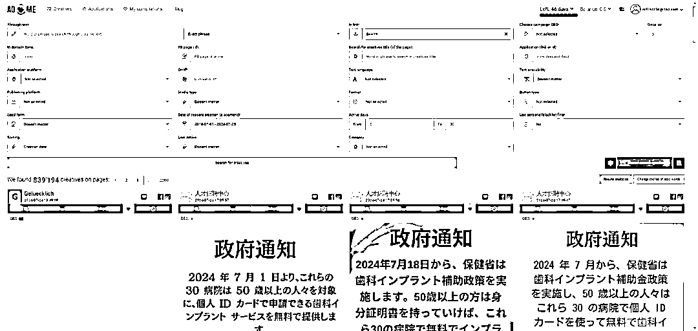
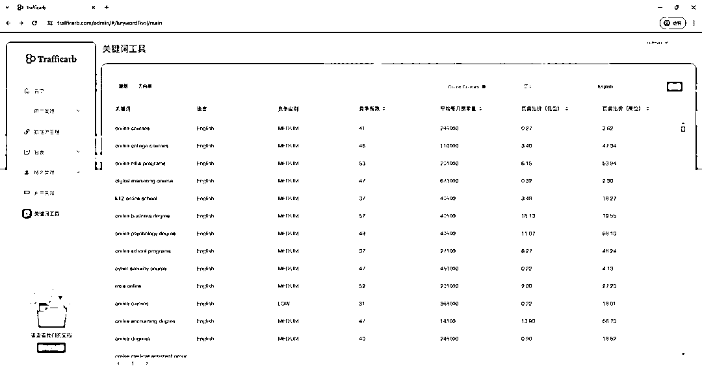
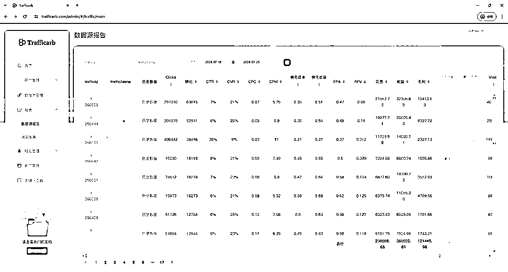
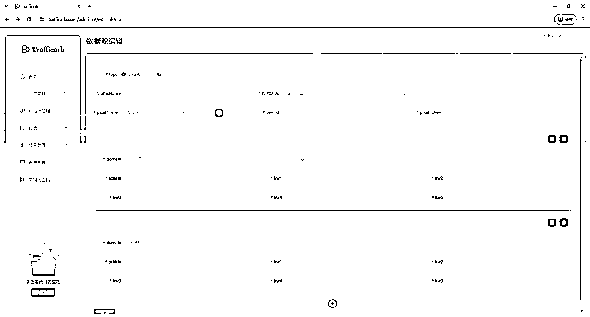
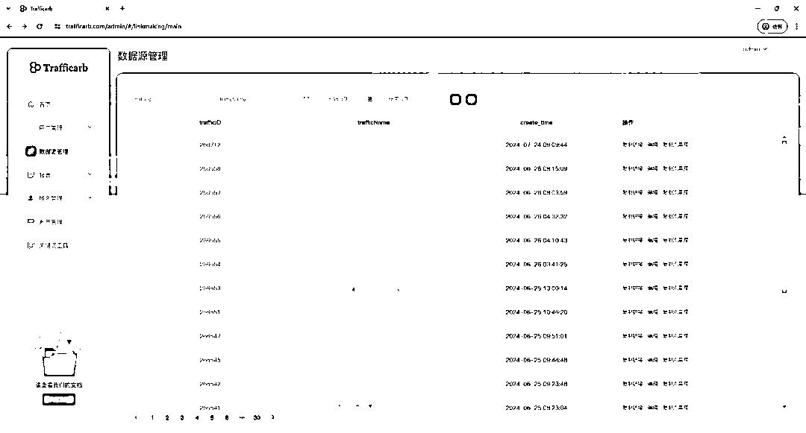
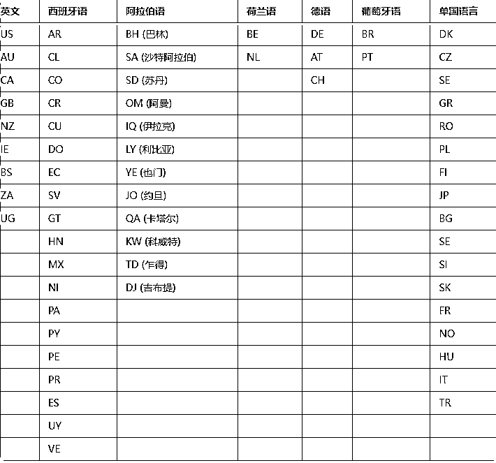
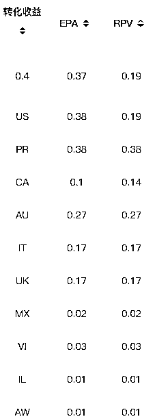

# 终极指南：搜索套利0-1快速入门方案

> 来源：[https://kw06hox1wb0.feishu.cn/docx/ZZm8dOQNuoWsB0xiLN9c44uTnYe](https://kw06hox1wb0.feishu.cn/docx/ZZm8dOQNuoWsB0xiLN9c44uTnYe)

最近圈子里关于流量套利的信息可谓是铺天盖地，这个项目不用过多的去阐述 在各个论坛或者谷歌搜索都是一大堆信息，这些信息大多来自于各个服务商提供，广告商代理/追踪/自动化等等。

但真的在落地这个事情的时候会发现很多大大小小复杂的问题，而且由于服务商并没有投入到这个项目中 最多的是“道听途说”在国外论坛Copy 文章+翻译pdf 所以很多团队在执行的时候就发现很割裂的情况，明明是一个很不错的项目，其他团队一天大几万 十几万的量为什么我就是不行！甚至大部分人很难获利，cpc比epa还高，更不要谈套利。我们列举了一些大家在广告投流过程可能遇到的困惑，更多深度内容探讨可以添加我的好友 近期会有微信交流群。

1:很难测出一个方向，高价值的词大多都比较冷门，而受众广的词竞争很激烈 价格压的很低 又很卷。一个好的方向需要比较广的受众，同时这个方向又必须是高利润的行业 广告主才愿意用高的出价购买流量。

2:Rpc的不稳定导致很难扩量 fb的测试一般都是低预算 当测出一个好的素材和方向，第二天扩大预算 等最终核算的收益结果是亏损的状态。

3:几百条系列如何精确的优化每条广告？

4:大量的域名成本。

5:自己的方向，高价值词总是被别人跟跑导致有效周期大大缩减。

6:fb大量账户封禁，个人户加卡失败，冻结款项，花费限额。

7:TikTok 账户总是因为强关联导致封禁。………

接下来我会从Facebook 和TikTok 两大媒体为例 列举一些大家在广告优化过程中具体面临的问题以及解决办法。

Facebook 篇：

方向的选择推荐：工作、医疗、 药物、美容、贷款、二手商品、保险 金融、在线课程，这些是主流的大方向但是细分下去有无数精细方向，注意可以根据这些大类互相联系挖掘新的方向 比如目前律师工作是一个很好的选择，那么同理律师的在线课程也会是一个不错的角度 在拓展一下 民事、商业诉讼律师….

一：方向选择

每个投手的思维总是有限的，人总在自己的信息茧房中无法走出，所以肯定需要一些外部的数据作为引导和支撑。Spy工具：推荐使用adheart和adspy，会发现一些较新的方向，这里用adheart举例，一般会在【in link】中添加【&kw1=】或是【&network=facebook】进行搜索，因为这两个参数是搜索广告90%投放链接中不可替代的值(请举一反三）。

如果是自己已经有想要的方向，但是没有参考的，可以在刚才查询的基础上在【Through text】中添加想查询方向的单词，类似想要投放家具，可以在【Through text】：【furniture】即可找到多方向。

(1)FB广告资料库：搜索自己已经想好方向的单词、类似域名或是类似文案，直接搜索，这样可以找到很多同方向的投放广告，可以将其作为【标签】，以便后期查找时方便查看。

(2)Spy工具一般会作为主要找方向的工具，不仅能提供图、链接关键词，还能查看到投放国家，但是没办法判断该广告现在是否处于投放状态、是否点击量比较好，所以会将Spy找好的方向放在FB资料库中查看详情。

一、怎样将Spy找好的方向在FB资料库中查看？

(1)可以复制spy中的文案到FB资料库中找。

(2)点击Spy中的page-name，复制主页名称后回到FB资料库中查找。

(3)记录下来page名称，主域名，可以不定期的跟踪新方向。

(4)思路延伸，通过page和域名可以搜索到大量不同方向的素材，然后跟踪这些素材的文件继续去搜索，又可以得到大量的page和域名，重复这样的思路，你将会得到无限的可能。

二、作图工具是什么？怎样作图？

作图工具是使用的在线【可画】，主要是因为有大量免费素材可供使用。

作图一般是【创建设计】-【主图图片】/【自定义大小】- 像素【800 * 800】的大小，这样相当于创建了一个文件夹，里边可以添加很多800*800的照片。

素材样式：简洁花边，文字，加上引导词：立刻申请、点击查看、查看价格等等。

商品类：使用3-5行，4-9宫格等模板。

其它类：换下背景，边框，底色即可。

一个广告系列：4-6张素材，同一文案不同背景效果不一样，同一背景不同文案效果差异也很大。建议一次做6个素材，2-3种模板，每个模板2-3种背景。

三、怎样才能做出贴合方向的素材？

(1)如果是资料库已有的方向，我们属于是跟投，可以保存他们的素材1-3张，剩下的而需要我们自己做，（一般投放广告的比例是1:1:6，一个广告系列、一个广告组和6张素材），可以根据已有的素材更换他们的布局、背景等作出新素材。

(2)如果是已经投过的方向，我们需要测试新素材，就可以根据较低cpa的素材结合方向去分析原因去更新3-4张素材后，再找同方向不同素材的投放。

(3)如果是全新的方向，没有参考的素材，建议6张素材做2-3种布局样式和不同的钩子，去测试哪种方案更适合这个方向跑。四、怎样选择关键字？如何确定每个关键词的价值 TrafficArb系统提供了所有关键词的查询 可以根据方向查询 关键词查询 国家 语言筛选出竞争级别 指数 月均搜索量 页首出价（建议直接参考最低价 高价没有意义）

四：文案思路

1、谷歌搜索与其相关的信息，有些文章的标题往往就是个好文案。

2、搜索框里面输入关键词会自己下面弹出很多文案，这些文案搜索 量高，热度大。

3、Chat gpt。

五、广告优化一、预算怎样调整？

投放广告的初预算是7-10美金 一般不超过20美金，如果广告在亏损时，会调预算到4-5美元，如果盈利，会根据后天提供的多个数据来调整，一般不会翻倍加预算，防止翻倍加预算后导致广告重新进入【机器学习】状态而不是【投放】状态。对于小预算的获利广告，可以每次加预算4-10美元，如果是大预算获利广告，可以每次加预算30-50%。

广告系列的单次成效费用是平均的，修改预算一定需要进入到广告层级，关掉有成效，但是单次成效费用高于平均值的广告，也就是关掉【垃圾流量】。

二、怎样根据TrafficArb.com系统来调整广告？TrafficArb提供的数据较多

主要是通过CPA【转化成本】和【转化收益】做对比，【转化成本】越低于【转化收益】，就越是赚钱。当遇到广告系列亏损时，就需要分析其他数据，【CTR】越低，就代表需要重新更换系素材；如果【CTR】基本不变、【CVR】越低，意味着你的买量成本可以接受但是转化率太差了，这个时候大多人会想到更换素材，但实际上测试出一个好的素材和方向的难度同样很大，不能放弃任何好的创意，这时候可以选择比较 贴合这个素材的方向进行调整，简单说就是保持素材不变更换方向。

一个主要原则：降低买量成本，发送到高价方向/词 所有工作围绕这个逻辑进行。

使用TrafficArb可以在投放链接保持不变的情况下更换方向，很大程度上降低了测试成本。

三、扩量

这里分为两个部分

（1）：很多的优化师反馈随着时间会积累大量的广告系列，高达几百个，如果每个系列代表一个方向，那每天大部分的时间去查看系列的盈亏状况，加减预算是一个非常繁琐和不合理的事情，所以TrafficArb引入了一个概念“数据源” 也是上一段结尾的思路，优化师如果发现ctr表现良好的素材只需要在后台配置好同类方向的投放链接，然后系统会自动分配流量去价值更高的方向。

（2）：测试出来一个好的方向需要快速发挥最大价值，最简单的思路就是把同样的素材铺到同语言国家，然后制作其他语言的国家素材在3-5天完成全球主流国家的投放测试。

可以在一个系列中投放多个国家(同语言）然后在TrafficArb后台查看每个国家不同的EPA价值。

四:像素

尽管我最近认为像素跟踪的同一类的用户，比如喜欢安装，喜欢购物，喜欢点赞，但还是建议把像素进行一些区分，比如工作，金融，家具等

# TikTok篇：

1.搜索套利中适合TikTok的类目有哪些？我该从哪些类目入手？

金融 保险 医疗 美容美体 法律 教育 求职招聘等均为高价值类目，但略显遗憾的是，这些大都踩在TikTok禁投行业的红线附近，需要你在广告素材上下更多功夫，尽量规避某些敏感关键词。换言之，即使你投放的类目处于TikTok的“灰色地带”，但你的素材很“白”，这些广告仍然是被允许的。这其中包含极为宽广的利润空间。当然，低价值的类目也并非无利可图。根据数据来看，不少的内容发布者也通过电商爆品的跟投获得了不菲的利润。如果你有电商经验，也不妨选择从此类目入手找找感觉。

2.TikTok广告素材测试效果一直很差怎么办？

这是很多新手常见的问题，久测不得结果，素材成效率一直不尽人意。TikTok的兴趣标签比较泛，你很难通过用户画像定位到合适的受众，假如你的广告素材本身并不拥有广泛的受众，那么在广告账户和pixel未积累到足够数据以前，测试不出来效果实在是一件很正常的事，不要气馁，继续尝试。

TikTok的受众面向广大年轻人，所以你素材核心竞争力就是“吸引人”。诚然，之前列举的高价值类目，其中大部分看起来似乎与年轻人群体背道而驰，但总有优秀的内容发布者可以把吸引人的创意与投放的类目结合，产生奇妙的反应。

3.该如何扩大利润规模？

1:复制成功的广告组，更换不同受众，这是比较常用的一种扩量方式，当我们测试出比较好的广告组后，我们可以看一下转化用户的特征，性别，年龄，是否有较为集中的，然后我们可以复制几个新的广告组，专门针对细分受众进行投放，也可以复制广告组测试不同受众群体，扩大受众覆盖面。

2:除了测试不同受众以外，我们也可以复制组阶梯式增加预算，比如原先我们广告组预算是10刀，复制的广告组预算我们可以设置为20刀，30刀，40刀，根据不同预算组的表现，可以将优秀的组独立出来，给cbo()预算。

3:复制大量广告后，会导致一个问题，就是素材重复度过高，广告之间相互竞争，这样对我们的广告效果也会产生不利影响，所以我们需要对优秀素材进行一些调整：

①二创，比如混剪，文案样式，视频调整样式，加标题栏等一些不改变整体内容又能降低系统对素材重复性判定的操作。

②从转化较好的素材中找到转化可能的方向，针对这些点去创作新的素材。

4:TK账户总是因为强关联因素被封禁，到底是什么因为因素关联我们是不得而知的，而且这个算法感觉在频繁的调整，但是最基本需要注意的是，一静态住宅ip，一硬件信息，一主体，在测试下来众多指纹游览器中Adspower()的效果是最优异的，并且可以完美的结合主流的ip提供商，基于ip地址生成语言，时区等等非常完美。

投放广告最好经过冷启动阶段，投放post等其他广告目标消耗几天，小店是最好的，tiktok对素材的审查极为严格 所以测试出优秀的素材很考验优化师和剪辑的能力#素材原创度也尤为重要。

那么TrafficArb.com能给大家提供什么便利呢？

1：全行业所有资源渠道vip对接，faceboko/tiktok代理商，adspower专属客服，广告优化师等等。

2：最高的EPC，我们的系统会根据流量特性匹配到价格最高的方向和关键词，这将是几何倍的增加收益。

3：域名免费，根据渠道的营业额每天将获得不限制数量的域名免费额度，最低单日30域名。

4：全币种支付，如果需要RMB，香港挂牌公司极速换汇打款千三手续费，工作日当天到账。

5：落地页保护，技术通过地区，语言，ip地址以及时区、设备语言、流量来源、海拔等各个维度保护落地页，几乎不会有任何人可以copy到你的关键词。

6：如果流量质量持续三个月稳定并且没有任何假量，全部可以支持net15回款。

7:TrafficArb.com提供system1、tonic、ads顶级服务商，因为我们的数据体量以及技术优化，利润率相较于传统模式增加20%左右

8：非常有利的数据支持。