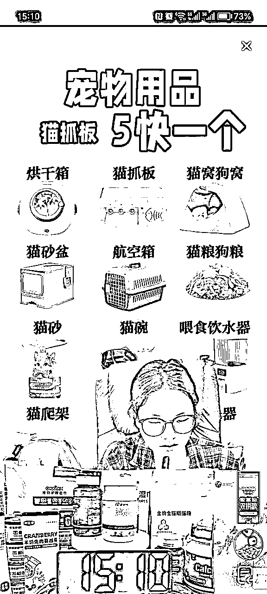

# 抖音直播第一天就出单，免费流单人单月19.8W变现的项目复盘

> 来源：[https://u16gtzbrexc.feishu.cn/docx/BroedDl6goUKcqxZmW5chYoDn7b](https://u16gtzbrexc.feishu.cn/docx/BroedDl6goUKcqxZmW5chYoDn7b)

两年前就有朋友推荐生财，当时专注于自己的项目，今年才加入生财大圈子。我是千易，21年开始做抖音直播，免费流，付费流，无人，半无人都做过，现在主要发力在免费流+内容型直播。

这篇文章给大家分享我上个月刚测试的一个小项目。适合人群：兼职副业、个人全职，团队可略过！

# 项目背景

今年315前后，我自己的直播间流量下滑了三分之一，每年年后的流量都不是太好，但是今年感觉阵阵寒意，所以想调研下，抖音现在挣钱的大佬都在干嘛。我就找团队的小伙伴做了一个针对免费流直播间的调研。

我们看了大概10000个账号，大几千个商品链接，找到了1000多个免费流直播间。其中就有我今天给大家分享的这个奇葩直播间。

这种非常low的直播画面居然还能存在抖音上，是我看到这种直播间的第一感觉。然后好奇心促使我去扒他的数据，看到后大吃一惊！具体看图，单月100-250W就出自于这么low的直播间，我觉得这是机会。

又详细看了他的每场直播的数据，也是很吃惊，直播16个小时的直播间居然只走了10000多人，单小时不到一千人，人数峰值也能告诉我们流量很低，但是，场观1W居然有1000多人下单，转化率8-10%，如果你做过抖音直播就知道这个数据的异常，抖音直播间的正常转化率大概就是1-5%左右，他是翻倍的。

对这个直播间的总结就是低流量，低在线，高转化。

那么他的流量是免费流还是付费的呢？这个账号看不到，我就继续找其他同类账号。很快，就找到了能够看到流量来源的账号情况。如下图，80%以上的搜索流量。顿时就明白了为什么他有高转化。因为来的人都是搜索流量来的。为什么要播16个小时，因为播的久人才多。

抖音发展了这么久，有很多人已经习惯直接在上面搜索了，把抖音当成了百度用，当成淘宝天猫用。我们也恰恰忽略了，免费流不止推荐feed，还有搜索流量。

我今天给大家分享就是这类直播间的玩法，适合新手小白。我给他起了一个名字叫，抖音搜索流直播间。

搜索流直播间的整个玩法我第一时间做了梳理，并且让团队小伙伴在上个月做了项目复制。1个人成功干出了19.8万的变现。但是，我还是决定把这个项目停掉（最后没停，给了我老丈人做了！50多岁做直播赚米，哈哈~）

# 项目玩法介绍

看到他们的数据，我首先想到就是如何复制，干多了有思维惯性了。整个项目到底是怎么运营的？核心在哪儿？为什么他能有搜索流？为什么直播画面这么low还能转化？抱着这些问题？详细了研究了对标的玩法。

整个变现路径解析：直接直播没有短视频，产品来自精选联盟，直播间挂200个品，有人搜索对应产品名进入直播间，然后下单，赚的是精选联盟佣金。直播是半无人，固定画面外加录音，真人偶尔问答问题。

# 做出的成绩展示

简单分析以后我安排团队小伙伴开始测试流程。第一天直播就出单，第三天做到1.39W，6月截止到25日变现19.8W（截止我写本文），整月超过20W。具体数据看下图，佣金收入53314.32，净利润是1.8W左右。

# 项目拆解流程：GMV=流量*转化

## 一、流量端：

流量是免费的搜索流，主要来源路径就是用户搜索某个产品，产品链接挂在我们的直播间，消费者点击链接就能直接跳转到直播间，下单了就有佣金。具体看下图。

那么直播间是如何获取搜索流量的呢？

1、挂很多个产品，一个直播间最多挂200个，挂满。流量端的核心就是找到有搜索流量的商品链接。

2、长时间开播，因为你不知道用户什么时候搜索，所以大家都播10-16小时，也有日不落的。

## 二、转化端

如何保证点击进来的人能够产生高转化呢，这个就是直播间内容的模块了，同样看上图

1、直播间给每个商品发了优惠券，优惠券是达人自己发的专属券，真金白银发的。所以消费者在这类直播间买更便宜，比官方旗舰店还便宜！

2、直播间画面会直接提醒大家有优惠券，大家可以直接下单，就有优惠。

3、直播间话术就两句话，不断的重复，新进直播间的宝子们看什么直接下单，比官旗便宜，主播补贴了大额券，等等。

从消费者的角度来说，搜索某个产品说明本身有很强的购买意向（确定需求），而且发货链接都是官方旗舰店，产品本身的质量是可以保证的（品质保证），剩下的就是价格因素，这类直播间又补贴券更便宜，是不是直接就无脑下单了呢（价格优惠）！

操作总结：直播10多个小时 + 找200个商品 + 发达人优惠券 + 话术重复。

核心点：找到有搜索流量的品 + 拉长直播时长。

利润计算：净利润 = 产品价格*佣金率*90%（90%是技术服务费）-达人券（我们自己发的券）

# 项目的准备工作

接下来就是我们的实操过程。这类直播间对我们来说复制是轻车熟路的，大家按照我的操作就可以。

## 一、直播间搭建

1、直播手机：苹果12以上+水冷散热器+充电器+手机支架 1套

2、展示手机：随便，不卡顿就可以 + 充电器 + 手机支架 1套

3、背景搭建：从家里找几个瓶瓶罐罐，美妆食品饮料瓶子之类的，不太重要。

4、直播间灯光：买一个直播灯100多就行，或者买个LED灯，挂在旁边把屋子弄亮点。

5、操作电脑：日常用能打游戏的电脑都行，主要用浏览器看后台，看选品。

6、半无人直播，还需要一个小音箱，几十块钱那种，用来放话术录音，毕竟一个人播10多个小时很累。

具体参考下图。

## 二、账号准备

1、一个抖音账号，可以用老号，最好有1000以上粉丝的老号，老号不要有严重违规；

2、老号不用担心人群画像，标签之类的，因为是搜索流；

3、新抖音号需要涨粉丝1000个，实名认证，开通电商橱窗。

4、账号必须是LV1以上才能发券。抖音考核是每月2日升级，所以需要在上个月先做一下等级。操作很简单。具体看图

PS：抖音关于达人等级改版的通知： https://school.jinritemai.com/doudian/wap/lark-doc/fdJ9BaM7AM48q?from=buyin_douyin_article

5、准备一个蝉妈妈/考古加等第三方数据软件用来找品，蝉妈妈要买企业版；

6、准备一个小不点直播软件，用来自动弹讲解、弹评论区话术，踢人等操作。

# 项目实操细节

核心点：找到有搜索流量的品 + 拉长直播时长。

操作流程：直播10多个小时 + 找200个商品 + 发达人优惠券 + 话术重复

上面两段话是整个项目的核心，谨记这两句话，然后我们做下面的细节操作。

## 一、简单操作

1、开播时间和直播时长。能播多久播多久。按照我们的测试结果来看，晚上7-12点必须要播，转化最好的时段，上午和下午差不多。凌晨2-6点竞争小也可以播，不过流量也小。

2、直播间话术。直接扒同行的。同行怎么说，你怎么说。新账号不要上来就用录音，新账号最起码得能稳定出单了，有一定的权重了再录音。新号刚开始就放录音容易被判违规封号。

3、录音处理。等账号稳定后，用录音也要每天处理下。用环境音，风景音，杂音处理。另外，也可以每天新录制一段，添加到原来的里面。

4、定时开播较好。确定开播时间后，不要随意调整，每天固定时间开播，每天播固定时长。

## 二、选品操作

选品是整个项目最重要的部分，他关系到直播间的流量大小，利润大小。重点就是选品！选200个产品。

1、选品优选类目：以蝉妈妈分类为例，

红色是重点关注的类目，搜索流量较大，产品也多，其中美妆护肤是大头，不过竞争也很大。

绿色框选的类目，这些类目关注度不高，竞争小，选到会利润高；

黄色框不容易选到品，大部分都是0佣金，而且退货率太高，我们基本不从里面选。

2、选品还有一个工具是蝉选，里面有高佣链接，你可以直接使用高佣链接，利润更高些。类似下图这样的，直接用高佣链接添加到选品车就可以。

3、选品的一些玩法

（1）跟同行法。你盯着几个同行，发现同行最近新上了那些品你也上品。跟品是最容易出单的，但是利润率不高。一般你想竞争得过同行的话，就得发比同行大的券，比如产品佣金到手是9.5元，同行发8元，你就发9元，一单挣0.5元。这个利润就很低了。

（2）自己选。自己选择同行没有带货的人，这个需要重点关注最近几天新上的品，同行还没有发现，你就优先挂了，一般第一个挂的直播间权重最高，同样的优惠券优先展示。而且没有同行比价，优惠券发的可以小点，利润能更高。

（3）团长推荐。你在选品的时候能看到一些链接是团长招商的，团长会达人群你可以进入达人群拿到一手的新品上新信息，也能帮助选品。但是不要去那种专门做发券的群，里面都是同行。蝉选也有信息播报群。

（4）自己谈定向。这种就适合有经验的同学了。抖音上很多链接公开佣金都是0-1%，实际也有达人带货，说明他是有定向佣金的，这种如果你谈下来基本没有竞争对手，主要就是耗费时间。

我们用起来感觉比较好的就是自己选，躲避同行的竞争，第一时间挂新品，利润率更高。

4、选品的实操标准

（1）选品一般选择绝对佣金在5元以上的，绝对佣金 = 实际售价 * 佣金率 * 90%（扣10%技术服务费）

举例，产品售价30，佣金率20%，绝对佣金=30*0.2*0.9=5.4。

举例，产品售价19.9，佣金率50%，绝对佣金=19.9*0.5*0.9=8.9。

绝对佣金越高越好，不要只看价格。

（2）选品要选择官方旗舰店发货的，更容易出单，如果是个体店的可以试试，我们测试结果是不太行。

（3）选择的链接不能是官方旗舰店直播间自己挂的。有的品牌也是日不落直播间，搜索流量官方也吃了，你挂上没流量。

（4）如果同行超过5个的链接我们就不优先考虑了，因为必须得发极大优惠券，那种9.5利润发9元那种。

（5）产品价格不是这里最重要的因素，我们测试过，十几块钱和三四百的都可以卖出去，而且三四百的品牌货发一个几十块钱的佣金，利润还是很大的。

（6）如何判断选择的品是有搜索流量的呢。这个没有系统能够明确看到有搜索流。从我们的经验来看，有几个判断标准。

第一是最近热销的百货产品都有搜索流。比如夏天用防晒霜、防晒衣、驱蚊液等

第二是最近新爆的品牌，比如最近大家热推的李陌茶。

第三是复购率比较高的食品，比如生鲜水果，还有一些南北干货等搜索流都不错。

（7）巨量算数可以看到某类产品近期的搜索情况，可以作为参考。

选品总结：由于可以挂200个商品，所以我的宗旨就是差不多就添加上，出单就留下，不出单就优化掉。你优化几轮就有一些稳定出单的了。不要在选品上过多纠结。

5、选品的流程

（1）做一个表格，记录自己选品的数据。具体数据看下图。

（2）链接就是高佣链接，有定向佣金的一定要去蝉选复制高佣链接才有高佣。

（3）实际价格看的是链接除去所有官方券，店铺券以后的价格，蝉妈妈和商品橱窗不太准，一定要用手机看下单页面。因为各种优惠券是可以叠加的，如果没算，实际佣金就错了。

（4）按照自己的实际的佣金情况，大概计算下自己要发的券是多少，最后的利润是多少。

（5）利润特别低的，竞争同行特别多的一般我们就不要了。

（6）挑选出来200个以上，进行下一步操作。

## 三、发券操作

1、第一步把自己挑选出来的链接添加到选品车和橱窗，现在抖音选品车和橱窗是分开的添加时注意，橱窗本身也可以出单，不要浪费这个推广位。

2、第二步就是发券，发券的核心就是计算好金额，发多了就亏钱了。

3、发券页面操作方法。直播间达人券是预充值的，需要提前充值钱进去，然后发券。发券选择是商品直减券，具体操作按照巨量百应后台提示操作即可。

4、发券就按照自己的统计表发就可以了，主要就是耗费时间，商品得需要手动添加，每次直播前发券得需要0.5-1小时。

5、发出去的券消费者需要在规定的时间使用，如果他没有用的话，钱会在优惠券作废后的2-3小时退回账户。

6、优惠券可以在直播的过程中增加，如果某个商品卖的多优惠券不够，直接在优惠券页面增加就可以了。

7、优惠券的预充值准备，从我实操的结果来看，优惠券充值金额在1-2万左右，优惠券使用后得等22天左右，佣金才能提现，所以这22天大概也占用2万左右，整体占用金额得看你的销售额，销售越多占用越大，以上数据是一个月卖20多W，佣金5W多的占用金额。

8、【注意】有一些品牌方是禁止达人发券的，所以你会在添加优惠券的时候无法添加，这种链接直接略过。

## 四、测品操作

1、选品看着差不多就可以添加上测试，毕竟200个品的位置不要浪费，产品越多流量越大。

2、测品我们一般是看2-3场直播，如果一些链接2-3场一单不出，我们就会把链接换掉。

3、实际操作的时候，每天都要选出来新链接替换旧链接，不断优化自己能出单的链接。

4、这种类型的直播间也遵循二八定律，也就是20%的品产生了80%的利润。

5、当你跑通了整个流程，接下来的工作就是每天选品测品 + 发券 + 开播。三个工作干一天。

# 五、直播过程盯盘

直播过程虽然很简单，甚至可以做半无人直播，但是有两件事情要随时注意下。

1、优惠券是否被领完，尤其是出单比较多的链接，领券的人会多，要在优惠券剩余几个时候，补券。

2、要看下出单的链接是否被商家改了佣金。有一些品牌方是禁止发券的，但是他不会告诉达人，等出单了被品牌方发现了，他们会非常苟的把佣金改为0，然后白嫖达人的订单。所以一般过1-2个小时看下佣金有没有问题。

# 项目总结

以上是这个项目实操过程中的整个流程，按照我提供的对标账号，外加实操的方法，一个人在家就可以干这个项目，非常的简单，不需要考虑抖音的流量分配逻辑，不需要懂运营，也不需要拉流，不需要主播能力，基本你懂电脑手机操作就可以干。非常适合新手，个人副业兼职。那么，这个业务这么好，我为什么还准备停掉了呢？接下来给大家做个项目总结。

1、这个项目是一个非常耗费时间的项目，我们自己实操下来，一个月大概就是1万多的利润，除去人工工资、场地等基本也不赚钱，所以这个项目适合个人干，不适合团队。

2、这个项目确实也有人做到了一个月100多W，但是他们一个月的利润也只有3-5W左右，并不是说销量高，利润就高。只要是做到100W的账号一定做的是美妆领域的大爆款，这类产品竞争对手很多，竞争很大，大家发券的金额就会是佣金的90%左右。整体核算下来的利润是销售额的2-5%，占用资金会在30-50W左右。

3、我们的直播间避开了大竞争，利润率能够做到销售额的10-15%左右，占用资金在5W左右，一个月也有1-2W利润。我觉得这样是更轻便，更适合个人玩家的。

4、所以不要对这个项目抱着非常高的期待。正是因为项目是这样的，所以才没有团队竞争，才有小白的机会。想做这个项目的可以直接进去干，只要发券计算没有错误，不会亏钱，就是挣多挣少的问题。

5、我们现在这个项目没有停掉，给我老丈人做了，我们小伙伴集中给他培训了1周，把一个电脑开机都不会的50多岁老头教会了。一天最多挣了3000多利润，618前那几天转化率非常好。日常就是300-1000之间，主要看选品。

# 其他同类直播间的展示

我在做搜索流直播的过程中，还刷了一些很简单的直播间，道理和流程和我分享给大家的差不多，有兴趣的伙伴也可以研究研究。

# 个人介绍

你好，我是千易，9年自媒体人，6年电商人，17年创业做今日头条至今。头条、抖音、视频号、小红书都做过，现在主要做抖音、小红书。连续三次用5W本金赚到100W，操盘过多个项目，现在主要做大健康产业的直播间和短视频带货，有相关资源的伙伴可以链接！