# 给名下有7000个员工的企业总部线下内训小红书，我总结了5个实体店遇到最高频问题

> 来源：[https://r1f6bwsgrwd.feishu.cn/docx/BuW3dYm8qoXpu0xBmwLcJ33jnJh](https://r1f6bwsgrwd.feishu.cn/docx/BuW3dYm8qoXpu0xBmwLcJ33jnJh)

hi，见字如面，我是专注做小红书流量的文静。刚去给当地行业龙头的企业做小红书线下内训。整个线下会历时2天时间

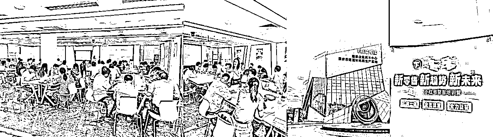

内训结束后还继续被返邀请下个月继续去做线下内训

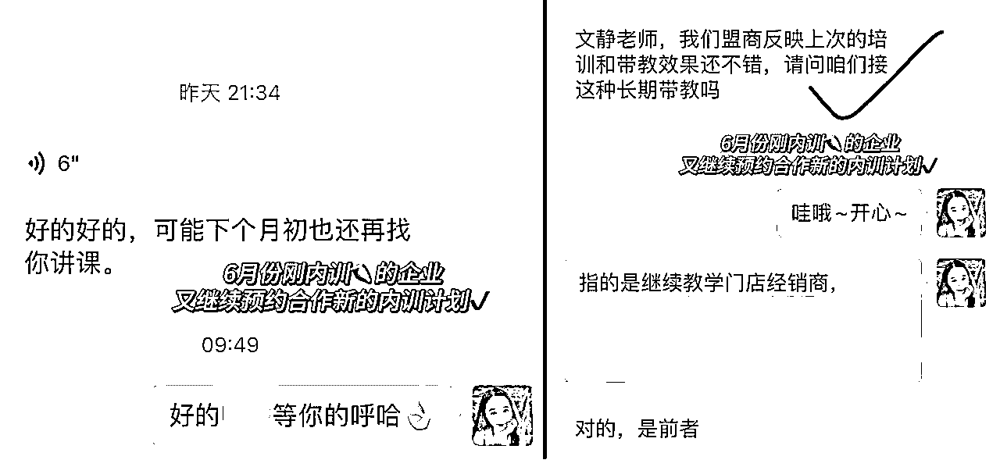

而我在线下跟实体店店长们接触后，总结了实体店行业在行动实操小红书的常见问题，结合我的内训课件和一线实操，文静专门复盘写了这篇文章，希望对你有所启发呀~

# 一、为什么越来越多实体店做小红书平台来打开公域流量？

特别是中高客单的企业实体店。文静接触观察总结下来，主要有以下几个原因：

## 1、目标客户匹配度高：

小红书平台的用户群体，是目前公域平台中，最以注重生活品质、中高消费力的消费者为主，这跟中高客单实体店的高度重合

## 2、笔记内容营销效果更好：

小红书平台本身是一个以内容为核心的社交平台，平台用户本身就在追求高质量、高清晰、高价值的内容，也愿意为之认可、传播、推荐。甚至近期有比较多的造节都是从小红书上造势出来的，比如：春晚、飞盘运动出圈、I人E人、毛坯人生精装朋友圈…

而中高客单实体店，通常本身线下就有独特的产品服务，可以支持反哺小红书的内容要求

## 3、搜索流量价值高：

目前小红书的搜索流量已经高达60%。用户经常通过搜索功能去查找自己感兴趣的产品服务知识。因此中高客单实体店，可以抢占与自身业务相关的搜索关键词长尾词，提高账号和内容在搜索结果中的排名，从而获取更多的流量、曝光量和潜在客户

# 二、定！能种草能变现的内容方向：明确解决什么人的什么需求？

那在知道小红书对于实体店的好处用处之后，我们首先不是直接就做笔记，而是要先明确确定好：能种草能变现的内容方向：

这样我们去做笔记时，才更有方向目标：知道要吸引的人群、希望的变现效果、变现能力、内容创作效率等等。那以下具体有几个方法可以去实操定内容方向：明确解决什么人的什么需求？

有不少实体店的店主经常会错觉以为自己已经对此很了解很清晰。但一旦让他写成文字记录下来，通常只会写出两三个字：（这里用家居家装实体店来举例）：业主房主、装修、平层、别墅、高楼层…然后就没有然后了

这里文静也延伸一下是怎么找到‘解决什么人的什么需求’

## 1、‘什么需求’怎么找？

### （1）利用关键词来锁定用户需求

包括产品词品牌词、热搜词和痛点词。产品词品牌词是体现产品卖点和品牌，热搜词痛点词是用户经常搜索带有强需求的词汇

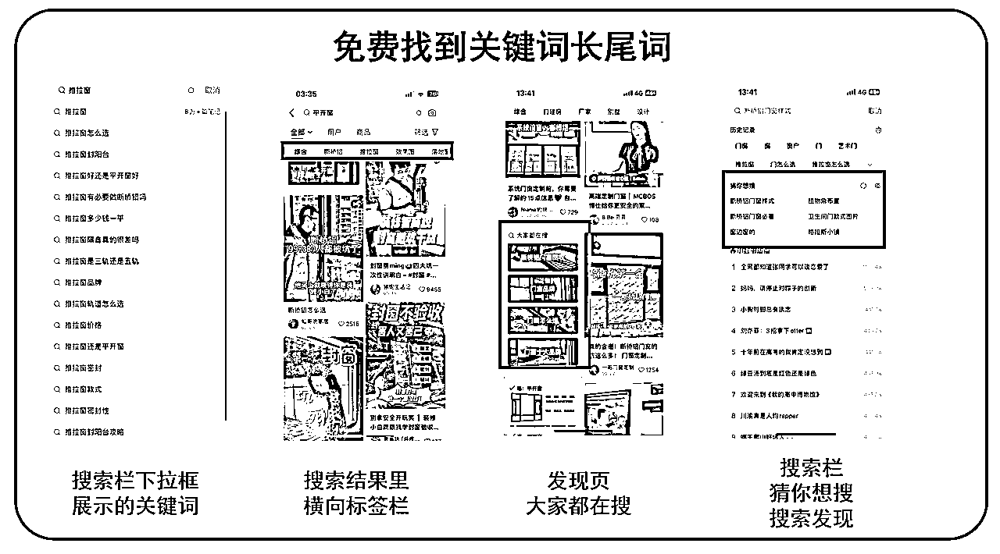

### （2）模拟观察正常用户的种草购买路径，从而锁定需求

【被用户看到】

①、可能有新家装修、旧房翻新、想要改变家居风格等生活场景，触发需求

②、搜索浏览：关键词搜索（输入“家居装修”、“装修风格”、“家具推荐”等关键词，寻找相关内容）、首页推荐发现页（浏览首页的推荐内容，可能会被家居家装相关的图文或视频吸引）

③、小红书评论，或者发互动类笔记，向博主/企业号求推荐品牌

④、挑选有自己喜欢的家居家装风格、产品甚至品牌

【被客户信任】

⑤、产品、品牌之间对比，咨询、了解、探店……

⑥、对比环境、服务内容、客户案例、价格……

⑦、对比品牌信任度、小红书舆论……

⑧、选择性价比综合水平及格的品牌下单

【被客户推荐/拔草】

客户在下单、完成服务后，还可能会有以下动作：

分享自己的购买体验和评价

发测评笔记：推荐品牌/不推荐避坑品牌

私下向其他用户推荐品牌/不推荐避坑品牌

……

### （3）从已成交的用户回访，锁定需求

【被用户看到】：从哪里找到我们？怎么需要买？买回去解决了什么？

【被客户信任】：下单流程怎么样？价格价值怎么样？愿意晒单好评成为客户案例吗？

### （4）行业趋势及竞品分析

可以关注看行业报告、市场分析等资料。比如小红书就有每个月行业月报、行业分析等资料，可以直接从官方掌握到市场规模、增长趋势和消费者的主要求

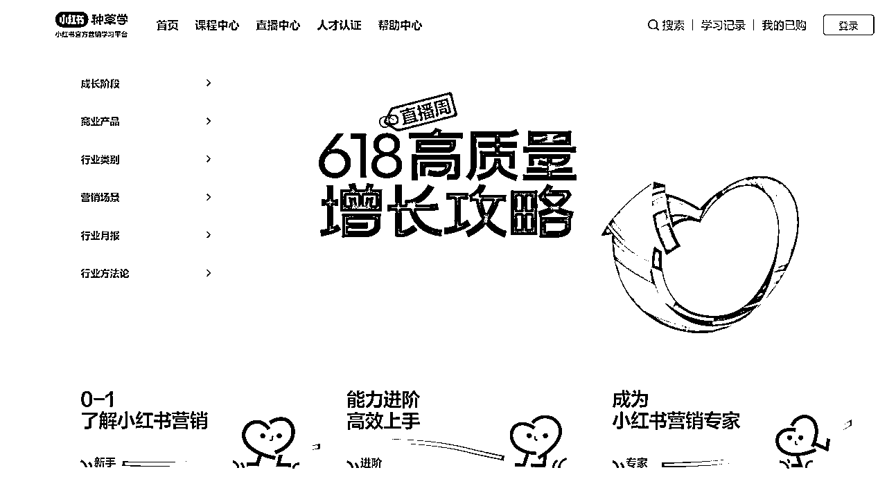

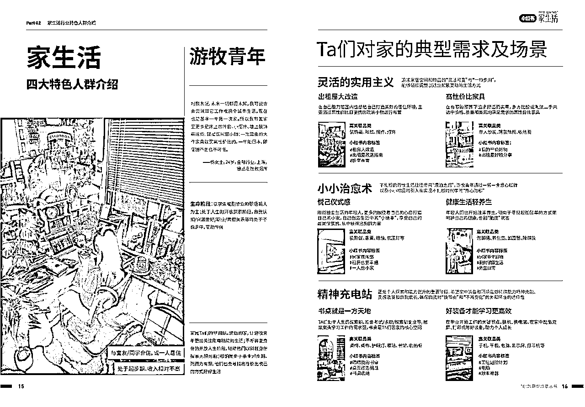

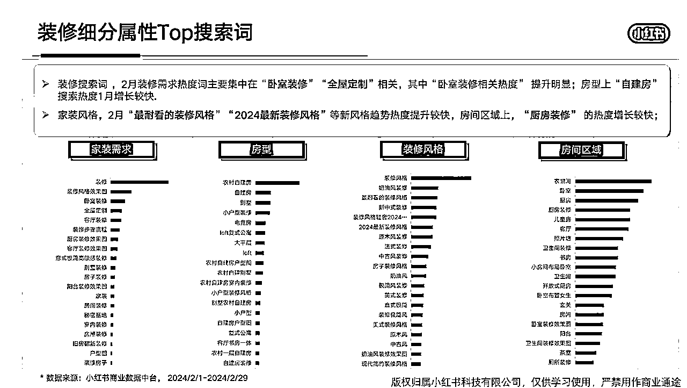

## 2、对‘什么人’做用户分层

越清楚实体店想吸引什么人群，那就会越清晰用户购买行为、为产品定价、提供更专属个性的产品服务

### （1）用户对品类的认知情况

| 分类情况 | 需求导向型用户 | 小白型用户 | 品牌偏好型用户 | 专业研究型用户 |
| 特点 | 会对比各种不同产品的功能、信息、优缺点、适用场景等。注重产品实用性和性价比 | 没有明确的筛选标准和逻辑，更多凭个人喜好、冲动、广告、促销等因素 | 优先考虑品牌因素，对某些品牌有较高的忠诚度和信任度 | 深入研究对比产品的技术规格、性能参数、产品评测和使用指南 |
| 内容策略 | 攻略型内容 | 情绪价值内容 | 品牌故事、品牌形象内容、品牌活动内容 | 专业评测型内容 |
| 转化难易度 | 较容易转化 | 相对容易转化。也存在一定市场教育，比较注重价格 | 相对容易转化 | 相对较难转化。要更多精力资源制作高质量内容。但一旦转化成功，忠诚度和传播能力超强！ |

### （2）用户是否消费过产品/品牌的认知情况

| 分类情况 | 新用户（潜在用户） | 首次消费用户 | 多次消费用户/超级用户 | 流失用户 |
| 特点 | 尚未购买 | 第一次购买产品服务用户 | 多次购买产品服务的用户 | 曾买过，但近期未再买的用户 |
| 内容策略 | 情绪价值内容 | 生活方式类内容 | 会员特权内容 | 新品上市内容 |

### （3）从费用所占总比例大小

| 分类情况 | 高费用比例用户 | 中等费用比例用户 | 低费用比例用户 |
| 特点 | 在品类产品的消费金额占其总消费金额的比例较高： | 在品类产品的消费金额占其总消费金额的比例适中： | 在品类产品的消费金额占其总消费金额的比例较低： |
| 内容策略 | 高品质高附加值内容 | 体现质价比内容 | 价格实惠且满足基本功能需求的产品服务笔记 |

## 3、其他维度的分类

（1）人口其他维度：年龄（80后、90后、00后、70后等等），家庭收入（中产阶层、工薪阶层、高收入等等），家庭成员组成（三口之家、两口之家、单身家庭、三代同堂等等）

（2）产品属性：例如房屋状态房屋场景：新房装修、旧房翻新、小户型、大平层、别墅等

（3）生活风格方式：如现代简约、中式古典、北欧风等

……

在清楚明确我们想做的内容，要解决什么人的什么需求后，我们据此制定出更具针对性的内容策略，再来做内容的选题方向、关键词长尾词的写入，就更加有把握，人群更加精准了

# 三、做！能种草能变现的笔记内容

那接下来，我们开始搭建内容库：找对标、拆解、模仿、创新。来构建和不断优化调整你的内容策略

## 1、找对标

这里有很多不同的找方法，文静只举例几个我经常用的方法：

（1）搜索关键词长尾词

根据前文中的‘明确解决什么人的什么需求’，在小红书搜索。选择近一年内更新（时间越近越好）的高赞高藏高评论的笔记内容

甚至可以筛选搜索界面【最新】的笔记内容，这些更是代表最近用户喜欢什么笔记的变化，同行最近在更新什么笔记的新风向

（2）品类行业内的爆文

在小红书APP频道里，找到系统推荐的爆文。也可以用第三方平台（灰豚、千瓜等），找最新的行业领域里的最新近xx天的爆款榜单

注意：有些大爆文会基于某个时间点或事件产生的，因此要注意时效性。尽量选择近期内产生的大爆文作为参考

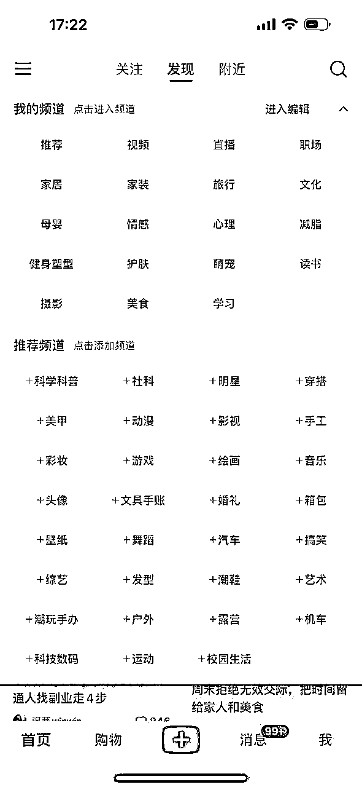

（3）看同行竞品前辈

主要对标竞品的爆款数据好的笔记（曝光多），对标产品笔记（转化好）

以上，找对标，确实我们可以用多种方法来寻找和借鉴。而非只用某一种，很容易信息茧房闭门造车。

## 2、拆解、极致模仿

从选题、笔记形式、封面图、标题、正文内容脚本、评论区等方向去拆解，极致模仿

（1）选题

决定了用户会不会关注这个选题→参考检查是否重复爆

*   选题分析：仔细研究对标爆款笔记的选题，理解其为何受欢迎，是否满足了用户某种需求或兴趣点，提供了干货价值或是情绪价值？

*   用户定位：分析目标用户的分层特征，如年龄、性别、地域、兴趣等，以便更好地定位自己的笔记内容。

（2）笔记形式选择

从笔记形式上分：图文笔记（新手友好，用户习惯）、短视频笔记（官方扶持，曝光率涨粉率更高，难被模仿，需要更多时间经验来制作）

*   小红书的笔记类型上多样，包括通用型的合集、教程、测评、开箱、沉浸式、vlog、plog等，以及行业型的科普、避坑、材质成分解析等。

*   内容营销1.0阶段可以优先做合集、教程、测评等通用型笔记形式，而内容营销2.0-3.0阶段可以做沉浸式、vlog等发散型内容

（3）封面图、内页图

最好可以模仿一模一样。高度还原爆款笔记的封面图设计，包括颜色搭配、图片选择、文字排版等。如果可能，使用相似的图片素材或风格相近的滤镜

70%决定了你这篇笔记能否吸引用户打开点进来

模仿70%：合格

模仿一模一样100%：优秀

超过120%：超越

建议封面尺寸都用3:4，其他尺寸不建议

内页图参考：素材图片的排序顺序，内容逻辑、素材图片的质量。还可以增加跟自己产品优势长处相关的素材，这样可以突出产品的独特性和价值

（4）文字标题

决定了小红书系统是否能正确推送到感兴趣的人群

你要借鉴，不要直接复制黏贴。快速写出：爆款标题两两相串法

把2条爆款标题，两两相串。比如搜索‘卫生间’

图片组成新的标题：

小户型卫生间细节满满！还能装修出高级感！

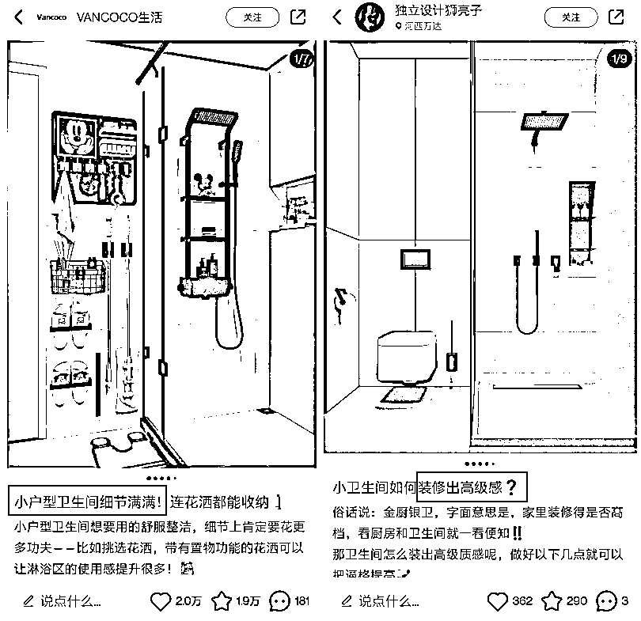

一定要检查是否有品类产品关键词/品牌关键词/用户痛点词/本地同城词

（5）正文内容/短视频脚本

你要借鉴二次创作修改调整，不要直接复制黏贴。去模仿内容结构逻辑、关键词长尾词、内页图…

留内容结果逻辑框架：

保留：痛点、主要观点、解决方案、流程步骤、爽点、情绪价值

可增加：蹭热门话题、产品、举例子、素材

还有其他爆款因子组合：如果是视频，注意模仿其拍摄角度、短视频画面，剪辑节奏，声音和配乐风格等

常见正文内容结构逻辑①总-分-总

总：主要观点/提一个问题/用户痛点

分：一般举例/流程/步骤：3点-5点，我是怎么解决这个痛点的。每个小点排版，要有明显的区分，可利用小标题、空行、emoji/薯队长表情

总：再次总结重点主要观点。或者呼吁用户粉丝做什么互动动作。或者重申介绍一次自己的价值

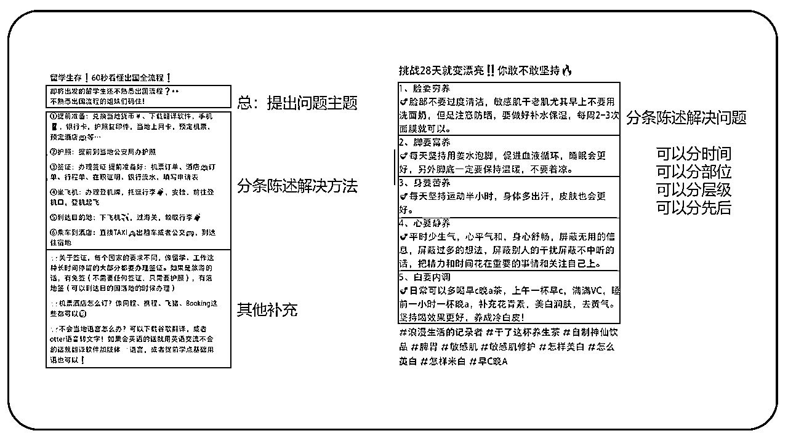

常见正文内容结构逻辑②

确定角度+提炼观点（通常为正反对比或层层递进的两个分论点）+佐证案例+升华主题+结尾引人深思

最后检查正文内容是否有关键词与长尾词：分析爆款笔记中的关键词和长尾词，将这些词汇写入自己的内容中，提高搜索曝光率

（6）笔记其他

评论区：可以直接复制对标博主的自评；在评论区积极回应用户评论，提高互动率

#话题：可以直接复制对标博主的的话题，但避免过度使用无关标签

发布时间：可以直接参考对标博主的发布时间，结合目标用户群体的活跃时间

违禁词敏感词：用句易网http://www.ju1.cn/、零克查词www.lingkechaci.com查一下全部标题文字文案，包括图片上的文字，是否有敏感词违禁词。有则改同音字或者拼音

## 3、创新

当你一直只对标同行同领域的关键词长尾词，你会发现越来越内卷。而且永远落后于同行同业

这个时候，一定要尝试创新，才有可能去领先，更容易吸引保持用户粉丝的关注。那文静也给大家分享几个创新的技巧玩法：

（1）创新内容选题

*   跨行业跨领域对标：搜索跨行业的关键词长尾词，找到与你目标受众相关的、来自不同行业领域的热门笔记

*   关注行业动态和趋势，结合品牌特点和用户需求，开发新的内容主题和话题

（2）创新笔记的呈现形式

*   测试不同行业的呈现形式：图文笔记比如用插图、图表、AI等形式。短视频比如用新的拍摄手法，拍摄技巧，视觉效果等

*   拆解火爆的元素+创新加入你的新元素

（3）创新用新词再做火过的爆款

举例：港女冻龄法、把自己当反派培养、张雪峰学习法…

*   结合当前的热点话题、趋势和流行文化，找跟新词组词相关的元素

*   旧词新用（给旧词赋予新含义：比如海王+商业思维），名人造词（去蹭名人名事），简缩造词，字母造词

（4）创新互动方式

这个也是小红书平台很擅长的线上线下造节方法：像是什么citywalk、慢人节等等

*   除了平常的评论区互动回复，比如举办线上活动、发起话题挑战：挑战帮助你成为家居博主等。

*   比如线下主题活动、比赛活动：线下沙龙交流会，xx比赛等

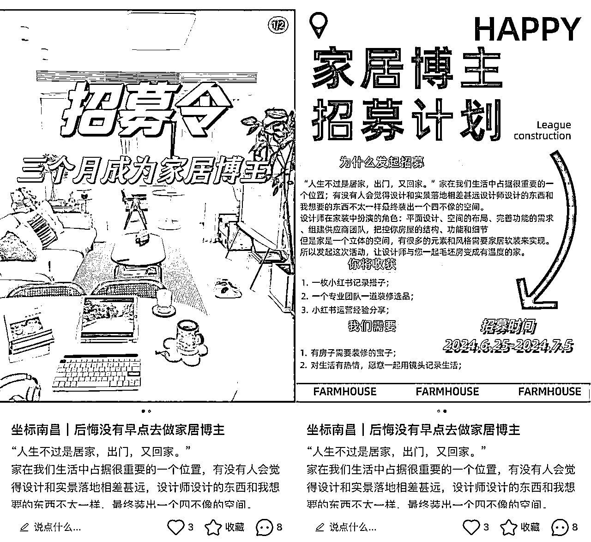

以上在抄和超中结合的内容，才是更有效更长久的小红书内容武器~

# 四、大！多账号矩阵号流量思路

当做出了一篇爆款内容后，复用矩阵内容是一个有效的内容策略，可以帮助我们最大化这篇内容的价值，也可以带动账号其他笔记内容的曝光和更多爆款

## 1、内容矩阵

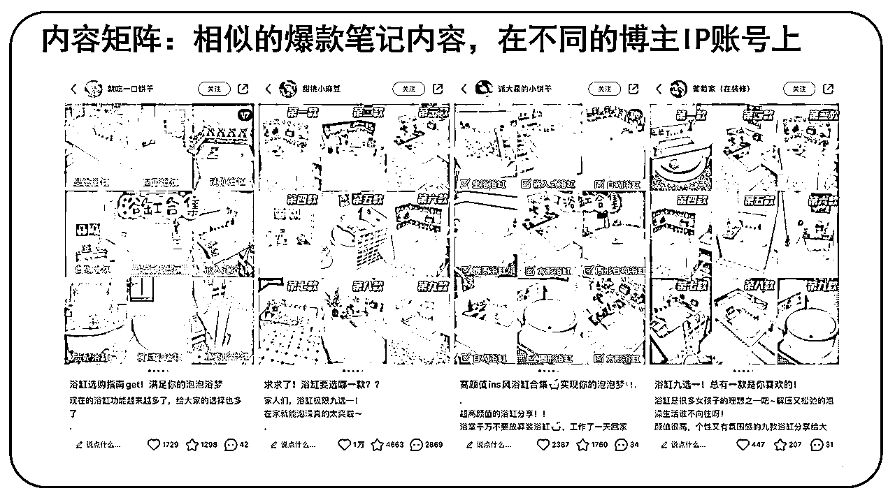

（1）、直接完全不改搬运复用爆款。发现连续两三篇数据不好，就要进行下一步

（2）、微改文字标题关键词，跟封面图关键词，再发布。发现连续两三篇数据不好，就要进行下一步

（3）、不改爆款的封面图样式，大改变里面的内容选题跟文字关键词。

不改爆款里面的内容选题跟文字关键词，大改全换了封面图样式。AB测试，对比数据谁更好

## 2、IP人设矩阵

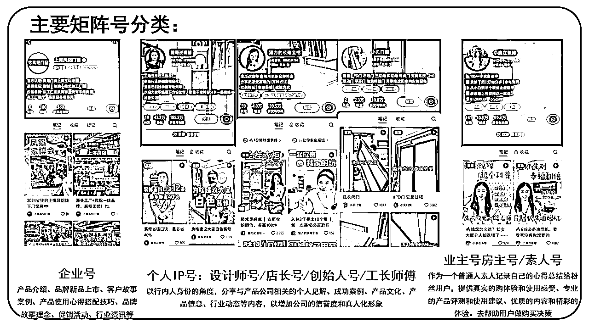

（1）企业号：

产品介绍、品牌新品上市、客户故事案例、产品使用心得搭配技巧、品牌故事理念、促销活动、行业资讯等

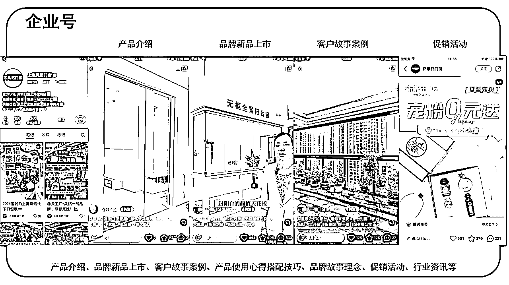

（2）个人IP号：设计师号/店长号/创始人号/导购号/工长安装师傅

以行内人身份的角度，分享与产品公司相关的个人见解、成功案例、风格设计、产品文化、产品信息、行业动态、施工过程等内容，以增加公司信誉度和真人化形象

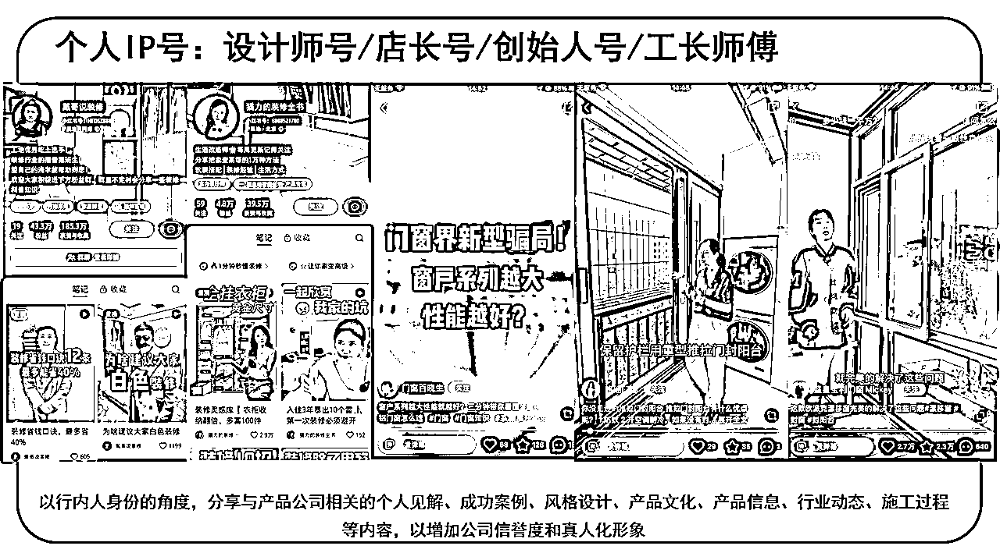

（3）业主号房主号/素人号

作为一个普通人素人记录自己的心得：装修日记与经验分享、家居布置与装饰、家居探店与评测、家居好物推荐、家居生活小技巧等

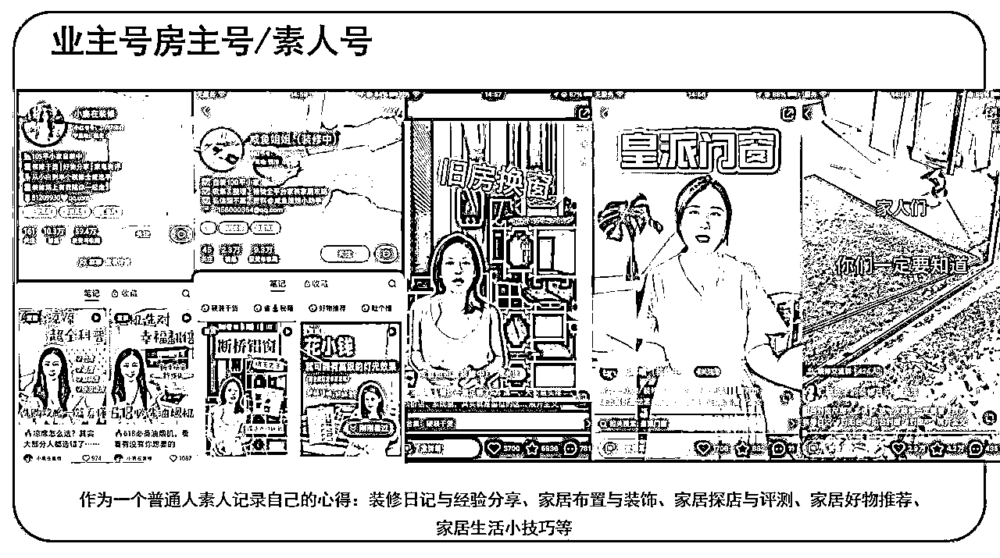

这里重点分享一个我们实操成功的业主房主矩阵玩法：

家居家装企业，会在装修完验收之后会跟业主聊一下，说企业现在正在做小红书这个板块，那可以引导业主去发小红书笔记，这样子只要在笔记上面有引流过来或者是有后续成交的话，那就可以给业主一定的引流费用/成交费用，还借机分享怎么做家居博主

甚至是如果业主他自己可能不太想拍，没关系，家装家居店里同事自己出人出文案去拍摄内容，那这条笔记后续引来的流量也可以分销给业主

然后有一个现场的家装店，他就是用这种方法，链接到了一个有一点点粉丝的业主，然后就给他引用了几十个意向业主，超牛

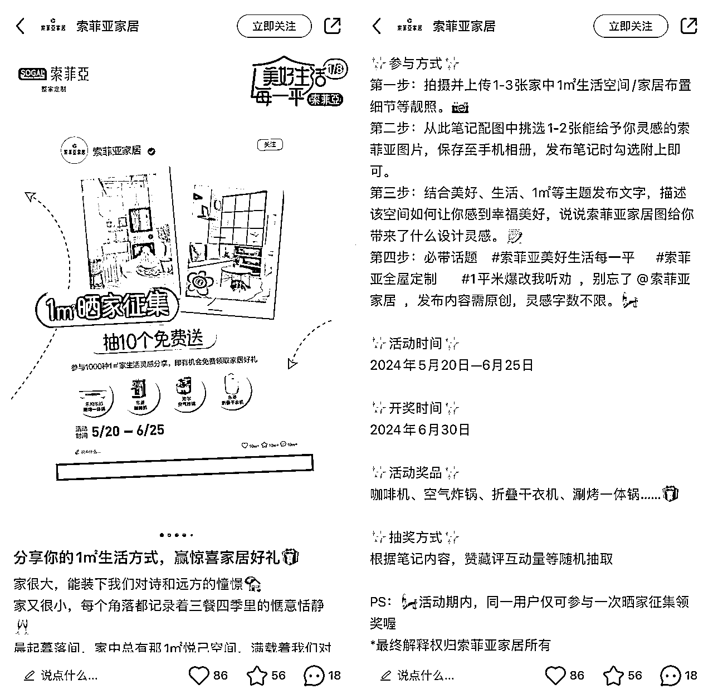

## 3、多平台一鱼多吃

图文矩阵：朋友圈+公众号+知乎+微博+今日头条+小众app（好好住app、得物app）

视频矩阵：视频号+抖音+快手+B站

# 五、团队内部自运营账号时常见限流问题【笔记搜不到/账号没爆款】

## 1、小红书出现限流的原因自检

首先文静给总结归纳了几个小红书出现限流的原因，大家可以先尽量避免和自检

| 违规行为 | 内容质量问题 | 账户行为异常 | 其他因素 |
| 引流信息：笔记中/私聊/群聊出现微信号、二维码、或其他平台的引流信息，可能被平台判定为引流信息而限流 | 发布垃圾信息：发布垃圾、广告或违规内容，如涉及色情、暴力、违法行为等，会导致账号限流或封禁。 | 发布频率过高：在短时间内频繁发布大量内容、评论或私信，可能触发限流机制。 | 账号断更或长期不更新：长期不活跃的账号可能会被平台认为是不活跃账号而限流。 |

## 2、限流判断：笔记限流？账号限流？

1.  检查笔记状态：首先确认笔记是否已审核通过，可以通过转发到微信是否能显示内容？如果笔记仍在“审核中”，可以申请催审笔记

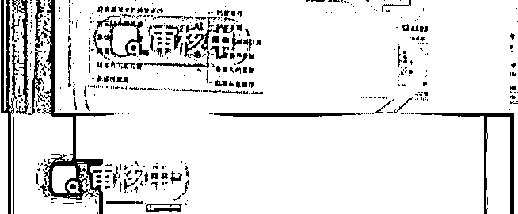

1.  使用薯条投放测试：给疑似限流的笔记投放薯条（尝试花钱推广，但不真正付款），如果无法投放或显示账号违规，则可能说明账号存在问题

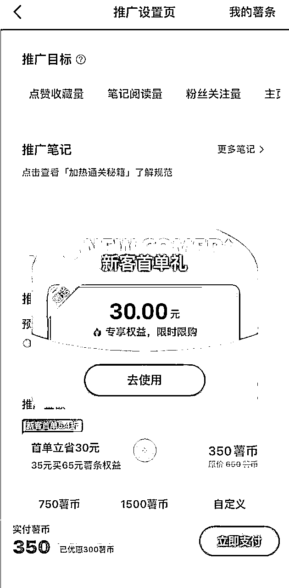

1.  搜索笔记：搜索笔记的文字标题，是否能搜到？能搜到证明笔记大概率没问题。如果没有搜到，可以后台申诉笔记无法搜到

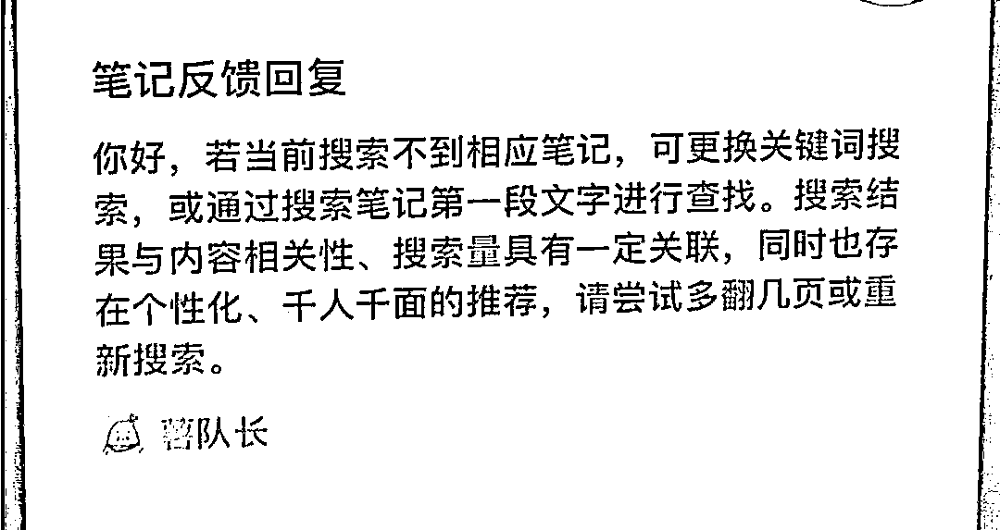

1.  搜索账号昵称：使用另一个账号在小红书的搜索页搜索自己的账号名，如果搜索结果中只出现了少部分的笔记或搜索不到近期的笔记，则可能说明账号被限流

## 3、常用的恢复流量的解决方法

1.  停止违规操作：首先，确保自己不再进行任何可能导致限流的违规操作，如私聊发微信联系方式发布违规内容、过度营销等

1.  申诉处理

如果收到过系统提示：笔记违规…这个时候千万不要慌！不要直接删除笔记

也不要假装看不到。不然越拖延违规笔记越多，越容易把一个号都会弄异常了…

根据文静的实操，有一部分新笔记的发送，是会先经过系统机器审核，存在一定误差的审错。也有可能老笔记发布一定时间后，浏览量增加二次触发系统审核或者被人举报，系统误判…

总之，一定要去申诉。只要不是严重的资质问题，基本上都会申诉成功，系统还会给你补偿一定的流量券

如果申诉失败后，笔记比较爆款数据，可以再24小时后再次修改话术，再次申诉。一般申诉不行后，再去删除笔记即可，不建议隐藏笔记

（1）、笔记违规审核错误

a、涉嫌搬运/抄袭

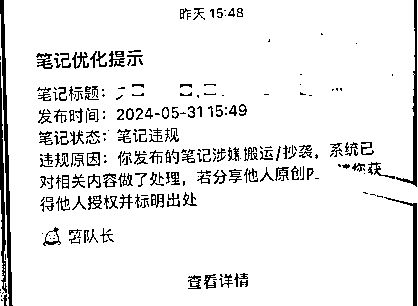

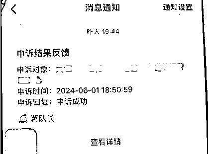

申诉话术参考：态度诚恳+说明没有违规

⭕申诉话术，根据违规显示信息就行微调修改即可

该篇笔记是属于本人的原创笔记内容，只是纯分享，并没有直接盗用他人的原创图片素材，没有出现其他平台水印，麻烦薯大大再帮忙看一下是否误判了，谢谢~

b、高风险互动/骗赞

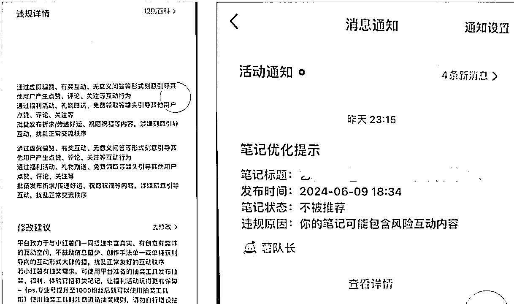

申诉话术参考：修改笔记+态度诚恳+说明没有违规

⭕先把正文内容或者评论区的引导互动的文字，给删除了。再去申诉笔记

薯大大，您好~ 已自检无相关违规内容。只是纯分享，并没有虚假互动有奖互动的违规引导，也没有没有诱导他人进行点赞、收藏、评论等互动行为的内容。麻烦薯大大再帮忙看一下是否误判了，谢谢~

c、发布易造成个人财产与信息安全受损的内容/财务风险

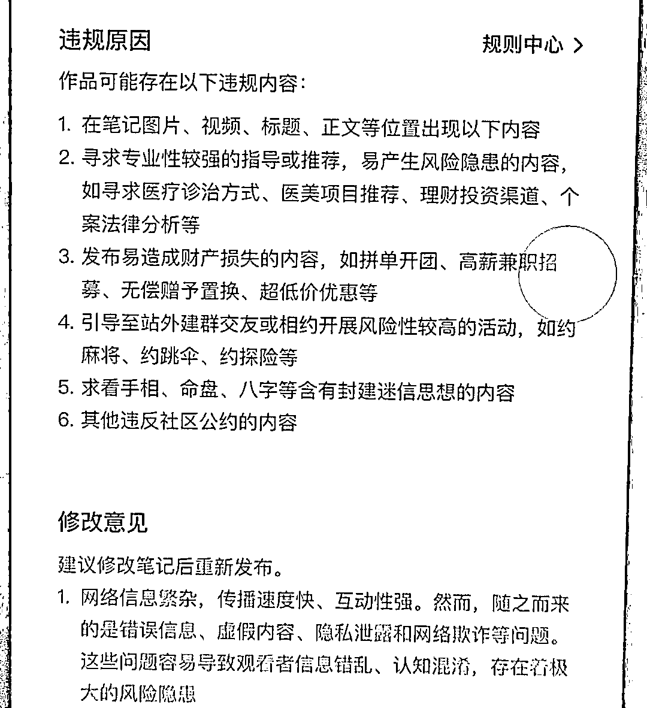

⭕先把正文内容或者评论区的的文字，可能涉及违规的字眼修改或者删除。再去申诉笔记

薯大大，您好~ 已自检无相关违规内容。只是纯分享，并没有行业营销宣传商品推广和服务的意思，麻烦薯大大再帮忙看一下是否误判了，谢谢~

（2）、笔记搜不到

如果24小时后笔记发送后，检查文字标题，看是否能搜到，能搜到就证明被系统收录，也能被用户搜到你的笔记。如果连你自己不能搜到笔记，就可以催审笔记，或者申诉笔记搜不到

申诉话术：

薯大大，您好~

搜索栏搜该笔记的全部标题，搜不到我的这篇笔记，麻烦薯大大再帮忙审核看看，谢谢~

（3）、账号投薯条不行/账号粉丝/流量异常

申诉话术：

薯大大，您好~

该账号的所有笔记属于本人的原创内容，只是纯分享，并没有推广和营销的意思~

但目前账号的所有笔记都显示不支持使用薯条推广，麻烦薯大大再帮忙看一下是否误判了，谢谢薯大大~

最后。心态上真要把小红书账号，就当成一个易耗品。

这一条笔记不行，那就下一条笔记再试试

这一个账号不行，那就再一个新账号再试试

一定持续行动就ok！

# 总结：始终相信选择的山，一定有宝箱

2天时间的线下课，带着近百位的中高客单实体店主理人和店长，从平台价值，到明确能种草能变现的内容，到做出爆款爆流量笔记内容，再到矩阵批量流量思路，再再到账号常见限流违规问题…一起做小红书，我也十分开心和荣幸

我也在内训现场讲过一句话：好做的赛道，一定不是那些为了去做自媒体的赛道，而是你在线下门店中你在工作中你在生活中，是一个怎样的人？

去把这件事做细，边做边发到小红书上，也是边放大边在极致的过程中。选择了之后，不要把时间放在纠结犹豫上。一定要相信和放心，你我选择的那座山，一定有宝箱

要把时间，放在不断学习，不断练习，精心准备，稳定输出，一步步地一起爬上那座山

也欢迎更多想探讨线上小红书引流新方式，想摆脱流量难困境的圈友们，一起相互交流~