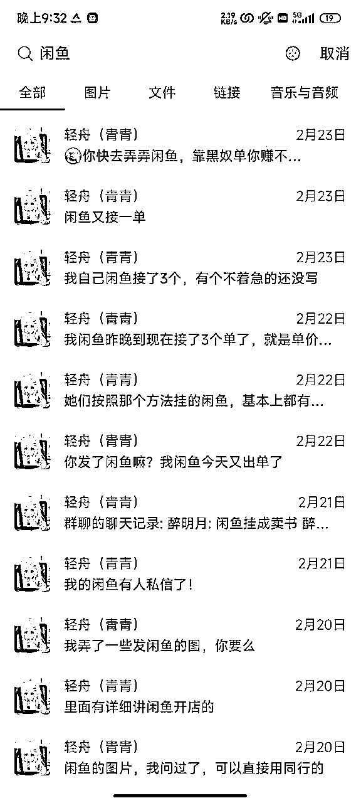
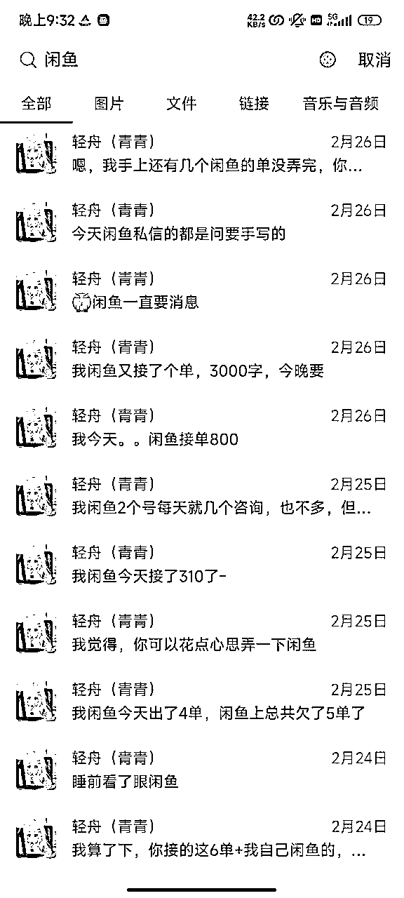
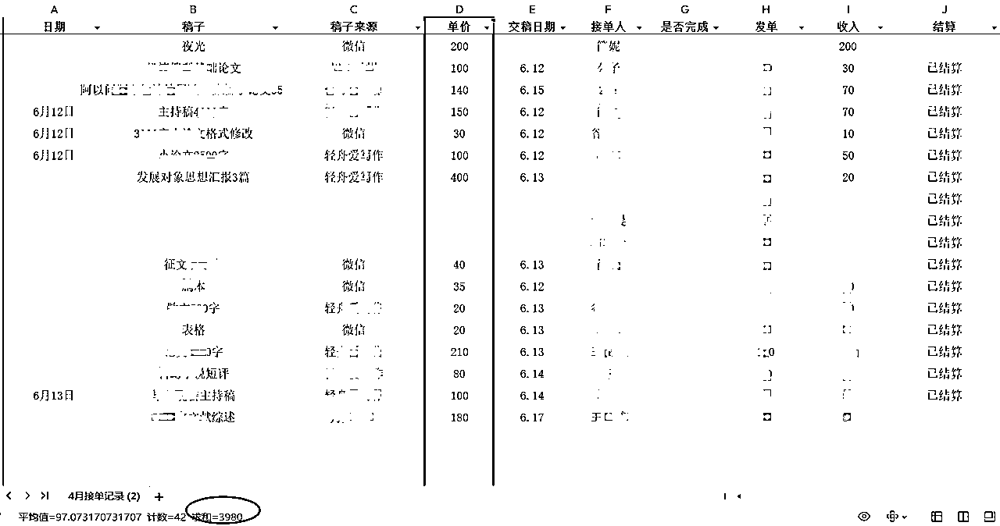
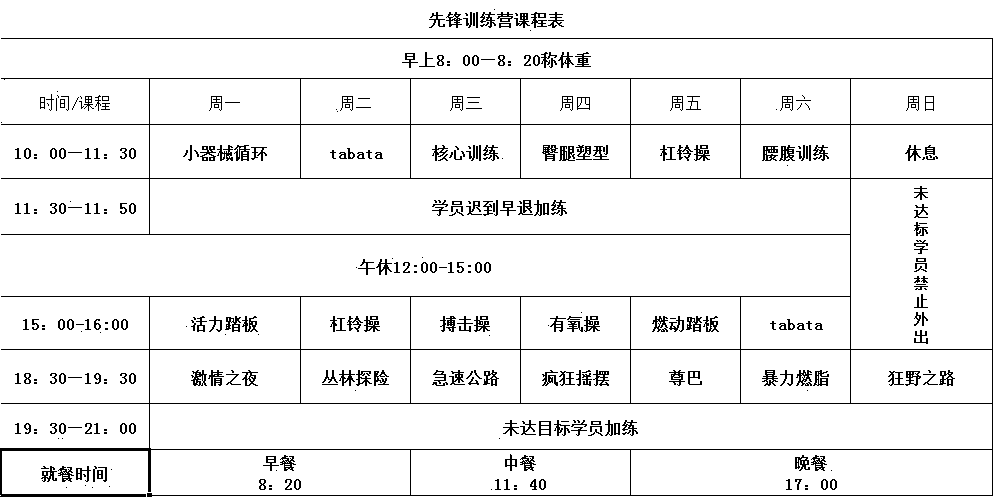
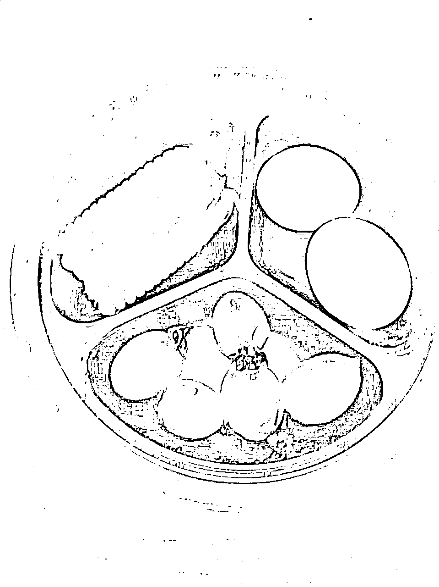
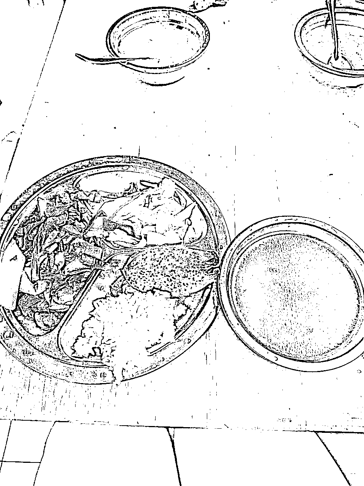
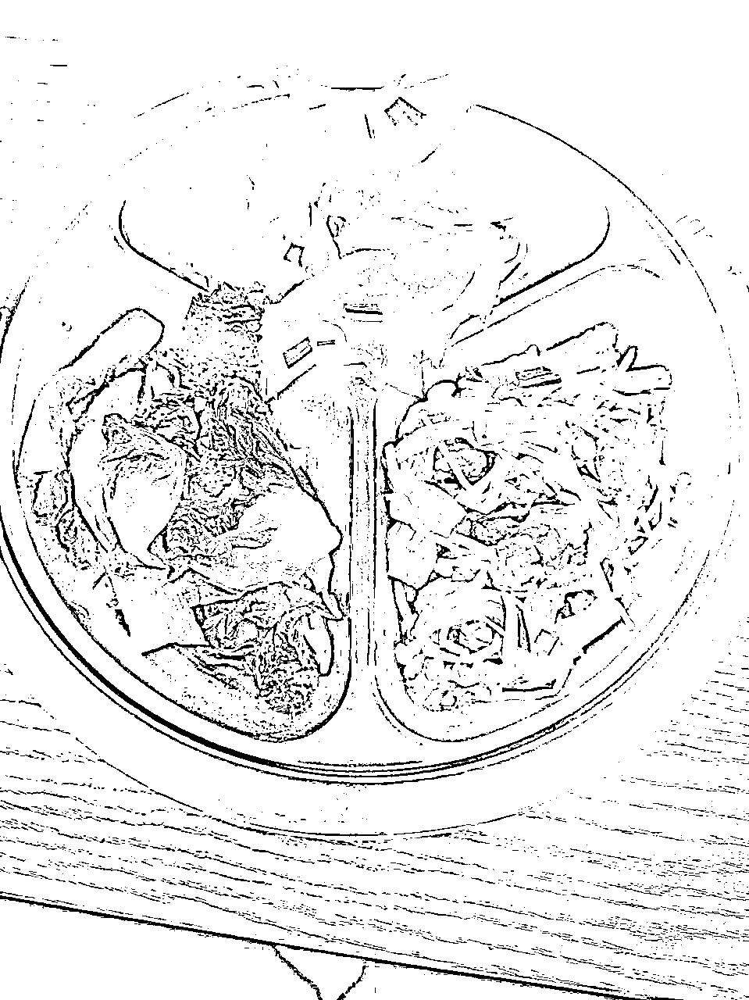

# 我的2024上半年复盘：还了10万负债，27天瘦了17斤

> 来源：[https://riupvml5qjl.feishu.cn/docx/C5mQdfl88oLiOTxjGQXcfk1an6f](https://riupvml5qjl.feishu.cn/docx/C5mQdfl88oLiOTxjGQXcfk1an6f)

哈喽圈友们好呀，我是轻舟。

2024年我只有两个目标，一个是还清20万负债，目前稳定推进中。目前还了差不多一半了，剩下的部分，不出意外今年也能清了。

另外一个目标是减肥，去年就心心念念找个减肥训练营减肥（尝试了很多种方法都没瘦下来），但由于经济和负债的原因，一直未能成行，今年6月份总算入营了。目前入营27天，瘦了17斤。

很庆幸找到了生财这个大平台，也找到了适合自己的项目-Ai写作变现，自从今年2月底入行Ai写作以来，让我实现了每个月赚钱还负债的前提下，还能入营进行封闭式减肥。今天想跟大家聊一聊我这半年来的历程，以及目前遇到的卡点问题，也希望能获得圈友们的帮助。

# 01 项目入门

2023年算是我个人比较难熬的一年，年初投资失败，变成了负债，下半年不断尝试新项目，但是都是亏损状态，导致负债越滚越多，这也是20万负债的来源。跟大部分负债人一样，我很长时间都觉得很崩溃，觉得自己一事无成，感情事业一塌糊涂，每到下午3点左右，就会一个人在出租屋崩溃大哭，很焦虑很焦虑，又一天过去了，没赚到钱。

过年的时候，在生财上面又找了几个新项目，都是无需流动资金的项目，比较适合我，有Ai写作，Ai写真，微头条。过年没给爸妈一分钱，反而找朋友借钱入了这3个项目的知识付费，打算过年期间学习，年后开始正式实操。大年初四就回了长沙，没收入还要还负债真的太焦虑了。

回长沙之后，我开始了新的赚钱之旅。Ai写真因为容易被小红书判重，去重做不好，一直被我搁置着。微头条倒是坚持看完了课程实操，只是自己写几百字，我得花两三小时。所以我决定从Ai写作开始着手，当时的想法是：学会了Ai写作，我可以接单，还能自己用Ai写作写微头条，甚至后期还能考虑下用Ai做公众号爆文。

选择Ai写作的原因：

1）无需成本，不像我之前做的小红书电商等项目，对资金有要求。

2）时间地点不限，有手机电脑就能接单写稿子，相对来说比较自由。

3）变现门槛低，再不济可以接淘宝单，能稳定有收入。

4）对写作技术要求低，不需要自己能写得很好，只要能熟练运用Ai即可。

前面说了我借钱报了荷包蛋的Ai写作课程，在没有看课程之前，我就在加了好几个淘宝店。回长沙开工之后，花了几小时大概看了下课程，就开始接单了。一直记得我的第一单是写文献综述，讲实话我那会连文献综述是什么都不知道，但还是接了，因为那个单子50块钱，算是淘宝店里单价不错的单子了。就这么一边写一边问荷包蛋，我交出了第一份稿子。

但很快我发现，店里90%的单子我看不懂，看不懂也就不敢接，剩下10%我看得懂确定能写的单子，单价低竞争还大，经常一天也抢不到几个单。而且一边写稿子一边筛选单子，我觉得很浪费时间。所以我找了个现实朋友，和她商量了一下，她去淘宝店接单，我来交付。

淘宝店的单子单价大概在千字10，我和朋友沟通的分成是她3我7，也就是我基本上是拿的千字7元，但这样能解决我接单的问题。她接的很多单子，比如说教案，我写了几千字，其实自己从头到尾都看不懂，全是Ai出的，但没办法，她已经接了，就硬着头皮写，真的很锻炼人，也让我在最短的时间内被训练出来了。

我记得特别深刻的一件事情，朋友接了一个普通的征文，客户说要求质量好点的，我没信心写，最后这个单子是荷包蛋帮我写完的，现在回头看，这篇征文真的是简单的不能再简单的要求了。所以真的别担心不会写或者写不好，不去尝试，不去逼自己一把，你永远也写不好。

现在很多客户自己都会用Ai写稿子了，如果你想接单，还是只会最基本的东西，你写的稿子和客户自己用Ai写出来的东西没差别，那人家为什么要花钱找你写呢？

# 02 深耕项目

大概写了半个月的淘宝单之后，我开始一边写稿子一边研究闲鱼运营，一开始我就准备了2个账号（每个人可以实名三个支付宝，也就是可以有三个闲鱼账号），每个账号都发布了10个链接。可能运气比较好，第一天发布的10个链接，其中一个号立马就有了咨询。

慢慢地，我开始一边写淘宝单一边写闲鱼的单子，再慢慢地我闲鱼的单子写不过来了，就慢慢放弃了淘宝的单了。有一说一，做了闲鱼之后，发现闲鱼客户的单子真的不要太简单，本来写淘宝单觉得很吃力的我，接了闲鱼单之后，都觉得很简单很简单了。

于是，我就这样从一名淘宝的黑奴选手，变成了私域写手啦~靠着3个闲鱼账号，自己每天写写写，每个月收入也还OK，关于具体的收入和闲鱼运营，我前面的帖子都有分享过，这里就不重复分享了。有兴趣的圈友可以看下我之前的帖子。

https://t.zsxq.com/R2qFZ

https://t.zsxq.com/VWC0T

但讲实话，我真的特别不喜欢发布新商品，主要是懒，所以一开始是找了个附近的大学生每天2小时来我家帮我发布商品，每小时15，发了一星期，对方连续请假三天就自然而然没来了。

之后我用家里人的身份证开了多个闲鱼账号，想方法招了个全职助理来帮忙运营，一开始计划的是她负责发布闲鱼商品，运营，回复消息以及小红书运营等。但最终发现，对方运营的不行，我管理的也有问题，而且她老是在我旁边玩手机，于是我俩磨合半个月失败，闲鱼账号又闲置下来了。

直到6月份我下定决心要去减肥训练营，考虑到我每个月要还负债，要保证收入的前提下，我又把我的闲鱼账号捡起来了，同时我招了一个线上的学员做客服，负责对接客户，我自己负责闲鱼账号的运营。一开始我自己负责回复闲鱼消息，6月10号-6月13号几天接单流水6000+（表格上只有3980，另外还有我来不及登记的大概2000+）

13号后没继续这个模式了，是因为，我在训练营要上课，没办法拿着10个手机去回复闲鱼上的消息。于是我开始尝试，不回复闲鱼消息，就单纯靠闲鱼的自动回复引流到微信给客服去对接。测试了几天发现，自动回复引流到微信的大概只有30%客户，这30%客户引流到微信上成交的大概又只有30%。

于是我开始重心转到小红书上。目前招了1个兼职客服发布小红书，也留了引流方式，但可能引流方式不够明显，有人私信但很少有人直接加微信过来，目前正卡在这里待优化，有圈友指导一下该怎么弄嘛？！！！

# 03 瘦了17斤

对减肥这个事我一直有执念，特别特别特别想瘦下来，前几年有个对象，我爸妈对他很满意，但我见了他爸妈之后，没几天他就提了分手，理由是他妈妈觉得我太胖了。虽然很多时候我觉得幸好提前发现他妈宝，但我真的很介意胖这个事情！

陆陆续续尝试了很多很多方法，健身也坚持过一年，但都没瘦下去，减肥训练营算是我最后的希望了，从去年开始就一直想去，可是去年我的经济状态一直是负债的情况，也不敢轻易脱产去减肥训练营。

今年6月份下定决心来，还是因为Ai代写给的勇气吧，2-6月份靠Ai代写还清了一部分负债，压力没那么大了，而且我可以在不运动的时间写稿子，不至于完全脱产。

目前来了27天啦，从161到今早的144，瘦了17斤，我自己也很明显地能感觉到自己瘦了。我曾经为了减肥，每个月上15节私教课，私教课下课有氧45分钟，不上课的那天也要做有氧1小时，坚持了9个月，但体重几乎没掉。期间我怀疑是不是我的身体问题，跑去医院做了个全面的体检，发现身体没问题。

现在到了训练营之后，才发现，没瘦下来是我运动不够，吃得又太多的原因，总觉得自己运动的够了，但实际上并不够。（现在在训练营里，除了按照课表上课外，这周开始早上7点我还自己早起加练80分钟）

觉得自己吃的很少了，但是实际上真的不少（训练营的早中晚餐，我真的没吃过这么多素！！！）

到现在为止，也收到过很多圈友的链接，收到过很多学员的问题，借这个机会吐槽一下。

问题一：说自己闲鱼账号没有曝光的，没人咨询

碰到这样的问题，有时候我会让发一个链接给我，我看了账号发现，就发了一两个链接，还是好几天前发的链接，这种的我是真的想吐槽，如果真的有这么简单，这么容易，发一两个链接，就能爆单，能吃很多天流量，那做这个行业的自己偷偷摸摸发财不就好了吗？为什么还要分享出来？！就是我自己，算运气好的，但是我一开始也是两个号同时发布商品，每个号每天发10个链接才有咨询的。

问题二：淘宝单抢不到

emmmm- -有点不知道从何开始吐槽起，这样说吧，我最开始在生财圈里看别人的分享加淘宝群，说的是每天加5-10个群，起码得加到20-40个群。如果真的抢不到单子，想想自己做到位了么。

所以说，很多时候，项目没做成功，没赚到钱，没瘦下来等等，我们往往会把问题归咎于外界因素，或者认为自己已经做得足够多。然而，很多时候，我们想的“足够多”也许并不够多。也许我们发布的作品数量不够多，也许我们的选品还不够多，也许我们写的稿子还不够多......任何时候，不要高估自己的努力和付出。共勉。