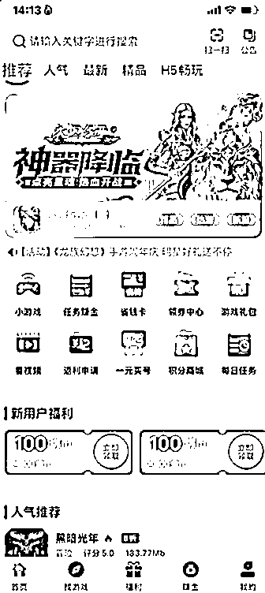
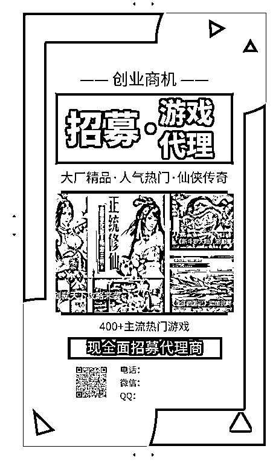
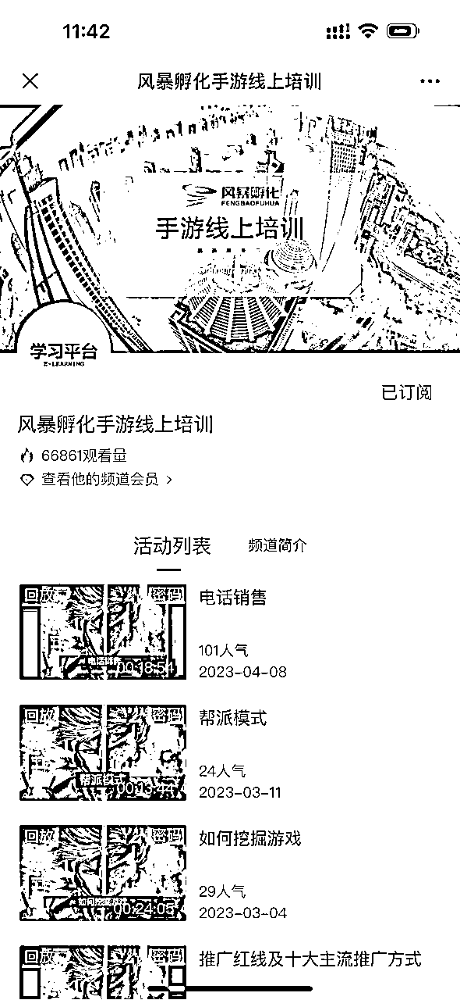

# 小本创业案例：如何从零开始做到营收3000万

> 来源：[https://nnjt163jjp.feishu.cn/docx/CZd5dJnosoefHex5cjbch4b9nkg](https://nnjt163jjp.feishu.cn/docx/CZd5dJnosoefHex5cjbch4b9nkg)

# （步骤详解）

大家好，我是今年加入生财的新成员，刚加入不久潜水为主，看到群里很多朋友分享了他们的故事很受启发。我也想分享一个几年前成功的小项目，希望对大家有所启发，因为我也坚信很多大佬提到的“输出倒逼输入”（帮自己做一次复盘）以及“分享利他也利己”。

文章约8000字，包含步骤详细拆解总结，预计阅读时间15分钟

项目概述

几年前，我涉足了一个新兴领域——“手游代理”，这可能大部分人不知道的一个冷门但暴利的项目，在疫情前一年崭露头角有人开始做，并且因为疫情这个“黑天鹅事件”让行业快速发展。我们做的就是创建了一个类似于“低配版的Steam”的线上平台，聚集了上百款主流或“脑残”手游，比如大家耳熟能详的“是兄弟就来砍我”那种，全国范围内招募代理商，代理商用这个平台生成的app去推广游戏吸引玩家，获得玩家充值金额30%-85%的返点（不同游戏返点不同）。而我们的盈利点来自两方面：代理费（8800-18800元不等）和游戏充值返点（我们保留3%-5%的代理商返点）。两年时间，做到了行业前二，项目总营收大约3000万（当然利润远远小于这个）。

项目缘起：

发现项目的契机是2019年的一次聚会，朋友最近入职了一家刚成立半年的公司，就是做手游代理的，行业还处于蓝海萌芽状态，老板也不算是游戏圈内人员，推广主要是通过百度广告，起步阶段每月营收就在20万以上，这完全颠覆了我的认知，我一直以为游戏都是大公司开发和发行，然后大平台推广或代理。

这让我产生了浓厚的兴趣，尤其是游戏这种听起来就多金的行业。现在回想起来，我觉得这个项目能启动，有以下几个关键点：

1.  破圈交流：多找不同圈子的朋友聊聊天喝点小酒，不经意间的信息交互也许能带给你很多机会；

1.  发现异常：“异常值”这个词语是来了生财后学到的，就是看到了之前自己完全不知道的信息，而且还能赚到钱；

1.  能力拼图：这个项目需要的能力，我们的火力能够覆盖，不需要一开始花时间找人或者空有想法没有能力。

【关键词】破圈交流；发现异常值；能力拼图

项目分析：（我们是如何看待这个行业的）

理性的角度我们要做数据分析，市场前景分析等等。但是一个新兴产业，能够让你分析的数据不多，能提供有价值判断的资料也很少，所以单纯的数据或者说数字分析，意义不大。所以我们要看的不是数据，而是同行。别人能拿到结果，那么你一定也有机会。

同行的现状：

1.产品力不足，平台能提供的游戏只有十几款，客户选择性不多

2.结算周期长，每周结账，客户持续赚钱的快感不足

3.没有有价值的客户成长体系，同行的培训只是系统使用操作方法，没有推广和其他有价值的培训

4.新兴行业价格混乱，卖多少钱全靠忽悠，没有稳定合理的价格体系

6.服务单一，只提供游戏平台，客户的其他任何需求难以满足

围绕这些，我们项目的运营和设计思路就有了，基本上就是别人什么做的不好，我们就把什么做好，逻辑简单，但实用。

理性的分析和拆解需要，感性的部分我们就要challenge一下自己，这些充值就能变强的游戏，既乏味又低智，和我们这种拼搏创业者的底色格格不入，“这种破脑残游戏，真的有人玩吗？”

我们在脑暴之后，得出的结论是你不理解的，不代表没机会。每个人都有自己的局限性，你在局内永远不理解局外发生的事，跳出自己画的圈往外看，中国人口红利和规模效应只是退坡但还一直存在着，人口基数决定了只要画出客户画像，就能找到很大一批人群。其实客户画像很好分析，简单列举其中一类人群，可能在三四五先城市，有很大一群人只能在游戏里获得成就感，并且希望用最快最简单的方式，比如充值变强。这类人群可能有的做点小生意或者生活安逸，有的有大把时间不知道干什么，这些人享受在游戏里大把花钱被众星捧月的感觉。

【关键词】分析行业；挑战自己的认知（你不理解的，不代表没有机会）

核心团队：

紧接上文，完整介绍项目之前要先介绍一下我们项目的核心团队，也就是我和我的合伙人，这关系到我为什么会做这个项目以及为什么能做成。

*   我：十年互联网大厂培训岗位经验，四年头部广告公司企业大学负责人，精通培训授课、人才培养、学习体系搭建、广告投放和新媒体营销。

*   合伙人：一位女士，资深销售专家，有七年销售经验（包括电销、面销和网络销售），曾是美团的连续年度销冠，真正的TopSales。

分工：她负责整体的销售，售后，我来负责运营，线上营销，广告投放，代理商培训。

我们两个人的优势是具备全覆盖这个项目的，这对于创业初期的团队非常重要，你能自己解决的问题越多，你对项目的掌控能力就越强。千万不要妄想着在创业初期就能找到一个符合你要求帮你解决某个问题的员工，你给的那点工资，只能找到一个工具人。

创业初期，大多数时候你都是要亲力亲为，既节省成本，又能深度的掌握项目的各个维度，这对于在项目中遇到困难时很有帮助，你能第一时间知道问题出在哪里，而不是像有些人一样，业绩不好不知道哪里出了问题，不参与销售，不懂营销，没接触过客户的需求，只看表象解决的也都是表面问题。

项目需求（要准备什么）：

说干就干，接下来我们梳理了整个项目：

1.购买系统

通过网络上信息的挖掘，我们买到了一套手游代理平台系统，8万，包含总后台，代理商后台，app。通过这个平台作为载体，可以上架各种游戏，让代理商推广平台里的游戏，代理商可以选择自己认可或者喜欢的游戏来推广，各种传奇，仙侠，魔幻的都有，当然没有棋牌游戏，原因你懂的。

话说前几天抖音上还刷到了相关视频，这种平台2024年还有人做。

【关键词】找到系统，全套支持

因为我们自己的平台已经关停了，当时没有存太多图，所以能找到什么图就发什么图了）

2.广告投放

因为是招商加盟的原因，广告只能投放百度大搜，抖音和其他媒体的信息流都没办法投放。有时候简单粗暴也是一种不错的打法。因为我在广告公司，所以广告投放能力没有任何问题。

【关键词】百度大搜，精准投放

3.销售管理

这里不得不再提一下我的合伙人，非常厉害的销售，基本上我们90%的客户都是她成交转化的，平均每个月能产生40万左右的加盟业绩。所以如果大家创业找的合伙人，一定要清晰的知道你的合伙人的才能是否可以在这个项目里施展。

【关键词】销售转化，核心骨干可以1打10

4.品牌策划

我在广告公司四年，当时还在职，所以对于品牌的策划和设计，我们走的很多捷径，在最短的时间内做到了行业前二。

5.售后服务

前面其实我们两个人就够了，不过后面业务发展，招了2个客服人员，日常的运营和维护客户，这个不多讲。

6.代理商培训

这也是我擅长的领域，我们买了一套小程序，搭建了自己的线上学习小程序，风暴商学院，课程的设计和讲授都由我来完成。

【关键词】提供后续服务，做好培训支持

7.SEO优化

既然主战场在百度，那么客户在搜索百度的时候，一定要有足够多跟你相关的正面信息，这就是所谓的百度seo，seo绝对不仅仅是你的官网在一些关键词的最上方，而是客户在搜索这个领域的时候，无论哪些关键词，都有你的出现，当然不仅限于百度，只要是有搜索功能的媒体，都可以做自己的seo，比如抖音，小红书等。

虽然已经很久不维护了，但是还是能搜得到的我们曾经做seo的痕迹

【关键词】SEO优化，正面信息

8.游戏渠道

游戏平台有了，但是一个空壳，需要去对接各个游戏厂商，接入游戏到我们平台。作为还是圈外人的我们，到哪里去找这些厂商呢，或者很多创业者可能在这一步就卡住了。看似很无助，其实找到这些厂商并不难，互联网时代，各个领域都有组织，各种社群，加一加，聊一聊，主流的渠道很容易就能找到。很多创业者在遇到未知难度的时候，想想就放弃了，其实有很多资源，只要去找很容易就能找到的，关键看你是在想象中制造难度，还是实践中摸到门路。服务器我们用的阿里云，好处就是可以根据业务的发展，不断扩大服务器的规模，节省成本。

【关键词】渠道拓展：不要在想象中制造难度，而是在实践中摸到门路

9.苹果超级签

苹果超级签是什么我简单解释一下，如果有想详细了解的可以去百度下。简单说就是苹果系统有限制，我们的app没办法上架苹果商城，更没办法苹果端下载，超级签是苹果官方给各类app做测试用的，可以通过签名的方式下载某个app，所以我们通过购买大量的超级签，让玩家能够在苹果端合规的下载我们的app。超级签是一个产业，到处都有卖的，随便一搜一大把。

【关键词】技术卡点，花钱解决

10.启动资金

一共准备了20万，共享办公室，电脑，办公设备，公司注册等一些列花费在5万左右，线上平台购买8万，剩下的7万是营销费用，也就是广告费。

项目落地：

营销怎么做

1.产品定位

单独代理这套系统是8800，为代理商提供：一个代理商后台，一个APP，一个客户服务企业微信群，一套线上引流工具，一套线上培训课程。

OEM贴牌是18800，OEM就是定制贴牌，可以把app的图标样式改成代理商想要的样子，代理商就等于是在推广自己的app。实际上就是改了一下app的外观，其他都没有变化，但是这可以多收1万。（这个是我们自己摸索出来的，为了拉高利润，同行刚开始没有，后来我们做的他们都开始做）

还有我们的游戏分成，代理商代理了平台，推广这个app上面的游戏，玩家只要充值了，他能获得最好80%的分成，越水的游戏，分成越高，当然我们在这里也能拿到5%左右的分成。

当然不只有低质量游戏，好的游戏也有很多，比如网易的第五人格、阴阳师；腾讯的英雄联盟手游，王者荣耀我们都接到过渠道，不过分成很低，只能作为引流产品，并不主推。

【关键词】产品定位，价格策略

2.推广资料

创业初期，推广所需要的各类宣传图片很多，如果都找外包或者淘宝定制，价格昂贵，效率也不高，所以我们自己做。虽然我们都不会ps和ai，但是这个互联网时代，任何需求都有相应的产品，可以用创客贴，图怪兽，稿定等软件解决自制海报的需求。

建议初期创业者能够躬身入局，别什么事情都要花钱去做，创业初期你最大的目标是活下来，用尽可能少的钱，做最多的事。无论是你找外包还是几千块钱雇的员工，他们能给到你的交付一定不会让你满意的，这个世界很公平，花多少钱干多少事。现在很多工具都很简单，完全可以满足你的需求，自己做既能节省成本，大概率也能做出自己需要东西，而不是反反复复的让你雇佣的人修改，小公司创业的最大优势是效率。

【关键词】自己动手，低成本、高效率

3.网络软广和百度SEO

当时每天要发大量的公众号文章和各个平台的订阅号文章，所以我们使用了AI写作，只需要输入标题，内容就可以不断生成，写这些的目的不是为了拉新，而是准客户在百度搜索手游代理或者搜索我们品牌的时候，能够经常的看到我们的内容，不断强化我们对他的影响力，也就是所谓的百度SEO

其他的就不贴图了，挂个知乎链接把，那时候的AI还很傻，写出来的内容一眼能看粗来https://zhuanlan.zhihu.com/p/636420505?utm_psn=1792867172915220482

【关键词】网络推广，AI写作

4.百度广告

抖音快手等短视频自媒体，因为带有招商加盟等内容不能投放，所以广告渠道只有这一个，百度大搜。下图是现在还有同行在投的截图。当时我们很多同行的业绩只有我们的三分之一，因为我们销售和广告投放都是自己做，我的合伙人也是比较厉害的销售，不仅有很成熟的销售经验和技巧，我们付出的心力，精力，时间都是120%的，所以我们的roi是5，每月代理费的营收在40-50之间；大多数创业者自己其实就是最好的销售，你是最了解项目的，你的介绍话术一定是最全面最合适的，当项目有一定起色了，你可以雇佣一些销售，把你总结提炼的销售话术和技巧复制给你的员工，员工的适应成本和时间成本都会变的比较低，你的整体效率才会提升。项目初期，创业者切记招个销售就不管了，一切甩手让他做，你不能控制销售的稳定性，如果前期员工在销售方面遇到困难，并且没有人能给他提供实在的帮助，那么员工很容易流失。

这里说一句，广告的转化能力和你销售能力有关系，同时和你的广告投放能力和素材制作水平也有很大关系，所以不懂广告的人，一定要找一个靠谱的广告代理公司，帮你解决问题。

不要觉得广告就是烧钱，普通人做不起，这是自我认知设限。如果你有好的产品，但是又做不好自媒体引流，没有好的引流手段，那么广告一定是能够无限放大你项目的最快捷径。我现在的项目是汽车陪练，目前是上海最大的汽车陪练机构，初期是通过自媒体做到全网50万粉丝，后期就是通过广告无限放大营收规模。

目前网络广告对我们小创业者只有两种最合适，信息流和搜索。

【关键词】买量投放，ROI优化

5.品牌造势（小生意大做）

客户在不了解的领域里都想选择一个最靠谱的，所以你给客户塑造的形象很重要。小生意大做不是让你方方面面都挥金如土，而是我们做任何事的出发点，都要让自己看起来像一家大机构。人都幕强，买任何产品做任何消费都愿愿意选择品牌，品牌的底色是实力。在一个新兴的领域里，你要看起来像一个大品牌，我来列举一下我们都做了哪些。

1.硬件。办公地址一开始是共享办公，当我们赚到钱之后马上换了一个300平装修豪华的办公楼，楼下是大型CBD，商业化分为浓郁，员工配备最高级的工牌，电脑，座椅。

2.规模。那时候我们只有5个人，办公室显得空旷，我们就招募了很多合租办公的人入住，帮我们撑人气，并且很多合租的创业者我们现在都是好朋友。这是客户来考察时的大公司的”气氛组“

3.软实力。线上各大媒体账号不仅要有内容，还要有相应的粉丝，具体怎么操作相信大家懂得。

4.规范化。跟客户交互的过程中，要有”大公司病“。比如各种东西需要流程，签约要有签约流程，退款有退款流程，服务有服务流程，客户能提出的各种问题，都有相应流程，让客户时常觉得“大公司真麻烦”。当然，收钱的流程要简单一些.....

5.社群营销。借用微商的模式，保持朋友圈的活力，让准客户一直知道你的活跃，且一直在扩大规模持续盈利，提现很多钱，不断增加客户要加入我们的冲动和紧迫感，会有很多客户是在观察了一两个月才会合作的，所以要有耐心和持久战的准备。

【关键词】塑造品牌实力感；营造“大公司病”；打持久战

运营怎么做的

1.客户服务群

基本上但凡是做线上项目的，现在都流行给客户拉一个微信群，然后群里貌似一帮人服务客户一个人，给客户塑造一种被重视的感觉。

这种方式我就不介绍了，我想要分享的是，你拉了群，群里只有一个人一直在和客户讲话沟通，其他人基本就是摆设，客户提出的任何需求， 都要找客服，找别人大概率是不回或者没用，这样的方式真的能让客户感受良好么？

所以我们做的是客户群里只有五个人，包含客户，客户的销售，2个客服，一个综合服务人员（其实就是我）。

2个客服，可以轮班，客户在任何时间在群里提出需求，都可以第一时间响应。

客服需要在客户入群后，要有线上欢迎仪式，当然就是各种表情包，因为客户等于是代理我们平台创业，所以我们要给他足够的尊重感，都是欢迎xx总加入（实际上他可能从来没当过老板，各位明白我在干什么对吧）.....然后才是介绍清楚我们的服务内容，时间，客户能获得的产品都有什么，开通系统账户，使用手册（文字和视频），并引导观看培训学习视频；

销售在群里这个不需要多讲，很多客户在初期还是喜欢遇到问题找销售

综合服务人员基本就是遇到了客服无法解决的问题，那么我就出面来协调，让客户感到足够的重视和效率。实际上大多数客户遇到问题后，都是吐槽大于想解决问题，因为很多问题客户自己也知道没法解决，但是客服给到的解释不能让对方满意，所以需要一个看起来更高维度的人来给客户安抚。

【关键词】微信群运营；客服服务

2.结算周期

我们做到了日结。讲起来容易，做起来的工作量其实是很大的，当然我们这么做目的是让客户每天都能收到钱，每天都有赚钱的快感，并且在销售发朋友圈的时候，这也是很重要的宣传点，还可以卷同行。

【关键词】日结服务，提升体验

3.线上培训

我们找了一个线上直播的平台，可以直播并录制视频，每周一次直播培训。这也是我们独有的优势，因为我从事培训行业十年，讲的内容比同行要好很多，所以在销售沟通的过程中，培训的片段是有很大助力的。并且我们甚至为每期的培训，都做了预热海报。

创业者在创业项目中，要积极的找到并发挥自己的优势能力，在抄袭模仿越来越容易的现在，你独有的能力很有可能成为项目的核心卖点和壁垒。

【关键词】用存量能力营造独特卖点

4.游戏渠道

有了平台，平台上需要很多很多的游戏，所以我们通过各种渠道对接到了100多款游戏，这里我们和同行的区别是，同行只看利润空间，而我们找游戏的原则如下图。某易，企鹅的游戏我们都能接到。

关键词】有“原则”的拓展游戏

5.增值服务

我们一直在思考，除了这些基础的服务，我们还能给客户提供哪些独有价值。客户最大的问题是如何推广游戏，所以我们做了以下内容：

我们就给客户提供各种各样的推广渠道和工具，比如当时特别获得抖音，微信等获客软件，抖音私信截留，直播间截留软件等等；

我们也给客户提供了线下推广宣传的素材，比如帮客户设计海报，设计网吧推广的横幅素材（海报软件改文字就可以了）

给客户培训抖音快手直播技巧，直播工具，直播方法论等等，提供刷粉，直播挂小风车认证开通等等服务

并且我们在斗鱼开通了工会，可以让客户加入公会白名单，在游戏平台直播挂微信不被限制封号；

客户遇到哪些困难，就是我们的服务方向，客户最想要什么，就是我们的增值产品。所以你的服务理念应该是先客户之思而行的理念，客户在各种场景下遇到的问题，你都有解决方案，也就是所谓的“用户思维”

【关键词】先客户之思而行

关于疫情的冲击和机遇：

刚做不到一年，疫情来了，在疫情的冲击下，线下的各行各业都受到了巨大的冲击，这就导致线上创业项目异常火爆，尤其是和娱乐挂钩的游戏项目。居家办公不仅节省了客户上门考察的步骤和时间，成交效率大幅提升，业务也是大幅增长。

这种无法预见性的运气没什么可上价值的，不过有一点值得分享，就是在遇到这类问题的时候，你的决策是否及时，对未来的判断是否全面。比如我和合伙人都认为未来上海很有可能要封城，那么提前把在家办公的相关准备做好，一切都要在线上能完成，随时应对突发状况。所以我们马上采购了笔记本电脑，邮寄到员工和我们自己的家里，以备不时之需。果然没多久办公楼就封锁了，然后上海封城，但对于我们的业务没有任何影响。

关于过程中“魔鬼”的诱惑：

当业务做到一定规模，就会有各种各样的资源来找到你寻求合作，也许诱惑里带着陷阱。常规的一些资源就不分享了，没什么价值，我们单独说一个，洗钱。随着我们业务规模的扩大，有人上门来找我们，希望通过我们的游戏平台走一些钱，每周500w左右，还可以更大，按我们5%的游戏抽成，我们每周可以轻松的拿到25w的流水分润，一个月刚好100。这对于没日没夜辛苦加班的我们来说，冲击是巨大的。

要不要做，我和合伙人的分歧比较大，他认为只要不留证据，装作不知道就可以了。我认为，这些人我们完全不了解，和不了解的人一起做一些风险巨大的事，是很不理智的。

最后我说服了合伙人，我们目前的利润已经很可观了，没有任何铤而走险的必要，拒绝了所有来谈这种项目的人，因为这种风险会让我们一夜清零，甚至带来更为严重的后果。当然，放弃每月100w的机会，我们也是用了段时间才心态平和的。

【关键词】拒绝黑产的诱惑，坚守底线

项目结局：

项目做了2年左右，营收一直比较稳定，但是在疫情结束后的大约半年左右，线下的各行各业抬头，经济衰退开始传导到了每个人。我们的新客户开始砍价比价找性价比，已经合作的代理商玩家拉新和重新也开始逐渐下滑，我们的项目营收开始大幅度衰落，每月跌幅超过15%，如果继续这样下去，可能半年后我们就要开始亏损，这个时候，向左还是向右？

可能有人会说，创业者不应该轻言放弃，还是要想想办法努力一下的，应该仔细分析问题，找到新的增长点或者通过自身的改变和调整，来重新适应市场，存活下来。

但是我们决定直接放弃还在盈利的项目，不做任何的挽救措施。

一个项目凭运气赶上了风口，那么风口过去了，运气还能支撑多久呢？我和我合伙人用了很多天讨论，得出的结论是，以我们目前的能力，没办法和趋势对抗来拯救这个项目，虽然是互联网项目，但是内核还是一个传统的招商加盟模式，传统招商加盟的底色一定有衰退期，吃过的红利，不应该在缓慢的吐出来。后来事实也证明了，我们退出之后，很多和我们同时间的同行，慢慢都开始亏损，最后留下一地鸡毛。

一个项目，如果开始走下坡路，创始人团队一定要冷静，是否可以深度且客观的分析下，自身是否有能力解决业务下滑的问题，如果自身毫无办法，千万不要拖延，就算是马上结束，也会有很多很多后续要处理的事情，你的员工，客户，房租，项目等等需要你收尾的事情非常多，根本没可能一蹴而就，我们也是用了几个月的时间才搞定。如果你想通过时间或者其他的黑天鹅时间来盘活自己，那么最后的结果可能和大家经常听到的故事一样，做xx行业赚了700万，这两年行业不景气，亏了800多.....

及时止损，也许是对抗风险最好的方式。

我创业两次都拿到结果，虽然比不了生财里的那么多大佬，但是这也是可以分享给别人的一个很重要经验。

总结，我做对了什么

找对了合伙人，合伙人班底决定着这个项目的上限和效率，如果你找了一个可以说的天花乱坠，没有任何动手能力和强项的合伙人，那么大概率你的项目进度会很缓慢。

发挥能力优势。我和合伙人自身所具备的这些能力和认知，在这个项目中发挥了巨大的作用。广告投放能力，培训能力，运营能力，营销能力，合伙人的销售能力，都能为这个项目的关键结点赋能。

决策果断。无论是诱惑力巨大的洗钱，还是最后在盈利中结束项目，我们都没有用太多的时间去纠结，这也让我们没有出现重大的闪失。因为有同行就是在洗钱后不久被带走了.....

以上就是我们在前两年做的项目，希望这些内容给更多的创业者一些启发。刚加入生财不久，也想结识和链接更多优秀的创业者和大佬，在下先分为敬，欢迎交流。

目前在做的项目是汽车驾驶陪练，用了一年时间做到全网50万粉，现在是上海最大的汽车陪练公司，希望未来有机会也和大家分享这个项目的点点滴滴。