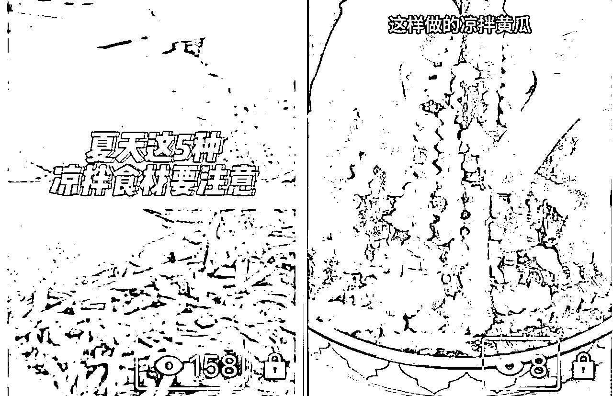
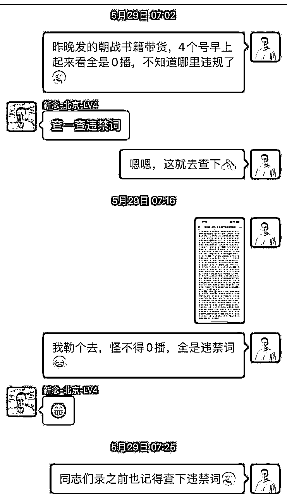
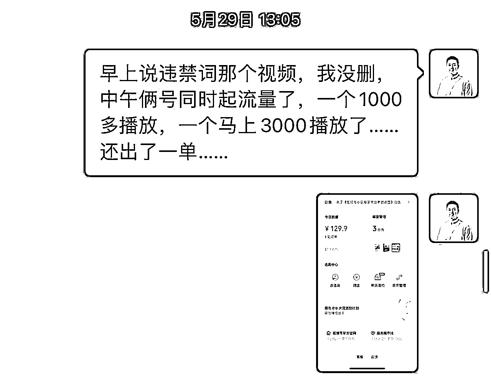
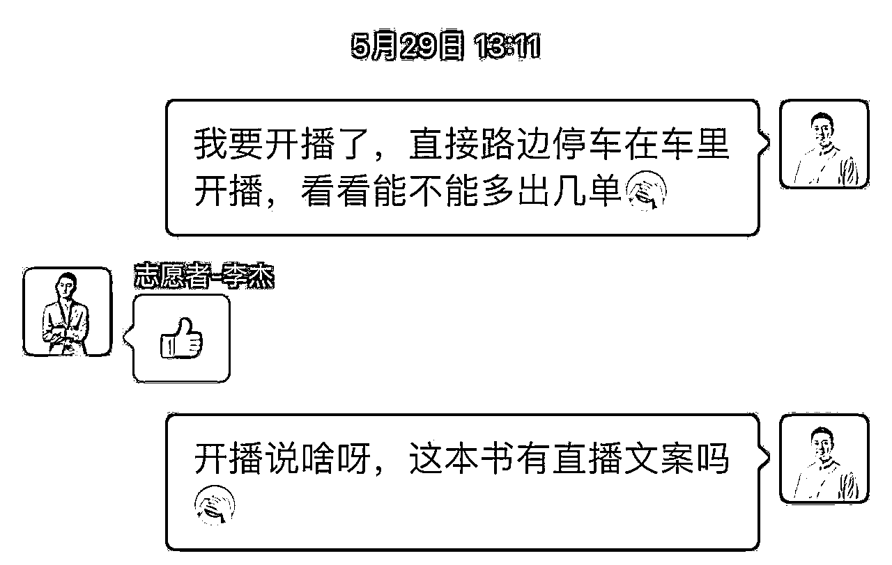
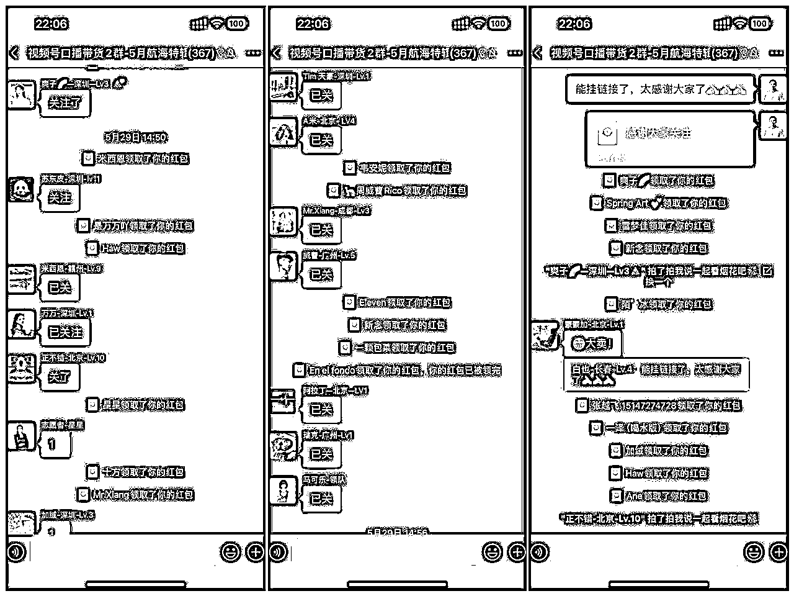
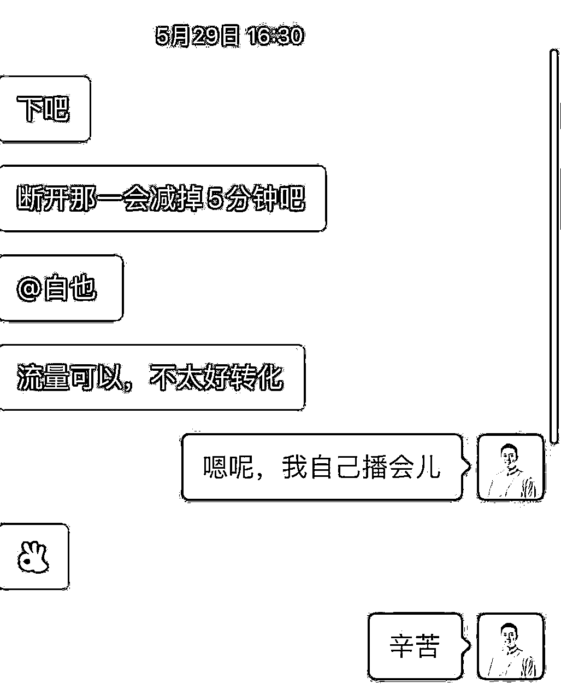
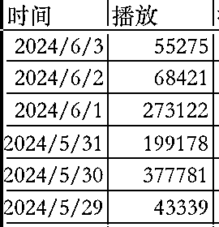
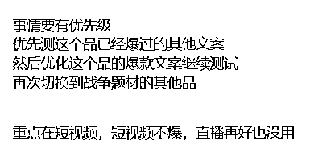

# 一条百万播放视频，撬动10w+GMV，挣回10倍生财门票，我都做了哪些事？｜5月视频号口播航海复盘

> 来源：[https://plomb5npwd.feishu.cn/docx/CzMVdXYd9ouqYexf9YtckbT3n2c](https://plomb5npwd.feishu.cn/docx/CzMVdXYd9ouqYexf9YtckbT3n2c)

# 自我介绍

大家好！我是白也，生财二年级小学生。在刚进生财的第一年里，我立下了一个flag，一年的时间挣回生财门票！

于是平时除了阅读生财精华帖和风向标，我几乎参加了每期的航海，做过小红书店铺、公众号爆文、视频号IP带货，但是都没有取得特别大的成果，自然也就没有兑现flag。

当我的心态逐渐爆炸，拔剑四顾心茫然的时候，生财开启了5月份的视频号口播带货航海，我冥冥中觉得这次航海会很不一样，错过它我会很后悔，于是义无反顾的报名上船！

在航海进行到第14天的时候，我的一条口播视频迎来爆发，最终实现100w+播放，撬动了10w+GMV，让我挣回了10倍生财门票。

在新的口播航海即将发布之际，回过头复盘上一期视频号口播航海，收获满满的同时，也犯下了很多错误。

请各位圈友跟随一名航海船员的视角，共同复盘5月视频号口播航海！

# 航海复盘

## 报名

5月抢跑航海是一次新的尝试，28天的航海周期，需要打卡21次，第一批500名额不到1小时爆满，第二批200名额提高了押金，不到1分钟爆满。这里当然有亦仁老大发帖说要带大家赚大钱的号召力，也有圈友们渴望赚钱的初心与动力。

我是在航海刚开启报名就果断上船了，作为参加过去年12月视频号IP航海的老船员，虽然没有变现，但我仍然坚持着录口播视频这件事。

也就是说在5月航海这条船之前，我已经在视频号上发布过100条口播视频，这无疑为我能够快速上手这次航海打下了基础。

## 起航

开船仪式上，鹏师详细介绍了项目的玩法，并强调了这次航海的核心要义：放下脸，跟着做（我自己总结的。。。）

但是当看到素材库的时候，我是有点蒙圈的，因为口播带货需要带入相关职业增强信任感，所以我需要是干了二十年的厨师、是开了六家洗衣店的老板、是从业十六年的空调师傅。。。

当时第一感觉是自己来不了这个，感觉不太行。但行不行要试了才知道，于是我选择了食品赛道，成为了一名大厨。然后我的视频数据是这样的：

我想一定是我的视频录的不够吸引人，于是继续努力演绎厨师，然后我的数据变成了这样：

转机出现在开船后的第7天，素材库更新了图书品类的文案。这让我仿佛看到了转型的可能性，于是当天就开始录书，在连发三条图书口播视频后，我的视频播放变成了这样：

数据不会骗人，我果断切换到了图书赛道，开始做图书品类口播。

## 爆款

坚持日更图书口播到5月28日，素材库里增加了新书，其中有一本引起了我的兴趣——《最寒冷的冬天》。由于本身对历史、军事题材类图书和影视作品比较感兴趣，所以觉得这本书很适合我。在开始录这本书之前，我先从其他平台找了几条同款图书的文案，然后改成了适合自己口气的逐字稿，最后录制剪辑定时发布，关灯睡觉。

第二天早上起来一看人麻了，四个号的同一条视频全是0播，于是就到群里发问，圈友说可能有违禁词，当时的心情无比复杂：

虽然查出了违禁词，但我没有删除视频，想着没准一会儿就起量了呢，洗漱完毕去上班。一直到下午一点多的时候，有两个号的视频突然同时起量，其中一个号的橱窗还自动出了一单。。。

看着视频数据不断上涨，想起教练说最大的转化在直播，我想我不能上班了，我要直播，现在，去车里！即使是第一次直播，即使连直播话术都没有，我也要立刻开始直播！于是我就在车里开启了第一次带货直播。

开播后的第一个问题，是新号不够100粉，没办法挂商品链接，引导去橱窗根本不出单。于是我就把号扔进了航海群，求助战友们帮我点关注。这里实名表扬2群的小伙伴，几分钟就给我点到了100关注！

## 直播

能挂链接以后，直播间开始出单，这时我决定请假回家直播！赶紧联系了代播，我自己开车往家狂飙！听了代播40分钟的直播，发现代播不会讲这本书，只会一直逼单，出单效果并不好，果断接过来自己播！

从我接手直播后，直播间下单速度开始加快，可能客户觉得口播和主播的是一个人，更能建立信任。所以出单速度明显加快。一直持续到7点，第一条视频流量跑到10w播放后戛然而止，直播间人数也直线下降。

这个时候，我想到了手册里提到的爆过的款还会再爆，相同的文案可以再发。于是我马上发了一条跟上条一模一样的视频。也正是这条视频，最后变成了百万播放的爆款。

这条爆款视频播放狂飙了3天，在第四天流量开始下降，而抓住这短短几天流量变现的关键，就是直播。

从29号流量爆发，到6月3号流量减弱，每天几乎都是10几个小时的直播，其中5月30号和6月2号都是24小时直播，一直没有找代播，只有我和媳妇两个人。我白天还要上班，晚上直播一宿，白天开会直接困睡着了😂

是什么驱动我俩这么拼命的直播呢。。。是钱。。。三天挣了我一个月工资，没理由不坚持做下去！

这里说一点很多圈友问我，什么时候应该开播，从我的这次经历来看：

直播与视频是相互成就的，视频引流，直播出单，同时也会给视频增加流量，直播人数掉了，就重新录一遍同款文案视频发出去试试。具体思路如下图：

经过三天的日不落直播，我整个人脑袋都是懵的，只是下意识的被流量牵着走，根本没空思考这个视频流量过去后怎么办，账号后面有什么样的规划。

这时鹏师主动找到我，和我语音聊了十几分钟，告诉我当下有哪些注意事项，账号后面有哪些方向可以规划。

这通电话让我的思路变得清晰了很多，对账号后续的运营也开始新的有了思考。真心感谢鹏师在我最懵圈的时刻带给我的指点与鼓励！

这里也提醒生财的小伙伴，当你做项目遇到问题时，一定要主动找大佬询问，这是解决问题最快最直接的方式！不是每一个大佬都会像鹏师一样屈尊来主动找你哒！还是要主动一点呀！！

## 靠岸

随着流量逐渐恢复正常，这次不一样的航海也靠岸了，很多人都收获颇丰，有的赚到了第一块钱，有的找到了深耕的方向，有的磨练了口播和剪辑的技巧。。。。

即使靠岸之后，航海群里还有很多人在坚持做口播，也陆续有人在靠岸后爆单了。毫无疑问的说，这是我加入生财以来，参加的最成功、体验最好的一次航海！文鹏组合YYDS！

# 航海收获

回望这次视频号口播带货航海，蹚过了很多坑，有很多做的不足的地方，也总结了一些干法和心法，将这些拙见全部分享给大家，欢迎大家不吝指教。

## 干法

1.  关于供应链

如果没有合作的供应链，可以在选品时私聊店铺客服，要求加运营的微信谈定向佣金，通常会顺利加上。

刚开始发视频，拿到的佣金可能比较低，如果视频爆了，要及时沟通调整自己的定向佣金，也可以多加几个供应链横向对比一下，快速扩大收益。只有高佣才是供应商最大的诚意。

生财里有很多供应链大佬，可以及时求助大佬帮忙寻找靠谱的高佣链接。

1.  关于对标

如果不想一直打高风险的品，而是想往垂类IP方向发展，就需要大量输出内容来获取流量，这时我们很容易陷入选品荒和素材荒，这个时候优秀的对标就是我们指路的明灯。只要对标找的够多够精准，我们就永远不缺题材和内容。所以我们要有自己的对标库，选一个主对标，阶段性目标就是做成他这个体量的账号，再选几个辅对标，用于拓展选材思路。

1.  关于文案

关于文案，追爆品或者废号流玩法不用说，文案连标点符号都不能改，别人咋念你咋念，别人咋拍你咋拍。

垂类IP方向的话，文案太重要了，直接决定我们的视频能不能吸引住观众。

所以，当我们刚起号的时候，要坚决贯彻“先抄后超”原则，天下文章一大抄，爆款都是在同行们抄来抄去间产生的，初期的我们不会生产爆款文案，那我们就做好爆款文案的搬运工！

第二阶段，号起来了，1:1的copy很容易引起注意了，我们就要学会做个好裁缝，提升文案拆解能力，自己动手改文案，改成属于自己的风格。

第三阶段，当我们抄到无敌寂寞，成功超车，抄无可抄的时候，就要开始原创文案了。这一步具体该怎么做，我也在摸索中，大佬们有好的方法和建议欢迎直接拍我脸上😂

1.  关于视频

一个品至少要准备4到5个不同文案的视频，这样在你的某条爆款视频流量走低之后，你才有足够的视频弹药及时补充上去。而不是像我一样因为没有库存只能发一条一摸一样的视频出去，这是种很危险的做法，很容易被判违规，后来才知道这个叫废号流玩法。

不过富贵险中求，如果我没有连怼第二条视频，也不会有爆款产生。诸位谨记号是消耗品，不要太过在意违规和限流，调整姿势继续干。

1.  关于直播

视频爆了后，直播不能停，只要ROI能打平，就要一直播，即使不找代播，也可以一直暂停直播挂着，暂停直播也会自动出单，因为直播只是短视频用户进来下单的入口，不开直播很多想买商品的用户就找不到购买商品的入口了。

1.  关于优先级

凡事都有轻重缓急，做视频号口播项目的优先级，永远是围绕短视频展开的，一切以如何打爆短视频为目标去做。当我还在纠结直播要如何优化的同时，鹏师及时点醒了我！

1.  关于求助

如果是和我一样的小白入局视频号，在视频爆了后，一定要找大佬给把把关，不要自己闭门造车，这样很容易错过很多好机会。生财里有很多视频号的大佬，勇敢链接，勇敢求助。

很多你想了很久的问题，大佬可能几句话就帮你梳理清楚了。当然，得到大佬的指点后，记得红包感谢之，投我以桃，报之以李，关系就在这一来一回间建立起来了。

## 心法

1.  执行是一切的解药

因为经常蹲群，发现圈友们很多问题，都可以用执行来解决。

我适不适合这个品？拍几条发出去试试。

我该不该开直播？播两个小时试试。

剪辑太慢怎么办？剪多了就快了。

拍的视频好呆怎么办？拍多了就好了。

所有的问题都能在路上找到答案，干就完了，你遇到的问题所有人都遇到过，没有捷径，该踩的坑，该吃的苦，一样都少不了。

1.  没有人会一直爆，但一直会有人爆

这个项目的日常是在刷视频、找对标、改文案、录视频、剪视频、发视频中度过的，爆单是偶然，枯燥的重复才是日常，只有日复一日的找素材发视频，才能增加遇到爆款的概率。所以没有人会一直爆，但一直都会有人爆。

1.  去吃你最喜欢吃的那个东西

吃饭的时候选饭店，火锅和日料都能吃饱，你会选择吃哪个？

同理，这个项目有很多玩法，高风险口播、低风险口播、抠像、混剪，都有拿到大结果的。

那么是选择垂直赛道坚持寻找爆款，还是全力追逐全品类的爆款，迅速跟品出单。

每个人的选择不同，账号的运营思路自然也不同。

先问自己喜欢哪个，再问自己适合哪个，选好了，坚定执行，静待花开。

1.  心态平稳最重要

最后一个，做项目时刻保持平稳的心态，最佳状态就是情绪和执行是分开的，情绪可以down，执行不能停。

违规了？哦，申诉

封号了？哦，注销重来

限流了？哦，删了重发

爆单了？哦，直播怼视频

任何情绪的波动都会影响我们飞行的姿势，所以，拼到最后拼的就是谁心态好，这样才能一直坚定执行！只要不下牌桌，就永远有机会！

## 感谢

回顾航海这一个月来，比去年一年过的还充实，要感谢的太多。

首先感谢生财团队，打造了这么牛逼的航海产品，只有做过了志愿者，才能领略航海是一款多么伟大的产品！

感谢教练@超鹏@晓文还有助教团队为我们带来喂饭式的航海物料，替我们解决了所有问题，让我们只管专心录视频就可以了！同时还有每周的高手分享，航海补给，以及每次私聊不厌其烦的解答。成功把航海教练提升到了新的高度！

还要感谢领队@马可乐以及所有志愿者们辛苦的付出，禁言群里每天定时的总结和分享，大群里每次的提醒和鼓励，我们都看在眼里哦！

最后感谢航海2群的战友们，这次航海是有史以来群内最活跃的，大家相互鼓励、答疑、报喜，真正做到了一群人可以走得更远！航海靠岸后群里依然很活跃，也有很多小伙伴在靠岸后爆单了！

# 写给圈友

最后的最后是写给生财圈友的话。

之前总听到有人说生财变味儿了，说大佬们总爱说些虚无缥缈的话，不讲怎么落地实践。我一度也这么觉得，听了那么多道理，还是过不好这一生！

但是当我通过这次航海拿到了一些小的结果，再回头看大佬们说的话时，顿时觉得大佬就是大佬，说的太特么对了！

我想分享两句大佬的话，送给和我一样，也想在生财取得实实在在结果的圈友们。

第一句是盗坤大佬说过的：时间是最大的壁垒。

如果我没有坚持录视频这件事，而是做了几天就放弃了，我肯定不会在这次航海中取得成果。

这一切都是时间给我的答案！

第二句是生财大师兄涛哥说过的：因为看见，所以相信。

以前我看见过很多人在生财挣到钱了，所以我相信我也能挣到钱。

现在，很多圈友看到我这样一个小白都能在生财挣到钱了，是不是更加坚信自己也能挣到钱了呢！

觉得自己马上就能挣到大钱的圈友，快用你们发财的小手给我点点赞吧哈哈哈！！！