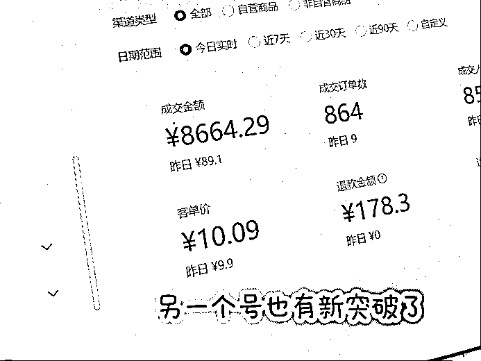

# 《新手小白入局视频号，3天卖了13W，我做对了什么？》

> 来源：[https://c049vgaj4ju.feishu.cn/docx/AxxNdBzz4oUTa8xkavAcIYIynab](https://c049vgaj4ju.feishu.cn/docx/AxxNdBzz4oUTa8xkavAcIYIynab)

嗨咯，大家好，我是大柚子，90后，有点沙雕又爱折腾的菇凉！是生财小萌新，目前正在做视频号带货。

我主要做的是美食混剪带货，航海期间总共发布的视频数量已经超过了100条，变现gmv一万块左右！期间除了混剪之前的老号，也起了两个新号，两个号起号时间都是一周突破千粉。

目前老号粉丝最多的6万多粉！很多人会好奇这么多粉丝为什么gmv这么少，因为老号集中变现在5月左右，后来由于同质化和非原创问题违规，目前流量卡在两三千的样子，每天都能出点小单！

航海期间，其实我的主要心思花在原创上，做美食实拍

【我是厨房小白，还追求色香味俱全，所以这里走了很多弯路，在尝试了各种脚本和拍摄方式，也把账号内容做得很乱了，然后重新开了一个新号，目前还在涨粉阶段，1000粉丝后才会考虑带货】

接着重点想说说做视频号一路走来踩的一些坑！

【如果能早点加入生财，我也不用踩这些大坑了��】

我是4月初接触视频号的，【到目前为止，多个号总gmv20w＋，如果能早点找到生财，或许能翻一倍��】

这是我其中一个号的收益图

我的起号方式简单粗暴，就是抄同行，抄爆款，就近原则，越近越爆的越好！（比如我刷到一个同行昨天发的视频爆了，那我第一时间安排“抄”）

抄的核心主要就是抄到爆款的爆点！（也就是分析这个视频为什么火？是黄金三秒？是引导特别好？有槽点有争议？？是有共鸣？）

如果实在没有发现爆点，就直接抄！因为“火过的内容还会火”！

下面是我“抄”＋改 得到的一些爆款。

我靠这样“抄”在一周时间起了4个千粉号，【新号本来就流量扶持、你的内容如果不错的话，一条几万播放的就上去了，所以大家不要有粉丝焦虑】本来有5个号，有一个在过原创的时候，操作失误，废了！

具体就是本来要发10条原创实拍再去申诉，我一不小心发了8条就去申诉了��所以大家一定要细心一点！）

你以为这样就一帆风顺了吗？不！磨炼才刚刚开始！

��1000粉丝后我开通橱窗，兴高采烈开始带货！！��纳尼，怎么都卡0！？？（4个号只有一个漏网之鱼，挂车��播放）到这里的时候，我已经开始怀疑人生了！��【当时真的不理解为什么会这样，不挂车有播放，一挂车就20播放了】然后我试图拯救，还给不同账号分配了“专属方案”（A账号日更流量视频，b账号两天一更，c账号停更7天）然而半个月后，卡0的账号还是卡0！��简直心如死灰了！

好吧，幸亏还有一个挂车正常账号，于是我把心思主要放在这个账号上，同时又开始起新号！

前期开始测品，也是跟着同行各种发，同行发啥我发啥！挂车账号开始有一些小单！（这个时间大概持续了半个月）直到某一天，我发现我的账号挂一个品转化特别高，5000播放能出300块！【当时乐开花了，就感觉终于轮到我了】测出来一个品后，那肯定得继续跟这个品呀！于是打通了任督二脉，全力以赴就搞这个品！

到4月底，这个品终于迎来了爆发！早上开始直播（开播的时候播放只有5000左右，但是播着播着视频也跑起来了，直播转化也起来了）没想到就一直有转化！然后这一天播了十多个小时，到晚上十二点多，实在熬不住了才下播！当日直播➕短视频一起是卖了4.8W！

接着这种节奏连续了3天，3天总销量是13w gmv……

第四天流量不对劲了，大半天才卖了一千多！原来视频被原创作者举报了，一下16条违规通知！然后开始限流！��

下面是一些账号的数据图：

这里想说几个点：

1、流量来的时候一定要想尽办法去承接，因为流量走的时候也非常绝情！（视频号容易违规是出了名的，所以一定要把握每一次爆单的机会）

2、直播开启前一小时发布视频，直播的同时，后台补视频定时发布，这样能够实现双频共振！所以尽可能多备点视频，因为自己播的时候根本顾不来！

3、播不了找代播上！（我因为没早点进入生财，这里踩了大坑）

因为当时这个号在爆的同时，我另外2个新号也爆了，分身乏术，没有直播，没有及时去承接，挂车卖了大几千，gmv起码损失一倍甚至多倍）另外连续几天十几小时的直播（嗓子哑还好说，重点是我戴钢丝牙套，口腔磨得全是溃疡��）几天下来真的累惨了！我要是早点加入生财，也不至于吃这个苦啊！��而且当时我晚上十二点多熬不住了下播时还是有不断出单，有代播直接日不落多香！

4、测品，这个过程非常重要，包括我后来的账号，也是不断测试才找到适合某个账号的产品！

（选品我一般先看同行，然后看选品中心的爆款商品榜，就像我选出来的这个爆品就是发现它上榜了，而且符合我账号调性，粉丝属性也符合，所以果断去测试了！）

5、如果是混剪，去重一定要做好，有些简单的镜头可以自己实拍去替换！（我后来几个号大多也是爆了之后被判同质化和非原创)还有就是细节一定要处理好，要有耐心，要细致观察爆款，分析爆款，遇到瓶颈的时候，多停下来想一想，拉片也是很有必要的。

6、样品提前买回来，以备不时之需，真的有备无患，我后来有个账号爆了一个品，就是我在播了几小时后到货的，（当时很忐忑，怕被判违规）刚好赶上了，那天直播也卖了几千块！另外实在没样品，真人出镜，也可以整个商品贴纸，或者航海手册里面提到的具体操作！

7、一定要关注你的同行动态，一定要多去刷灵感，刷直播广场，另外有时间就开直播，不爆的时候就当在练习了！（我是连续播了几天才碰巧爆了的，前面刚好练习了几天，操作也都很熟悉，所以直播状态很好，当时练习的时候朋友还说我太较真了，没人放个录音不就行了吗？我心想：有些路总得自己走！第一天我是直播了4小时只卖了9.9！）

8、大胆去尝试，刷灵感的时候优先视频号！但是也不要局限于视频号！我有一条视频爆，灵感是来源于小红书的！

9、心态！！心态真的很重要，很多宝子做几下没流量，发一段时间没出单，心态就崩溃了，然后就怀疑自己了！其实大可不必。因为“爆单是变态，不爆单是常态”��我摸索了一个月才迎来了爆单！而且是从变现9.9开始的！

所以大家不要焦虑！跟着手册走，真的会有收获！当你爆了，你会觉得所有的努力都值得，所有的挫折都是铺垫！加油冲就是了。何况有生财这个大家族的陪伴，真的事半功倍！

10、有商务找到合作，不管你带不带这个品，你都先加上，然后可以问他们要一些最近爆单的对标账号，可以作为参考。（我有一个商务关系比较好，除了时不时寄点样品，他还会主动发爆单账号让我参考）

另外，你跑得不错的品，主动去添加商务，有些商品是有定向佣金的，比选品中心高一点，可以找商务申请，不要小看2%，有时候量变可以引起质变。

自己摸索真的会走很多弯路，比如我最开始那几个挂车卡0的被我注销的号，其实也是可以直接直播去承接的！

（这些都是我加入生财之后才醒悟的）很多时候都在为“认知”买单！��

我想说，生财的航海手册和百问百答加上教练答疑，还有志愿者，以及船员们的互帮互助，真的是“王炸”了！

我做自媒体以来没少付过费，这次摸着自己的良心说！生财真的超值！YYDS！

因为我上面踩过的坑，生财已经帮大家排雷了！

剩下的就是实操，坚持！

大家一定要认真利用这个手册，我一般是有问题会直接去搜索��通过航线图也能很好的找到你需要的内容！

包括我接下来非常想要做实拍然后去测试投流，（航海手册也有详细的操作，包括注意事项都很清楚）

最后想说：

人生没有白走的路，

你走的每一步都算数！

乾坤未定，你我皆是黑马！

各位爆款见！����

我今天的分享就到此结束啦，感谢生财，感谢各位！

祝大家多多爆单，一起生财有术！