# 一年变现1500w，0-1本地生活品牌招商流量端复盘深度拆解

> 来源：[https://avk9oq3bp6v.feishu.cn/docx/PeCBd7SwYoPyxvx5a2AcNtvcnXd](https://avk9oq3bp6v.feishu.cn/docx/PeCBd7SwYoPyxvx5a2AcNtvcnXd)

写在前面：

大家好我是阿伟，抖音5年运营老兵。这篇文章主要分享我和我们团队操盘手在去年实操小餐饮技术加盟全流程的项目复盘：从0-1起品牌，一年累计招商1400人，变现一千多万，全网累计曝光1亿多次，并且每个月都能稳定产出自然流单条百万级流量的视频。去年保守估计孵化了500+个竞争对手，并通过这套方法论帮助了“徒弟的徒弟成功收到了徒弟”。

这篇文章主要分享流量端的实操经历和细节拆解，同时倒推项目起盘到拿到大结果的关键动作和方法论。

# 项目概况：

简单介绍一下项目，2022年12月25号品牌首店投入试营业，3个月时间跑通门店爆款模型。建店成本5万，一年单店营收170万。直到23年底，靠短视频矩阵+直播一年招了1400多个学员。客户群体6成餐饮人，4成纯餐饮小白。

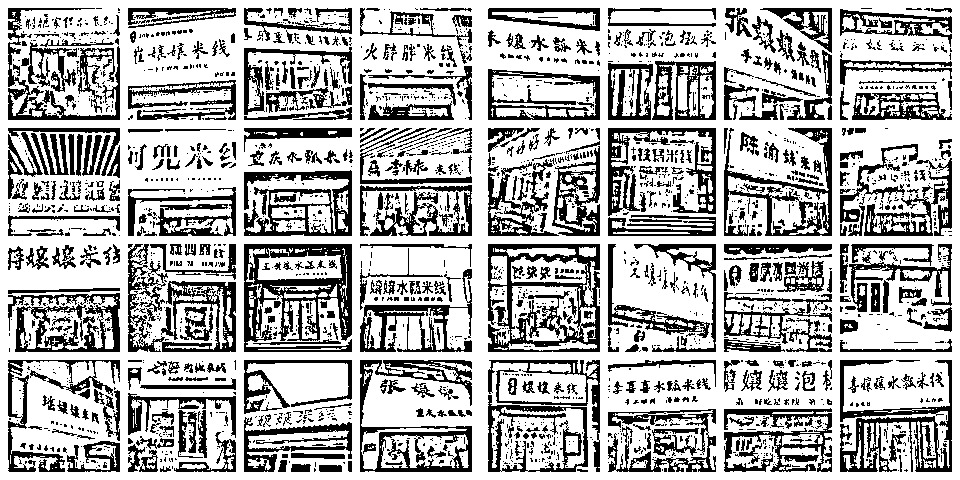

（部分门店和教学案例）

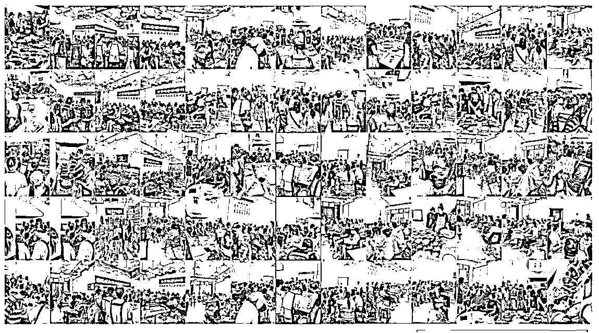

产品定价全国统一9800，线上缴纳1000定金，线下考察确认报名后补齐8800尾款。课程包含3天的集中培训交付，加上一年的线上陪跑，以及一本200多页的全流程SOP手册。交付内容除了技术培训外，还涉及加盟体系中的供应链、门店打造、经营指导，以及特色的新媒体运营，但门店不能以我们的来命名，属于“技术加盟”范畴。

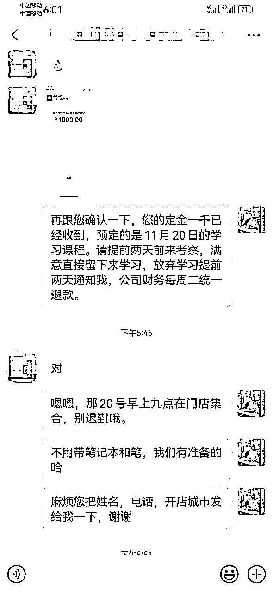

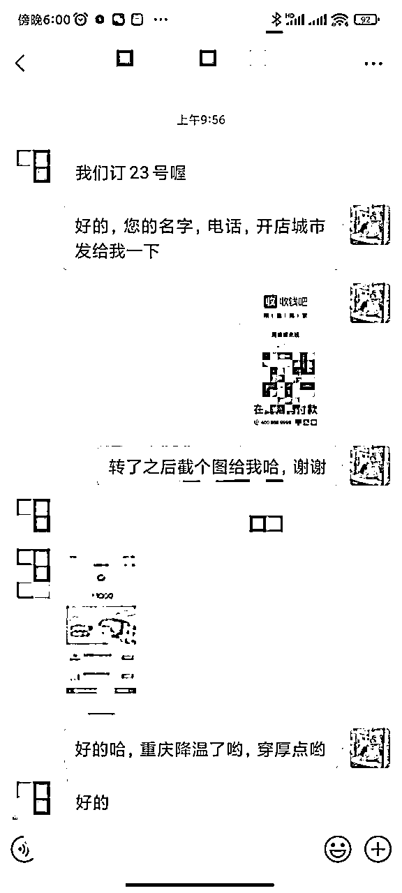

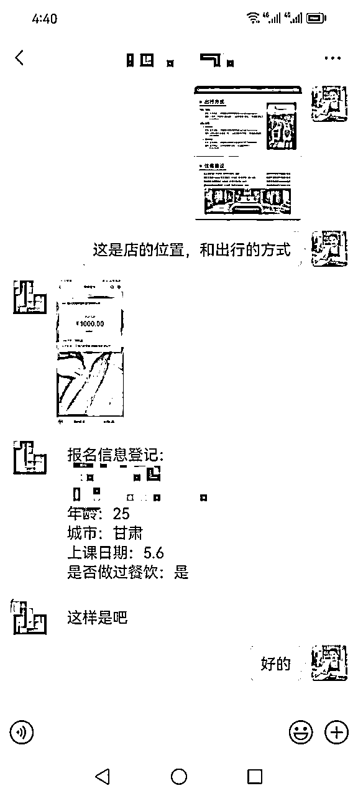

学员经过3天集中学习后，回去根据sop手册内容做整店打造，大概1个月左右完成建店，建店总投入成本大概4~8万不等。后期学员店存活率约90%，前期投入越小存活能力越强。

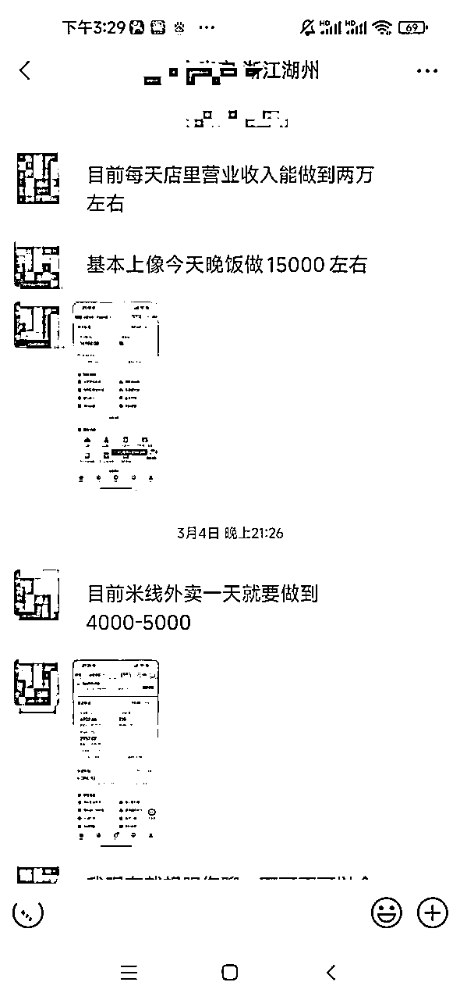

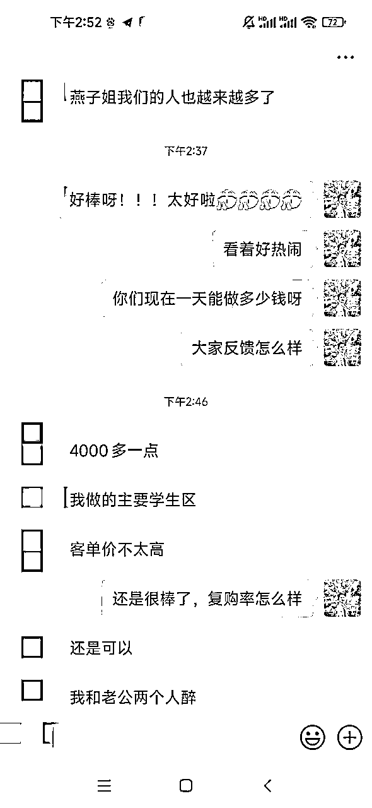

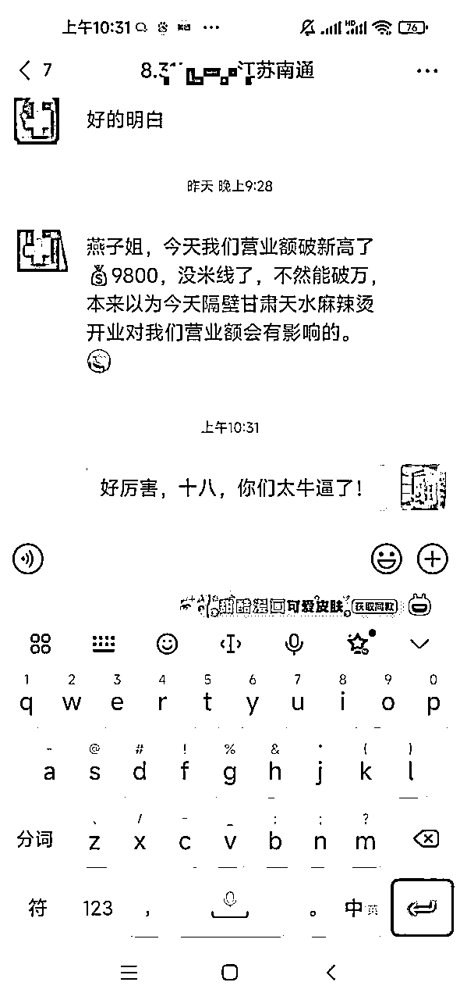

（下面是优质学员店案例，真不是托哈，学员真实反馈）

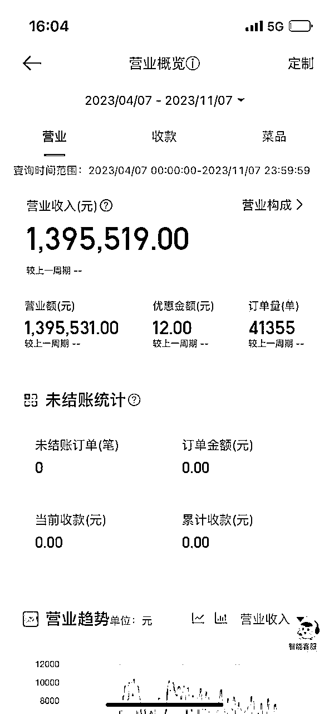

（太原店半年做了140w）

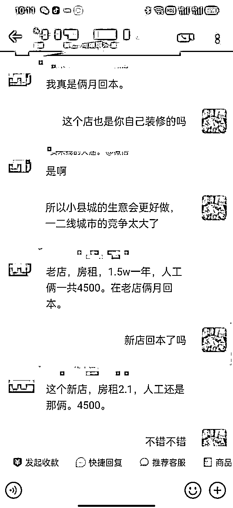

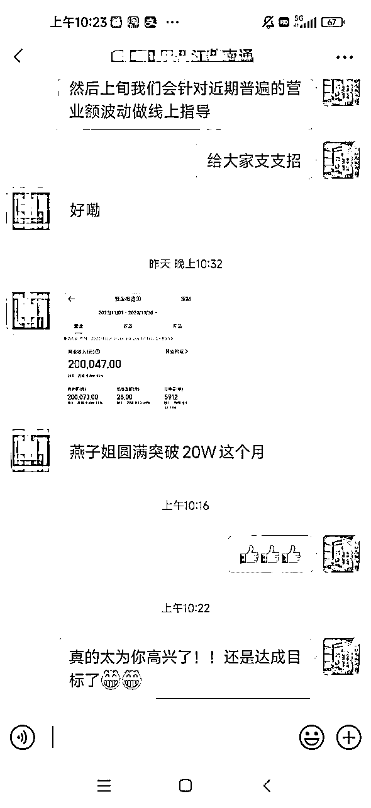

流量端从2023年3月份拿到第一个百万级作品开始，接下来每个月都能稳定产出至少1条自然流单条百万级流量的作品。并且经过半年的爆款素材积累，从10月份开始正式进入流量井喷期，11月最高拿了2万多个客资，自然流产出占比超90%。

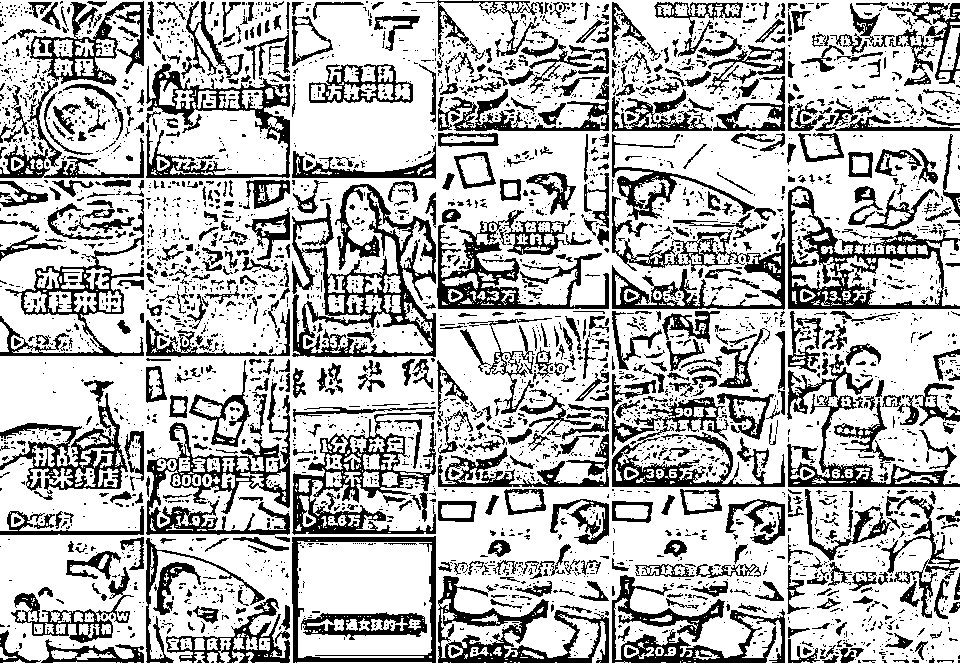

# 项目背景：

## 行业是怎么定的？

项目最早追溯到22年12月冬，重庆疫情解封后，我们结合之前的餐饮新媒体经验，快速锁定了小餐饮技术培训这一赛道。当时判断的原因有三：

1.大环境导致创业人口上升。疫情后失业人口激增，小成本创业需求量扩大，餐饮行业门槛又低，大量创业者会进入餐饮行业。

2.小餐饮店存活能力强。消费降级后，社交型餐饮店生意骤减，消费者涌入刚需型餐饮市场。小餐饮店注定市场存活能力不会差。

3.近期有同行爆款案例。当时有一批“林妹妹葱油饼、烈火牛肉”的小餐饮账号横空出世，并且拆解了他们的转化路径后，发现招商都做的很不错。

## 怎么定的细分赛道？

首先，我们从0-1起盘的每个关键节点，都是结合商业变现路径做的倒推：

*   因为要做餐饮技术加盟，所以需要拥有一家持续生意火爆的餐饮店，结合当下大环境，品类需要具备“高频刚需”的产品属性；

*   因为投资回报周期短才能吸引招商，所以我们打造了5万块的建店模型。加上接地气装修风格，从产品到装修应该具备“可视化的传播属性”，同时产品需要具备高毛利、复制性强的特点。

*   因为考虑到招商的周期性和地域性，所以我们选择的品类，还需要考虑到南北口味差异，男女老少接受的特点。

所以我们在头脑风暴筛选出几十种品类后，最终把目光锁定在“川渝米线”上。

川渝米线不仅具备上述的所有产品特点，并且在实操中我们发现它在短视频中的表现也非常出色。同时在项目开始播撒全国市场时，地方特色风味又为成交提供了一个很大的加分项，不少学员在开店时都会打上“川渝米线天花板”、“XX（城市）首家重庆米线”的标签，这些是项目实操后发现的意外之喜。

除此之外还有诸多因素，其实一开始在项目和品类筛选之初，很难考虑得面面俱到，但上述的信息点都是我们在拆解项目发现很重要的成功要因。

# 流量萌芽期：先有好店+好品，才有好流量。

我认为，任何一个可复制的成功实体品牌，在起步之初都要遵循一个基本原则：好店，好品，好营销。包括这几年我们给餐饮品牌做营销赋能时，也会格外注重门店的店铺模型和产品竞争力。

好店的要素需要重点考虑：选址、装修、布局，店铺规模，这决定一个门店成败的基因，很大程度上不可修改。

好品的要素需要重点考虑：价格竞争力、颜值竞争力，产品差异化和大众认可度，这是产品高效营销推广的前提，可以设计和新增。

## 为了打造首个爆店模型，我们做了五个关键动作：

### 1.选址。

前后花了一个多月，还是在相对顺利的情况下。最终选择在重庆一流商圈的三流位置拿了个50平米的铺子。

为什么选择在一流商圈？

因为好找，商圈的人员流动性和密集型，能解决传统小餐饮只能辐射方圆三公里人口，受众人群少的问题。

为什么选择在三流位置？

因为租金低，我们需要一个有足够说服力的低成本建店模型，并且一旦新媒体推广出去了，导航会帮助顾客找到门店。

### 2.低成本装修。

做旧乳胶漆+手写菜单+旧报纸+3块一张的胶皮凳子，构成了门店基础的老居民楼装修风格。

低成本装修的好处是显而易见的，首先是极大降低了顾客进店时的选择成本，看着就便宜+正宗。另外是这种画风给新媒体文案提供了很大的包装空间，我们统一对外以“5w以内开好整家店”的口径来做营销招商。事实上我们确实也帮助很多三线以下城市的学员，用5万以内把店开起来了，而且做得都还不错。

低价不代表廉价，相反我们很注重年轻客群的消费体验，店里富有年轻化的手写文案+趣味性的软装都是为了讨好年轻人而设置的。再加上用铝材质的水瓢容器，和泡椒红油米线的高颜值，很多消费者都愿意进行自传播。

### 3\. 推出1元系列引流品。

互联网营销需要引流品，当我们把做火锅店引流甜品的那套逻辑拿到米线店的时候，会发现就是在做降维打击。冰豆花一份一块钱，进店必点。开业上架以来每天限量一百多份，天天售罄。

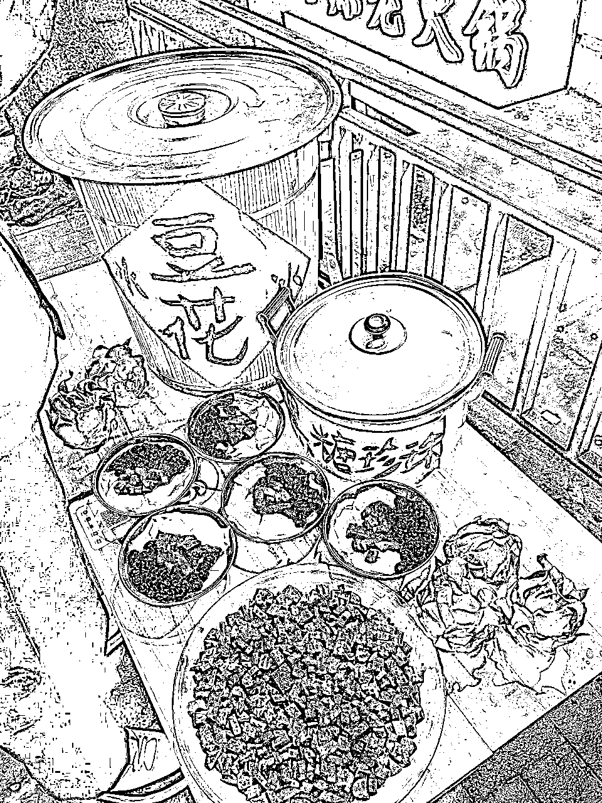

因为米线的平均客单是在21左右，这个价格放在消费降级后的米线市场一定是偏高的（我们需要把我们的毛利控到6-7成，这对招商客群来说有巨大的吸引力）。因此人手一份1块钱的单品就显得非常合理，套餐的价值感和顾客复购率都有明显提升。

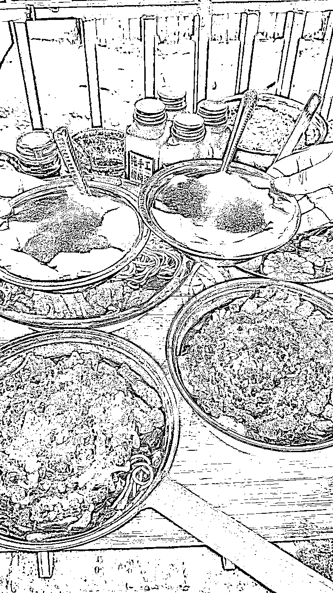

### 4.不做团购，做内容营销。

很多餐饮老板的头号敌人就是低价团购，买了低价团购的顾客不会再来买正价商品。尤其是对于一开始就想做对外招商的品牌来说，价格体系被破坏是致命的。并且互联网会有记忆。

我们也考虑过用略微低于正价商品的价格来做团购展示，但实际上店里用的是自助点单系统，团购核销会增加人工成本。

所以综上，门店从一开始就没有做过任何团购，而是通过特色新品米线和短视频推广来持续做拉新和复购。

### 5.爆品打造：创新性2~3人份豪华米线

门店出餐稳定后，能满足每天3~4轮的基本翻台后，如何快速提升营业额就是横在我们面前的第一大难题。在门店不做低价，保持一天8小时的营业时间基础上（员工不用两班倒），我们选择了有策略地提高客单价。

68块钱的土豪米线，把分量做足，把荤菜做多。要让外摆区的路人看到以后走不动道，让上了桌的顾客不可控制的掏手机。

事实证明确实做到了，我们从去年三四月份上新土豪米线以来，日营业额从之前堂食的3000一路飙升到5~6千，再加上1~2千的外卖营收。门店一下子爆的一发不可收拾，店里每天排队，雇了8个人工来维持经营。

如果有人告诉你，他靠一家50平米的铺子卖米线，每个月能卖20多万，你一定会觉得他疯了；

如果这个人还告诉你，这个铺子他还能做4成左右的纯利，你一定会觉得是你疯了。

但是如果你是这个人，并且在这个基础上你还能告诉别人：这个铺子当初你开下来只花了5万块，并且你不光只有1家店，其它店比这个生意还好的时候……

你会发现：整个市场都疯了。

这就是当时的情况，评论区上千条互动是常态，大多众说纷纭，褒贬不一。有不信的，也有观望的。

但最离谱的是，上面这套逻辑我们还能做到自圆其说，让前来实地考察的客户来了门店近距离了解以后，还能跟旁边我们的销售回一句：“嗯，这很合理”。

…………

我们推出土豪米线并且取得成功以后，越来越多的同行开始复刻我们的爆品。为了保持产品的新奇特，我们每个月还会在土豪米线的基础上升级一款68元的米线，做产品轮换，以此保持高客单产品的持续复购。让门店日营收长期维持在7~8k之间。

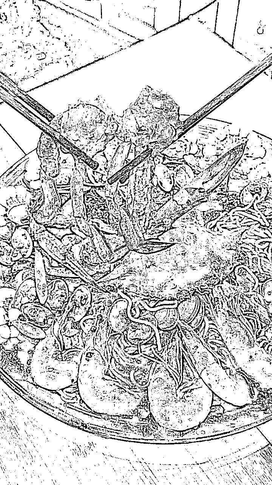

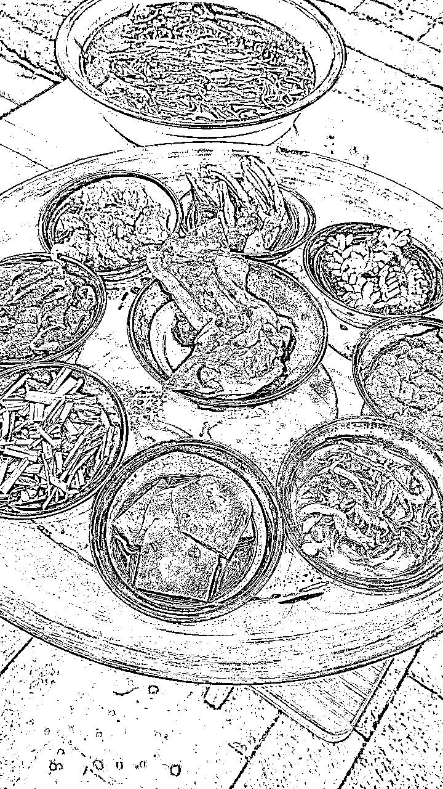

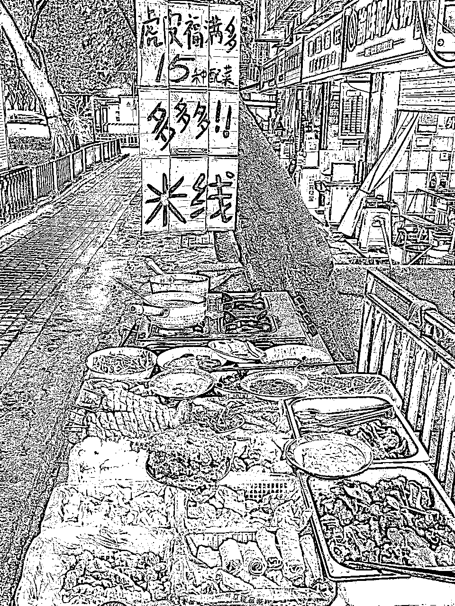

而这，就是爆品给品牌的巨大能量加持，在通过新媒体的包装和放大后，焕发出别样的魅力和生机。

# 流量起步期：深化内容，多平台布局，总有一个先开花。

有了爆款店铺模型以后，这套商业模式就成功了一半。接下来团队只需要围绕流量获取和成交转化这两大核心来做深耕即可。

首先流量端的内容，也是需要从0-1做冷启动的。可以跟随着店铺从无到有的过程做内容生产。从选址选品选设备硬装软装一步步来记录，素材原创度高且有连载属性，很适合一阶段做粉丝积累，属于天然的爆款内容。

前期生意不好也别闲着，找问题做产品打磨内功，过程中也可以记录。对外统一说试营业就好了。在这个过程中也可以反复打磨IP属性，并培养内容团队对行业和受众的理解。一举多得。

在这个过程中，不妨在各大新媒体平台做内容分发，抖音、快手、小红书、视频号，但凡是你能想到的，都可以分发内容做测试。前期成本极低但收益上限极高的事情为何不做呢？

值得一提的是，在营业第一个月跑爆款模型的阶段，我们已经做了十几个学员的成交，项目达成自负盈亏。这个过程中我认为有几个动作是做对了的：

### 1\. 编导深入学员培训现场。

内容离消费者越近离成功就越近，培训教学现场是让五湖四海的客户聚集起来和内容团队面对面的天然交互场景。在这个过程中，内容团队能够直面感知和记录客户痛点和需求点，事后自省内容是否足够打动客户，以受众为导向做内容优化调整。

### 2.主IP下店，从真实的老板娘做起。

IP必须贴近真实人设，在这个过程中凡是尽量亲力亲为，也是低成本建店中不可或缺的一环。也因为这一环节，IP人设的感染力得到了长足锻炼，在起盘第三个月，门店还未跑出爆款模型之前，账号就拿到了第一条自然流百万曝光的视频。

# 流量上升期：账号矩阵化+低成本直播打法，多点开花打爆品牌

内容的尽头是复制。当一个账号找到爆款模型以后，摆在面前的就两条路：1.把这个爆款模型复制一百次，2.把这个成功的账号模型复制一百个。

爆款模型复制的过程中还要格外注重周期性和新鲜感，客户成交是一门学问，对项目感兴趣的人往往会考古账号的历史作品，这就代表着同一周期的作品最好要有分类策略:流量端、人设端和转化端的视频要有节奏的发布。光靠同一个模型就想一招新吃遍天并不现实。

所以矩阵号的启动势在必行，IP相同，素材库共通，通过不同的文案和画面组接来做降重和营销矩阵。

大概是起盘期的第五~第六个月，一批IP小号就横空出世，一开始三四个，陆陆续续做了十几个，在这个过程中，“每天卖8000，月入20万，5万块开店，1000块搞定的网红店软装”，此类关键信息全部统一营销口径并且高频出现，起到洗脑式的营销效果。很多粉丝抱着观望的心理天天看，自然而然就信了。实际的成交周期有长有短，但整体学员的反响都很好。

* * *

在这个过程中，我们陆续把直播加到了整个矩阵体系中，白天用的是半录播的矩阵打法，只需要定期更换录播素材就好了。晚上让IP主号直播做粉丝连线，平均一场能拿三五十个客资。而且这些客资的质量和成交转化率非常高。

也有人会疑问：为什么一开始不做直播？因为IP号还是需要一定的粉丝体量和时间沉淀后开播，起盘期开播投入回报率是很难算过来的，内容是流量的根本。IP的精力从门店到短视频再到直播，需要经过深入老板娘人设——深度打磨内容表现力——最终是直播转化变现的过程。

# 流量波动期：付费流打法，给账号安全加一道锁

时间回到23年下半年，随着矩阵号的按批次陆续启动，账号不可避免地遇到各种限流的问题。一方面，品牌招商需要把公域用户转换为私域，在这个过程中为了吸引招商还需要持续晒成果，有炫富和引导他人创业之嫌，所以做这一行要常年跟平台打擦边球。另一方面，小红书新规要求站外引流时必须要搭配薯币和聚光投放，属于需要给平台缴纳保护费。

所以从这一时期开始，团队从纯粹的自然流打法转变为免费+付费的混合流量打法，投放本质上遵循赛马机制，从能过审的作品中逐步筛选转化率最高的一批作品。

转变后好处也十分明显，付费流提供了稳定的客资增量，同时确保账号的私信导流安全。

简单来说，经过矩阵爆款复制，和直播+付费流量的三重加持，品牌正式进入腾飞期。

# 成交井喷期：简单的事情重复化，重复的事情精细化。

在跑通了最终矩阵模型后，品牌最终迎来成交变现期。彼时内容组每天只需要做好两件事：1.复制内容 2.复盘迭代。并且从大量同行的作品中汲取文案灵感，有机融入到自己的内容模型中。

在这个过程中，我们持续深化了几件事：

### 1.微调作品以匹配不同平台的算法差异。

货架式内容平台需要格外注重封面和标题，所以我们打造了自己的爆款标题库和封面库。

同时，不同的内容爆款模型在各个平台的数据表现也有明显差异，爆款内容的复制周期和发布节奏也有相应调整。各个平台遵循连爆原则，即：某一内容在平台爆了，则该类内容和该账号在近期会有更大概率连爆。

所以当账号一段时间在某个平台数据表现不错时，我们的内容发布策略也会更大程度上往该平台的算法和受众喜好做倾斜。

### 2.开头前5秒格外注重画面文案。

要求开头必须每一个画面都是我们测通有效的爆款镜头，并且文案格外注重人群钩。同样我们打造了开头文案库和爆款画面类型，并且对这些内容做了深度拆解。

一方面，我们需要让内容组的新成员能够快速适应生产节奏，这些都是直观有效的资料。另一方面，老成员也可以结合这些整理和拆解心得，更有侧重性地收集素材，结合自身爆款理解来创造镜头。

# 三大核心竞争力：为了拼过同行，我们做对了这几件事

## 1.用新媒体的可视化爆点逻辑，打造整个店铺模型。

在新媒体平台做到流量和成交双丰收的前提，就是把转化类的镜头通过视听语言艺术化地表达。这个过程中场景打造是第一位的，也是不可逆的。

我们从建店时就开始考虑流量端的问题：

短视频从什么角度拍？直播机位怎么搭？——对应门店怎么布局。

门头怎么拍才好看？画面呈现的色调怎样？——对应门店的门头、灯光、软装

产品用什么容器装？产品怎么拍才好看？——对应餐具挑选，菜单设计，爆品打造。

也就是说，我们从门店建好的第一天开始，流量已经赢在了起跑线上。

网红店并不是一个贬义词，极其可视化的产品和场景，非常适合用户自传播，也匹配流量算法。这是真正有效区别于同行的行业壁垒。

## 2.团队搭建从简到奢，有策略有节奏的为团队添加营销武器。

项目一开始是极低成本起盘，单号运营，编导负责内容全流程。诸如矩阵号、直播间、付费作品都是后续逐步加的。这个过程中操盘需要结合对项目和流量的理解，有策略有节奏的为团队添加营销武器。过早或过晚都不妥：过早会亏本，roi算不过来。过晚会导致流量严重下滑，严重些甚至号都没了。

23年一年被封的号没有十个也有八个，现存的号或多或少至少经历过一次账号限流，但最终稳定下来了。一方面作为流量操盘手必须在过程中时刻把握这个度，既要讲到观众心坎里，又要被平台规则所允许。另一方面，我们内部整理的《账号/视频违规案例及应对解决办法》起到了举足轻重的作用。踩过的坑至少保证不再踩第二次，同时，这些行之有效的方法论作为我们的培训工具包，给我们的学员提供了宝贵价值。

## 3.持续向有结果的人学习，接受自己被当韭菜。

在起项目吃红利这件事上，我们始终认为机会成本大于一切。尤其是对于一个攀升期的团队而言，少踩几个坑对我们而言都是难以评估的巨大收益。

所以项目正式起盘开始，从操盘手到每个编导、直播运营，每天都要大量对标外部作品，每周要组织一次集中的爆款拆解，每个月要针对某个拿到结果的同行做一个深度拆解。流量端需要结合对标同行的全域账号运维，ip设定，热门选题，爆款镜头，内容结构进行拆解和思考。转化端需要卧底当学员，跑完对方的交付全流程。这个我们会有选择性地去找，内部综合评估有收获，就会毫不迟疑地“交智商税”。

这套流程的收益虽难以量化，但确实让团队获益良多，并且从一年的维度来倒推复盘时，发现团队有几次“生死危机”，确实是因为这些外部团队的方法论和资源让我们化险为夷的。

# 文末总结：

最后从看待项目的眼光来试图分析一下：这套商业模式有哪些亮点呢？

#### 1.首先是试错成本低，收益上限极高。

新媒体的魅力是无穷大的，我们做这个项目时一共就10万启动资金+5万备用金。三个月内跑平项目盈亏就能做长效经营，技术培训边际成本又极低，稍微踩中红利就原地起飞。

#### 2.全流程都是可以标准化的。

从起店到流量起盘，我们无数次的测试和证明：爆款是可以被有效复制的。有句题外话：我们随课附赠的全流程SOP手册甚至在某个渠道被转卖到一份2000多，这也足以说明这套模式的含金量和落地可执行性。

#### 3.应用赛道广泛。

这套模式可以完整应用在糖水店、甜品面包店、特色小吃（如麻辣鸡，酱板鸭等），以及各类具有地方特色的粉、面赛道（如螺蛳粉，陕西面馆等）。同时，在其它注重场景打造和拥有技术培训体系的行业均可参考（如芳疗馆、头疗店）。

当然，如果有其它行业或者好的想法和点子，欢迎评论区斧正补充。