# 1.5万字！普通人做小红书，看这一篇就够了

> 来源：[https://p03a4vs9s2.feishu.cn/docx/EfaRdniZao28CFx5RXGcRBgDnfg](https://p03a4vs9s2.feishu.cn/docx/EfaRdniZao28CFx5RXGcRBgDnfg)

halo，我是叁斤，专注小红书赛道 4 年，运营过好物分享博主号、小红书电商、个人IP账号，还有品牌企业号，聚光投放等，也分享过一些帖子：

做过的小红书账号差不多100+，小红书大部分变现方式都做过一遍，现在专注在个人IP方向。

今天整理了一些小红书运营的入门知识，对刚开始运营小红书，或者在运营上遇到瓶颈的小伙伴会有很大帮助

内容较长，目录设置了超链接，可以点击目录直接跳转对应内容

# 目录

1.  小红书推荐机制

1.  小红书变现模式

1.  常见笔记类型

1.  账号和人设定位

1.  爆款内容制作流程

1.  安全私域导流方法

1.  运营方向建议

1.  运营答疑

# 小红书推荐机制解析

创作者在小红书发布笔记，笔记通过审核后，会先上传至平台数据库。用户打开、刷新小红书，平台会从数据库中召回大量笔记，再通过粗排、精排和重排等算法，最终展示一小部分到用户主页

*   召回：小红书快速从数据库中取出大量用户可能感兴趣的笔记

*   粗排、精排：用算法给笔记打分，从大量笔记中选出分数最高的少量笔记

*   重排：将分数最高的笔记进行抽样，再用规则打乱笔记顺序，最终展示给用户

大部分情况下，粗排、精排和重排，都是算法层面的事情，我们知道了也没什么用

真正影响运营的，是小红书笔记的召回，也就是推荐。我们要知道小红书是通过什么规则，找到用户感兴趣的笔记并进行推荐的？

## 笔记召回通道解析

当用户打开、刷新小红书后，平台会调用十几条召回通道，来判断一个笔记是否适合推荐给用户

我选了几个对比较好理解，且对我们运营有帮助的召回通道来解析

### 根据笔记相似度推荐

如果用户喜欢某篇笔记，小红书平台会根据笔记之间的相似度，给用户推荐他没看过的其他笔记

举个例子

那么系统是如何知道两个笔记相似呢？

有以下几个方式：

1.  看过《鬼吹灯》的其他用户，也看过《盗墓笔记》

1.  给《鬼吹灯》点赞的用户，也给《盗墓笔记》点赞

1.  两个笔记的受众人群重合度越高，两个笔记就越相似

1.  两个笔记相似的标签越多，则说明两个笔记越相似（类目、品牌、关键词……）

但需要注意的是，一个小圈子的用户同时点赞、互动 2 个作品，不能证明 2 个作品相似。所以转发到群里让别人点赞，并不能增加推荐，反而可能打乱标签

基于“笔记相似度推荐”，在找对标笔记做选题时，最好不要照抄大爆款，因为点赞过的人可能会再刷到你的笔记，但因为看过相似的内容，所以不会给你点赞。

### 根据用户相似度推荐

基于用户之间的兴趣爱好推荐，假设 A 用户和 B 用户的兴趣爱好非常相似，A 用户对某篇笔记进行点赞、转发，而 B 用户没看过这篇笔记，系统就会给 B 用户推送这篇笔记

举个例子：

那么系统如何判断两个用户的兴趣相似呢？

1.  被这两个用户点击、点赞等行为的笔记，有很大重合

1.  eg. 两个用户都经常点击《盗墓笔记》，或者盗墓题材内容

1.  两个用户的关注作者有很大重合

基于“用户相似度推荐”，会发现当我们把目标用户确定好后，针对用户做选题，或者把爆款选题换个角度写，就容易拿到更大的推荐量和互动量

### 根据作者推荐

根据作者推荐，一共有以下几种方式：

1.  用户关注了某作者，那么作者后续发布的笔记，会优先推送给用户

1.  用户对某笔记进行互动，那么笔记作者的其他笔记，会推送给用户

1.  A 作者与 B 作者相似，用户对 A 作者的笔记进行互动，或者关注 A 作者，那么 B 作者的笔记也会推送给用户

之前在其他内容中提到笔记配比：80% 营销笔记配 20% 干货。目的就是让干货笔记拉流量，因为看过干货笔记的用户，大概率会再次刷到你的营销笔记

## 新笔记的推荐方式

小红书的笔记内容（包括文案、图片、视频、地点、话题标签等）都会作为笔记推荐的依据

前面介绍的都是老笔记的推荐方式，而新发布的笔记数据很少，并没有用户点击、点赞、互动

在推荐上就不能只用前面的召回方式。小红书对新笔记，有以下几个推荐方式：

（只分享对运营有用的）

1.  根据类目、关键词推荐

根据用户感兴趣的类目和关键词进行推荐

举个例子：

我平时刷小红书，经常刷职场类目，也经常搜索职场、面试相关的关键词

那么新笔记发布后，系统识别到笔记在这个类目，而且我喜欢看的关键词，笔记就更大概率推送给我

1.  聚类召回

如果用户喜欢一篇笔记，那么他会喜欢内容相似的其他笔记。与第一个比较类似

举个例子

假如我对一篇关于裸辞创业的笔记进行互动，平台给我推更多裸辞创业相关的笔记，我有可能会点开

1.  新笔记保量推荐

因为新笔记缺乏数据，如果直接跟老笔记用同样的召回通道的话，一定竞争不过老笔记

所以对小红书新发布的笔记，一般都有保量措施

也就是说，不论笔记质量高低，都保证在一定时间内能获得若干曝光。不同的笔记有不同的保量目标，优质内容保量更多

举个例子：

假设保量的目标曝光是 24 小时内 1000 次 ，但 12 小时过去了，只曝光了 100 次，那么后面的 12 小时会增加这篇笔记的曝光概率

同样的，如果目标曝光是 24 小时内 1000 次，但前 2 个小时就曝光了 500 次，那么后面的 22 小时就会减少保量曝光（有些笔记在发布时有很多小眼睛，后面突然没有了，就是这个原因）

除此之外，小红书还有一些差异化保量的手段

比如

1.  优质作者会获得额外的保量曝光

1.  作者历史上的笔记质量（优质），会给到额外保量目标，但有上限

新笔记的保量曝光是额外的，在保量曝光外，还有正常的召回通道来推荐笔记

当笔记达到保量目标后，笔记就不再被扶持，但会继续给自然曝光，跟老笔记公平竞争

重点：保量保的是曝光，笔记有没有人点击、有多少人点击，取决于内容质量

## 对运营的启发

以上就是我挑选出来对运营有帮助的笔记推荐方式，现在来看下这些推荐方式对我们有什么用？

1.  关于小红书养号

如果只是通过“做什么赛道就刷什么赛道的内容” 来养号，那只能养到你的“兴趣标签”

平台只是知道你喜欢什么内容，然后根据各种召回链路，找到一系列你感兴趣的笔记，再推送给你

「兴趣标签」和「笔记标签」是二分的，浏览内容并不能帮助你的新笔记推送给精准的人群

真正有用的养号，是要发跟赛道相关的优质笔记（非营销），或者发布互动类的笔记来确定账号是否被限流

1.  笔记目标清晰

发布笔记时，为了让平台快速判断笔记相似，我们做以下几个动作：

1.  明确笔记选题，并让整个笔记贴合选题

1.  确定笔记受众人群，并在笔记内容制作中满足受众用户的喜好

1.  标题、文案、内容、图片/视频中，植入相关的关键词

1.  不要吝啬图片上的文案，多写一些有助平台识别

1.  激励用户互动

真实用户的有效互动，能让平台快速找到更多对笔记感兴趣的人

所以笔记内容中，要埋上用户会进行点赞、收藏、评论的行为刺点（不要直接在文案中引导）

比如

需要用户收藏时，可以多写干货

需要用户评论时，可以引导提问，或者话说一半，以及营造与用户站队、共同面对敌人的场景

需要用户点赞时，可以营造很美氛围感，或者展示自己的过人之处、以及结尾金句总结等技巧

1.  多生产优质笔记

为什么账号要保持一定的更新频率？因为笔记发布超过一个月，是几乎不会被召回的（搜索等情况除外）

如果账号保持更新优质的笔记，过往笔记的互动也很可观的话，那么这个账号新发布的笔记，就会比别人获得更多的保量推荐

平台也更容易识别对笔记感兴趣的人有哪些

1.  关于保量的补充

1.  如果目标曝光是 24 小时内 1000 次，但 5 个小时就曝光完了，那么保量会提前结束，后面用正常的召回通道与老笔记竞争

1.  新笔记要获得更多保量的话，就要持续发布优质笔记，让平台判断你是个优质的博主

1.  关于垂直

平台基于作者推荐的几个方式，就是在提示我们做内容要垂直，否则平台不知道你属于什么类型的博主，也很难找到跟你相似的博主

如果发布的内容相差太远，用户在给你一篇笔记互动时，刷到你的第二篇笔记后就不会喜欢

但这里说的垂直，不是说一定要做某一个垂直穿搭、美妆或者家居的博主

而是垂直于人设、垂直于价值

比如，穿搭和美妆本质上都是让女生变得更美

对于个人IP类账号，如果我同时分享穿搭和美妆，分享穿搭的笔记被用户点赞，那么她很可能会刷到我另一篇分享美妆的笔记

这时她大概率也会对美妆感兴趣，而对我笔记进行点赞

其他

1.  互粉互赞对推荐没有作用

1.  发布时间对笔记的影响微乎其微

1.  在无人设支持的前提下，笔记内容之间的跨度不要太大

1.  对标笔记不要直接抄，因为用户很可能看过相似的就不再看新的了

1.  ……

了解小红书推荐的底层逻辑，其实网上很多所谓的“运营小技巧”根本都站不住脚，也就不用相信太多

-

# 小红书基础变现模式

几乎所有的变现方式，都可以汇总为这 2 条基本路径： 拿着产品找流量 和 拿着流量找产品

## 拿着产品找流量

当你有自己产品时，根据产品找到有目标人群的平台，小红书人群覆盖面很广，消费能力也够强，能从中获得流量，大概率能变现

小红书用户画像如下：

*   月活用户2.6亿

*   50% 95后，35% 00后

*   50% 一二线城市

*   3:7男女比例

拿产品找流量有 2 种方式最常见：「开店卖货」和「私域引流」

## 拿着流量找产品

当自己没有产品，也没有什么服务和项目时，可以围绕人群做流量，有流量后，再去找产品

1.  卖别人的产品

围绕人群吸引流量后，可以根据人群去匹配别人家的产品卖

可以接广告：当你有某个赛道的人群，品牌方会来找上你打广告，收广告费变现

可以带货：在品牌方预算不足时，更倾向于 CPS 合作，按销售额给费用。只要有精准人群，带货也容易变现

1.  卖自己的产品

如果不想被动等待合作，也可以卖自己的产品。根据吸引的人群，去找相关货源，卖产品

不想往电商方向发展，也可以卖自己的知识付费产品或者社群

比如我自己，是在吸引来「对小红书感兴趣的人」之后，才针对人群去制作知识付费

拿着流量找产品，有三种方式最常见：「接广告变现」、「买手带货」和「私域导流」

## 四大变现方式

综合上述 2 条变现路径，在小红书可以衍生出4种常见变现方式：电商、私域、广告、带货

### 电商卖货

小红书开店没有粉丝要求，只要你开通专业号（实名认证）就可以开一个个人店铺

具体流程：

确认货源 ➡️ 注册账号 ➡️ 认证店铺 ➡️ 上传产品 ➡️ 发布产品笔记 ➡️ 有人下单 ➡️ 发货 ➡️ 确认收货 ➡️ 提现

现在小红书正在打击无货源代拍，所以如果自己没有货源又想做电商的，需要找靠谱稳定供应商，至少都要提供电子面单等，避免违规封店

### 私域导流

在这么多个自媒体平台中，小红书对引流私域的打击力度是名列前茅的

不仅对引流打击，现在对「专业知识」的发布要求也严格了不少，如果未认证资质，也不能发布知识科普

所以在小红书引流的难度，比之前难很多。但相对的，竞争更小了

具体的引流方法，会在后面引流篇提到，点击跳转：

### 广告变现

当账号、笔记有了一定曝光，笔记中又存在“广告位”的话，会有商家主动找到你合作

1.  站内-蒲公英报备

达到 1000 粉丝后，可以开通蒲公英平台（https://pgy.xiaohongshu.com/），在蒲公英平台接到商家合作

蒲公英合作的价格因账号不同上下浮动，一般可以报到粉丝量的 10%，平台也会根据同行报价和近期数据给你推荐合适的报价

1.  站外-私下接广

笔记数据好的话，会有很多商家通过站内私信、邮箱的方式联系你合作

这种合作会有“不走平台”的要求，私下结算，写软广。但现在私下接广告非常严格，容易被限流或者降低蒲公英等级

如果能走蒲公英平台，尽量走平台。如果一定要私下接广的，也做成合集，把广告写得软一些，不要加入品牌名字

### 买手带货

小红书近 1 年流量扶持重点都在买手方向，小红书买手可以通过笔记带货，也可以做直播带货

买手可以简单理解为，带货分佣的人设。买手中心的开通门槛是1000粉丝、开通专业号

带货具体流程：

*   注册小红书

*   运营到1000粉丝

*   认证买手

*   买手合作中心选品（合作）

*   拿到产品制作笔记

*   发布笔记带上链接（可以直播）

*   有人购买产品

*   产品分佣结算

*   提现

1.  怎么做买手型博主？

买手型博主至少包含以下几个纬度：

是否建立垂类IP

你可以是分享自己的购物经验，做分享型IP

也可以是在某个领域有专业背书，能给用户专业建议的专家型IP

建立IP，是为了让某个垂类的用户能关注到你

是否真人出镜，且有口播干货

买手与带货的区别在于，买手是因为用户信任你本人，喜欢你的品味，才会购买你推荐的产品

如果人物不出镜，信任感会大打折扣

另外一个区别，带货是无差别卖，在直播间、视频里面，直接挂车，介绍产品卖点

买手不一样，买手需要真的像朋友一样分享使用心得、教程等干货来吸引粉丝购买

人设是否立体

如果你只会分享干货，那你可能也只是个“工具人”，用户没法了解到你不同的一面

所以最好分享的内容既要专业，能体现你的审美，又要贴近生活，让你更像一个“活生生的人”

人设是否具备独特性

人设需要有鲜明观点和个人IP强辨识度，是为了让你跟其他买手做区分

你跟别人不一样，你有你的特色，用户才会关注你

如果你跟别人一样，干嘛还关注？

1.  买手IP搭建的2条路径

买手型博主最关键的就是建立人设IP，分享 2 个变现能力强的路径：

分享型IP

拿到产品先自用，用过后再分享，做购物分享、测评的个人IP，这种不需要多专业，也能适应多个赛道，人人都能做

强专业IP

如果你在某个赛道、某个领域有强专业背景，那你加上超级个人IP，在小红书分享专业推荐，可以实现强变现

比如，知名医学院毕业生，能给专业的护肤建议。中医专业毕业，能给专业的中医养生建议等

## 怎么做一个挣钱的账号

分享 2 个跟变现直接相关的内容运营逻辑：

### 摆地摊逻辑

简单说，就是把地摊搬到线上，把产品摆在台面上叫卖，你可以卖自己的，也可以帮别人卖

常见类型： 书单号、好物分享，普通薯店（大部分薯店都是单纯宣传产品）

优点：

见效快：特别是开薯店，大量发布产品笔记，是见效最快的方式，实现短期开单变现

内容成本低：每一篇内容不需要精细打磨，可以固定模板批量制作，内容成本极低，而且可复制

缺点：

体力活：每天都要大量制作内容，出多少单、有多少流量，完全取决于你制作多少笔记

无积累：没有流量、势能的积累，干多久，都跟刚开始差不多，运营1年的老号跟刚开始的新号区别不大

流量波动大：一旦不更新，或者流量下滑的时候，直接断了销量，但如果爆了一个笔记，则会带来大量销售

运营策略

放大优势，弱化缺陷。既然没有积累，那每一条笔记不要冲着点赞、涨粉去，直接做销量转化，做产品种草笔记，力求转化最大

另外，因为流量不稳定，在出现爆文后，要及时复制，直到爆文没有流量

同时，通过多账号矩阵来对抗流量不稳定，多账号发布笔记，适当可以做一下付费流量

### 买手店逻辑

买手店是可持续，也是小红书在重点推流的方向

常见类型： 个人IP

优点：

选题相对自由，不限制某一个产品或赛道，变现方式也自由

粉丝粘度足够高，流量相对稳定，而且想转型也很容易

缺点：

见效特别慢，有可能大半年都见不到钱，而且对个人的综合要求很高（文案、图片、视频等）

运营策略

在决定做买手时，不要冲着自己产品去种草，要忽略产品，把小红书当社交平台，给用户提供价值

有专业知识可以分享专业知识，没有也可以分享自己的进步，展示自己的人品、想法等等

最后，买手虽然选题自由，但要保证用户人群和自己提供的价值保持垂直

# 常见笔记类型

小红书内容生态非常丰富，无法穷尽所有类型，这里只分享一些比较常见的内容类型，可以多个赛道通用

1.  种草类

直接推荐、种草产品，把自己的产品、或者自己觉得好的产品分享给用户

难度：⭐⭐

变现：⭐⭐

优点：内容制作简单，容易批量化做内容，也容易搭建矩阵

缺点：人设弱，起号难度大，内容很难做出特点

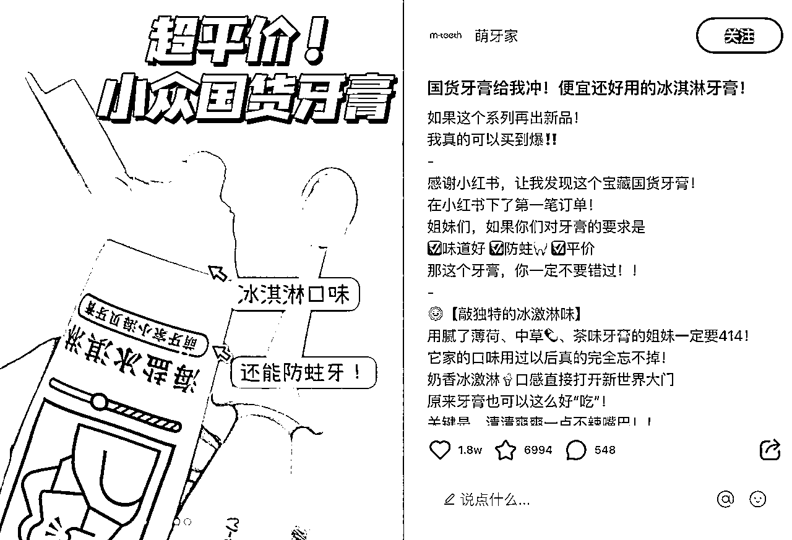

1.  攻略类

将自己的攻略分享出来，给用户提供价值。如旅游攻略、购物攻略、穿搭攻略等

难度：⭐⭐

变现：⭐⭐⭐

优点：内容很容易吸引互动，也容易增加个人故事亮点

缺点：内容制作难度大了一点点

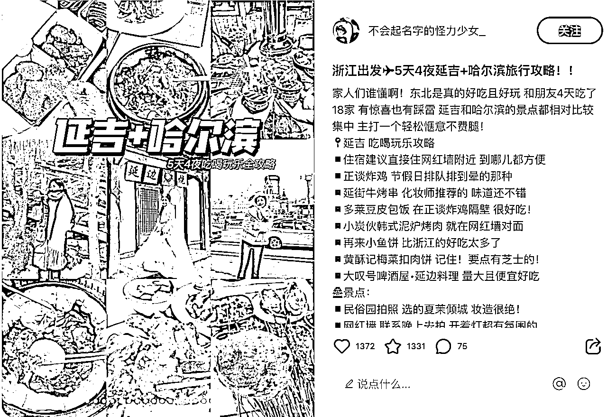

1.  解决问题

给用户解决某一个问题

难度：⭐⭐⭐

变现：⭐⭐⭐

优点：内容很容易吸引用户，而且变现空间大

缺点：用户问题容易找不准

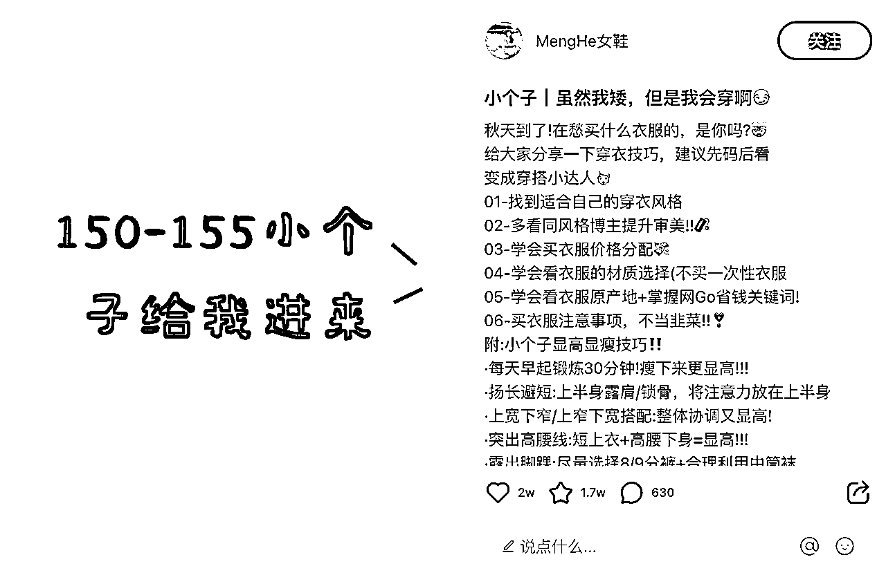

1.  测评类

测评类可以分为多个产品测评和单个产品测评。多个产品测评一般都会介绍每个产品的特点和优缺点，并给出选购建议

单个产品测评可以完整测评产品的优缺点，并给出是否购买的建议

难度：⭐⭐⭐⭐

变现：⭐⭐⭐

优点：内容很容易吸引用户，变现空间大

缺点：内容制作难度大

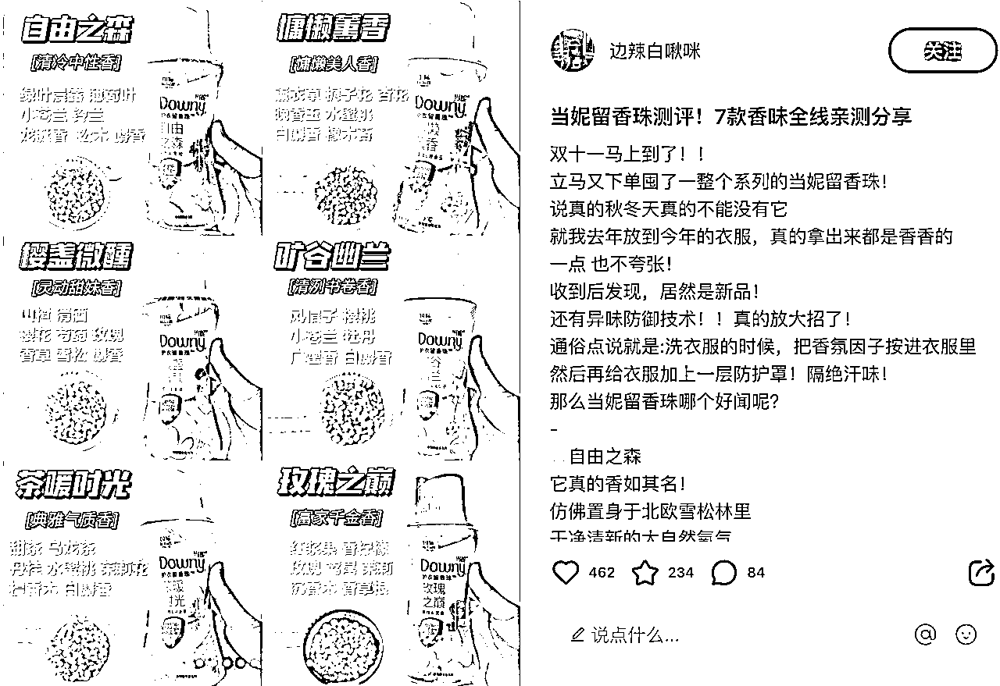

1.  产品合集：

多选一：

多个相同的产品一起推荐，分不同优缺点，用户可以选择其中最适合自己的一个，与测评比较类似

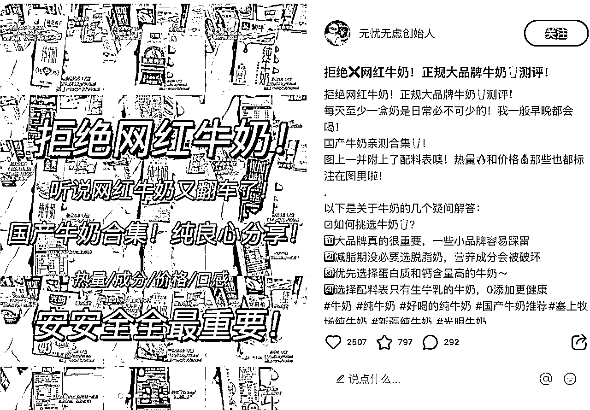

多选多：

多个不同的产品一起推荐，用户可以选择其中的一个或者多个

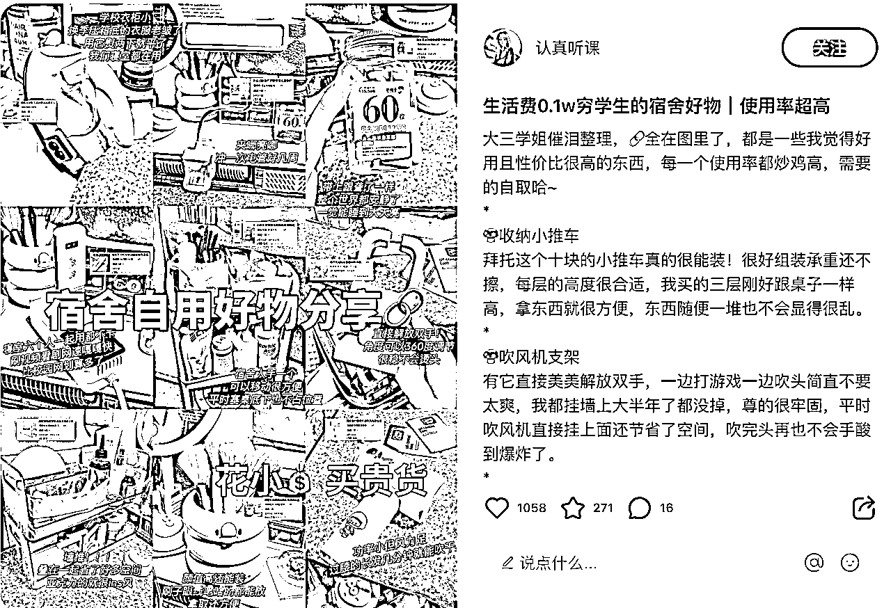

难度：⭐⭐⭐⭐

变现：⭐⭐⭐

优点：内容很容易吸引用户，变现空间大

缺点：内容制作难度大

1.  教程类

教用户某一个技能，如化妆、穿搭、拍照、修图等等

难度：⭐⭐⭐

变现：⭐⭐⭐

优点：内容很容易吸引用户，变现空间大

缺点：内容制作难度大

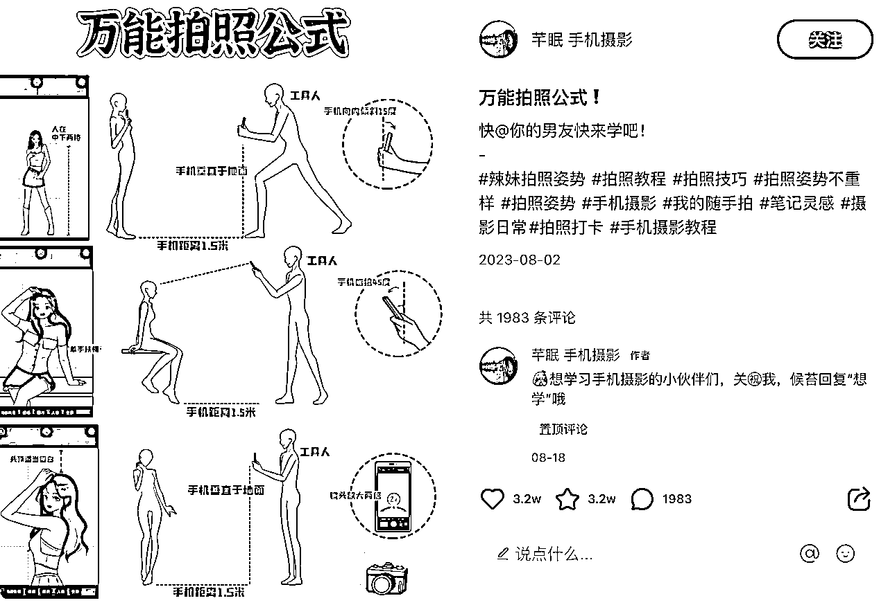

1.  养成类

记录成长过程，如素人求改造、挑战做自媒体……

难度：⭐⭐⭐⭐

变现：⭐⭐⭐⭐

优点：内容很容易吸引用户，变现空间大

缺点：内容制作难度大，变现周期长

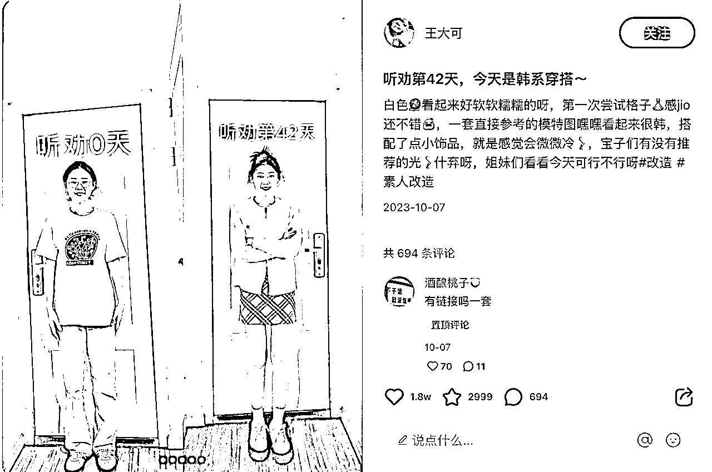

1.  科普类

每天科普一个小知识

难度：⭐⭐

变现：⭐⭐

优点：内容很容易吸引用户，获取关注很容易

缺点：变现周期长，空间小

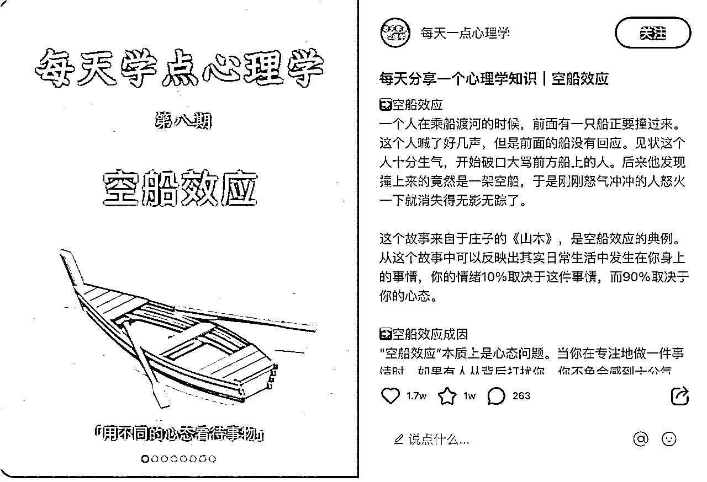

# 账号和人设定位

账号定位 = 赛道 X 用户 X 价值 X 人设 X 视觉

一个账号，包含运营赛道、目标用户、账号价值、人设和视觉，其中最重要的是 目标用户和人设，其他都是在这两点的基础上补充

## 赛道选择

赛道选择可以参考这几个原则

1.  选自己感兴趣/擅长的赛道

人只有在做自己喜欢或者擅长的事情，才会真的花心思认真做。

在选择赛道的时候，不要看别人哪个做的好，更重要的是自己是否擅长，是否足够喜欢？

比如较火的几个类目：穿搭、护肤、美妆彩妆、健身、户外、宠物、美食、家居、母婴育儿等

喜欢好看的衣服，也喜欢自己搭配衣服，就选穿搭

经常健身，就做健身。喜欢折腾家居布置，就做家居，只有一个好看的书桌，就可以做书桌好物的开箱

很多方向可以选择，但一定选择自己喜欢或者擅长的

1.  离钱近（容易变现）

当然，只有自己擅长还不够，还要离钱近。谁也不能一直为爱发电，做小红书最终就是为了赚钱的。所以选择一个离钱近的赛道也很重要

如何判断离钱近不近？

参考千瓜、灰豚数据、蒲公英的博主报价以及商家合作数量就可以判断

一般情况下，蒲公英平台的内容类目里，大分类和小分类有的赛道，变形情况都还可以。靠前的：美妆、护肤、身体护理等，这些赛道变现都不错

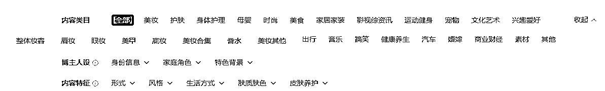

1.  赛道有前景

除了自己擅长，离钱近之外，赛道的成长性也很重要。有些赛道可能近一两年能火，后面不确定性很大，也许会被管制或者没人关注，都有可能

1.  赛道组合

前期赛道定位并不是唯一，不是做了 A 就不能做 B ，需要结合用户、价值和人设综合决定，如果价值基点下移，赛道可能出现多种组合方式

举个例子：

1.  如果只教穿搭或者美妆单赛道，起号快，但天花板低

1.  想学习穿搭的人，有一部分会对美妆感兴趣

1.  想学习美妆、穿搭的人，更底层的需求是想变美

1.  当运营穿搭账号遇到瓶颈，可以让价值基点下移，从教穿搭，到教女生变美

1.  加入美妆、发型等让女生变美的内容

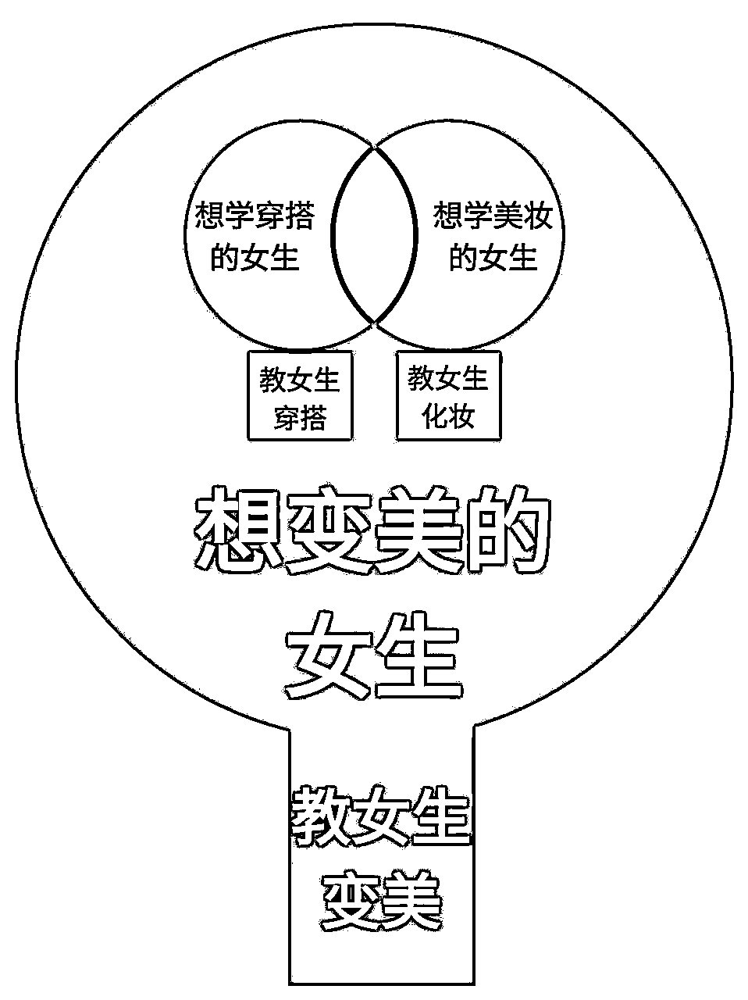

其他赛道一样

1.  基于价值做垂直，聚焦精准人群和需求，起号快，天花板低

1.  遇到瓶颈后，可以扩散人群，价值点下移，圈选更大的人群

## 确定目标用户

在运营之前，一定要想明白你的目标用户具体是谁，你能给她们带来什么价值？

如果没有明确的目标用户，就不知道自己真正能提供什么价值，选题和运营的方向就会很乱，越做越没底

注意，目标用户不是“粉丝”，而是一个具体的人

比如：

要做一个减肥账号，目标用户可能有：“想通过吃来解决肥胖问题” 的人和 “想通过锻炼来解决肥胖问题” 的人

不同的用户，要做的内容不同，第一种用户，我可以推荐各种减肥餐，或者推荐 “食养” 类产品，做的选题也围绕 “不用运动减xx斤” 来写

如果是第二种用户，我就需要分享各种锻炼方法，分享很多减肥的运动动作，我还可以推荐运动、健身工具或者相关产品

很多人运营小红书没选题，做不下去，很关键的原因就是根本不知道自己的用户到底是谁，所以选题就没了方向

## 账号价值体现

账号价值跟变现方式相关，先确定变现方式，再考虑账号价值的问题。

在这一步，只需要考虑：你要赚谁的钱？

如果你要赚小红书用户的钱，那就考虑：你能给用户提供什么价值？在用户眼里，你是什么样的人？吸引来的用户能不能为自己付费？

举个例子

我需要赚小红书用户的钱，我的变现方式是引流私域做知识付费。我给用户提供的价值是：解决自媒体运营/变现的问题，在他们眼里，我是运营导师（专业的人），吸引来的用户会经过筛选，留下愿意为我付费的人

如果要赚商家的钱，就考虑：你能给商家带来什么？产品曝光还是销量？粉丝会不会通过自己的账号来买商家的产品？

举个例子：

我要赚商家的钱，第一阶段是做产品曝光，第二阶段会开带货。所以我内容中需要增加产品的曝光机会（广告位），并且内容要开始植入种草元素（推荐产品），为后续带货打基础

## 人设打造

实际上，在确定好赛道、用户和价值后，人设就会变得很清晰。如果确实比较模糊的话，可以再看下个人博主的人设特点：个性鲜明、识别度高、有记忆点、接地气、不营销。

人设一定要真实，最好是从自己擅长的地方着手。一开始不要做的太复杂，简单模仿对标账号就好。如果人设虚假、或者一开始做的很复杂，后续可能会导致人设崩盘，人群不精准

除了人设特点，自己的性格爱好、优缺点、年龄、地域、身材、语言等都可以作为人设的标签之一，也可以综合一起做一个人设

还不明确的话，分享一个个人定位公式：

你是一个帮助XXX解决XX问题的XX人

例如：

我是一个帮助新人博主解决流量变现问题的自媒体人（6年自媒体操盘经验）

我是一个帮助小个子女生解决穿搭不好看问题的时尚达人（小个子女生，会穿搭）

我是一个帮助高中生解决高考成绩不好问题的学习导师（高考状元）

## 视觉定位

简单的视觉定位，就是确定自己做图文还是视频。这个结合自己实际情况来就行

个人建议，小白先做图文，快速做控制变量法测试，确认自己的文案是没问题的，再拍摄视频

直接拍摄视频的话，在测试时，不好判断问题出在哪。可能表达不行，也可能拍摄不好，或者文案不行，很难判断

所以可以先做图文，把文案相关的问题排除了，再把内容拍成视频

如果做矩阵，推荐口播矩阵，这是原创度最好的一种。可以去掉写稿子的步骤，采用问答、采访的形式做口播，不断地问问题，不断地回答，再把每个问答整理成视频

# 爆款内容制作流程

这里仅以部分图文笔记举例

## 如何找对标？

1、直接搜关键词

关键词不要搜太小众的长尾词，最好选择跟领域直接相关的关键词

比如做细分穿搭，可以直接搜：初恋感穿搭，或者直接：小个子穿搭

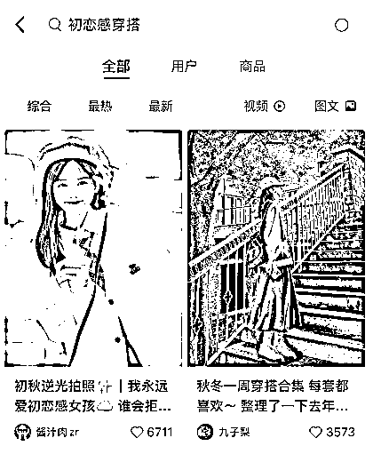

2、搜话题池

大部分笔记都会添加话题，在找到第一个合适笔记的时候，找到相关话题点进去，里面还有很多使用同话题的笔记

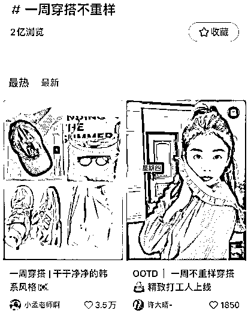

3、第三方工具

通过千瓜、灰豚数据等工具找到相关领域笔记，筛选出近期涨粉高并且与领域相关的账号和笔记

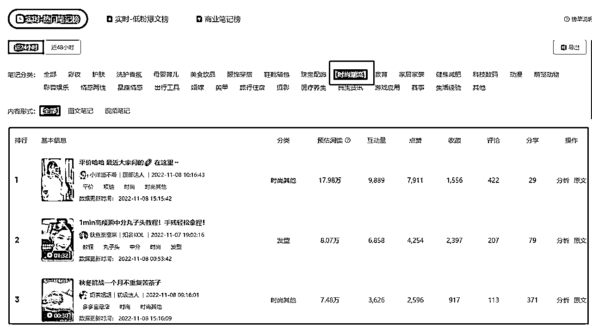

4、发现页自然推荐

平时多刷相关内容，利用小红书算法，让平台给你推更多相关的优质笔记

## 拆解对标的维度

从变现、定位到人设，逐个拆解。但注意，拆解账号不是为了模仿，而是提升网感

1.  对方采用怎样的变现方式？跟自己的是否一致？

1.  笔记和账号中，有没明确具体的目标用户是谁？跟自己的是否一致？

1.  账号价值体现在哪里？怎么体现的价值？

1.  能不能从内容中，看出对方是一个怎样的人？

1.  对方的笔记看起来是怎样的？自己能不能做到？

1.  对方的选题写什么类型的比较多？爆款内容主要集中在哪些选题？

1.  笔记的标题有没有明显的规律？

1.  内容结构是怎么样的？跟自己想做的是不是一样？

1.  ……

账号拆解工具推荐（随机账号举例，尊重原作者，勿搜）：

1.  灰豚数据，可以把对标账号的笔记导出，在分析标题和数据。新用户可以领取15天会员

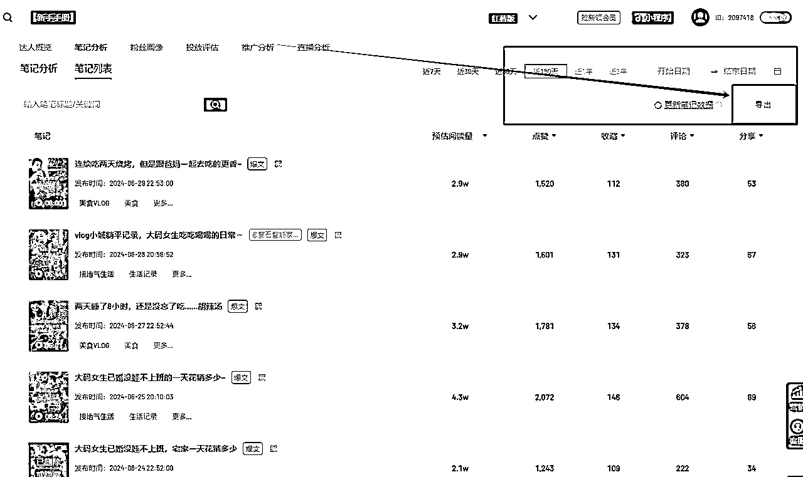

1.  Kimi 阅读助手（浏览器插件），免费可用，可以在用户主页，让 kimi 分析简单内容和人设，但只能通过标题和账号简介分析，也能从这里看出对方的人设有没有做好

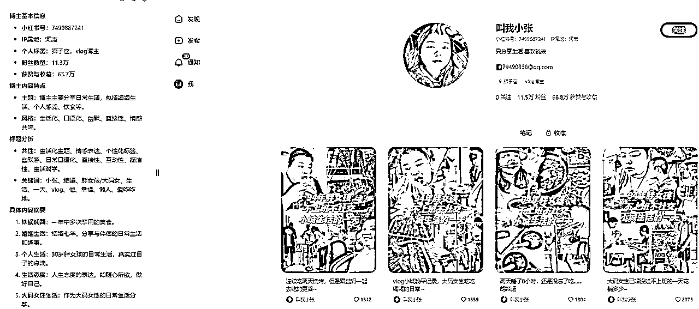

## 爆款选题制定

当你按流程进行到这一步，把变现方式、账号定位和人设确定好后，其实你至少已经有了 20 个以上的具体选题。如果还不确定，这里再分享几个 “抄对标” 式的选题

1.  对标选题

找到对标博主的账号，进入挨个进入主页，看近期发布的10篇笔记是否有一篇笔记的互动明显大于其他笔记？如果有，而且互动量较大，也可以加入到选题库中

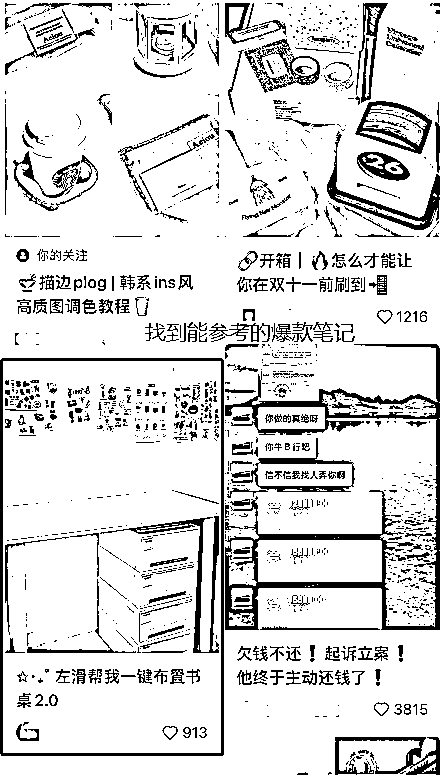

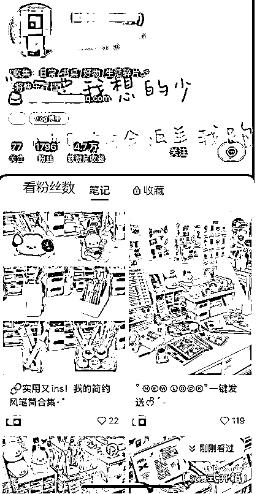

如上图笔记中，选择的笔记互动量有900+，但平时的互动也就1~300左右，那这个选题就是很不错的参考

除此之外，还要看笔记的发布时间，最好是在一周内的爆款，参考价值才比较大

1.  关键词选题

搜索一个关键词时，会产生一系列下拉词，可以在下拉词中找到你比较适合自己的关键词做选题

除了下拉词，搜索结果中还会有一栏小词，也可以作为选题

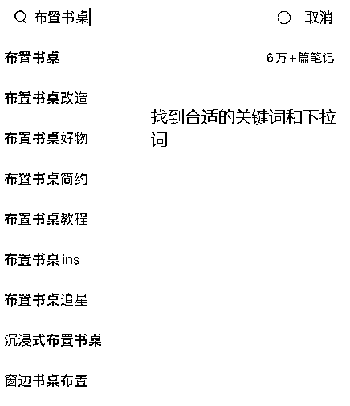

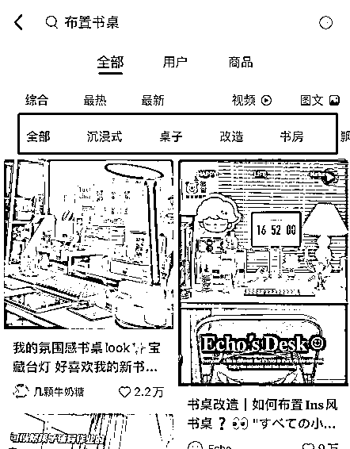

在展示的搜索结果中，按照1中说的方式去选择合适的对标笔记

1.  评论区选题

在爆款笔记的评论区，也可以找到合适的选题。只要去找到那些粉丝反馈的信息，并且获得很多其他粉丝认可的，都能作为选题之一

评论区点赞数靠前的评论（非手动置顶），都可以去看一下，如果粉丝认同的点赞数高，也可以收录到选题库中

1.  其他平台选题

抖音、B站、快手、视频号、公众号、知乎……等等，这些渠道也可以搜索关键词，看最近大家都在关心什么问题，同样可以看评论区，找相关评论需求的选题

## 爆款图片制作

### 实拍图片

实拍图片部分，我并不是专业的摄影师，小红书也不需要过于专业的图片，所以这里只分享一些基础

1.  拍摄工具：

手机：建议iphone11以上，打开9宫格

桌布：不要太花哨，纯色版也可以

补光灯：如果光线够亮，不需要补光灯。自然光拍出来效果最好

小道具：拼多多可以直接搜索摄影道具，有很多，根据自己产品特性来买。假书、香薰、杂志、小摆件、假花这些拍出来风格还不错

拍摄建议：拍摄前，拿酒精棉擦拭一下镜头！非常重要！另外，如果能在阳光充足，尽量使用自然光，不要打光也不要开室内灯。光线不足再考虑补光问题

1.  修图部分

根据自己产品去选择就好了。修图参数可以直接在小红书搜索：修图参数，如果是安卓手机，可以搜索：醒图修图

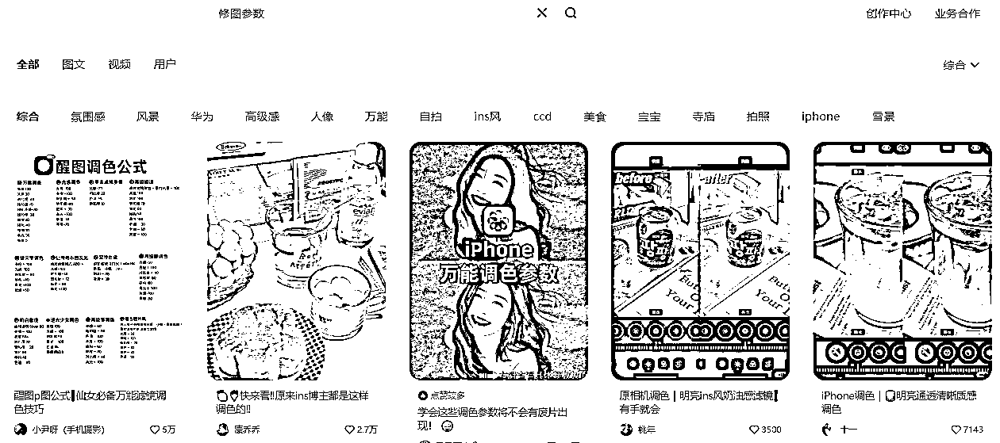

会有很多博主分享一些修图参数出来，也会有一些博主会分享拍摄构图，初学者可以看一下

但是博主分享的参数不能盲目模仿，因为我们拍摄的环境不可能一模一样，所以参数也会上下浮动，我们要了解这个参数的核心思路就可以了

### 设计图片

如果无需拍摄的内容，可以自己用软件去设计。常用工具：

1.  苹果手机备忘录：适合纯文案

1.  ppt/keynote

1.  稿定设计

1.  创客贴

1.  可画

以上除了备忘录，都可以设置图片 + 文字的内容类型。创客贴、稿定设计和可画有很多模板，可以直接用

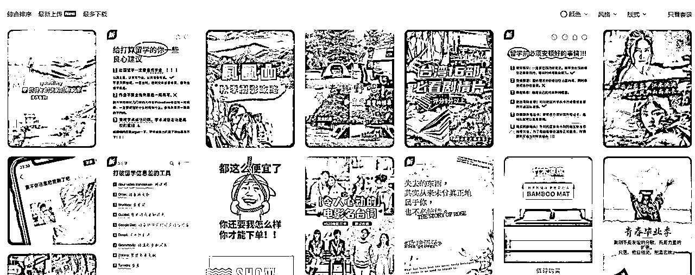

如果不会设计，想模仿别人的，也有方法

1.  找到对标笔记的图片，下载下来

1.  打开软件（以稿定设计举例），建立白色小红书模板（尺寸1242 X 1660）

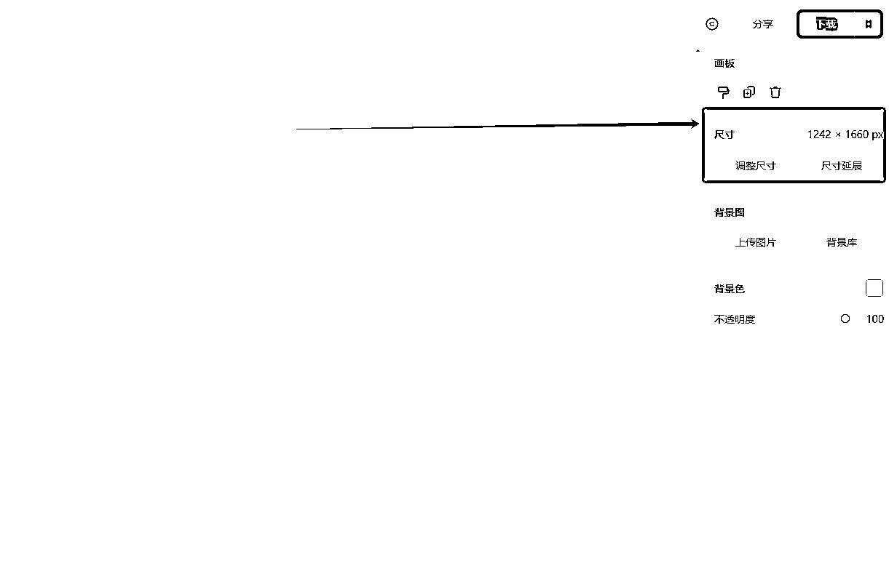

1.  导入下载的图片，设置为背景

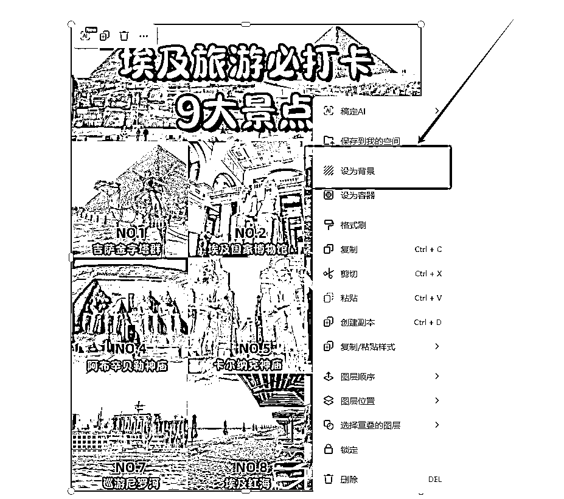

1.  导入图片，1：1 照着做（注意，模板可以一样，但选题、内容必须要做调整）

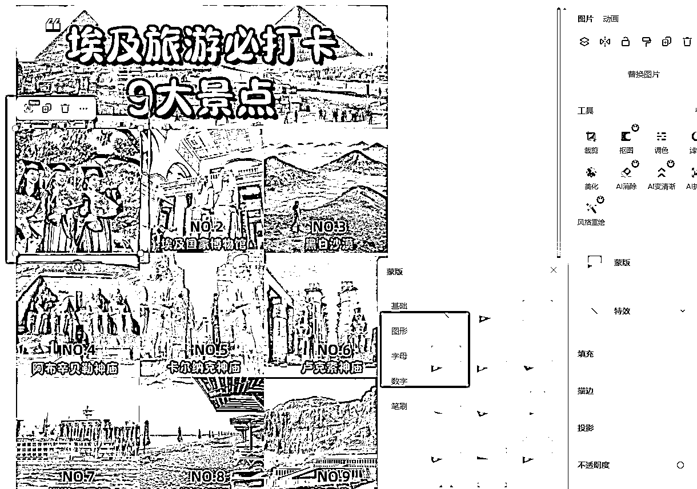

1.  设计完成，导出图片

## 三步快速写标题

分享个小白最快上手的写标题方式

### 筛选标题

在取标题前，搜索同选题的爆款笔记，并找5～10个爆款标题放到excel表

🌰举个例子

想分享连帽卫衣，搜索卫衣相关爆款笔记并收集爆款标题

1.  快看！！这可是今年很🔥的白灰色卫衣！

1.  这件卫衣我简直爱了！上身太绝了～

1.  好喜欢美式复古bm穿搭！复古又可爱～

1.  秋冬的衣柜一定要有的连帽卫衣！

1.  54💰冲下这件燕麦色刺绣连帽卫衣平替‼️

收集到这些标题后，会逐个拆解关键词

### 拆解标题

1、快看！！这可是今年很🔥的白灰色卫衣！

可拆解为“快看”、“今年很🔥”这两个关键词，关键词可以迁移到其他标题使用，并可把“白灰卫衣”替换成其它

2、这件卫衣我简直爱了！上身太绝了～

可拆解为“我简直爱了”“上身太绝了”，这两个关键词可迁移，如果使用后一个关键词，需要搭配上身图片

3、好喜欢美式复古bm穿搭！复古又可爱～

关键词可拆解“好喜欢”“美式复古”“bm穿搭”，这几个都是可以迁移的大关键词，标题比较平，可以选择性模仿

4、秋冬的衣柜一定要有的连帽卫衣！

关键词可拆解“秋冬的衣柜”“一定要有”“连帽卫衣”，这个标题的关键词不好迁移，都是连成句子的，可以选择性使用

5、54💰冲下这件燕麦色刺绣连帽卫衣平替‼️

可通用的关键词“xx💰（金额）”“冲下xx”“平替”，标题主打低价、平替，所以如果低价款产品可以复用标题，把产品词换成自己的

### 重写标题

标题拆解完后，会重写几个标题，再选其一使用

1.  快看！xx💰冲下今年很🔥的xx卫衣

1.  今年很🔥的bm穿搭！上身太绝了！

1.  美式复古卫衣我简直爱了！

1.  好喜欢xx卫衣！秋冬衣柜一定要有！

1.  秋冬衣柜一定要有的xx卫衣！

这样模仿下来，就有几个标题可选，如果使用第一个标题不火，可以在原笔记的基础上修改，换另一个标题

## 写好一个文案

当选题、人设等都确定好后，文案顺着去写就没什么问题

1.  确定选题：把具体的选题定下来

1.  分析文案：再参考5~10篇爆款笔记文案，拆解这些笔记的结构、风格

1.  模仿文案：结合这些笔记的结构和自己的账号定位，搭建一个自己的文案结构

1.  提炼关键词：把选题、文案中最核心的关键词提炼出来，围绕关键词去写。一般情况下，选题就可以等于关键词

以上只是大概，小红书文案没那么多讲究，主要方便用户理解和关键词布局

有些笔记不需要文案，也能跑很好的数据

文案重点：

1.  文案内容尽量不要有生僻字、也不要有难以理解的专业词汇，不要默认用户懂你，一定要写的简单，直接，阅读理解难度越低越好

1.  写文案增加细节，会让内容显得更加生动，比如：

我前段时间去了一趟马尔代夫，看到了很多鱼，马尔代夫真的好美

VS

我去了一趟马尔代夫，在马累机场坐水飞上的岛，刚一下水飞就看到酒店专门组

织了一场欢迎仪式，还有专人管家带着我去放行李和介绍情况。我们住的是水

屋，刚放完行李就看到一群魔鬼鱼在我们这有过去，酒店还带了水上滑梯，可以

从酒店滑滑梯下海浮潜....

1.  发布的笔记一定要带上搜索词，可以获得一些搜索流量。模拟用户搜索习惯，看用户习惯搜什么词，就把什么词加到笔记中

1.  图片、视频里面已经讲过的话，正文的文案里就不需要写一模一样的了

1.  语言简洁。内容越啰嗦，套话多，爆款的概率就越低

## 话题与评论区

话题只要带上与选题、关键词相关的就可以，一般带5~10个，不是越多越好，如果跟关键词、选题无关，带上也不会有任何作用

评论区需要维护，如果比较有信心的笔记，发布 1 天后有人点赞但没人评论，可以适当找1~2个朋友去笔记下评论，然后主账号再去回复

不要发太多无意义评论，比如这样的评论：

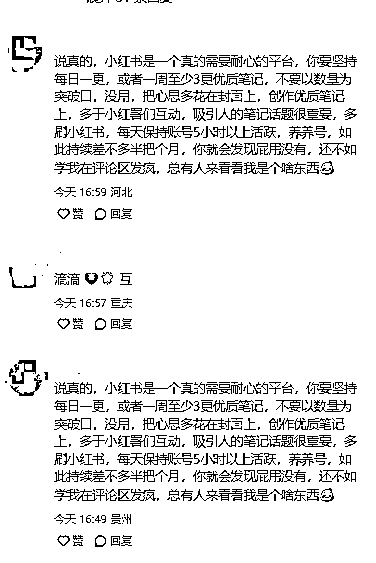

这种评论对一个正常的账号没有什么作用，还容易把人群带偏，把用户的关注点带偏。

## 控制变量起号法

1.  小红书的“变量”

一篇小红书图文笔记由：选题、封面、图片、图内文字、标题、文案、话题标签、定位等元素构成

一篇小红书视频笔记由：选题、封面、视频、视频文案、配音、背景音乐、拍摄风格、剪辑风格、标题、文案、话题标签、定位等元素

所谓控制变量法起号，就是多发笔记，做新笔记时，在原笔记的基础上改变一个元素，再对比两个笔记谁更优秀。

一个笔记的构成元素很多，所以要确认一个优秀的笔记，需要进行多次测试

1.  控制变量法的具体操作

在确定了账号定位、赛道、变现方式和对标后，开始制作笔记。如果是刚接触运营的小白，建议先做图文笔记，方便修改。

以下以图文笔记举例：

第一条笔记：包含封面、图片、标题、文案、标签等元素，做完就发，发布后马上着手制作第二条笔记

第二条笔记：在第一条笔记的基础上，修改任意一个元素，如：更换封面。在第一条笔记发布1小时后，发布第二条笔记

对比数据：

数据明显优秀的，留下，数据差的隐藏。如果第二篇修改封面后的笔记的小眼睛、点赞、评论数等都明显优于第一篇，说明封面点击率不错，可以留下

以此类推，在优秀笔记的基础上，再修改标题、图片、文案等元素进行测试，直到测试出一个所有元素都优秀的笔记

一天对一个选题进行多次对比，第二天用第一天的“优秀笔记”来做另一个选题的测试

# 私域导流

源于去年分享过的帖子，至今这个引流方法还有效，我自己还在用。我精简了一下：

## 确定承接渠道（私域）

承接渠道主要针对私域，如果是站外交易如淘宝、咸鱼等渠道，准备好店铺就好了

私域承接主要有 2 个，微信、公众号

1.  微信号

准备个用于添加好友的微信号，不要用新微信号承接！尽量用老号。如果没有老号，一定记得先养号再加人，一天加人不要超过20个

养号操作：

1.  完善账号信息，如昵称、头像、签名、微信名、地区、性别等

1.  日常更新朋友圈1～5条，不要复制黏贴，也不要更新营销信息

1.  绑定银行卡，偶尔使用微信支付

1.  在大量加人前，每天偶尔加3～5个人，可以自己的朋友，多互相聊聊天，群聊也行

1.  ……

我的养号操作并没有很复杂，有这些操作基本上足够了，前期不要过分营销，一般没什么问题

微信承接有个问题，如果笔记爆了，突然之间加的人很多，容易触发微信风控，而且每天加的人有限，不能全部通过，容易造成用户流失

1.  公众号

公众号能完美解决突然涌入的用户，目前我的一天几百个人关注都不会有任何风险，而且设置相对简单

注册流程就不放了，自己百度搜一下就能解决，这里大概梳理下公众号的基础设置

1.  自动回复：一定要设置关注自动回复，引导用户添加你微信。我一般会引导到菜单栏，方便更换联系方式

1.  设置菜单栏：如果不打算经营公众号的话，菜单栏不要设置太多，有一个“联系”的入口就行

1.  多准备几个微信，在流量突然变大的时候，随时准备更换菜单栏的微信名片

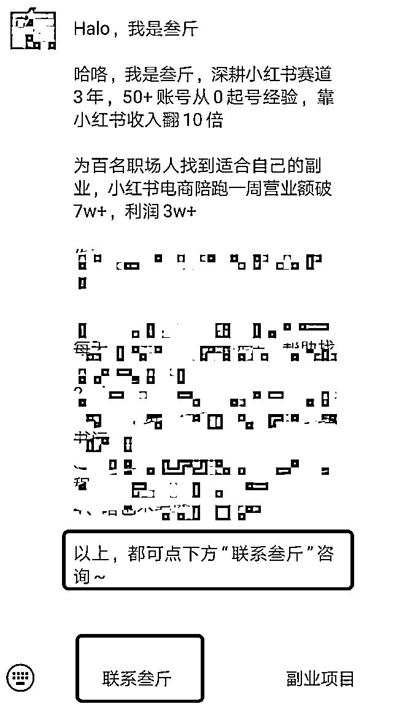

选择什么方式承接，就看自己引流能力和用户精准度。用公众号承接的话，会有大量用户流失，不会直接加到微信。

## 小助理号设置

设置一个小助理号，专门用于引流。需要进行一些设置，名字取成 XX 小助理就够了

做了个笔记，把微信号拆分，再分别写在首图上：图片留微信组合

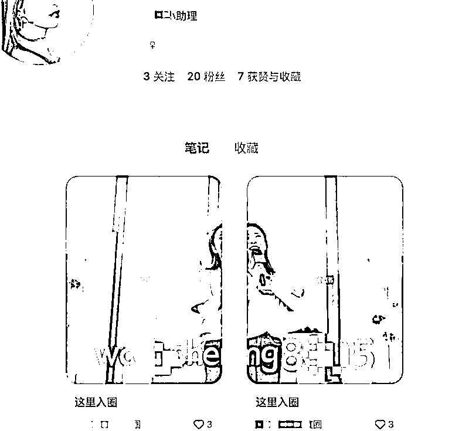

把微信号拆分成2张图，按顺序发布，只发这两个笔记，就能组合成完整的微信号，用户也能看明白怎么添加，目前这个方式还比较安全

## 主号设置

1.  基础设置：

1.  大号收藏小号的2个笔记，别人一点击收藏夹，只有这两篇笔记，可以组合成微信

1.  小红书ID改成微信号，但有被重置的风险

1.  建立小红书群，拉小助理账号进群

1.  简介：

*   @小号指路：简介上可以互相@账号，注册一个小号，命名为“XX小助理”，简介上@小助理，给他一个看小助理的理由，比如：@小助理 领取资料

*   引导关注群聊：简介上引导用户加入群聊，给他一个加入群聊的理由，如：资料在下方群聊，群聊中再发引流信息

*   引导看收藏夹：同上，引导用户看收藏夹，可以写上：资料看收藏夹~ 之类的引导话术

*   引导看小红书号：引导用户看自己的 ID ，如：资料看小红书号~

4 种方式选其一就好了，不用太多，只给用户一个选择，否则用户会乱，不知道该点哪个才能联系你

1.  微信号设置：

小红书的 ID 改成微信号的话，只能改一次，而且如果是手机号，很容易被重置。目前最安全的是：英文+数字，英文+符号，或者纯英文，这样用户看了才比较容易认为是微信号

另外，不要设置的太复杂，要让用户搜索变得更简单，微信号一般是6位数就够了，我的设置了 4 个英文 + 2 个数字，总共就6位，用户输入和记忆都非常容易

1.  背景图设置：

背景图也可以设置成引导群聊、引导看收藏和引导看小红书 ID ，如果不知道怎么设置，也可以不关注这个，背景图的引流效果不够直接

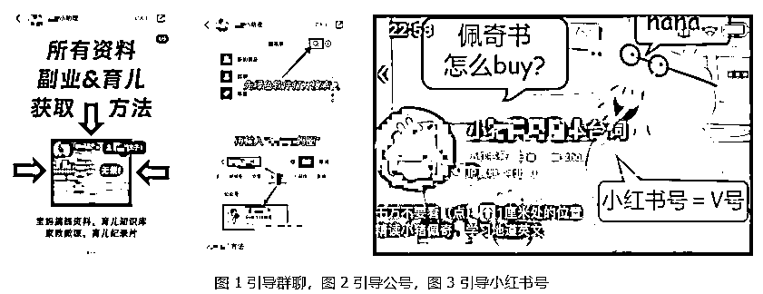

# 运营方向建议

看完以上，对小红书入门运营应该没什么问题了，结合我自己的运营经验，分享一些建议

## 有项目的运营

如果自己有项目，就很简单，专注项目引流就可以

看下以“摆地摊”类型运营，还是“买手店”的方式运营。比较建议买手店模式，打造个人IP，相比摆地摊类型，会更长久，流量更稳定。

现在小红书内容真的很卷，平台流量增长乏力，也是进入了存量市场。而且创作者越来越多，有项目在小红书引流的人也多，内容同质化很严重。

比如搜一个：云南旅游攻略

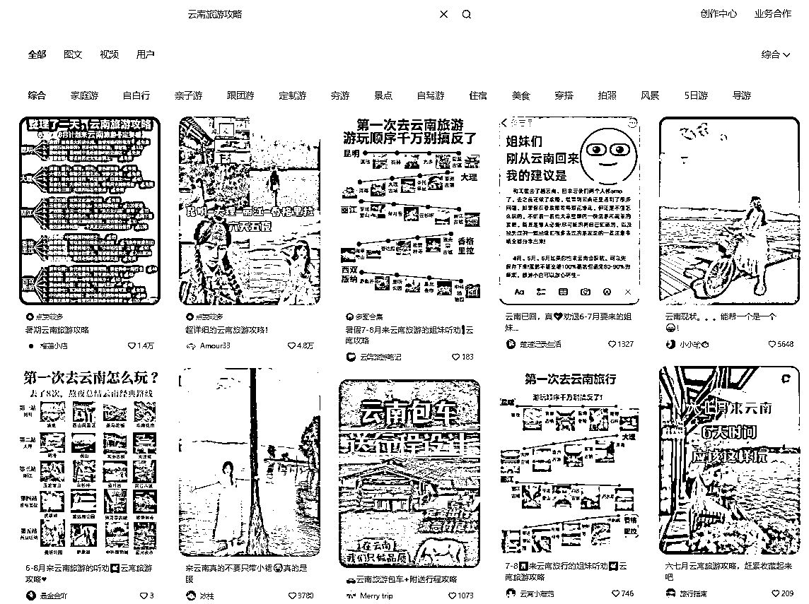

首页展示这么多笔记，只有第二个是真实个人发的，其他全是旅行社安排的内容。还有很多都是套模板的内容，不仅在云南旅游攻略中能看到，搜其他地区的旅游攻略，看到的图片都是一样的

在这种趋势下，做个人IP账号是最快摆脱内容同质化的，而且能增强用户信任度，成交率也是最高的。

## 完全 0 基础起步

如果完全小白的话，只从接广告角度，大概有 3 种方式可以运营：

1.  千粉号接单模式

1.  好物分享模式

1.  个人 IP 模式

### 千粉号接单模式

就是快速把账号做到1000粉，然后接一些直发的广告。这里有几个问题：

1.  广告不稳定，价格低：代发的广告是最不值钱的，哪怕做到5000粉丝，可能报价也只有1~200，而且返点还很高

1.  个人难接单：一般千粉号模式，都有个MCN机构来统一接广告分发，品牌方不会直接找达人的，太费时间

1.  机构抽成高：如果签约MCN机构，很难解绑，而且接单抽成都很高，本来就没多少广告费，机构再抽一下，到手连50%都不到

很多千粉号做到最后都做不下去，因为实名认证的缘故，账号还卖不了。也没办法单方面解绑机构，就很难受，只能注销，所以这个模式我是最不推荐的，不长久

### 好物分享模式

这个比千粉号好一些，同样是涨粉到1000，但是做一些跟好物分享相关的笔记涨粉，内容类型如这些：

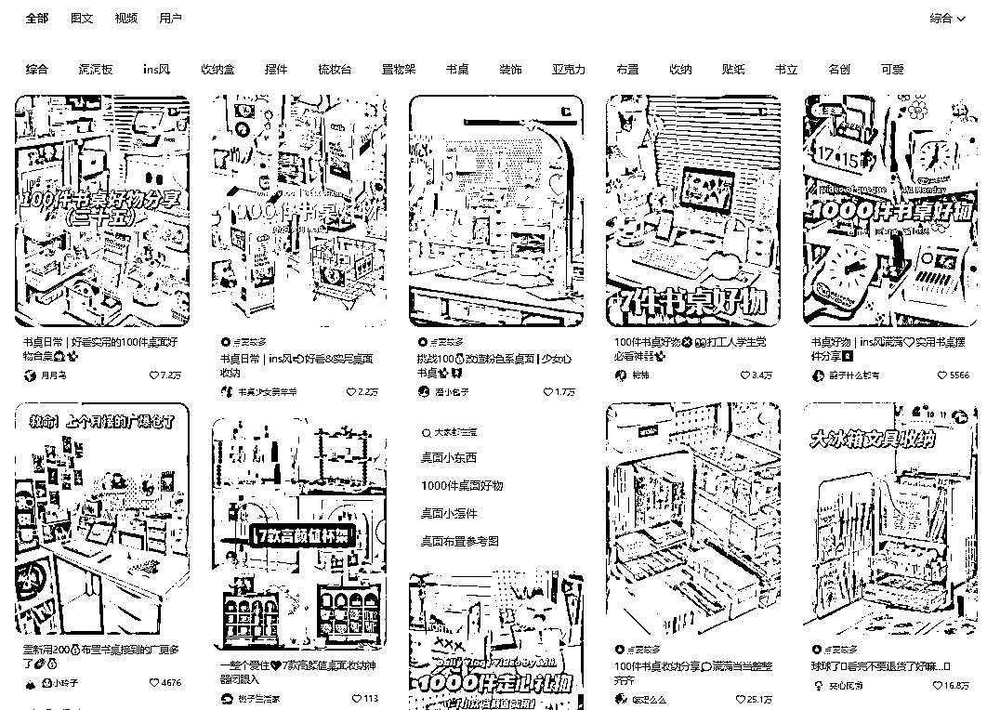

当然，其他赛道也有，比如穿搭、宠物、健身……，就是无人设，纯分享好物。这种模式下，粉丝关注本来也是冲着好物来的，所以比千粉号精准很多，而且会有广告商主动找上来合作，不需要签约MCN也能接到单

缺点有2个

1.  前期什么都没有的情况下，没东西拍，不好起号

1.  因为没有人设的缘故，粉丝追随性也不会特别强，所以报价不高

虽然广告费不是很高，但广告产品可以闲鱼卖掉，也不亏。合作的产品价格跟拍摄调性和选题相关，如果都是低价产品的选题，环境中的产品也是很廉价的，那接的产品价值也不高

如果环境很高级，拍摄水平也比较高，里面的东西都很贵，那么接的产品报价也能提高

### 个人 IP 模式

个人 IP 是我最推荐的方式，至少在这一两年内，这个方向还能做，而且不会比前两种差

当然，做个人 IP 也能接到广告，而且广告费普遍比前两种高。我拆解过很多个人 IP 的接广告账号，平均合作价格都大于粉丝数量的10%，1 万粉的账号也能报到1000以上的价格

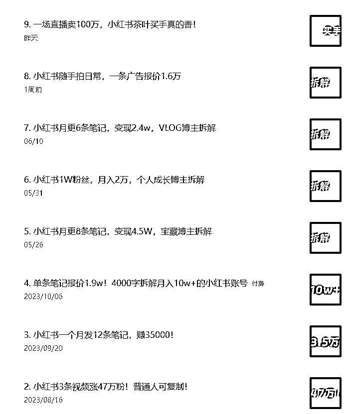

个人 IP 的发展方向，有买手、接广告、引流等，而且 IP 在做起来后，粉丝有追随性，即使换类型或者赛道，只要还是同一批粉丝喜欢的，很快就能转型成功

但个人 IP 也没那么容易，如果只是取了一个个人化的名字，但笔记依然发着套模板的洗稿笔记，这种只能算是普通账号，不算个人IP

个人 IP 一定是有很强烈的个人色彩：

1.  即使是干货输出，也有自己的个人故事、经历、经验、观点在里面

1.  如果只有干货输出，也不算 IP，因为用户看谁都一样

1.  带有个人化的笔记火了，才能 IP 搭建起来

1.  你在简介中告诉用户你是谁，也不算个人 IP ，真正的好 IP 是用户能从你的内容中感受到你是谁

# 运营答疑

## Q：修改笔记会不会影响后续曝光量？

笔记是可以修改的，修改后也会影响后续曝光。比如，数据不好的，修改一下首图和标题，有可能数据会更好。

数据好的，如果修改内容时添加了违规词，也可能会违规限流。

另外，修改很大概率会再次触发审核，如果内容比较敏感，处于违规边缘的，尽量不要修改。

如果投放薯条的时候提示广告，可以把可能违规的措辞改一下或者删减掉，审核通过时再次投放薯条，也可能会通过

## Q：一个账号之前流量还行，但是半年没运营了，重新启动会影响流量吗

长时间没有运营的号，可以发一下互动类笔记再用。如果数据还是很差，看小眼睛情况，个位数的，可以申诉看是否违规。如果几十几百的，那就没问题，互动类笔记如下：

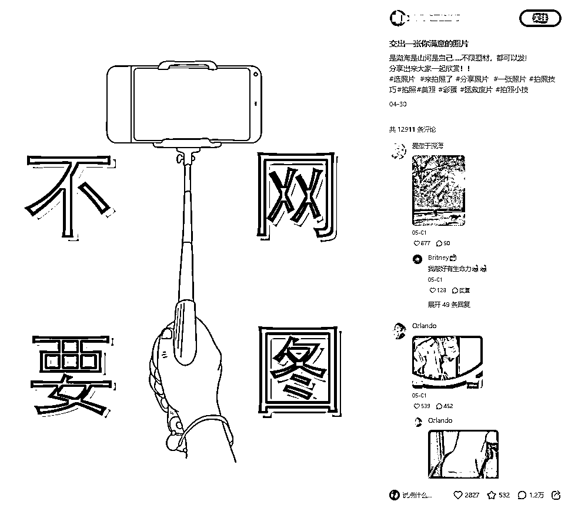

## Q：一部手机可以同时登录、切换多个账号吗？

切换登录没问题，前提是做的内容不是敏感、容易违规的类型。如果是高风险赛道，不建议切换和同时登陆

## Q：想换赛道的话，应该换什么比较合适

如果有粉丝基础换赛道的话，首先考虑粉丝人群，换的赛道跟原有粉丝人群相似或者重叠的会好一些

如果没有粉丝基础的话，直接换就行。

具体换什么赛道，可以从变现方向考虑，离钱越近越好

## Q：能不能几台手机同连一个WiFi运营

1、账号是容易违规的类型，比如需要引流的，就用4G，否则1个账号违规，容易连带同一WiFi其他账号

2、正常做账号矩阵，如博主接广告变现的或走平台转化，就不需要担心WiFi问题

但是如果你要引流私域，最好还是用4G，安全一些。

更多问答可以看下我整理的问答集：

-

以上就是所有内容啦，2024已经下半年了，一起把小红书搞起来~