# 小白入局成人用品赛道,25天变现19000+

> 来源：[https://riodtlbegu.feishu.cn/docx/FFgHdIN4oovvETxZy5wchLhMn5b](https://riodtlbegu.feishu.cn/docx/FFgHdIN4oovvETxZy5wchLhMn5b)

# 前言:

大家好，我是锦城，加入星球也有三年了，目前自由职业。

每天都习惯在星球逛一逛，但是基本都是潜水状态，很少发文章

大学四年做搜一搜引流和公众号引流和淘客收益600W+

最近跟朋友测试了一个情趣卖货的项目，两个人20+天营业额大概19000+左右

部分收益在微信里面，就不展示了。

先上收益图

这个收益在行业内算很低，目前我跟一个小伙伴两个人操作了大概26天左右,营业额20000+,利润18000+

除了一些引流款，每一单的利润至少100以上

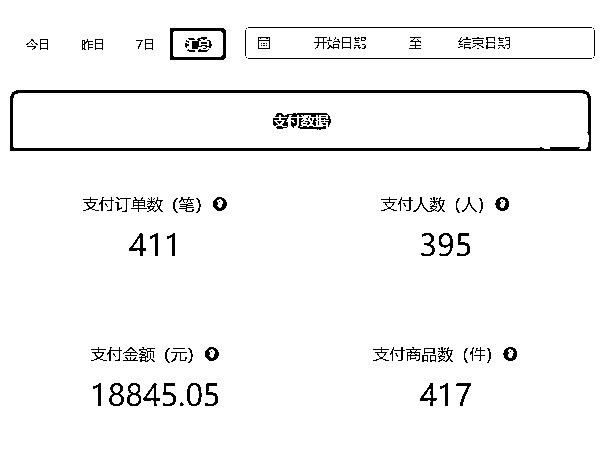

其中收益最高的一天营业额:

营业额高主要是当天有视频爆了，播放量大概跑了30+万，几千个评论

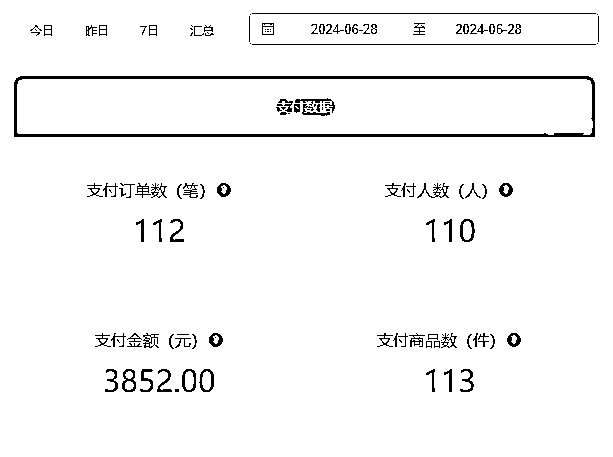

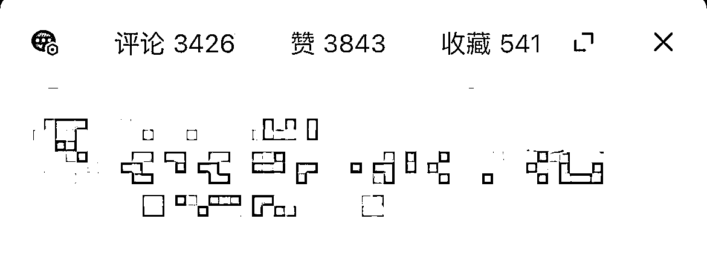

看到这里的哥哥姐姐们，听我啰嗦几句。

今天刷到短视频听到一句话 "少年得志易翻船,大器晚成方为道"

这句话的意思是:

过早的成功可能会带来的负面影响。少年时期取得成功，可能会让人过于自信

甚至自大，忽略了持续努力的重要性，从而在未来的道路上遭遇挫折甚至翻船。

很不巧，这句话说的就是我，从小家里比较贫困，领了几年的低保，高三毕业之后就开始想办法赚钱

误打误撞就接触到互联网，直到大学毕业，大概收益600+万，19年大学毕业，年龄24

跟一些朋友相比,当时以为自己收入算比较高的，现在回想一下，只不过是赶上时代的红利罢了

如果没有赶上自媒体时代，压根就没我啥事，真的很幸运。

到后来，自己所在的行业就不好做,渐渐的后面就都放弃了。

毕业之后就买了房子和车子，我这边省会城市，房价实在是太高，整备完之后，身上估计就剩一百多万

后面投资了一些项目，包括一些实体项目，接着疫情就来了，基本都亏了。

好在房子和车子都已经买下来，基本上生活也没有什么压力。

期间也做过大大小小的项目，包括闲鱼无货源，小红书电商，视频号直播，私域卖货等等

也都跑通了，赚过几百元几千元都有的

但是心里总有一个想法，总感觉这些项目不是很好，想着如何能够做一个长期项目，一个项目一直做

天花板高一些，能月入十万，几十万等等，一些乱七八糟的想法。

实际上并没有那么简单，之前的成就让我总感觉自己可以再来一次

结果恰恰相反，经过漫长的摸索之后，也没有成功，到后来才明白过来

其实自己就是吃上了时代的红利，实际上，自己就是一个普通人,把自己的姿态放低，从最基本的开始做起。

记得有一次跟曾丽姐，

非常详细的说了一些自己从小到大的过往，说的非常详细,包括自己取得的一些大大小小的成绩，还有当时自己的心态等等，总之非常详细

曾丽姐非常暖心的给我回了好多段60s的语音【截图找不到了】

总体的意思就是 让我放平心态，做项目不是一下子奔着月入十万去的，很多人都是在一个项目刚出来有红利的时候

疯狂的吃平台的红利,先做起来，赚到钱。

也让我找到自己的优势，资源等等，也可根据自己的优势去寻找适合自己的长期深耕的行业。

等等，说了很多，这里也非常感谢@曾丽姐。

现在已经放平心态,不管做什么项目都从最基本的做起来。

践行长期主义

不选择今天做明天就能看到钱的生意

选择一些短期有收益,长期有价值的事情去深耕。

好了，言归正传

## 我为什么选择这个行业?

说来惭愧，并不是我选择这个项目，而是跟一个认识了很久的互联网大哥聊天

跟我聊最近测试的一个项目

10万流量每天营业额2000-3000，基本成本就两百多。

后面语音聊了一会，跟我说了一些大概起号逻辑等等

我就找了一个小伙伴直接开测。

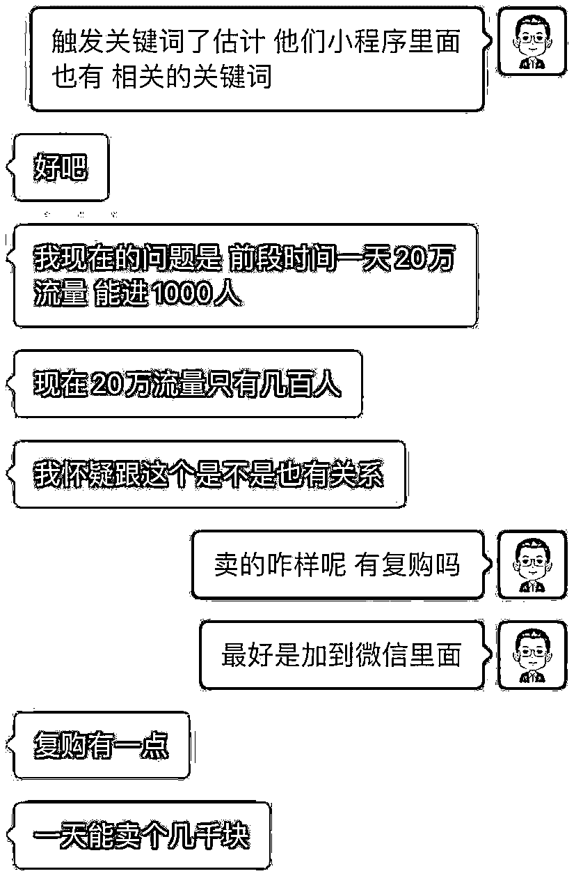

# 如何从0-1跑通成人用品行业【一些经验和走过的坑】

## 一.项目思路

如果是女生做的话,效果会好更多!

有的客户有时候想听语音什么的，也比较麻烦！

* * *

1.找货源

2.完善后端

3.添加同行 学习话术

4.学习一些基本知识

5.开始引流---转化---复购

### 1.找货源

货源我们在1688上面选择超级工厂,实力商家等等，尽量多找几家，同一个商品，每家的价格也有高有低，有的人在1688上面也做无货源,仔细辨别。1688商家基本都有联系方式

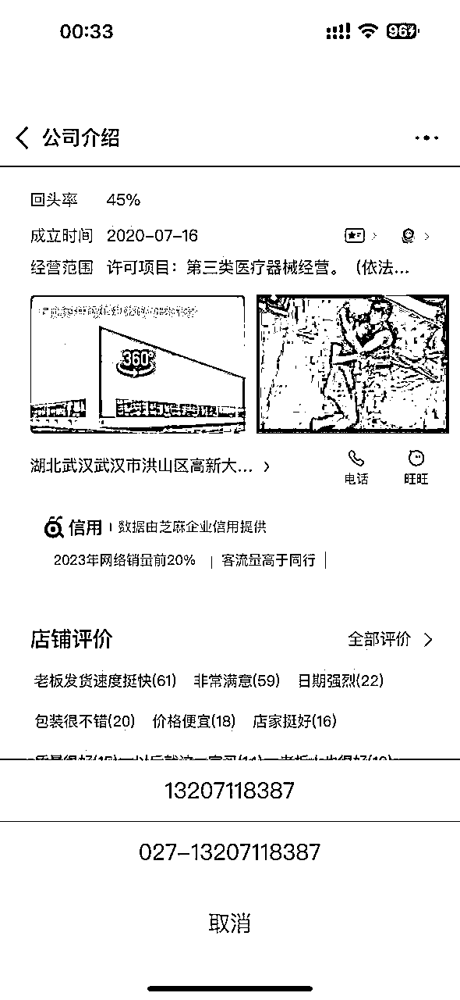

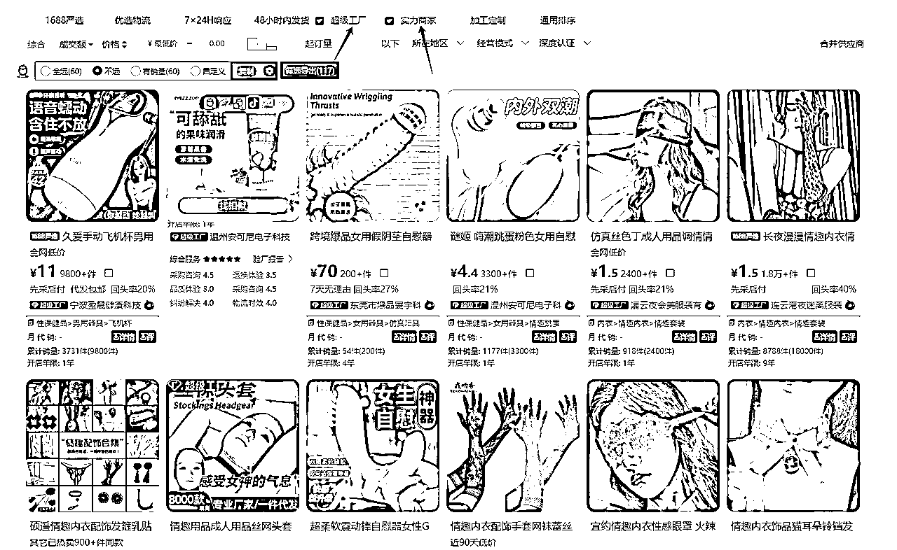

多找一些,多做对比,问一下售后问题等等。

### 2.完善后端

搜索了一些对标账号之后统计发现，基本都是小程序商城做为后端

我就去闲鱼上面搜索了几家能做情趣用品商城。

每家都问问价格，后续加到微信里面发同行的案例给他，问他能不能做同款，多问几家

最后谈下来大概一千多一些就可以出来。

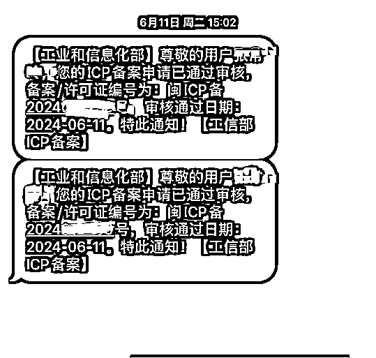

但是小程序从开始到备案上线，一共花了十几天，这个很致命，那段时间流量特别好，但是我什么都没干

我朋友10万流量跑2000-3000营业额就是那段时间

后续等我小程序上线之后，一样的流量只能跑一千多了！如果流量好的话一定要及时想办法吃到流量

比如可以直接注册一个公众号，先导流到公众号走付费进群系统或者直接引流到私域等。

这是我自己走的其中一个坑。

小程序上线之后还需要除了自带的商城系统，自己还需要设置一些页面，比如把好卖的商品放到首页等等。

### 3.添加很多同行,准备各种各样的话术

到时候顾客加到后台来,会问很多莫名其妙的问题,大家也都知道,买这些东西人什么都有

怕很多问题回答不上来，先去添加20个同行，把一些想到的问题先发给同行,等同行回复之后在记录下来

到时候客户加过来，如果有问到话术没有的，就直接在去同行那边问，直接复制回答就可以了，这一部分比较简单

就是比较累

怎么跟客户沟通在这一个行业是一门非常大的学问

好的话术跟不好的话术我们测试过，一天能差几百的营业额

尽量优化好自己的话术

### 4.学习一些基本知识

学习一些行内的基本知识也是非常重要的，比如:

1.有哪些tt的牌子性价比比较高

2.男性用的有哪些

3.女性用的有哪些

外用内用，情趣内衣等等

尽量一些基本知识都掌握一下，可以更好的跟客户沟通，一些问题单纯靠死的话术也不是很容易都能成交

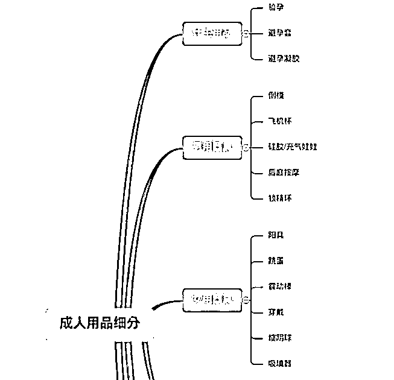

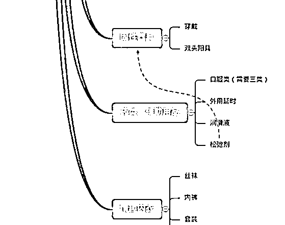

### 5.如何引流

做这个行业一定是会封号的,对纯小白来说还是有一定的门槛

最开始准备了12个抖音账号,小红书账号准备了10个。

目前就剩下5个抖音号,3个小红书号。

抖音基本都是都是七天,然后七天之后就接着发,这样循环

小红书上来就给你一个月,直接解绑手机号,拿原手机号注册新的小红书账号

目前手里能用的就剩几个了,最近找了一些代发来帮忙发视频,效果也会比较好

如果你手里有代发的资源,会轻松很多

每天只需要做笔记图片和视频就可以了。

小红书解绑可以去小红书搜这个【这几天好像有圈友发了教程,可以找一下】

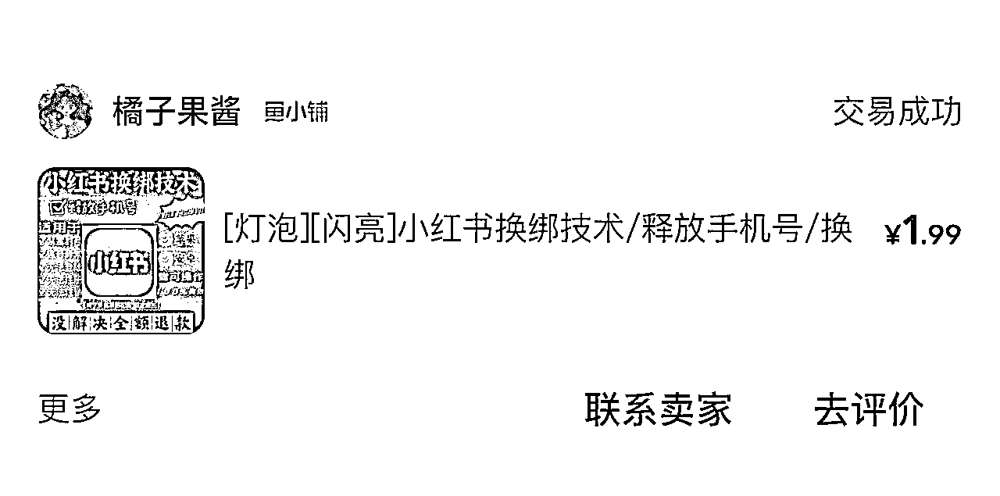

抖音号不够的可以在抖音搜索

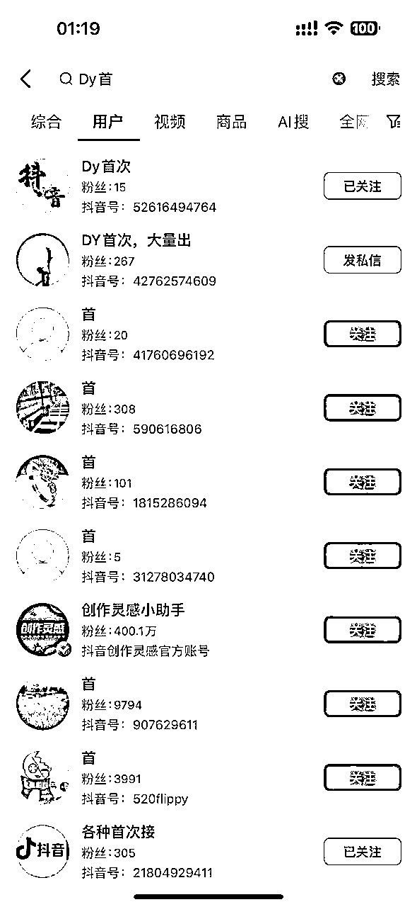

有代发渠道的最好了，这个不好找，可以在闲鱼上面发帖找代发

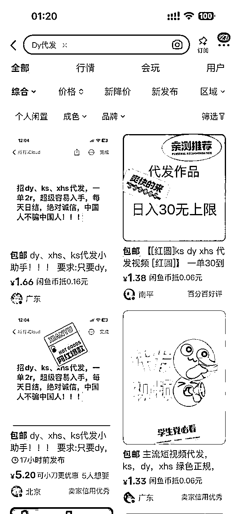

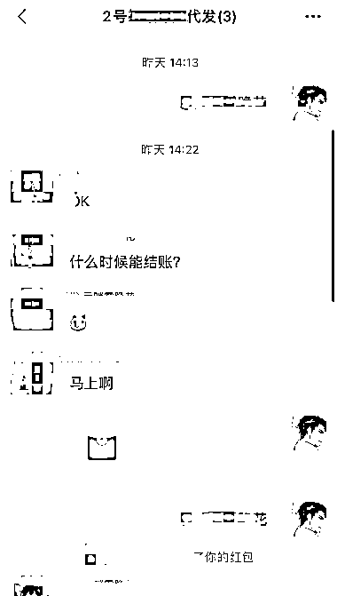

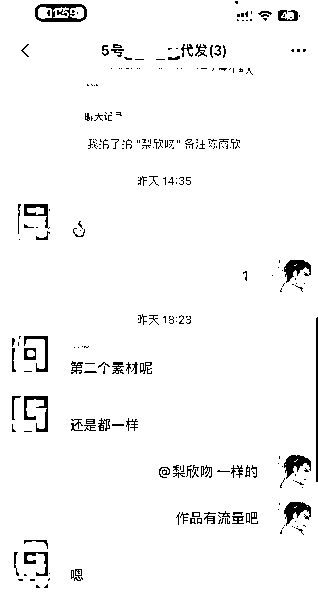

注意，很多骗子，自己仔细辨别！

#### 1.小红书引流

对标账号:

傲娇小公主

小红书号:832470933

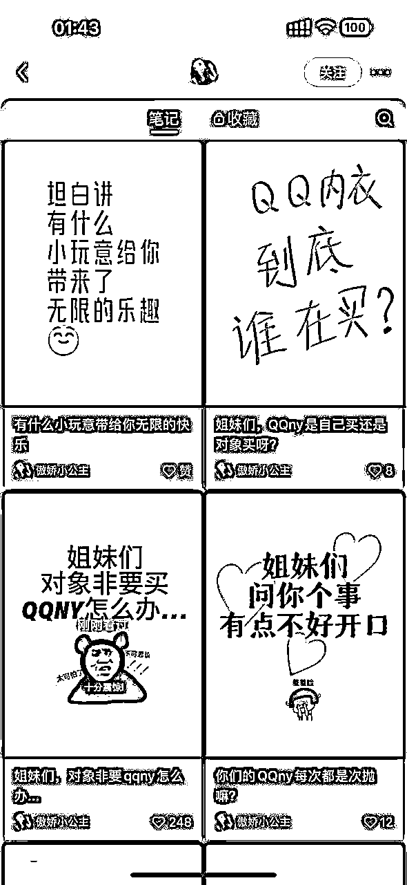

对标账号:

Kitty 酱酱

小红书号:6738266945

用这种笔记主要原因是，我的小伙伴家里面有之前卖剩下的情趣内衣和模型

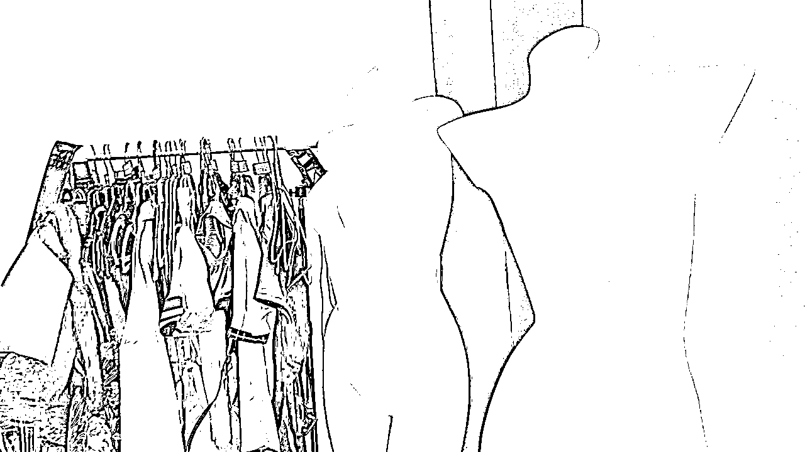

拍摄也非常简单，基本一分钟一条

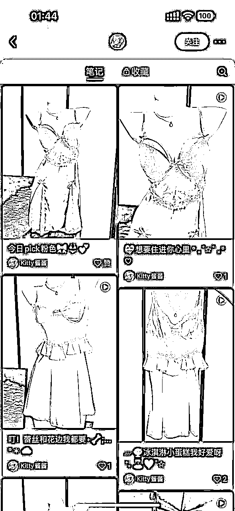

小红书号:2200558221

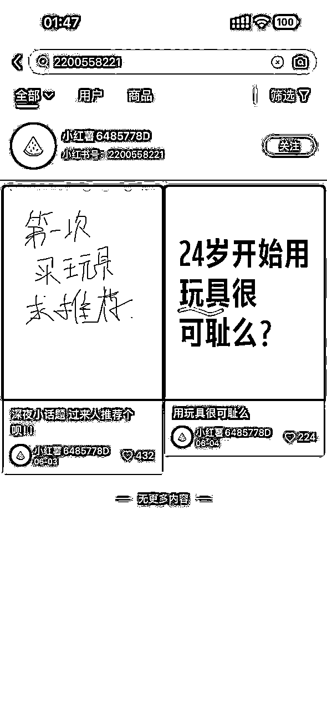

还有一些聊天记录或者玩具测评的,大家可以搜索一下

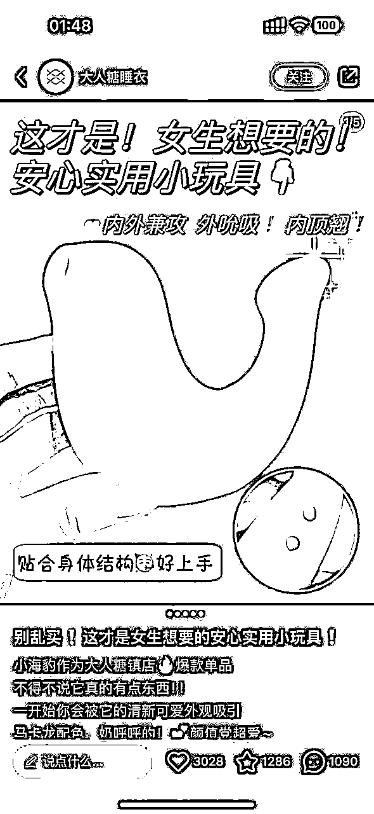

* * *

还有一些玩具实拍，内衣实拍这些，因为我们之前有做过，都有现成的衣服和玩具

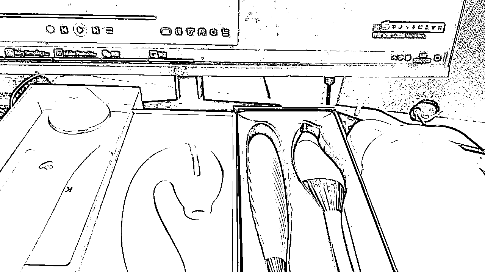

直接稍微拍摄就可以了

如果刚做这个行业的话，就不要用那种形式了

小红书导流主要是加到粉丝群，用小号发微信转化,小红书来的用户大概占20-30

大部分还是抖音的流量

小红书做女粉，抖音做男粉

两种粉丝不一样的逻辑,不一样的话术等等

发的朋友圈也要分标签,最好是分两个微信去承接

#### 2.抖音引流

1.刚注册的新号先刷关键词,刷2-3天，只看视频就可以了

2.第4天可以发一条风景的朋友圈测试流量

3.第5天基本可以开始发引流视频

目前就这样做的,比较简单,但是有一些效果

一些一机一卡一IP，这些老生常谈就不说了，大家都知道的

手机卡去营业厅办理最便宜的，然后办两个副卡就可以了，这些都是最基本的

一些最基本的去重,混剪这些我也不具体展开说了，这些都是基本功

如果这些都搞不定的话,那就说明不适合这个领域。

对标账号:

桃趣工作室

抖音号:50869155164

这类视频比较简单,直接小红书搜索一些美女视频

然后混剪去重就可以了

对标账号:

一口芭乐

抖音号:dgyjvffcbjm

这种大家应该都刷到过 00后在情趣用品公司上班的第x天

这种视频场景比较多,也可以收集很多场景的片段,混剪成片

这种做起来比较麻烦，主要是前期收集素材

不过这种形式流量比较大！

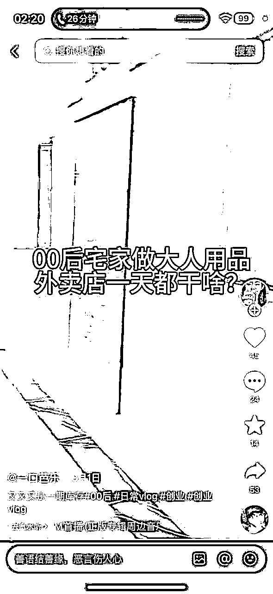

对标账号:悦怜

抖音号:80995181115

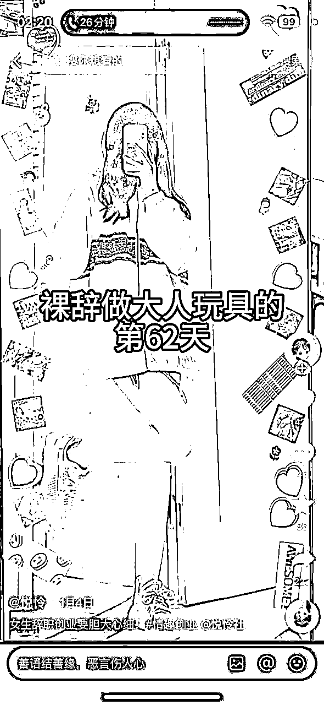

对标账号:T7

抖音号:97855737173

这种聊天记录的视频做起来也比较简单，直接模仿文案就可以了

不过最近流量比之前差一些

对标账号:温玉

抖音号:94172191881

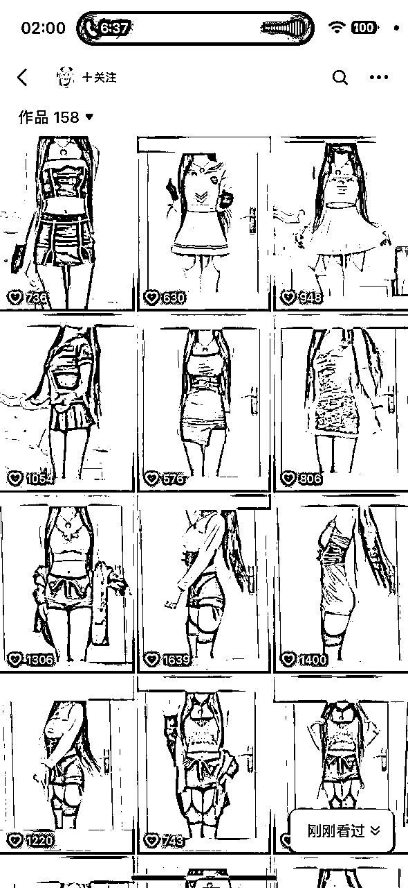

这种视频做起来也比较简单，流量很大，基本都是小红书那边找的美女拿来混剪！

具体做视频的教程就不写了,都比较简单,大家自己研究一下就可以了,不懂的可以问我。

### 6.转化-复购

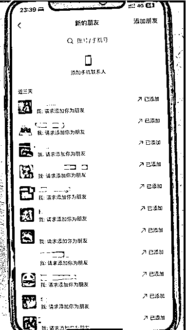

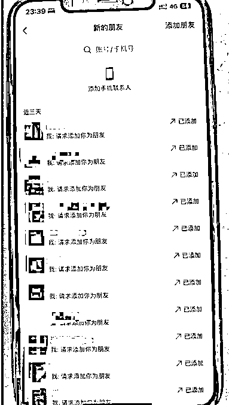

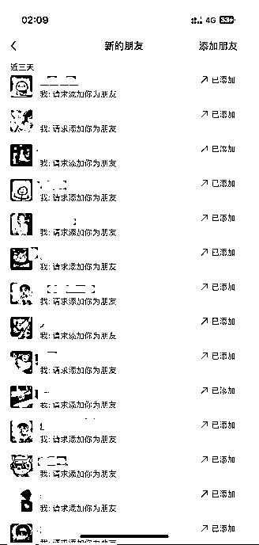

基本每天小程序访问量都有几百

如果加到微信的话 看你筛选不筛选,可以选择下过单的加微信，也可以直接都微信

只要你微信扛得住的话！

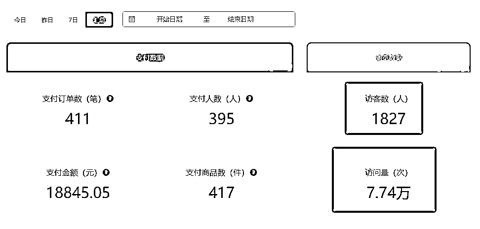

这些客户加到微信之后，就需要用到上面准备的一些话术破冰,成交,复购

同时也需要做好朋友圈的维护

一些下过单的客户打A标签

一些有意向的客户打B标签

加进来不回复的C标签

男，女分别打什么样子的标签等等

根据不一样的标签要发不一样的朋友圈！这个非常重要

可以收集一些写真,脱min秘籍等送给下过单的客户

一些使用技巧说明或者女性需要的东西给女性客户等等

售后做好一些,复购率也会好一些！

抖音导流:

1.简介里面放小程序名称

2.评论区导流

3.粉丝群导流

## 二.总结

#### 一.些经验和坑:

1.这个项目不适合纯小白，封号太严重了，设备也要数量比较多，这个就可以卡死一大片人了。

2.非常容易封号,注意素材，对关注对标账号最新的模板，如果爆了及时跟上

3.太懒的人不适合做这个，基本一天连轴转，发视频+承接客户 就需要大量精力

4.供应链和小程序后端需要非常靠谱,这次供应链就突然来了一次涨价,小程序后台有一次被攻击瘫痪两个小时

损失很多流量

5.要有耐心,视频和笔记发出去没有流量也不要灰心,坚持发就可以了。发多了都会有流量进来的

6.朋友圈非常重要，非常重要，非常重要，有没有复购就看你的朋友圈,这个我也做的不好.还在学习

7.还有很多,一时半会想不起来了

#### 二.感悟

做任何项目所涉及到的技能都非常多,比如今天的 成人用品私域,所需要的基本功就有:

1.修图,图片去重

2.视频混剪,视频剪辑

3.朋友圈运营

4.营销文案

5.成交话术等等

每次做项目能有一部分收获,就非常棒了,不一定是金钱,也可以是基本功

为下次别的项目打好坚实的基础。

写文章不是很擅长,如果有不懂的可以一起交流,业务方面还是没问题的

最后附上目前在写文章这个时间出的单【凌晨2:16分】：

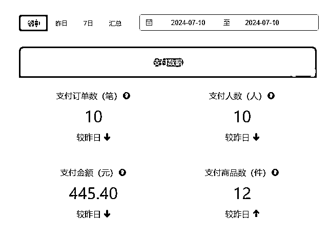