# 社媒引流九亿热度背后的成功：

> 来源：[https://z8qt74rchp.feishu.cn/docx/CustdlXWloBJiRxUhj4c0SPmnif](https://z8qt74rchp.feishu.cn/docx/CustdlXWloBJiRxUhj4c0SPmnif)

通过pipiads大数据检测到广告主aelfriceden多平台广告营销累计曝光近十亿，如此大的曝光时间竟然不到一年，让我们一起来看看该品牌究竟是怎么做到的。

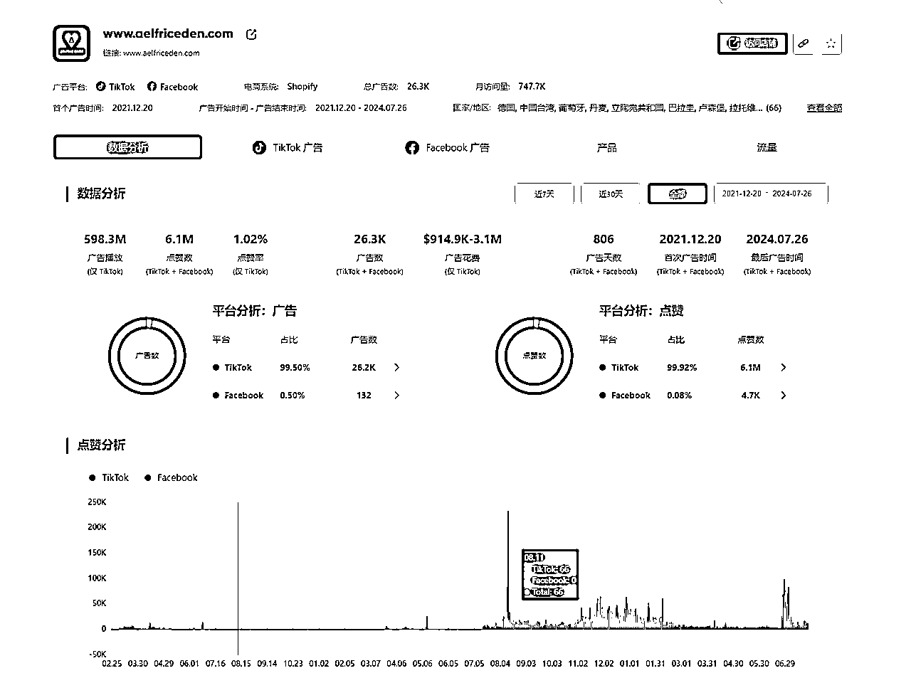

广告主链接：https://www.pipiads.com/zh/advertiser-analysis/62184b819a301ef93d2475db/

街头时尚：全球潮流的新兴力量

街头时尚，作为一种源自城市街头的时尚文化，近年来正以其强烈的自发性、多样性和实用性，迅速崛起并影响着全球的时尚趋势。街头时尚文化日益受到欧美年轻人喜爱，相关产品和市场也在不断被开发。在这个产品迭代速率不断加快、品牌生命周期愈发短暂的赛道上，新兴品牌Aelfric Eden，凭借TikTok上的多元营销手段，成功实现了逆势突围，成为Z世代新宠。

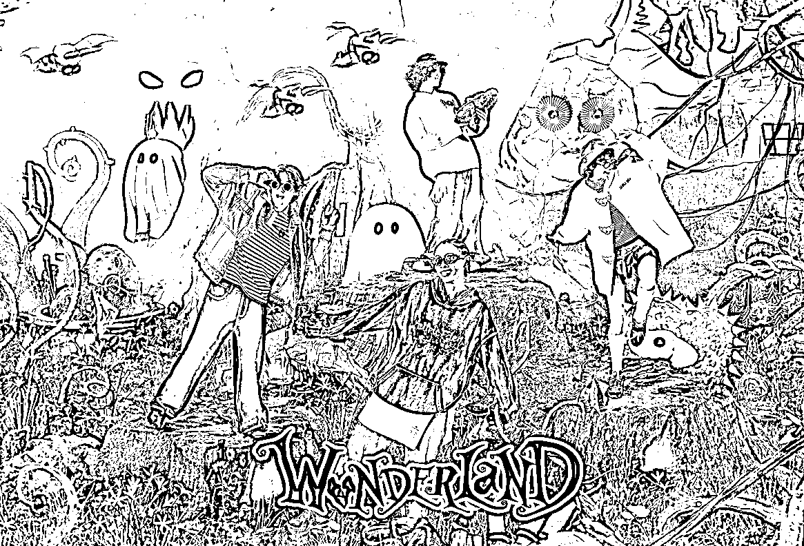

#### 品牌介绍

Aelfric Eden 品牌由一位亚裔美国人创立，融合了东西方文化的影响，致力于将亚洲街头时尚和西方风格结合在一起，形成独特的时尚表达方式。创始人希望通过这种文化融合，打破次文化与主流文化之间的界限，创造出具有包容性和多样性的时尚产品。

Aelfric Eden 的产品包括印花卫衣、图案T恤、夹克和各种配饰等，注重融合滑板、涂鸦、网球等多种街头元素，以设计新颖、时尚的产品吸引了大量年轻消费者。其品牌理念是将不同文化的小众街头元素发展为主流时尚，完美契合了Z世代的多样性和包容性价值观。设计风格大胆、色彩鲜艳，深受全球年轻人的喜爱

据PIPIADS数据显示Aelfric Eden

广告开始时间:2023.08.17-2024.07.23

广告播放:594.2M

广告数：26.1k

广告天数：802

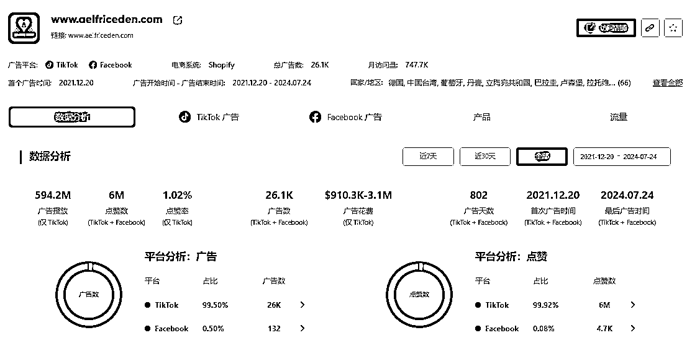

pipiads上线了新功能可查看tiktok和facebook两个平台的投流情况更全面的分析广告数据

可以看出品牌推广主要侧重在tiktok平台

观察广告日程表 品牌推广力度较大

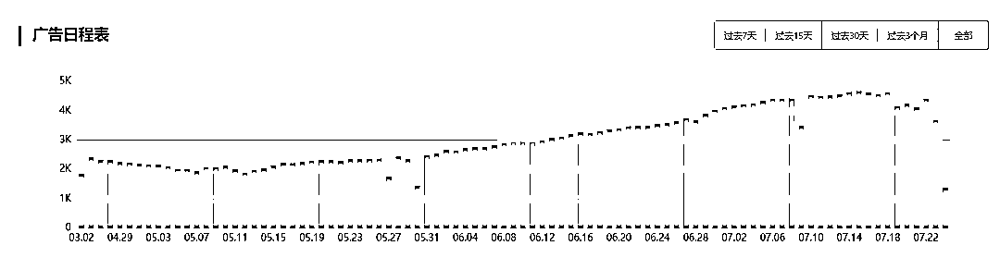

总产品数：176

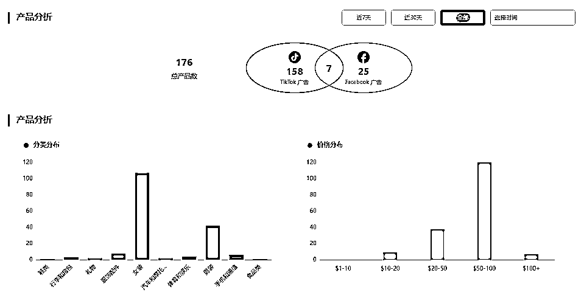

查看tiktok广告素材 共计24.8M播放

视频在短时间内展示了多个场景或产品，能够在有限时间内提供丰富的信息。

场景的快速变化不仅增加了视频的趣味性，还能有效保持观众的注意力。

广告视频链接：https://www.pipiads.com/ad-search/217d89cf4379b209b0fc/

查看网站落地页

Aelfric Eden 的网站设计风格简洁现代，采用大量白色背景和简洁的布局，突出了产品本身的视觉效果。主页通常展示最新的产品系列和促销活动，以大幅图片和醒目的文字吸引用户注意力

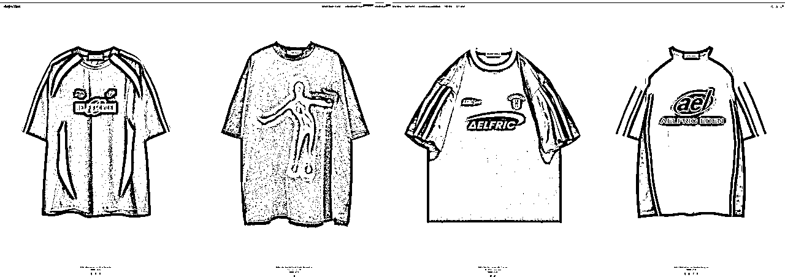

观察网站产品上新情况

目前其独立站服装总数量超2000款，每月更新200+款产品。其价格都在39.95-69.99美元之间。产品的设计采用了

大量街头元素，大量涂鸦/文字贴花、高视觉冲击色彩等。这样的设计满足年轻群体对街头文化及时尚个性的需求。

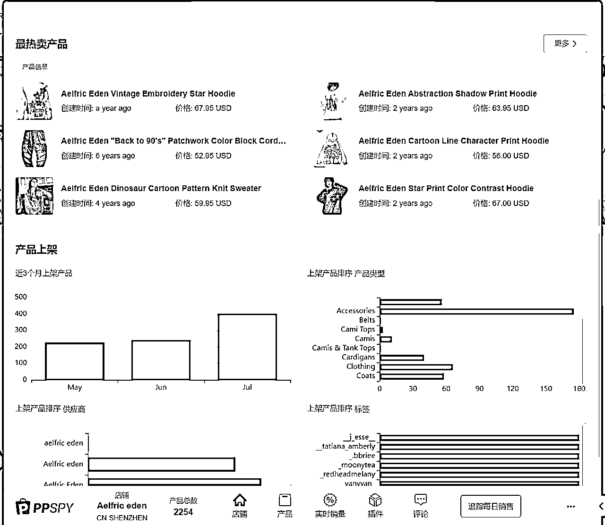

facebook广告素材大多为图片 轮播图

图片广告能够直接传达广告的核心信息。通过清晰的图片和简洁的文字，用户可以快速了解广告的内容和价值。

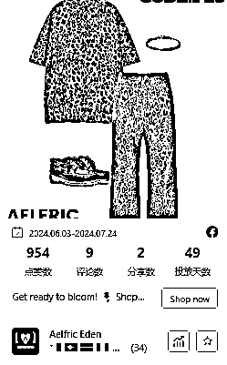

#### 社媒布局

Aelfric Eden在多个社交媒体平台上都非常活跃，包括Instagram、Facebook、TikTok和Twitter等。这些平台覆盖了不同的用户群体，有助于品牌在全球范围内扩大影响力。

查看tiktok社媒账号

主账号粉丝：700.5k 平均播放量：5000~10000+

主要根据产品搭配不同场景 展示服装搭配

Aelfric Eden通过发布创意短视频、挑战赛和粉丝互动，快速积累了大量粉丝。TikTok上的病毒式传播特性帮助品牌迅速提升知名度。

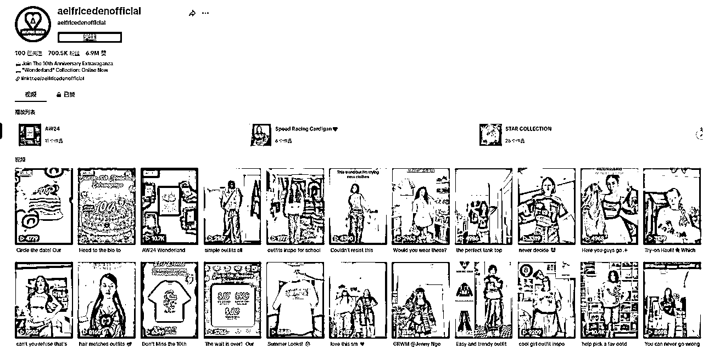

facebook:7.7万粉丝

主要用于发布品牌新闻、促销信息和与粉丝的互动。通过定期更新内容，品牌能够保持与粉丝的紧密联系。

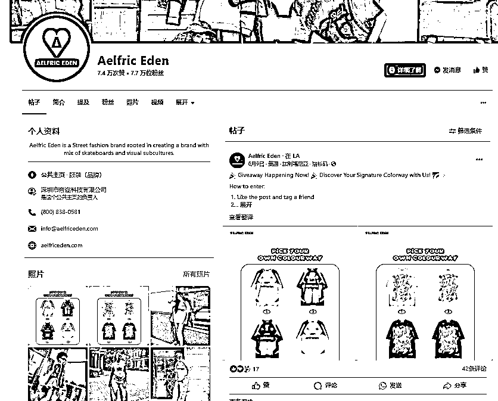

用户生成内容 (UGC)

Aelfric Eden非常重视用户生成内容，鼓励顾客在社交媒体上分享他们穿着品牌服饰的照片和视频。品牌通常会在官方账号上转发这些内容，并通过使用品牌标签（如#AelfricEden）来增强品牌社区感。用户生成内容不仅增加了品牌的真实性和亲和力，还鼓励更多的粉丝参与互动。

Aelfric Eden通过在多个社交媒体平台上的广告投放，成功吸引了大量访客，尤其是在美国市场。其用户具有较高的访问深度和时长，但跳出率较高，在用户体验方面还有改进空间。品牌在全球的布局初见成效，未来可以进一步拓展和优化在其他主要市场的营销策略。

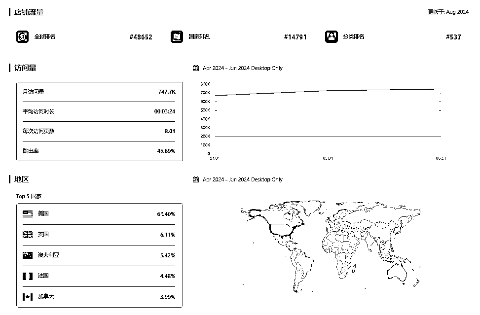

细分赛道的成功策略

Aelfric Eden选择了街头时尚这一细分赛道，通过聚焦服务细分人群的方式，避开与大型品牌的正面对决。相比主流时尚品牌，Aelfric Eden更注重亚文化的深度融合，借助欧美街头文化的流行趋势，打造出具有独特魅力的品牌形象。

广告素材素材拆解

分析tiktok上最爆的三条素材

素材1:2480万广告展现素材

广告文案：Back to schooloutfits ideas#bcktoschool #outfitinspo #fits #fyp

视频素材快节奏，视频轮播图的形式，多套展示搭配+

广告文案前三秒钩子：Back to schooloutfits ideas定位吸引年轻群体

快节奏，视频轮播图的形式，多套展示搭配+ 制作简单

制图工具+图片

素材2：2440万广告素材

广告文案：WHICH HOODIE IS YOUR FAVORITE?😉 #aelfriceden #aelfricedenhaul#hoodie #fall#unboxing #fallfashion#streetwear #viral #trending

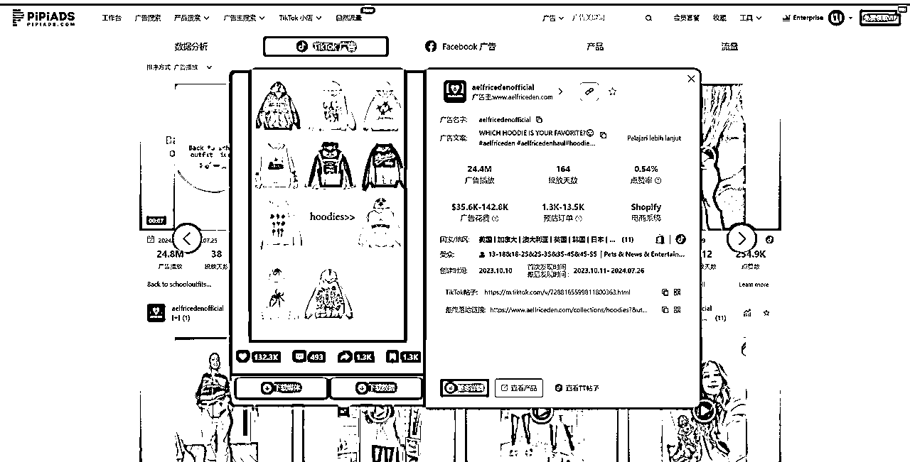

直接套用类似剪映，可画等图片模板，进行品宣和曝光

广告文案前三秒钩子:hoodies>>

素材3：1760万广告素材

广告文案：Tops to wear this summer with your friends #fyp #summer #foryou #inspo #clothes

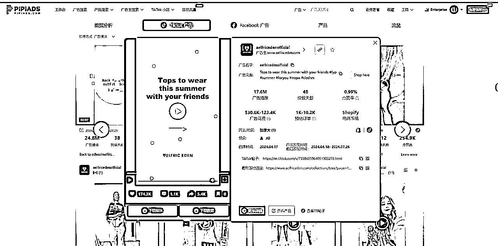

视频轮播图，简单高效。

广告文案前三秒钩子：Tops to wearthis summerwith your friends

分析（仅代表个人观点）：

内容非常简单高效，这个网站对平台的流量理解和算法都非常深刻，但内容缺乏一些细节打磨。图片精美度和设计可以更进一步优化。

优化方向1：图片可以找一些更好看，有高级感的纯色背景图片。

优化方向2：服装的创意百花齐放

pipiads上可以挖掘更多创意素材，也是非常简单好拍的

创意一：

通过抽帧展示出多套服装+多张产品图混搭，达到一个快速过渡的效果。有实景+有图片，刺激冲动消费。

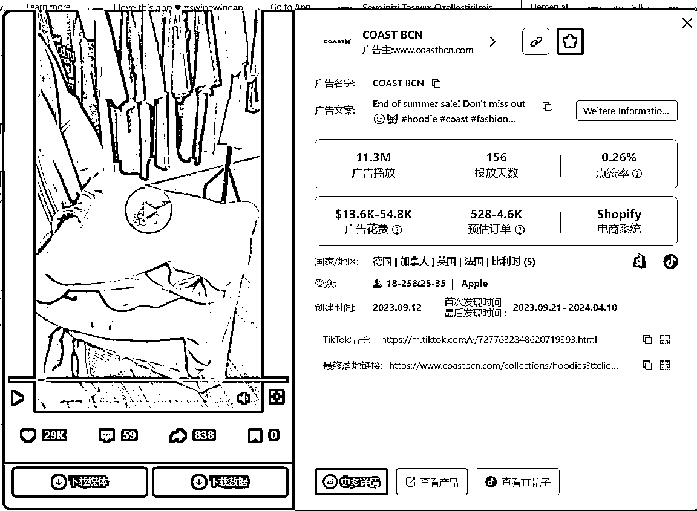

创意二：

反复剪辑出实拍衣服全套展示，前三秒表示真人出镜，后面场景1秒切一个场景快速卡点，展示多套服装穿搭效果。

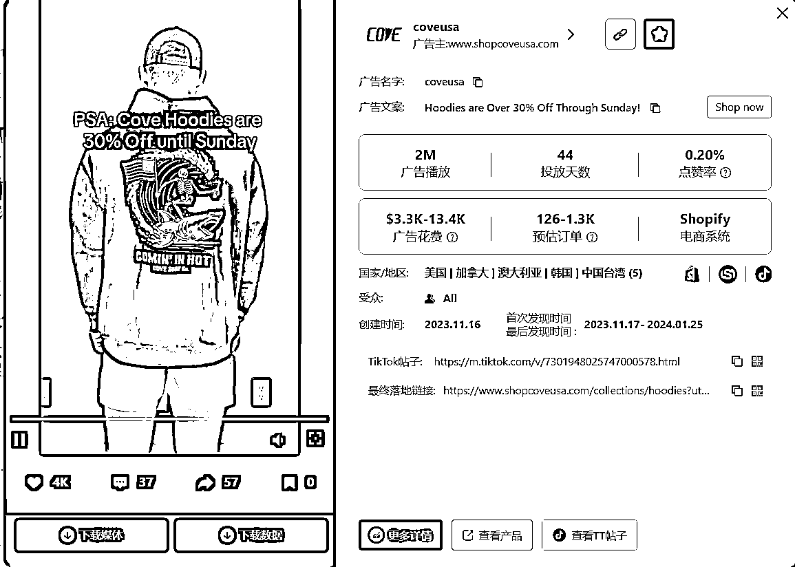

创意三：

反复剪辑出实拍衣服全套效果，如不方便露脸，可全部背部展示，通过肢体动作展示衣服穿上后的效果。

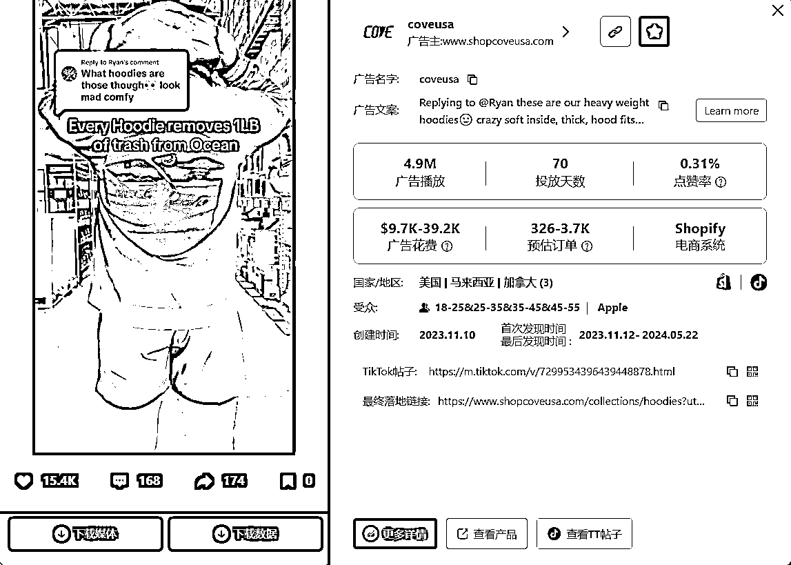

创意四：

多实景人物展示+商品图片展示，增加购买冲动

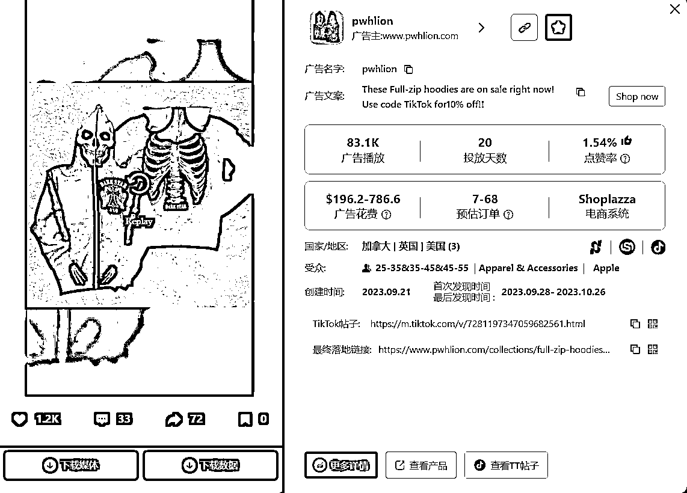

创意五：

可以考虑一个实拍全套穿搭人物展示+一张全套穿搭商品图，造成一个实景展示，刺激冲动下单

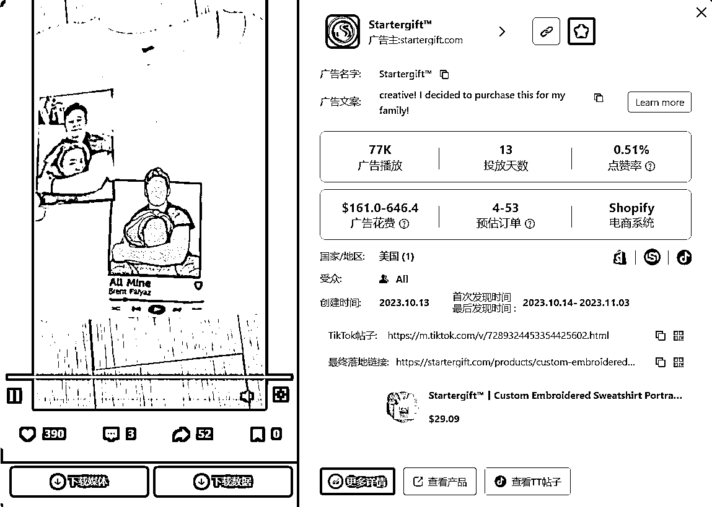

创意六：

情绪文案+基础款服装

可拍摄不同场景的人物背景，沙滩，电梯，商场

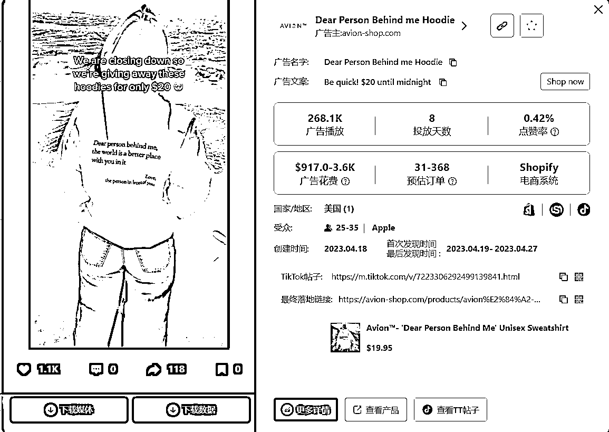

pipiads平台可以挖掘到全球广告营销创作者百花齐放的创意案例

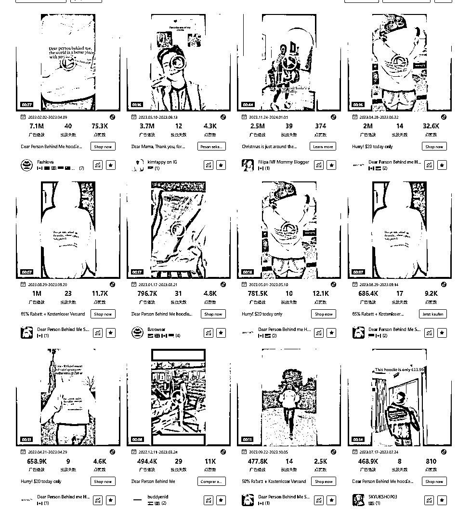

立即使用：www.pipiads.com

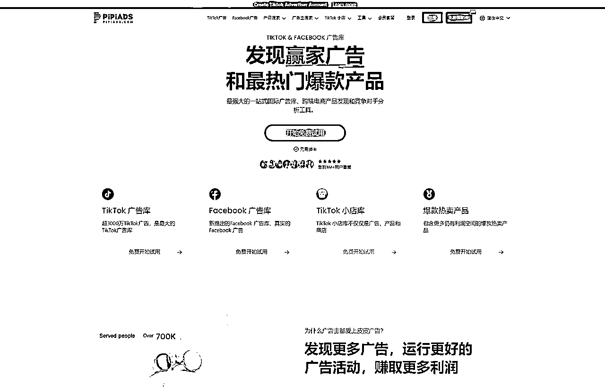

总结

Aelfric Eden的成功不仅在于其产品设计和市场策略，更在于其对文化的深刻理解和有效的品牌传播。通过精准定位、文化融合、多元化营销、KOL合作、注重用户反馈、全球化视野和社会责任感，Aelfric Eden为其他品牌树立了一个成功的典范。这些启发对于任何希望在细分市场中取得成功的品牌都有着重要的借鉴意义。

品牌的成功不仅仅在于产品的独特性和时尚感，更在于其对目标市场的精准把握和对消费者需求的深度理解。